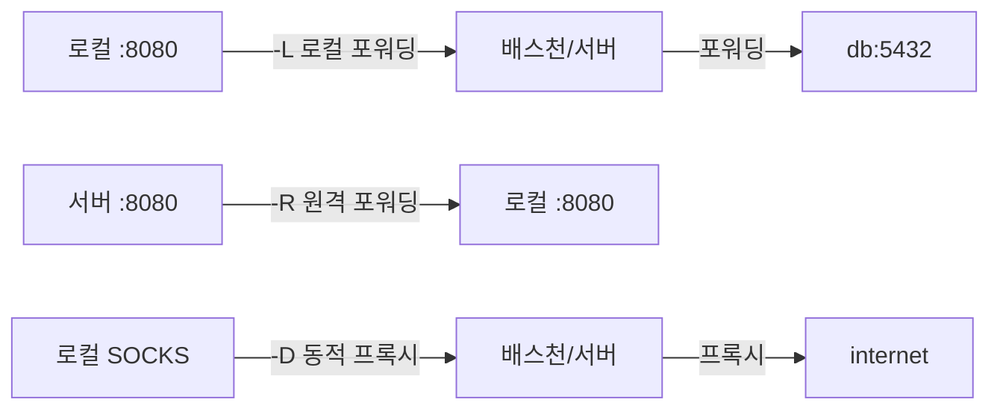
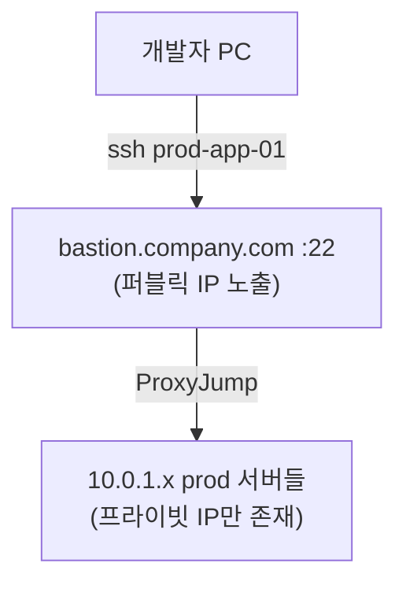
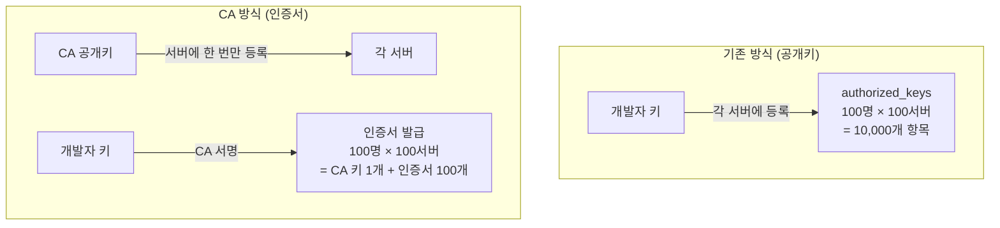
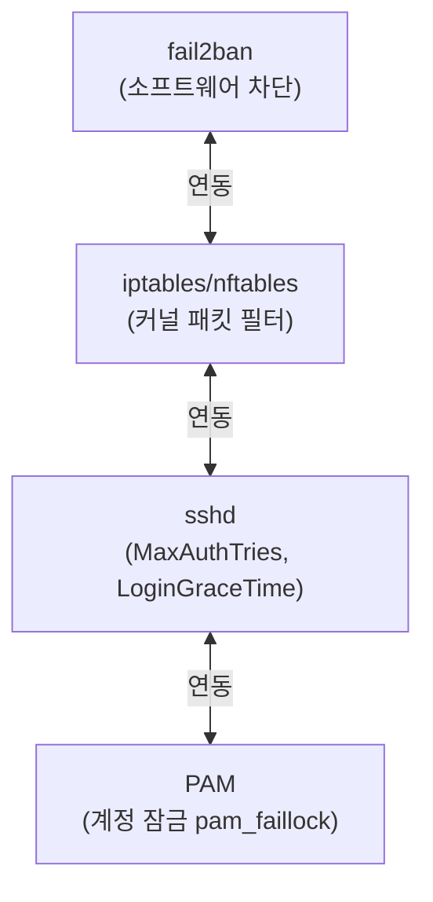

# SSH 설정과 키 관리 (ssh-agent, ProxyJump)

SSH(Secure Shell)는 암호화된 채널로 원격 시스템에 접근하는
프로토콜이다. 단순한 원격 로그인 도구를 넘어 포트 포워딩,
파일 전송, 인증서 기반 접근 제어까지 DevOps 인프라 전반에서
핵심 역할을 한다.

---

## 1. SSH 키 유형 비교

### 1.1 알고리즘 비교

| 알고리즘 | 키 크기 | 보안 강도 | 성능 | 호환성 | 권장 여부 |
|---------|--------|----------|------|--------|---------|
| **Ed25519** | 256 bit | 최고 (128-bit equiv.) | 매우 빠름 | OpenSSH 6.5+ | **권장** |
| ECDSA | 256/384/521 bit | 높음 | 빠름 | OpenSSH 5.7+ | 조건부 |
| RSA-4096 | 4096 bit | 높음 | 느림 | 거의 모든 클라이언트 | 레거시 호환 시 |
| RSA-2048 | 2048 bit | 보통 | 보통 | 전체 호환 | 비권장 |
| DSA | 1024 bit | 낮음 (deprecated) | - | - | 사용 금지 |

**Ed25519를 기본 권장하는 이유:**
- Curve25519 기반 — 백도어 의혹 없는 NIST 외 곡선
- 키 생성/서명/검증 모두 RSA-4096보다 수십 배 빠름
- 키 파일 크기 작음 (68 bytes vs RSA 3.2 KB)
- 타이밍 공격에 구조적으로 강함 (constant-time 구현)

> RSA는 레거시 장비(임베디드, 오래된 CISCO 등) 연동 시에만 사용한다.

---

### 1.2 ssh-keygen 옵션

```bash
# Ed25519 키 생성 (권장)
ssh-keygen -t ed25519 -C "ops@company.com" -f ~/.ssh/id_ed25519

# RSA-4096 (레거시 호환 필요 시)
ssh-keygen -t rsa -b 4096 -C "ops@company.com" -f ~/.ssh/id_rsa_legacy

# 패스프레이즈 없이 자동화용 키 생성
ssh-keygen -t ed25519 -C "deploy-bot" -f ~/.ssh/deploy_key -N ""

# KDF 라운드 수 증가 (패스프레이즈 브루트포스 방어 강화)
ssh-keygen -t ed25519 -C "ops@company.com" -a 200
```

| 옵션 | 의미 | 예시 |
|------|------|------|
| `-t` | 알고리즘 타입 | `-t ed25519` |
| `-b` | 키 비트 수 (RSA 전용) | `-b 4096` |
| `-C` | 주석 (키 식별용) | `-C "user@host"` |
| `-f` | 출력 파일 경로 | `-f ~/.ssh/prod_key` |
| `-N` | 패스프레이즈 (빈 문자열 = 없음) | `-N ""` |
| `-a` | KDF 라운드 수 (기본 16) | `-a 200` |
| `-p` | 기존 키의 패스프레이즈 변경 | `-p -f ~/.ssh/id_ed25519` |
| `-l` | 키 지문(fingerprint) 출력 | `-l -f ~/.ssh/id_ed25519.pub` |

```bash
# 공개키를 서버에 복사
ssh-copy-id -i ~/.ssh/id_ed25519.pub user@server

# 수동 등록 (authorized_keys)
cat ~/.ssh/id_ed25519.pub >> ~/.ssh/authorized_keys
chmod 600 ~/.ssh/authorized_keys

# 키 지문 확인
ssh-keygen -l -E sha256 -f ~/.ssh/id_ed25519
# 256 SHA256:abc123... ops@company.com (ED25519)
```

---

## 2. ~/.ssh/config 심화

### 2.1 기본 구조

```
~/.ssh/
├── config            # 클라이언트 설정
├── id_ed25519        # 개인키 (chmod 600)
├── id_ed25519.pub    # 공개키 (chmod 644)
├── known_hosts       # 서버 호스트키 캐시
└── authorized_keys   # 이 서버 접속 허용 공개키 목록
```

### 2.2 핵심 디렉티브

```ssh-config
# 모든 호스트 공통 설정 (반드시 파일 하단에 위치)
Host *
    # 서버 응답 없을 때 킵얼라이브
    ServerAliveInterval 60
    ServerAliveCountMax 3
    # 최초 접속 시 호스트키 자동 수락 여부
    StrictHostKeyChecking ask
    # 알려진 호스트 파일
    UserKnownHostsFile ~/.ssh/known_hosts
    # 연결 다중화 (멀티플렉싱)
    ControlMaster auto
    ControlPath ~/.ssh/cm-%r@%h:%p
    ControlPersist 10m
    # 기본 개인키
    IdentityFile ~/.ssh/id_ed25519

# 특정 호스트 설정 (Host * 보다 우선)
Host prod-web-01
    HostName 10.0.1.10
    User ubuntu
    Port 22
    IdentityFile ~/.ssh/prod_ed25519

Host dev-*
    User devuser
    IdentityFile ~/.ssh/dev_ed25519
    ForwardAgent no
```

### 2.3 ProxyJump (배스천 경유 접속)

```ssh-config
# 배스천 호스트 정의
Host bastion
    HostName bastion.company.com
    User ubuntu
    Port 22
    IdentityFile ~/.ssh/id_ed25519

# 내부 서버 — bastion을 거쳐 접속
Host internal-*
    User ubuntu
    ProxyJump bastion
    IdentityFile ~/.ssh/id_ed25519

# 특정 서버 직접 지정
Host db-primary
    HostName 10.10.0.5
    User ops
    ProxyJump bastion
```

**ProxyJump vs ProxyCommand 비교:**

| 항목 | ProxyJump | ProxyCommand |
|------|-----------|--------------|
| 도입 버전 | OpenSSH 7.3+ | 구버전부터 존재 |
| 문법 | 단순 (`ProxyJump host`) | 복잡 (`ProxyCommand ssh -W %h:%p`) |
| 다중 점프 | 쉼표로 나열 | 중첩 명령어 필요 |
| 에이전트 포워딩 | 자동 처리 | 수동 관리 필요 |
| 권장 | **현재 권장** | 레거시 환경 |

```ssh-config
# 다중 점프 호스트
Host deep-internal
    HostName 192.168.100.50
    User app
    ProxyJump bastion,jump-02

# CLI에서 직접 지정
# ssh -J bastion,jump-02 user@192.168.100.50
```

### 2.4 커넥션 멀티플렉싱

동일 호스트에 SSH 세션이 이미 열려 있으면
새 연결을 소켓으로 재활용한다. 반복 접속 시
핸드셰이크 오버헤드를 없애 속도를 획기적으로 줄인다.

```ssh-config
Host *
    ControlMaster auto        # 첫 연결이 마스터, 이후는 재활용
    ControlPath ~/.ssh/cm-%r@%h:%p  # 소켓 파일 위치
    ControlPersist 10m        # 마지막 세션 종료 후 10분 유지
```

```bash
# 멀티플렉싱 상태 확인
ssh -O check prod-web-01

# 마스터 연결 종료
ssh -O exit prod-web-01
```

### 2.5 Match 블록 (조건부 설정)

```ssh-config
# 특정 네트워크(VPN) 접속 시
Match host 10.0.*
    StrictHostKeyChecking no
    UserKnownHostsFile /dev/null

# 특정 사용자
Match User deploy
    IdentityFile ~/.ssh/deploy_key
    ForwardAgent no

# 특정 호스트에서만 포트 포워딩 허용
Match host prod-db User ops
    LocalForward 5432 localhost:5432
```

---

## 3. ssh-agent 관리

`ssh-agent`는 복호화된 개인키를 메모리에 캐시해
패스프레이즈 재입력 없이 반복 사용하게 한다.

### 3.1 기본 사용

```bash
# ssh-agent 시작 및 환경변수 설정
eval "$(ssh-agent -s)"
# Agent pid 12345

# 키 추가 (기본 — 세션 종료까지 유지)
ssh-add ~/.ssh/id_ed25519

# 타임아웃 설정 (1시간 후 자동 삭제)
ssh-add -t 3600 ~/.ssh/id_ed25519

# 등록된 키 목록
ssh-add -l
# 256 SHA256:... ops@company.com (ED25519)

# 특정 키 제거
ssh-add -d ~/.ssh/id_ed25519

# 모든 키 제거
ssh-add -D
```

### 3.2 systemd user service로 ssh-agent 관리

로그인 세션과 무관하게 agent를 항상 구동한다.

```ini
# ~/.config/systemd/user/ssh-agent.service
[Unit]
Description=SSH key agent
Documentation=man:ssh-agent(1)
Before=default.target

[Service]
Type=simple
Environment=SSH_AUTH_SOCK=%t/ssh-agent.socket
ExecStart=/usr/bin/ssh-agent -D -a $SSH_AUTH_SOCK
ExecStop=kill -15 $MAINPID
Restart=on-failure

[Install]
WantedBy=default.target
```

```bash
# 서비스 활성화
systemctl --user enable --now ssh-agent

# 환경변수 영구 등록 (~/.bashrc 또는 ~/.zshrc)
export SSH_AUTH_SOCK="${XDG_RUNTIME_DIR}/ssh-agent.socket"
```

### 3.3 gpg-agent SSH 지원

YubiKey 등 하드웨어 토큰 사용 시 gpg-agent가
ssh-agent를 대체할 수 있다.

```bash
# ~/.gnupg/gpg-agent.conf
enable-ssh-support
default-cache-ttl-ssh 1800
max-cache-ttl-ssh 7200

# 환경변수 설정
export SSH_AUTH_SOCK=$(gpgconf --list-dirs agent-ssh-socket)
gpgconf --launch gpg-agent
```

---

## 4. 서버 설정 (/etc/ssh/sshd_config)

### 4.1 보안 강화 설정

```ssh-config
# /etc/ssh/sshd_config

# ─── 인증 방식 ───────────────────────────────────
PasswordAuthentication no       # 패스워드 인증 비활성화
PermitRootLogin no              # root 직접 로그인 금지
PubkeyAuthentication yes        # 공개키 인증 허용
AuthorizedKeysFile .ssh/authorized_keys

# ─── 접속 제한 ───────────────────────────────────
AllowUsers ubuntu ops deploy    # 허용 사용자 명시
# AllowGroups sshusers          # 그룹 기반 제어 (택일)
Port 22                         # 기본 포트 (변경 권장)
MaxAuthTries 3                  # 인증 실패 최대 횟수
LoginGraceTime 30               # 인증 대기 시간(초)
MaxStartups 10:30:60            # 연결 제한 (start:rate:full)

# ─── 세션 ────────────────────────────────────────
ClientAliveInterval 300
ClientAliveCountMax 2
TCPKeepAlive no                 # OS TCP keepalive 비사용

# ─── 프로토콜 강화 ───────────────────────────────
Protocol 2
Ciphers aes256-gcm@openssh.com,chacha20-poly1305@openssh.com
MACs hmac-sha2-256-etm@openssh.com,hmac-sha2-512-etm@openssh.com
KexAlgorithms curve25519-sha256,curve25519-sha256@libssh.org

# ─── 기타 ────────────────────────────────────────
X11Forwarding no
AllowTcpForwarding no
PrintLastLog yes
Banner /etc/ssh/banner.txt      # 접속 배너 (법적 고지 등)

# SFTP 서브시스템
Subsystem sftp /usr/lib/openssh/sftp-server
```

### 4.2 Match 블록으로 사용자별 설정

```ssh-config
# SFTP 전용 사용자 — 쉘 접근 불가
Match User sftpuser
    ChrootDirectory /srv/sftp/%u
    ForceCommand internal-sftp
    AllowTcpForwarding no
    X11Forwarding no

# 운영팀 — 포트 포워딩 허용
Match Group ops-team
    AllowTcpForwarding yes
    PermitOpen localhost:5432 localhost:6379

# 특정 IP에서만 root 허용 (비상 접속용)
Match User root Address 10.0.0.5
    PermitRootLogin forced-commands-only
```

```bash
# 설정 문법 검증
sshd -t

# 변경 후 reload (기존 세션 유지)
systemctl reload sshd
```

---

## 5. SSH 터널링



### 5.1 로컬 포트 포워딩 (-L)

로컬 포트를 원격 서버 경유 대상으로 연결한다.

```bash
# 로컬 5432 → 원격 db-server:5432
ssh -L 5432:db-server:5432 bastion -N -f

# 로컬 8080 → 원격 localhost:80
ssh -L 8080:localhost:80 web-server -N -f

# config에서 설정
# Host tunnel-db
#     HostName bastion.company.com
#     LocalForward 5432 db-primary:5432
#     LocalForward 6379 redis-01:6379

# -N: 명령 실행 없이 포워딩만
# -f: 백그라운드 실행
```

### 5.2 원격 포트 포워딩 (-R)

서버 포트를 로컬로 연결한다. 방화벽 뒤 서버 노출 시 사용.

```bash
# 서버 9090 → 로컬 localhost:3000
ssh -R 9090:localhost:3000 server -N -f

# 서버에서 GatewayPorts yes 설정 시
# 외부에서 server:9090으로 로컬 3000에 접근 가능
```

### 5.3 동적 SOCKS 프록시 (-D)

모든 트래픽을 SSH를 통해 라우팅한다.

```bash
# 로컬 1080 포트에 SOCKS5 프록시 생성
ssh -D 1080 bastion -N -f

# curl에서 사용
curl --socks5-hostname localhost:1080 http://internal-service

# 브라우저 프록시 설정: SOCKS5 127.0.0.1:1080
```

---

## 6. 배스천 호스트 패턴

### 6.1 단일 배스천



```ssh-config
# ~/.ssh/config

Host bastion
    HostName bastion.company.com
    User ubuntu
    IdentityFile ~/.ssh/prod_ed25519
    ServerAliveInterval 60

Host prod-app-*
    HostName 10.0.1.%n
    User ubuntu
    ProxyJump bastion
    IdentityFile ~/.ssh/prod_ed25519

Host prod-db-01
    HostName 10.0.2.10
    User ops
    ProxyJump bastion
    IdentityFile ~/.ssh/prod_ed25519
    LocalForward 15432 localhost:5432
```

### 6.2 다중 점프 호스트


```ssh-config
Host bastion-dmz
    HostName dmz.company.com
    User ubuntu

Host jump-prod
    HostName 10.10.0.5
    User ubuntu
    ProxyJump bastion-dmz

Host target-server
    HostName 192.168.10.20
    User app
    ProxyJump bastion-dmz,jump-prod
    # 또는: ProxyJump jump-prod (jump-prod가 이미 bastion 경유)
```

```bash
# CLI 방식 (임시)
ssh -J bastion-dmz,jump-prod app@192.168.10.20

# SCP도 동일하게 동작
scp -J bastion file.txt app@192.168.10.20:/tmp/
```

---

## 7. SSH 인증서 (CA 기반)

`known_hosts` 관리 문제와 키 배포 문제를 인증서로 해결한다.



### 7.1 CA 설정

```bash
# CA 키 쌍 생성 (오프라인 보관 권장)
ssh-keygen -t ed25519 -f /secure/ssh_ca -C "Company SSH CA"

# 호스트 인증서 서명 (서버 스푸핑 방지)
ssh-keygen -s /secure/ssh_ca \
    -I "prod-web-01" \
    -h \                        # 호스트 인증서
    -n "prod-web-01,10.0.1.10" \  # 유효한 호스트명
    -V +52w \                   # 유효 기간 52주
    /etc/ssh/ssh_host_ed25519_key.pub

# 사용자 인증서 서명
ssh-keygen -s /secure/ssh_ca \
    -I "ops-user@company.com" \
    -n "ubuntu,ops" \           # 허용 principal(사용자명)
    -V +8h \                    # 유효 기간 8시간
    -O force-command="ls -la" \ # 명령어 제한 (선택)
    ~/.ssh/id_ed25519.pub
# ~/.ssh/id_ed25519-cert.pub 생성
```

### 7.2 서버 설정

```ssh-config
# /etc/ssh/sshd_config

# 사용자 인증서 CA 등록
TrustedUserCAKeys /etc/ssh/trusted_user_ca.pub

# 호스트 인증서 설정
HostCertificate /etc/ssh/ssh_host_ed25519_key-cert.pub
```

### 7.3 클라이언트 설정

```ssh-config
# ~/.ssh/known_hosts (호스트 CA 등록)
@cert-authority *.company.com ssh-ed25519 AAAA... Company SSH CA

# ~/.ssh/config
Host prod-*
    CertificateFile ~/.ssh/id_ed25519-cert.pub
    IdentityFile ~/.ssh/id_ed25519
```

```bash
# 인증서 내용 확인
ssh-keygen -L -f ~/.ssh/id_ed25519-cert.pub
# Type: ssh-ed25519-cert-v01@openssh.com user certificate
# Valid: from 2026-04-17 to 2026-04-17 (8h)
# Principals: ubuntu, ops
```

---

## 8. fail2ban 연동 (brute-force 방지)

SSH 로그를 분석해 반복 실패 IP를 자동 차단한다.

### 8.1 설치 및 기본 설정

```bash
apt install fail2ban   # Debian/Ubuntu
dnf install fail2ban   # RHEL/Fedora
```

```ini
# /etc/fail2ban/jail.d/sshd.conf
[sshd]
enabled   = true
port      = ssh
filter    = sshd
backend   = systemd       # journald 사용
maxretry  = 3             # 3회 실패 시 차단
findtime  = 600           # 10분 내 집계
bantime   = 3600          # 1시간 차단
ignoreip  = 127.0.0.1/8 10.0.0.0/8  # 차단 제외 IP
banaction = iptables-multiport
```

```bash
# 서비스 시작
systemctl enable --now fail2ban

# 차단 현황 확인
fail2ban-client status sshd

# 수동 IP 차단 해제
fail2ban-client set sshd unbanip 203.0.113.10

# 로그 확인
journalctl -u fail2ban -f
```

### 8.2 커스텀 필터 (추가 패턴)

```ini
# /etc/fail2ban/filter.d/sshd-custom.conf
[Definition]
failregex = ^%(__prefix_line)s(?:error: PAM: )?[aA]uthentication (?:failure|error)
            ^%(__prefix_line)sInvalid user .+ from <HOST>
            ^%(__prefix_line)sConnection closed by authenticating user .+ <HOST>
ignoreregex =
```

### 8.3 sshd_config와 조합 권장 설정



---

## 빠른 참조

```bash
# 키 생성
ssh-keygen -t ed25519 -C "user@host" -f ~/.ssh/id_ed25519

# 공개키 복사
ssh-copy-id -i ~/.ssh/id_ed25519.pub user@server

# agent에 키 추가 (1시간 타임아웃)
ssh-add -t 3600 ~/.ssh/id_ed25519

# 배스천 경유 접속
ssh -J bastion user@internal-server

# 로컬 포트 포워딩
ssh -L 5432:db:5432 bastion -N -f

# sshd 설정 검증
sshd -t && systemctl reload sshd

# 인증서 내용 확인
ssh-keygen -L -f ~/.ssh/id_ed25519-cert.pub

# fail2ban 차단 현황
fail2ban-client status sshd
```

---

## 참고 자료

- [OpenSSH 공식 문서](https://www.openssh.com/manual.html)
  — 확인: 2026-04-17
- [OpenSSH 9.9 릴리즈 노트](https://www.openssh.com/releasenotes.html)
  — 확인: 2026-04-17
- [NIST SP 800-57 키 관리 권고](https://csrc.nist.gov/publications/detail/sp/800-57-part-1/rev-5/final)
  — 확인: 2026-04-17
- [Cloudflare: The Illustrated TLS Connection](https://tls13.xargs.org/)
  — 확인: 2026-04-17
- [SSH Certificate Authentication - Netflix Tech Blog](https://netflixtechblog.com/introducing-bless-netflix-s-open-source-bastion-authentication-tool-7b7a1ba1f892)
  — 확인: 2026-04-17
- [fail2ban 공식 문서](https://www.fail2ban.org/wiki/index.php/MANUAL_0_8)
  — 확인: 2026-04-17
- [CIS Benchmark for SSH](https://www.cisecurity.org/benchmark/distribution_independent_linux)
  — 확인: 2026-04-17
