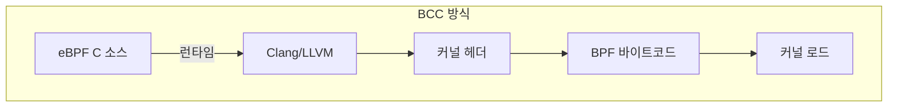
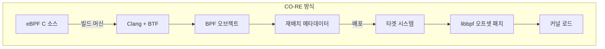
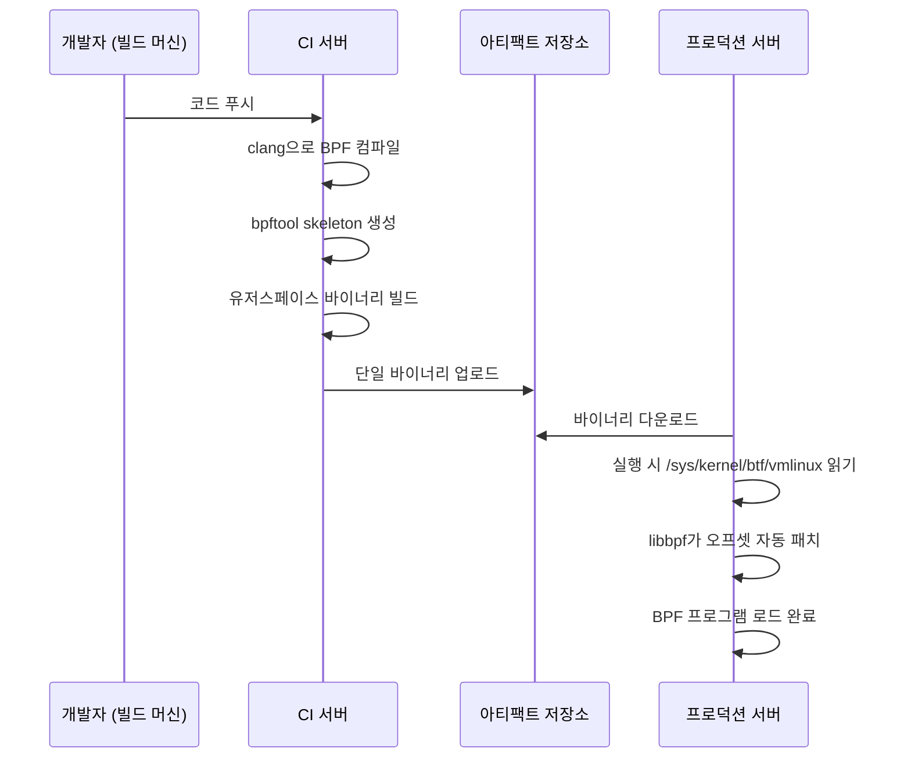
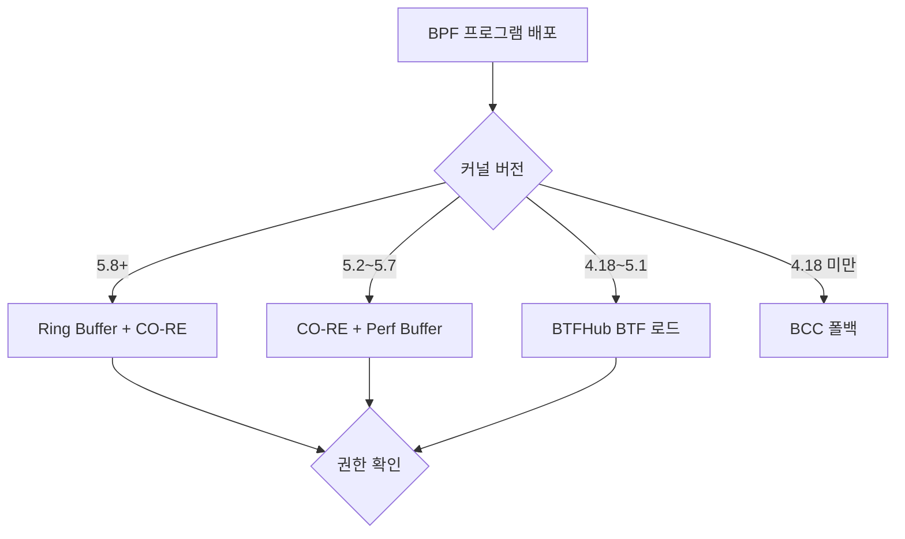
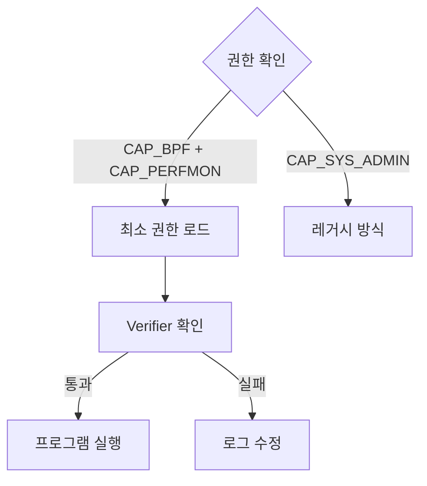

# BPF CO-RE 완전 가이드 (Compile Once, Run Everywhere)

eBPF 프로그램을 프로덕션에 배포할 때 가장 큰 장벽은
**커널 버전마다 다른 구조체 레이아웃**이다.
CO-RE(Compile Once, Run Everywhere)는 이 문제를 BTF 타입 정보와
컴파일 타임 재배치 메타데이터를 결합하여 해결한다.

Google의 gVisor, Cloudflare의 네트워크 필터, Meta의 Katran,
Cilium의 Tetragon이 모두 CO-RE 기반으로 구축되어 있다.

---

## 1. CO-RE 등장 배경

### 기존 BCC의 한계

BCC(BPF Compiler Collection)는 eBPF를 대중화시켰지만,
프로덕션 환경에서 운영하기에는 심각한 제약이 있다.



BCC 방식의 문제점:

| 문제 | 내용 |
|------|------|
| 패키지 크기 증가 | LLVM ~100MB+ 의존 |
| 기동 지연 | 컨테이너 시작 시 수 초~수십 초 |
| 커널 헤더 의존 | 일부 배포판 미포함 |
| 재컴파일 필요 | 커널 업그레이드마다 |



CO-RE 방식의 장점:

| 장점 | 내용 |
|------|------|
| 단일 바이너리 배포 | 런타임 컴파일 불필요 |
| 런타임 Clang 불필요 | 빌드 타임에만 필요 |
| 커널 헤더 불필요 | BTF로 대체 |
| 즉시 로드 | 밀리초 수준 |

### BCC vs CO-RE 비교

| 항목 | BCC | CO-RE (libbpf) |
|------|-----|----------------|
| 컴파일 시점 | 런타임 (타겟 서버) | 빌드 타임 (CI) |
| LLVM/Clang 필요 | 런타임 필수 | 빌드 타임만 |
| 커널 헤더 | 타겟 서버에 필요 | 빌드 서버에만 필요 |
| 배포 아티팩트 | 소스 코드 | 컴파일된 바이너리 |
| 로드 시간 | 수 초~수십 초 | 밀리초 |
| 이식성 | 커널별 재컴파일 | 단일 바이너리 |
| 메모리 오버헤드 | LLVM 상주 메모리 | 없음 |

---

## 2. BTF (BPF Type Format)

### BTF란 무엇인가

BTF는 커널 데이터 구조체의 타입 정보를 경량 바이너리 형식으로
인코딩한 메타데이터다. DWARF 디버그 정보보다 훨씬 작고,
커널이 직접 제공한다.

```
# BTF가 활성화된 커널에서 확인
$ ls -lh /sys/kernel/btf/vmlinux
-r--r--r-- 1 root root 5.2M Apr 17 09:00 /sys/kernel/btf/vmlinux

# 커널 설정 확인
$ grep CONFIG_DEBUG_INFO_BTF /boot/config-$(uname -r)
CONFIG_DEBUG_INFO_BTF=y
```

BTF는 ELF 오브젝트의 `.BTF` 섹션에도 포함된다.
BPF 프로그램이 로드될 때 커널은 이 섹션을 읽어
타입 검증에 활용한다.

### 커널 버전별 BTF 지원 현황

| 커널 버전 | BTF 지원 수준 |
|---------|------------|
| < 4.18 | BTF 미지원 |
| 4.18 ~ 5.1 | BTF 기초 지원 (BPF maps) |
| **5.2+** | **`/sys/kernel/btf/vmlinux` 기본 내장** |
| 5.4 LTS | 대부분 배포판 기본 활성화 |
| 5.8+ | BPF ringbuf, BTF-defined maps 지원 |
| 5.15 LTS | CO-RE 전 기능 안정화 |
| 6.1 LTS | User ring buffer 추가 |

> RHEL 8.2+, Ubuntu 20.04+, Debian 11+에서 BTF가 기본 활성화되어
> `/sys/kernel/btf/vmlinux`가 존재한다.

### vmlinux.h 생성

`vmlinux.h`는 실행 중인 커널의 모든 타입 정의를 C 헤더로
변환한 파일이다. 커널 헤더 패키지 설치 없이 사용 가능하다.

```bash
# vmlinux.h 생성 (빌드 머신에서 1회 실행)
bpftool btf dump file /sys/kernel/btf/vmlinux format c > vmlinux.h

# 파일 크기 확인 (수만 줄의 타입 정의)
wc -l vmlinux.h
# 예: 80000+ lines

# 특정 구조체만 확인
bpftool btf dump file /sys/kernel/btf/vmlinux format c | grep -A 20 "struct task_struct {"
```

```bash
# BTF 덤프로 특정 타입 ID 조회
bpftool btf dump file /sys/kernel/btf/vmlinux | grep -i "task_struct"

# 모든 커널 모듈 BTF 목록 확인
ls /sys/kernel/btf/
# vmlinux  nf_tables  tcp_cubic  ...
```

---

## 3. CO-RE 핵심 개념

### BPF Relocation 타입

CO-RE는 세 가지 재배치 타입을 지원한다.

| Relocation 타입 | 설명 | 주요 API |
|----------------|------|---------|
| Field Offset | 필드 바이트 오프셋 재배치 | `BPF_CORE_READ()` |
| Type Existence | 타입/필드 존재 여부 확인 | `bpf_core_field_exists()`, `bpf_core_type_exists()` |
| Enum Value | 열거형 값 재배치 | `bpf_core_enum_value_exists()`, `bpf_core_enum_value()` |

### BPF_CORE_READ() 매크로

`BPF_CORE_READ()`는 구조체 필드 접근을 안전하게 감싸는
핵심 매크로다. 컴파일 타임에 재배치 정보를 ELF에 기록하고,
로드 타임에 libbpf가 실제 오프셋으로 패치한다.

```c
// ❌ 직접 접근 (CO-RE 재배치 안됨, 잘못된 방식)
u32 pid = task->pid;

// ✅ BPF_CORE_READ 사용 (재배치 메타데이터 자동 생성)
u32 pid = BPF_CORE_READ(task, pid);

// 중첩 필드 접근
u32 ns_pid = BPF_CORE_READ(task, nsproxy, pid_ns_for_children, ns.inum);

// 포인터 역참조 + 필드 접근
struct mm_struct *mm = BPF_CORE_READ(task, mm);
u64 start_brk    = BPF_CORE_READ(mm, start_brk);

// 배열 요소 접근
u64 arg0 = BPF_CORE_READ(task, mm, arg_start);
```

### 커널 버전 간 구조체 변경 방어 코드

커널 업데이트로 구조체가 변경될 때 graceful fallback 패턴:

```c
// bpf_core_field_exists(): 필드 존재 여부 확인
SEC("kprobe/tcp_connect")
int BPF_KPROBE(tcp_connect, struct sock *sk)
{
    // 커널 5.x에서 구조체 레이아웃이 변경된 경우
    // sk_common이 소멸되고 직접 필드가 된 시나리오
    u32 saddr;

    if (bpf_core_field_exists(sk->__sk_common.skc_rcv_saddr)) {
        // 구버전 커널: sk_common 중첩 구조체 방식
        saddr = BPF_CORE_READ(sk, __sk_common.skc_rcv_saddr);
    } else {
        // 신버전 커널: 직접 접근
        saddr = BPF_CORE_READ(sk, skc_rcv_saddr);
    }

    bpf_printk("connect from: %u\n", saddr);
    return 0;
}
```

```c
// bpf_core_type_exists(): 타입 존재 여부 확인
// 신규 도입된 구조체를 선택적으로 사용
if (bpf_core_type_exists(struct bpf_ringbuf)) {
    // 5.8+ 커널: ringbuf 사용
} else {
    // 구버전: perf_buffer 폴백
}
```

```c
// bpf_core_enum_value_exists(): 열거형 값 존재 여부 확인
// 예: 커널 버전마다 다른 TCP 상태 열거형
if (bpf_core_enum_value_exists(enum tcp_state, TCP_NEW_SYN_RECV)) {
    __u32 state = bpf_core_enum_value(enum tcp_state,
                                       TCP_NEW_SYN_RECV);
    // ...
}
```

---

## 4. libbpf 개발 환경 구성

### 패키지 설치

```bash
# RHEL / CentOS Stream / Rocky Linux / AlmaLinux
dnf install -y \
    clang \
    llvm \
    libbpf-devel \
    bpftool \
    kernel-devel \
    elfutils-libelf-devel \
    zlib-devel

# Ubuntu / Debian
apt-get install -y \
    clang \
    llvm \
    libbpf-dev \
    linux-tools-$(uname -r) \
    libelf-dev \
    zlib1g-dev \
    bpftool

# 버전 확인
clang --version        # 권장: 12+
bpftool version        # libbpf 버전 포함 출력
```

### 프로젝트 구조

| 파일 | 역할 |
|------|------|
| `Makefile` | 빌드 스크립트 |
| `myebpf.bpf.c` | BPF 커널 사이드 코드 |
| `myebpf.c` | 유저스페이스 로더 |
| `vmlinux.h` | bpftool으로 생성한 커널 타입 정의 |

### Makefile 구성

```makefile
# Makefile
CLANG      := clang
BPFTOOL    := bpftool
ARCH       := $(shell uname -m | sed 's/x86_64/x86/' \
                                | sed 's/aarch64/arm64/')

# vmlinux.h 생성 (최초 1회)
vmlinux.h:
	$(BPFTOOL) btf dump file /sys/kernel/btf/vmlinux \
	    format c > $@

# BPF 오브젝트 컴파일
%.bpf.o: %.bpf.c vmlinux.h
	$(CLANG) -g -O2 -target bpf \
	    -D__TARGET_ARCH_$(ARCH) \
	    -I. \
	    -c $< -o $@

# BPF 스켈레톤 생성
%.skel.h: %.bpf.o
	$(BPFTOOL) gen skeleton $< > $@

# 유저스페이스 바이너리 빌드
myebpf: myebpf.c myebpf.skel.h
	$(CC) -g -O2 -o $@ $< \
	    -lbpf -lelf -lz

.PHONY: clean
clean:
	rm -f *.o *.skel.h myebpf vmlinux.h
```

### 스켈레톤 파일 자동 생성

bpftool이 자동 생성하는 스켈레톤은 타입 안전한 C API를 제공한다.

```bash
# 스켈레톤 생성
bpftool gen skeleton myebpf.bpf.o > myebpf.skel.h

# 생성된 파일에는 아래가 포함됨:
# - BPF 오브젝트 바이트코드 (embedded)
# - myebpf_bpf__open()  - BPF 오브젝트 열기
# - myebpf_bpf__load()  - 커널에 로드
# - myebpf_bpf__attach() - 프로브 어태치
# - myebpf_bpf__destroy() - 정리
```

---

## 5. CO-RE 프로그램 작성

### kprobe 예시: 프로세스 exec 추적

```c
// execsnoop.bpf.c - BPF 커널 사이드
#include "vmlinux.h"
#include <bpf/bpf_helpers.h>
#include <bpf/bpf_core_read.h>
#include <bpf/bpf_tracing.h>

// 이벤트 구조체 정의
struct event {
    u32  pid;
    u32  ppid;
    u8   comm[16];
    u8   filename[64];
    int  retval;
};

// Ring buffer map 선언
struct {
    __uint(type, BPF_MAP_TYPE_RINGBUF);
    __uint(max_entries, 1 << 24);   // 16MB
} events SEC(".maps");

// sys_enter_execve tracepoint
SEC("tracepoint/syscalls/sys_enter_execve")
int handle_execve_enter(struct trace_event_raw_sys_enter *ctx)
{
    struct event *e;
    struct task_struct *task;

    // ring buffer에 슬롯 예약
    e = bpf_ringbuf_reserve(&events, sizeof(*e), 0);
    if (!e)
        return 0;

    task = (struct task_struct *)bpf_get_current_task();

    e->pid  = bpf_get_current_pid_tgid() >> 32;
    // CO-RE: 커널 버전에 무관하게 안전한 필드 접근
    e->ppid = BPF_CORE_READ(task, real_parent, tgid);
    bpf_get_current_comm(&e->comm, sizeof(e->comm));

    // 유저스페이스 포인터 안전 읽기
    const char *filename = (const char *)ctx->args[0];
    bpf_probe_read_user_str(e->filename,
                            sizeof(e->filename), filename);

    bpf_ringbuf_submit(e, 0);
    return 0;
}

char LICENSE[] SEC("license") = "GPL";
```

```c
// execsnoop.c - 유저스페이스 로더
#include <stdio.h>
#include <signal.h>
#include <bpf/libbpf.h>
#include "execsnoop.skel.h"

static volatile bool running = true;

static void sig_handler(int sig)
{
    running = false;
}

static int handle_event(void *ctx, void *data, size_t sz)
{
    const struct event *e = data;
    printf("PID: %-6d PPID: %-6d COMM: %-16s FILE: %s\n",
           e->pid, e->ppid, e->comm, e->filename);
    return 0;
}

int main(void)
{
    struct execsnoop_bpf *skel;
    struct ring_buffer   *rb;

    signal(SIGINT, sig_handler);

    // 스켈레톤 API로 로드
    skel = execsnoop_bpf__open_and_load();
    if (!skel) {
        fprintf(stderr, "BPF load failed\n");
        return 1;
    }

    // tracepoint 어태치
    execsnoop_bpf__attach(skel);

    // ring buffer 폴링 설정
    rb = ring_buffer__new(
             bpf_map__fd(skel->maps.events),
             handle_event, NULL, NULL);

    printf("%-6s %-6s %-16s %s\n",
           "PID", "PPID", "COMM", "FILE");

    while (running) {
        ring_buffer__poll(rb, 100 /* ms timeout */);
    }

    ring_buffer__free(rb);
    execsnoop_bpf__destroy(skel);
    return 0;
}
```

### tracepoint 예시: TCP 연결 추적

```c
// tcpconnect.bpf.c
#include "vmlinux.h"
#include <bpf/bpf_helpers.h>
#include <bpf/bpf_core_read.h>
#include <bpf/bpf_endian.h>

struct conn_event {
    u32 saddr;
    u32 daddr;
    u16 sport;
    u16 dport;
    u32 pid;
    u8  comm[16];
};

struct {
    __uint(type, BPF_MAP_TYPE_RINGBUF);
    __uint(max_entries, 1 << 24);
} tcp_events SEC(".maps");

// kprobe on tcp_connect
SEC("kprobe/tcp_connect")
int BPF_KPROBE(trace_tcp_connect, struct sock *sk)
{
    struct conn_event *e;
    u16 family;

    // IPv4만 처리
    family = BPF_CORE_READ(sk, __sk_common.skc_family);
    if (family != AF_INET)
        return 0;

    e = bpf_ringbuf_reserve(&tcp_events, sizeof(*e), 0);
    if (!e)
        return 0;

    e->pid   = bpf_get_current_pid_tgid() >> 32;
    e->saddr = BPF_CORE_READ(sk,
                   __sk_common.skc_rcv_saddr);
    e->daddr = BPF_CORE_READ(sk,
                   __sk_common.skc_daddr);
    e->dport = bpf_ntohs(
                   BPF_CORE_READ(sk,
                       __sk_common.skc_dport));
    bpf_get_current_comm(&e->comm, sizeof(e->comm));

    bpf_ringbuf_submit(e, 0);
    return 0;
}

char LICENSE[] SEC("license") = "GPL";
```

### ringbuf vs perf_buffer 선택 기준

| 항목 | BPF Ring Buffer | Perf Buffer |
|------|----------------|-------------|
| 도입 버전 | 커널 5.8+ | 커널 4.15+ |
| 메모리 공유 | 단일 공유 버퍼 | CPU당 별도 버퍼 |
| 이벤트 순서 | 전역 순서 보장 | CPU별 순서만 보장 |
| 메모리 효율 | 높음 | CPU 수 배율 |
| 성능 | 높음 (mmap 직접) | 높음 |
| API | 단순 | 복잡 (CPU당 처리) |
| **권장 상황** | **5.8+ 환경 (기본 선택)** | **5.8 미만 레거시** |

```c
// ✅ 5.8+ 환경: ring buffer 권장
struct {
    __uint(type, BPF_MAP_TYPE_RINGBUF);
    __uint(max_entries, 1 << 24);
} rb SEC(".maps");

// 예약 → 채움 → 제출 패턴
struct event *e = bpf_ringbuf_reserve(&rb, sizeof(*e), 0);
if (!e) return 0;
// ... 데이터 채우기 ...
bpf_ringbuf_submit(e, 0);  // or bpf_ringbuf_discard(e, 0)
```

### BPF Map 타입 실전 사용

```c
// HashMap: PID → 시작 시간 추적
struct {
    __uint(type, BPF_MAP_TYPE_HASH);
    __uint(max_entries, 10240);
    __type(key, u32);           // pid
    __type(value, u64);         // start_ns
} start_time SEC(".maps");

// Per-CPU Array: 통계 카운터 (락 불필요)
struct {
    __uint(type, BPF_MAP_TYPE_PERCPU_ARRAY);
    __uint(max_entries, 1);
    __type(key, u32);
    __type(value, u64);
} counters SEC(".maps");

// LRU HashMap: 연결 상태 추적 (자동 오래된 항목 제거)
struct {
    __uint(type, BPF_MAP_TYPE_LRU_HASH);
    __uint(max_entries, 65536);
    __type(key, struct flow_key);
    __type(value, struct flow_info);
} flows SEC(".maps");
```

---

## 6. 배포와 운영

### 단일 바이너리 배포 흐름



### 커널 5.2 미만 fallback 전략

커널 5.2 미만에서는 `/sys/kernel/btf/vmlinux`가 없다.
이 경우 두 가지 전략을 사용한다.

**전략 1: BTFHub 활용**

```bash
# BTFHub: Aqua Security가 관리하는 BTF 아카이브
# 지원 배포판: Ubuntu, Debian, RHEL, CentOS, Amazon Linux 등
# 저장소: https://github.com/aquasecurity/btfhub-archive

# btfgen으로 프로그램에 필요한 최소 BTF만 추출
# (btfhub-archive 전체 대신 경량 BTF 번들 생성)
git clone https://github.com/aquasecurity/btfhub
cd btfhub

# 특정 프로그램용 경량 BTF 생성
tools/btfgen.sh \
    -a x86_64 \
    -o /path/to/myebpf.bpf.o \
    custom.tar.gz
```

```c
// 유저스페이스에서 외부 BTF 지정 로드
struct bpf_object_open_opts opts = {
    .sz = sizeof(opts),
    .btf_custom_path = "/etc/myapp/custom.btf",
};

struct myebpf_bpf *skel =
    myebpf_bpf__open_opts(&opts);
```

**전략 2: BCC 폴백**

```c
// 런타임에 BTF 지원 여부 확인 후 분기
bool btf_supported = (access("/sys/kernel/btf/vmlinux",
                              R_OK) == 0);

if (btf_supported) {
    // CO-RE 바이너리 실행
    run_core_program();
} else {
    // BCC 기반 폴백 (레거시)
    run_bcc_fallback();
}
```

### 프로덕션 배포 고려사항

**1단계: 커널 버전 확인**



**2단계: 권한 및 Verifier 확인**



**체크리스트**

```bash
# 1. 커널 버전 및 BTF 지원 확인
uname -r
ls /sys/kernel/btf/vmlinux

# 2. 필요 권한 확인 (5.8+에서 CAP_BPF 분리)
# CAP_BPF:      BPF 프로그램 로드
# CAP_PERFMON:  perf 이벤트, kprobe
# CAP_NET_ADMIN: TC/XDP 어태치
capsh --print | grep cap_bpf

# 3. BPF JIT 활성화 확인 (성능 필수)
sysctl net.core.bpf_jit_enable
# 1이어야 함 (기본값)

# 4. verifier 로그 출력 (디버깅 시)
LIBBPF_LOG_LEVEL=debug ./myebpf 2>&1 | head -50

# 5. 로드된 프로그램 확인
bpftool prog list
bpftool map list
```

---

## 7. 도구 비교

### CO-RE 기반 주요 프로젝트

| 프로젝트 | 회사/재단 | CO-RE 활용 | 주 용도 |
|---------|---------|-----------|--------|
| **Cilium** | CNCF | ✅ 전면 도입 | K8s 네트워크/보안 |
| **Tetragon** | Cilium (CNCF) | ✅ 전면 도입 | 보안 관측·집행 |
| **Pixie** | CNCF (New Relic) | ✅ CO-RE 기반 | K8s 자동 계측 APM |
| **Parca** | Polar Signals | ✅ CO-RE 기반 | 지속 프로파일링 |
| **Tracee** | Aqua Security | ✅ BTFHub 통합 | 런타임 보안 감사 |
| **Falco** | CNCF | ✅ 일부 CO-RE | 런타임 위협 탐지 |
| **bcc/libbpf-tools** | iovisor | ✅ CO-RE 전환 중 | 시스템 성능 분석 |

### bpftrace의 CO-RE 지원

bpftrace는 2024년부터 CO-RE를 지원하기 시작했다.

```bash
# bpftrace 1.0+ (2024): CO-RE 기반으로 빌드된 경우
# vmlinux.h 없이도 커널 구조체 직접 접근 가능
bpftrace -e '
kprobe:do_sys_openat2 {
    printf("PID: %d, COMM: %s\n", pid, comm);
}'

# BTF 지원 확인
bpftrace --info 2>&1 | grep -i btf
# BTF: yes

# CO-RE 재배치를 활용한 구조체 접근
bpftrace -e '
kprobe:tcp_connect {
    $sk = (struct sock *)arg0;
    printf("dport: %d\n",
           bswap($sk->__sk_common.skc_dport));
}'
```

### eBPF 프레임워크 비교

| 프레임워크 | 언어 | CO-RE | 특징 | 성숙도 |
|-----------|------|-------|------|-------|
| **libbpf (C)** | C | ✅ 완전 지원 | 표준, 안정, 풍부한 예제 | 프로덕션 검증 |
| **libbpf-rs** | Rust | ✅ 완전 지원 | libbpf C 래퍼, 안전한 API | 프로덕션 수준 |
| **Aya** | Rust (순수) | ✅ 지원 | libbpf 미의존, 순수 Rust | 성숙화 중 |
| **ebpf-go** | Go | ✅ 지원 | Cloudflare 개발, Go 생태계 | 프로덕션 검증 |
| **BCC** | Python/C++ | ❌ 런타임 컴파일 | 프로토타이핑 적합 | 레거시 전환 권장 |
| **bpftrace** | DSL | ✅ 1.0+부터 | 원라이너 분석 | 안정 |

### Aya (Rust eBPF) 소개

Aya는 libbpf에 의존하지 않고 순수 Rust로 구현된
eBPF 프레임워크다.

```bash
# Aya 프로젝트 초기화
cargo install bpf-linker
cargo generate \
    --git https://github.com/aya-rs/aya-template \
    my-ebpf-app
cd my-ebpf-app

# 프로젝트 구조
# my-ebpf-app/
# ├── my-ebpf-app/          # 유저스페이스 (Rust)
# ├── my-ebpf-app-ebpf/     # BPF 커널 사이드 (Rust)
# └── xtask/                # 빌드 도우미

# 크로스 컴파일 빌드
cargo xtask build-ebpf
cargo build

# 실행 (root 필요)
sudo ./target/debug/my-ebpf-app
```

```rust
// Aya BPF 커널 사이드 (Rust)
use aya_ebpf::{
    macros::tracepoint,
    programs::TracePointContext,
    maps::RingBuf,
};

#[map]
static EVENTS: RingBuf = RingBuf::with_byte_size(1 << 24, 0);

#[tracepoint]
pub fn handle_execve(ctx: TracePointContext) -> u32 {
    let pid = ctx.pid();
    // CO-RE를 통한 구조체 접근
    // ...
    0
}
```

**Aya vs libbpf 선택 기준**

| 상황 | 권장 |
|------|------|
| Go 기반 인프라 | ebpf-go (Cloudflare) |
| Rust 팀, libbpf 의존 허용 | libbpf-rs |
| 순수 Rust, 실험적 기능 OK | Aya |
| C 코드베이스 또는 레퍼런스 필요 | libbpf (C) |
| 기존 BCC 스크립트 포팅 | libbpf-tools 참조 |

---

## 8. 빠른 시작: libbpf-bootstrap

프로젝트 스캐폴딩은 공식 [libbpf-bootstrap](https://github.com/libbpf/libbpf-bootstrap)을
사용하면 가장 빠르다.

```bash
# 리포지토리 클론 (libbpf 서브모듈 포함)
git clone --recurse-submodules \
    https://github.com/libbpf/libbpf-bootstrap
cd libbpf-bootstrap/examples/c

# 예제 빌드
make

# 실행 (execsnoop: exec 이벤트 추적)
sudo ./execsnoop

# tcpconnect: TCP 연결 추적
sudo ./tcpconnect

# opensnoop: open() 시스템콜 추적
sudo ./opensnoop
```

```bash
# BCC에서 libbpf CO-RE로 전환된 동등 도구들
# (libbpf-tools 디렉토리)
ls libbpf-bootstrap/examples/c/
# bashreadline  execsnoop  fentry  kprobe  ...
# minimal       opensnoop  sockfilter  tcpconnect
# uprobe        usdt       xdp_lb
```

---

## 참고 자료

- [BPF CO-RE reference guide - Andrii Nakryiko](https://nakryiko.com/posts/bpf-core-reference-guide/)
  (2026-04-17 확인)
- [libbpf Overview - Linux Kernel Documentation](https://docs.kernel.org/bpf/libbpf/libbpf_overview.html)
  (2026-04-17 확인)
- [Building BPF applications with libbpf-bootstrap - Andrii Nakryiko](https://nakryiko.com/posts/libbpf-bootstrap/)
  (2026-04-17 확인)
- [BPF ring buffer - Andrii Nakryiko](https://nakryiko.com/posts/bpf-ringbuf/)
  (2026-04-17 확인)
- [BPF CO-RE - eBPF Docs](https://docs.ebpf.io/concepts/core/)
  (2026-04-17 확인)
- [BPF binaries: BTF, CO-RE, and the future of BPF perf tools - Brendan Gregg](https://www.brendangregg.com/blog/2020-11-04/bpf-co-re-btf-libbpf.html)
  (2026-04-17 확인)
- [BPF Portability and CO-RE - Meta BPF Blog](https://facebookmicrosites.github.io/bpf/blog/2020/02/19/bpf-portability-and-co-re.html)
  (2026-04-17 확인)
- [BTFHub - Aqua Security](https://github.com/aquasecurity/btfhub)
  (2026-04-17 확인)
- [libbpf releases - GitHub](https://github.com/libbpf/libbpf/releases)
  (2026-04-17 확인)
- [Aya eBPF Framework - aya-rs.dev](https://aya-rs.dev/)
  (2026-04-17 확인)
- [eBPF Ecosystem Progress in 2024-2025 - eunomia](https://eunomia.dev/blog/2025/02/12/ebpf-ecosystem-progress-in-20242025-a-technical-deep-dive/)
  (2026-04-17 확인)
- [How to Build eBPF Programs with libbpf and CO-RE on RHEL](https://oneuptime.com/blog/post/2026-03-04-build-ebpf-programs-libbpf-co-re-rhel-9/view)
  (2026-04-17 확인)
