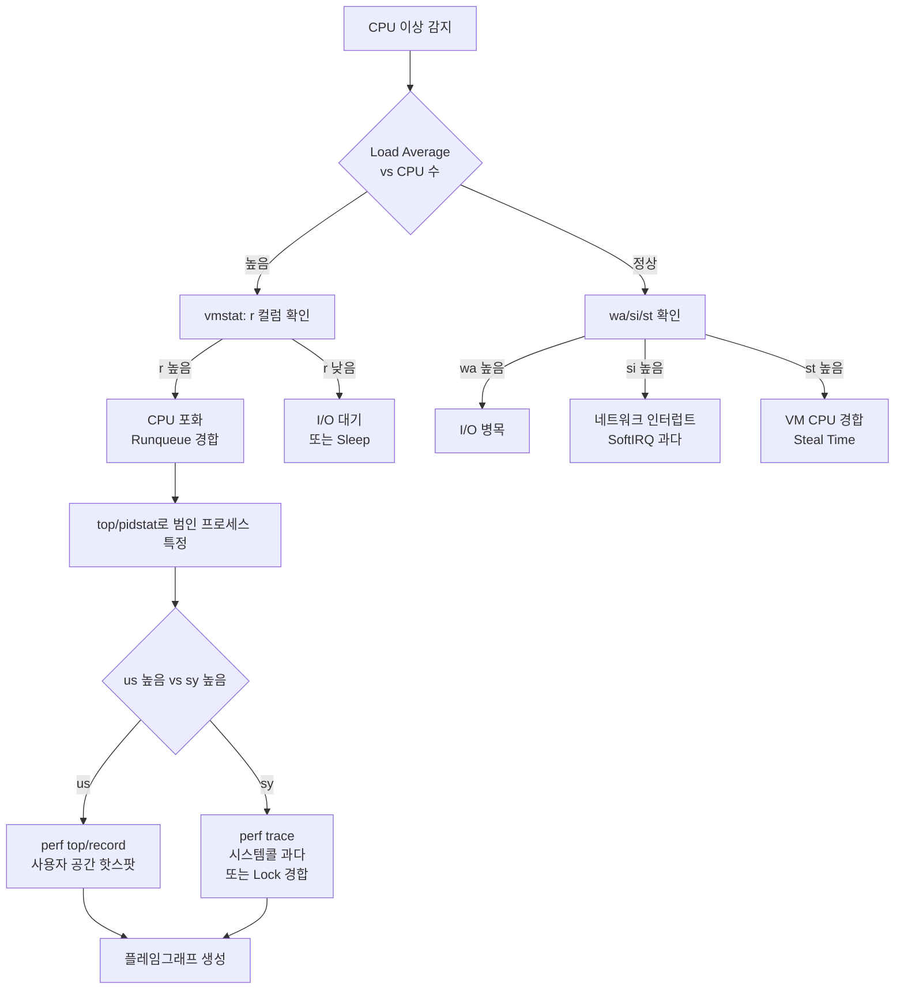
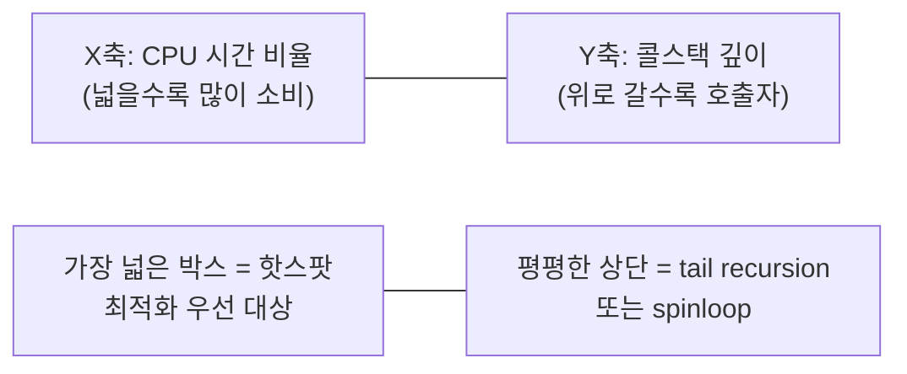
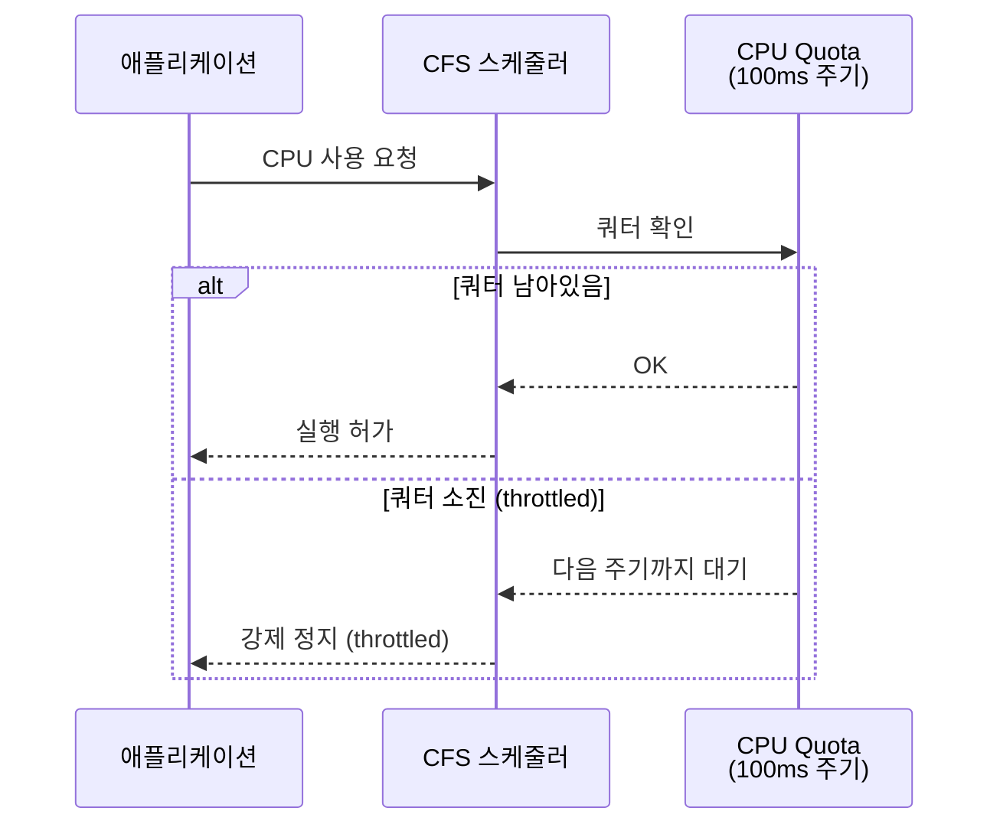

# CPU 성능 분석 완전 가이드 (perf, top, pidstat, mpstat)

CPU 병목은 "CPU가 바쁘다"는 단순한 사실이 아니라
**어디서, 왜 바쁜지**를 파악해야 해결된다.
이 글은 Google·Netflix 수준의 SRE가 실제로 사용하는
분석 방법론부터 도구 사용법, 트러블슈팅 시나리오까지
체계적으로 다룬다.

---

## 1. CPU 성능 분석 방법론

### USE 방법론

CPU 분석에서 가장 먼저 적용하는 구조화 프레임워크다.

| 항목 | CPU 관점 적용 | 확인 명령 |
|------|--------------|----------|
| **U**tilization | CPU 사용률 (이상적: 70% 미만) | `mpstat`, `top` |
| **S**aturation | 런큐 포화 (r > CPU 수) | `vmstat r`, `uptime` |
| **E**rrors | MCE, CPU 하드웨어 오류 | `dmesg`, `rasdaemon` |

### 분석 흐름



---

## 2. 기본 도구

### 2-1. top / htop / btop

#### top 주요 단축키

| 단축키 | 동작 |
|--------|------|
| `1` | CPU 코어별 분리 표시 |
| `P` | CPU 사용률 기준 정렬 |
| `M` | 메모리 사용률 기준 정렬 |
| `c` | 전체 명령어 경로 표시 |
| `H` | 스레드 단위로 표시 |
| `f` | 컬럼 추가/삭제 |
| `d` | 갱신 주기 변경 |

#### CPU 상태 컬럼 해석

```
%Cpu(s):  3.2 us,  1.4 sy,  0.0 ni, 94.3 id,  0.8 wa,  0.0 hi,  0.3 si,  0.0 st
```

| 컬럼 | 의미 | 높을 때 의심 |
|------|------|-------------|
| `us` | User space (애플리케이션) | 로직 최적화 필요 |
| `sy` | System (커널, 시스템콜) | 시스템콜 과다, Lock 경합 |
| `ni` | Nice 값 조정된 프로세스 | 배치 작업 실행 중 |
| `id` | Idle (유휴) | — |
| `wa` | I/O Wait | 디스크/네트워크 I/O 병목 |
| `hi` | Hardware IRQ | NIC 패킷 폭증, HW 이슈 |
| `si` | Software IRQ (SoftIRQ) | 네트워크 처리 과다 |
| `st` | Steal (VM에서 뺏긴 CPU) | 하이퍼바이저 경합 |

> **운영 팁**: `us + sy > 80%`면 CPU 포화 위험 신호다.
> `wa > 20%`면 CPU가 I/O를 기다리고 있어 CPU 자체가
> 아닌 디스크/네트워크 병목일 가능성이 높다.

#### htop / btop 설치

```bash
# htop
sudo apt install htop    # Debian/Ubuntu
sudo dnf install htop    # RHEL/Fedora

# btop (현대적인 UI, 2022년 이후 적극 채택)
sudo apt install btop
sudo dnf install btop
```

---

### 2-2. mpstat - CPU 코어별 분석

```bash
# 모든 코어를 1초 간격으로 5회 출력
mpstat -P ALL 1 5
```

```
11:23:01     CPU    %usr   %nice    %sys %iowait    %irq   %soft  %steal  %idle
11:23:02     all    8.50    0.00    2.12    0.25     0.00    0.50    0.00  88.63
11:23:02       0   32.00    0.00    4.00    0.00     0.00    1.00    0.00  63.00
11:23:02       1    1.00    0.00    1.00    1.00     0.00    0.00    0.00  97.00
11:23:02       2    2.00    0.00    2.00    0.00     0.00    0.00    0.00  96.00
11:23:02       3    0.00    0.00    2.00    0.00     0.00    1.00    0.00  97.00
```

**CPU 0만 32%인 상황** → 단일 스레드 프로세스가 CPU 0을
독점하거나, IRQ affinity 문제일 가능성이 크다.

```bash
# 특정 코어만 확인
mpstat -P 0,1 1

# 인터럽트 통계 포함
mpstat -I ALL 1
```

---

### 2-3. pidstat - 프로세스별 CPU 사용량

```bash
# 1초 간격으로 CPU 사용량 상위 프로세스 추적
pidstat -u 1 5

# 특정 프로세스(PID) 추적
pidstat -u -p 1234 1

# 스레드 단위 분석
pidstat -u -t -p 1234 1
```

```
11:30:01   UID       PID    %usr %system  %guest   %wait    %CPU   CPU  Command
11:30:02  1000      4521   45.00    5.00    0.00    0.10   50.00     2  java
11:30:02  1000      4522    2.00    0.50    0.00    0.00    2.50     1  nginx
```

| 컬럼 | 의미 |
|------|------|
| `%usr` | 사용자 공간 CPU |
| `%system` | 커널 공간 CPU |
| `%wait` | 실행 대기 (CPU 경합, 높으면 포화) |
| `CPU` | 실행 중인 코어 번호 |

---

### 2-4. sar - 시계열 수집과 이력 분석

```bash
# 실시간: 1초 간격 10회 CPU 통계
sar -u 1 10

# 오늘 이력 전체 조회
sar -u

# 특정 날짜 이력 조회
sar -u -f /var/log/sa/sa17

# 모든 CPU 코어별 이력
sar -P ALL 1 5
```

> `sysstat` 패키지가 설치되어 있으면 매 10분마다 자동
> 수집된다 (`/var/log/sa/`). 장애 발생 전 이력을 볼 수
> 있어 사후 분석에 필수적이다.

---

## 3. perf 도구

`perf`는 Linux 커널에 내장된 성능 분석 스위스 아미 나이프다.
하드웨어 PMU(Performance Monitoring Unit)에 직접 접근하여
소프트웨어 프로파일러가 볼 수 없는 마이크로아키텍처 수준의
정보를 제공한다.

```bash
# 설치
sudo apt install linux-tools-common linux-tools-$(uname -r)
sudo dnf install perf
```

---

### 3-1. perf stat - 하드웨어 카운터

```bash
# 기본 통계 (명령어 실행)
perf stat ls -la

# 실행 중인 프로세스 attach
perf stat -p 1234 sleep 5

# 시스템 전체 10초 측정
perf stat -a sleep 10

# 핵심 이벤트 선택 측정
perf stat -e cycles,instructions,cache-misses,branch-misses \
  -p 1234 sleep 5
```

**출력 예시 및 해석:**

```
 Performance counter stats for process id '1234':

        8,432,110,225      cycles
        5,891,234,567      instructions    #  0.70  insn per cycle
          123,456,789      cache-misses    #  1.23% of all cache refs
           45,678,901      branch-misses   #  1.87% of all branches

       5.001234567 seconds time elapsed
```

| 지표 | 해석 기준 |
|------|---------|
| **IPC** (insn per cycle) | < 1.0: 파이프라인 스톨 심각<br>1.0~2.0: 보통<br>> 2.0: 양호 |
| **cache-misses %** | < 1%: 양호<br>1~5%: 주의<br>> 5%: 최적화 필요 |
| **branch-misses %** | < 1%: 양호<br>> 3%: 분기 예측 실패 다발 |

> **IPC가 낮은 원인**: 메모리 레이턴시(cache miss), 분기
> 예측 실패, 데이터 의존성 스톨이 대표적이다.

---

### 3-2. perf top - 실시간 핫스팟

```bash
# 전체 시스템 실시간 프로파일링
sudo perf top

# 특정 프로세스만
sudo perf top -p 1234

# 어노테이션 모드 (심볼 위에서 Enter)
# 함수 내 어느 라인이 뜨거운지 확인 가능
```

```
Samples: 42K of event 'cycles', 4000 Hz, lost: 0/0 drop: 0/0
Overhead  Shared Object        Symbol
  32.14%  libc.so.6            [.] __memmove_avx_unaligned_erms
  18.45%  myapp                [.] process_request
  12.33%  [kernel]             [.] copy_user_enhanced_fast_string
   8.21%  myapp                [.] parse_json
```

`Overhead`가 높은 심볼 → 최적화 우선순위.
`[kernel]` 항목이 많으면 시스템콜 과다를 의심한다.

---

### 3-3. perf record + perf report (플레임그래프 전처리)

```bash
# 99Hz 샘플링, 콜스택 포함, 30초 기록
sudo perf record -F 99 -g -p 1234 -- sleep 30

# 또는 시스템 전체
sudo perf record -F 99 -ag -- sleep 30

# TUI 리포트
sudo perf report

# 플레임그래프 생성
git clone https://github.com/brendangregg/FlameGraph
sudo perf script | \
  ./FlameGraph/stackcollapse-perf.pl | \
  ./FlameGraph/flamegraph.pl > cpu-flame.svg
```

> `-F 99` (99Hz): 1000Hz로 하면 관측자 효과(overhead)가
> 커진다. Netflix·Google이 사용하는 표준 샘플링 주파수다.

**플레임그래프 읽는 법:**



---

### 3-4. perf trace - strace 대체

```bash
# 특정 프로세스의 시스템콜 추적 (strace보다 오버헤드 낮음)
sudo perf trace -p 1234

# 시스템콜 집계 (어떤 syscall이 많은지)
sudo perf trace -s -p 1234 -- sleep 5

# 특정 시스템콜만 필터링
sudo perf trace -e write,read -p 1234
```

```
 0.000 ( 0.005 ms): read(fd: 5, buf: 0x7f..., count: 4096) = 4096
 0.010 ( 0.002 ms): write(fd: 1, buf: 0x7f..., count: 128) = 128
 0.015 (10.234 ms): futex(uaddr: 0x..., op: WAIT, ...) = 0
```

`futex` 호출이 수십 ms 걸리면 Lock 경합을 의심한다.

---

## 4. CPU 병목 유형별 진단

### 높은 `us` — User Space 병목

```bash
# 1단계: 어떤 프로세스인지 특정
# -k 컬럼 번호는 시간 표시 형식(12h/24h)에 따라 달라짐 — ps 방식이 안전
ps aux --sort=-%cpu | head

# 2단계: 어떤 함수인지 확인
sudo perf top -p <PID>

# 3단계: 플레임그래프로 콜체인 파악
sudo perf record -F 99 -g -p <PID> -- sleep 30
sudo perf script | ./FlameGraph/stackcollapse-perf.pl | \
  ./FlameGraph/flamegraph.pl > flame.svg
```

**일반적인 원인**: 정규식 과다 사용, 비효율적 알고리즘
(O(n²)), GC 압박, JSON 파싱 과다.

---

### 높은 `sy` — System/Kernel 병목

```bash
# 시스템콜 과다 확인
sudo perf trace -s -a -- sleep 5

# Lock 경합 (커널 5.19+, CONFIG_LOCKDEP 불필요)
sudo perf lock record -a -- sleep 5
sudo perf lock report
# lock:* 트레이스포인트 방식은 CONFIG_LOCKDEP 커널 전용

# 컨텍스트 스위치 과다 확인
vmstat 1
pidstat -w 1     # cswch/s: voluntary, nvcswch/s: involuntary
```

**일반적인 원인**: 소켓 open/close 반복, `write()` 소량
반복 호출, mutex 경합, 스레드 과다 생성.

---

### 높은 `wa` — I/O Wait

```bash
# I/O 대기 프로세스 확인
iostat -xz 1
iotop -o

# 어떤 파일에 I/O 발생하는지
sudo perf trace -e 'block:*' -p <PID>
```

`wa`가 높아도 CPU는 유휴 상태이므로 CPU 자체 문제가
아니다. 디스크·네트워크 분석으로 전환한다.

---

### 높은 `si` — SoftIRQ / 네트워크 인터럽트

```bash
# 코어별 IRQ 분포 확인 (특정 코어에 집중되면 문제)
cat /proc/interrupts
cat /proc/softirqs

# IRQ 친화성 확인
cat /proc/irq/<irq_num>/smp_affinity_list

# IRQ 균등 분배 설정 (irqbalance)
sudo systemctl status irqbalance
sudo irqbalance --debug
```

**NIC가 1개 코어만 사용하는 경우** → RSS/RPS 설정으로
인터럽트를 여러 코어에 분산한다.

```bash
# RPS 설정 (모든 코어에 분산)
echo "ff" > /sys/class/net/eth0/queues/rx-0/rps_cpus
```

---

### 높은 `st` — Steal Time (VM 환경)

```bash
# steal time 모니터링
vmstat 1 | awk '{print $16}'   # st 컬럼
sar -u 1 10 | grep -v ^$       # %steal 컬럼
```

`st > 5%`면 하이퍼바이저 수준에서 CPU 자원이 다른
VM에게 빼앗기고 있다는 의미다.

**대응**: 전용 호스트(Dedicated Host) 이전 검토,
하이퍼바이저 노드의 VM 밀도 축소.

---

## 5. 고급 분석

### 5-1. Load Average 해석

```bash
uptime
# 11:45:30 up 30 days, 3:21, 2 users, load average: 2.15, 1.82, 1.56
#                                                    1분   5분   15분
```

**해석 기준 (CPU 4코어 시스템 기준)**:

| Load Average | 상태 | 판단 |
|:---:|------|------|
| 0 ~ 4.0 | 정상 | CPU 여유 있음 |
| 4.0 | 포화점 | CPU 수와 일치, 모든 코어 가동 |
| 4.0 초과 | 과부하 | 런큐에 대기 태스크 존재 |
| 급격한 증가 | 스파이크 | 1분값 >> 15분값이면 갑작스러운 이벤트 |

> **중요**: Linux load average는 CPU 대기뿐 아니라
> **I/O 대기(D state)** 프로세스도 포함한다.
> `wa`가 낮은데 load가 높으면 CPU 포화,
> `wa`가 높으면 I/O 병목이다.
> (Brendan Gregg, 2017 "Linux Load Averages: Solving
> the Mystery" 참조)

---

### 5-2. Context Switch 과다 진단

```bash
# vmstat cs 컬럼 확인
vmstat 1 10

# 프로세스별 컨텍스트 스위치
pidstat -w 1 10

# 스레드별 확인
pidstat -w -t -p <PID> 1
```

```
procs  --------memory------  ---swap-- -----io---- -system-- ------cpu-----
 r  b   swpd   free  ...      si   so    bi    bo   in    cs  us sy id wa st
 2  0      0  2048M  ...       0    0     0     0  950  8500   5  3 92  0  0
```

| cs (context switch) | 판단 |
|:---:|------|
| < 1,000/s | 정상 |
| 1,000 ~ 10,000/s | 주의 (워크로드에 따라 다름) |
| > 100,000/s | 스레드 과다, Lock 경합 강하게 의심 |

`nvcswch/s` (비자발적 컨텍스트 스위치) 높음 → CPU 경합
`cswch/s` (자발적 컨텍스트 스위치) 높음 → I/O/Lock 대기

---

### 5-3. CPU Throttling (cgroups)

컨테이너 환경에서 CPU limits 설정 시 CFS 쿼터로 제한된다.

```bash
# cgroup v2 CPU 쿼터 확인
cat /sys/fs/cgroup/<path>/cpu.max
# 200000 100000  → 100ms 주기에 200ms 사용 가능 (2 CPU)

# 실제 throttle 상태 확인 (cgroup v2)
cat /sys/fs/cgroup/<path>/cpu.stat
# nr_throttled: 125
# throttled_usec: 5432100

# cgroup v1
cat /sys/fs/cgroup/cpu/<path>/cpu.stat
```

**CFS 버스트 (Linux 5.14+)**: 순간 트래픽 처리를 위한
CPU burst 기능. `cpu.max.burst`로 설정한다.

```bash
# burst 허용량 설정 (cgroup v2)
echo "200000 100000" > /sys/fs/cgroup/<path>/cpu.max
echo "100000" > /sys/fs/cgroup/<path>/cpu.max.burst
```

---

### 5-4. NUMA 토폴로지와 CPU 핀닝

```bash
# NUMA 토폴로지 확인
numactl --hardware
lscpu | grep -E 'NUMA|Socket|Core|Thread'

# NUMA 통계 (remote access 비율 확인)
numastat -n
numastat -p <PID>
```

```
available: 2 nodes (0-1)
node 0 cpus: 0 1 2 3 4 5 6 7
node 0 size: 64534 MB
node 1 cpus: 8 9 10 11 12 13 14 15
node 1 size: 64464 MB
node distances:
node   0   1
  0:  10  21
  1:  21  10
```

**NUMA node 0 → node 1 메모리 접근**: 약 2.1배 레이턴시 증가.

```bash
# 특정 NUMA 노드에서 프로세스 실행
numactl --cpunodebind=0 --membind=0 ./myapp

# 특정 코어에 프로세스 핀닝 (taskset: CPU만, 메모리 미고려)
taskset -c 0-3 ./myapp

# 실행 중인 프로세스 이동
taskset -p -c 0-3 <PID>
```

> `taskset`은 CPU만 제어하고 메모리 배치를 고려하지 않는다.
> NUMA 환경에서는 반드시 `numactl`을 사용해야
> 메모리 지역성 이점을 얻을 수 있다.

---

### 5-5. CPU Frequency Scaling

```bash
# 현재 주파수 확인
cpupower frequency-info
cat /sys/devices/system/cpu/cpu*/cpufreq/scaling_cur_freq

# 거버너 확인 및 변경
cpupower frequency-info | grep governor
# performance: 항상 최대 주파수 (레이턴시 민감 서비스)
# powersave: 전력 절약 (배치 작업)
# schedutil: 커널 스케줄러 기반 동적 조정 (권장)

sudo cpupower frequency-set -g performance
```

**레이턴시 민감 서비스(DB, 게임서버 등)에서**
`powersave` 거버너 사용 시 응답 지연이 발생할 수 있다.
프로덕션 환경에서는 `performance` 또는 `schedutil` 권장.

---

## 6. 컨테이너 / Kubernetes 환경

### 6-1. cgroup CPU 제한과 Throttle 메트릭

Kubernetes는 CFS(Completely Fair Scheduler) 대역폭 제어로
CPU limits를 구현한다.



**CPU Throttle Prometheus 쿼리:**

```promql
# Pod별 CPU throttle 비율 (5분 평균)
rate(container_cpu_cfs_throttled_periods_total{
  container!="",
  namespace="production"
}[5m])
/
rate(container_cpu_cfs_periods_total{
  container!="",
  namespace="production"
}[5m])
> 0.25
```

> throttle 비율 **25% 초과**를 알람 임계값으로 사용하는
> 것이 업계 표준이다. 100ms 주기 중 25ms 이상 강제 정지.

---

### 6-2. requests vs limits 설정 가이드

```yaml
resources:
  requests:
    cpu: "500m"   # 스케줄링 보장 (Node CPU의 50%)
  limits:
    cpu: "1000m"  # CFS 쿼터 상한선
```

| 설정 패턴 | 결과 | 권장 여부 |
|---------|------|---------|
| requests만 설정 | 스로틀 없음, 노드 공유 | 레이턴시 민감 서비스 권장 |
| requests = limits | Guaranteed QoS, 예측 가능 | 배치/ML 작업 |
| limits >> requests | Burstable QoS, 스로틀 위험 | 주의 필요 |
| limits 매우 낮음 | 잦은 스로틀, 성능 저하 | 피해야 함 |

> **Netflix·Airbnb 운영 경험**: CPU limits을 제거하고
> requests만 설정한 후 p99 레이턴시가 크게 개선된 사례가
> 다수 보고되어 있다. Kubernetes 공식 문서도 CPU limits의
> 부작용을 인지하고 있다.

---

### 6-3. 컨테이너 내부에서 perf 사용

```bash
# 컨테이너에서 호스트 PID로 perf 실행
# (privileged 모드 또는 SYS_ADMIN capability 필요)
kubectl exec -it <pod> -- bash

# 호스트 네임스페이스에서 실행
nsenter -t <host-pid> -m -u -i -n -p -- perf top
```

---

## 7. 실무 트러블슈팅 시나리오

### 시나리오 1: 갑작스러운 CPU 스파이크

```bash
# ── Step 1: 언제부터인지 확인 (이력) ──
sar -u 1 10
# 또는 SAR 이력
sar -u -f /var/log/sa/sa$(date +%d)

# ── Step 2: 어떤 CPU 상태인지 확인 ──
mpstat -P ALL 1 3
# us 높음 → Step 3a
# sy 높음 → Step 3b
# wa 높음 → I/O 분석으로 전환

# ── Step 3a: 어떤 프로세스 (us 높음) ──
pidstat -u 1 5 | sort -k8 -rn | head -10

# ── Step 4a: 어떤 함수가 원인인지 ──
sudo perf top -p <PID>
# 또는 플레임그래프 생성
sudo perf record -F 99 -g -p <PID> -- sleep 30
sudo perf script | \
  ./FlameGraph/stackcollapse-perf.pl | \
  ./FlameGraph/flamegraph.pl > /tmp/cpu-spike.svg

# ── Step 3b: 시스템콜 과다 (sy 높음) ──
sudo perf trace -s -a -- sleep 5
# 상위 시스템콜 확인 후 해당 프로세스 식별
sudo perf trace -s -p <PID> -- sleep 5
```

---

### 시나리오 2: 특정 프로세스 CPU 점유 추적

```bash
# 프로세스 목록에서 CPU 상위 확인
ps aux --sort=-%cpu | head -10

# 스레드별 분석
ps -eLf | awk '$3=="<PID>"' | sort -k5 -rn | head

# 지속적 모니터링 (5분간 1초 간격 기록)
pidstat -u -t -p <PID> 1 300 | tee /tmp/cpu-track.log

# 실시간 perf 어노테이션
sudo perf top -p <PID> --call-graph dwarf
```

---

### 60초 긴급 진단 체크리스트

```bash
# 1. 로드 확인
uptime

# 2. 최근 커널 에러
dmesg -T | tail -20

# 3. CPU/메모리/스왑 개요
vmstat 1 5

# 4. 코어별 CPU 분포
mpstat -P ALL 1 3

# 5. 상위 CPU 소비 프로세스
pidstat -u 1 3 | sort -k8 -rn | head -10

# 6. I/O 확인
iostat -xz 1 3

# 7. 네트워크 확인
sar -n DEV 1 3
```

---

## 참고 자료

| 소스 | URL | 확인 날짜 |
|------|-----|---------|
| Brendan Gregg - Linux perf Examples | https://www.brendangregg.com/perf.html | 2026-04-17 |
| Brendan Gregg - Flame Graphs | https://www.brendangregg.com/flamegraphs.html | 2026-04-17 |
| Brendan Gregg - Linux Load Averages | https://www.brendangregg.com/blog/2017-08-08/linux-load-averages.html | 2026-04-17 |
| perf wiki - Tutorial | https://perfwiki.github.io/main/tutorial/ | 2026-04-17 |
| Kubernetes CPU Requests/Limits (Datadog) | https://www.datadoghq.com/blog/kubernetes-cpu-requests-limits/ | 2026-04-17 |
| Kubernetes CPU Throttling - Last9 | https://last9.io/blog/kubernetes-cpu-throttling/ | 2026-04-17 |
| sysstat GitHub | https://github.com/sysstat/sysstat | 2026-04-17 |
| NUMA, numactl, taskset Guide | https://tonyseah.medium.com/numa-numactl-and-taskset-a-practical-guide-for-ai-ml-engineers-0fbacb450f22 | 2026-04-17 |
| Kubernetes Resource Management | https://kubernetes.io/docs/concepts/configuration/manage-resources-containers/ | 2026-04-17 |
| FlameGraph GitHub (Brendan Gregg) | https://github.com/brendangregg/FlameGraph | 2026-04-17 |
