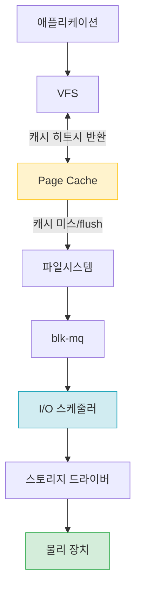
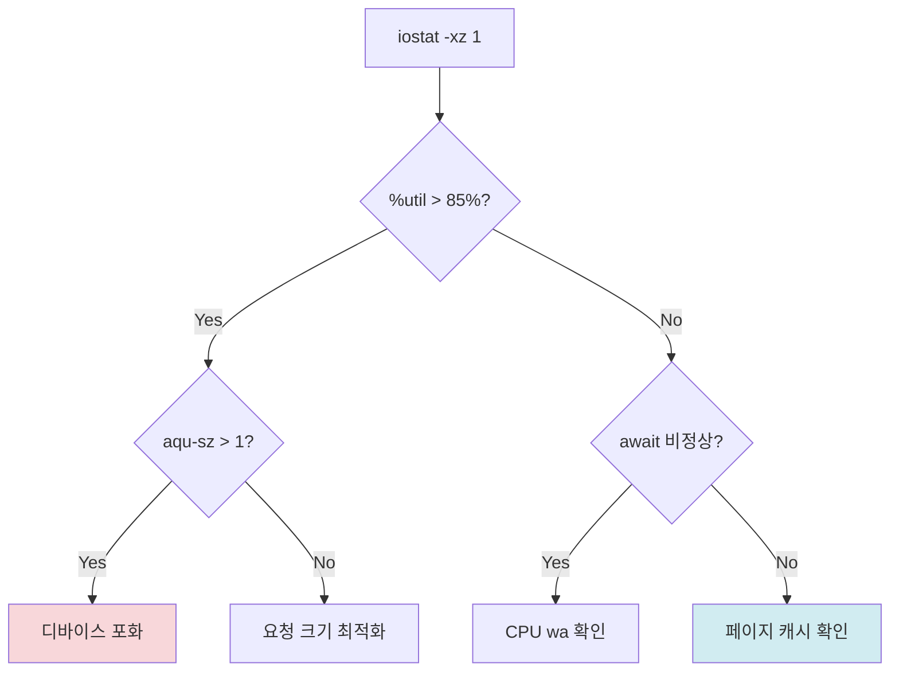
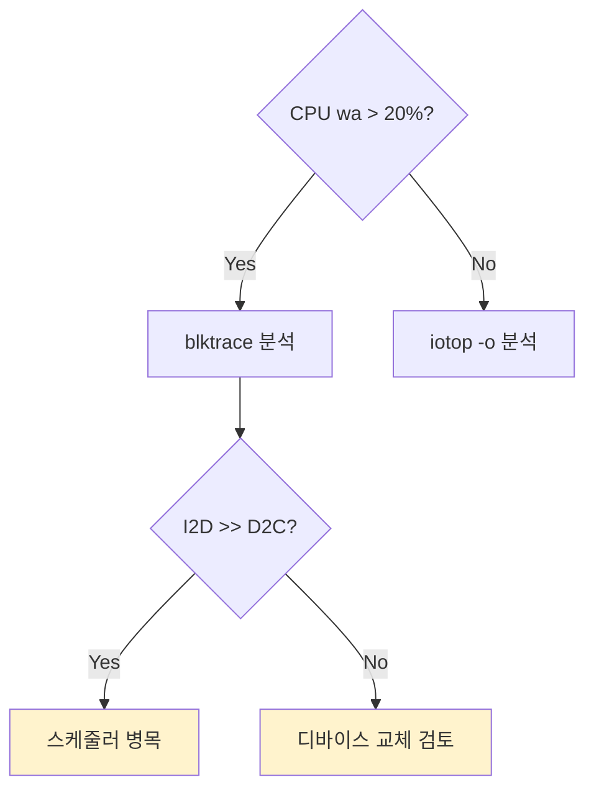

# 디스크 I/O 성능 분석 완전 가이드 (iostat, iotop, blktrace)

> "디스크가 느리다"는 증상은 원인이 다섯 가지 이상이다.
> 스토리지 드라이버가 포화된 것인지, 큐가 쌓인 것인지,
> 페이지 캐시가 비워진 것인지, 프로세스 한 개가 독점하는 것인지.
> 도구 없이 추측하지 않는다.

이 글은 Brendan Gregg의 USE 방법론(Utilization, Saturation,
Errors)을 I/O에 적용하는 실전 가이드다. 단순 도구 사용법을 넘어
**병목 원인을 계층별로 격리하는 사고 방식**을 목표로 한다.

---

## 1. Linux I/O 스택 아키텍처

I/O가 어디서 느려지는지 알려면 요청이 흐르는 경로를 먼저 알아야
한다.



| 계층 | 역할 |
|------|------|
| 애플리케이션 | `read()` / `write()` / `io_uring` / `mmap()` |
| 시스템 콜 | `sys_read`, `sys_write`, `sys_pread64` |
| VFS | 파일시스템 추상화 레이어 |
| Page Cache | 읽기 캐시 + write-back 버퍼 |
| 파일시스템 | ext4 / XFS / Btrfs / tmpfs |
| Block Layer | bio 생성, 병합, 분할, I/O 통계 |
| blk-mq | CPU당 Software Queue |
| I/O 스케줄러 | none / mq-deadline / bfq / kyber |
| Hardware Queue | 디바이스 큐 (hctx) |
| 스토리지 드라이버 | NVMe / SCSI / VirtIO-blk |
| 물리 장치 | 내부 컨트롤러 큐 (NCQ/NVMe Queues) |

### 계층별 병목 위치

| 계층 | 병목 증상 | 진단 도구 |
|------|---------|---------|
| Page Cache | 캐시 히트율 급감, 반복 읽기 느림 | `vmtouch`, `pcstat`, `sar -B` |
| 파일시스템 | 메타데이터 잠금, 저널 대기 | `iostat`, `strace`, `perf` |
| blk-mq / 스케줄러 | 큐 포화, 높은 `aqu-sz` | `iostat -xz`, `blktrace` |
| 드라이버 / 컨트롤러 | 높은 `svctm`, 디바이스 오류 | `nvme smart-log`, `dmesg` |
| 물리 장치 | 100% util, 높은 레이턴시 | `fio`, `iostat %util` |

---

## 2. 기본 분석 도구

### 2.1 `iostat -xz 1` — I/O 종합 상태

`sysstat` 패키지에 포함된 핵심 도구다.

```bash
# -x: 확장 통계, -z: 0인 디바이스 생략, 1: 1초 간격
iostat -xz 1

# NVMe만 필터
iostat -xz 1 nvme0n1

# 사람이 읽기 쉬운 단위 (MB/s)
iostat -xzm 1

# 타임스탬프 포함 (문제 발생 시각 기록용)
iostat -xzt 1
```

출력 예:

```
Device            r/s     w/s   rMB/s   wMB/s  rrqm/s  wrqm/s
nvme0n1         523.0   312.0   65.4    24.8     0.0     4.2

            r_await  w_await  aqu-sz  rareq-sz  wareq-sz  %util
               0.38     1.24    0.72    128.2     81.4      89.7
```

**컬럼별 해설 (가장 중요한 지표):**

| 컬럼 | 의미 | 정상 범위(NVMe 기준) | 이상 기준 |
|------|------|-------------------|---------|
| `r/s` | 초당 읽기 요청 수 (IOPS) | 워크로드 의존 | - |
| `w/s` | 초당 쓰기 요청 수 (IOPS) | 워크로드 의존 | - |
| `rMB/s` | 초당 읽기 처리량 | ≤ 장치 스펙 | 장치 스펙 초과 |
| `wMB/s` | 초당 쓰기 처리량 | ≤ 장치 스펙 | 장치 스펙 초과 |
| `rrqm/s` | 읽기 요청 병합률 | NVMe: ~0, HDD: 높음 | - |
| `wrqm/s` | 쓰기 요청 병합률 | 순차 쓰기 시 높음 | - |
| **`await`** | 평균 I/O 완료 시간(ms) | NVMe: <1ms, HDD: <20ms | NVMe >5ms |
| **`r_await`** | 읽기 평균 완료 시간(ms) | NVMe: <0.5ms | NVMe >2ms |
| **`w_await`** | 쓰기 평균 완료 시간(ms) | NVMe: <1ms | NVMe >5ms |
| **`aqu-sz`** | 평균 큐 깊이 (in-flight 요청 수) | <디바이스 큐 깊이 | >1 이면 큐 포화 의심 |
| `rareq-sz` | 평균 읽기 요청 크기(KB) | 랜덤: <16KB, 순차: >64KB | - |
| `wareq-sz` | 평균 쓰기 요청 크기(KB) | 랜덤: <16KB, 순차: >64KB | - |
| **`%util`** | 장치 사용률 | <70% 여유 | >85% 경보, 100% 포화 |

> `%util`이 100%라고 해서 반드시 병목은 아니다. 단일 큐 HDD에서는
> 100%가 포화를 의미하지만, NVMe는 큐 깊이가 수백~수천이므로
> `%util`이 100%여도 `aqu-sz`가 낮으면 아직 여유가 있다.

### 2.2 `iotop -o` — 프로세스별 I/O 원인 파악

`iostat`으로 디바이스 포화를 확인한 다음, **어느 프로세스**가
원인인지 찾는 도구다.

```bash
# -o: I/O 발생 중인 프로세스만 표시
# -P: 스레드 대신 프로세스 표시
# -a: 누적 I/O 표시
sudo iotop -o -P

# 배치 모드 (스크립트 파이핑 가능)
sudo iotop -b -o -n 5 -d 2

# 특정 프로세스 감시
sudo iotop -b -o -p $(pgrep mysqld) -n 10 -d 1
```

출력 해석:

```
Total DISK READ:  65.4 MiB/s | Total DISK WRITE:  24.8 MiB/s
  TID  PRIO  USER  DISK READ  DISK WRITE  SWAPIN    IO>  COMMAND
12345  be/4  mysql  60.1 MiB/s  18.3 MiB/s  0.00%  85.2%  mysqld
 8901  be/4  root    0.0 B/s   6.5 MiB/s   0.00%   3.1%  rsync
```

> `IO>` 컬럼이 높은 프로세스가 I/O wait를 유발하는 주범이다.

### 2.3 디스크 구성 파악

분석 전 디바이스 토폴로지와 스케줄러를 먼저 파악한다.

```bash
# 디바이스 트리 + 타입/크기/마운트/스케줄러
lsblk -o NAME,SIZE,TYPE,ROTA,SCHED,MOUNTPOINT,MODEL

# 출력 예
NAME        SIZE TYPE ROTA SCHED       MOUNTPOINT  MODEL
nvme0n1   953.9G disk    0 none        /           WD_BLACK SN850X
nvme0n1p1   1G part    0 none        /boot
nvme0n1p2 952.9G part    0 none        /
sda         7.3T disk    1 mq-deadline /data       ST8000VN004

# ROTA=0: SSD, ROTA=1: HDD
# 스케줄러 확인
for d in /sys/block/*/queue/scheduler; do
  echo "$d: $(cat $d)"; done
```

### 2.4 공간 분석

I/O 병목과 공간 부족이 함께 나타나는 경우가 많다.

```bash
# 파일시스템별 사용률
df -hT

# inode 사용률 (소파일 많은 환경에서 병목 원인)
df -i

# 디렉터리별 사용량 (Top 10)
du -sh /var/log/* 2>/dev/null | sort -rh | head -10

# 삭제됐지만 프로세스가 점유 중인 파일 (공간 미반환)
lsof +L1 | awk '{print $7, $NF}' | sort -rn | head -10
```

---

## 3. blktrace / blkparse — I/O 요청 추적

`iostat`은 집계 통계다. 개별 I/O 요청의 **정확한 경로와 레이턴시**를
보려면 `blktrace`가 필요하다.

### 3.1 I/O 이벤트 타입


| 이벤트 | 의미 |
|--------|------|
| Q | bio가 블록 레이어에 제출됨 |
| G | bio에서 request 객체 생성 |
| I | request가 스케줄러 큐에 삽입 |
| D | request가 드라이버에 전달됨 |
| C | 디바이스가 요청 완료 신호 반환 |

| 이벤트 코드 | 의미 | 측정 구간 |
|----------|------|---------|
| `Q` | bio 제출 (애플리케이션 관점 시작) | - |
| `G` | request 객체 할당 | Q→G: 할당 대기 시간 |
| `M` | 기존 request에 bio 병합 | 병합 발생 |
| `I` | 스케줄러 큐 삽입 | G→I: 스케줄러 처리 |
| `D` | 드라이버에 dispatch | I→D: 스케줄러 대기 시간 |
| `C` | 디바이스 완료 | D→C: 실제 서비스 시간 |
| `A` | remapping (DM/RAID 레이어) | - |

**D→C**: 디바이스 실제 처리 시간.
**I→D**: 스케줄러 큐 대기 시간.
`await` = I→D + D→C 합산에 근사한다.

### 3.2 blktrace 실행

```bash
# 단일 디바이스 추적 (30초)
# -d: 디바이스, -o: 출력 파일명(접두사), -w: 실행 시간(초)
sudo blktrace -d /dev/nvme0n1 -o /tmp/trace -w 30

# 특정 이벤트만 (-a: action 필터)
# 읽기/쓰기 완료 이벤트만
sudo blktrace -d /dev/sda -a read -a write -o /tmp/trace -w 10

# 멀티 디바이스 동시 추적
sudo blktrace -d /dev/nvme0n1 -d /dev/sda -o /tmp/trace -w 30
```

결과물: `/tmp/trace.blktrace.N` (CPU당 1개 파일)

### 3.3 blkparse로 읽기

```bash
# 인간이 읽을 수 있는 형태로 파싱
blkparse -i /tmp/trace

# 출력 예
259,0    3      574     0.000123456  12345  Q  WS 4096 + 8 [mysqld]
259,0    3      575     0.000124512  12345  G  WS 4096 + 8 [mysqld]
259,0    3      576     0.000125234  12345  I  WS 4096 + 8 [mysqld]
259,0    3      577     0.000190123      0  D  WS 4096 + 8 [mysqld]
259,0    3      578     0.000325678      0  C  WS 4096 + 8 0

# 컬럼 설명
# major,minor  CPU  순번  타임스탬프  PID  이벤트  RW  LBA + 블록수  [프로세스]
# R=읽기, W=쓰기, S=동기(sync), F=fsync

# 요약 통계만
blkparse -i /tmp/trace -d /dev/null

# 특정 프로세스만 필터
blkparse -i /tmp/trace | grep mysqld
```

### 3.4 btt (blktrace tools) — 레이턴시 분포 분석

```bash
# 완료 이벤트까지의 구간별 레이턴시 계산
btt -i /tmp/trace

# 출력 예
==================== All Devices ====================

            ALL           MIN           AVG           MAX    N
--------------- ------------- ------------- ------------- ----
Q2Q           0.000000019   0.000985234   0.005234123   573
Q2G           0.000000234   0.000001234   0.000025678   573
G2I           0.000000012   0.000000456   0.000009123   573
I2D           0.000000123   0.000065234   0.001234567   573
D2C           0.000100234   0.000285123   0.000987654   573
Q2C           0.000101345   0.000351234   0.001498765   573

# Q2C: 전체 I/O 레이턴시 (Q→C)
# I2D: 스케줄러 큐 대기 시간
# D2C: 실제 디바이스 서비스 시간

# 레이턴시 히스토그램 생성 (gnuplot용)
btt -i /tmp/trace -l /tmp/d2c_latency
```

### 3.5 btrecord / btreplay — I/O 재현

```bash
# 1단계: blktrace로 trace 파일 생성
sudo blktrace -d /dev/nvme0n1 -o /tmp/trace -w 60

# 2단계: trace 파일로 I/O 패턴 기록
btrecord -d /tmp/trace -o /tmp/recorded_io

# 3단계: 다른 환경에서 재현 (성능 테스트용)
btreplay -d /tmp/recorded_io /dev/nvme0n1
```

---

## 4. I/O 병목 유형별 진단

### 4.1 병목 유형 분류

**1단계: %util 기준 분류**



**2단계: await 높음 + CPU wa > 20% 케이스 정밀 분석**



| 판단 기준 | 조치 |
|---------|------|
| `%util > 85%` + `aqu-sz > 1` | 디바이스 포화 → 업그레이드 또는 샤딩 고려 |
| `%util > 85%` + `aqu-sz` 낮음 | 단일 대용량 I/O → 요청 크기 최적화 |
| `await` 높음 + CPU `wa > 20%` + `I2D >> D2C` | 스케줄러 큐 병목 → 스케줄러 변경 또는 `nr_requests` 조정 |
| `await` 높음 + CPU `wa > 20%` + `D2C` 높음 | 디바이스 자체 느림 → 장치 교체, 펌웨어 확인 |
| `await` 높음 + CPU `wa` 낮음 | I/O 집중 프로세스 → `iotop -o` 분석 |
| `await` 정상 | 페이지 캐시 확인 → `vmtouch`, `sar -B` |

### 4.2 높은 `await`: 큐 대기 vs 실제 서비스 시간

`await`이 높을 때 원인은 두 가지다. blktrace의 I2D(큐 대기)와
D2C(장치 처리)를 비교하면 구분된다.

```bash
# await = I2D (스케줄러 큐 대기) + D2C (장치 처리)
# D2C가 높다 → 장치 자체가 느리거나 포화
# I2D가 높다 → 스케줄러 큐 병목

# svctm은 sysstat 12.1.2에서 제거됨 — await/I2D/D2C로 분석
iostat -xz 1 | grep -A2 "Device"

# blktrace로 정밀 분석
sudo blktrace -d /dev/sda -o /tmp/trace -w 10
btt -i /tmp/trace | grep -E "I2D|D2C|Q2C"
```

### 4.3 `%util` 100%: 포화 상태

```bash
# 지속적으로 100%인지 확인 (순간적 100%는 정상)
# 10초간 평균 확인
iostat -xz 10 3

# 큐 깊이 확인
cat /sys/block/nvme0n1/queue/nr_requests   # 소프트웨어 큐 최대 깊이
cat /sys/block/nvme0n1/queue/depth         # 하드웨어 큐 깊이 (NVMe)

# 현재 in-flight I/O 수
cat /sys/block/nvme0n1/inflight
# 출력: 읽기 쓰기
# 예:    15     8
```

### 4.4 `aqu-sz` > 1: 큐 깊이 포화

```bash
# aqu-sz = 평균 큐 길이 (Little's Law)
# aqu-sz > 하드웨어 큐 깊이 → 실제 포화

# NVMe 하드웨어 큐 수와 깊이 확인
ls /sys/block/nvme0n1/mq/       # 큐 수
cat /sys/block/nvme0n1/queue/nr_hw_queues

# HDD: aqu-sz > 1 → 즉시 병목
# SATA SSD: aqu-sz > 32 → 병목 의심
# NVMe: aqu-sz > 1024 → 병목 의심
```

### 4.5 랜덤 vs 순차 I/O 패턴 식별

```bash
# 요청 크기로 패턴 추정 (rareq-sz / wareq-sz)
# < 16KB: 랜덤 I/O (DB, 메타데이터)
# > 128KB: 순차 I/O (백업, 스트리밍)
iostat -xz 1 | awk '/nvme0n1/{print "read_avg:", $6"KB write_avg:", $7"KB"}'

# blkparse로 LBA 접근 패턴 시각화
blkparse -i /tmp/trace -F '%d %S\n' | head -100
# LBA가 연속 → 순차, 무작위 → 랜덤

# 랜덤 I/O 비율 (blktrace seekdist 도구)
seekwatcher -t /tmp/trace -o seek_pattern.png
```

---

## 5. 고급 분석

### 5.1 `fio` — 정밀 벤치마크

현재 환경의 한계치를 측정하거나, 튜닝 전후를 비교할 때 필수 도구다.

```bash
# 설치
apt install fio            # Ubuntu/Debian
dnf install fio            # RHEL/Fedora

# ─── 순차 읽기 처리량 (대역폭) ───────────────────
# --direct=1: page cache 우회, --bs=1M: 1MB 블록(순차)
fio \
  --name=seq-read \
  --filename=/dev/nvme0n1 \
  --direct=1 \
  --rw=read \
  --bs=1M \
  --ioengine=libaio \
  --iodepth=32 \
  --numjobs=1 \
  --runtime=30 \
  --time_based \
  --readonly

# ─── 랜덤 4K 읽기 IOPS ────────────────────────────
# --bs=4k: DB 워크로드, --iodepth=32: DB 서버 전형, --numjobs=4: 병렬
fio \
  --name=rand-read-4k \
  --filename=/dev/nvme0n1 \
  --direct=1 \
  --rw=randread \
  --bs=4k \
  --ioengine=libaio \
  --iodepth=32 \
  --numjobs=4 \
  --runtime=60 \
  --time_based \
  --group_reporting \
  --readonly

# ─── 랜덤 4K 쓰기 IOPS (영구 쓰기 주의!) ──────────
fio \
  --name=rand-write-4k \
  --filename=/tmp/fio-test \
  --size=10G \
  --direct=1 \
  --rw=randwrite \
  --bs=4k \
  --ioengine=libaio \
  --iodepth=32 \
  --numjobs=4 \
  --runtime=60 \
  --time_based \
  --group_reporting

# ─── 혼합 읽기/쓰기 (DB 리얼 워크로드) ─────────────
# --rwmixread=70: 읽기 70% / 쓰기 30%
fio \
  --name=mixed-rw \
  --filename=/tmp/fio-test \
  --size=10G \
  --direct=1 \
  --rw=randrw \
  --rwmixread=70 \
  --bs=4k \
  --ioengine=libaio \
  --iodepth=32 \
  --numjobs=4 \
  --runtime=60 \
  --time_based \
  --group_reporting
```

**fio 출력 핵심 지표 해석:**

```
READ: bw=3456MiB/s (3623MB/s), iops=884736
  clat (usec): min=58, max=4523, avg=144.2
               ^^^^ 완료 레이턴시: 평균 144μs
  clat percentiles (usec):
   |  50.00th=[  129]   75.00th=[  159]
   |  90.00th=[  190]   95.00th=[  219]
   |  99.00th=[  334]  99.90th=[  644]   # P99.9가 SLA 기준
   | 99.99th=[ 1549]
```

> P50/P99/P99.9 레이턴시를 함께 확인한다.
> 평균(avg)만 보면 tail latency를 놓친다.

| 벤치마크 항목 | NVMe (PCIe 4.0) 기대값 | SATA SSD 기대값 | HDD 기대값 |
|------------|---------------------|--------------|---------|
| 순차 읽기 | 5,000+ MB/s | 500-550 MB/s | 150-200 MB/s |
| 순차 쓰기 | 4,000+ MB/s | 450-520 MB/s | 130-180 MB/s |
| 랜덤 읽기 4K IOPS | 800,000-1,200,000 | 80,000-100,000 | 100-200 |
| 랜덤 읽기 P99 레이턴시 | <200μs | <500μs | <50ms |

### 5.2 `dd` — 간단 순차 처리량 측정

```bash
# 순차 쓰기 (fsync 없이, page cache 포함)
dd if=/dev/zero of=/tmp/dd-test bs=1M count=4096 status=progress

# 순차 쓰기 (O_DIRECT, page cache 우회)
dd if=/dev/zero of=/tmp/dd-test \
   bs=1M count=4096 oflag=direct status=progress

# 순차 읽기 (page cache flush 후)
echo 3 > /proc/sys/vm/drop_caches
dd if=/dev/nvme0n1 of=/dev/null bs=1M count=4096 status=progress

# 쓰기 후 sync 강제 (실제 디스크 반영)
dd if=/dev/zero of=/tmp/dd-test \
   bs=1M count=1024 conv=fsync status=progress
```

> `dd`는 랜덤 I/O 측정에 적합하지 않다. 처리량(MB/s) 기준 빠른
> 확인용으로만 사용하고, 정밀 측정은 `fio`를 쓴다.

### 5.3 NVMe 고유 메트릭

NVMe에는 SMART 로그를 통해 장치 건강 상태를 직접 읽을 수 있다.

```bash
# 패키지 설치
apt install nvme-cli        # Ubuntu
dnf install nvme-cli        # RHEL

# NVMe 장치 목록
nvme list

# SMART 로그 (핵심 건강 지표)
nvme smart-log /dev/nvme0

# 주요 지표 필터
nvme smart-log /dev/nvme0 | grep -E \
  "critical_warning|temperature|available_spare|\
percentage_used|data_units|host_read_commands|\
media_errors|num_err_log_entries"
```

**NVMe SMART 핵심 필드:**

| 필드 | 의미 | 위험 기준 |
|------|------|---------|
| `critical_warning` | 장치 이상 플래그 | 0 이외 → 즉시 교체 검토 |
| `temperature` | 컨트롤러 온도(K) | >80°C 경보, >85°C 위험 |
| `available_spare` | 남은 예비 블록 % | <10% → 교체 준비 |
| `percentage_used` | 수명 소모율 % | >90% → 교체 준비 |
| `data_units_written` | 누적 쓰기량 (512KB 단위) | TBW 스펙 대비 확인 |
| `media_errors` | 미디어/데이터 오류 수 | 0 이외 → 즉시 조사 |
| `num_err_log_entries` | 에러 로그 누적 수 | 증가 추세 → 조사 |

```bash
# NVMe 오류 로그
nvme error-log /dev/nvme0

# NVMe 큐 깊이 확인
cat /sys/block/nvme0n1/queue/nr_hw_queues
cat /sys/block/nvme0n1/queue/nr_requests

# NVMe 펌웨어 버전 확인 (최신 여부)
nvme id-ctrl /dev/nvme0 | grep -E "fr|mn|sn"
```

### 5.4 Write Barrier의 I/O 성능 영향

Write barrier는 전원 장애 시 저널 일관성을 보장하지만
I/O 레이턴시를 증가시킬 수 있다.

```bash
# barrier가 I/O에 주는 영향 측정 (ext4)
# barrier=1 (기본)
fio --name=barrier-on --filename=/mnt/ext4data/fio \
    --size=4G --direct=1 --rw=randwrite \
    --bs=4k --ioengine=libaio --iodepth=8 \
    --numjobs=1 --runtime=30 --time_based \
    --group_reporting

# barrier=0 (BBU가 있는 환경에서만!)
mount -o remount,barrier=0 /mnt/ext4data
fio --name=barrier-off --filename=/mnt/ext4data/fio \
    --size=4G --direct=1 --rw=randwrite \
    --bs=4k --ioengine=libaio --iodepth=8 \
    --numjobs=1 --runtime=30 --time_based \
    --group_reporting

# 일반적으로 barrier=0이 3-10% 빠름
# BBU 없는 환경에서 barrier=0은 데이터 손상 위험
```

---

## 6. 페이지 캐시 분석

디스크 I/O가 느린 것처럼 보여도 페이지 캐시 미스가 원인인 경우가
많다. 캐시 분석은 I/O 분석과 반드시 함께 한다.

### 6.1 `vmtouch` — 파일 캐시 상태 확인

```bash
# 설치
apt install vmtouch         # Ubuntu
# 또는 소스 빌드
git clone https://github.com/hoytech/vmtouch && \
cd vmtouch && make && sudo make install

# 특정 파일의 캐시 여부 확인
vmtouch /var/log/nginx/access.log

# 출력 예
           Files: 1
     Directories: 0
  Resident Pages: 1823/2048  (88.7%)
        Elapsed: 0.003266 seconds
# 88.7%가 page cache에 존재 → 대부분 메모리에서 서비스

# 디렉터리 전체 캐시 분석
vmtouch -v /var/lib/mysql/data/

# 특정 파일을 캐시에 강제 로드 (워밍)
vmtouch -l /important/data/file

# 캐시에서 강제 제거 (캐시 미스 시뮬레이션)
vmtouch -e /important/data/file
```

### 6.2 `pcstat` — 파일별 page cache 비율

```bash
# 설치 (Go 필요)
go install github.com/tobert/pcstat/cmd/pcstat@latest

# 파일별 캐시 비율 확인
pcstat /var/lib/mysql/data/ibdata1

# 출력 예
|------------------+----------------+------------+-----------+---------|
| Name             | Size           | Pages      | Cached    | Percent |
|------------------+----------------+------------+-----------+---------|
| ibdata1          | 12582912       | 3072       | 2987      | 97.2%   |
|------------------+----------------+------------+-----------+---------|
```

### 6.3 캐시 히트율 모니터링

```bash
# page cache 통계 (sar)
# -B: paging 통계 (1초 간격, 5회)
sar -B 1 5

# 출력 해석
# pgpgin/s: 초당 디스크에서 캐시로 읽은 KB (캐시 미스 → 디스크 I/O)
# pgpgout/s: 초당 캐시에서 디스크로 쓴 KB (dirty page flush)
# fault/s: page fault 초당 발생 수
# majflt/s: major fault (디스크 읽기 필요) - 중요 지표

# /proc/meminfo 직접 확인
grep -E "Cached|Dirty|Writeback|Buffers" /proc/meminfo

# dirty page 비율 계산 스크립트
python3 -c "
import re
d = open('/proc/meminfo').read()
total = int(re.search(r'MemTotal:\s+(\d+)', d).group(1))
dirty = int(re.search(r'Dirty:\s+(\d+)', d).group(1))
print(f'Dirty ratio: {dirty/total*100:.2f}%')
"

# dirty page 임계값 설정 (sysctl)
# 과도한 dirty page가 flush 시 I/O 폭발 방지
sysctl vm.dirty_ratio           # 기본 20% (전체 메모리 대비)
sysctl vm.dirty_background_ratio # 기본 10% (백그라운드 flush 시작)

# DB 서버 권장: dirty 비율 낮게 설정
sysctl -w vm.dirty_ratio=5
sysctl -w vm.dirty_background_ratio=2
```

### 6.4 캐시 워밍 전략

```bash
# 시스템 시작 후 중요 데이터 사전 캐시 로드
# MySQL InnoDB buffer pool 예열 (자체 지원)
# my.cnf: innodb_buffer_pool_load_at_startup = ON

# 파일 사전 캐시 로드 (vmtouch)
vmtouch -t /var/lib/mysql/data/important_table.ibd

# /proc/sys/vm/drop_caches로 캐시 제거 (테스트 목적만)
sync                          # dirty page를 먼저 flush
echo 1 > /proc/sys/vm/drop_caches  # page cache만
echo 2 > /proc/sys/vm/drop_caches  # dentries + inodes
echo 3 > /proc/sys/vm/drop_caches  # 모두 (운영 중 사용 금지!)
```

---

## 7. 컨테이너/Kubernetes 환경

### 7.1 cgroup v2 blkio 제어

컨테이너는 cgroup v2의 `io` 컨트롤러로 디바이스별 I/O를 제한한다.

```bash
# 컨테이너의 cgroup 경로 확인
CONTAINER_ID=$(docker inspect --format='{{.Id}}' my-container)
CGROUP_PATH="/sys/fs/cgroup/system.slice/docker-${CONTAINER_ID}.scope"

# I/O 통계 확인 (cgroup v2)
cat ${CGROUP_PATH}/io.stat
# 출력: 8:0 rbytes=1234567 wbytes=7654321 rios=1234 wios=5678
#       major:minor rbytes=읽기바이트 wbytes=쓰기바이트

# I/O 제한 설정
cat ${CGROUP_PATH}/io.max
# 출력: 8:0 rbps=max wbps=max riops=max wiops=max

# Docker run 시 I/O 제한
docker run \
  --device-read-bps /dev/nvme0n1:100mb \
  --device-write-bps /dev/nvme0n1:100mb \
  --device-read-iops /dev/nvme0n1:1000 \
  --device-write-iops /dev/nvme0n1:1000 \
  my-image

# cgroup 직접 설정 (bytes/s와 IOPS)
# 형식: "major:minor rbps=N wbps=N riops=N wiops=N"
echo "259:0 rbps=104857600 wbps=104857600" \
  > ${CGROUP_PATH}/io.max
```

### 7.2 Kubernetes PV IOPS 제한

StorageClass에서 CSI 드라이버 파라미터로 IOPS를 제한할 수 있다.

```yaml
# rook-ceph RBD StorageClass — IOPS 제한 예시
apiVersion: storage.k8s.io/v1
kind: StorageClass
metadata:
  name: ceph-block-iops-limited
provisioner: rook-ceph.rbd.csi.ceph.com
parameters:
  clusterID: rook-ceph
  pool: replicapool
  imageFormat: "2"
  imageFeatures: layering
  # QoS 파라미터 (ceph-csi librbd 설정키, Ceph 16.x+)
  rbd_qos_iops_limit: "5000"
  rbd_qos_bps_limit: "209715200"        # 200MiB/s
reclaimPolicy: Delete
allowVolumeExpansion: true
```

```yaml
# csi-driver-host-path 예시 (generic CSI)
# Kubernetes 1.34+ VolumeAttributesClass (GA)
apiVersion: storage.k8s.io/v1
kind: VolumeAttributesClass
metadata:
  name: silver
driverName: pd.csi.storage.gke.io
parameters:
  iops: "3000"
  throughput: "50Mi"
```

### 7.3 컨테이너 내 I/O 병목 진단

```bash
# Pod 내 iostat 실행
kubectl exec -n my-ns my-pod -- iostat -xz 1

# 노드에서 컨테이너의 실제 I/O 확인
# 컨테이너 PID 찾기
CONTAINER_PID=$(docker inspect --format='{{.State.Pid}}' my-container)

# /proc/<pid>/io 에서 I/O 통계
cat /proc/${CONTAINER_PID}/io
# rchar: 읽은 바이트 (캐시 포함)
# wchar: 쓴 바이트 (캐시 포함)
# read_bytes: 실제 디스크 읽기 바이트
# write_bytes: 실제 디스크 쓰기 바이트
# cancelled_write_bytes: 취소된 쓰기 (페이지 캐시로 흡수)

# 모든 컨테이너 I/O 순위 (노드에서 실행)
for pid in $(ls /proc | grep '^[0-9]'); do
  io_file="/proc/$pid/io"
  [ -f "$io_file" ] || continue
  comm=$(cat /proc/$pid/comm 2>/dev/null)
  rchar=$(grep rchar $io_file | awk '{print $2}')
  wchar=$(grep wchar $io_file | awk '{print $2}')
  echo "$rchar $wchar $comm (pid:$pid)"
done | sort -rn | head -10

# iotop으로 노드 전체 모니터링 (컨테이너 포함)
sudo iotop -o -P -b -n 3 -d 2
```

---

## 8. 실무 트러블슈팅

### 8.1 DB 슬로우 쿼리와 I/O 연관 분석

DB 슬로우 쿼리의 원인이 CPU/Lock인지 I/O인지 구분하는 과정이다.

```bash
# ─── 1단계: DB 슬로우 쿼리 확인 ─────────────────────
# MySQL 슬로우 쿼리 로그
tail -f /var/log/mysql/slow.log

# PostgreSQL 슬로우 쿼리 (pg_log)
# postgresql.conf: log_min_duration_statement = 1000  (1초)

# ─── 2단계: 슬로우 쿼리 발생 시 I/O 상관 확인 ──────
# 슬로우 쿼리 발생 시각 기록 후 해당 시각의 iostat 확인
# (미리 1초 간격 수집 필요)
iostat -xzt 1 >> /tmp/iostat.log &

# DB 프로세스 I/O 실시간 감시
DB_PID=$(pgrep -f mysqld | head -1)
sudo iotop -b -o -p $DB_PID -n 60 -d 1 >> /tmp/db-io.log &

# ─── 3단계: DB 내부에서 I/O 대기 확인 ──────────────
# MySQL: I/O wait 스레드 확인
mysql -e "SHOW PROCESSLIST\G" | grep -E "State.*wait.*I/O|waiting"

# PostgreSQL: I/O 대기 이벤트
psql -c "
  SELECT pid, wait_event_type, wait_event, query
  FROM pg_stat_activity
  WHERE wait_event_type = 'IO'
  ORDER BY pid;
"

# ─── 4단계: 테이블/인덱스 파일 캐시 상태 ─────────────
# MySQL InnoDB 버퍼 풀 히트율
mysql -e "
  SHOW GLOBAL STATUS LIKE 'Innodb_buffer_pool_reads';
  SHOW GLOBAL STATUS LIKE 'Innodb_buffer_pool_read_requests';
" | awk '
  /read_requests/{req=$2}
  /pool_reads/{reads=$2}
  END{printf "Buffer Pool Hit Rate: %.2f%%\n", (1-reads/req)*100}
'

# PostgreSQL 캐시 히트율
psql -c "
  SELECT
    relname,
    heap_blks_hit::float / nullif(heap_blks_hit + heap_blks_read, 0) AS hit_rate
  FROM pg_statio_user_tables
  ORDER BY heap_blks_read DESC
  LIMIT 10;
"
```

### 8.2 fsync 과다 문제

`fsync` 호출이 과다하면 쓰기 레이턴시가 급증한다. 주로 DB의 WAL
flush, 로그 드라이버, 저널링 파일시스템에서 발생한다.

```bash
# ─── fsync 과다 프로세스 찾기 ──────────────────────
# strace로 fsync 호출 빈도 측정
sudo strace -e trace=fsync,fdatasync,sync_file_range \
  -p $(pgrep -f mysqld | head -1) \
  -c -f 2>&1 | tail -20

# 출력 예
% time     seconds  usecs/call     calls    errors  syscall
------ ----------- ----------- --------- --------- --------
 85.23    5.234123        8723       600           fsync
 14.77    0.906789         123      7374           fdatasync

# ─── 블록 레이어에서 fsync 추적 ─────────────────────
# blktrace에서 F(fsync/flush) 이벤트 확인
sudo blktrace -d /dev/nvme0n1 -a sync -o /tmp/fsync-trace -w 10
blkparse -i /tmp/fsync-trace | grep " F " | wc -l  # 총 flush 수
blkparse -i /tmp/fsync-trace | grep " F " | \
  awk '{print $5}' | sort | uniq -c | sort -rn | head  # PID별

# ─── MySQL fsync 튜닝 (성능 vs 내구성) ──────────────
# my.cnf
# innodb_flush_log_at_trx_commit = 1  (기본, 최고 내구성)
# innodb_flush_log_at_trx_commit = 2  (성능 향상, 1초 손실 허용)
# innodb_flush_method = O_DIRECT      (double buffering 제거)

# ─── PostgreSQL fsync 튜닝 ────────────────────────────
# postgresql.conf
# synchronous_commit = on     (기본, WAL flush 보장)
# synchronous_commit = off    (3배 쓰기 성능, 커밋 확인 안함)
# wal_sync_method = fdatasync  (기본, Linux 최적)
# checkpoint_completion_target = 0.9  (checkpoint I/O 분산)

# ─── fsync 레이턴시 직접 측정 ─────────────────────────
python3 -c "
import time, os
f = open('/tmp/fsync-test', 'wb')
latencies = []
for _ in range(100):
    f.write(b'x' * 4096)
    t = time.perf_counter()
    os.fsync(f.fileno())
    latencies.append((time.perf_counter() - t) * 1000)
f.close()
os.unlink('/tmp/fsync-test')
latencies.sort()
print(f'fsync latency P50: {latencies[50]:.2f}ms')
print(f'fsync latency P99: {latencies[99]:.2f}ms')
print(f'fsync latency max: {latencies[-1]:.2f}ms')
"
```

### 8.3 실무 체크리스트

```
【I/O 성능 문제 초기 진단 체크리스트】

□ iostat -xzt 1 실행 → %util, await, aqu-sz 확인
  - %util > 85%: 포화 의심
  - await NVMe > 2ms, HDD > 30ms: 레이턴시 문제
  - aqu-sz > 1 지속: 큐 병목

□ iotop -o -P: I/O 집중 프로세스 식별

□ dmesg | grep -E "error|ata|nvme|scsi": 하드웨어 오류 확인

□ nvme smart-log / hdparm -I: 장치 건강 상태 확인

□ df -i: inode 고갈 확인 (소파일 환경)

□ vmstat 1: CPU wa(I/O wait) 비율 확인
  - wa > 20%: I/O 병목이 CPU 병목으로 전파 중

□ sar -B 1: page fault / paging 확인

□ vmtouch 대상 파일: 캐시 히트 여부 확인

□ blktrace로 정밀 I2D/D2C 분석 (필요 시)

□ fio로 장치 한계값 측정 (실측 vs 스펙 비교)
```

---

## 9. Prometheus 기반 I/O 모니터링

프로덕션에서는 실시간 터미널 도구보다 메트릭 수집 + 알림이 실용적이다.

```yaml
# Prometheus node_exporter가 수집하는 주요 I/O 메트릭
# node_disk_io_time_seconds_total       → %util 계산 기반
# node_disk_read_bytes_total            → rMB/s
# node_disk_written_bytes_total         → wMB/s
# node_disk_reads_completed_total       → r/s
# node_disk_writes_completed_total      → w/s
# node_disk_read_time_seconds_total     → r_await 계산 기반
# node_disk_write_time_seconds_total    → w_await 계산 기반
# node_disk_io_now                      → aqu-sz 근사
```

```yaml
# Grafana 알림 규칙 예시 (Prometheus)
groups:
  - name: disk_io_alerts
    rules:
      # 디스크 사용률 85% 초과 5분 지속
      - alert: DiskIOHighUtilization
        expr: |
          rate(node_disk_io_time_seconds_total[5m]) * 100 > 85
        for: 5m
        labels:
          severity: warning
        annotations:
          summary: "디스크 I/O 포화: {{ $labels.device }}"
          description: |
            노드 {{ $labels.instance }}의 {{ $labels.device }}
            사용률이 {{ $value | humanize }}% 입니다.

      # 디스크 읽기 레이턴시 10ms 초과
      - alert: DiskReadLatencyHigh
        expr: |
          rate(node_disk_read_time_seconds_total[5m])
          / rate(node_disk_reads_completed_total[5m]) * 1000 > 10
        for: 2m
        labels:
          severity: warning
        annotations:
          summary: "디스크 읽기 레이턴시 높음: {{ $labels.device }}"
```

---

## 참고 자료

| 출처 | URL | 확인일 |
|------|-----|--------|
| Brendan Gregg: Linux I/O Stack Diagram | https://www.brendangregg.com/Perf/linux_io_stack_2023.png | 2026-04-17 |
| Brendan Gregg: Disk I/O Performance | https://www.brendangregg.com/linuxperf.html | 2026-04-17 |
| Brendan Gregg: iostat 해석 가이드 | https://www.brendangregg.com/blog/2014-05-11/linux-iostat-disk-io-performance.html | 2026-04-17 |
| Linux man page: blktrace(8) | https://man7.org/linux/man-pages/man8/blktrace.8.html | 2026-04-17 |
| Linux man page: iostat(1) | https://man7.org/linux/man-pages/man1/iostat.1.html | 2026-04-17 |
| fio documentation | https://fio.readthedocs.io/en/latest/fio_doc.html | 2026-04-17 |
| Linux Kernel: block layer documentation | https://docs.kernel.org/block/index.html | 2026-04-17 |
| NVMe-CLI GitHub | https://github.com/linux-nvme/nvme-cli | 2026-04-17 |
| Red Hat: Monitoring storage devices (RHEL 9) | https://docs.redhat.com/en/documentation/red_hat_enterprise_linux/9/html/monitoring_and_managing_system_status_and_performance | 2026-04-17 |
| USE Method: Disk I/O | https://www.brendangregg.com/USEmethod/use-linux.html | 2026-04-17 |
| vmtouch GitHub | https://github.com/hoytech/vmtouch | 2026-04-17 |
| Kubernetes: Configure Volume for Pod | https://kubernetes.io/docs/tasks/configure-pod-container/assign-storage-volume/ | 2026-04-17 |
| Ceph: RBD QoS | https://docs.ceph.com/en/latest/rbd/rbd-config-ref/#qos-settings | 2026-04-17 |
