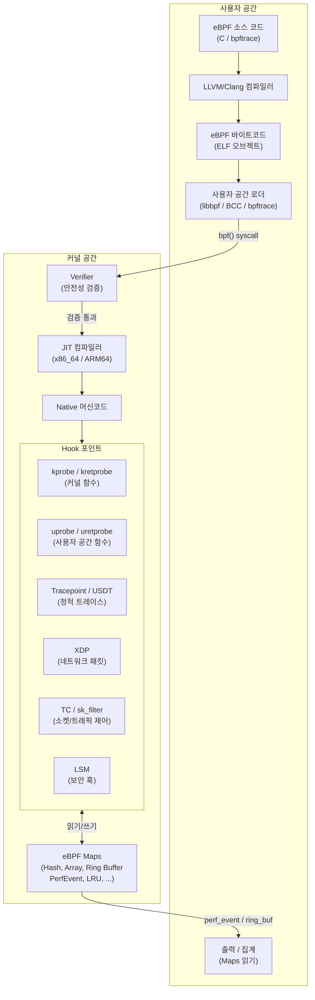
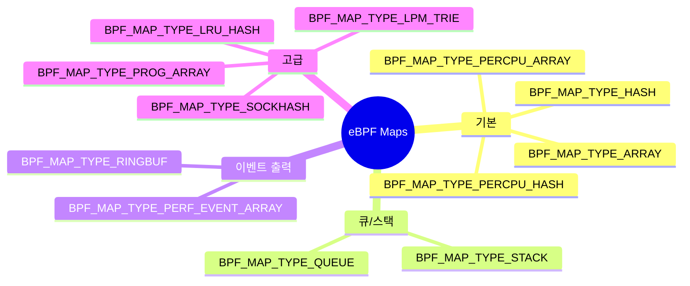
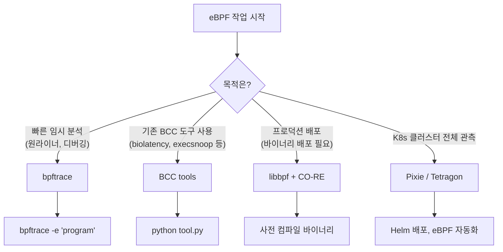
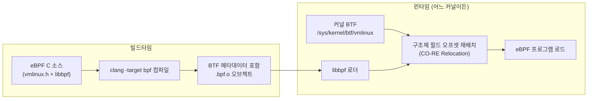
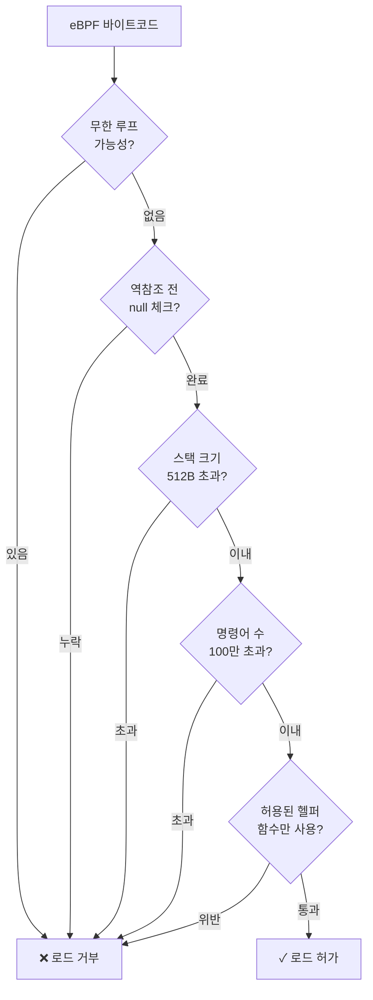

# eBPF 기반 성능 분석 완전 가이드 (bpftrace, BCC, libbpf)

eBPF(extended Berkeley Packet Filter)는 커널을 수정하거나
모듈을 로드하지 않고도 **커널 내부를 안전하게 프로그래밍**할 수
있는 기술이다.
Netflix, Google, Meta, Cloudflare가 프로덕션 관측성과 성능 분석의
핵심 인프라로 채택하고 있으며, 현재 가장 강력한 Linux 성능 분석
도구 기반이다.

---

## 1. eBPF 아키텍처

### 전체 실행 흐름



### Hook 타입 상세

| Hook 타입 | 대상 | 특징 | 주요 사용 사례 |
|-----------|------|------|--------------|
| `kprobe` | 커널 함수 진입 | 동적, ABI 불안정 | 함수 호출 추적 |
| `kretprobe` | 커널 함수 반환 | 반환값 캡처 | 레이턴시 측정 |
| `uprobe` | 사용자 공간 함수 | 프로세스별 | 애플리케이션 추적 |
| `tracepoint` | 커널 정적 훅 | 안정적 ABI | 시스템콜, 스케줄러 |
| `USDT` | 사용자 정적 훅 | 앱 내장 프로브 | MySQL, Node.js, JVM |
| `XDP` | 드라이버 레벨 패킷 | 최고 성능 | DDoS 방어, 로드밸런서 |
| `TC` | 트래픽 제어 | ingress/egress | 네트워크 정책 |
| `LSM` | 보안 훅 | 커널 5.7+ | 런타임 보안 정책 |
| `perf_event` | PMU/CPU 이벤트 | 하드웨어 카운터 | 프로파일링, PMC |
| `cgroup` | cgroup 동작 | 컨테이너 필터 | K8s 네임스페이스 격리 |

### eBPF Map 타입



> **Ring Buffer vs Perf Event Array**
> Linux 5.8+에서 도입된 `BPF_MAP_TYPE_RINGBUF`는 CPU당
> 버퍼를 공유하여 메모리 효율이 높고, 이벤트 순서가 보장된다.
> 신규 코드에서는 Perf Event Array보다 Ring Buffer를 권장한다.

---

## 2. 도구 생태계 비교

### BCC vs bpftrace vs libbpf

| 항목 | BCC | bpftrace | libbpf + CO-RE |
|------|-----|----------|----------------|
| **언어** | Python + C | 전용 DSL | C (커널 측) |
| **학습 곡선** | 중간 | 낮음 | 높음 |
| **빌드 의존성** | LLVM, Python, 커널 헤더 | LLVM, 커널 헤더 | clang, BTF |
| **런타임 의존성** | 런타임 컴파일 (무거움) | 런타임 컴파일 | 없음 (사전 컴파일) |
| **이식성** | 낮음 (커널 헤더 필요) | 낮음 | 높음 (CO-RE) |
| **프로덕션 적합성** | △ (의존성 부담) | △ (런타임 컴파일) | ✓ |
| **one-liner 편의성** | 낮음 | 매우 높음 | 낮음 |
| **커스텀 도구 개발** | 중간 | 제한적 | 완전한 자유도 |
| **대표 프로젝트** | BCC tools, kubectl-trace | bpftrace | Cilium, Tetragon, Pixie |

### 상황별 도구 선택



### 2024-2025 트렌드

BCC의 Python 의존성 문제가 꾸준히 지적되어 왔다.
컨테이너 배포 시 수백 MB의 LLVM + Python 레이어가 필요하며,
커널 헤더 버전 불일치로 런타임 컴파일 실패가 잦다.

이에 따라 **libbpf + CO-RE가 프로덕션 표준**으로 자리잡고 있으며,
BCC 자체도 내부적으로 libbpf 기반으로 마이그레이션 중이다.
(`libbpf-tools/` 디렉토리의 C 구현체 참조)

---

## 3. bpftrace 실전

### 설치

```bash
# Ubuntu 22.04+
sudo apt install bpftrace

# RHEL/CentOS 8+ (EPEL 필요)
sudo dnf install bpftrace

# 버전 확인 (0.20+ 권장)
bpftrace --version
```

### 문법 기초

```
probe [, probe, ...] /filter/ {
    action
}
```

| 요소 | 설명 | 예시 |
|------|------|------|
| **probe** | 훅 포인트 지정 | `kprobe:vfs_read` |
| **filter** | 조건 (C 표현식) | `pid == 1234` |
| **action** | 실행할 코드 블록 | `printf(...)`, `@map[key]++` |

#### 내장 변수 (Built-in Variables)

| 변수 | 의미 |
|------|------|
| `pid` | 프로세스 ID |
| `tid` | 스레드 ID |
| `uid` / `gid` | 사용자/그룹 ID |
| `comm` | 프로세스 이름 (최대 16자) |
| `nsecs` | 현재 시각 (nanoseconds) |
| `elapsed` | 프로그램 시작 후 경과 시간 |
| `cpu` | 현재 CPU 번호 |
| `kstack` | 커널 스택 트레이스 |
| `ustack` | 사용자 스택 트레이스 |
| `args` | 트레이스포인트 인수 구조체 |
| `retval` | kretprobe 반환값 |
| `curtask` | 현재 task_struct 포인터 |

#### 내장 함수 (Built-in Functions)

| 함수 | 설명 |
|------|------|
| `printf()` | 출력 (C printf 형식) |
| `hist(@map)` | 2의 거듭제곱 히스토그램 출력 |
| `lhist(@map, min, max, step)` | 선형 히스토그램 출력 |
| `count()` | 이벤트 카운트 증가 |
| `sum(n)` | 합계 집계 |
| `avg(n)` | 평균 집계 |
| `min(n)` / `max(n)` | 최솟값/최댓값 |
| `str(ptr)` | 포인터에서 문자열 읽기 |
| `ksym(addr)` | 커널 심볼 조회 |
| `usym(addr)` | 사용자 심볼 조회 |
| `ntop(addr)` | IP 주소 변환 |
| `cgroupid(path)` | cgroup ID 조회 |
| `time()` | 현재 시각 출력 |

---

### 실무 one-liner 모음

#### syscall 지연 분석

```bash
# 특정 프로세스의 read() 레이턴시 히스토그램
bpftrace -e '
tracepoint:syscalls:sys_enter_read /comm == "nginx"/ {
    @start[tid] = nsecs;
}
tracepoint:syscalls:sys_exit_read /comm == "nginx" && @start[tid]/ {
    @latency_us = hist((nsecs - @start[tid]) / 1000);
    delete(@start[tid]);
}
END { clear(@start); }'
```

```bash
# 모든 syscall 호출 빈도 상위 10개
bpftrace -e '
tracepoint:raw_syscalls:sys_enter {
    @syscalls[args->id] = count();
}
END { print(@syscalls, 10); }'
```

```bash
# 슬로우 syscall (1ms 이상) 잡기
bpftrace -e '
tracepoint:raw_syscalls:sys_enter { @start[tid] = nsecs; }
tracepoint:raw_syscalls:sys_exit
/@start[tid] && (nsecs - @start[tid]) > 1000000/ {
    printf("%-16s %-6d syscall=%d lat_ms=%d\n",
        comm, pid, args->id,
        (nsecs - @start[tid]) / 1000000);
    delete(@start[tid]);
}'
```

#### 파일 I/O 추적

```bash
# 어떤 파일을 열고 있는지 추적
bpftrace -e '
tracepoint:syscalls:sys_enter_openat {
    printf("%-6d %-16s %s\n", pid, comm, str(args->filename));
}'
```

```bash
# 파일별 읽기 바이트 총합 (상위 집계)
bpftrace -e '
tracepoint:syscalls:sys_exit_read /args->ret > 0/ {
    @bytes[comm] = sum(args->ret);
}
interval:s:5 { print(@bytes); clear(@bytes); }'
```

```bash
# vfs_read / vfs_write 레이턴시를 파일 이름별로 집계
bpftrace -e '
kprobe:vfs_read { @start[tid] = nsecs; }
kretprobe:vfs_read /@start[tid]/ {
    $lat = (nsecs - @start[tid]) / 1000;
    if ($lat > 100) {  # 100µs 이상만
        @slow[comm] = hist($lat);
    }
    delete(@start[tid]);
}'
```

#### 네트워크 연결 추적

```bash
# TCP 연결 시도 추적 (connect)
bpftrace -e '
kprobe:tcp_connect {
    $sk = (struct sock *)arg0;
    $daddr = $sk->__sk_common.skc_daddr;
    $dport = $sk->__sk_common.skc_dport;
    printf("%-6d %-16s -> %s:%d\n",
        pid, comm,
        ntop(AF_INET, $daddr),
        ($dport >> 8) | (($dport & 0xff) << 8));
}'
```

```bash
# TCP accept (서버 측 연결 수락) 추적
bpftrace -e '
kretprobe:inet_csk_accept {
    $sk = (struct sock *)retval;
    $saddr = $sk->__sk_common.skc_rcv_saddr;
    $sport = $sk->__sk_common.skc_num;
    printf("accept: %-16s %s:%d\n",
        comm, ntop(AF_INET, $saddr), $sport);
}'
```

```bash
# TCP 재전송 이벤트 (네트워크 품질 지표)
bpftrace -e '
kprobe:tcp_retransmit_skb {
    @retransmits[comm, pid] = count();
}
interval:s:5 { print(@retransmits); clear(@retransmits); }'
```

#### OOM 이벤트 추적

```bash
# OOM Killer 발동 시 프로세스와 스코어 출력
bpftrace -e '
kprobe:oom_kill_process {
    printf("OOM kill: pid=%d comm=%s\n",
        ((struct task_struct *)arg1)->pid,
        ((struct task_struct *)arg1)->comm);
    printf("  kstack:\n%s\n", kstack);
}'
```

```bash
# 메모리 할당 실패 추적
bpftrace -e '
kprobe:__alloc_pages_slowpath {
    @alloc_fail[comm] = count();
}
interval:s:10 { print(@alloc_fail); }'
```

### 히스토그램 출력 예시

```
# bpftrace 히스토그램 출력 형식
@latency_us:
[0]                    2 |                                      |
[1]                   15 |@                                     |
[2, 4)                89 |@@@@@@                                |
[4, 8)               324 |@@@@@@@@@@@@@@@@@@@@@@                |
[8, 16)              512 |@@@@@@@@@@@@@@@@@@@@@@@@@@@@@@@@@@@@  |
[16, 32)             480 |@@@@@@@@@@@@@@@@@@@@@@@@@@@@@@@@@@@   |
[32, 64)             112 |@@@@@@@@                              |
[64, 128)             23 |@@                                    |
[128, 256)             5 |                                      |
[256, 512)             1 |                                      |
```

---

## 4. BCC 도구 모음

BCC(BPF Compiler Collection)는 사전 개발된 eBPF 도구 모음이다.
패키지로 설치하면 즉시 사용 가능하며, `/usr/share/bcc/tools/` 또는
`/usr/sbin/` 에 위치한다.

```bash
# Ubuntu
sudo apt install bcc-tools linux-headers-$(uname -r)

# RHEL/CentOS
sudo dnf install bcc-tools kernel-devel
```

### 프로세스·시스템 추적

#### execsnoop — 프로세스 실행 추적

```bash
sudo execsnoop-bpfcc

# 출력:
# PCOMM            PID    PPID   RET ARGS
# bash             12345  1234     0 /bin/bash
# curl             12346  12345    0 /usr/bin/curl https://example.com
```

단명 프로세스(fork 후 즉시 종료)가 많아 부하를 일으키는 경우를
진단할 때 필수 도구다.

#### opensnoop — 파일 열기 추적

```bash
sudo opensnoop-bpfcc -p 1234    # 특정 PID만
sudo opensnoop-bpfcc -T         # 타임스탬프 포함
sudo opensnoop-bpfcc -e         # 에러 포함

# 출력:
# PID    COMM               FD ERR PATH
# 1234   java               23   0 /etc/ssl/certs/ca-certificates.crt
# 1234   java              -1   2 /usr/lib/jvm/...  # ENOENT
```

#### funclatency — 함수 레이턴시 분포

```bash
# vfs_read 레이턴시 히스토그램 (µs 단위)
sudo funclatency-bpfcc -u vfs_read

# 라이브러리 함수 추적 (uprobe)
sudo funclatency-bpfcc -u 'c:malloc'

# 출력 (히스토그램):
# usecs              : count     distribution
#     0 -> 1         : 1024     |@@@@@@@@@@@@@@@@@@@@@@@@@@@@|
#     2 -> 3         : 512      |@@@@@@@@@@@@@                |
#     4 -> 7         : 128      |@@@                          |
```

#### stackcount — 함수 호출 스택 빈도

```bash
# 커널에서 ip_output이 호출된 스택 경로 집계
sudo stackcount-bpfcc ip_output

# malloc이 많이 호출되는 코드 경로 찾기
sudo stackcount-bpfcc 'c:malloc' -p 1234
```

### 디스크 I/O

#### biolatency — 블록 I/O 레이턴시 히스토그램

```bash
sudo biolatency-bpfcc -D     # 디스크별 분리
sudo biolatency-bpfcc -m     # ms 단위
sudo biolatency-bpfcc 5 1    # 5초, 1회

# 출력:
# Tracing block device I/O... Hit Ctrl-C to end.
# disk = sda
#      msecs              : count     distribution
#          0 -> 1         : 1832     |@@@@@@@@@@@@@@@@@@@@@@@@@@@@|
#          2 -> 3         : 234      |@@@@                         |
#         64 -> 127       : 2        |                             |  <- outlier!
```

#### biosnoop — 블록 I/O 이벤트 스트림

```bash
sudo biosnoop-bpfcc

# 출력:
# TIME(s)     COMM           PID    DISK    T  SECTOR    BYTES  LAT(ms)
# 0.000000    java           1234   nvme0n1 R  12345678  4096      0.35
# 0.001234    kworker/2:1    89     nvme0n1 W  87654321  131072     1.20
```

### 메모리·캐시

#### cachestat — 페이지 캐시 히트율

```bash
sudo cachestat-bpfcc 1     # 1초 간격

# 출력:
#    TOTAL   MISSES     HITS  DIRTIES   BUFFERS_MB  CACHED_MB
#     2048      128     1920       64         1024       8192
#     1536       64     1472       32         1024       8194
```

페이지 캐시 히트율이 낮으면 실제 디스크 I/O가 많다는 신호다.
`CACHED_MB`가 꾸준히 증가하면 메모리 누수 가능성을 의심한다.

#### cachetop — 프로세스별 페이지 캐시 사용 (top 형식)

```bash
sudo cachetop-bpfcc 1

# 출력:
# PID      UID      CMD              HITS     MISSES   DIRTIES  READ_HIT%  WRITE_HIT%
# 1234     0        java             1920     128      64       93.75%     75.00%
```

### 네트워크

#### tcpconnect — 능동적 TCP 연결 추적

```bash
sudo tcpconnect-bpfcc -t     # 타임스탬프
sudo tcpconnect-bpfcc -p 80  # 목적지 포트 필터

# 출력:
# TIME(s)  PID    COMM         IP SADDR           DADDR           DPORT
# 0.000    1234   curl         4  10.0.0.1        93.184.216.34   443
```

#### tcpaccept — 수동적 TCP 연결 수락 추적

```bash
sudo tcpaccept-bpfcc

# 출력:
# PID    COMM         IP RADDR           RPORT LADDR           LPORT
# 5678   nginx        4  10.0.0.2        51234 10.0.0.1        443
```

#### tcpretrans — TCP 재전송 추적

```bash
sudo tcpretrans-bpfcc

# 출력:
# TIME     PID    IP LADDR:LPORT          T> RADDR:RPORT          STATE
# 0.000    0      4  10.0.0.1:443        R> 10.0.0.2:51234        ESTABLISHED
```

---

## 5. libbpf와 CO-RE

### CO-RE(Compile Once, Run Everywhere) 원리

기존 BCC 방식은 런타임에 커널 헤더를 참조하여 컴파일한다.
커널 업그레이드 또는 헤더 누락 시 동작이 깨진다.

**CO-RE**는 이를 해결한다.



핵심은 **BTF(BPF Type Format)**이다.
커널이 자신의 타입 정보를 `/sys/kernel/btf/vmlinux`에 노출하며,
libbpf가 이를 참조하여 필드 오프셋을 런타임에 보정한다.

```bash
# BTF 지원 확인
ls /sys/kernel/btf/vmlinux   # 존재하면 BTF 지원 (Linux 5.4+)

# vmlinux.h 생성 (bpftool 필요)
bpftool btf dump file /sys/kernel/btf/vmlinux format c > vmlinux.h
```

### libbpf 프로그램 구조

**커널 측 (eBPF 프로그램, `minimal.bpf.c`)**:

```c
// SPDX-License-Identifier: GPL-2.0
#include "vmlinux.h"          // 커널 타입 정의 (BTF 생성)
#include <bpf/bpf_helpers.h>  // BPF 헬퍼 함수

// 출력용 Ring Buffer map
struct {
    __uint(type, BPF_MAP_TYPE_RINGBUF);
    __uint(max_entries, 256 * 1024);  // 256KB
} rb SEC(".maps");

// 이벤트 구조체
struct event {
    __u32 pid;
    char  comm[16];
    __u64 latency_ns;
};

// kprobe on vfs_read
SEC("kprobe/vfs_read")
int BPF_KPROBE(vfs_read_enter, struct file *file,
               char __user *buf, size_t count) {
    struct event *e;
    e = bpf_ringbuf_reserve(&rb, sizeof(*e), 0);
    if (!e) return 0;

    e->pid = bpf_get_current_pid_tgid() >> 32;
    bpf_get_current_comm(&e->comm, sizeof(e->comm));
    // 시작 시각은 별도 map에 저장 (생략)
    bpf_ringbuf_submit(e, 0);
    return 0;
}

char LICENSE[] SEC("license") = "GPL";
```

**사용자 측 (로더, `minimal.c`)**:

```c
#include "minimal.skel.h"  // bpftool gen skeleton으로 자동 생성

int main(void) {
    struct minimal_bpf *skel;
    struct ring_buffer *rb;

    // 스켈레톤 로드 (CO-RE 재배치 포함)
    skel = minimal_bpf__open_and_load();
    if (!skel) { /* 에러 처리 */ }

    // 프로그램 attach
    minimal_bpf__attach(skel);

    // Ring Buffer 폴링
    rb = ring_buffer__new(
        bpf_map__fd(skel->maps.rb),
        handle_event, NULL, NULL
    );
    while (1)
        ring_buffer__poll(rb, 100 /* timeout ms */);
}
```

**빌드**:

```bash
# 빌드 (Makefile)
clang -g -O2 -target bpf \
    -D__TARGET_ARCH_x86 \
    -I/usr/include/bpf \
    -c minimal.bpf.c -o minimal.bpf.o

# 스켈레톤 생성
bpftool gen skeleton minimal.bpf.o > minimal.skel.h

# 사용자 공간 컴파일
gcc -o minimal minimal.c -lbpf
```

---

## 6. 프로덕션 성능 분석 패턴

### CPU 플레임그래프용 스택 추적

Brendan Gregg가 개발한 플레임그래프는 CPU 핫스팟을 시각적으로
확인하는 가장 강력한 방법이다.

```bash
# bpftrace로 CPU 샘플링 (49Hz, 30초)
bpftrace -e '
profile:hz:49 /pid == $1/ {
    @[kstack, ustack, comm] = count();
}' $TARGET_PID > stacks.txt

# FlameGraph 생성
stackcollapse-bpftrace.pl stacks.txt | flamegraph.pl > cpu.svg
```

```bash
# perf + eBPF (더 정확한 방법)
perf record -F 99 -a -g --call-graph dwarf -- sleep 30
perf script | stackcollapse-perf.pl | flamegraph.pl > perf.svg
```

```bash
# profile-bpfcc (BCC 도구)
sudo profile-bpfcc -F 99 -d -p 1234 30 > stacks.txt
flamegraph.pl --color=java < stacks.txt > flame.svg
```

### 메모리 할당 추적

```bash
# malloc 호출 빈도 및 크기 집계
bpftrace -e '
uprobe:/lib/x86_64-linux-gnu/libc.so.6:malloc {
    @alloc_bytes[pid, comm] = sum(arg0);
    @alloc_count[pid, comm] = count();
}
interval:s:10 {
    print(@alloc_bytes);
    print(@alloc_count);
    clear(@alloc_bytes);
    clear(@alloc_count);
}'
```

```bash
# mmap 추적 (대용량 메모리 할당)
bpftrace -e '
tracepoint:syscalls:sys_enter_mmap {
    if (args->len > 1024*1024) {  # 1MB 이상
        printf("mmap: pid=%d comm=%s len=%d\n",
            pid, comm, args->len);
        printf("%s\n", ustack);
    }
}'
```

```bash
# memleak-bpfcc: 해제되지 않은 메모리 추적
sudo memleak-bpfcc -p 1234 --top 10
```

### 네트워크 레이턴시 히스토그램

```bash
# TCP RTT 히스토그램 (커널 내부 측정)
bpftrace -e '
kprobe:tcp_rcv_established {
    $tcp = (struct tcp_sock *)arg0;
    $rtt = $tcp->srtt_us >> 3;  # 평활화된 RTT (µs)
    if ($rtt > 0) {
        @rtt_us = hist($rtt);
    }
}
interval:s:5 { print(@rtt_us); clear(@rtt_us); }'
```

```bash
# TCP 연결 레이턴시 (connect ~ ESTABLISHED)
bpftrace -e '
kprobe:tcp_v4_connect { @start[tid] = nsecs; }
kretprobe:tcp_v4_connect /retval == 0 && @start[tid]/ {
    @connect_us = hist((nsecs - @start[tid]) / 1000);
    delete(@start[tid]);
}'
```

### Lock Contention 분석

```bash
# Mutex 경합 추적 (futex 대기 시간)
bpftrace -e '
tracepoint:syscalls:sys_enter_futex
/args->op & 0x80 == 0 && args->op & 0x7f == 0/ {
    # FUTEX_WAIT
    @start[tid] = nsecs;
    @lock_addr[tid] = args->uaddr;
}
tracepoint:syscalls:sys_exit_futex
/@start[tid]/ {
    $wait_us = (nsecs - @start[tid]) / 1000;
    if ($wait_us > 1000) {  # 1ms 이상 대기
        @contention[comm, @lock_addr[tid]] = hist($wait_us);
    }
    delete(@start[tid]);
    delete(@lock_addr[tid]);
}'
```

```bash
# lockstat-bpfcc: 커널 스핀락/뮤텍스 경합 분석
sudo lockstat-bpfcc -c 10     # 상위 10개 lock 경합
sudo lockstat-bpfcc -C        # contention 통계
```

---

## 7. 컨테이너/K8s 환경

### 권한 요구사항

컨테이너에서 eBPF를 사용하려면 특정 Linux Capability가 필요하다.

| Capability | 역할 | Linux 버전 |
|-----------|------|-----------|
| `CAP_BPF` | eBPF map, 프로그램 생성 | 5.8+ |
| `CAP_PERFMON` | perf_event 접근, kprobe | 5.8+ |
| `CAP_NET_ADMIN` | XDP, TC 프로그램 attach | 모든 버전 |
| `CAP_SYS_ADMIN` | 모든 eBPF (구 방식, 위험) | 모든 버전 |

> Linux 5.8 이전에는 `CAP_SYS_ADMIN`이 eBPF의 모든 것을
> 담당했다. 5.8+에서 `CAP_BPF`와 `CAP_PERFMON`이 분리되어
> **최소 권한 원칙**을 따를 수 있게 됐다.

**K8s DaemonSet 예시 (최소 권한)**:

```yaml
apiVersion: apps/v1
kind: DaemonSet
metadata:
  name: ebpf-monitor
spec:
  template:
    spec:
      hostPID: true          # 호스트 PID 네임스페이스 접근
      containers:
      - name: monitor
        image: ebpf-tool:latest
        securityContext:
          privileged: false   # privileged 불필요
          capabilities:
            add:
            - CAP_BPF        # eBPF map/prog
            - CAP_PERFMON    # kprobe, perf_event
            - CAP_SYS_PTRACE # 심볼 조회
          runAsNonRoot: true
          readOnlyRootFilesystem: true
        volumeMounts:
        - name: debugfs
          mountPath: /sys/kernel/debug
          readOnly: true
      volumes:
      - name: debugfs
        hostPath:
          path: /sys/kernel/debug
```

### Cilium: eBPF 기반 K8s 네트워킹

Cilium은 kube-proxy를 대체하여 **모든 네트워크 정책을 eBPF로
구현**한다. iptables를 완전히 제거하여 대규모 클러스터에서
O(n) 규칙 탐색 오버헤드를 없앤다.

```mermaid
flowchart LR
    subgraph 기존["기존 (iptables)""]
        A["Pod A"] -->|"패킷"| B["iptables 체인\n(O(n) 규칙 탐색)"]
        B --> C["Pod B"]
    end

    subgraph cilium["Cilium (eBPF)"]
        D["Pod A"] -->|"패킷"| E["XDP/TC eBPF Hook\nHash Map O(1) 조회"]
        E --> F["Pod B"]
    end
```

```bash
# Cilium eBPF 상태 확인
cilium status --verbose
cilium bpf policy get --all
cilium bpf lb list         # eBPF load balancer 엔트리
cilium bpf endpoint list   # 엔드포인트 맵

# Hubble로 L7 관측 (eBPF 기반)
hubble observe --pod my-pod --protocol http
hubble observe --pod my-pod --verdict DROPPED
```

### Pixie: eBPF 기반 K8s 관측성

Pixie는 **애플리케이션 수정 없이** eBPF uprobe로 L7 트래픽을
자동 캡처한다. HTTP, gRPC, MySQL, Redis, Kafka를 자동 파싱한다.

```bash
# Pixie 설치 (Helm)
helm repo add pixie-operator https://pixie-operator-charts.storage.googleapis.com
helm install pixie-operator pixie-operator/pixie-operator \
    -n plc --create-namespace \
    --set deployKey=<deploy-key>

# px CLI로 클러스터 상태 조회
px run px/service_stats            # 서비스별 레이턴시/에러율
px run px/http_data                # HTTP 요청 raw 데이터
px run px/pod_lifetime_resource    # Pod 리소스 사용 이력
```

### Tetragon: 보안 관측성

Tetragon(CNCF Incubating)은 eBPF LSM + kprobe로 **런타임 보안
이벤트를 커널 레벨에서** 감지한다.

```yaml
# TracingPolicy: 민감한 파일 접근 감지
apiVersion: cilium.io/v1alpha1
kind: TracingPolicy
metadata:
  name: detect-sensitive-access
spec:
  kprobes:
  - call: "security_file_open"
    syscall: false
    args:
    - index: 0
      type: "file"
    selectors:
    - matchArgs:
      - index: 0
        operator: "Postfix"
        values:
        - "/etc/shadow"
        - "/etc/passwd"
        - "/.ssh/id_rsa"
      matchActions:
      - action: Sigkill   # 즉시 프로세스 종료
```

```bash
# Tetragon 이벤트 스트림
kubectl logs -n kube-system ds/tetragon -c export-stdout \
  | tetra getevents --output compact
```

---

## 8. 보안과 제약

### Verifier 제한사항

eBPF Verifier는 모든 프로그램이 커널에 로드되기 전
**안전성을 정적 분석**한다.



| 제약 | 한계 | 설명 |
|------|------|------|
| 명령어 수 | 100만 (Linux 5.2+) | 과거 4,096에서 증가 |
| 스택 크기 | 512 바이트 | 재귀 불가 |
| 루프 | 제한적 허용 | `bpf_loop()` 헬퍼로 우회 (5.17+) |
| 포인터 산술 | 제한적 | null 체크 없는 역참조 금지 |
| Helper 호출 | 프로그램 타입별 허용 목록 | 타입 불일치 시 거부 |
| Map 크기 | 시스템 메모리에 의존 | `ulimit -l unlimited` 필요할 수 있음 |

### 커널 버전별 기능 지원

| 기능 | 최소 버전 | 비고 |
|------|---------|------|
| eBPF 기본 (BPF_PROG_TYPE_SOCKET_FILTER) | 3.19 | |
| kprobe | 4.1 | |
| tracepoint | 4.7 | |
| XDP | 4.8 | |
| cgroup eBPF | 4.10 | |
| BTF 기초 | 4.18 | |
| LSM 훅 | 5.7 | BPF LSM |
| CAP_BPF / CAP_PERFMON 분리 | 5.8 | |
| Ring Buffer | 5.8 | |
| CO-RE + vmlinux.h BTF | 5.4 (BTF), 5.5 (CO-RE) | |
| bpf_loop() | 5.17 | 제한적 루프 |
| uprobe multi-attach | 5.20 | |
| BPF token (비특권 위임) | 6.9 | |
| struct_ops 확장 | 6.x | TCP 혼잡 제어 등 |

### unprivileged eBPF 상태

Linux에서 비특권 사용자의 eBPF 로드는 **보안 이슈로 기본
비활성화**되어 있다.

```bash
# 현재 상태 확인
sysctl kernel.unprivileged_bpf_disabled

# 0: 허용 (위험)
# 1: 완전 금지
# 2: BPF_PROG_TYPE_SOCKET_FILTER만 허용 (Linux 5.13+)
```

Spectre v2, BPF 탐색 채널 공격 등으로 인해 배포판 기본값은
대부분 `1` 또는 `2`이다.

```bash
# Ubuntu 22.04 기본값 확인
sysctl kernel.unprivileged_bpf_disabled
# kernel.unprivileged_bpf_disabled = 1

# RHEL 9 기본값
# kernel.unprivileged_bpf_disabled = 1
```

프로덕션에서 eBPF 도구를 사용하려면 `root` 또는 적절한
Capability를 가진 서비스 계정으로 실행해야 한다.

### 성능 오버헤드

eBPF 프로그램 자체의 오버헤드는 매우 낮으나, 부주의한 사용은
문제를 일으킬 수 있다.

| 패턴 | 오버헤드 | 권고 |
|------|---------|------|
| tracepoint (정적) | 매우 낮음 (~수 ns) | 항상 권장 |
| kprobe (동적) | 낮음 (~수십 ns) | hot path에서 주의 |
| uprobe | 중간 (~수백 ns/호출) | 고빈도 함수 주의 |
| bpftrace (런타임 컴파일) | 시작 비용 높음 | 일시적 분석용 |
| printf() 빈번 호출 | 높음 (perf ring buffer) | 집계 후 출력 권장 |

> **경험칙**: `printf()`를 초당 수천 회 호출하는 대신
> `@map` 집계 후 `interval` 훅에서 주기적으로 출력하면
> 오버헤드를 10배 이상 줄일 수 있다.

---

## 9. 빠른 참조

### bpftrace probe 문법

```
kprobe:function_name          # 커널 함수 진입
kretprobe:function_name       # 커널 함수 반환
uprobe:path:function          # 사용자 공간 함수 진입
uretprobe:path:function       # 사용자 공간 함수 반환
tracepoint:category:name      # 정적 커널 트레이스포인트
usdt:path:provider:name       # 사용자 정적 트레이스
profile:hz:N                  # CPU 샘플링 (N Hz)
interval:s:N                  # N초마다 실행
BEGIN                         # 프로그램 시작 시
END                           # 프로그램 종료 시
```

### 자주 쓰는 bpftrace one-liner

```bash
# 실행 중인 syscall 실시간 확인
bpftrace -e 'tracepoint:raw_syscalls:sys_enter { @[args->id] = count(); }'

# 파일 읽기를 가장 많이 하는 프로세스
bpftrace -e 'kretprobe:vfs_read /retval>0/ { @[comm]=sum(retval); }'

# 새 프로세스 실행 감지
bpftrace -e 'tracepoint:syscalls:sys_enter_execve { printf("%s\n", str(args->filename)); }'

# TCP 연결 수락 추적
bpftrace -e 'kretprobe:inet_csk_accept { printf("accept: %s\n", comm); }'

# 고빈도 malloc 호출 프로세스
bpftrace -e 'uprobe:/lib/x86_64-linux-gnu/libc.so.6:malloc { @[comm]=count(); }'

# OOM kill 감지
bpftrace -e 'kprobe:oom_kill_process { printf("OOM! %s\n", comm); }'

# 느린 vfs_write (> 10ms)
bpftrace -e 'kprobe:vfs_write { @s[tid]=nsecs; }
kretprobe:vfs_write /@s[tid]&&(nsecs-@s[tid])>10000000/ {
    printf("slow write: %s %dms\n",comm,(nsecs-@s[tid])/1000000);
    delete(@s[tid]); }'
```

---

## 참고 자료

| 자료 | URL | 확인일 |
|------|-----|--------|
| Linux kernel BPF documentation | https://www.kernel.org/doc/html/latest/bpf/ | 2026-04-17 |
| bpftrace Reference Guide | https://github.com/bpftrace/bpftrace/blob/master/docs/reference_guide.md | 2026-04-17 |
| BCC Reference Guide | https://github.com/iovisor/bcc/blob/master/docs/reference_guide.md | 2026-04-17 |
| libbpf API documentation | https://libbpf.readthedocs.io/ | 2026-04-17 |
| BPF CO-RE reference guide | https://nakryiko.com/posts/bpf-core-reference-guide/ | 2026-04-17 |
| Brendan Gregg - BPF Performance Tools | https://www.brendangregg.com/bpf-performance-tools-book.html | 2026-04-17 |
| Cloudflare Blog - eBPF | https://blog.cloudflare.com/tag/ebpf/ | 2026-04-17 |
| Cilium eBPF Go library | https://github.com/cilium/ebpf | 2026-04-17 |
| Tetragon docs | https://tetragon.io/docs/ | 2026-04-17 |
| Pixie project | https://px.dev/ | 2026-04-17 |
| eBPF.io - official hub | https://ebpf.io/ | 2026-04-17 |
| Linux BPF subsystem maintainer blog | https://nakryiko.com/ | 2026-04-17 |
