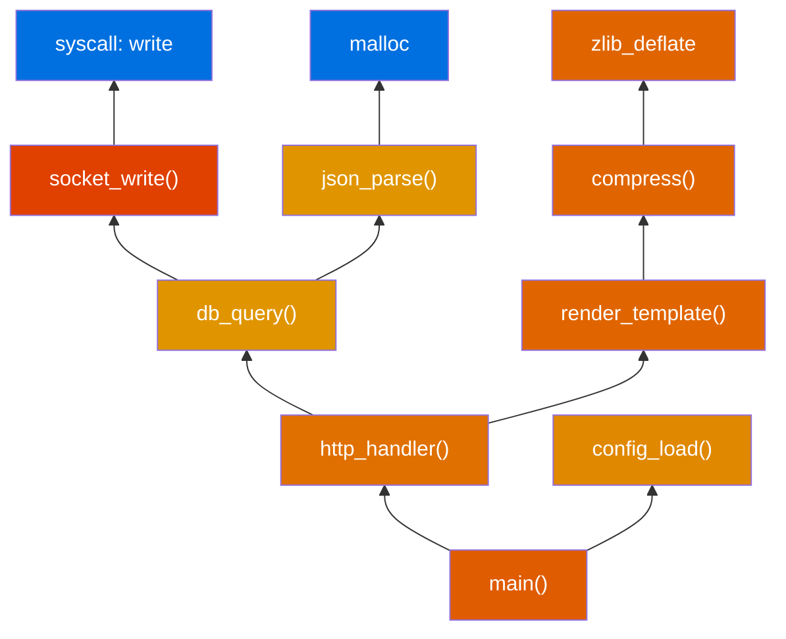
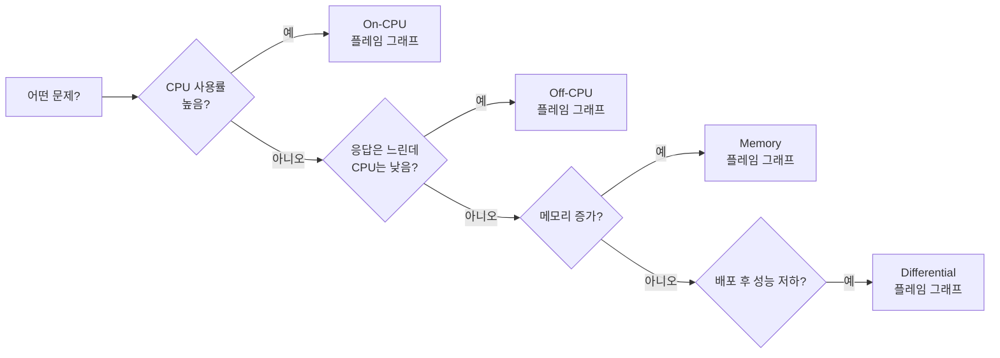
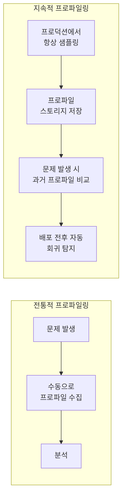
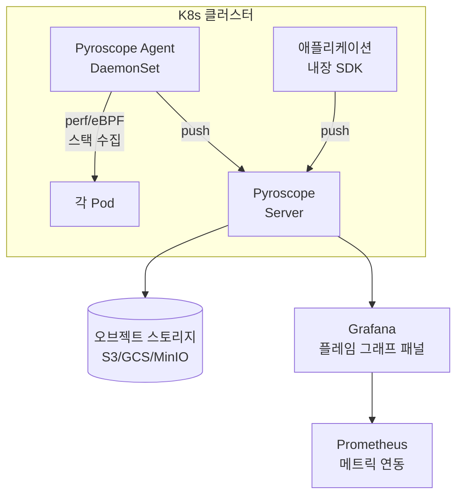
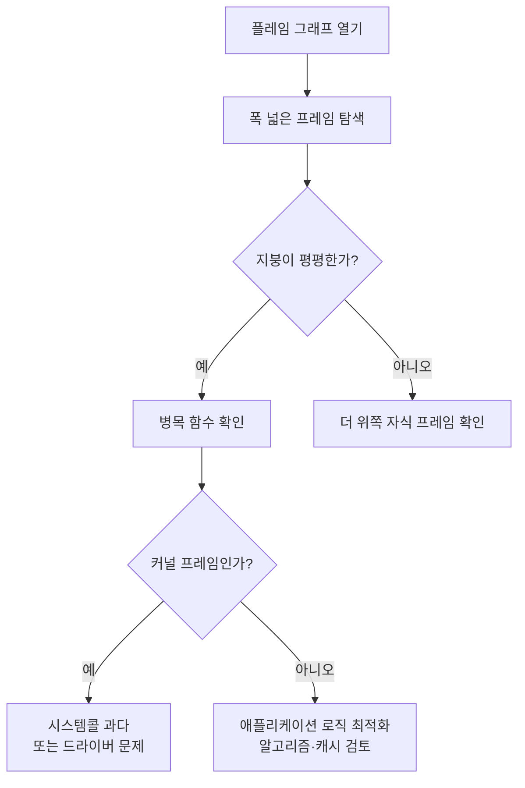

# 플레임 그래프 완전 가이드 (Flame Graph)

프로파일링 결과를 수만 줄의 텍스트로 출력하면 어디가
병목인지 알기 어렵다. **플레임 그래프**는 콜 스택 샘플을
SVG 시각화로 변환해, 1초 안에 핫스팟을 찾아내게 한다.

Netflix의 Brendan Gregg이 2011년 개발했고, 현재는
Google·Meta·Cloudflare 등 모든 탑티어 팀의 표준 도구다.

---

## 1. 플레임 그래프란

### 1-1. 개발 배경

2011년 Brendan Gregg는 MySQL CPU 분석 중
`perf report` 텍스트 출력의 한계를 느꼈다.
수천 개의 스택 프레임을 사람이 읽기란 불가능했고,
그는 Perl 스크립트로 SVG를 자동 생성하는 방법을 고안했다.
오늘날 이 방식은 언어·런타임·플랫폼을 가리지 않고 쓰인다.

> Flame graphs are a visualization of profiled software,
> allowing the most frequent code-paths to be identified
> quickly. — Brendan Gregg (2016)

### 1-2. 구조 시각화



**그래프는 아래(루트)에서 위(리프)로 쌓인다.**
실제 플레임 그래프에서 각 사각형의 폭이 넓을수록
전체 샘플 중 해당 함수가 스택에 나타난 비율이 높다.

### 1-3. 읽는 법

| 축 | 의미 | 오해 주의 |
|------|------|---------|
| **X축** | 전체 프로파일 시간 대비 샘플 비율 | 시간 순서가 아니다 |
| **Y축** | 콜 스택 깊이 (위로 갈수록 더 안쪽 호출) | 절대적인 함수 깊이가 아니다 |
| **폭** | 해당 함수가 샘플에 나타난 비율 = CPU 점유 비율 | |
| **색상** | 보통 스택 영역 구분 (임의색 또는 의미색) | |

**핫스팟 식별**: X축 폭이 넓고 **그 위에 자식 프레임이 없는
"평평한 지붕(plateau)"** 이 병목이다. 이 위치가 CPU가
실제로 실행 중이던 코드다.

### 1-4. 색상의 의미

기본 `flamegraph.pl`은 색상을 무작위로 쓰지만,
**의미 기반 색상 팔레트**를 쓰면 더 직관적이다.

| 색상 팔레트 | 영역 | 용도 |
|------------|------|------|
| 주황/빨강 계열 | User space (애플리케이션) | CPU On-CPU 기본 |
| 파란 계열 | Kernel space (커널·드라이버) | `--color=java` 포함 |
| 녹색 계열 | JIT 컴파일 코드 (Java/Node) | `--color=java` |
| 수수/빨간 계열 | Off-CPU (대기) | Off-CPU 플레임 |
| 보라 계열 | 메모리 할당 경로 | Memory 플레임 |

```bash
# 색상 팔레트 지정 예시
flamegraph.pl --color=java --title="JVM CPU Profile" \
    < stacks.txt > flamegraph.svg
```

---

## 2. 플레임 그래프 종류



| 종류 | 수집 대상 | 언제 사용 | 수집 도구 |
|------|---------|---------|---------|
| **On-CPU** | CPU에서 실행 중인 스택 | CPU 사용률 높음 | `perf`, `bpftrace` |
| **Off-CPU** | I/O·락·슬립 대기 스택 | CPU 낮은데 응답 느림 | `bpftrace offcputime` |
| **Memory** | 메모리 할당 경로 스택 | 메모리 증가·누수 | `bpftrace`, `heaptrack` |
| **Differential** | 두 프로파일의 차이 | 배포 전후 회귀 탐지 | `difffolded.pl` |
| **Hot/Cold** | On-CPU + Off-CPU 결합 | 전체 지연 원인 파악 | `bpftrace` |

---

## 3. 스택 수집 도구

### 3-1. perf (Linux 기본)

```bash
# 전체 시스템, 99Hz 샘플링, 콜 그래프 포함, 30초
sudo perf record -F 99 -a -g -- sleep 30

# 특정 프로세스만 (PID 지정)
sudo perf record -F 99 -p <PID> -g -- sleep 30

# 스택 텍스트 출력
sudo perf script > out.perf
```

> `-F 99`: 99Hz는 의도적인 선택이다. 100Hz는 타이머
> 인터럽트와 동기화돼 편향(bias)이 생긴다.
> Brendan Gregg의 권고값이기도 하다.

**perf 스택 수집 요건**

```bash
# 커널 심볼 (없으면 커널 프레임이 [unknown]으로 표시)
sudo sh -c 'echo 0 > /proc/sys/kernel/kptr_restrict'
sudo sh -c 'echo -1 > /proc/sys/kernel/perf_event_paranoid'

# 프레임 포인터 기반 스택 (가장 신뢰도 높음)
# 컴파일 시 -fno-omit-frame-pointer 필요
# 없으면 --call-graph dwarf 사용 (느리지만 정확)
sudo perf record -F 99 -a -g --call-graph dwarf -- sleep 30
```

### 3-2. bpftrace 스택 수집

```bash
# On-CPU 스택 수집 (99Hz, 30초)
sudo bpftrace -e '
profile:hz:99
{
    @[kstack, ustack] = count();
}
END
{
    print(@);
}
' > bpftrace_stacks.txt

# Off-CPU 스택 수집
sudo bpftrace -e '
tracepoint:sched:sched_switch
/prev->state != 0/
{
    @[kstack, ustack, prev->comm] = count();
}
' > offcpu_stacks.txt
```

### 3-3. async-profiler (Java)

Java는 JVM 내부 콜 스택을 수집해야 한다.
`perf`는 JIT 컴파일 코드의 심볼을 제대로 해석하지 못한다.
`async-profiler`는 AsyncGetCallTrace API를 사용해
**Safepoint bias** 없이 정확한 스택을 수집한다.

```bash
# 다운로드 (최신: v3.0, 2024)
wget https://github.com/async-profiler/async-profiler/releases/\
latest/download/async-profiler-3.0-linux-x64.tar.gz
tar xzf async-profiler-3.0-linux-x64.tar.gz
cd async-profiler-3.0-linux-x64

# 실행 중인 JVM에 어태치 (30초, 플레임 그래프 SVG 직접 출력)
./bin/asprof -d 30 -f flamegraph.html <JVM_PID>

# perf 형식으로 출력 (FlameGraph 스크립트와 연동)
./bin/asprof -d 30 -o collapsed -f stacks.txt <JVM_PID>
```

**Safepoint bias 문제**: JVM의 기본 샘플링은 Safepoint
에서만 발생해 편향된 결과를 만든다. async-profiler는
이 문제를 회피하는 몇 안 되는 도구다.

### 3-4. py-spy (Python)

```bash
pip install py-spy

# 실행 중인 프로세스에 어태치, SVG 직접 생성
py-spy record -o profile.svg --pid <PID>

# 30초 샘플링, 100Hz
py-spy record -o profile.svg -d 30 -r 100 --pid <PID>

# 네이티브 C 확장도 포함 (numpy, scipy 등)
py-spy record -o profile.svg --native --pid <PID>

# 서브프로세스 실행과 동시에 프로파일링
py-spy record -o profile.svg -- python my_script.py
```

### 3-5. rbspy (Ruby)

```bash
# 설치
curl -L https://github.com/rbspy/rbspy/releases/latest/\
download/rbspy-x86_64-unknown-linux-musl.tar.gz | tar xz

# 실행 중인 Ruby 프로세스 프로파일링
sudo ./rbspy record --pid <PID> --file profile.svg \
    --format flamegraph

# Rails 서버 예시
sudo ./rbspy record --pid $(pgrep -f puma) \
    --file rails_profile.svg --format flamegraph --duration 30
```

### 3-6. 0x (Node.js)

```bash
npm install -g 0x

# Node.js 앱 직접 실행 (내부적으로 V8 프로파일러 사용)
0x -- node server.js

# 기존 실행 중인 프로세스는 --pid 지원 안 함
# 대신 V8 inspector + clinic.js 조합 권장
npm install -g clinic
clinic flame -- node server.js
```

### 3-7. Go pprof

```go
// main.go에 추가
import (
    _ "net/http/pprof"
    "net/http"
)

func main() {
    go http.ListenAndServe(":6060", nil)
    // ...
}
```

```bash
# 30초 CPU 프로파일 수집
go tool pprof http://localhost:6060/debug/pprof/profile?seconds=30

# pprof 인터랙티브 셸에서 플레임 그래프 출력
(pprof) web   # 브라우저로 SVG 열기
(pprof) png   # PNG 파일 출력
```

---

## 4. 플레임 그래프 생성

### 4-1. Brendan Gregg FlameGraph 스크립트

```bash
# 설치
git clone https://github.com/brendangregg/FlameGraph
cd FlameGraph

# perf → 플레임 그래프 파이프라인
perf script > out.perf
./stackcollapse-perf.pl out.perf > out.folded
./flamegraph.pl out.folded > flamegraph.svg
```

**한 줄 파이프라인**

```bash
sudo perf record -F 99 -a -g -- sleep 30 && \
  sudo perf script | \
  /opt/FlameGraph/stackcollapse-perf.pl | \
  /opt/FlameGraph/flamegraph.pl \
    --color=hot \
    --title="Production CPU Profile" \
    --subtitle="$(hostname) $(date)" \
  > /tmp/flamegraph.svg
```

### 4-2. stackcollapse와 flamegraph.pl 옵션

```bash
# stackcollapse-perf.pl 주요 옵션
./stackcollapse-perf.pl \
    --kernel     \  # 커널 프레임 포함 (기본 포함)
    --pid        \  # PID 정보 포함
    out.perf > out.folded

# flamegraph.pl 주요 옵션
./flamegraph.pl \
    --title "My App CPU" \   # 제목
    --subtitle "99Hz, 30s" \ # 부제목
    --color hot \            # 색상 팔레트
    --width 1600 \           # SVG 폭(px)
    --height 16 \            # 프레임 높이(px)
    --minwidth 0.1 \         # 최소 표시 폭(%)
    --reverse \              # 역방향 (icicle graph)
    out.folded > flamegraph.svg
```

**색상 팔레트 옵션**

| 팔레트 | 설명 |
|--------|------|
| `hot` | 기본 주황/빨강 그라데이션 |
| `mem` | 녹색 계열 (메모리 프로파일) |
| `io` | 파란 계열 (I/O 프로파일) |
| `java` | User=녹색, Kernel=파란, JIT=보라 |
| `perl` | Perl 전용 |
| `js` | JavaScript 전용 |
| `wakeup` | Off-CPU 대기 전용 |

### 4-3. SVG 인터랙티브 기능

생성된 SVG 파일을 브라우저에서 열면:

- **클릭**: 해당 프레임으로 확대 (드릴다운)
- **Ctrl+F**: 함수명 검색 및 하이라이트
- **루트 클릭**: 전체 뷰로 복귀

```bash
# 브라우저 열기
xdg-open flamegraph.svg       # Linux
open flamegraph.svg            # macOS
python3 -m http.server 8080 & # 원격 서버에서 HTTP 서빙
```

### 4-4. Speedscope (대안 뷰어)

```bash
# 설치 없이 온라인 사용
# https://www.speedscope.app (파일 드래그&드롭)

# CLI 설치
npm install -g speedscope

# perf collapsed 형식 직접 입력
speedscope out.folded
```

Speedscope는 `flamegraph.pl`보다 인터랙티브 기능이 풍부하고
Left Heavy, Sandwich 등 다양한 뷰를 제공한다.

| 뷰 모드 | 설명 |
|---------|------|
| **Time Order** | 시간 순서대로 스택 표시 |
| **Left Heavy** | 가장 무거운 프레임을 왼쪽으로 합산 |
| **Sandwich** | 함수별 호출자·피호출자 집계 |

### 4-5. Grafana Pyroscope 연동

```yaml
# values.yaml (Helm)
pyroscope:
  enabled: true

# scrapeConfigs로 타겟 등록
scrapeConfigs:
  - jobName: my-app
    staticConfigs:
      - targets:
          - "my-app-svc.default.svc:6060"
    profilingConfig:
      pprof:
        enabled: true
        path: /debug/pprof/profile
```

```bash
# Helm 설치
helm repo add grafana https://grafana.github.io/helm-charts
helm install pyroscope grafana/pyroscope \
    -n monitoring --create-namespace
```

Pyroscope UI에서 시간 범위를 선택하면 플레임 그래프가
자동으로 집계되며, Grafana 대시보드와 연동해 메트릭과
프로파일을 동시에 볼 수 있다.

---

## 5. 언어별 실전 가이드

### 5-1. C/C++

```bash
# 빌드 시 프레임 포인터 보존 (필수)
gcc -O2 -fno-omit-frame-pointer -g -o myapp myapp.c
g++ -O2 -fno-omit-frame-pointer -g -o myapp myapp.cpp

# DWARF 심볼 있는 경우 (더 정확)
sudo perf record -F 99 -p $(pgrep myapp) \
    -g --call-graph dwarf -- sleep 30
sudo perf script | stackcollapse-perf.pl | \
    flamegraph.pl > myapp.svg

# perf annotate로 어셈블리 수준 핫스팟 확인
sudo perf report --stdio -g none
sudo perf annotate <function_name>
```

### 5-2. Java (JVM)

```bash
# async-profiler로 CPU + 할당 동시 프로파일링
./bin/asprof -d 60 \
    -e cpu,alloc \
    -o flamegraph \
    -f profile.html \
    <JVM_PID>

# Docker 컨테이너 내부 JVM 프로파일링
docker exec -it <container> /bin/bash
# 컨테이너 내에서
./bin/asprof -d 30 -f /tmp/cpu.html 1
docker cp <container>:/tmp/cpu.html ./
```

**JVM 프로파일링 시 주의사항**

| 문제 | 원인 | 해결 |
|------|------|------|
| 스택에 `Interpreted_invoke` 과다 | JIT 워밍업 전 프로파일링 | 워밍업 후 측정 |
| Safepoint bias | 표준 JVMTI 샘플러 사용 | async-profiler 사용 |
| `[unknown]` 프레임 | JIT 심볼 없음 | `-Xss` 또는 `/tmp/perf-*.map` 활성화 |
| 네이티브 메서드 누락 | JNI 프레임 | `--all-user` 옵션 추가 |

### 5-3. Python

```bash
# py-spy: 권한 없이 어태치 가능 (--nonblocking 옵션)
sudo py-spy record \
    --pid $(pgrep -f "python app.py") \
    --output profile.svg \
    --duration 30 \
    --rate 100 \
    --nonblocking  # GIL 락 없이 수집 (약간 부정확)

# cProfile + gprof2dot로 호환 SVG 생성
python -m cProfile -o profile.prof app.py
python -m gprof2dot -f pstats profile.prof | \
    dot -Tsvg -o callgraph.svg
```

### 5-4. Go

```go
// HTTP 핸들러에 pprof 추가
import _ "net/http/pprof"

// 메인 함수에서 pprof 서버 구동
go func() {
    log.Println(http.ListenAndServe("localhost:6060", nil))
}()
```

```bash
# CPU 프로파일 30초 수집 후 플레임 그래프
go tool pprof -http=:8080 \
    http://localhost:6060/debug/pprof/profile?seconds=30

# curl로 프로파일 파일 저장
curl -o cpu.prof \
    "http://localhost:6060/debug/pprof/profile?seconds=30"

# pprof CLI에서 flamegraph 뷰
go tool pprof cpu.prof
(pprof) web  # Graphviz 필요

# goroutine 블로킹 분석
curl -o block.prof \
    "http://localhost:6060/debug/pprof/block"
go tool pprof block.prof
```

### 5-5. Rust

```bash
# Cargo에 profiling 의존성 추가 (Cargo.toml)
[profile.release]
debug = true  # 릴리즈 빌드에 심볼 포함

# flamegraph 크레이트 사용
cargo install flamegraph
cargo flamegraph --bin myapp

# perf 기반으로 직접 수집
sudo perf record -F 99 -g -- ./target/release/myapp
sudo perf script | stackcollapse-perf.pl | \
    flamegraph.pl > rust_profile.svg
```

---

## 6. 지속적 프로파일링 (Continuous Profiling)

### 6-1. 개념



지속적 프로파일링의 핵심은 **문제가 발생하기 전부터
데이터를 확보**하는 것이다. Netflix가 채택한 이후
CNCF 생태계 전반으로 확산됐다.

**오버헤드**: 일반적인 샘플링(99Hz)은 CPU 오버헤드
1~2% 수준으로 프로덕션에서 항상 켜두기에 충분히 낮다.

### 6-2. Grafana Pyroscope 아키텍처



```yaml
# pyroscope-agent DaemonSet 예시
apiVersion: apps/v1
kind: DaemonSet
metadata:
  name: pyroscope-agent
  namespace: monitoring
spec:
  selector:
    matchLabels:
      app: pyroscope-agent
  template:
    spec:
      hostPID: true      # 호스트 프로세스 접근 필요
      hostNetwork: true
      containers:
        - name: agent
          image: grafana/pyroscope:latest
          securityContext:
            privileged: true   # eBPF/perf 권한 필요
          env:
            - name: PYROSCOPE_SERVER_ADDRESS
              value: "http://pyroscope:4040"
          volumeMounts:
            - name: sys
              mountPath: /sys
            - name: proc
              mountPath: /proc
      volumes:
        - name: sys
          hostPath:
            path: /sys
        - name: proc
          hostPath:
            path: /proc
```

### 6-3. Parca (CNCF Incubating)

Parca는 CNCF Incubating 프로젝트로, eBPF 기반의
지속적 프로파일링 솔루션이다.

```bash
# Parca Server 설치 (K8s)
helm repo add parca https://charts.parca.dev
helm install parca parca/parca \
    -n parca --create-namespace

# Parca Agent (DaemonSet) 설치
helm install parca-agent parca/parca-agent \
    -n parca \
    --set parca.address="parca.parca.svc:7070"
```

| 도구 | 방식 | 스토리지 | 특징 |
|------|------|---------|------|
| **Grafana Pyroscope** | 에이전트 push | S3/오브젝트 | Grafana 통합, 멀티 언어 |
| **Parca** | eBPF pull | 내장 TSDB | CNCF, 오픈소스 네이티브 |
| **Elastic APM** | SDK | Elasticsearch | APM 통합 |
| **Datadog Continuous Profiler** | 에이전트 | SaaS | 상용, 간편한 설정 |
| **Google Cloud Profiler** | SDK | GCS | GCP 전용 |

---

## 7. 분석 패턴

### 7-1. On-CPU 병목 식별



**평평한 지붕(plateau)** 을 찾는 것이 핵심이다.
프레임 위에 자식이 없다는 것은 CPU가 그 함수 안에서
실제로 계산 중이라는 의미다.

```bash
# 특정 함수만 필터링 (SVG에서 Ctrl+F 또는 명령줄)
./flamegraph.pl --search "db_query" out.folded > filtered.svg

# grep으로 특정 함수가 포함된 스택만 추출
grep "db_query" out.folded | ./flamegraph.pl > dbquery.svg
```

### 7-2. Differential 플레임 그래프로 회귀 찾기

배포 전후를 비교하는 데 강력하다.
빨간색은 샘플 증가(느려진 부분), 파란색은 감소(빨라진 부분).

```bash
# 배포 전 프로파일 수집
sudo perf record -F 99 -a -g -- sleep 30
sudo perf script | ./stackcollapse-perf.pl > before.folded

# 배포 후 프로파일 수집
sudo perf record -F 99 -a -g -- sleep 30
sudo perf script | ./stackcollapse-perf.pl > after.folded

# 차분 계산 및 시각화
./difffolded.pl before.folded after.folded | \
    ./flamegraph.pl \
        --title "Differential: After vs Before" \
        --color red \
        --bgcolor bgcolor2 \
    > diff.svg
```

### 7-3. Off-CPU 분석으로 대기 시간 파악

```bash
# bpftrace로 Off-CPU 스택 수집 (30초)
sudo bpftrace -e '
#include <linux/sched.h>

tracepoint:sched:sched_switch
{
    if (args->prev_state == TASK_INTERRUPTIBLE ||
        args->prev_state == TASK_UNINTERRUPTIBLE) {
        @start[args->prev_pid] = nsecs;
    }
}

tracepoint:sched:sched_switch
/@start[args->next_pid]/
{
    @offcpu[kstack, ustack, args->next_comm] =
        sum(nsecs - @start[args->next_pid]);
    delete(@start[args->next_pid]);
}

END { clear(@start); }
' > offcpu_raw.txt

# 플레임 그래프 변환
./stackcollapse-bpftrace.pl offcpu_raw.txt | \
    ./flamegraph.pl \
        --color io \
        --title "Off-CPU Time" \
        --countname "microseconds" \
    > offcpu.svg
```

| Off-CPU 패턴 | 원인 | 대응 |
|-------------|------|------|
| `futex_wait` 폭넓게 분포 | Lock contention | 락 범위 줄이기, lock-free 구조 검토 |
| `do_sys_poll`/`epoll_wait` | I/O 대기 (정상) | I/O 처리량 확인 |
| `schedule_timeout` | 타이머 슬립 | 불필요한 sleep/timeout 코드 검토 |
| `tcp_recvmsg` | 네트워크 대기 | 네트워크 레이턴시, 배치 처리 검토 |

### 7-4. Lock Contention 시각화

```bash
# perf lock 분석 (Lock contention 수치 확인)
sudo perf lock record -a -- sleep 10
sudo perf lock report

# futex 경합 상세 (bpftrace)
sudo bpftrace -e '
tracepoint:syscalls:sys_enter_futex
/args->op == 0/  /* FUTEX_WAIT */
{
    @futex[ustack] = count();
}
' > futex_stacks.txt

./stackcollapse-bpftrace.pl futex_stacks.txt | \
    ./flamegraph.pl \
        --title "Futex Contention" \
        --color mem \
    > futex.svg
```

---

## 8. 운영 체크리스트

| 단계 | 확인 항목 |
|------|---------|
| 수집 전 | `kptr_restrict=0`, `perf_event_paranoid=-1` 설정 |
| 수집 전 | 빌드 시 `-fno-omit-frame-pointer` 또는 DWARF 확인 |
| 수집 중 | 최소 30초 이상 샘플링 (너무 짧으면 통계 부족) |
| 수집 후 | `[unknown]` 프레임이 과도하게 많으면 심볼 재확인 |
| 분석 시 | 자식 없는 넓은 프레임(plateau)을 먼저 탐색 |
| 비교 시 | Differential 플레임으로 배포 전후 회귀 탐지 |
| 프로덕션 | Pyroscope/Parca DaemonSet으로 상시 수집 고려 |

---

## 참고 자료

- [Brendan Gregg - Flame Graphs](https://www.brendangregg.com/flamegraphs.html)
  — 원저자 공식 페이지, 확인: 2026-04-17
- [FlameGraph GitHub](https://github.com/brendangregg/FlameGraph)
  — 원본 스크립트, 확인: 2026-04-17
- [async-profiler GitHub](https://github.com/async-profiler/async-profiler)
  — Java 프로파일러, 확인: 2026-04-17
- [py-spy GitHub](https://github.com/benfred/py-spy)
  — Python 프로파일러, 확인: 2026-04-17
- [Grafana Pyroscope Docs](https://grafana.com/docs/pyroscope/latest/)
  — 지속적 프로파일링, 확인: 2026-04-17
- [Parca Docs](https://www.parca.dev/docs/overview)
  — CNCF Incubating, 확인: 2026-04-17
- [Brendan Gregg - Systems Performance (2nd Ed.)](https://www.brendangregg.com/systems-performance-2nd-edition-book.html)
  — 2021, 실무 성능 분석 바이블
- [USENIX SREcon - Continuous Profiling at Scale](https://www.usenix.org/conference/srecon)
  — SRE 컨퍼런스 발표 자료, 확인: 2026-04-17
