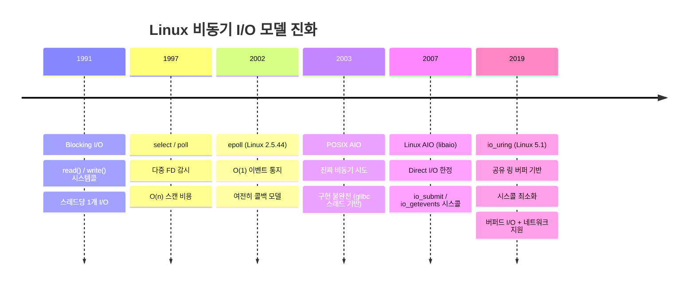
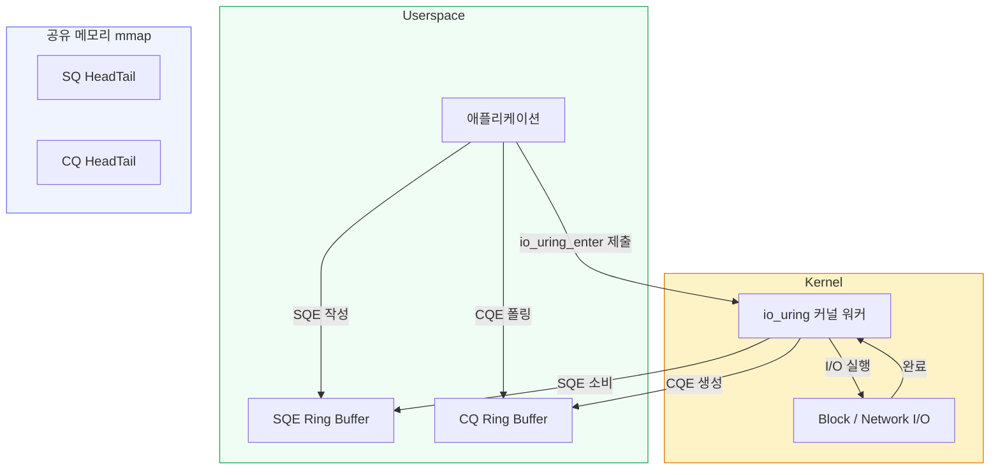
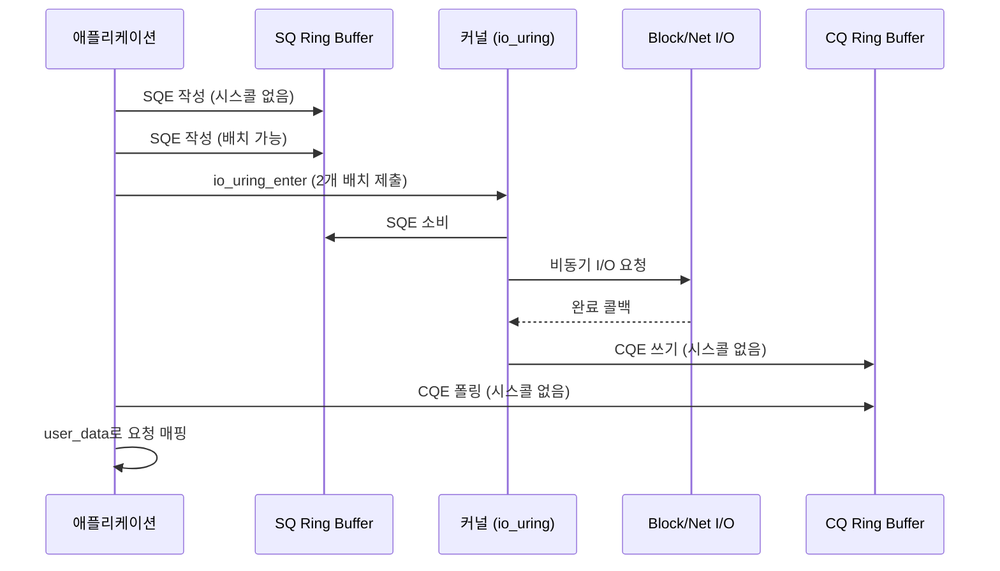
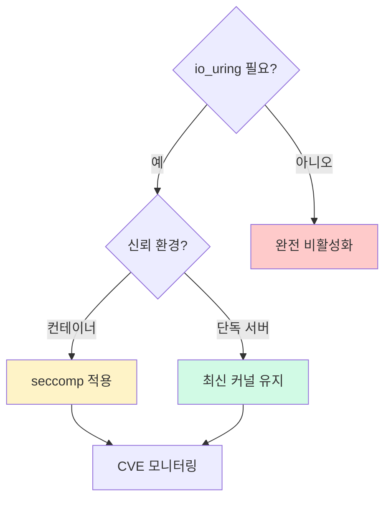

# io_uring과 비동기 I/O 완전 가이드

Linux I/O 서브시스템의 근본적인 한계를 해결하기 위해
2019년 등장한 `io_uring`은 현재 PostgreSQL 18, RocksDB,
libuv(Node.js)까지 채택하며 고성능 I/O의 사실상 표준이
되고 있다. 이 가이드는 아키텍처부터 보안까지 실무에서
필요한 모든 것을 다룬다.

---

## 1. Linux I/O 모델 진화

### 1.1 전체 흐름



### 1.2 방식별 비교

| 방식 | 도입 버전 | 비동기 | 버퍼드 I/O | 시스콜 비용 | 현황 |
|------|----------|--------|-----------|-----------|------|
| `read`/`write` | Linux 1.0 | 아니오 | 지원 | 요청당 1회 | 현역 |
| `select`/`poll` | Linux 1.0 | 부분 | 지원 | O(n) 스캔 | 레거시 |
| `epoll` | Linux 2.5.44 | 부분 | 지원 | O(1) 이벤트 | 현역 |
| `POSIX AIO` | glibc 2.1 | 이론상 | 제한 | 스레드 기반 | 비권장 |
| `Linux AIO` | Linux 2.6 | 예 | Direct 전용 | 요청당 2회 | 제한적 |
| **`io_uring`** | **Linux 5.1** | **예** | **완전 지원** | **배치 처리** | **권장** |

### 1.3 epoll과 io_uring의 핵심 차이

epoll은 **"I/O가 준비됐다"** 는 통지만 제공한다.
실제 데이터 전송은 별도 시스콜(`read`, `send` 등)이 필요하다.

io_uring은 **I/O 준비 통지 + 실행 + 완료 회신**을
하나의 메커니즘으로 통합한다. 이 차이가 시스콜 횟수를
극적으로 줄이는 핵심이다.

---

## 2. io_uring 아키텍처

### 2.1 핵심 구조

io_uring은 커널과 유저스페이스가 **공유 메모리**로
직접 통신하는 구조다. 두 개의 링 버퍼를 통해
시스콜 없이도 요청을 전달하고 완료를 수신할 수 있다.



### 2.2 SQE / CQE 구조

**SQE (Submission Queue Entry)** — 64바이트 고정 크기

```c
struct io_uring_sqe {
    __u8    opcode;       /* 연산 코드 (IORING_OP_READ 등) */
    __u8    flags;        /* IOSQE_* 플래그 */
    __u16   ioprio;       /* I/O 우선순위 */
    __s32   fd;           /* 파일 디스크립터 */
    union {
        __u64 off;        /* 파일 오프셋 */
        __u64 addr2;
    };
    union {
        __u64 addr;       /* 버퍼 주소 */
        __u64 splice_off_in;
    };
    __u32   len;          /* 버퍼 길이 */
    /* ... */
    __u64   user_data;    /* 요청 식별자 (CQE에서 반환) */
};
```

**CQE (Completion Queue Entry)** — 16바이트 고정 크기

```c
struct io_uring_cqe {
    __u64   user_data;  /* SQE에서 복사된 식별자 */
    __s32   res;        /* 결과 (성공 시 반환값, 실패 시 -errno) */
    __u32   flags;      /* IORING_CQE_F_* 플래그 */
};
```

### 2.3 요청 처리 흐름



### 2.4 핵심 시스템콜 3개

io_uring은 단 3개의 시스콜로 모든 동작을 처리한다.

```c
/* 1. 링 초기화: SQ/CQ 생성 및 공유 메모리 설정 */
int io_uring_setup(unsigned entries,
                   struct io_uring_params *p);

/* 2. 요청 제출 및 완료 대기 (핵심 시스콜) */
int io_uring_enter(unsigned int fd,
                   unsigned int to_submit,
                   unsigned int min_complete,
                   unsigned int flags,
                   sigset_t *sig);

/* 3. 고정 파일/버퍼 등록 (zero-copy 최적화) */
int io_uring_register(unsigned int fd,
                      unsigned int opcode,
                      void *arg,
                      unsigned int nr_args);
```

### 2.5 고급 기능: Fixed Files & Fixed Buffers

매 요청마다 `fd`를 커널이 참조하면 레퍼런스 카운트
오버헤드가 발생한다. **Fixed Files**로 파일을 미리
등록하면 이 오버헤드를 제거할 수 있다.

```c
/* 파일 디스크립터 배열 등록 */
int fds[] = {fd1, fd2, fd3};
io_uring_register(ring_fd,
    IORING_REGISTER_FILES, fds, 3);

/* SQE 작성 시 fixed file 플래그 사용 */
sqe->flags |= IOSQE_FIXED_FILE;
sqe->fd = 0;  /* 등록된 배열의 인덱스 */
```

**Fixed Buffers**는 유저스페이스 버퍼를 커널에
미리 등록(pin)하여 매 요청마다 발생하는 페이지 핀
오버헤드를 제거한다.

```c
struct iovec iov[2];
iov[0].iov_base = buf0;
iov[0].iov_len  = BUF_SIZE;
iov[1].iov_base = buf1;
iov[1].iov_len  = BUF_SIZE;

/* 버퍼 한 번만 등록 */
io_uring_register(ring_fd,
    IORING_REGISTER_BUFFERS, iov, 2);

/* SQE에서 fixed buffer 인덱스로 참조 */
io_uring_prep_read_fixed(sqe, fd, buf0,
    BUF_SIZE, offset, 0 /* buf_index */);
```

### 2.6 SQPOLL 모드: 커널 폴링 스레드

SQPOLL은 **커널 전용 스레드**가 SQ를 지속적으로
폴링하는 모드다. `io_uring_enter()` 시스콜 자체가
불필요해져 완전한 zero-syscall I/O가 가능하다.

```c
struct io_uring_params params = {0};
params.flags |= IORING_SETUP_SQPOLL;
params.sq_thread_idle = 2000; /* 2초 유휴 후 슬립 */

int fd = io_uring_setup(QUEUE_DEPTH, &params);
```

> **주의**: SQPOLL은 CPU 코어를 전용으로 소모한다.
> 처리량이 높은 경우에만 효과적이며, 저부하 환경에서는
> 오히려 낭비가 될 수 있다.

---

## 3. io_uring 성능 특성

### 3.1 시스템콜 횟수 비교

동일한 1,000개의 I/O 요청을 처리할 때:

| 방식 | 시스콜 횟수 | 비고 |
|------|------------|------|
| `pread` (동기) | 1,000회 | 요청당 1 시스콜 |
| `libaio` | ~2,000회 | `io_submit` + `io_getevents` |
| `io_uring` (기본) | 1~수 회 | 배치 제출 |
| `io_uring` (SQPOLL) | **0회** | 커널 폴링 스레드 |

### 3.2 fio 벤치마크: io_uring vs libaio vs sync

NVMe SSD 기준 랜덤 읽기 (4K, queue depth 128):

| 엔진 | IOPS | 평균 레이턴시 | CPU 사용률 |
|------|------|-------------|-----------|
| `sync` | ~120K | ~1,050µs | 낮음 |
| `libaio` | ~620K | ~205µs | 중간 |
| `io_uring` | ~1,200K | ~106µs | 낮음 |
| `io_uring` + SQPOLL | ~1,350K | ~94µs | 높음(전용 코어) |

> 출처: Jens Axboe (io_uring 창시자) 초기 벤치마크 및
> Linux 5.1 병합 당시 커널 문서 참조.
> 실제 수치는 하드웨어·워크로드에 따라 차이가 있다.

### 3.3 기존 AIO 대비 개선점

Linux AIO (`libaio`)의 구조적 한계:

1. **Direct I/O 전용**: 버퍼드 I/O 비동기 처리 불가
2. **fixed block size**: 변동 크기 I/O 처리 복잡
3. **네트워크 미지원**: 파일 I/O만 지원
4. **시스콜 페어**: 제출(`io_submit`)과 회수(`io_getevents`)
   각각 시스콜 필요

io_uring의 해결책:

- 버퍼드 I/O + Direct I/O 모두 지원
- `read`, `write`, `send`, `recv`, `accept`, `connect`,
  `fsync`, `open`, `close`, `statx` 등 61개+ 연산 통합
- 단일 시스콜(`io_uring_enter`)로 배치 제출/완료

---

## 4. liburing API 실전 사용법

`liburing`은 저수준 io_uring 시스템콜을 감싸는
공식 헬퍼 라이브러리다.

```bash
# Ubuntu / Debian
sudo apt install liburing-dev

# RHEL / Rocky
sudo dnf install liburing-devel
```

### 4.1 기본 파일 읽기 예제

```c
#include <liburing.h>
#include <fcntl.h>
#include <stdio.h>
#include <string.h>

#define QUEUE_DEPTH 8
#define BUF_SIZE    4096

int main(void) {
    struct io_uring ring;
    struct io_uring_sqe *sqe;
    struct io_uring_cqe *cqe;
    char buf[BUF_SIZE];
    int fd, ret;

    /* 1. 링 초기화: 큐 깊이 8 */
    ret = io_uring_queue_init(QUEUE_DEPTH, &ring, 0);
    if (ret < 0) {
        fprintf(stderr, "io_uring_queue_init: %s\n",
                strerror(-ret));
        return 1;
    }

    fd = open("/etc/hostname", O_RDONLY);
    if (fd < 0) {
        perror("open");
        return 1;
    }

    /* 2. SQE 슬롯 확보 */
    sqe = io_uring_get_sqe(&ring);
    if (!sqe) {
        fprintf(stderr, "SQ is full\n");
        return 1;
    }

    /* 3. 읽기 요청 준비 */
    io_uring_prep_read(sqe, fd, buf, BUF_SIZE, 0);

    /* 4. user_data: 나중에 CQE에서 식별자로 사용 */
    io_uring_sqe_set_data64(sqe, 42);

    /* 5. 제출 (시스콜 1회로 배치 가능) */
    ret = io_uring_submit(&ring);
    if (ret < 0) {
        fprintf(stderr, "io_uring_submit: %s\n",
                strerror(-ret));
        return 1;
    }

    /* 6. 완료 대기 */
    ret = io_uring_wait_cqe(&ring, &cqe);
    if (ret < 0) {
        fprintf(stderr, "io_uring_wait_cqe: %s\n",
                strerror(-ret));
        return 1;
    }

    /* 7. 결과 확인 */
    if (cqe->res < 0) {
        fprintf(stderr, "I/O error: %s\n",
                strerror(-cqe->res));
    } else {
        printf("읽은 바이트: %d\n", cqe->res);
        printf("내용: %.*s\n", cqe->res, buf);
    }

    /* 8. CQE 반환 (링 공간 확보) */
    io_uring_cqe_seen(&ring, cqe);

    /* 9. 정리 */
    close(fd);
    io_uring_queue_exit(&ring);
    return 0;
}
```

```bash
# 컴파일
gcc -o read_example read_example.c -luring
./read_example
```

### 4.2 배치 처리 예제 (다중 요청)

```c
#define NUM_REQUESTS 4

/* 여러 SQE를 한 번에 제출 */
for (int i = 0; i < NUM_REQUESTS; i++) {
    sqe = io_uring_get_sqe(&ring);
    io_uring_prep_read(sqe, fds[i],
                       bufs[i], BUF_SIZE, 0);
    io_uring_sqe_set_data64(sqe, (uint64_t)i);
}

/* 시스콜 1회로 4개 제출 */
io_uring_submit(&ring);

/* 완료 순서는 제출 순서와 다를 수 있음 */
for (int i = 0; i < NUM_REQUESTS; i++) {
    io_uring_wait_cqe(&ring, &cqe);
    int idx = (int)io_uring_cqe_get_data64(cqe);
    printf("요청 %d 완료: %d bytes\n", idx, cqe->res);
    io_uring_cqe_seen(&ring, cqe);
}
```

### 4.3 주요 API 요약

| 함수 | 역할 |
|------|------|
| `io_uring_queue_init(depth, ring, flags)` | 링 초기화 |
| `io_uring_queue_init_params(depth, ring, params)` | 파라미터 지정 초기화 |
| `io_uring_get_sqe(ring)` | SQE 슬롯 확보 |
| `io_uring_prep_read(sqe, fd, buf, len, off)` | 읽기 준비 |
| `io_uring_prep_write(sqe, fd, buf, len, off)` | 쓰기 준비 |
| `io_uring_prep_recv(sqe, fd, buf, len, flags)` | 소켓 수신 준비 |
| `io_uring_prep_send(sqe, fd, buf, len, flags)` | 소켓 송신 준비 |
| `io_uring_prep_accept(sqe, fd, addr, addrlen, flags)` | 연결 수락 준비 |
| `io_uring_submit(ring)` | 배치 제출 |
| `io_uring_wait_cqe(ring, cqe_ptr)` | 완료 1개 대기 |
| `io_uring_peek_cqe(ring, cqe_ptr)` | 완료 폴링 (블로킹 없음) |
| `io_uring_cqe_seen(ring, cqe)` | CQE 소비 완료 표시 |
| `io_uring_queue_exit(ring)` | 링 해제 |

---

## 5. 실무 적용 사례

### 5.1 채택 현황 (2025 기준)

| 프로젝트 | 버전 | 내용 |
|---------|------|------|
| PostgreSQL | 18+ | 비동기 I/O 기반으로 전환 (2025.03 메인라인 머지) |
| RocksDB | — | 코루틴 + io_uring으로 동시성 개선 |
| libuv | 1.46+ | Node.js 기반 파일 I/O 처리량 8x 향상 |
| tokio-uring | — | Rust 비동기 런타임 io_uring 백엔드 |
| QEMU | 5.0+ | 가상 디스크 I/O 가속 |
| ScyllaDB | — | 고성능 NoSQL, io_uring 네이티브 지원 |

### 5.2 PostgreSQL 18: 비동기 I/O 혁명

PostgreSQL 18(2025년 9월 GA)은 io_uring 기반 비동기 I/O를
도입했다. 이는 PostgreSQL 역사상 가장 큰
I/O 아키텍처 변경으로 평가받는다.

```bash
# postgresql.conf 설정 (PostgreSQL 18+)
# io_method = sync       # 기존 동기 방식
io_method = io_uring     # io_uring 활성화 (Linux 5.1+ 필요)

# 커널 버전 확인 후 적용 권장
uname -r  # 5.1 이상이어야 함
```

비동기 청크 읽기(async chunked reads)로 대용량
Sequential Scan과 Index Build 성능이 개선된다.

### 5.3 Node.js / libuv

`libuv 1.46.0`부터 io_uring을 사용하여 파일 I/O를
처리한다. Node.js는 libuv에 의존하므로 별도 코드 변경
없이 성능 향상을 얻을 수 있다.

```bash
# libuv io_uring 지원 여부 확인
node -e "
const fs = require('fs');
// libuv가 내부적으로 io_uring 사용 (Linux 커널 5.1+ 환경)
fs.readFile('/etc/hostname', (err, data) => {
  console.log(data.toString());
});
"
```

> `libuv`는 Linux 커널 버전을 감지하여 io_uring을
> 자동으로 활성화하고, 지원하지 않는 환경에서는
> 스레드풀로 폴백한다.

### 5.4 Rust: tokio-uring

```toml
# Cargo.toml
[dependencies]
tokio-uring = "0.4"
```

```rust
use tokio_uring::fs::File;

fn main() {
    tokio_uring::start(async {
        let file = File::open("hello.txt")
            .await
            .unwrap();

        let buf = vec![0u8; 4096];
        // io_uring 기반 비동기 읽기
        let (res, buf) = file.read_at(buf, 0).await;
        let n = res.unwrap();
        println!("읽음: {}", &String::from_utf8_lossy(&buf[..n]));
    });
}
```

tokio-uring은 Rust의 소유권 모델과 io_uring의
zero-copy 버퍼 전달을 자연스럽게 결합한다.
버퍼의 소유권을 커널에 넘기고, 완료 후 돌려받는
패턴이 Rust 메모리 모델과 잘 어울린다.

### 5.5 Java Project Loom과 io_uring

Java 21의 Virtual Threads(Project Loom)는 내부적으로
플랫폼별 비동기 I/O를 활용한다. Linux에서는
`io_uring` 기반 구현이 실험 중이다.

현재(2025) JVM은 `NIO` + `epoll`을 기반으로 하지만,
[JEP 초안](https://openjdk.org/jeps/draft-8311090)에서
io_uring 기반 파일 I/O 채널을 논의 중이다.

---

## 6. 보안 고려사항

### 6.1 CVE 이력

io_uring은 복잡한 커널 인터페이스로 인해 다수의
보안 취약점이 발견되었다.

| CVE | 연도 | 유형 | 심각도 | 설명 |
|-----|------|------|--------|------|
| CVE-2021-41073 | 2021 | 타입 컨퓨전 | High | 부적절한 메모리 처리 |
| CVE-2022-29582 | 2022 | Use-after-free | High | personality 처리 오류 |
| CVE-2023-2598 | 2023 | OOB Write | High | 범위 초과 메모리 접근 |
| CVE-2024-0582 | 2024 | LPE | High | CVE-2023-2598 변종 |

> **Google Security Team 발표(2023)**: 2022년 Google
> 버그 바운티에 제출된 커널 익스플로잇의 **60%가
> io_uring을 표적**으로 삼았다. 이로 인해 Google은
> Android, ChromeOS, 내부 서버 워크로드에서 io_uring을
> 비활성화했다.

### 6.2 컨테이너 보안: seccomp와 io_uring

Docker의 기본 seccomp 프로필은 io_uring 관련
시스콜 3개를 **허용** 상태로 관리한다.
필요 시 아래처럼 커스텀 seccomp 프로필로 차단할 수 있다.

```bash
# 현재 컨테이너에서 io_uring 사용 가능 여부 확인
cat /proc/sys/kernel/io_uring_disabled

# Docker 컨테이너에서 io_uring 명시적 차단
docker run --security-opt \
  seccomp=no-io-uring.json \
  my-image

# no-io-uring.json (핵심 부분)
{
  "defaultAction": "SCMP_ACT_ALLOW",
  "syscalls": [
    {
      "names": [
        "io_uring_setup",
        "io_uring_enter",
        "io_uring_register"
      ],
      "action": "SCMP_ACT_ERRNO",
      "args": []
    }
  ]
}
```

Kubernetes에서 seccomp 프로필 적용:

```yaml
# seccomp 프로필로 io_uring 제한
apiVersion: v1
kind: Pod
metadata:
  name: secure-pod
spec:
  securityContext:
    seccompProfile:
      type: Localhost
      localhostProfile: no-io-uring.json
  containers:
    - name: app
      image: my-app:latest
```

### 6.3 RHEL 9의 io_uring 정책

RHEL 9은 `io_uring_disabled` sysctl로 세밀한 제어를
제공한다.

```bash
# 현재 설정 확인
sysctl kernel.io_uring_disabled

# 설정값 의미
# 0: 모든 프로세스 허용 (기본값)
# 1: 비권한 프로세스 제한 (io_uring_group 소속만 허용)
# 2: 전체 비활성화 (모든 io_uring_setup() → EPERM)

# 비권한 사용자 제한 (권장 보안 설정)
sysctl -w kernel.io_uring_disabled=1

# 영구 적용
echo "kernel.io_uring_disabled=1" >> /etc/sysctl.d/99-io-uring.conf
sysctl --system
```

### 6.4 보안 권고사항



| 환경 | 권장 설정 | 조치 |
|------|---------|------|
| io_uring 불필요 | `io_uring_disabled=2` | 완전 비활성화 |
| 컨테이너/멀티테넌트 | seccomp 프로필 | io_uring 시스콜 명시적 차단 + 최신 커널 유지 |
| 단독 서버/신뢰 환경 | `io_uring_disabled=0` | 커널 업데이트 관리 |
| 공통 | linux-cve-announce | 정기 CVE 모니터링 |

---

## 7. 커널 버전별 지원 현황

### 7.1 주요 기능 추가 연혁

| 커널 버전 | 출시 | 주요 io_uring 기능 |
|----------|------|-------------------|
| **5.1** | 2019.05 | 최초 도입 (기본 read/write/fsync) |
| **5.2** | 2019.07 | poll, recv, send, accept 추가 |
| **5.3** | 2019.09 | connect, epoll 통합 |
| **5.4** | 2019.11 | LTS. statx, fallocate 추가 |
| **5.5** | 2020.01 | 기능 안정화 |
| **5.6** | 2020.03 | 30개 이상 opcode; SQPOLL 개선; splice |
| **5.10** | 2020.12 | LTS. 프로세스 간 링 공유 안전 처리 |
| **5.11** | 2021.02 | 스레드 워크 최적화 (+21% 처리량) |
| **5.15** | 2021.10 | LTS. 네트워크 zerocopy 기반 작업 |
| **5.19** | 2022.07 | multishot accept |
| **6.0** | 2022.10 | 버퍼드 async write (XFS 3x), multishot recv, zerocopy send |
| **6.1** | 2022.12 | LTS. DEFER_TASKRUN 모드 |
| **6.6** | 2023.10 | LTS. 링 메시징(MSG_RING) 개선 |
| **6.11** | 2024.09 | bind/listen 연산, 대형 페이지 세그먼트 병합 |
| **6.12** | 2024.11 | 비동기 디스카드, 최소 타임아웃, 점진적 버퍼 소비 |
| **6.13** | 2025.01 | 하이브리드 IOPOLL, 링 동적 리사이즈 |

### 7.2 실무 권장 커널 버전 (2025 기준)

| 용도 | 최소 권장 | 이유 |
|------|----------|------|
| 기본 파일 I/O | 5.10 LTS | 안정적 버퍼드 I/O |
| 네트워크 I/O | 6.0+ | multishot recv/accept |
| 데이터베이스 | 6.1+ | DEFER_TASKRUN, 성능 튜닝 |
| 최신 기능 전체 | 6.6 LTS | 링 메시징, 안정성 |
| 링 리사이즈 | 6.13+ | 동적 큐 크기 조정 |

```bash
# 현재 커널의 io_uring 지원 확인
uname -r
ls /proc/sys/kernel/io_uring_disabled 2>/dev/null \
  && echo "io_uring 지원됨" \
  || echo "io_uring 미지원 또는 비활성화"

# 사용 가능한 opcode 수 확인 (5.6+ 필요)
cat /proc/sys/kernel/io_uring_disabled
```

---

## 8. eBPF와 io_uring 통합

eBPF를 이용하면 io_uring의 내부 동작을 커널 수정 없이
실시간으로 추적할 수 있다.

### 8.1 사용 가능한 트레이스포인트

```bash
# io_uring 관련 트레이스포인트 목록
bpftrace -l 'tracepoint:io_uring:*'
```

| 트레이스포인트 | 설명 |
|--------------|------|
| `io_uring:io_uring_create` | 링 생성 이벤트 |
| `io_uring:io_uring_submit_sqe` | SQE 제출 |
| `io_uring:io_uring_complete` | I/O 완료 (CQE 생성) |
| `io_uring:io_uring_cqring_wait` | CQE 대기 시작 |
| `io_uring:io_uring_cqe_overflow` | CQ 링 오버플로 |
| `io_uring:io_uring_defer` | 요청 지연 처리 |
| `io_uring:io_uring_poll_arm` | 폴링 등록 |

### 8.2 실전 bpftrace 예제

**어떤 프로세스가 io_uring을 사용하는지 확인:**

```bash
bpftrace -e '
tracepoint:io_uring:io_uring_create {
    printf("[create] pid=%d comm=%s\n", pid, comm);
}
tracepoint:io_uring:io_uring_submit_sqe {
    printf("[submit] pid=%d comm=%s opcode=%d\n",
           pid, comm, args->opcode);
}'
```

**I/O 완료 레이턴시 히스토그램 측정:**

```bash
bpftrace -e '
tracepoint:io_uring:io_uring_submit_sqe {
    @start[args->req] = nsecs;
}

tracepoint:io_uring:io_uring_complete
/@start[args->req]/ {
    @latency_us = hist(
        (nsecs - @start[args->req]) / 1000
    );
    delete(@start[args->req]);
}

interval:s:5 {
    print(@latency_us);
    clear(@latency_us);
}'
```

**CQE 오버플로 감지 (큐 깊이 부족 경고):**

```bash
bpftrace -e '
tracepoint:io_uring:io_uring_cqe_overflow {
    printf("경고: CQ 오버플로! pid=%d comm=%s\n",
           pid, comm);
    @overflow_count[comm] = count();
}

END { print(@overflow_count); }'
```

**opcode별 I/O 분포 확인:**

```bash
bpftrace -e '
tracepoint:io_uring:io_uring_submit_sqe {
    /*
     * opcode: 0=NOP  1=READV  2=WRITEV  3=FSYNC
     *        13=ACCEPT 16=CONNECT 22=READ 23=WRITE
     *        26=SEND  27=RECV
     */
    @by_opcode[args->opcode] = count();
}

interval:s:10 {
    print(@by_opcode);
    clear(@by_opcode);
}'
```

### 8.3 eBPF 기반 io_uring 성능 분석 흐름


| 구성 요소 | 설명 |
|---------|------|
| 애플리케이션 | io_uring을 사용하는 유저스페이스 프로세스 |
| 커널 io_uring | 요청 처리 서브시스템 (SQE 소비, CQE 생성) |
| 트레이스포인트 | `io_uring:*` 네임스페이스 이벤트 훅 |
| eBPF 프로그램 | bpftrace/BCC로 작성한 분석 코드 |
| BPF Maps | 히스토그램/카운터 집계 구조체 |
| 분석 결과 | 레이턴시, 처리량, 오류율 출력 |

---

## 9. 운영 체크리스트

### 프로덕션 도입 전 확인 사항

```bash
# 1. 커널 버전 확인 (최소 5.10 LTS 권장)
uname -r

# 2. io_uring 활성화 상태 확인
cat /proc/sys/kernel/io_uring_disabled
# 0이어야 사용 가능

# 3. liburing 설치
pkg-config --modversion liburing

# 4. 보안 정책 결정
# - 공유 서버 / 컨테이너: disabled=1 (비권한 제한)
# - 컨테이너 내부 워크로드: seccomp 프로필로 차단
# - 고성능 단독 서버: disabled=0 + 커널 최신 유지

# 5. 최신 CVE 확인
# https://www.cvedetails.com/vulnerability-list.php
# 검색어: io_uring
```

---

## 참고 자료

- [io_uring - Wikipedia](https://en.wikipedia.org/wiki/Io_uring)
  (확인: 2026-04-17)
- [Efficient IO with io_uring — Jens Axboe (PDF)](https://kernel.dk/io_uring.pdf)
  (확인: 2026-04-17)
- [Lord of the io_uring — unixism.net](https://unixism.net/loti/)
  (확인: 2026-04-17)
- [What's new with io_uring in 6.11 and 6.12 — liburing Wiki](https://github.com/axboe/liburing/wiki/What's-new-with-io_uring-in-6.11-and-6.12)
  (확인: 2026-04-17)
- [IO_uring Enjoys Hybrid IO Polling & Ring Resizing with Linux 6.13 — Phoronix](https://www.phoronix.com/news/Linux-6.13-IO_uring)
  (확인: 2026-04-17)
- [io_uring: Linux Performance Boost or Security Headache? — Upwind](https://www.upwind.io/feed/io_uring-linux-performance-boost-or-security-headache)
  (확인: 2026-04-17)
- [CVE-2024-0582 LPE exploit — GitHub](https://github.com/ysanatomic/io_uring_LPE-CVE-2024-0582)
  (확인: 2026-04-17)
- [PostgreSQL Lands Initial Support for io_uring — Phoronix](https://www.phoronix.com/news/PostgreSQL-Lands-IO_uring)
  (확인: 2026-04-17)
- [libuv Adds IO_uring Support for ~8x Throughput Boost — Phoronix](https://www.phoronix.com/news/libuv-io-uring)
  (확인: 2026-04-17)
- [Why you should use io_uring for network I/O — Red Hat Developer](https://developers.redhat.com/articles/2023/04/12/why-you-should-use-iouring-network-io)
  (확인: 2026-04-17)
- [Missing Manuals: io_uring worker pool — Cloudflare Blog](https://blog.cloudflare.com/missing-manuals-io_uring-worker-pool/)
  (확인: 2026-04-17)
- [io_uring for High-Performance DBMSs — arXiv 2512.04859](https://arxiv.org/abs/2512.04859)
  (확인: 2026-04-17)
- [Build with Naz: tokio-uring exploration with Rust](https://developerlife.com/2024/05/25/tokio-uring-exploration-rust/)
  (확인: 2026-04-17)
