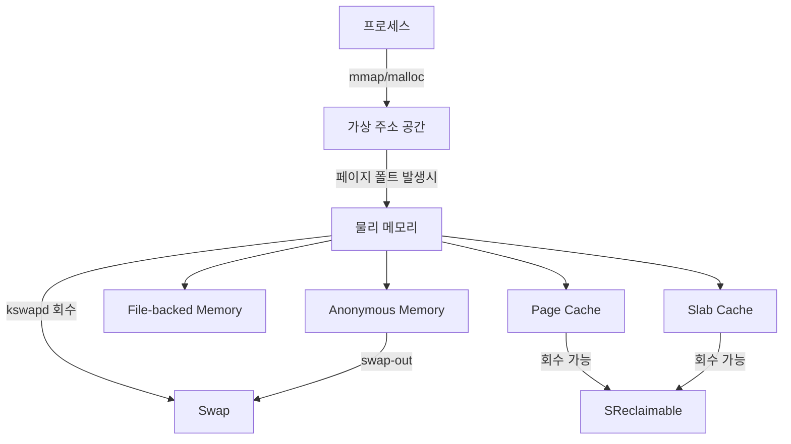
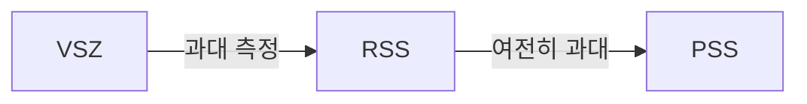
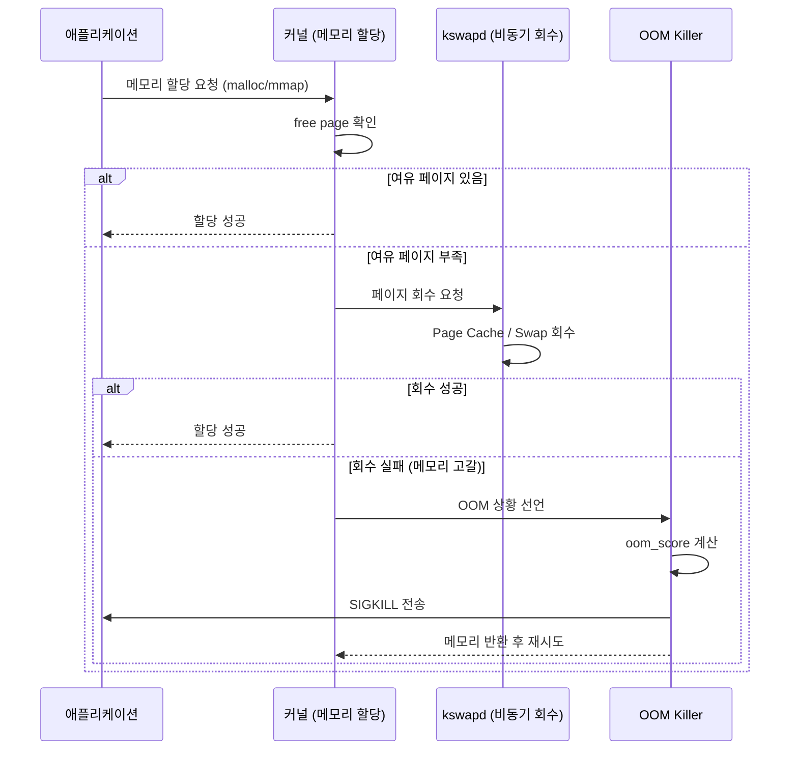
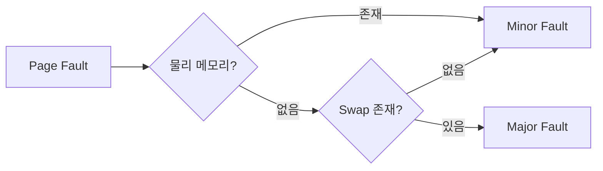
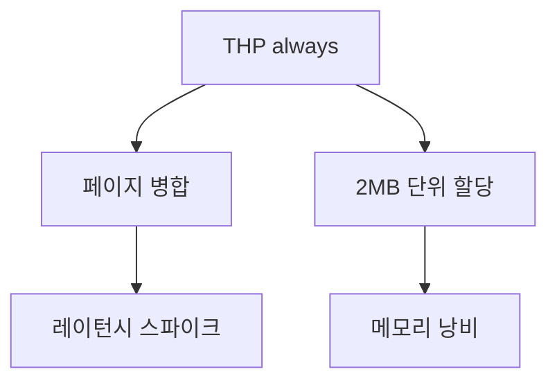
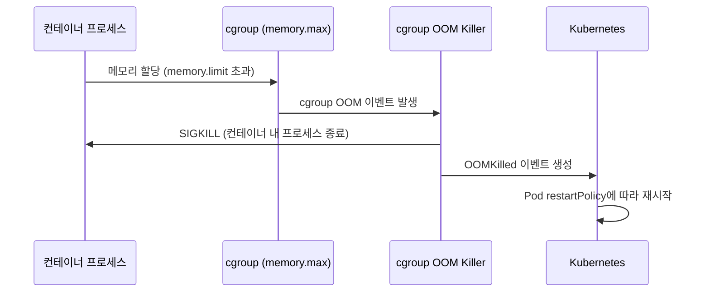
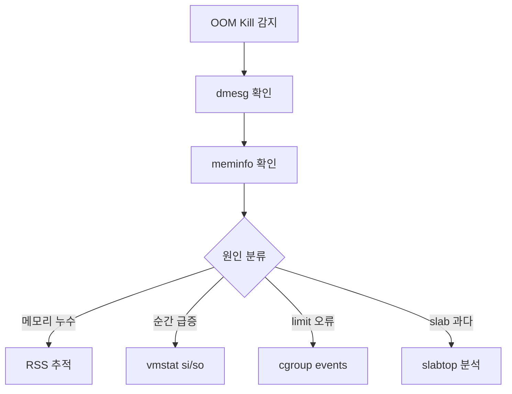

# 메모리 관리와 OOM 완전 가이드 (free, vmstat, slabtop)

Linux 메모리 관리는 단순한 "얼마나 쓰냐"가 아니다.
커널은 물리 메모리를 여러 계층으로 분류해 관리하며,
언제 어떤 프로세스를 종료할지 OOM Killer가 판단한다.
이 가이드는 free/vmstat/slabtop부터 OOM 분석,
Huge Pages, 컨테이너 환경까지 시니어 SRE 수준으로 다룬다.

---

## Linux 메모리 아키텍처



### 메모리 영역별 특성

| 영역 | 설명 | 회수 가능 | swap 대상 |
|------|------|:---:|:---:|
| Anonymous Memory | heap, stack, mmap(MAP_ANON) | 아니오 | 예 |
| File-backed Memory | 파일 mmap, 실행 텍스트 | 예 (파일에서 재로드) | 아니오 |
| Page Cache | 블록 I/O 캐시 | 예 | 아니오 |
| Slab (SReclaimable) | inode·dentry 캐시 등 | 예 | 아니오 |
| Slab (SUnreclaim) | kmalloc 등 회수 불가 | 아니오 | 아니오 |
| HugeTLB | 명시적 대형 페이지 | 아니오 | 설정에 따라 |

---

## 메모리 분석 도구

### free -h

```bash
$ free -h
               total        used        free      shared  buff/cache   available
Mem:            62Gi        18Gi       3.3Gi       1.2Gi        41Gi        43Gi
Swap:          8.0Gi       512Mi       7.5Gi
```

| 컬럼 | 의미 | 주의 |
|------|------|------|
| `total` | 물리 RAM 전체 | OS 예약 영역 제외 |
| `used` | total - free - buff/cache | 순수 애플리케이션 사용 |
| `free` | 커널이 아직 손대지 않은 영역 | 이 값이 작아도 정상 |
| `shared` | tmpfs, shmem | 중복 계산됨 |
| `buff/cache` | 버퍼 + Page Cache + Reclaimable Slab | 필요 시 즉시 반환 |
| `available` | **실제 할당 가능 추정치** | free + 회수 가능 메모리 |

> `available`이 핵심 지표다. `free`가 0에 가깝더라도
> `available`이 충분하면 메모리 부족이 아니다.
> Linux 커널 3.14+ 부터 `/proc/meminfo`의
> `MemAvailable`을 기반으로 계산한다.

```bash
# 1초 간격 모니터링
watch -n1 'free -h'

# 바이트 단위 raw 출력 (스크립트용)
free -b
```

---

### vmstat 1

```bash
$ vmstat 1 5
procs -----------memory---------- ---swap-- -----io---- -system-- ------cpu-----
 r  b   swpd   free   buff  cache   si   so    bi    bo   in   cs us sy id wa st
 2  0 524288 345600 122880 42000128    0    0     8    24  800 1200  5  2 92  1  0
```

#### memory 컬럼 해설

| 컬럼 | 단위 | 의미 |
|------|------|------|
| `swpd` | KB | 사용 중인 swap |
| `free` | KB | 미사용 RAM |
| `buff` | KB | 버퍼(블록 디바이스 메타데이터) |
| `cache` | KB | Page Cache |
| `si` | KB/s | swap-in (디스크→RAM) |
| `so` | KB/s | swap-out (RAM→디스크) |

> `si`/`so`가 지속적으로 0보다 크면 메모리 부족 신호다.
> 특히 `so > 0`이 반복되면 즉각 조치 필요.

---

### smem: PSS로 정확한 메모리 측정

```bash
# 프로세스별 PSS 내림차순 정렬
smem -s pss -r -k

# 사용자별 합계
smem -u -k

# 특정 프로세스 상세
smem -P nginx -k
```

#### VSZ / RSS / PSS 비교



| 지표 | 공유 라이브러리 처리 | 신뢰도 |
|------|------|------|
| VSZ | 전부 포함 | 매우 낮음 |
| RSS | 전부 포함 (중복) | 낮음 |
| PSS | 프로세스 수로 나눔 | 높음 |
| USS | 완전 독점 메모리만 | 가장 정확 (누수 진단용) |

---

### slabtop: 커널 Slab 캐시 분석

```bash
# 실시간 top 스타일 (1초 갱신)
slabtop

# 스냅샷 출력
slabtop --once --sort=c   # 캐시 크기 기준 정렬
```

```
 Active / Total Objects (% used)    : 12345678 / 13000000 (95.0%)
 Active / Total Slabs (% used)      : 450000 / 460000 (97.8%)
 Active / Total Caches (% used)     : 180 / 200 (90.0%)
 Active / Total Size (% used)       : 3800.00K / 4000.00K (95.0%)

  OBJS ACTIVE  USE OBJ SIZE  SLABS OBJ/SLAB CACHE SIZE NAME
1234567 1200000  97%  0.19K  65000       19   520000K dentry
 890000  880000  98%  0.62K  89000       10   712000K inode_cache
```

| 컬럼 | 의미 |
|------|------|
| `OBJS` | 총 객체 수 |
| `ACTIVE` | 사용 중 객체 수 |
| `OBJ SIZE` | 객체 하나의 크기 |
| `CACHE SIZE` | 전체 캐시 크기 |
| `NAME` | 캐시 이름 (`dentry`, `inode_cache` 등) |

> `dentry`/`inode_cache`가 GB 단위로 증가하면
> 파일 시스템 순회 작업(find, backup, 컴파일)이 많다는 신호다.
> `echo 2 > /proc/sys/vm/drop_caches` 로 임시 해제 가능.

---

### /proc/meminfo 항목 해설

```bash
cat /proc/meminfo
```

```
MemTotal:       65536000 kB   ← 사용 가능 총 RAM
MemFree:          358400 kB   ← 완전 미사용
MemAvailable:   44040192 kB   ← 실제 할당 가능 추정치
Buffers:          126976 kB   ← 블록 디바이스 버퍼
Cached:         40960000 kB   ← Page Cache (tmpfs 포함)
SwapCached:        10240 kB   ← swap→RAM 복귀 후 캐시 유지
Active:         20971520 kB   ← 최근 사용 (회수 어려움)
Inactive:       18874368 kB   ← 오래된 페이지 (회수 대상)
Active(anon):    4194304 kB   ← 최근 사용 anonymous
Inactive(anon):  1048576 kB   ← 오래된 anonymous
Active(file):   16777216 kB   ← 최근 사용 file-backed
Inactive(file): 17825792 kB   ← 오래된 file-backed
SwapTotal:       8388608 kB   ← swap 총 용량
SwapFree:        7864320 kB   ← swap 여유
Dirty:             40960 kB   ← 디스크에 기록 대기 중
Writeback:             0 kB   ← 현재 기록 중
AnonPages:       5242880 kB   ← 물리 매핑된 anonymous
Mapped:          2097152 kB   ← mmap된 파일
Shmem:           1310720 kB   ← 공유 메모리 (tmpfs 포함)
KReclaimable:    2621440 kB   ← 회수 가능 커널 메모리
Slab:            3145728 kB   ← 전체 slab
SReclaimable:    2621440 kB   ← 회수 가능 slab (inode, dentry)
SUnreclaim:       524288 kB   ← 회수 불가 slab
VmallocTotal:  34359738367 kB ← vmalloc 총 범위
VmallocUsed:      131072 kB   ← 실제 vmalloc 사용
HugePages_Total:      0       ← 명시적 Huge Page 총 수
HugePages_Free:       0       ← 여유 Huge Page
Committed_AS:   12582912 kB   ← 전체 커밋된 가상 메모리
CommitLimit:    41943040 kB   ← 커밋 한도
```

#### 핵심 지표 계산

```bash
# 실제 메모리 압박 지수 (낮을수록 안전)
# MemAvailable / MemTotal → 0.1 이하면 위험
awk '/MemAvailable/{a=$2} /MemTotal/{t=$2} END{printf "%.1f%%\n", (1-a/t)*100}' \
    /proc/meminfo

# Committed_AS > CommitLimit 이면 overcommit 한계 초과
awk '/CommitLimit/{l=$2} /Committed_AS/{c=$2} END{
    if(c>l) print "OVERCOMMIT 초과! " c " > " l
    else print "정상: " c " / " l
}' /proc/meminfo
```

---

## OOM Killer

### OOM 발생 메커니즘



---

### oom_score와 oom_score_adj

```bash
# 프로세스의 OOM 점수 확인 (0~1000, 높을수록 먼저 kill)
cat /proc/<PID>/oom_score

# OOM 점수 조정값 확인/설정 (-1000~1000)
cat /proc/<PID>/oom_score_adj
echo -300 > /proc/<PID>/oom_score_adj
```

| `oom_score_adj` 값 | 효과 |
|---------------------|------|
| `-1000` | OOM Kill 완전 면제 (OOM Killer가 절대 선택 안 함) |
| `-500` ~ `-100` | 보호 강화 (systemd 중요 서비스 기본값) |
| `0` | 기본값 (oom_score만 따름) |
| `100` ~ `500` | 더 먼저 kill |
| `1000` | 가장 먼저 kill |

```bash
# systemd 서비스에 OOM 보호 설정
# /etc/systemd/system/myapp.service
[Service]
OOMScoreAdjust=-300

# 또는 런타임 변경
systemctl set-property myapp.service OOMScoreAdjust=-300
```

> **주의**: `-1000`(OOM 완전 면제)은 극도로 신중하게 사용.
> 해당 프로세스가 메모리를 독점해도 kill되지 않아
> 시스템 전체가 멈출 수 있다.

---

### dmesg OOM 로그 해석

```bash
# OOM 로그 필터링
dmesg -T | grep -E "oom|killed process|out of memory"
journalctl -k --since "1 hour ago" | grep -i oom
```

```
[Thu Apr 17 14:23:11 2026] Out of memory: Kill process 12345 (java)
    score 873 or sacrifice child
[Thu Apr 17 14:23:11 2026] Killed process 12345 (java) total-vm:4194304kB,
    anon-rss:3670016kB, file-rss:102400kB, shmem-rss:0kB,
    UID:1000 pgtables:8192kB oom_score_adj:0
[Thu Apr 17 14:23:11 2026] oom_reaper: reaped process 12345 (java),
    now anon-rss:0kB, file-rss:0kB, shmem-rss:0kB
```

| 로그 항목 | 의미 |
|-----------|------|
| `score 873` | OOM 점수 (1000에 가까울수록 먼저 선택) |
| `total-vm` | 가상 메모리 전체 |
| `anon-rss` | anonymous RSS (heap, stack) |
| `file-rss` | file-backed RSS (실행 파일, mmap) |
| `oom_reaper` | oom_reaper 스레드가 메모리 회수 완료 |

---

### OOM 방지: overcommit 설정

```bash
# 현재 설정 확인
sysctl vm.overcommit_memory
sysctl vm.overcommit_ratio
```

| `vm.overcommit_memory` | 의미 | 적합한 환경 |
|------------------------|------|------------|
| `0` (기본) | 휴리스틱 오버커밋 허용 | 범용 |
| `1` | 항상 허용 (malloc 실패 없음) | Redis, ML 훈련 |
| `2` | `CommitLimit` 초과 불허 | 금융, DB 서버 |

```bash
# overcommit 엄격화 (특정 워크로드 한정, 전체 적용 주의)
sysctl -w vm.overcommit_memory=2
sysctl -w vm.overcommit_ratio=80   # RAM의 80% + swap까지만 커밋 허용

# 영구 적용
cat >> /etc/sysctl.d/90-memory.conf << 'EOF'
vm.overcommit_memory = 2
vm.overcommit_ratio = 80
EOF
sysctl --system
```

> **⚠ `vm.overcommit_memory=2` 적용 전 반드시 검증**:
> - **Redis**: `fork()` 기반 RDB 스냅샷이 실패할 수 있다.
>   `maybe_allow_vmoverflow` 경고 로그 발생 → 공식 문서는
>   overcommit을 허용하라고 안내한다(`vm.overcommit_memory=1`).
> - **JVM**: 초기 힙보다 큰 `-Xmx` 지정 시 `mmap` 실패
>   (`Committed_AS` 초과)로 프로세스 시작 불가.
> - **PostgreSQL/Python/Ruby**: `fork()` 사용하는 프로세스가
>   부모 크기만큼 커밋 필요 → 큰 부모 프로세스에서 fork 실패.
>
> 금융·DB 전용 노드처럼 메모리 경계가 명확하고 OOM을 절대
> 용납할 수 없는 환경에만 제한적으로 적용한다. 범용 쿠버
> 네티스 노드에서는 기본값(`0`) 또는 Redis·ML 노드에서
> `1`을 쓰는 편이 안전하다.

---

## 메모리 누수 진단

### /proc/\<pid\>/smaps 분석

```bash
# 특정 프로세스의 메모리 매핑 상세
cat /proc/$(pgrep myapp)/smaps | grep -A 20 "heap"

# 총 Private 메모리 (독점 사용량, 누수 진단에 유용)
awk '/Private_Clean|Private_Dirty/{sum+=$2} END{print sum/1024 "MB"}' \
    /proc/$(pgrep myapp)/smaps
```

```
7f8a00000000-7f8b00000000 rw-p 00000000 00:00 0        [heap]
Size:            1048576 kB   ← 가상 크기
KernelPageSize:       4 kB
MMUPageSize:          4 kB
Rss:              819200 kB   ← 물리 메모리 점유
Pss:              819200 kB   ← PSS (공유 없으면 RSS와 같음)
Shared_Clean:          0 kB
Shared_Dirty:          0 kB
Private_Clean:         0 kB
Private_Dirty:    819200 kB   ← 수정된 독점 페이지 (가장 중요)
Referenced:       819200 kB
Anonymous:        819200 kB
```

---

### pmap으로 주소 공간 분석

```bash
# 확장 정보 출력
pmap -x $(pgrep myapp) | sort -k3 -rn | head -20

# 요약만 보기
pmap -d $(pgrep myapp) | tail -1
```

```
Address           Kbytes     RSS   Dirty Mode  Mapping
00007f8a00000000 1048576  819200  819200 rw---   [ anon ]  ← heap
00007f8b00000000  262144  256000       0 r-x--   libjvm.so
```

---

### 시간에 따른 RSS 증가 추적

```bash
#!/bin/bash
# memory_track.sh — 1분 간격 RSS 추적
PID=$(pgrep -n myapp)
LOG="/var/log/mem_track_${PID}.csv"
echo "timestamp,rss_kb,vsz_kb" > "$LOG"

while true; do
    RSS=$(awk '/VmRSS/{print $2}' /proc/${PID}/status 2>/dev/null)
    VSZ=$(awk '/VmSize/{print $2}' /proc/${PID}/status 2>/dev/null)
    echo "$(date +%s),${RSS},${VSZ}" >> "$LOG"
    sleep 60
done
```

```bash
# 실행 중인 프로세스의 메모리 추이 빠른 확인
while true; do
    ps -o pid,rss,vsz,comm -p $(pgrep myapp)
    sleep 5
done
```

---

### valgrind (개발 환경)

```bash
# 메모리 누수 검사
valgrind --leak-check=full \
         --show-leak-kinds=all \
         --track-origins=yes \
         --verbose \
         --log-file=valgrind.log \
         ./myapp

# 주요 결과 해석
grep "definitely lost\|indirectly lost" valgrind.log
```

> valgrind는 프로덕션 사용 금지.
> 실행 속도가 10~50배 느려지므로 개발/테스트 환경에서만 사용.

---

## Page Fault와 Swap

### Minor vs Major Page Fault



| Fault 유형 | 원인 | 소요 시간 |
|-----------|------|----------|
| Minor Fault | 물리 페이지는 있으나 Page Table 미매핑 | 수십 ns |
| Major Fault | 디스크 swap에서 복구 필요 | 수 ms ~ 수십 ms |

```bash
# 프로세스별 page fault 통계
ps -o pid,comm,minflt,majflt -p $(pgrep myapp)

# 시스템 전체 page fault (/proc/vmstat 기준)
awk '/^pgfault|^pgmajfault/ {print $1, $2}' /proc/vmstat
# vmstat 컬럼에 minflt/majflt 없음 — pidstat 또는 /proc/vmstat 사용
```

---

### swappiness 튜닝

```bash
# 현재 설정 확인 (기본값: 60)
sysctl vm.swappiness

# 권장값별 적용 시나리오
# 서버/데이터베이스: 10~20
sysctl -w vm.swappiness=10

# Kubernetes 노드: swap 모드에 따라 권장값이 다름
# K8s 1.22 alpha → 1.28 beta → 1.34 GA (2025)
# - NoSwap 모드 (기본): 워크로드 swap 금지 → vm.swappiness=0 무방
# - LimitedSwap 모드: Burstable Pod만 swap 사용 가능 →
#   워크로드 특성에 따라 10~60 범위에서 조정 검토
sysctl -w vm.swappiness=0

# 영구 적용
echo "vm.swappiness = 10" >> /etc/sysctl.d/90-memory.conf
sysctl --system
```

| swappiness 값 | 커널 동작 | 적합한 환경 |
|:---:|------|------|
| `0` | swap 최소화 (완전 금지 아님) | K8s NoSwap 모드, 레이턴시 민감 서비스 |
| `10` ~ `20` | Page Cache 선호, swap 후순위 | 데이터베이스, 운영 서버 |
| `60` | 기본값 | 범용 워크스테이션, K8s LimitedSwap 기본 |
| `100` | anonymous와 Page Cache 동등 취급 | 비용 없는 메모리 |

> **K8s 1.34 swap 모드 요약 (2025 GA)**:
> - **NoSwap** (기본): 워크로드가 swap을 쓰지 못함. 시스템
>   데몬만 swap 사용 가능. 기존 동작과 호환.
> - **LimitedSwap**: Burstable QoS Pod 한해 자동 할당량만큼
>   swap 사용. 메모리 요청 비율에 따라 커널이 자동 결정.
> - `failSwapOn: false` + `memorySwap.swapBehavior: LimitedSwap`
>   를 kubelet에 설정해야 활성화된다.

---

### zswap vs zram 비교

| 항목 | zswap | zram |
|------|-------|------|
| 역할 | swap 디바이스 앞의 압축 캐시 | 압축된 RAM 디스크를 swap으로 사용 |
| 저장 위치 | RAM (압축) + 실제 swap 폴백 | RAM (압축) |
| 디스크 swap 필요 | 예 (폴백용) | 아니오 |
| 압축 알고리즘 | lz4, zstd (권장) | lz4, zstd, lzo |
| 커널 지원 | 3.11+ | 3.14+ (stable) |
| 기본 활성화 | Ubuntu 22.04+ 기본 활성 | 많은 배포판 기본 비활성 |
| 적합한 환경 | SSD/NVMe 있는 서버 | 메모리 제한 환경 (임베디드, 컨테이너) |

```bash
# zswap 설정 확인 및 활성화
cat /sys/module/zswap/parameters/enabled
echo 1 > /sys/module/zswap/parameters/enabled

# zswap 압축기 변경 (zstd 권장)
echo zstd > /sys/module/zswap/parameters/compressor

# zram 설정 (ubuntu 기준)
modprobe zram
echo lz4 > /sys/block/zram0/comp_algorithm
echo 4G > /sys/block/zram0/disksize
mkswap /dev/zram0
swapon -p 100 /dev/zram0   # 우선순위 100 (높을수록 먼저 사용)
```

---

## Huge Pages

### THP (Transparent Huge Pages)

커널이 자동으로 4KB 페이지를 2MB 페이지로 병합한다.
TLB miss 감소로 성능 향상이 기대되지만,
실제 환경에서는 부작용이 더 크다.

```bash
# THP 현재 설정 확인
cat /sys/kernel/mm/transparent_hugepage/enabled
# [always] madvise never

# 상태: always | madvise | never
```

| 설정 | 동작 |
|------|------|
| `always` | 모든 메모리에 자동 적용 |
| `madvise` | `MADV_HUGEPAGE` 힌트가 있는 영역만 적용 |
| `never` | THP 비활성화 |

#### 데이터베이스에서 THP를 비활성화해야 하는 이유



- **MongoDB**, **Redis**, **PostgreSQL**, **Cassandra** 공식 문서:
  THP 비활성화 권장
- **Oracle DB**: THP를 `never`로 설정 요구
- **MySQL/InnoDB**: `madvise` 모드 권장 (5.7.38+/8.0.27+)

```bash
# THP 비활성화 (즉시 적용)
echo never > /sys/kernel/mm/transparent_hugepage/enabled
echo never > /sys/kernel/mm/transparent_hugepage/defrag

# 영구 적용 (GRUB 커널 파라미터)
# /etc/default/grub 에 transparent_hugepage=never 추가
GRUB_CMDLINE_LINUX="... transparent_hugepage=never"
grub2-mkconfig -o /boot/grub2/grub.cfg
```

---

### Explicit Huge Pages (HugeTLB)

```bash
# 2MB Huge Page 512개 할당 (1GB)
sysctl -w vm.nr_hugepages=512

# 1GB Huge Page 사용 (NUMA 노드별 설정 가능)
echo 4 > /sys/devices/system/node/node0/hugepages/hugepages-1048576kB/nr_hugepages

# 현재 상태 확인
grep -i hugepages /proc/meminfo
```

```
HugePages_Total:     512
HugePages_Free:      512
HugePages_Rsvd:        0
HugePages_Surp:        0
Hugepagesize:       2048 kB
Hugetlb:         1048576 kB   ← 총 HugeTLB 사용량
```

---

### /proc/vmstat THP 통계

```bash
grep -i thp /proc/vmstat
```

```
thp_fault_alloc 12345        ← THP fault 시 성공 할당
thp_fault_fallback 678       ← THP 실패 → 4KB fallback (높으면 단편화)
thp_collapse_alloc 9012      ← khugepaged 병합 성공
thp_collapse_alloc_failed 34 ← khugepaged 병합 실패
thp_split_page 56            ← THP → 4KB 분리 횟수
thp_zero_page_alloc 78       ← zero THP 할당
```

> `thp_fault_fallback`이 `thp_fault_alloc`에 비해
> 높은 비율로 증가하면 메모리 단편화가 심각하다는 신호다.

---

## 컨테이너 / Kubernetes 환경

### cgroup memory limit과 OOM



```bash
# 컨테이너 OOM 이벤트 확인 (cgroup v2)
CGROUP_PATH=$(cat /proc/$(pgrep -n myapp)/cgroup | grep memory | cut -d: -f3)
cat /sys/fs/cgroup${CGROUP_PATH}/memory.events
# oom 3
# oom_kill 1
```

---

### cgroup v2 메모리 제어 인터페이스

cgroup v2는 `memory.max` 하나만이 아니라 **단계별 압박 제어**
인터페이스를 제공한다. hard limit 도달 전에 부드럽게 회수·
경고를 유도할 수 있다.

| 파일 | 의미 | 동작 |
|------|------|------|
| `memory.min` | 회수 불가 하한 | 이 값까지는 전역 OOM 상황에도 절대 회수되지 않음 |
| `memory.low` | 회수 후순위 경계 | 메모리 여유 있는 한 회수 대상에서 제외 |
| `memory.high` | 소프트 상한 | 초과 시 allocator throttle + 적극 회수 (OOM 없이) |
| `memory.max` | 하드 상한 | 초과 시 OOM Kill |

```bash
# 예시: 보장 256MB, 목표 512MB, 상한 1GB
echo "256M"  > /sys/fs/cgroup/myapp/memory.min
echo "512M"  > /sys/fs/cgroup/myapp/memory.high
echo "1G"    > /sys/fs/cgroup/myapp/memory.max
```

> **K8s 연동**: kubelet의 `memoryQoS` 기능(1.22 alpha →
> 1.34 시점 여전히 alpha)을 활성화하면 Pod `requests.memory`
> → `memory.min`, `limits.memory` → `memory.max` 매핑에
> 더해 `memory.high`가 자동 설정되어 throttle 기반 회수가
> 가능해진다.

---

### container_memory_working_set_bytes vs RSS

Kubernetes가 메모리 사용량 판단에 사용하는 지표다.

| 지표 | 내용 | OOM 기준 |
|------|------|:---:|
| `container_memory_rss` | anonymous RSS | 아니오 |
| `container_memory_cache` | Page Cache | 아니오 |
| `container_memory_working_set_bytes` | RSS + cache - inactive_file | **예** |
| `container_memory_usage_bytes` | working_set + swap | 아니오 |

```
working_set_bytes = memory.usage_in_bytes
                  - total_inactive_file
```

> Kubernetes의 OOM 및 eviction 판단 기준은
> `working_set_bytes`다. `kubectl top pod`에서 보이는
> 값도 이 지표다.

---

### K8s OOM Kill 이벤트 확인

```bash
# Pod의 OOMKilled 상태 확인
kubectl describe pod <pod-name> | grep -A 5 "OOMKilled\|Last State"

# 출력 예시
# Last State: Terminated
#   Reason:   OOMKilled
#   Exit Code: 137
#   Started:   Thu, 17 Apr 2026 14:23:00 +0900
#   Finished:  Thu, 17 Apr 2026 14:23:11 +0900

# 전체 네임스페이스 OOMKilled 스캔
kubectl get pods -A -o json | jq -r '
  .items[] |
  select(.status.containerStatuses != null) |
  .status.containerStatuses[] |
  select(.lastState.terminated.reason == "OOMKilled") |
  "\(.name) OOMKilled at \(.lastState.terminated.finishedAt)"
'

# 이벤트에서 OOM 확인
kubectl get events -A --field-selector reason=OOMKilling
```

---

### Memory Requests/Limits 설정 가이드

```yaml
# Pod spec 예시
resources:
  requests:
    memory: "256Mi"   # 스케줄링 기준 (노드 선택)
  limits:
    memory: "512Mi"   # cgroup memory.max (초과 시 OOMKilled)
```

| QoS 클래스 | 조건 | OOM 우선순위 |
|-----------|------|:---:|
| `Guaranteed` | requests == limits (모든 컨테이너) | 가장 낮음 (마지막에 kill) |
| `Burstable` | requests < limits | 중간 |
| `BestEffort` | requests/limits 미설정 | 가장 높음 (먼저 kill) |

```bash
# Pod QoS 클래스 확인
kubectl get pod <pod-name> -o jsonpath='{.status.qosClass}'

# 네임스페이스 기본 LimitRange 설정 (BestEffort 방지)
kubectl apply -f - <<EOF
apiVersion: v1
kind: LimitRange
metadata:
  name: default-mem-limit
  namespace: production
spec:
  limits:
  - default:
      memory: 512Mi
    defaultRequest:
      memory: 128Mi
    type: Container
EOF
```

---

## 실무 트러블슈팅

### OOM Kill 직후 진단 절차



| 원인 | 확인 방법 | 조치 |
|------|---------|------|
| 메모리 누수 | `smaps` / `pmap` 분석, RSS 증가 추적 | valgrind (개발 환경) |
| 순간 급증 | `vmstat si/so` 확인 | 메모리 limit 상향 또는 JVM Heap 조정 |
| limit 설정 오류 | `cgroup memory.events` 확인 | K8s limits 조정, QoS 클래스 변경 |
| slab 과다 | `slabtop` 분석 | `echo 2 > drop_caches` (임시 완화) |

```bash
# OOM Kill 직후 신속 진단 스크립트
#!/bin/bash
echo "=== OOM 진단 $(date) ==="
echo "--- 최근 OOM 로그 ---"
dmesg -T | grep -E "oom|killed process" | tail -20

echo "--- 현재 메모리 상태 ---"
free -h
cat /proc/meminfo | grep -E "MemAvailable|Committed|Slab"

echo "--- 메모리 상위 10개 프로세스 ---"
ps aux --sort=-%mem | head -11

echo "--- Swap 사용량 상위 ---"
for pid in $(ls /proc | grep '^[0-9]'); do
    swap=$(awk '/^VmSwap/{print $2}' /proc/$pid/status 2>/dev/null)
    if [ "${swap:-0}" -gt 0 ] 2>/dev/null; then
        comm=$(cat /proc/$pid/comm 2>/dev/null)
        echo "$swap $pid $comm"
    fi
done | sort -rn | head -10 | awk '{printf "%d MB\t%s\t%s\n", $1/1024, $2, $3}'
```

---

### PSI (Pressure Stall Information)로 사전 감지

PSI는 커널 4.20+에서 도입된 메모리 압박 조기 경보 시스템이다.
0이 아닌 `full` 값은 시스템 전체가 메모리를 기다린다는 신호다.

```bash
# 시스템 메모리 압박 확인
cat /proc/pressure/memory
# some avg10=0.50 avg60=0.12 avg300=0.04 total=123456
# full avg10=0.00 avg60=0.00 avg300=0.00 total=0
```

| 지표 | 의미 | 경보 기준 |
|------|------|-----------|
| `some avg10` | 10초간 일부 태스크 대기 비율 | > 30% |
| `full avg10` | 10초간 전체 태스크 대기 비율 | > 5% (즉시 조치) |
| `some avg60` | 60초 이동 평균 | > 10% |

```bash
# Prometheus node_exporter PSI 메트릭 (1.3.0+)
# node_pressure_memory_waiting_seconds_total
# node_pressure_memory_stalled_seconds_total

# Grafana Alert 예시 (PromQL)
# (rate(node_pressure_memory_stalled_seconds_total[5m]) * 100) > 5
# → "메모리 full stall 5% 초과"

# PSI 기반 proactive OOM 방지 (systemd-oomd, PSI 지원 커널 4.20+)
systemctl status systemd-oomd
cat /etc/systemd/oomd.conf
```

```bash
# cgroup v2에서 PSI 기반 자동 메모리 회수 트리거 설정
# (특정 임계값 초과 시 fd로 이벤트 수신)
cat > /tmp/psi_trigger.sh << 'EOF'
#!/bin/bash
# memory full stall이 500ms/5s 초과 시 이벤트
exec 9>/sys/fs/cgroup/myapp.service/memory.pressure
echo "full 500000 5000000" >&9
# inotify 또는 epoll로 fd 9 감시
EOF
```

---

## 빠른 참조 치트시트

```bash
# 메모리 현황 한눈에 보기
free -h && echo "---" && \
    grep -E "MemAvailable|Committed_AS|CommitLimit|Slab:|SReclaimable" \
    /proc/meminfo

# OOM 위험 프로세스 상위 5개
ps -eo pid,comm,oom_score,rss --sort=-oom_score | head -6

# 특정 프로세스 메모리 상세
PID=$(pgrep -n myapp)
awk '/^Vm/{print}' /proc/$PID/status

# Swap 사용 즉시 해제 (swap 여유 충분 시)
swapoff -a && swapon -a

# slab 캐시 비워서 메모리 확보 (운영 중 사용 주의)
# 1: PageCache만, 2: dentries+inodes, 3: 전체
echo 1 > /proc/sys/vm/drop_caches  # 가장 안전
```

---

## 참고 자료

- [Linux Kernel Documentation: Memory Management](https://docs.kernel.org/mm/index.html)
  — 확인: 2026-04-17
- [Kernel mm/oom_kill.c - OOM Score 계산 로직](https://github.com/torvalds/linux/blob/master/mm/oom_kill.c)
  — 확인: 2026-04-17
- [/proc/meminfo Fields - kernel.org](https://www.kernel.org/doc/Documentation/filesystems/proc.txt)
  — 확인: 2026-04-17
- [PSI - Pressure Stall Information](https://docs.kernel.org/accounting/psi.html)
  — 확인: 2026-04-17
- [Transparent Hugepage Support](https://docs.kernel.org/admin-guide/mm/transhuge.html)
  — 확인: 2026-04-17
- [Kubernetes: Memory Resources](https://kubernetes.io/docs/concepts/configuration/manage-resources-containers/)
  — 확인: 2026-04-17
- [Kubernetes: Node Pressure Eviction](https://kubernetes.io/docs/concepts/scheduling-eviction/node-pressure-eviction/)
  — 확인: 2026-04-17
- [Facebook: PSI — Pressure Stall Information](https://engineering.fb.com/2018/12/19/production-engineering/pressure-stall-information/)
  — 확인: 2026-04-17
- [Brendan Gregg: Linux Performance](https://www.brendangregg.com/linuxperf.html)
  — 확인: 2026-04-17
- [Cloudflare Blog: Why does one nginx worker take all the load?](https://blog.cloudflare.com/the-sad-state-of-linux-socket-balancing/)
  — 확인: 2026-04-17
- [Red Hat: Huge Pages and Transparent Huge Pages](https://access.redhat.com/documentation/en-us/red_hat_enterprise_linux/9/html/monitoring_and_managing_system_status_and_performance/configuring-huge-pages_monitoring-and-managing-system-status-and-performance)
  — 확인: 2026-04-17
