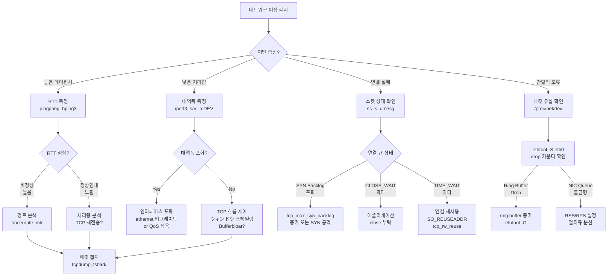
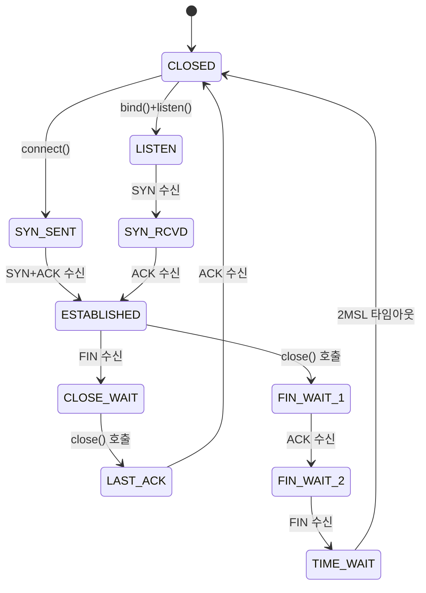
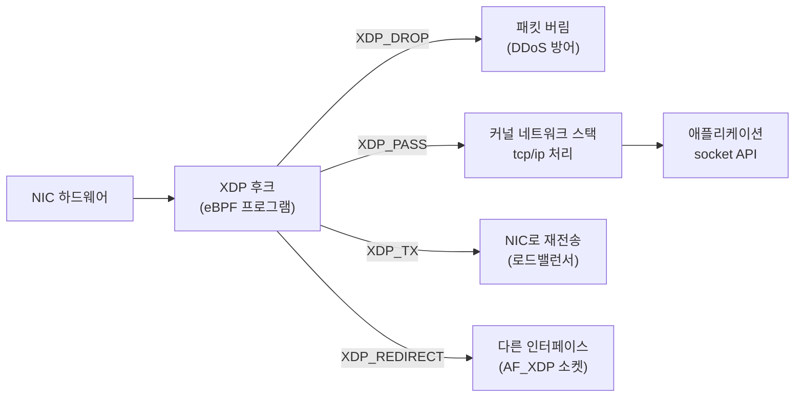
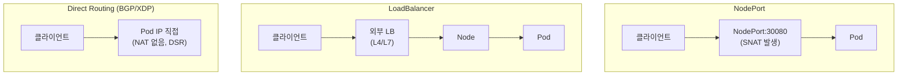
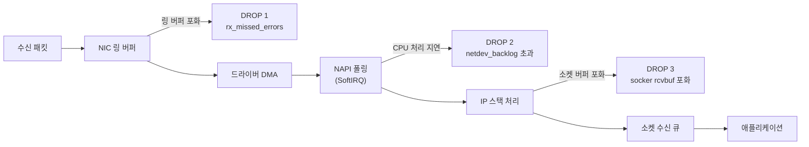

# 네트워크 성능 분석 완전 가이드 (ss, iftop, nethogs, sar)

> "네트워크가 느리다"는 말 뒤에는 원인이 열 가지 이상 숨어
> 있다. 대역폭이 포화된 건지, TCP 재전송이 폭증한 건지,
> 연결 큐가 넘치는 건지, 커널 버퍼가 부족한 건지.
> 추측하지 말고 계층별로 측정한다.

이 글은 Google·Netflix·Cloudflare 수준의 SRE가 실제 장애에서
사용하는 네트워크 성능 분석 방법론과 도구를 다룬다.
단순 명령어 모음이 아니라 **병목 원인을 계층적으로 좁히는**
**사고 방식**을 목표로 한다.

---

## 1. 네트워크 성능 분석 방법론

### USE 방법론 적용

Brendan Gregg의 USE 방법론을 네트워크 리소스에 적용한다.

| 항목 | 네트워크 관점 | 확인 지표 |
|------|-------------|---------|
| **U**tilization | 인터페이스 대역폭 사용률 | `sar -n DEV`, `iftop` |
| **S**aturation | 전송 큐 포화, 연결 큐 대기 | `ss -s` backlog, `txqueuelen` |
| **E**rrors | 패킷 유실, CRC 오류, 재전송 | `/proc/net/dev`, `ethtool -S` |

### 레이어별 분석 흐름



### 분석 우선순위 원칙

```
Application Layer  ← 재전송, RTT 스파이크 → 소켓 레이어 확인
Socket Layer       ← 연결 상태, 큐 포화   → TCP 파라미터 확인
Network Layer      ← 패킷 유실, 경로 문제 → NIC/드라이버 확인
Hardware Layer     ← 링 버퍼, NIC 에러   → ethtool 확인
```

---

## 2. 소켓과 연결 상태 분석

`ss`(socket statistics)는 `netstat`의 현대적 대체도구다.
직접 커널 netlink를 사용하여 빠르고 상세한 정보를 제공한다.

### 기본 사용법

```bash
# 수신 대기 중인 TCP/UDP 소켓 + 프로세스 정보
ss -tulpn

# 전체 소켓 통계 요약
ss -s

# TCP 연결 상태별 집계
ss -tan | awk 'NR>1 {print $1}' | sort | uniq -c | sort -rn
```

```
# ss -s 출력 예시
Total: 1842
TCP:   834 (estab 612, closed 89, orphaned 3, timewait 87)

Transport Total  IP   IPv6
RAW       2      1    1
UDP       18     12   6
TCP       745    520  225
INET      765    533  232
FRAG      0      0    0
```

### TCP 상태 기계와 문제 진단



**문제 상태와 진단:**

| 상태 | 과다 시 원인 | 확인 명령 |
|------|-----------|---------|
| `TIME_WAIT` | 단기 연결 반복 (HTTP/1.1) | `ss -tan \| grep TIME-WAIT \| wc -l` |
| `CLOSE_WAIT` | 애플리케이션 `close()` 미호출 | `ss -tanp \| grep CLOSE-WAIT` |
| `SYN_RCVD` | SYN flood 공격 또는 backlog 포화 | `ss -tan \| grep SYN-RECV` |
| `FIN_WAIT_2` | 원격 측 FIN 미전송, 방화벽 차단 | `ss -tan \| grep FIN-WAIT-2` |

```bash
# CLOSE_WAIT 상태의 프로세스 특정 (앱 버그 의심)
ss -tanp | grep CLOSE-WAIT

# TIME_WAIT 과다 → 연결 재사용 설정 확인
sysctl net.ipv4.tcp_tw_reuse
# 1이면 활성화 (아웃바운드 연결에서 TIME_WAIT 소켓 재사용)

# SYN backlog 확인
ss -lnt | awk 'NR>1 {print $2, $4}'
# Recv-Q: 현재 accept 대기 중인 연결 수
# Send-Q: backlog 최대값 (listen() 인자)
```

### 고급 ss 필터링

```bash
# 80포트 수립된 연결만 (실시간 모니터링)
ss -o state established '( dport = :80 or sport = :80 )'

# 특정 IP와의 연결
ss -tn dst 10.0.0.1

# 큰 수신 버퍼를 가진 연결 (메모리 문제 진단)
ss -tm | awk '$2 > 100000'

# 타이머 정보 포함 (TIME_WAIT 잔여 시간)
ss -o state time-wait

# 재전송 중인 연결 확인 (retrans > 0)
ss -ti | grep -A1 'retrans:[^0]'
```

### /proc 소켓 통계

```bash
# 소켓 전반 요약 (오버플로우 확인)
cat /proc/net/sockstat
```

```
sockets: used 1842
TCP: inuse 745 orphan 3 tw 87 alloc 834 mem 234
UDP: inuse 18 mem 4
UDPLITE: inuse 0
RAW: inuse 2
FRAG: inuse 0 memory 0
```

| 필드 | 의미 | 주의 임계값 |
|------|------|-----------|
| `orphan` | 프로세스 없는 TCP 소켓 | 많으면 앱 크래시 의심 |
| `tw` | TIME_WAIT 소켓 수 | > 수만 개면 포트 고갈 위험 |
| `mem` | 소켓 버퍼 메모리 (pages) | 시스템 메모리 대비 확인 |

```bash
# TCP 상세 통계 (누적 카운터)
cat /proc/net/netstat | grep -E "TcpExt|TCPAbortOn"

# 중요 항목 한눈에 보기
ss -s && cat /proc/net/sockstat
```

---

## 3. 대역폭 모니터링

### iftop - 인터페이스별 실시간 대역폭

```bash
# 설치
sudo apt install iftop    # Debian/Ubuntu
sudo dnf install iftop    # RHEL/Fedora

# eth0 인터페이스 모니터링
sudo iftop -i eth0

# IP 주소 숫자로 표시 (역방향 DNS 지연 방지)
sudo iftop -i eth0 -n

# 포트 번호 표시
sudo iftop -i eth0 -P

# 특정 네트워크만 필터링
sudo iftop -i eth0 -F 10.0.0.0/24
```

**iftop 단축키:**

| 키 | 동작 |
|----|------|
| `s` | 소스 호스트 집계 토글 |
| `d` | 대상 호스트 집계 토글 |
| `p` | 포트 표시 토글 |
| `n` | DNS 역방향 조회 토글 |
| `t` | 전송/수신 방향 보기 전환 |
| `b` | 막대그래프 토글 |
| `s` / `d` | 소스/목적지 기준 정렬 |

### nethogs - 프로세스별 대역폭

단순한 인터페이스 통계가 아닌 **어느 프로세스가 대역폭을
소비하는지** 실시간으로 확인한다.

```bash
# 설치
sudo apt install nethogs

# 전체 인터페이스 모니터링
sudo nethogs

# 특정 인터페이스만
sudo nethogs eth0

# 업데이트 주기 설정 (기본 1초)
sudo nethogs -d 2 eth0

# 트래픽 단위 변경 (b: bytes, k: KB, m: MB)
sudo nethogs -v 3   # MB/s
```

```
NetHogs version 0.8.7

    PID USER     PROGRAM          DEV    SENT      RECEIVED
  14823 root     nginx            eth0   45.234     4.123 KB/sec
   7291 app      python3          eth0   12.891    89.234 KB/sec
      ? root     unknown TCP           0.000     0.000 KB/sec
```

> 컨테이너 환경에서는 `nethogs <veth 인터페이스>`로 특정
> Pod의 veth pair를 직접 지정하면 Pod별 대역폭을 확인할 수
> 있다.

### sar - 시계열 인터페이스 통계

`sysstat` 패키지의 `sar`는 **이력 데이터 분석**에 가장
중요한 도구다. 장애 발생 시점 전후의 네트워크 통계를
소급 조회할 수 있다.

```bash
# 실시간: 1초 간격 인터페이스 통계
sar -n DEV 1 10

# 특정 인터페이스만 필터
sar -n DEV 1 10 | grep eth0

# 패킷 오류/유실 통계
sar -n EDEV 1 10

# TCP 연결 통계
sar -n TCP 1 10

# TCP 오류 통계
sar -n ETCP 1 10

# 오늘 이력 전체 (장애 사후 분석)
sar -n DEV

# 특정 날짜 이력 조회
sar -n DEV -f /var/log/sa/sa17
```

```
# sar -n DEV 출력 예시
14:30:01    IFACE   rxpck/s   txpck/s  rxkB/s  txkB/s  rxcmp/s  txcmp/s  rxmcst/s  %ifutil
14:30:02    eth0    1234.00   987.00   892.34  456.78    0.00     0.00      0.00      8.92
14:30:02    lo       45.00    45.00     3.21    3.21     0.00     0.00      0.00      0.00
```

| 컬럼 | 의미 | 주의 임계값 |
|------|------|-----------|
| `rxpck/s` | 수신 패킷/초 | NIC 성능에 따라 다름 |
| `txpck/s` | 전송 패킷/초 | — |
| `rxkB/s` | 수신 KB/초 | — |
| `%ifutil` | 인터페이스 활용률 | **> 80%** 포화 위험 |

### nload / bmon - 시각적 실시간 모니터링

```bash
# nload: 단순 인터페이스 입출력 그래프
sudo apt install nload
nload eth0

# bmon: 다중 인터페이스 + 상세 통계
sudo apt install bmon
bmon -p eth0
# 단축키: d(상세), r(초기화), q(종료)
```

**도구 비교:**

| 도구 | 특징 | 주 용도 |
|------|------|---------|
| `iftop` | 호스트별 연결 현황 | 어느 IP가 대역폭 소비? |
| `nethogs` | 프로세스별 | 어느 프로세스가 소비? |
| `sar -n DEV` | 이력 저장, 시계열 | 장애 전후 이력 분석 |
| `nload` | 단순 그래프 | 빠른 현황 파악 |
| `bmon` | 다중 인터페이스 | 복수 NIC 운영 환경 |

---

## 4. 패킷 분석

### tcpdump 실무 예시

```bash
# 기본: eth0의 모든 패킷 캡처 (패킷 내용 요약)
sudo tcpdump -i eth0

# 호스트 필터
sudo tcpdump -i eth0 host 10.0.0.1

# 포트 필터 (HTTP 트래픽)
sudo tcpdump -i eth0 port 80 or port 443

# 발신 트래픽만 (SYN 패킷 = 새 연결 시작)
sudo tcpdump -i eth0 'tcp[tcpflags] & tcp-syn != 0'

# 재전송 패킷만 캡처 (RST 또는 재전송 SYN)
sudo tcpdump -i eth0 'tcp[tcpflags] & (tcp-rst) != 0'

# 패킷 크기 포함 출력
sudo tcpdump -i eth0 -v port 443

# 파일로 저장 (Wireshark 분석용)
sudo tcpdump -i eth0 -w /tmp/capture.pcap -C 100 -W 5
# -C 100: 파일당 100MB, -W 5: 최대 5개 순환

# 저장된 파일 읽기
tcpdump -r /tmp/capture.pcap -n port 80

# HTTP 요청 URL 확인
sudo tcpdump -i eth0 -A port 80 | grep "GET\|POST\|Host:"
```

**tcpdump 필터 표현식 모음:**

```bash
# ICMP만 (ping 트래픽)
sudo tcpdump -i eth0 icmp

# 서브넷 전체
sudo tcpdump -i eth0 net 10.0.0.0/24

# 출발지/목적지 구분
sudo tcpdump -i eth0 src 10.0.0.1
sudo tcpdump -i eth0 dst 10.0.0.2

# 복합 조건 (AND/OR/NOT)
sudo tcpdump -i eth0 'src 10.0.0.1 and dst port 443'
sudo tcpdump -i eth0 'not port 22'

# TCP RST 패킷 (연결 강제 종료)
sudo tcpdump -i eth0 'tcp[13] & 4 != 0'

# 특정 크기 이상의 패킷
sudo tcpdump -i eth0 'greater 1400'

# DNS 쿼리
sudo tcpdump -i eth0 port 53
```

### tshark - CLI Wireshark

```bash
# 설치
sudo apt install tshark

# 실시간 캡처 + HTTP 요청 분석
sudo tshark -i eth0 -Y http.request -T fields \
  -e ip.src -e http.request.method -e http.request.uri

# TCP 재전송 패킷만 표시
sudo tshark -i eth0 -Y "tcp.analysis.retransmission"

# DNS 응답 레이턴시 측정
sudo tshark -i eth0 -Y dns -T fields \
  -e dns.qry.name -e dns.time

# pcap 파일 분석 (Wireshark 없이)
tshark -r /tmp/capture.pcap -Y "tcp.analysis.retransmission" \
  -T fields -e ip.src -e ip.dst -e tcp.stream

# 프로토콜별 통계
tshark -r /tmp/capture.pcap -q -z io,phs
```

### 패킷 유실 진단

```bash
# NIC 레벨 드롭 카운터 확인
cat /proc/net/dev
```

```
Inter-|   Receive                                                |  Transmit
 face |bytes    packets errs drop fifo frame compressed multicast|bytes    packets errs drop fifo colls carrier compressed
  eth0: 1234567   12345    0  123    0     0          0         0    9876    9876    0    0    0     0       0          0
```

`drop` 컬럼이 증가하고 있으면 커널 수신 큐에서 버려지는
패킷이 있다는 신호다.

```bash
# NIC 드라이버 레벨 상세 통계
sudo ethtool -S eth0 | grep -E "drop|miss|error|discard"

# 일반적으로 중요한 카운터
sudo ethtool -S eth0 | grep -E \
  "rx_missed|rx_dropped|tx_dropped|rx_fifo_errors"

# 링 버퍼 현황 확인
sudo ethtool -g eth0
```

```
Ring parameters for eth0:
Pre-set maximums:
RX:             4096
TX:             4096
Current hardware settings:
RX:             256   ← 증가 필요 시 ethtool -G eth0 rx 4096
TX:             256
```

```bash
# 링 버퍼 크기 증가 (일시적, 영구 설정은 /etc/ethtool.conf)
sudo ethtool -G eth0 rx 4096 tx 4096
```

### netstat -s 오류 통계

```bash
# TCP 오류 통계 전체
netstat -s -t

# 재전송과 관련된 항목만 필터
netstat -s | grep -iE "retransmit|failed|reset|drop"
```

```
Tcp:
    3842 active connection openings
    1284 passive connection openings
    23 failed connection attempts
    156 connection resets received
    612 connections established
    1234567 segments received
    1234012 segments sent out
    4521 segments retransmitted    ← 높으면 네트워크 품질 문제
    0 bad segments received
    89 resets sent
```

---

## 5. TCP 성능 튜닝

### 소켓 버퍼 크기 설정

TCP 소켓 버퍼는 **처리량과 메모리 사용량의 트레이드오프**다.
고속/고지연 링크(WAN, 10GbE 이상)에서는 기본값이 너무 작다.

```bash
# 현재 설정 확인
sysctl net.core.rmem_max net.core.wmem_max
sysctl net.ipv4.tcp_rmem net.ipv4.tcp_wmem
```

```
net.core.rmem_max = 134217728
net.core.wmem_max = 134217728
net.ipv4.tcp_rmem = 4096  131072  6291456
#                   최솟값  기본값  최댓값
net.ipv4.tcp_wmem = 4096  16384   4194304
```

**10GbE 이상 고성능 네트워크 권장 설정:**

```bash
# /etc/sysctl.d/99-network-tuning.conf
cat << 'EOF' | sudo tee /etc/sysctl.d/99-network-tuning.conf
# 소켓 수신/전송 버퍼 최대값 (256MB)
net.core.rmem_max = 268435456
net.core.wmem_max = 268435456

# TCP 수신/전송 버퍼 (min/default/max)
net.ipv4.tcp_rmem = 4096 1048576 268435456
net.ipv4.tcp_wmem = 4096 1048576 268435456

# 자동 버퍼 튜닝 활성화 (커널이 동적 조정)
net.ipv4.tcp_moderate_rcvbuf = 1

# 소켓 백로그 큐
net.core.somaxconn = 65535
net.core.netdev_max_backlog = 65536

# TIME_WAIT 소켓 재사용 (아웃바운드)
net.ipv4.tcp_tw_reuse = 1
EOF

sudo sysctl -p /etc/sysctl.d/99-network-tuning.conf
```

> **BDP (Bandwidth-Delay Product)**: 고성능 버퍼 크기의
> 이론적 기준값이다.
> `BDP = 대역폭(bits/s) × RTT(초)`
> 1Gbps 링크, 20ms RTT → BDP = 2.5MB → 최소 이 크기만큼
> 버퍼가 있어야 파이프를 채울 수 있다.

### TCP 혼잡 제어 알고리즘

```bash
# 현재 혼잡 제어 알고리즘 확인
sysctl net.ipv4.tcp_congestion_control

# 사용 가능한 알고리즘 목록
sysctl net.ipv4.tcp_available_congestion_control
```

**CUBIC vs BBR 비교:**

| 항목 | CUBIC (기본) | BBR (Google, 2016) |
|------|------------|-------------------|
| 설계 관점 | 패킷 유실 기반 | 대역폭·RTT 모델 기반 |
| 동작 방식 | 유실 감지 후 창 축소 | 병목 대역폭/RTT 추정 |
| WAN 성능 | 보통 | 우수 (특히 고RTT) |
| 버퍼 사용 | 버퍼 채움 경향 | 최소 버퍼 사용 |
| 패킷 유실 환경 | 창 급격히 줄어듦 | 유실에 덜 민감 |
| 적합한 환경 | LAN, 안정적 망 | WAN, 위성, 혼잡망 |

**BBR 활성화 방법:**

```bash
# BBR 커널 모듈 로드 확인 (Linux 4.9+에서 내장)
modprobe tcp_bbr
lsmod | grep bbr

# BBR 설정 (즉시 적용)
sysctl -w net.ipv4.tcp_congestion_control=bbr

# 영구 설정
echo "net.ipv4.tcp_congestion_control = bbr" >> \
  /etc/sysctl.d/99-network-tuning.conf

# 적용 확인 (개별 소켓에서 실제 사용 확인)
ss -tin dst :443 | grep -o "bbr\|cubic\|reno"
```

> **Cloudflare 사례**: BBR 도입 후 전세계 TCP 처리량이
> 평균 15% 향상됐다고 보고했다. 특히 고RTT(200ms+) 링크와
> 경미한 패킷 유실 환경에서 효과가 두드러진다.

### TCP Offloading (NIC 하드웨어 가속)

현대 NIC는 TCP 세그멘테이션과 체크섬 계산을 하드웨어에서
처리하여 CPU 부담을 줄인다.

```bash
# 현재 오프로딩 설정 확인
sudo ethtool -k eth0
```

```
Features for eth0:
rx-checksumming: on
tx-checksumming: on
  tx-checksum-ipv4: off [fixed]
  tx-checksum-ip-generic: on
scatter-gather: on
tcp-segmentation-offload: on    ← TSO
generic-segmentation-offload: on  ← GSO
generic-receive-offload: on     ← GRO
large-receive-offload: off [fixed]
```

| 기능 | 설명 | 기본 |
|------|------|------|
| **TSO** (TCP Segmentation Offload) | TCP 세그멘테이션을 NIC가 처리 | on |
| **GSO** (Generic Segmentation Offload) | TSO 불가 시 커널 소프트웨어 처리 | on |
| **GRO** (Generic Receive Offload) | 수신 패킷 병합 후 한 번에 처리 | on |
| **LRO** (Large Receive Offload) | HW 수준 수신 병합 (라우팅 환경 비권장) | off |

```bash
# TSO 비활성화 (디버깅, 또는 가상화 환경 문제 시)
sudo ethtool -K eth0 tso off

# GRO 비활성화 (레이턴시 극도로 중요한 경우)
sudo ethtool -K eth0 gro off
```

> **주의**: GRO를 끄면 CPU 사용량이 증가한다. 10GbE+
> 환경에서 GRO를 끄면 `si` (SoftIRQ) CPU가 급격히 오른다.
> 레이턴시와 처리량은 트레이드오프다.

---

## 6. 고급 분석

### perf 네트워크 이벤트 추적

```bash
# 네트워크 관련 tracepoint 목록 확인
sudo perf list 'net:*' 'skb:*' 'tcp:*'

# TCP 재전송 이벤트 실시간 추적
sudo perf trace -e tcp:tcp_retransmit_skb

# 소켓 오류 이벤트
sudo perf trace -e skb:kfree_skb

# 특정 포트의 TCP 연결 수락 추적
sudo perf trace -e tcp:tcp_rcv_established

# 패킷 드롭 원인 분석 (함수 레벨)
sudo perf record -e skb:kfree_skb -ag -- sleep 10
sudo perf script | head -50
```

### XDP/eBPF 패킷 경로 분석

XDP(eXpress Data Path)는 NIC 드라이버에서 직접 eBPF 프로그램을
실행하여 커널 네트워크 스택을 우회한다.



**bcc/bpftrace로 네트워크 분석:**

```bash
# bcc 설치
sudo apt install bpfcc-tools linux-headers-$(uname -r)

# TCP 연결 이벤트 추적 (tcpconnect)
sudo /usr/share/bcc/tools/tcpconnect

# TCP 연결 수락 추적
sudo /usr/share/bcc/tools/tcpaccept

# TCP 재전송 추적
sudo /usr/share/bcc/tools/tcpretrans

# 소켓 레이턴시 분포 (히스토그램)
sudo /usr/share/bcc/tools/tcplife

# bpftrace: 직접 TCP RTT 측정
sudo bpftrace -e '
kprobe:tcp_rcv_established {
  @rtt = hist(args->sk->sk_rcvbuf);
}'
```

**Cilium 환경에서 eBPF 패킷 경로 확인:**

```bash
# Cilium CLI로 패킷 경로 추적
cilium monitor --type drop
cilium monitor --type l7

# Pod 간 연결 정책 확인
cilium endpoint list
cilium policy get
```

### 네트워크 네임스페이스별 분석

```bash
# 모든 네트워크 네임스페이스 목록
ip netns list
ls -la /proc/*/net/ns 2>/dev/null | head

# 특정 네임스페이스 내 소켓 확인
ip netns exec <ns-name> ss -tulpn

# 컨테이너의 네트워크 네임스페이스 진입
CONTAINER_PID=$(docker inspect -f '{{.State.Pid}}' <container>)
sudo nsenter -t ${CONTAINER_PID} -n ss -tulpn
sudo nsenter -t ${CONTAINER_PID} -n tcpdump -i eth0

# Pod의 veth 인터페이스 찾기
kubectl exec <pod> -- ip link show | grep '@'
# eth0@if42 → 호스트의 veth42 에 해당
ip link show | grep "42:"
```

---

## 7. 컨테이너/Kubernetes 환경

### Pod 네트워크 대역폭 모니터링

```bash
# Pod 내 네트워크 인터페이스 확인
kubectl exec -it <pod> -n <namespace> -- ip -s link

# cAdvisor 기반 Prometheus 메트릭 조회
# (kube-prometheus-stack 설치 전제)
```

**Prometheus 핵심 네트워크 메트릭:**

```promql
# Pod별 수신 대역폭 (bytes/s)
rate(container_network_receive_bytes_total{
  namespace="production",
  pod=~"nginx.*"
}[5m])

# Pod별 전송 대역폭 (bytes/s)
rate(container_network_transmit_bytes_total{
  namespace="production"
}[5m])

# Pod 패킷 유실률 (수신)
rate(container_network_receive_packets_dropped_total{
  namespace="production"
}[5m]) / rate(container_network_receive_packets_total{
  namespace="production"
}[5m])

# 노드별 네트워크 포화 확인
rate(node_network_receive_bytes_total{device="eth0"}[5m]) * 8
/ node_network_speed_bytes{device="eth0"}
```

### CNI 성능 비교

| CNI | 데이터 플레인 | 암호화 | 직접 라우팅 | 상대 성능 |
|-----|------------|-------|-----------|---------|
| Cilium | eBPF | WireGuard | BGP | 최고 (XDP 기반) |
| Calico | iptables/eBPF | WireGuard | BGP | 우수 |
| Flannel | VXLAN/host-gw | 없음 | host-gw 모드 | 보통 |
| Weave | VXLAN | 내장 | — | 보통 |

**Cilium 성능 튜닝 포인트:**

```bash
# eBPF 호스트 라우팅 활성화 (iptables 완전 제거)
# cilium-config ConfigMap에서 설정
kubectl -n kube-system edit configmap cilium-config
# kube-proxy-replacement: strict
# bpf-lb-mode: dsr  ← Direct Server Return

# Cilium 네트워크 통계 확인
cilium metrics list | grep -E "drop|forward|rx|tx"

# XDP 가속 활성화 (NIC 지원 필요)
# loadbalancer.acceleration: native
```

**Calico 성능 튜닝 포인트:**

```bash
# eBPF 데이터 플레인 활성화 (Calico 3.13+)
kubectl patch installation default --type=merge \
  -p '{"spec": {"calicoNetwork": {"linuxDataplane": "BPF"}}}'

# MTU 설정 확인 (VXLAN 사용 시 오버헤드 고려)
kubectl -n calico-system exec -it ds/calico-node -- \
  calico-node -show-status
```

### NodePort vs LoadBalancer vs Direct Routing 성능 차이



| 방식 | NAT | 홉 수 | 성능 | 소스 IP 보존 |
|------|-----|------|------|-----------|
| NodePort | SNAT | 2+ | 낮음 | X |
| LB (L4) | SNAT or DSR | 2 | 보통 | DSR 시 O |
| Direct Routing | 없음 | 1 | 최고 | O |
| Cilium XDP+DSR | 없음 | 1 | 최고 | O |

```bash
# Cilium DSR 활성화 시 성능 확인
# 로드밸런서 요청이 Pod에 직접 전달되는지 확인
cilium monitor --type lb | head -20
```

---

## 8. 트러블슈팅 시나리오

### 시나리오 1: 높은 레이턴시 진단

```bash
# ── Step 1: 기본 RTT 측정 ──
ping -c 100 <target-ip>
# 평균 RTT, jitter, 유실률 확인

# ── Step 2: 경로별 레이턴시 분석 ──
mtr --report --report-cycles 100 <target-ip>
# 어느 홉에서 레이턴시가 증가하는지 확인

# ── Step 3: TCP 레벨 레이턴시 확인 ──
# 재전송이 레이턴시를 높이고 있는지 확인
ss -tin dst :<port> | grep -E "rtt|retrans"

# ── Step 4: 큐잉 지연 (Bufferbloat) 확인 ──
# 대역폭이 포화될 때 큐잉 지연이 급증하는지 테스트
iperf3 -c <target> -t 30 &
ping <target>   # iperf3 실행 중 RTT 변화 관찰

# ── Step 5: CPU SoftIRQ 확인 ──
# 높은 si%는 네트워크 처리 병목
mpstat -P ALL 1 5
watch -n1 "cat /proc/softirqs | grep -E 'NET_RX|NET_TX'"
```

**높은 레이턴시 원인 분류:**

| 원인 | 진단 신호 | 해결 |
|------|---------|------|
| 대역폭 포화 + Bufferbloat | iperf 중 RTT 급증 | QoS/FQ_CoDel 적용 |
| TCP 재전송 | `ss -ti`의 retrans 높음 | 망 품질 개선, BBR 전환 |
| SoftIRQ 집중 | 단일 코어 `si` 100% | RSS/RPS 설정 분산 |
| 애플리케이션 처리 지연 | RTT는 정상, TTFB 높음 | APM으로 앱 분석 |
| DNS 지연 | `dig` 응답 시간 확인 | DNS 캐시 확인 |

### 시나리오 2: 패킷 유실 및 재전송 과다

```bash
# ── Step 1: 유실 규모 파악 ──
netstat -s | grep -i "retransmit\|failed\|drop"
cat /proc/net/dev | awk 'NR>2 {print $1, "rx_drop:", $5, "tx_drop:", $13}'

# ── Step 2: NIC 레벨 드롭 확인 ──
sudo ethtool -S eth0 | grep -iE "drop|miss|error" | \
  awk '$2>0'

# ── Step 3: 링 버퍼 확인 및 조정 ──
sudo ethtool -g eth0
sudo ethtool -G eth0 rx 4096 tx 4096

# ── Step 4: 재전송 패킷 직접 확인 ──
sudo tshark -i eth0 -Y "tcp.analysis.retransmission" \
  -T fields -e ip.src -e ip.dst -e tcp.stream \
  | sort | uniq -c | sort -rn | head

# ── Step 5: 드롭 함수 eBPF 추적 ──
sudo bpftrace -e '
kprobe:kfree_skb {
  @drops[kstack()] = count();
}
interval:s:5 {
  print(@drops);
  clear(@drops);
}'
```

**패킷 유실 위치별 분류:**



### 시나리오 3: 연결 설정 실패

```bash
# ── Step 1: SYN backlog 상태 확인 ──
# Recv-Q가 0이 아니면 accept 큐 쌓임
ss -lnt | awk 'NR>1 && $2>0'

# ── Step 2: SYN 드롭 확인 ──
netstat -s | grep -i "syn.*drop\|overflow"
# 출력 예: 123 SYNs to LISTEN sockets dropped

# ── Step 3: 커널 로그 확인 ──
dmesg | grep -E "TCP.*possible SYN flooding\|nf_conntrack"

# ── Step 4: conntrack 테이블 포화 확인 ──
cat /proc/sys/net/netfilter/nf_conntrack_count
cat /proc/sys/net/netfilter/nf_conntrack_max
# count가 max에 근접하면 새 연결 거부됨

# ── Step 5: backlog/conntrack 설정 조정 ──
# SYN backlog 증가
sysctl -w net.ipv4.tcp_max_syn_backlog=65536
sysctl -w net.core.somaxconn=65535

# conntrack 테이블 크기 증가
sysctl -w net.netfilter.nf_conntrack_max=1048576
```

**연결 실패 원인 분류:**

| 증상 | 원인 | 해결 |
|------|------|------|
| `Connection refused` | 포트 미수신, 방화벽 RST | 서비스 상태, 방화벽 확인 |
| `Connection timed out` | 방화벽 DROP, 라우팅 없음 | 경로/방화벽 확인 |
| SYN 전송 후 무응답 | backlog 포화, SYN flood | `tcp_max_syn_backlog` 증가 |
| 간헐적 실패 | conntrack 테이블 포화 | `nf_conntrack_max` 증가 |

---

## 9. 60초 긴급 네트워크 진단

```bash
# 1. 인터페이스 상태 및 패킷 오류 개요
ip -s link

# 2. 실시간 대역폭 (5초)
sar -n DEV 1 5

# 3. 소켓 통계 (연결 수, TIME_WAIT, CLOSE_WAIT 확인)
ss -s

# 4. TCP 오류 카운터
netstat -s | grep -iE "retransmit|drop|fail|overflow" | \
  grep -v "^$"

# 5. 상위 대역폭 소비 프로세스
sudo nethogs -t -d 2 2>/dev/null | head -20

# 6. SoftIRQ CPU 사용률 (네트워크 처리 부하)
mpstat -P ALL 1 3 | grep -v "^$"

# 7. NIC 드롭 카운터
sudo ethtool -S eth0 2>/dev/null | \
  grep -iE "drop|miss|error" | awk '$2>0'

# 8. conntrack 포화 여부
echo "conntrack: $(cat /proc/sys/net/netfilter/nf_conntrack_count 2>/dev/null) / \
$(cat /proc/sys/net/netfilter/nf_conntrack_max 2>/dev/null)"
```

---

## 참고 자료

| 소스 | URL | 확인 날짜 |
|------|-----|---------|
| Brendan Gregg - Linux Network Performance | https://www.brendangregg.com/linuxperf.html | 2026-04-17 |
| Brendan Gregg - TCP Tracing with eBPF | https://www.brendangregg.com/blog/2018-03-22/tcp-tracing-bpf.html | 2026-04-17 |
| Cloudflare - BBR TCP Congestion Control | https://blog.cloudflare.com/http-2-prioritization-with-nginx/ | 2026-04-17 |
| Google - BBR: Congestion-Based Congestion Control | https://queue.acm.org/detail.cfm?id=3022184 | 2026-04-17 |
| Linux man page - ss(8) | https://man7.org/linux/man-pages/man8/ss.8.html | 2026-04-17 |
| Linux Kernel - TCP sysctl parameters | https://www.kernel.org/doc/html/latest/networking/ip-sysctl.html | 2026-04-17 |
| Cilium - eBPF & XDP Reference | https://docs.cilium.io/en/stable/reference-guides/bpf/ | 2026-04-17 |
| Cilium - Kubernetes Without kube-proxy | https://docs.cilium.io/en/stable/network/kubernetes/kubeproxy-free/ | 2026-04-17 |
| Kubernetes - Network Policies | https://kubernetes.io/docs/concepts/services-networking/network-policies/ | 2026-04-17 |
| Red Hat - Linux Network Performance Tuning | https://access.redhat.com/documentation/en-us/red_hat_enterprise_linux/9/html/monitoring_and_managing_system_status_and_performance/ | 2026-04-17 |
| bcc - BPF Compiler Collection Tools | https://github.com/iovisor/bcc | 2026-04-17 |
| tshark man page | https://www.wireshark.org/docs/man-pages/tshark.html | 2026-04-17 |
