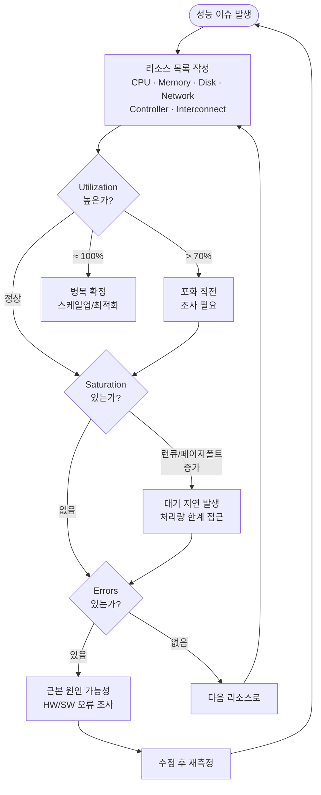
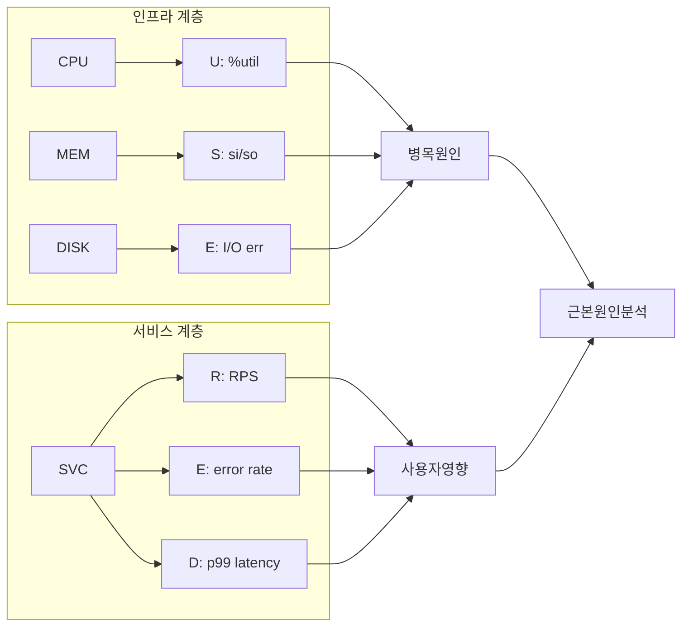
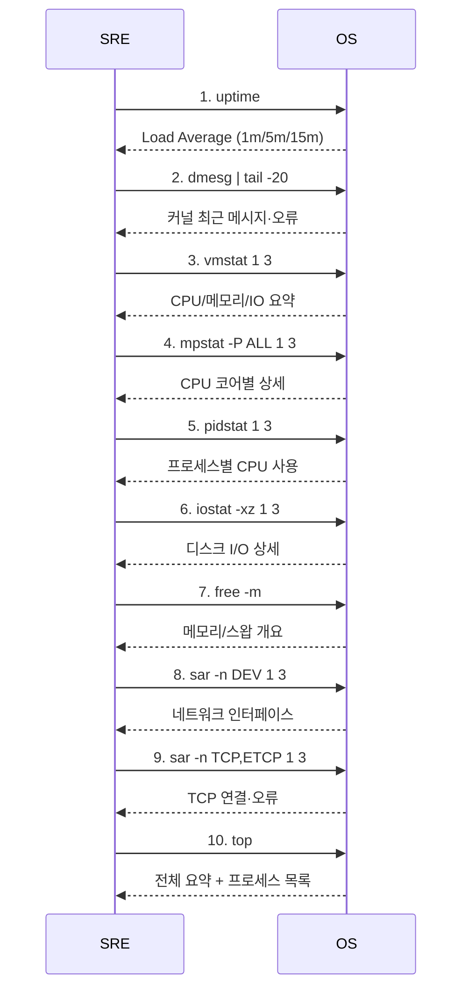
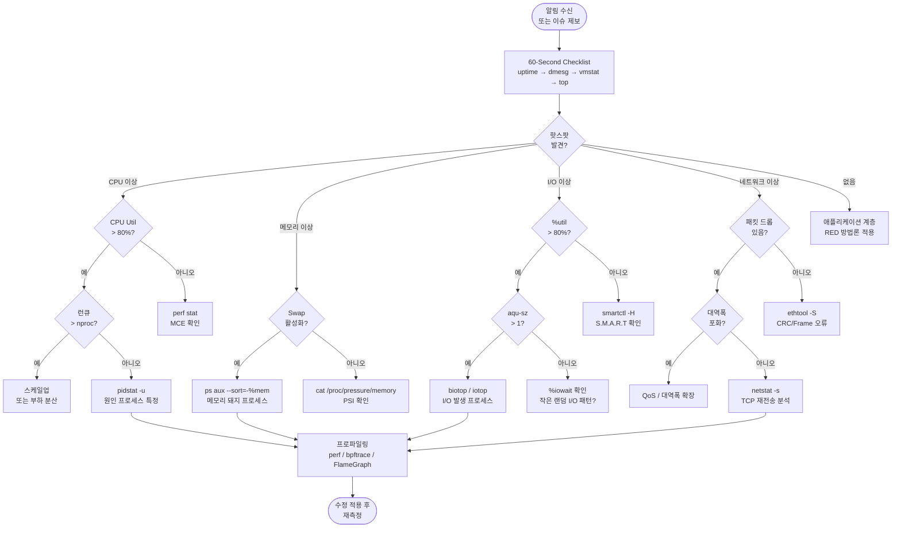

# USE 방법론과 Brendan Gregg 성능 분석 도구 완전 가이드

성능 장애 앞에서 "어디서부터 봐야 하나"라는 질문에
체계적으로 답하는 프레임워크가 **USE 방법론**이다.
Netflix 선임 성능 엔지니어 Brendan Gregg가 고안한
이 방법론은 CPU·메모리·디스크·네트워크 모든 리소스에
동일한 렌즈를 들이댄다.

---

## 1. USE 방법론 개요

### 핵심 정의

| 구성 요소 | 원문 정의 | 한 줄 요약 |
|:-------:|----------|-----------|
| **U**tilization | Average time the resource was busy | 리소스가 사용 중인 비율 (%) |
| **S**aturation | Degree to which the resource has extra work | 처리 못하고 쌓인 대기 정도 |
| **E**rrors | Count of error events | 실패·오류 이벤트 수 |

> Gregg 원문: "For every resource, check utilization, saturation, and errors."

**Utilization**은 두 가지 뜻이 혼용된다.
- **시간 기반**: 측정 구간 중 리소스가 사용된 시간 비율
  (예: CPU 80% → 1초 중 0.8초 바쁨)
- **용량 기반**: 최대 처리량 대비 현재 처리량
  (예: 1 Gbps 링크 중 800 Mbps 사용)

**Saturation**은 대기열(queue)이 형성되는 순간을 포착한다.
Utilization 100%가 되기 전에도 포화 신호는 먼저 나타날 수 있다.

**Errors**는 자주 묵살되지만, 소량의 에러도
성능 저하의 근본 원인인 경우가 많다.

---

### USE 방법론 흐름도



---

### 리소스 → USE 메트릭 매핑

| 리소스 | Utilization | Saturation | Errors |
|--------|------------|------------|--------|
| **CPU** | `mpstat` %usr+%sys | `vmstat` r 컬럼, Load Avg | `dmesg` MCE, `perf stat` |
| **Memory** | `free` used / total | `vmstat` si/so, PSI | `edac-util`, `dmesg` mce |
| **Disk** | `iostat` %util | `iostat` aqu-sz | `smartctl -A`, `dmesg` |
| **Network** | bytes / BW 최대값 | `ss -tin` retrans | `ethtool -S` errors |
| **CPU Sched** | — | `perf sched latency` | — |
| **File Desc** | `lsof` / ulimit | — | `errno EMFILE` 수 |
| **Mutex Lock** | `perf lock` | `perf lock contention` | — |

---

## 2. USE vs RED 방법론 비교

RED(Rate, Errors, Duration)는 Tom Wilkie가 제안한 방법론으로
**서비스/애플리케이션 계층**에 초점을 둔다.

| 항목 | USE | RED |
|------|-----|-----|
| 창시자 | Brendan Gregg (Netflix) | Tom Wilkie (Grafana) |
| 관점 | **인프라·리소스** 중심 | **서비스·요청** 중심 |
| 질문 | "기계가 행복한가?" | "사용자가 행복한가?" |
| 구성 요소 | Utilization · Saturation · Errors | Rate · Errors · Duration |
| 적용 대상 | CPU, 메모리, 디스크, 네트워크 | HTTP API, gRPC, 데이터베이스 쿼리 |
| 메트릭 예시 | %util, run queue, HW errors | RPS, error rate, p99 latency |
| 단점 | 사용자 경험 파악 불가 | 리소스 병목 원인 파악 불가 |



### 언제 어느 방법론을 쓰나

```
USE  →  "서버가 왜 느린가?"를 진단할 때
         인프라 리소스 병목 찾기
         하드웨어·OS 수준 트러블슈팅

RED  →  "API 응답이 왜 느린가?"를 진단할 때
         마이크로서비스 성능 모니터링
         SLO/SLI 기반 알림 설계

Best →  두 방법을 함께 쓴다.
         RED로 사용자 영향을 감지하고
         USE로 인프라 근본 원인을 찾는다.
```

---

## 3. Brendan Gregg 도구 생태계

### 도구 레이어별 분류

| 레이어 | 정적 분석 | 동적 추적 | 벤치마크 |
|--------|---------|---------|---------|
| CPU | `mpstat`, `turbostat` | `perf`, `bpftrace` | `stress-ng` |
| 메모리 | `free`, `vmstat`, `slabtop` | `bpftrace`, `memleak` | `memtester` |
| 디스크 | `iostat`, `df` | `blktrace`, `biolatency` | `fio` |
| 네트워크 | `ss`, `ip`, `ethtool` | `tcpdump`, `tcpretrans` | `iperf3` |
| 프로세스 | `ps`, `pidstat` | `strace`, `execsnoop` | — |
| 커널 | `/proc`, `/sys` | `ftrace`, `kprobe` | — |

---

## 4. 60-Second Linux Analysis

Netflix 성능팀이 공개한 "인스턴스 이상 시 첫 60초 체크리스트".
총 10개 명령으로 전체 시스템 상태를 빠르게 스캔한다.



---

### 4.1 `uptime` — Load Average 해석

```bash
$ uptime
 14:32:10 up 42 days, 3:11, 2 users, load average: 2.45, 1.32, 0.87
```

**해석 기준:**

| Load Average | 상태 | 행동 |
|-------------|------|------|
| < CPU 수 | 여유 | 정상 |
| ≈ CPU 수 | 포화 직전 | 모니터링 강화 |
| > CPU 수 | 포화 | 즉시 원인 조사 |

- **1분 > 15분**: 상황 악화 중
- **1분 < 15분**: 상황 개선 중 (피크 지남)
- Load Average에는 CPU 대기 + **IO 대기** 프로세스가 모두 포함

```bash
# CPU 수 확인
nproc
grep -c ^processor /proc/cpuinfo
```

---

### 4.2 `dmesg | tail` — 커널 오류 확인

```bash
$ dmesg -T | tail -20
[Thu Apr 17 14:30:01 2026] EXT4-fs error (device sda1): ...
[Thu Apr 17 14:30:05 2026] Out of memory: Kill process 1234 ...
[Thu Apr 17 14:30:10 2026] EDAC MC0: 1 CE memory read error ...
```

**주요 시그널:**

| 패턴 | 의미 | 심각도 |
|------|------|-------|
| `Out of memory` / `OOM` | 메모리 포화, 프로세스 강제 종료 | 높음 |
| `EXT4-fs error` / `I/O error` | 디스크 오류 | 높음 |
| `EDAC` / `CE memory` | ECC 메모리 오류 | 중간 |
| `dropped packets` | 네트워크 큐 포화 | 중간 |
| `soft lockup` / `hung task` | CPU/커널 행 | 매우 높음 |
| `MCE` | Machine Check Exception (HW 오류) | 매우 높음 |

```bash
# 타임스탬프와 함께, 오류만 필터링
dmesg -T --level=err,crit,alert,emerg | tail -30
```

---

### 4.3 `vmstat 1` — CPU/메모리 종합 뷰

```bash
$ vmstat 1 5
procs -----------memory---------- ---swap-- -----io---- -system-- ------cpu-----
 r  b   swpd   free   buff  cache   si   so    bi    bo   in   cs us sy id wa st
 3  0      0 524288  65536 1048576    0    0   120   450 1200 4500 45  8 44  3  0
 4  0      0 520000  65536 1048576    0    0     0   200 1350 5200 52 10 35  3  0
```

**핵심 컬럼 해석:**

| 컬럼 | 의미 | 주의 임계값 |
|------|------|-----------|
| `r` | 런큐 대기 프로세스 수 | > CPU 수 → 포화 |
| `b` | I/O 블록 대기 프로세스 수 | > 0 지속 → I/O 병목 |
| `si` / `so` | 스왑 in/out (KB/s) | > 0 → 메모리 포화 |
| `us` | 사용자 공간 CPU % | — |
| `sy` | 커널 공간 CPU % | > 20% → syscall 과다 |
| `wa` | I/O 대기 CPU % | > 10% → 디스크 병목 |
| `st` | Steal (VM 환경) | > 5% → 호스트 자원 부족 |
| `in` | 초당 인터럽트 수 | 급증 → 디바이스 이슈 |
| `cs` | 초당 컨텍스트 스위치 | 급증 → 스케줄링 오버헤드 |

---

### 4.4 `mpstat -P ALL 1` — CPU 불균형 탐지

```bash
$ mpstat -P ALL 1 3
14:35:00  CPU  %usr %nice  %sys %iowait  %irq  %soft %steal %idle
14:35:01  all  45.0   0.0   8.2    3.0   0.1    0.5    0.0  43.2
14:35:01    0  92.0   0.0   7.0    1.0   0.1    0.4    0.0   0.5  ← 핫스팟!
14:35:01    1  12.0   0.0   8.5    2.0   0.1    0.5    0.0  76.9
14:35:01    2  38.0   0.0   9.0    4.0   0.2    0.6    0.0  48.2
14:35:01    3  38.0   0.0   8.3    5.0   0.0    0.5    0.0  48.2
```

**진단 패턴:**

| 패턴 | 원인 | 조치 |
|------|------|------|
| CPU 0만 100%, 나머지 유휴 | 단일 스레드 앱, IRQ 불균형 | `irqbalance`, 스레드 수 증가 |
| 전체 %sy 높음 | 과도한 syscall | `perf record -e syscalls:*` |
| %iowait 높음 | I/O 병목 | `iostat`으로 디스크 추적 |
| %soft 높음 | 네트워크 인터럽트 과다 | NIC 큐, IRQ affinity 조정 |

---

### 4.5 `pidstat 1` — 프로세스별 CPU/메모리

```bash
$ pidstat -u -r 1 3
14:36:00  UID   PID  %usr %system  %CPU   VSZ   RSS  %MEM  Command
14:36:01 1000  1234  45.0    3.5  48.5  2.1g  800m   9.8  java
14:36:01    0  5678   0.1   15.0  15.1  512m   50m   0.6  kworker/0:2
14:36:01 1000  9012   8.0    1.0   9.0  256m  100m   1.2  python3
```

**플래그 조합:**

```bash
pidstat -u 1      # CPU 사용률
pidstat -r 1      # 메모리 (RSS, VSZ)
pidstat -d 1      # 디스크 I/O per process
pidstat -w 1      # 컨텍스트 스위치
pidstat -t -p PID # 스레드 단위
```

---

### 4.6 `iostat -xz 1` — 디스크 I/O 상세

```bash
$ iostat -xz 1 3
Device  r/s   w/s  rkB/s  wkB/s  %rrqm  %wrqm  r_await  w_await  aqu-sz  %util
sda    25.0  180.0  800.0 7200.0   0.0    2.1     1.2     12.5     2.3    95.0
nvme0  150.0 900.0 6000.0 36000.0  0.0    0.0     0.1      0.2     0.05    8.0
```

**핵심 컬럼:**

| 컬럼 | 의미 | 정상 범위 |
|------|------|---------|
| `r/s`, `w/s` | 초당 읽기/쓰기 요청 | 기기별 상이 |
| `r_await`, `w_await` | 읽기/쓰기 평균 지연 (ms) | SSD < 1ms, HDD < 10ms |
| `aqu-sz` | 평균 요청 큐 크기 | > 1 → 포화 신호 |
| `%util` | 디스크 사용률 (USE: U) | > 80% → 병목 위험 |

> `%util` 100%여도 처리량이 충분하면 실제 문제가 아닐 수 있다.
> **`aqu-sz`와 `await` 증가를 함께 확인**해야 진짜 포화다.

---

### 4.7 `free -m` — 메모리 개요

```bash
$ free -m
              total    used    free  shared  buff/cache  available
Mem:          64000   45000    2000    1200       17000      16800
Swap:          8192    4096    4096
```

**해석:**

- `available` = 실제 사용 가능한 메모리
  (`free` + 회수 가능한 `buff/cache`)
- `Swap used > 0` → 메모리 포화, 스왑 활성화됨
- `available < 총 메모리의 10%` → 위험 수준

```bash
# 더 상세한 분석
cat /proc/meminfo | grep -E 'MemTotal|MemFree|MemAvailable|SwapTotal|SwapFree|Dirty|Writeback|AnonPages|Mapped|Shmem|Slab'
```

---

### 4.8 `sar -n DEV 1` — 네트워크 인터페이스

```bash
$ sar -n DEV 1 3
14:40:00  IFACE   rxpck/s  txpck/s  rxkB/s  txkB/s  rxcmp/s  txcmp/s  rxmcst/s  %ifutil
14:40:01  eth0    5000.0   4800.0   800.0   750.0     0.0      0.0      0.0       8.0
14:40:01  lo       100.0    100.0     5.0     5.0     0.0      0.0      0.0       0.0
```

**Utilization 계산:**

```bash
# 10 GbE 링크 → 최대 1,250,000 KB/s
# rxkB/s + txkB/s = 1550 KB/s → ~0.12% 사용률

# 실시간 대역폭 사용률 계산
# %ifutil = (rxkB/s + txkB/s) / (링크속도_KB/s) * 100
```

---

### 4.9 `sar -n TCP,ETCP 1` — TCP 오류

```bash
$ sar -n TCP,ETCP 1 3
14:41:00  active/s passive/s    iseg/s    oseg/s
14:41:01      2.0      0.0    5000.0    4800.0

14:41:00  atmptf/s  estres/s retrans/s isegerr/s orsts/s
14:41:01      0.0       0.0      12.0      0.0     0.0
```

**핵심 컬럼:**

| 컬럼 | 의미 | 주의 임계값 |
|------|------|-----------|
| `active/s` | 초당 능동 연결 시도 | 급증 → DDoS 가능성 |
| `passive/s` | 초당 수동 연결 수락 | — |
| `retrans/s` | 초당 TCP 재전송 수 | > 0 지속 → 네트워크 손실 |
| `isegerr/s` | 수신 세그먼트 오류 | > 0 → 패킷 손상 |

---

### 4.10 `top` — 전체 요약

```bash
$ top
top - 14:42:00 up 42 days,  3:21,  2 users,  load average: 2.45, 1.32, 0.87
Tasks: 312 total,   3 running, 309 sleeping,   0 stopped,   0 zombie
%Cpu(s): 45.2 us,  8.1 sy,  0.0 ni, 43.3 id,  3.0 wa,  0.1 hi,  0.3 si,  0.0 st
MiB Mem :  64000.0 total,   2000.0 free,  45000.0 used,  17000.0 buff/cache
MiB Swap:   8192.0 total,   4096.0 free,   4096.0 used.  16800.0 avail Mem
```

**빠른 체크 포인트:**
- **zombie 프로세스** > 0 → 좀비 누적 조사
- **wa** > 10% → I/O 병목
- **st** > 5% → VM steal time (호스트 경합)
- **Load avg / nproc** > 1 → CPU 포화

---

## 5. CPU USE 상세 적용

### Utilization

```bash
# 코어별 사용률 (1초 간격 5회)
mpstat -P ALL 1 5

# 프로세스별 CPU 상위 10개
ps aux --sort=-%cpu | head -11

# 지속 모니터링
watch -n 1 'mpstat -P ALL 1 1 | grep -v "^$"'
```

### Saturation

```bash
# 런큐 길이 (r 컬럼)
vmstat 1 10

# 스케줄링 지연 분석
perf sched latency -s max 2>/dev/null || \
  perf sched record -- sleep 5 && perf sched latency

# PSI CPU 압력 (커널 4.20+)
cat /proc/pressure/cpu
# some avg10=5.00 avg60=3.20 avg300=1.00 total=50000000
# full avg10=0.00 avg60=0.00 avg300=0.00 total=0
```

**PSI 해석:**
- `some`: 일부 태스크가 CPU 대기 중인 시간 비율 (%)
- `full`: 모든 태스크가 CPU 대기 중인 시간 비율 (%)
- `avg10` > 10 → 즉시 조사 필요

### Errors

```bash
# Machine Check Exception (하드웨어 CPU 오류)
dmesg | grep -i "mce\|machine check"
journalctl -k | grep -i "mce\|machine check"

# perf 하드웨어 카운터 오류
perf stat -e cache-misses,cache-references,\
branch-misses,branch-instructions \
-a sleep 5

# EDAC (Error Detection and Correction)
edac-util -s
ls /sys/bus/platform/drivers/nforce2-smc/ 2>/dev/null
```

---

## 6. Memory USE 상세 적용

### Utilization

```bash
# 메모리 사용 현황
free -h

# 상세 분류
cat /proc/meminfo

# 프로세스별 RSS (Resident Set Size)
ps aux --sort=-%mem | head -11

# NUMA 노드별 메모리 사용
numastat -m
```

**주요 지표:**
```
MemAvailable  ← 실제 사용 가능 메모리 (커널 3.14+)
MemFree       ← 완전히 비어있는 메모리 (오해 주의)
Dirty         ← fsync 대기 중인 쓰기 버퍼
Slab          ← 커널 슬랩 캐시 (kworker, dentries 등)
```

### Saturation

```bash
# 스왑 활동 (si/so가 0이어야 정상)
vmstat 1 5

# PSI 메모리 압력
cat /proc/pressure/memory
# some avg10=2.00 avg60=1.50 avg300=0.50 total=...
# full avg10=0.00 avg60=0.00 avg300=0.00 total=...

# 페이지 스캔율 (활발하면 메모리 포화)
sar -B 1 5
# pgscank/s : kswapd가 스캔한 페이지/초
# pgscand/s : 직접 스캔한 페이지/초 → 높으면 즉시 포화

# OOM 이벤트 확인
dmesg | grep -i "oom\|out of memory\|killed process"
```

### Errors

```bash
# ECC 메모리 오류
edac-util -s 4    # 상세 레벨 4

# 커널 메시지에서 메모리 오류
dmesg | grep -iE "edac|ecc|memory error|uncorrectable"

# MCE 메모리 관련 (rasdaemon: 커널 4.12+, mcelog 대체)
journalctl -u rasdaemon | grep -i "error\|mce" | tail -10
```

---

## 7. Disk I/O USE 상세 적용

### Utilization

```bash
# 디스크별 사용률
iostat -xz 1 5

# 파티션별
iostat -p sda -x 1 5

# 특정 디스크 집중 분석
iostat -xd nvme0n1 1 10
```

**%util의 한계:**
- 병렬 I/O(NVMe, SSD) 환경에서 `%util`은 과소평가됨
- `aqu-sz` (평균 큐 크기)와 `await` (평균 지연)를 함께 봐야 함

### Saturation

```bash
# 큐 길이와 지연
iostat -xz 1 5
# aqu-sz > 1  → 큐 포화 시작
# await  이 r_await/w_await보다 훨씬 크면 → 큐 대기

# 블록 계층 I/O 지연 분포 (BCC 도구)
biolatency -D 1 10   # 디스크별 분포
biosnoop               # 개별 I/O 추적

# PSI I/O 압력
cat /proc/pressure/io
```

### Errors

```bash
# SMART 상태 확인
smartctl -A /dev/sda
smartctl -H /dev/sda    # 전체 상태 (PASSED/FAILED)

# 재할당된 섹터 (증가하면 디스크 교체 필요)
smartctl -A /dev/sda | grep -i "reallocated\|pending\|uncorrectable"

# 커널 I/O 오류
dmesg | grep -iE "I/O error|blk_update_request|SCSI error"

# dm-crypt/LVM 오류
dmesg | grep -iE "device-mapper|dm-"
```

---

## 8. Network USE 상세 적용

### Utilization

```bash
# 인터페이스 속도 확인
ethtool eth0 | grep Speed
# Speed: 10000Mb/s → 최대 1,250,000 KB/s

# 현재 사용량 모니터링
sar -n DEV 1 5

# 실시간 대역폭 (nload/iftop 필요시)
cat /proc/net/dev

# 사용률 % 계산 스크립트
IFACE=eth0
SPEED=$(ethtool $IFACE 2>/dev/null | awk '/Speed:/{gsub("Mb/s","",$2); print $2}')
RX=$(sar -n DEV 1 1 2>/dev/null | awk -v i="$IFACE" '$2==i {print $5}')
TX=$(sar -n DEV 1 1 2>/dev/null | awk -v i="$IFACE" '$2==i {print $6}')
echo "Utilization: $(echo "scale=2; ($RX+$TX)*8/1024/$SPEED*100" | bc)%"
```

### Saturation

```bash
# 드롭된 패킷 (큐 포화 징후)
ip -s link show eth0
netstat -i   # RX-DRP, TX-DRP 컬럼

# TCP 재전송 (혼잡·손실)
sar -n TCP,ETCP 1 5
ss -tin | grep retrans

# 전체 TCP 통계
netstat -s | grep -iE "retransmit|failed|reset|overflow"

# 소켓 수신 큐 오버플로우
netstat -s | grep "receive buffer"
ss -lntp   # Recv-Q > 0 이면 수신 큐 포화
```

### Errors

```bash
# NIC 드라이버 레벨 오류
ethtool -S eth0 | grep -iE "error|drop|miss|crc|frame"

# 커널 네트워크 오류
dmesg | grep -iE "eth0|ens|NIC\|link down\|NETDEV"

# IP 레벨 통계
cat /proc/net/snmp | grep -E "Ip:|InHdrErrors|InAddrErrors"

# TCP 오류 상세
cat /proc/net/netstat
```

---

## 9. Checklist 자동화

### USE 자동 수집 스크립트

```bash
#!/bin/bash
# use-check.sh - USE 방법론 자동 체크리스트
# 사용법: ./use-check.sh [출력파일]

set -euo pipefail

OUTPUT="${1:-/tmp/use-report-$(date +%Y%m%d-%H%M%S).txt}"
INTERVAL=1
COUNT=3

log() { echo "[$(date '+%H:%M:%S')] $*" | tee -a "$OUTPUT"; }
section() { echo -e "\n========== $1 ==========" | tee -a "$OUTPUT"; }

log "USE 방법론 체크리스트 시작"
log "호스트: $(hostname) | 날짜: $(date)"
log "CPU 수: $(nproc) | 메모리: $(free -h | awk '/Mem:/{print $2}')"

# ----- CPU -----
section "CPU Utilization (mpstat)"
mpstat -P ALL "$INTERVAL" "$COUNT" | tee -a "$OUTPUT"

section "CPU Saturation (vmstat r컬럼)"
vmstat "$INTERVAL" "$COUNT" | tee -a "$OUTPUT"

section "CPU Saturation (PSI)"
if [ -f /proc/pressure/cpu ]; then
  cat /proc/pressure/cpu | tee -a "$OUTPUT"
else
  echo "PSI 미지원 (커널 4.20 미만)" | tee -a "$OUTPUT"
fi

section "CPU Errors (dmesg MCE)"
dmesg -T | grep -iE "mce|machine check" | tail -10 | tee -a "$OUTPUT" || \
  echo "MCE 오류 없음" | tee -a "$OUTPUT"

# ----- Memory -----
section "Memory Utilization (free)"
free -h | tee -a "$OUTPUT"

section "Memory Saturation (vmstat si/so)"
vmstat "$INTERVAL" "$COUNT" | awk 'NR==1{print} NR==2{print} NR>2' | \
  tee -a "$OUTPUT"

section "Memory Saturation (PSI)"
if [ -f /proc/pressure/memory ]; then
  cat /proc/pressure/memory | tee -a "$OUTPUT"
fi

section "Memory Errors (EDAC)"
if command -v edac-util &>/dev/null; then
  edac-util -s 4 | tee -a "$OUTPUT"
else
  dmesg -T | grep -i "edac\|ecc" | tail -5 | tee -a "$OUTPUT" || \
    echo "EDAC 유틸 없음" | tee -a "$OUTPUT"
fi

# ----- Disk -----
section "Disk Utilization + Saturation (iostat)"
iostat -xz "$INTERVAL" "$COUNT" | tee -a "$OUTPUT"

section "Disk Saturation (PSI)"
if [ -f /proc/pressure/io ]; then
  cat /proc/pressure/io | tee -a "$OUTPUT"
fi

section "Disk Errors (smartctl)"
for dev in $(lsblk -dno NAME | grep -E "^sd|^nvme" | head -5); do
  echo "--- /dev/$dev ---" | tee -a "$OUTPUT"
  smartctl -H "/dev/$dev" 2>/dev/null | grep -E "overall|PASSED|FAILED" | \
    tee -a "$OUTPUT" || echo "smartctl 접근 불가" | tee -a "$OUTPUT"
done

# ----- Network -----
section "Network Utilization (sar DEV)"
sar -n DEV "$INTERVAL" "$COUNT" | tee -a "$OUTPUT"

section "Network Saturation (TCP retrans)"
sar -n TCP,ETCP "$INTERVAL" "$COUNT" | tee -a "$OUTPUT"

section "Network Errors (ethtool)"
for iface in $(ip -o link show | awk -F': ' '{print $2}' | grep -v lo | head -3); do
  echo "--- $iface ---" | tee -a "$OUTPUT"
  ethtool -S "$iface" 2>/dev/null | grep -iE "error|drop|crc" | \
    tee -a "$OUTPUT" || echo "ethtool 데이터 없음" | tee -a "$OUTPUT"
done

log "완료: $OUTPUT"
```

---

### Prometheus로 USE 지표 구현

**node_exporter 기반 PromQL 쿼리:**

```yaml
# prometheus-use-rules.yaml
groups:
  - name: use_method
    interval: 30s
    rules:

      # ====== CPU ======
      # CPU Utilization (%)
      - record: use:cpu:utilization
        expr: |
          100 - (
            avg by (instance) (
              rate(node_cpu_seconds_total{mode="idle"}[5m])
            ) * 100
          )

      # CPU Saturation (런큐 / CPU 수)
      - record: use:cpu:saturation
        expr: |
          node_load1
          /
          count without(cpu, mode) (
            node_cpu_seconds_total{mode="idle"}
          )

      # ====== Memory ======
      # Memory Utilization (%)
      - record: use:memory:utilization
        expr: |
          (
            1 - (node_memory_MemAvailable_bytes
                 / node_memory_MemTotal_bytes)
          ) * 100

      # Memory Saturation (스왑 사용량)
      - record: use:memory:saturation_swap
        expr: |
          node_memory_SwapTotal_bytes
          - node_memory_SwapFree_bytes

      # Memory Saturation PSI (some avg10)
      - record: use:memory:saturation_psi
        expr: node_pressure_memory_waiting_seconds_total

      # ====== Disk I/O ======
      # Disk Utilization (%)
      - record: use:disk:utilization
        expr: |
          rate(node_disk_io_time_seconds_total[5m]) * 100

      # Disk Saturation (평균 큐 크기)
      - record: use:disk:saturation
        expr: |
          rate(node_disk_io_time_weighted_seconds_total[5m])

      # ====== Network ======
      # Network Utilization (bytes/s)
      - record: use:network:utilization_rx
        expr: rate(node_network_receive_bytes_total[5m])

      - record: use:network:utilization_tx
        expr: rate(node_network_transmit_bytes_total[5m])

      # Network Saturation (드롭 패킷/s)
      - record: use:network:saturation_drops
        expr: |
          rate(node_network_receive_drop_total[5m])
          + rate(node_network_transmit_drop_total[5m])

      # Network Errors
      - record: use:network:errors
        expr: |
          rate(node_network_receive_errs_total[5m])
          + rate(node_network_transmit_errs_total[5m])

  # ====== 알림 규칙 ======
  - name: use_alerts
    rules:
      - alert: HighCPUUtilization
        expr: use:cpu:utilization > 85
        for: 5m
        labels:
          severity: warning
        annotations:
          summary: "CPU 사용률 높음 ({{ $value | humanize }}%)"

      - alert: CPUSaturation
        expr: use:cpu:saturation > 2
        for: 3m
        labels:
          severity: warning
        annotations:
          summary: "CPU 포화 (런큐/CPU = {{ $value | humanize }})"

      - alert: MemorySaturationSwap
        expr: use:memory:saturation_swap > 0
        for: 5m
        labels:
          severity: warning
        annotations:
          summary: "스왑 사용 중 ({{ $value | humanizeBytes }})"

      - alert: DiskIOSaturation
        expr: use:disk:utilization > 80
        for: 5m
        labels:
          severity: warning
        annotations:
          summary: "디스크 I/O 포화 ({{ $labels.device }}: {{ $value | humanize }}%)"

      - alert: NetworkErrors
        expr: use:network:errors > 0
        for: 2m
        labels:
          severity: warning
        annotations:
          summary: "네트워크 오류 발생 ({{ $labels.device }})"
```

---

### Grafana 대시보드 패턴

Grafana Labs 공식 USE Method 대시보드 ID: **13977**
(Node Exporter - USE Method / Node)

**패널 구성 원칙:**

```
Row: CPU
  ├── [Stat]  CPU Utilization %      ← use:cpu:utilization
  ├── [Graph] CPU Saturation (Load)  ← use:cpu:saturation
  └── [Stat]  MCE Errors             ← 커널 카운터

Row: Memory
  ├── [Gauge] Memory Utilization %   ← use:memory:utilization
  ├── [Graph] Swap In/Out KB/s       ← vmstat si/so
  └── [Graph] PSI Memory Pressure    ← use:memory:saturation_psi

Row: Disk
  ├── [Heatmap] IO Latency (ms)      ← 분포 시각화
  ├── [Graph]   %util per device     ← use:disk:utilization
  └── [Graph]   Queue Depth          ← use:disk:saturation

Row: Network
  ├── [Graph] RX/TX Bytes/s          ← use:network:utilization_*
  ├── [Graph] Drops/s                ← use:network:saturation_drops
  └── [Graph] Errors/s               ← use:network:errors
```

---

## 10. 실무 트러블슈팅 워크플로우

### USE 기반 체계적 진단 절차



---

### 복합 병목 사례 해석

#### 사례 1: CPU 높음 + I/O 대기 없음 → CPU 바운드

```bash
# vmstat 결과
procs                 cpu
 r  b   ...    us sy id wa
 6  0   ...    92  6  2  0   ← r=6(nproc=4), wa=0

# 진단: 순수 CPU 바운드
# → pidstat로 원인 프로세스 찾기
# → perf top으로 핫 함수 분석
```

#### 사례 2: CPU 낮음 + I/O 대기 높음 → I/O 바운드

```bash
# vmstat 결과
procs                 cpu
 r  b   ...    us sy id wa
 0  4   ...    10  3 40 47   ← b=4(I/O 블록), wa=47%

# 진단: I/O 바운드
# → iostat -xz로 디스크 특정
# → iotop으로 원인 프로세스 찾기
# → 애플리케이션 I/O 패턴 최적화 또는 스토리지 업그레이드
```

#### 사례 3: 메모리 여유 + 성능 저하 → 캐시 thrashing

```bash
# free 결과
              total    used    free  available
Mem:          64000   62000    500       1200   ← available 매우 낮음

# vmstat si/so
 si   so
100  200       ← 스왑 in/out 활발

# 진단: 메모리 포화, 페이지 교체 발생
# → PSI 확인: cat /proc/pressure/memory
# → slabtop으로 커널 슬랩 캐시 확인
# → 불필요한 서비스 종료 또는 메모리 증설
```

#### 사례 4: 네트워크 오류 + 재전송 → 물리 계층 문제

```bash
# ethtool -S eth0 | grep error
rx_crc_errors: 1245
rx_frame_errors: 89
rx_missed_errors: 0

# netstat -s | grep retransmit
1847 segments retransmitted

# 진단: CRC 오류 → 케이블/포트/SFP 모듈 불량
# 조치: 케이블 교체, 스위치 포트 변경
```

---

## 참고 자료

- [Brendan Gregg - The USE Method](https://www.brendangregg.com/usemethod.html) (2026-04-17 확인)
- [Brendan Gregg - Linux Performance](https://www.brendangregg.com/linuxperf.html) (2026-04-17 확인)
- [Brendan Gregg - USE Method: Linux Performance Checklist](https://www.brendangregg.com/USEmethod/use-linux.html) (2026-04-17 확인)
- [Netflix Tech Blog - Linux Performance Analysis in 60,000 Milliseconds](https://www.brendangregg.com/Articles/Netflix_Linux_Perf_Analysis_60s.pdf) (2026-04-17 확인)
- [Brendan Gregg - Systems Performance, 2nd Edition (2020)](https://www.brendangregg.com/systems-performance-2nd-edition-book.html)
- [Brendan Gregg - BPF Performance Tools (2019)](https://www.brendangregg.com/bpf-performance-tools-book.html)
- [Grafana - The RED Method: How to Instrument Your Services](https://grafana.com/blog/the-red-method-how-to-instrument-your-services/) (2026-04-17 확인)
- [Linux Kernel Docs - PSI (Pressure Stall Information)](https://docs.kernel.org/accounting/psi.html) (2026-04-17 확인)
- [Kubernetes Docs - Understanding PSI Metrics](https://kubernetes.io/docs/reference/instrumentation/understand-psi-metrics/) (2026-04-17 확인)
- [Grafana Labs - Node Exporter USE Method Dashboard (ID: 13977)](https://grafana.com/grafana/dashboards/13977-use-method-node/) (2026-04-17 확인)
- [Prometheus node_exporter GitHub](https://github.com/prometheus/node_exporter) (2026-04-17 확인)
