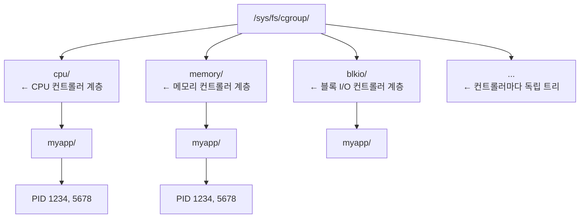
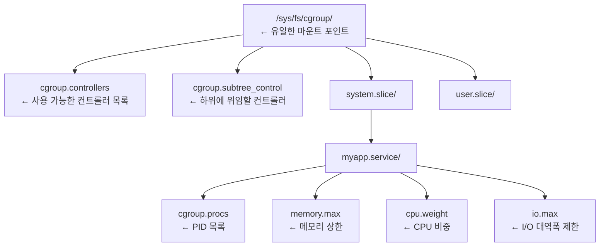

# cgroups v1 vs v2: 리소스 격리의 핵심

cgroups(Control Groups)는 프로세스 집합에 CPU, 메모리,
I/O, 네트워크 등의 자원을 제한·계량·격리하는 커널 기능이다.
컨테이너와 Kubernetes의 리소스 제한은 모두 cgroups 위에서 동작한다.

---

## v1 vs v2 한눈에 비교

| 항목 | cgroups v1 | cgroups v2 |
|------|-----------|-----------|
| 계층 구조 | 컨트롤러마다 별도 계층 | **단일 통합 계층** |
| 마운트 경로 | `/sys/fs/cgroup/<controller>/` | `/sys/fs/cgroup/` |
| 프로세스 배치 | 어느 노드에나 가능 | **리프 노드에만** 가능 |
| 컨트롤러 충돌 | 동일 프로세스가 여러 계층에 등장 가능 | 불가 (단일 위치 보장) |
| Thread 모드 | 없음 | `threaded` 모드 지원 |
| 루트리스 컨테이너 | 제한적 | **완전 지원** |
| PSI (압력 지표) | 없음 | **지원** (memory/cpu/io) |
| BPF 통합 | 없음 | **지원** |
| 신규 기능 추가 | 중단됨 | 계속 추가 중 |

---

## cgroups v1: 다중 계층



**문제점**: 동일 프로세스가 각 컨트롤러 계층에 따로 존재.
계층 간 동기화 없음 → 일관성 유지가 어려움.

---

## cgroups v2: 단일 통합 계층



**핵심 규칙**: 내부 노드(자식이 있는 cgroup)에는
프로세스를 직접 배치할 수 없다 (no-internal-process 규칙).

---

## 주요 컨트롤러와 인터페이스 파일

### CPU 컨트롤러

```bash
# CPU 비중 (기본 100, 범위 1~10000)
# 상대적 가중치 — sibling cgroup 대비 비율
echo 200 > cpu.weight          # 다른 cgroup의 2배 CPU

# CPU 절대 제한 (quota/period)
# 형식: "quota period" (마이크로초)
# 기본 period = 100000µs (100ms). 컨테이너 런타임도 동일.
# period를 늘리면 버스트 억제 약화 및 throttle 지표 왜곡 위험
echo "20000 100000" > cpu.max    # 20ms/100ms = 20% 상한 (권장)
echo "max 100000" > cpu.max      # 제한 없음
```

### 메모리 컨트롤러

```bash
# 절대 상한 — 초과 시 OOM kill
echo "4G" > memory.max

# 소프트 상한 — 초과 시 커널이 적극적 메모리 회수 압력 인가
# OOM kill은 발생하지 않으나 anonymous 페이지→swap,
# file-backed 페이지→evict로 처리됨.
# 극단적 조건에서는 memory.max도 초과 가능.
echo "3G" > memory.high

# OOM killer 보호 최솟값
echo "512M" > memory.min

# swap 금지 (레이턴시 민감 서비스)
echo "0" > memory.swap.max

# OOM 발생 시 cgroup 전체를 함께 kill (컨테이너 단위)
echo "1" > memory.oom.group
```

### I/O 컨트롤러

```bash
# 장치별 대역폭/IOPS 제한
# 형식: "MAJ:MIN rbps=N wbps=N riops=N wiops=N"
echo "8:0 rbps=104857600 wbps=52428800" > io.max
# → /dev/sda 읽기 100MB/s, 쓰기 50MB/s

# I/O 비중 (기본 100)
echo 200 > io.weight
```

### PIDs 컨트롤러

```bash
# cgroup 내 최대 프로세스+스레드 수
echo 512 > pids.max

# 현재 사용 중
cat pids.current
```

---

## PSI (Pressure Stall Information)

v2 전용 기능. CPU/메모리/I/O 자원의 압박 정도를
백분율로 실시간 측정한다.

```bash
# 메모리 압박 확인
cat /sys/fs/cgroup/myapp.service/memory.pressure
# some avg10=0.00 avg60=0.00 avg300=0.00 total=0
# full avg10=0.00 avg60=0.00 avg300=0.00 total=0
```

| 지표 | 설명 |
|------|------|
| `some` | 일부 태스크가 자원을 기다린 시간 비율 |
| `full` | 모든 태스크가 자원을 기다린 시간 비율 |
| `avg10/60/300` | 10초/60초/300초 이동 평균 |

> Kubernetes 1.30+의 `MemoryQoS`와
> Facebook의 `oomd`(OOM 데몬)가 PSI를 사용한다.

---

## 현황: 배포판별 기본값

| 배포판 | cgroups 기본 버전 |
|--------|-----------------|
| RHEL 8 | v1 기본 (2024-05 EOL) |
| RHEL 9/10 | **v2** |
| Ubuntu 22.04+ | **v2** |
| Debian 11+ | **v2** |
| Fedora 31+ | **v2** |
| systemd 258+ (2025년 출시) | cgroups v1 레거시 계층 제거 |

```bash
# 현재 시스템이 v1인지 v2인지 확인
stat -f /sys/fs/cgroup | grep Type
# Type: tmpfs → v1
# Type: cgroup2fs → v2

# 또는
mount | grep cgroup
```

---

## Kubernetes와 cgroups v2

Kubernetes 1.25부터 cgroups v2 GA(정식 지원).

| K8s 버전 | cgroup v1 상태 |
|---------|--------------|
| 1.25 | cgroup v2 GA |
| 1.31 | v1 유지보수 모드 (신규 기능 없음) |
| **1.35** | **`failCgroupV1=true` 기본값** → v1 노드에서 kubelet 기동 거부 |

> **중요**: K8s 1.35+ 클러스터 업그레이드 전에
> 모든 노드가 cgroup v2를 사용하는지 반드시 확인할 것.
> v1 노드는 kubelet이 시작을 거부한다.

```bash
# 노드 cgroup 버전 확인
stat -f /sys/fs/cgroup | grep Type
```

```yaml
# /var/lib/kubelet/config.yaml
cgroupDriver: systemd   # 권장 (cgroupfs 대신)
```

**v2 전환 이점**:
- 컨테이너 단위 OOM kill (`memory.oom.group`)
- 일관된 리소스 계측 (BPF 활용)
- 루트리스 컨테이너 완전 지원
- Pod QoS 메모리 보호 `MemoryQoS`
  (alpha, `MemoryQoS` feature gate로 활성화 필요)

---

## 실무: systemd로 cgroup 조작

### 서비스 cgroup 확인

```bash
# 서비스의 cgroup 경로
systemctl show myapp -p ControlGroup

# cgroup 내 프로세스 목록
systemd-cgls /system.slice/myapp.service

# 실시간 리소스 사용량
systemd-cgtop

# 특정 cgroup의 메모리 사용량
cat /sys/fs/cgroup/system.slice/myapp.service/memory.current
```

### 런타임 제한 변경 (재시작 없이)

```bash
# 메모리 상한 실시간 변경
systemctl set-property myapp.service MemoryMax=2G

# 변경 내용 확인
systemctl show myapp.service -p MemoryMax

# 영구 적용 여부 선택
systemctl set-property --runtime myapp.service MemoryMax=2G  # 임시
systemctl set-property myapp.service MemoryMax=2G            # 영구
```

---

## 직접 cgroup v2 생성 (저수준)

```bash
# cgroup 생성
mkdir /sys/fs/cgroup/mytest

# 컨트롤러 활성화 (부모에서 위임)
echo "+cpu +memory +pids" > /sys/fs/cgroup/cgroup.subtree_control
echo "+cpu +memory +pids" > /sys/fs/cgroup/mytest/cgroup.subtree_control

# 제한 설정
echo "1G" > /sys/fs/cgroup/mytest/memory.max
echo "0" > /sys/fs/cgroup/mytest/memory.swap.max
echo 100 > /sys/fs/cgroup/mytest/pids.max

# 프로세스 이동 (현재 셸)
echo $$ > /sys/fs/cgroup/mytest/cgroup.procs

# cgroup 삭제 (프로세스가 없어야 함)
rmdir /sys/fs/cgroup/mytest
```

---

## 트러블슈팅

### cgroup v2에서 컨트롤러가 보이지 않을 때

```bash
# 부모 cgroup에서 컨트롤러가 위임되었는지 확인
cat /sys/fs/cgroup/cgroup.subtree_control

# 커널 부트 파라미터 확인 (cgroups v2 강제 활성화)
grep cgroup /proc/cmdline
# cgroup_no_v1=all  → v1 완전 비활성화
```

### OOM Kill 발생 원인 확인

```bash
# cgroup OOM 이벤트 카운터
cat /sys/fs/cgroup/system.slice/myapp.service/memory.events
# oom 3         ← OOM kill 발생 횟수
# oom_kill 1    ← 실제 프로세스 kill 횟수

# 커널 로그에서 OOM 상세
journalctl -k | grep -i "oom\|killed process"
```

### 컨테이너/Kubernetes 관점 디버깅

```bash
# 컨테이너의 cgroup 경로 확인 (containerd)
crictl inspect <container-id> | grep cgroupsPath

# 프로세스가 속한 cgroup 확인
cat /proc/<PID>/cgroup

# 컨테이너 메모리 OOM 이벤트 확인
CGROUP=$(crictl inspect <id> | jq -r '.info.runtimeSpec.linux.cgroupsPath')
cat /sys/fs/cgroup${CGROUP}/memory.events

# CPU throttle 확인 (Prometheus: container_cpu_cfs_throttled_periods_total)
cat /sys/fs/cgroup${CGROUP}/cpu.stat | grep throttled
```

---

## 참고 자료

- [Control Group v2 - Linux Kernel Documentation](https://docs.kernel.org/admin-guide/cgroup-v2.html)
  — 확인: 2026-04-17
- [About cgroup v2 - Kubernetes](https://kubernetes.io/docs/concepts/architecture/cgroups/)
  — 확인: 2026-04-17
- [Control Group APIs and Delegation - systemd.io](https://systemd.io/CGROUP_DELEGATION/)
  — 확인: 2026-04-17
- [World domination with cgroups in RHEL 8 - Red Hat Blog](https://www.redhat.com/en/blog/world-domination-cgroups-rhel-8-welcome-cgroups-v2)
  — 확인: 2026-04-17
