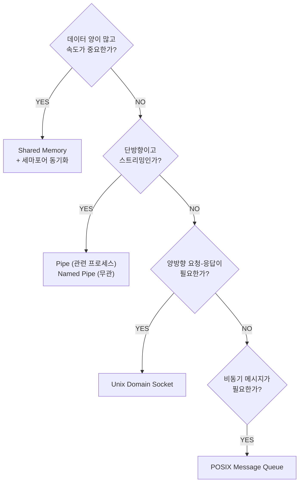

# IPC 메커니즘

IPC(Inter-Process Communication)는 프로세스 간 데이터를
주고받거나 실행을 동기화하는 메커니즘이다.
메커니즘 선택은 성능, 동기화 요구, 프로세스 관계에 따라 달라진다.

---

## 메커니즘 비교 한눈에

| 메커니즘 | 방향 | 속도 | 동기화 | 범위 | 적합한 용도 |
|---------|------|------|--------|------|-----------|
| Signal | 단방향 | 빠름 | 없음 | 어디서나 | 이벤트 통지 |
| Pipe (익명) | 단방향 | 중간 | 자동 | 부모-자식 | 명령어 체인 |
| Named pipe (FIFO) | 단방향 | 중간 | 자동 | 무관한 프로세스 | 로그 스트리밍 |
| Unix Socket | 양방향 | 빠름 | 수동 | 무관한 프로세스 | 데몬 통신 |
| Shared Memory | 양방향 | **가장 빠름** | 수동 필수 | 무관한 프로세스 | 고속 데이터 교환 |
| Message Queue | 단방향 | 중간 | 자동 | 무관한 프로세스 | 비동기 작업 큐 |
| Semaphore | 없음 | — | — | 무관한 프로세스 | 동기화만 담당 |

---

## 1. Signal (이벤트 통지)

가장 가벼운 IPC. 데이터가 아닌 이벤트 번호를 전달한다.
시그널 핸들러는 **async-signal-safe 함수만** 호출 가능하다.

```bash
kill -HUP <PID>     # 설정 리로드 관례
kill -USR1 <PID>    # 앱 정의 이벤트

# sigqueue: 정수 값 첨부 전송 (POSIX)
# kill은 값 전달 불가, sigqueue는 가능
```

> Signal은 데이터 전달 용도가 아닌 "상태 변경 통보" 전용.
> 상세 내용은 [프로세스 관리와 시그널](process-management.md) 참조.

---

## 2. Pipe (익명 파이프)

부모-자식 프로세스 간 단방향 데이터 스트림.
`fork()` 이전에 생성한 fd를 상속해 사용한다.


```c
int fd[2];
pipe(fd);         // fd[0]=읽기, fd[1]=쓰기

if (fork() == 0) {
    close(fd[1]);               // 자식: 쓰기 닫기
    read(fd[0], buf, sizeof(buf));
} else {
    close(fd[0]);               // 부모: 읽기 닫기
    write(fd[1], "hello", 5);
}
```

```bash
# 셸에서의 파이프
ls -la | grep ".md" | wc -l

# 개별 파이프 버퍼 기본값: 65536 bytes (Linux 2.6.11+)
# fcntl로 개별 파이프 크기 조회/변경
python3 -c "import fcntl, os; fd=os.pipe(); \
  print(fcntl.fcntl(fd[0], 1032))"   # F_GETPIPE_SZ=1032

# pipe-max-size: 비특권 프로세스가 F_SETPIPE_SZ로 늘릴 수 있는 상한
# (개별 파이프 기본값이 아님, 기본 1MB)
cat /proc/sys/fs/pipe-max-size

# 사용자별 파이프 페이지 총합 한도 (DoS 방지)
cat /proc/sys/fs/pipe-user-pages-soft   # 소프트 한도
cat /proc/sys/fs/pipe-user-pages-hard   # 하드 한도
```

> 쓰기 쪽이 닫히지 않으면 읽기 쪽은 EOF를 받지 못해
> 영원히 블록된다. 미사용 fd는 반드시 닫을 것.

---

## 3. Named Pipe (FIFO)

파일 시스템에 이름이 있는 파이프.
무관한 프로세스끼리도 통신 가능하다.

```bash
# FIFO 생성
mkfifo /tmp/mypipe

# 프로세스 A: 쓰기
echo "data" > /tmp/mypipe

# 프로세스 B: 읽기 (A가 쓸 때까지 블록)
cat /tmp/mypipe

# 정리
rm /tmp/mypipe
```

---

## 4. Unix Domain Socket

동일 호스트 내 프로세스 간 양방향 소켓.
TCP 소켓과 API가 동일하지만 네트워크 스택을 거치지 않아 빠르다.

```bash
# 프로덕션에서 흔히 보는 Unix socket
ls -la /var/run/
# docker.sock, postgresql.sock, mysql.sock ...

# socat으로 Unix socket 테스트
socat - UNIX-CONNECT:/var/run/myapp.sock
```

```python
import socket, os

SOCK_PATH = "/tmp/myapp.sock"

# 서버: 재시작 시 기존 소켓 파일 제거 필수
if os.path.exists(SOCK_PATH):
    os.unlink(SOCK_PATH)    # 없으면 Address already in use!

server = socket.socket(socket.AF_UNIX, socket.SOCK_STREAM)
server.bind(SOCK_PATH)
server.listen(1)
conn, _ = server.accept()
data = conn.recv(1024)

# 클라이언트
client = socket.socket(socket.AF_UNIX, socket.SOCK_STREAM)
client.connect(SOCK_PATH)
client.send(b"hello")
```

### TCP vs Unix Socket 성능

| 지표 | TCP (loopback) | Unix Socket |
|------|---------------|------------|
| 레이턴시 | ~수십 µs | ~수 µs |
| 처리량 | 높음 | 더 높음 |
| 네트워크 스택 | 거침 | 건너뜀 |

> Docker API, PostgreSQL, MySQL, Redis 등 대부분의
> 로컬 서비스가 Unix socket을 기본으로 제공한다.

---

## 5. Shared Memory

같은 물리 메모리를 여러 프로세스의 가상 주소 공간에 매핑.
**데이터 복사가 없어 IPC 중 가장 빠르다.**

### POSIX Shared Memory (현대, 권장)

```c
// 생성/열기
int fd = shm_open("/myshm", O_CREAT | O_RDWR, 0600);
ftruncate(fd, 4096);

// 매핑
void *ptr = mmap(NULL, 4096,
                 PROT_READ | PROT_WRITE,
                 MAP_SHARED, fd, 0);

// 사용 — 반드시 세마포어/뮤텍스로 보호해야 함
// 동기화 없이 사용하면 torn read, ABA 문제,
// 비결정적 크래시 발생 가능
memcpy(ptr, data, size);

// 정리
munmap(ptr, 4096);
close(fd);
shm_unlink("/myshm");  // /dev/shm/myshm 파일 삭제
```

```bash
# POSIX shm은 /dev/shm에 파일로 표현됨
ls -la /dev/shm/

# 시스템 전체 shared memory 한도
cat /proc/sys/kernel/shmmax    # 단일 세그먼트 최대 크기
cat /proc/sys/kernel/shmall    # 전체 사용 가능 페이지
```

### memfd_create (익명 공유 메모리, Linux 3.17+)

파일시스템에 흔적을 남기지 않는 익명 메모리 파일.
fd를 소켓으로 전달(SCM_RIGHTS)해 프로세스 간 공유한다.

```c
int fd = memfd_create("mydata", MFD_CLOEXEC);
ftruncate(fd, 4096);
void *ptr = mmap(NULL, 4096, PROT_READ|PROT_WRITE,
                 MAP_SHARED, fd, 0);
// fd를 Unix socket으로 다른 프로세스에 전달
```

> 컨테이너 간 데이터 공유, seccomp 필터 전달,
> Wayland 프로토콜이 memfd_create를 활용한다.

### SysV Shared Memory (레거시)

```bash
# 현재 SysV IPC 상태 확인
ipcs -m    # shared memory
ipcs -s    # semaphores
ipcs -q    # message queues
ipcs -a    # 전체

# 남겨진 SysV shm 정리 (프로세스 종료 후 잔재)
ipcrm -m <shmid>
```

---

## 6. 동기화: 세마포어와 뮤텍스

공유 자원에 대한 동시 접근을 제어한다.

### POSIX Semaphore

```c
// 이름 있는 세마포어 (프로세스 간)
sem_t *sem = sem_open("/mysem", O_CREAT, 0600, 1);
sem_wait(sem);    // P연산: 감소, 0이면 블록
// 임계 구역
sem_post(sem);    // V연산: 증가
sem_close(sem);
sem_unlink("/mysem");

// 이름 없는 세마포어 (스레드 간 또는 shared memory에)
sem_t sem;
sem_init(&sem, 1, 1);  // pshared=1: 프로세스 간 공유
```

### futex (Fast Userspace Mutex)

뮤텍스, 조건변수의 커널 기반.
경쟁 없을 때 syscall 없이 유저스페이스에서 처리.
`pthread_mutex_lock`이 내부적으로 futex를 사용한다.

```bash
# futex 경쟁 확인 (과도한 futex 대기 = 락 경합)
strace -e futex -p <PID>
perf stat -e futex:futex_wait -p <PID>
```

---

## 7. Message Queue (메시지 큐)

비동기적으로 메시지를 주고받는다.
메시지에 우선순위를 부여할 수 있다.

### POSIX Message Queue

```c
// 생성/열기
mqd_t mq = mq_open("/myqueue", O_CREAT | O_RDWR,
                   0600, &attr);

// 전송 (우선순위 포함)
mq_send(mq, "message", strlen("message"), 0);

// 수신
char buf[256];
mq_receive(mq, buf, 256, &priority);

// 정리
mq_close(mq);
mq_unlink("/myqueue");
```

```bash
# POSIX MQ는 /dev/mqueue에 마운트
ls /dev/mqueue/
cat /proc/sys/fs/mqueue/msg_max   # 큐당 최대 메시지 수
```

---

## IPC namespace와의 관계

SysV IPC, POSIX MQ는 IPC namespace로 격리된다.
컨테이너 내 IPC 리소스가 호스트나 다른 컨테이너에
노출되지 않는다.

```bash
# 컨테이너 내부의 IPC 목록 (호스트와 격리됨)
nsenter -t <container-PID> --ipc ipcs -a
```

> **`--ipc=host` 금지 (CIS Docker Benchmark HIGH 위험)**:
> 호스트 전체 SysV IPC 공간이 노출된다.
> PostgreSQL, MySQL 등의 공유 메모리 세그먼트까지
> 컨테이너에서 읽고 쓸 수 있게 된다.
> 컨테이너 간 IPC 공유가 필요하면
> `--ipc=container:<name>` 옵션을 사용할 것.

---

## 메커니즘 선택 가이드



---

## 참고 자료

- [sysvipc(7) - Linux manual page](https://man7.org/linux/man-pages/man7/sysvipc.7.html)
  — 확인: 2026-04-17
- [mq_overview(7) - POSIX Message Queues](https://man7.org/linux/man-pages/man7/mq_overview.7.html)
  — 확인: 2026-04-17
- [shm_open(3) - POSIX Shared Memory](https://man7.org/linux/man-pages/man3/shm_open.3.html)
  — 확인: 2026-04-17
- [memfd_create(2) - Linux manual page](https://man7.org/linux/man-pages/man2/memfd_create.2.html)
  — 확인: 2026-04-17
