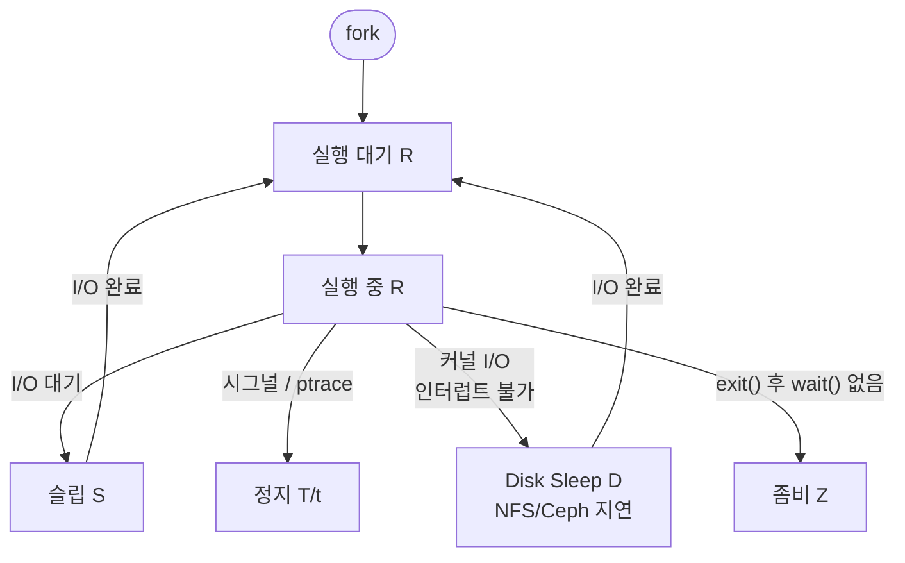
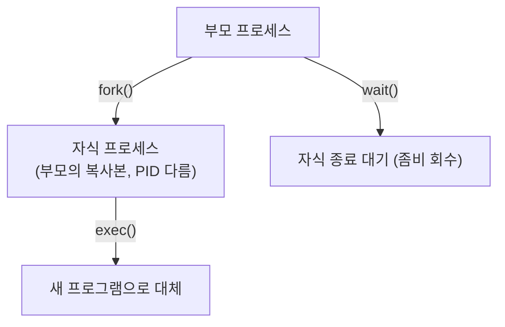
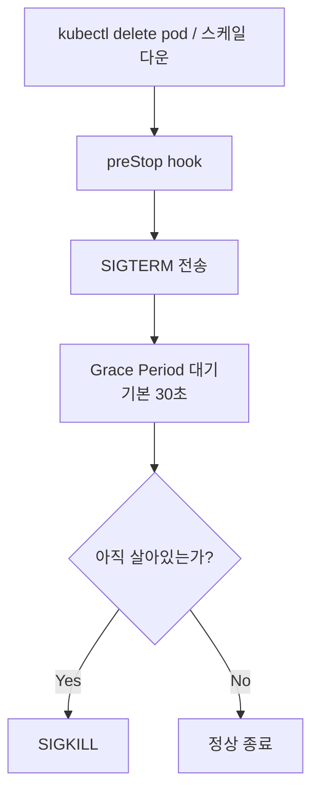

# 프로세스 관리와 시그널

Linux에서 프로세스는 실행 중인 프로그램의 인스턴스다.
커널은 각 프로세스에 고유한 PID를 부여하고,
스케줄러로 CPU 시간을 나눠 준다.

---

## 프로세스 상태 (Process States)



| 상태 코드 | 이름 | 설명 |
|----------|------|------|
| `R` | Running/Runnable | CPU 실행 중 또는 런큐 대기 |
| `S` | Sleeping | 인터럽트 가능 슬립 (I/O 대기 등) |
| `D` | Disk Sleep | **인터럽트 불가** 슬립 (NFS/블록 I/O 대기) |
| `T` | Stopped | SIGSTOP/SIGTSTP으로 정지 |
| `t` | Traced | ptrace 디버거에 의해 정지 |
| `Z` | Zombie | 종료됐지만 부모가 wait() 미호출 |
| `I` | Idle | 유휴 커널 스레드 (Linux 4.14+) |
| `X` | Dead | 프로세스 소멸 직전 (극히 짧아 거의 안 보임) |

> `D` 상태 프로세스는 `kill -9`로도 종료 불가.
> NFS 서버 장애, Ceph I/O 지연 시 대량 발생하면
> 시스템 전체가 응답 불능 상태에 빠질 수 있다.

---

## 프로세스 생성: fork-exec 모델



```c
pid_t pid = fork();
if (pid == 0) {
    // 자식: 새 프로그램 실행
    execvp("ls", args);
} else {
    // 부모: 자식 종료 대기
    waitpid(pid, &status, 0);
}
```

### Copy-on-Write (CoW)

`fork()` 시 메모리를 즉시 복사하지 않는다.
페이지 쓰기가 발생할 때만 실제 복사(CoW).
Redis, Nginx 같은 서버들이 이 방식으로 worker를 생성한다.

---

## 시그널 (Signals)

시그널은 프로세스 간 비동기 통신 메커니즘이다.
커널, 터미널, 다른 프로세스가 보낼 수 있다.

### 주요 시그널 표

> 아래 번호는 **Linux x86/x86_64 기준**이다.
> Alpha, MIPS, SPARC 등 일부 아키텍처에서는 번호가 다르다.
> 이식성이 필요한 코드에서는 번호 대신 시그널 이름을 사용할 것.

| 번호 | 이름 | 기본 동작 | 용도 |
|------|------|----------|------|
| 1 | `SIGHUP` | 종료 | 데몬 설정 리로드 관례 신호 |
| 2 | `SIGINT` | 종료 | Ctrl+C |
| 3 | `SIGQUIT` | 코어 덤프 | Ctrl+\ |
| 9 | `SIGKILL` | **강제 종료** | 캐치 불가, 블록 불가 |
| 11 | `SIGSEGV` | 코어 덤프 | 잘못된 메모리 접근 |
| 15 | `SIGTERM` | 종료 | 기본 `kill` 시그널 (그레이스풀) |
| 17 | `SIGCHLD` | 무시 | 자식 프로세스 종료 알림 |
| 18 | `SIGCONT` | 재개 | 정지된 프로세스 재개 |
| 19 | `SIGSTOP` | **정지** | 캐치 불가, 블록 불가 |
| 20 | `SIGTSTP` | 정지 | Ctrl+Z (캐치 가능) |

### SIGTERM vs SIGKILL

| 항목 | SIGTERM (15) | SIGKILL (9) |
|------|-------------|-------------|
| 캐치·블록 | 가능 | 불가 |
| 정리 작업 | 프로세스가 직접 수행 | 없음 |
| 종료 방식 | 그레이스풀 셧다운 | 커널 즉시 강제 종료 |
| 용도 | 권장 방법 | 최후 수단 |

> **실무 원칙**: 항상 SIGTERM 먼저, 반응 없으면 SIGKILL.
> `kill -9` 남발은 파일 손상, 락 파일 잔재, 데이터 손실 위험.

### SIGHUP: 재시작 없이 설정 리로드

많은 데몬이 SIGHUP을 설정 리로드 신호로 활용한다.

```bash
# nginx 설정 리로드 (재시작 없음)
kill -HUP $(cat /var/run/nginx.pid)

# systemd를 통한 리로드
systemctl reload nginx
```

---

## 시그널 핸들링

SIGKILL/SIGSTOP을 제외한 시그널은
캐치하거나 무시하거나 기본 동작으로 처리할 수 있다.

```python
import signal
import sys

def graceful_shutdown(signum, frame):
    print("SIGTERM received, cleaning up...")
    # DB 연결 닫기, 파일 플러시 등
    sys.exit(0)

signal.signal(signal.SIGTERM, graceful_shutdown)
signal.signal(signal.SIGINT, graceful_shutdown)
```

### 컨테이너 환경의 PID 1 문제

컨테이너에서 앱이 PID 1로 실행되면 시그널 핸들링이
기본값과 다르게 동작한다.

| 시그널 | 일반 프로세스 | PID 1 (컨테이너 내) |
|--------|-------------|-------------------|
| SIGTERM | 종료 | 무시 (핸들러 없으면) |
| SIGCHLD | 처리 | 좀비 누적 (wait() 미호출) |

**왜 PID 1은 SIGTERM을 무시하는가?**

커널은 PID 1에 `SIGNAL_UNKILLABLE` 플래그를 설정한다.
핸들러를 명시적으로 등록하지 않은 시그널은
커널이 PID 1에 대한 전달 자체를 차단한다.
일반 프로세스는 "핸들러 없음 → 기본 동작(종료)" 이지만,
PID 1은 "핸들러 없음 → 전달 차단 → 아무 일도 없음"이다.

이 차이를 모르면 `docker stop`이 10초 후 강제 종료되는
현상을 디버깅할 때 원인을 잘못 판단한다.

**해결책**: `tini` 또는 `dumb-init` 사용

```dockerfile
FROM ubuntu:24.04
RUN apt-get install -y tini
ENTRYPOINT ["/usr/bin/tini", "--"]
CMD ["/app/myapp"]
```

### Kubernetes에서의 그레이스풀 셧다운

Kubernetes가 파드를 종료할 때의 시그널 흐름:



**endpoint 전파 지연 문제**: SIGTERM이 전달될 때
kube-proxy/Cilium이 아직 이 파드의 endpoint를
서비스에서 제거 중일 수 있다. 이 사이에 요청이
들어오면 연결 오류가 발생한다.
`preStop`에 짧은 sleep을 넣는 이유가 여기 있다.

```yaml
lifecycle:
  preStop:
    exec:
      command: ["/bin/sleep", "5"]   # endpoint 전파 대기
```

---

## 좀비와 고아 프로세스

### 좀비 프로세스 (Zombie)

| 단계 | 설명 |
|------|------|
| ① 자식 `exit()` 호출 | 프로세스 종료 요청 |
| ② 프로세스 테이블 엔트리 유지 | 종료 코드 보존 — 부모의 `wait()` 호출 대기 |
| ③-A 부모 `wait()` 호출 | 정상 정리, 엔트리 해제 |
| ③-B 부모 `wait()` 없음 | **좀비 상태** 유지 — PID 슬롯 점유로 PID 고갈 위험 |

```bash
# 좀비 프로세스 확인
ps aux | awk '$8=="Z"'

# 좀비의 부모 확인 후 SIGCHLD 전송
ps -eo pid,ppid,stat,comm | awk '$3~/^Z/ {print $2}' \
  | sort -u | xargs -I{} kill -CHLD {}
```

**제거 방법**: 부모 프로세스에게 SIGCHLD 보내거나,
부모를 종료(init/systemd가 좀비를 자동 회수).

### 고아 프로세스 (Orphan)

부모가 먼저 종료된 자식 프로세스.
`init` (PID 1) 또는 `systemd`가 자동으로 입양한다.

---

## 프로세스 모니터링 명령어

### ps — 스냅샷

```bash
# 전체 프로세스 (BSD 스타일)
ps aux

# 전체 프로세스 (SysV 스타일)
ps -ef

# 특정 프로세스 상세
ps -fp $(pgrep nginx)

# CPU/메모리 상위 10개
ps aux --sort=-%cpu | head -11
ps aux --sort=-%mem | head -11

# 프로세스 트리
ps auxf
pstree -p
```

### top / htop — 실시간

```bash
# top 주요 단축키
# k : 프로세스 kill
# r : nice 값 변경
# 1 : CPU 코어별 표시
# M : 메모리 순 정렬
# P : CPU 순 정렬
top

# htop (더 직관적)
apt install htop    # Debian/Ubuntu
dnf install htop    # RHEL/Fedora
htop
```

### kill / pkill / pgrep

```bash
# PID로 시그널 전송
kill -15 <PID>           # SIGTERM (기본)
kill -9 <PID>            # SIGKILL
kill -HUP <PID>          # SIGHUP

# 프로세스 이름으로 검색
pgrep nginx              # PID 목록
pgrep -a nginx           # PID + 명령어

# 프로세스 이름으로 시그널 전송
# 주의: pkill은 부분 문자열 매칭 → "nginx-exporter"도 포함됨
pkill -x nginx           # 정확한 이름 매칭 (-x 권장)
pkill -F /var/run/nginx.pid  # PID 파일 기반 (더 안전)
pkill -HUP -x nginx      # SIGHUP (설정 리로드)

# 전체 프로세스 그룹에 시그널
kill -TERM -<PGID>       # 음수 PID = 프로세스 그룹
```

### /proc 파일시스템

커널이 제공하는 가상 파일시스템.
`ps`, `top`, `htop` 모두 여기서 데이터를 읽는다.

```bash
cat /proc/<PID>/status    # 상태, 메모리, UID 등
cat /proc/<PID>/cmdline   # 실행 명령어 (null 구분)
ls -la /proc/<PID>/fd     # 열린 파일 디스크립터
cat /proc/<PID>/maps      # 메모리 맵

# 열린 파일 수 확인
ls /proc/$(pgrep -o nginx)/fd | wc -l
```

> **보안 주의**: `/proc/<PID>/environ`은 환경변수 전체를
> 평문으로 노출한다. 같은 UID를 가진 모든 프로세스가
> 읽을 수 있으며(root는 전체 가능), 컨테이너 탈출 공격
> 시 첫 번째 정보 수집 경로다.
> **환경변수에 시크릿을 넣지 말 것** — 파일 마운트나
> Vault/Secret 주입 방식을 사용할 것.

---

## 프로세스 우선순위: nice / renice

nice 범위는 **-20**(최고 우선순위)에서 **+19**(최저 우선순위),
기본값은 **0**이다.

```bash
# 낮은 우선순위로 실행 (백그라운드 배치 작업)
nice -n 10 tar -czf backup.tar.gz /data

# 실행 중인 프로세스 우선순위 변경
renice -n 5 -p <PID>
renice -n -5 -p <PID>    # root만 음수 가능
```

---

## 실무 패턴

### 그레이스풀 셧다운 대기 스크립트

```bash
#!/bin/bash
# SIGTERM 후 30초 내 종료 안 되면 SIGKILL
# 주의: kill -0은 PID 재활용 레이스 컨디션 가능성 있음.
#       프로세스 이름 검증을 함께 사용할 것.
PID=$1
EXPECTED_COMM=$2   # 예: "nginx"

if [[ -z "$PID" || -z "$EXPECTED_COMM" ]]; then
    echo "Usage: $0 <PID> <process_name>" >&2
    exit 1
fi

kill -TERM "$PID"
for i in $(seq 1 30); do
    sleep 1
    # PID 존재 + 프로세스 이름 일치 확인 (재활용 방지)
    COMM=$(cat /proc/"$PID"/comm 2>/dev/null)
    [[ "$COMM" == "$EXPECTED_COMM" ]] || exit 0
done
echo "강제 종료: $PID ($EXPECTED_COMM)"
kill -KILL "$PID"
```

### 프로세스 존재 여부 확인

```bash
if kill -0 "$PID" 2>/dev/null; then
    echo "프로세스 실행 중"
else
    echo "프로세스 없음"
fi
```

### 좀비 모니터링 (알림 연동)

```bash
ZOMBIES=$(ps aux | awk '$8=="Z"' | wc -l)
if [ "$ZOMBIES" -gt 10 ]; then
    echo "ALERT: 좀비 프로세스 ${ZOMBIES}개 감지"
fi
```

---

## 참고 자료

- [signal(7) - Linux manual page](https://man7.org/linux/man-pages/man7/signal.7.html)
  — 확인: 2026-04-17
- [proc(5) - Linux manual page](https://man7.org/linux/man-pages/man5/proc.5.html)
  — 확인: 2026-04-17
- [tini - A tiny but valid init for containers](https://github.com/krallin/tini)
  — 확인: 2026-04-17
- [SIGKILL vs SIGTERM - SUSE Communities](https://www.suse.com/c/observability-sigkill-vs-sigterm-a-developers-guide-to-process-termination/)
  — 확인: 2026-04-17
