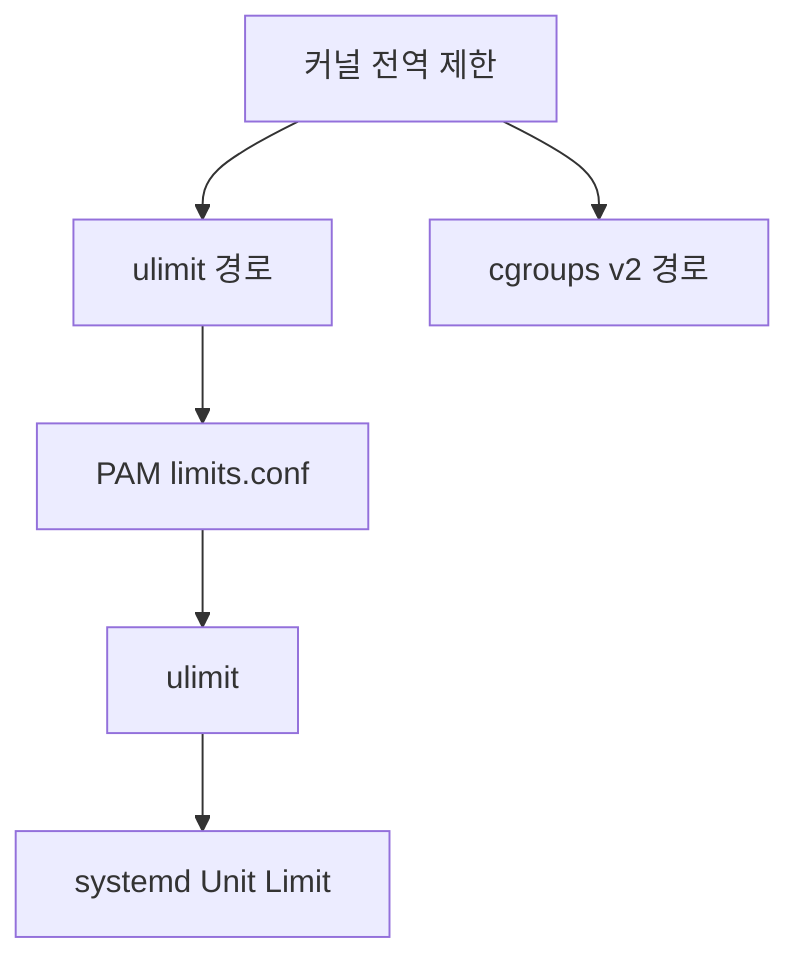

# 리소스 제한 (ulimit, PAM limits, systemd)

리소스 제한은 단일 프로세스가 시스템 자원을 독점해
전체 서비스를 중단시키는 것을 막는 안전망이다.
프로덕션에서 파일 디스크립터 고갈, OOM, 프로세스 폭발은
리소스 제한 미설정이 원인인 경우가 많다.

---

## 제한 계층 구조

두 가지 독립적 메커니즘이 병렬로 동작한다.



| 노드 | 부연 |
|------|------|
| 커널 전역 제한 | `sysctl` 로 설정 |
| PAM limits.conf | 로그인 세션 경로 |
| systemd Unit Limit | PAM 독립 경로 |

> `limits.conf`는 **PAM 로그인 세션**을 통해 적용된다.
> systemd 서비스는 PAM 세션을 거치지 않으므로
> `limits.conf` 설정이 서비스 프로세스에 **전혀 적용되지 않는다.**
> 반드시 systemd unit에 별도로 설정해야 한다.

---

## Soft vs Hard 제한

| 구분 | 설명 | 변경 권한 |
|------|------|----------|
| **Soft** | 현재 적용되는 제한. 프로세스가 hard까지 스스로 올릴 수 있음 | 일반 사용자 |
| **Hard** | soft의 최댓값. 낮출 수만 있고 올리려면 root 필요 | root만 |

```bash
ulimit -Sn    # soft nofile 확인
ulimit -Hn    # hard nofile 확인
ulimit -a     # 전체 soft 제한 목록
ulimit -Ha    # 전체 hard 제한 목록
```

---

## ulimit 주요 옵션

| 옵션 | 리소스 | 기본값 | 설명 |
|------|--------|--------|------|
| `-n` | nofile | 1024 | 열린 파일 디스크립터 수 |
| `-u` | nproc | 사용자별 다름 | 최대 프로세스 수 |
| `-v` | vmem | unlimited | 가상 메모리 크기 |
| `-s` | stack | 8192 KB | 스택 크기 |
| `-c` | core | 0 | 코어 덤프 파일 크기 |
| `-t` | cpu | unlimited | CPU 시간 (초) |
| `-f` | fsize | unlimited | 생성 파일 최대 크기 |
| `-m` | rss | — | **Linux에서 무효** (커널 2.4.30+ 미집행) |

> `-m` (RLIMIT_RSS): `getrlimit(2)` man page가 "this resource
> limit has no effect on Linux"라고 명시한다.
> 메모리 제한이 필요하면 systemd `MemoryMax`(cgroups v2)를
> 사용해야 한다.

```bash
# 현재 세션에서 임시 변경
ulimit -n 65536

# 확인
ulimit -n
```

> `ulimit` 설정은 **현재 셸 세션에만** 적용된다.
> 영구 적용은 `/etc/security/limits.conf` 또는
> systemd unit을 사용해야 한다.

---

## /etc/security/limits.conf (PAM limits)

로그인 세션에 적용되는 영구 설정.
`pam_limits.so` 모듈이 로그인 시 읽어 적용한다.

### 형식

```
<domain> <type> <item> <value>
```

| 필드 | 설명 |
|------|------|
| domain | 사용자명, 그룹명(`@group`), `*`(전체), `%`(로그인 그룹) |
| type | `soft`, `hard`, `-`(soft+hard 동시) |
| item | nofile, nproc, memlock 등 |
| value | 숫자 또는 `unlimited` |

### 예시

```ini
# /etc/security/limits.conf

# Elasticsearch: 파일 디스크립터 + 메모리 잠금
elasticsearch  soft  nofile   65536
elasticsearch  hard  nofile   131072
elasticsearch  soft  memlock  unlimited
elasticsearch  hard  memlock  unlimited

# nginx: 파일 디스크립터
www-data  -  nofile  65536

# 전체 사용자: 코어 덤프 허용 (디버깅용, 프로덕션 주의)
*  soft  core  0
*  hard  core  unlimited

# 특정 그룹 프로세스 제한
@developers  hard  nproc  200
```

### /etc/security/limits.d/ (드롭인 디렉토리)

```bash
# 패키지 설치 시 자동 배포되는 개별 설정 파일
ls /etc/security/limits.d/

# 서비스별 파일로 관리 (권장)
cat > /etc/security/limits.d/99-myapp.conf << 'EOF'
myapp  soft  nofile  65536
myapp  hard  nofile  131072
EOF
```

---

## systemd Unit 리소스 제한

`limits.conf`는 PAM 로그인 세션에만 적용된다.
**systemd 서비스는 별도로 설정해야 한다.**

```ini
# /etc/systemd/system/myapp.service
[Service]
# ulimit 계열 제한 (프로세스 단위)
LimitNOFILE=65536          # 파일 디스크립터
# LimitNOFILE=infinity 는 안티패턴 —
# 컨테이너가 상속 시 Go 런타임 등이 FD 테이블을
# 순회해 수십 초 지연 발생. 명시적 정수값 권장.
LimitMEMLOCK=infinity      # 메모리 잠금 (Elasticsearch 등)
LimitCORE=infinity         # 코어 덤프 활성화

# cgroups v2 기반 제한 (서비스 전체 적용, 더 강력)
MemoryMax=4G               # 절대 상한. 초과 시 OOM kill
MemoryHigh=3G              # 이 이상이면 throttle (소프트 제한)
MemorySwapMax=0            # swap 금지 (레이턴시 민감 서비스)
MemoryMin=512M             # OOM killer로부터 보호받을 최솟값
CPUQuota=200%              # 최대 CPU (2코어 = 200%)
TasksMax=512               # 최대 태스크 (LimitNPROC 대신 권장)
```

### ulimit vs cgroups v2 비교

| 방식 | 적용 범위 | 동적 변경 | 권장 여부 |
|------|----------|----------|---------|
| `LimitNOFILE` | 프로세스 단위 | 재시작 필요 | nofile은 이걸로 |
| `TasksMax` | cgroup 전체 | 동적 가능 | nproc 대신 권장 |
| `MemoryMax` | cgroup 전체 | 동적 가능 | 메모리 제한 권장 |

```bash
# 서비스 적용
systemctl daemon-reload
systemctl restart myapp

# 실제 적용된 제한 확인
cat /proc/$(systemctl show -p MainPID --value myapp)/limits
```

---

## 커널 전역 제한 (sysctl)

per-user/per-process 제한보다 상위에 있는 시스템 전역 값.

```bash
# 시스템 전체 FD 한도
sysctl fs.file-max
cat /proc/sys/fs/file-max

# 단일 프로세스 nofile 절대 상한 (LimitNOFILE보다 우선)
# LimitNOFILE=infinity 설정해도 fs.nr_open이 상한
sysctl fs.nr_open

# 현재 사용량 (열린FD / 미사용 / 최댓값)
cat /proc/sys/fs/file-nr

# 최대 inotify watch 수 (inotify 기반 앱에 중요)
sysctl fs.inotify.max_user_watches

# 영구 적용
cat >> /etc/sysctl.d/99-limits.conf << 'EOF'
fs.file-max = 2097152
fs.nr_open = 1048576
EOF
sysctl -p /etc/sysctl.d/99-limits.conf
```

---

## 프로덕션 권장값

### 고연결 서버 (nginx, HAProxy)

```ini
# /etc/security/limits.d/99-nginx.conf
www-data  soft  nofile  65536
www-data  hard  nofile  131072
```

```ini
# /etc/systemd/system/nginx.service.d/limits.conf
[Service]
LimitNOFILE=131072
```

```bash
# 커널 전역
fs.file-max = 2097152
net.core.somaxconn = 65535
```

### 데이터베이스 (Elasticsearch, Kafka)

```ini
# Elasticsearch 8.x 공식 권장
# soft < hard 로 여유를 두어 필요 시 상향 가능
elasticsearch  soft  nofile    65536
elasticsearch  hard  nofile    131072
elasticsearch  soft  memlock   unlimited
elasticsearch  hard  memlock   unlimited
elasticsearch  soft  nproc     4096
elasticsearch  hard  nproc     4096
```

```bash
# vm.max_map_count (Elasticsearch 필수)
sysctl vm.max_map_count=262144
```

---

## 설정 적용 확인

```bash
# 특정 프로세스의 실제 제한 확인 (가장 정확)
cat /proc/<PID>/limits

# 현재 사용 중인 파일 디스크립터 수
ls /proc/<PID>/fd | wc -l

# 시스템 전체 FD 사용 현황
cat /proc/sys/fs/file-nr
# 출력: 사용중 미사용 최대

# prlimit로 실행 중인 프로세스 제한 확인/변경
prlimit --pid <PID>
# hard limit 상향은 CAP_SYS_RESOURCE 필요
# 변경은 임시 적용(프로세스 종료 시 소멸)
# 이미 열린 FD에는 영향 없음 (새 FD부터 적용)
prlimit --pid <PID> --nofile=65536:131072
```

> **주의**: `ulimit -n` 출력이 아닌 `/proc/<PID>/limits`를
> 확인해야 실제 적용된 값을 알 수 있다.
> PAM 모듈 미설정, systemd 오버라이드 등으로
> 의도한 값이 조용히 무시되는 경우가 많다.

---

## 트러블슈팅

### "Too many open files" 오류

```bash
# 1. 어떤 프로세스가 가장 많은 FD를 사용하는가
lsof 2>/dev/null | awk '{print $1}' | sort | uniq -c \
  | sort -rn | head -20

# 2. 해당 프로세스의 현재 제한 확인
cat /proc/$(pgrep myapp)/limits | grep "open files"

# 3. 실시간 FD 사용량 모니터링
watch -n1 'ls /proc/$(pgrep myapp)/fd | wc -l'
```

### nproc 제한으로 fork 실패

```bash
# 현재 사용 중인 프로세스/스레드 수
cat /proc/$(pgrep myapp)/status | grep Threads

# 시스템 전체 프로세스 수
ps aux | wc -l
```

### PAM limits가 적용 안 될 때

```bash
# pam_limits.so가 설정되어 있는지 확인
grep pam_limits /etc/pam.d/sshd
grep pam_limits /etc/pam.d/login
grep pam_limits /etc/pam.d/common-session  # Debian/Ubuntu
```

---

## 참고 자료

- [limits.conf(5) - Linux manual page](https://man7.org/linux/man-pages/man5/limits.conf.5.html)
  — 확인: 2026-04-17
- [All about resource limits - Red Hat Customer Portal](https://access.redhat.com/articles/546543)
  — 확인: 2026-04-17
- [systemd.exec(5) - LimitXXX directives](https://www.freedesktop.org/software/systemd/man/systemd.exec.html)
  — 확인: 2026-04-17
- [Elasticsearch: System configuration](https://www.elastic.co/guide/en/elasticsearch/reference/current/system-config.html)
  — 확인: 2026-04-17
