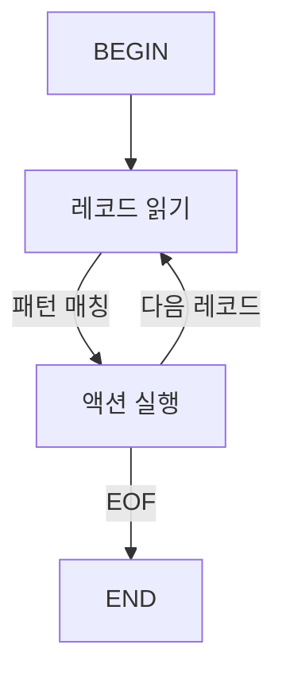

# 텍스트 처리 도구 (awk, sed, grep, cut, sort, uniq)

Unix 텍스트 처리 도구는 로그 분석, 데이터 변환, 시스템 자동화의
핵심 무기다. 파이프(`|`)로 조합하면 수백만 줄의 로그도
수 초 안에 처리할 수 있다.


---

## 1. grep 계열 비교

### 1.1 변형 비교표

| 명령어    | 정규식 엔진 | 용도                        | 주요 옵션          |
|-----------|-------------|-----------------------------|--------------------|
| `grep`    | BRE         | 기본 패턴 검색              | 범용               |
| `egrep`   | ERE         | 확장 정규식 (`+`, `?`, `|`) | `grep -E`와 동일   |
| `fgrep`   | 없음(literal)| 고정 문자열 검색 (빠름)    | `grep -F`와 동일   |
| `rg`      | Rust regex(기본) / PCRE2(`-P`) | 재귀 검색, 고속, 컬러 출력  | 기본은 lookahead 미지원; PCRE2 필요 시 `-P` 추가 |

> `egrep`/`fgrep`은 POSIX에서 deprecated. `grep -E`/`grep -F` 사용 권장.

### 1.2 정규식 엔진 차이

```
BRE (Basic)   : \( \) \{ \} 이스케이프 필요
ERE (Extended): (  )  {  }  그대로 사용, +  ?  | 지원
PCRE2         : \d \w \s 등 Perl 확장, lookahead/lookbehind 지원
```

### 1.3 핵심 옵션

```bash
# 컨텍스트 출력
grep -A 3 "ERROR" app.log   # 매칭 후 3줄
grep -B 2 "ERROR" app.log   # 매칭 전 2줄
grep -C 5 "ERROR" app.log   # 매칭 전후 5줄

# 재귀 검색
grep -r "TODO" ./src/        # 재귀 (심볼릭 링크 제외)
grep -R "TODO" ./src/        # 재귀 (심볼릭 링크 포함)

# 카운트 · 파일명
grep -c "ERROR" app.log      # 매칭 줄 수
grep -l "ERROR" *.log        # 매칭된 파일명만
grep -L "ERROR" *.log        # 매칭 없는 파일명만

# 반전 · 대소문자
grep -v "DEBUG" app.log      # 매칭하지 않는 줄
grep -i "error" app.log      # 대소문자 무시

# 단어 경계 · 줄 전체
grep -w "exit" app.log       # 단어 단위 매칭
grep -x "^exit$" app.log     # 줄 전체 매칭

# 줄 번호 · 바이너리
grep -n "ERROR" app.log      # 줄 번호 출력
grep -a "string" binary.bin  # 바이너리를 텍스트로 처리
```

### 1.4 ripgrep (rg) 주요 특징

```bash
# 기본 사용 — 재귀 검색이 기본
rg "ERROR" ./logs/

# 파일 타입 제한
rg -t py "import os"         # Python 파일만
rg -t-py "import os"         # Python 파일 제외

# 멀티라인 매칭
rg -U "func.*\n.*return" ./  # -U로 멀티라인 활성화

# 컨텍스트
rg -C 3 "FATAL" app.log

# 고정 문자열 (속도 최우선)
rg -F "192.168.1.1" access.log

# PCRE2 (lookahead 등)
rg -P "(?<=GET )/api/\w+" access.log
```

**성능 비교** (100MB 로그, 재귀 검색 기준):

| 도구        | 소요 시간 (ms) | 비고               |
|-------------|---------------|--------------------|
| `rg`        | ~80           | 병렬, mmap, SIMD   |
| `grep -r`   | ~800          | 단일 스레드        |
| `ag` (silver searcher) | ~300 | 멀티스레드       |

---

## 2. sed 핵심 사용법

`sed`는 스트림 에디터다. 파일을 열지 않고 파이프라인에서
행 단위로 편집한다.

### 2.1 기본 명령

| 명령 | 문법                  | 설명                     |
|------|-----------------------|--------------------------|
| `s`  | `s/패턴/대체/플래그`  | 치환 (substitute)        |
| `d`  | `주소d`               | 삭제 (delete)            |
| `p`  | `주소p`               | 출력 (print)             |
| `i`  | `주소i\텍스트`        | 앞에 삽입 (insert)       |
| `a`  | `주소a\텍스트`        | 뒤에 추가 (append)       |
| `c`  | `주소c\텍스트`        | 행 교체 (change)         |
| `q`  | `주소q`               | 종료 (quit)              |
| `y`  | `y/소스/대상/`        | 문자 변환 (transliterate)|

### 2.2 치환(s) 플래그

```bash
# 기본 — 각 줄의 첫 번째 매칭만 치환
sed 's/foo/bar/' file.txt

# g: 줄 내 모든 매칭 치환
sed 's/foo/bar/g' file.txt

# 2: n번째 매칭만 치환
sed 's/foo/bar/2' file.txt

# i: 대소문자 무시 (GNU sed)
sed 's/foo/bar/gi' file.txt

# p: 치환된 줄 추가 출력 (보통 -n과 함께)
sed -n 's/foo/bar/p' file.txt
```

### 2.3 주소 지정

```bash
# 행 번호
sed '3d' file.txt             # 3번 행 삭제
sed '3,7d' file.txt           # 3~7번 행 삭제
sed '3~2d' file.txt           # 3번부터 2줄마다 삭제

# 패턴 주소
sed '/^#/d' file.txt          # # 로 시작하는 행 삭제
sed '/ERROR/,/END/p' file.txt # ERROR~END 범위 출력

# 마지막 행
sed '$d' file.txt             # 마지막 행 삭제
sed -n '$p' file.txt          # 마지막 행만 출력

# 범위 + 패턴 조합
sed '10,/END/d' file.txt      # 10행부터 END까지 삭제
```

### 2.4 삽입 · 추가 · 교체

```bash
# 특정 행 앞에 삽입
sed '3i\새로운 줄' file.txt

# 패턴 매칭 행 뒤에 추가
sed '/^server/a\  listen 443;' nginx.conf

# 행 전체 교체
sed '/^#Version/c\Version=2.0' config.ini
```

### 2.5 인플레이스 편집

```bash
# -i: 파일 직접 수정 (GNU sed)
sed -i 's/old/new/g' file.txt

# -i.bak: 백업 후 수정 — GNU sed와 BSD sed(macOS)의 구문이 다르다
# GNU sed (Linux)
sed -i.bak 's/old/new/g' file.txt

# BSD sed (macOS) — suffix가 별도 인자
sed -i '.bak' 's/old/new/g' file.txt

# 크로스 플랫폼 안전 방법
cp file.txt file.txt.bak && sed -i 's/old/new/g' file.txt
```

### 2.6 멀티라인 처리

```bash
# N: 다음 행을 패턴 공간에 추가
# P: 패턴 공간의 첫 번째 행 출력
# D: 패턴 공간의 첫 번째 행 삭제

# 두 줄에 걸친 패턴 치환
sed 'N; s/foo\nbar/baz/' file.txt

# 빈 줄 연속 제거
sed '/^$/{ N; /^\n$/d }' file.txt
```

---

## 3. awk 심화

`awk`는 필드 기반 텍스트 처리 언어다. 로그 파싱과
리포트 생성에 특히 강력하다.

### 3.1 처리 흐름



### 3.2 내장 변수

| 변수  | 의미                          | 기본값 |
|-------|-------------------------------|--------|
| `NR`  | 현재 레코드(행) 번호          | -      |
| `NF`  | 현재 레코드의 필드 수         | -      |
| `FS`  | 입력 필드 구분자              | 공백   |
| `OFS` | 출력 필드 구분자              | 공백   |
| `RS`  | 입력 레코드 구분자            | `\n`   |
| `ORS` | 출력 레코드 구분자            | `\n`   |
| `FNR` | 현재 파일 내 레코드 번호      | -      |
| `FILENAME` | 현재 처리 중인 파일명    | -      |

```bash
# 기본 필드 접근
awk '{ print $1, $NF }' file.txt  # 첫 필드, 마지막 필드

# 구분자 지정
awk -F: '{ print $1 }' /etc/passwd
awk -F'[,;]' '{ print $2 }' data.csv  # 정규식 구분자

# BEGIN에서 OFS 설정
awk 'BEGIN{OFS=","} {print $1,$2,$3}' file.txt
```

### 3.3 패턴 매칭

```bash
# 패턴 (정규식)
awk '/ERROR/ { print }' app.log

# 범위 패턴
awk '/START/,/END/ { print }' file.txt

# 비교 조건
awk '$3 > 100 { print $1, $3 }' data.txt
awk 'NR >= 10 && NR <= 20' file.txt

# 부정
awk '!/DEBUG/ { print }' app.log
```

### 3.4 연관 배열 (해시맵)

```bash
# IP별 접속 횟수 집계
awk '{ count[$1]++ }
     END {
       for (ip in count)
         print count[ip], ip
     }' access.log | sort -rn

# 상태 코드별 합산
awk '{ status[$9]++ }
     END {
       for (code in status)
         printf "HTTP %s: %d\n", code, status[code]
     }' access.log
```

### 3.5 printf 포맷팅

```bash
awk 'BEGIN {
  printf "%-20s %10s %8s\n", "HOST", "BYTES", "COUNT"
  printf "%s\n", "─────────────────────────────────────"
}
{
  host[$1] += $10
  count[$1]++
}
END {
  for (h in host)
    printf "%-20s %10d %8d\n", h, host[h], count[h]
}' access.log
```

### 3.6 실전: 로그 집계

```bash
# Nginx access.log 에서 분당 요청 수 집계
# 로그 형식: 192.168.1.1 - - [17/Apr/2026:10:23:45 +0900] "GET ..."
awk '{
  # 시간 파싱: [17/Apr/2026:10:23 → "10:23"
  match($4, /([0-9]{2}:[0-9]{2})/, arr)
  minute = arr[1]
  req[minute]++
}
END {
  for (m in req)
    printf "%s\t%d\n", m, req[m]
}' /var/log/nginx/access.log | sort

# 응답 시간 상위 10개 URL
awk '{ print $NF, $7 }' access.log \
  | sort -rn \
  | head -10
```

### 3.7 실전: 특정 컬럼 합산

```bash
# CSV 3번째 컬럼(비용) 합산
awk -F, 'NR>1 { sum += $3 }
         END  { printf "Total: %.2f\n", sum }' billing.csv

# 조건부 합산: 상태가 "ERROR"인 행의 크기 합산
awk '$5 == "ERROR" { total += $6 }
    END { print "Error bytes:", total }' app.log
```

---

## 4. cut 활용

`cut`은 필드 또는 문자 위치로 컬럼을 추출한다.
단순 컬럼 추출에서는 `awk`보다 빠르다.

```bash
# -d: 구분자, -f: 필드 번호
cut -d: -f1 /etc/passwd          # 첫 번째 필드(사용자명)
cut -d: -f1,3 /etc/passwd        # 1, 3번째 필드
cut -d: -f2- /etc/passwd         # 2번째 이후 모든 필드
cut -d, -f1-3 data.csv           # CSV 앞 3개 필드

# -c: 문자 위치
cut -c1-10 file.txt              # 각 줄의 1~10번 문자
cut -c-5 file.txt                # 처음 5문자

# -b: 바이트 위치
cut -b1-4 file.txt               # 멀티바이트 주의
```

**cut vs awk 선택 기준**

| 상황                      | 권장   |
|---------------------------|--------|
| 단순 컬럼 추출            | `cut`  |
| 조건부 처리·계산          | `awk`  |
| 구분자가 복수 공백        | `awk`  |
| 빠른 대용량 처리          | `cut`  |

---

## 5. sort 심화

### 5.1 주요 옵션

| 옵션        | 의미                       |
|-------------|----------------------------|
| `-n`        | 숫자 정렬                  |
| `-r`        | 역순 정렬                  |
| `-u`        | 중복 제거 후 정렬          |
| `-k n`      | n번째 키 기준              |
| `-t 구분자` | 필드 구분자 지정           |
| `-s`        | 안정 정렬 (stable sort)    |
| `-h`        | 사람이 읽기 좋은 숫자 정렬 (1K, 2M) |
| `-V`        | 버전 번호 정렬             |
| `-f`        | 대소문자 무시              |
| `-b`        | 앞 공백 무시               |

### 5.2 -k 키 정렬 (핵심)

```bash
# 문법: -k 시작[.문자위치][,끝[.문자위치]][옵션]
sort -k2 data.txt             # 2번째 필드 기준
sort -k2,2 data.txt           # 2번째 필드만 기준 (정확)
sort -k2n data.txt            # 2번째 필드 숫자 정렬

# 복합 키: 1번 필드 문자열, 같으면 3번 필드 숫자 역순
sort -k1,1 -k3,3rn data.txt

# 특정 문자 위치부터 정렬
sort -k2.3 data.txt           # 2번째 필드의 3번째 문자부터
```

### 5.3 실전 예제

```bash
# CSV 2번째 컬럼 기준 숫자 역순 정렬
sort -t, -k2,2rn data.csv

# 파일 크기 기준 정렬 (du -sh 출력)
du -sh /var/log/* | sort -h

# IP 주소 정렬 (버전 정렬 활용)
sort -V ip_list.txt

# /etc/passwd 를 UID(3번째 필드) 기준 정렬
sort -t: -k3,3n /etc/passwd

# 안정 정렬 — 동일 키 행의 원래 순서 유지
sort -s -k1,1 data.txt
```

---

## 6. uniq

`uniq`는 **연속된** 중복 줄을 처리한다.
반드시 `sort` 후 사용하거나 이미 정렬된 데이터에 사용한다.

### 6.1 주요 옵션

| 옵션 | 의미                               |
|------|------------------------------------|
| `-c` | 반복 횟수를 앞에 출력              |
| `-d` | 중복된 줄만 출력                   |
| `-u` | 단 한 번만 나타난 줄만 출력        |
| `-i` | 대소문자 무시                      |
| `-f n` | 앞 n개 필드 무시 후 비교         |
| `-s n` | 앞 n개 문자 무시 후 비교         |

```bash
# 중복 제거 (정렬 필수)
sort file.txt | uniq

# 빈도 집계 (내림차순)
sort file.txt | uniq -c | sort -rn

# 중복된 줄만 출력
sort file.txt | uniq -d

# 유일한 줄만 출력
sort file.txt | uniq -u

# 상위 10개 빈도 항목
sort access.log | uniq -c | sort -rn | head -10
```

---

## 7. 파이프 조합 실전 예제

### 7.1 로그 분석 파이프라인

```bash
# Nginx access.log — HTTP 상태 코드별 집계
awk '{print $9}' /var/log/nginx/access.log \
  | sort \
  | uniq -c \
  | sort -rn
# 출력 예시:
# 125043 200
#   3201 304
#    892 404
#     12 500

# 에러 로그 — 최근 1시간 내 ERROR 빈도 TOP 10
grep "ERROR" app.log \
  | awk '{print $5}' \
  | sort \
  | uniq -c \
  | sort -rn \
  | head -10

# 응답시간 99 퍼센타일 추정
awk '{print $NF}' access.log \
  | sort -n \
  | awk 'BEGIN{c=0} {a[c++]=$1}
         END{print a[int(c*0.99)], "ms (p99)"}'
```

### 7.2 CSV 처리 파이프라인

```bash
# 헤더 제외, 3번째 컬럼 합산
tail -n +2 data.csv \
  | cut -d, -f3 \
  | awk '{sum+=$1} END{print "합계:", sum}'

# 특정 컬럼으로 그룹화 후 집계
awk -F, 'NR>1 {
  group[$2] += $3
  count[$2]++
}
END {
  printf "%-15s %10s %8s\n", "GROUP", "TOTAL", "COUNT"
  for (g in group)
    printf "%-15s %10.2f %8d\n", g, group[g], count[g]
}' data.csv | sort -k2,2rn

# 컬럼 순서 변경 (4, 1, 3번 컬럼만)
awk -F, 'BEGIN{OFS=","} {print $4,$1,$3}' data.csv
```

### 7.3 IP 접속 빈도 분석

```bash
# 접속 IP 상위 20개
awk '{print $1}' /var/log/nginx/access.log \
  | sort \
  | uniq -c \
  | sort -rn \
  | head -20

# 분당 요청이 1000 초과인 IP 탐지 (DDoS 감지)
# ⚠ 배열의 배열(arr[k1][k2])은 gawk 4.0+ 전용.
#   POSIX awk, mawk(Ubuntu 기본)에서는 파싱 오류 또는 예상치 못한 동작 발생.
#   아래는 POSIX 호환 SUBSEP 방식으로 작성한다.
awk '{print $1, $4}' access.log \
  | sed 's/\[//; s/:[0-9]*$//' \
  | awk '{
      key = $1 SUBSEP $2
      count[key]++
    }
    END{
      for (k in count) {
        split(k, parts, SUBSEP)
        if (count[k] > 1000)
          printf "ALERT: %s %s %d req/min\n",
            parts[1], parts[2], count[k]
      }
    }'

# 특정 경로 접근 IP 목록 추출
grep "POST /api/login" access.log \
  | awk '{print $1}' \
  | sort -u \
  | wc -l

# 404 에러 URL 상위 목록
awk '$9 == 404 {print $7}' access.log \
  | sort \
  | uniq -c \
  | sort -rn \
  | head -20

# 시간대별 트래픽 분포
awk '{
  match($4, /:([0-9]{2}):/, arr)
  hour[arr[1]]++
}
END {
  for (h=0; h<24; h++) {
    printf "%02d:00  ", h
    n = hour[sprintf("%02d",h)] + 0
    for (i=0;i<n/100;i++) printf "#"
    printf " %d\n", n
  }
}' access.log
```

### 7.4 시스템 관리 파이프라인

```bash
# 메모리 사용량 상위 5 프로세스
ps aux \
  | sort -k4rn \
  | head -6 \
  | awk '{printf "%-20s %5s%%\n", $11, $4}'

# 디스크 사용량 90% 초과 파티션 경고
df -h \
  | awk 'NR>1 && int($5)>90 {
    printf "WARN: %s is %s full\n", $6, $5
  }'

# /etc/passwd 에서 bash 사용자 UID 목록
grep '/bin/bash$' /etc/passwd \
  | cut -d: -f1,3 \
  | sort -t: -k2,2n

# 열린 포트와 프로세스 매핑
ss -tlnp \
  | awk 'NR>1 {print $4, $6}' \
  | sed 's/.*://' \
  | sort -n

# 지난 7일간 sudo 실행 사용자 집계
grep 'sudo' /var/log/auth.log \
  | awk '{print $6}' \
  | sort \
  | uniq -c \
  | sort -rn
```

---

## 도구 선택 가이드

| 상황 | 도구 |
|------|------|
| 필터링만 필요? | `grep` / `rg` |
| 구분자로 컬럼 추출? | `cut` (단순) / `awk` (복잡) |
| 텍스트 치환·삭제? | `sed` |
| 집계·계산·리포팅? | `awk` |
| 정렬? | `sort` |
| 중복 처리? | `sort \| uniq` |
| 복합 처리? | 파이프 조합 |

---

## 참고 자료

- [GNU grep 공식 문서](https://www.gnu.org/software/grep/manual/)
  (확인: 2026-04-17)
- [GNU sed 공식 문서](https://www.gnu.org/software/sed/manual/sed.html)
  (확인: 2026-04-17)
- [GNU awk (gawk) 공식 문서](https://www.gnu.org/software/gawk/manual/)
  (확인: 2026-04-17)
- [ripgrep GitHub](https://github.com/BurntSushi/ripgrep)
  (확인: 2026-04-17)
- [The AWK Programming Language, 2nd Ed.](https://awk.dev/)
  — Aho, Weinberger, Kernighan (2023)
  (확인: 2026-04-17)
- [POSIX Utilities — cut, sort, uniq](https://pubs.opengroup.org/onlinepubs/9699919799/utilities/)
  (확인: 2026-04-17)
