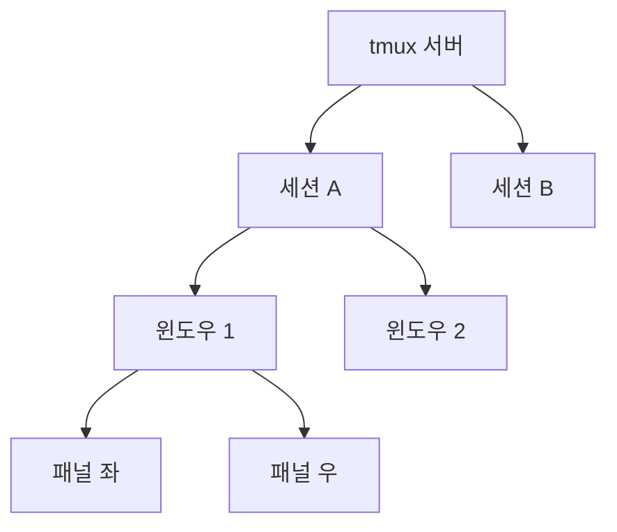

# tmux와 GNU Screen: 원격 서버 터미널 멀티플렉서 완전 가이드

SSH가 끊겨도 작업이 살아있어야 한다.
터미널 멀티플렉서는 **프로세스를 서버에서 계속 실행**하면서
하나의 SSH 연결로 여러 터미널을 관리하는 핵심 도구다.

---

## 1. tmux vs GNU Screen

| 항목 | tmux | GNU Screen |
|------|------|-----------|
| 출시 | 2007년 | 1987년 |
| 최신 버전 | 3.6a (2024-12) | 5.0.1 (2025-05) |
| 라이선스 | BSD | GPL |
| 개발 상태 | 활발히 개발 중 | 보안픽스 위주 유지보수 |
| 패널 분할 | 네이티브 지원 | 우회적 지원 (regions) |
| 플러그인 생태계 | 풍부 (TPM + 100+) | 없음 |
| 기본 prefix | `Ctrl+b` | `Ctrl+a` |
| 직렬/텔넷 지원 | 없음 | 내장 |
| 클립보드 통합 | OSC 52 지원 | 미지원 |

**RHEL 8+에서 GNU Screen 공식 패키지 제거 → tmux 권장.**
신규 환경에서는 tmux를 선택한다.
GNU Screen은 레거시 서버나 직렬포트 접속이 필요한 임베디드
환경에서만 사용한다.

---

## 2. tmux 아키텍처



| 단위 | 설명 |
|------|------|
| **서버** | 백그라운드 데몬. 유닉스 소켓으로 통신 |
| **세션** | 독립적으로 detach/attach 가능한 최상위 단위 |
| **윈도우** | 세션 내 탭. 전체 화면을 차지 |
| **패널** | 윈도우를 수평/수직으로 분할한 터미널 |

---

## 3. 설치

```bash
# Debian/Ubuntu
apt install tmux

# RHEL/Fedora
dnf install tmux

# macOS
brew install tmux

# Alpine
apk add tmux
```

---

## 4. 핵심 단축키

기본 prefix: `Ctrl+b`

### 세션 관리

| 단축키 / 명령 | 기능 |
|--------------|------|
| `tmux new -s <이름>` | 명명 세션 생성 |
| `tmux attach -t <이름>` | 세션 재접속 |
| `tmux ls` | 세션 목록 |
| `prefix d` | 세션 detach |
| `prefix $` | 세션 이름 변경 |
| `prefix s` | 세션 목록 탐색 |
| `prefix (` / `)` | 이전/다음 세션 전환 |

### 윈도우 관리

| 단축키 | 기능 |
|--------|------|
| `prefix c` | 새 윈도우 |
| `prefix ,` | 윈도우 이름 변경 |
| `prefix n` / `p` | 다음/이전 윈도우 |
| `prefix 0~9` | 번호로 이동 |
| `prefix &` | 윈도우 닫기 |
| `prefix l` | 직전 윈도우 전환 |

### 패널 관리

| 단축키 | 기능 |
|--------|------|
| `prefix %` | 수직 분할 (좌/우) |
| `prefix "` | 수평 분할 (상/하) |
| `prefix 방향키` | 패널 이동 |
| `prefix z` | 패널 전체화면 토글 |
| `prefix q` | 패널 번호 표시 |
| `prefix x` | 패널 닫기 |
| `prefix !` | 패널 → 독립 윈도우 분리 |
| `prefix Space` | 레이아웃 순환 |

### 복사 모드 (vi 키 설정 기준)

| 단축키 | 기능 |
|--------|------|
| `prefix [` | 복사 모드 진입 |
| `v` | 선택 시작 |
| `y` | 복사 후 종료 |
| `prefix ]` | 붙여넣기 |
| `/` / `?` | 앞/뒤 방향 검색 |
| `q` | 복사 모드 종료 |

---

## 5. tmux.conf 설정

```bash
# ~/.tmux.conf

# ── prefix 변경 (Ctrl+a, screen 방식) ──────────────
unbind C-b
set-option -g prefix C-a
bind-key C-a send-prefix

# ── 기본 설정 ───────────────────────────────────────
set -g history-limit 50000    # 스크롤백 버퍼
set -g escape-time 10         # ESC 딜레이 (vim 사용자 필수)
set -g base-index 1           # 윈도우 번호 1부터
setw -g pane-base-index 1
set -g renumber-windows on    # 윈도우 삭제 시 번호 재정렬
set -g focus-events on        # 포커스 이벤트 (vim 자동저장)

# ── 마우스 ─────────────────────────────────────────
set -g mouse on

# ── 트루컬러 ───────────────────────────────────────
set -g default-terminal "tmux-256color"
set -ag terminal-overrides ",xterm-256color:RGB"

# ── 패널 분할 (직관적 키) ──────────────────────────
bind | split-window -h -c "#{pane_current_path}"
bind - split-window -v -c "#{pane_current_path}"
unbind '"'
unbind %

# ── vi 방향키 패널 이동 ────────────────────────────
bind h select-pane -L
bind j select-pane -D
bind k select-pane -U
bind l select-pane -R

# ── 복사 모드 (vi 방식) ────────────────────────────
setw -g mode-keys vi
bind-key -T copy-mode-vi v send-keys -X begin-selection
bind-key -T copy-mode-vi y send-keys -X copy-selection-and-cancel

# ── 설정 즉시 리로드 ───────────────────────────────
bind r source-file ~/.tmux.conf \; display "Reloaded!"

# ── 상태바 ─────────────────────────────────────────
set -g status-position bottom
set -g status-left '#[fg=green](#S) '
set -g status-right '#[fg=yellow]%Y-%m-%d %H:%M'
```

---

## 6. TPM 플러그인 매니저

```bash
# 설치
git clone https://github.com/tmux-plugins/tpm \
  ~/.tmux/plugins/tpm
```

```bash
# ~/.tmux.conf 하단에 추가
set -g @plugin 'tmux-plugins/tpm'
set -g @plugin 'tmux-plugins/tmux-sensible'
set -g @plugin 'tmux-plugins/tmux-resurrect'
set -g @plugin 'tmux-plugins/tmux-continuum'
set -g @plugin 'tmux-plugins/tmux-yank'

# TPM 초기화 (반드시 마지막 줄)
run '~/.tmux/plugins/tpm/tpm'
```

| 단축키 | 기능 |
|--------|------|
| `prefix I` | 플러그인 설치 |
| `prefix U` | 플러그인 업데이트 |
| `prefix Alt+u` | 미사용 플러그인 제거 |

### 필수 플러그인

| 플러그인 | 용도 |
|----------|------|
| `tmux-sensible` | 모두가 동의하는 기본 설정 묶음 |
| `tmux-resurrect` | 재시작 후 세션/패널 복원 (단, 실행 중이던 프로세스 자체는 복원 안 됨) |
| `tmux-continuum` | 환경 자동 저장 + 부팅 시 자동 복원 |
| `tmux-yank` | 시스템 클립보드 통합 |
| `tmux-fzf` | fzf로 세션/패널 퍼지 검색 |

---

## 7. 실무 패턴

### SSH 끊김 복구

```bash
# 원격 서버 접속 후 세션 시작
ssh user@server
tmux new -s deploy

# SSH 끊김 후 재접속
ssh user@server
tmux attach -t deploy    # 특정 세션
tmux attach              # 마지막 세션
```

### 배포 작업 세션 구성

```bash
tmux new-session -s deploy \; \
  send-keys 'tail -f /var/log/app/app.log' Enter \; \
  split-window -h \; \
  send-keys 'kubectl get pods -w' Enter \; \
  new-window \; \
  send-keys 'cd /opt/app && vim' Enter
```

### Popup 윈도우 (3.2+)

```bash
# lazygit 팝업
bind g display-popup -E -w 90% -h 90% lazygit

# fzf 세션 전환
bind f display-popup -E \
  "tmux list-sessions | fzf --reverse \
  | sed 's/:.*//' | xargs tmux switch-client -t"
```

### 페어 프로그래밍

```bash
# ── 완전 공유 모드 (동일 화면) ──────────────────────
# 호스트: 세션 생성
tmux new -s pair

# 게스트: 동일 세션 attach → 동일 화면 공유
tmux attach -t pair

# ── 독립 뷰 모드 (각자 다른 윈도우) ─────────────────
# 세션 그룹(session group) 패턴을 사용해야 한다.
# 같은 윈도우 풀을 공유하되, 각자 독립적으로 포커스를 이동할 수 있다.

# 호스트: 세션 생성
tmux new -s pair-host

# 게스트: 기존 세션과 연결된 새 세션 생성
tmux new-session -t pair-host -s pair-guest
# 이제 두 사람이 서로 다른 윈도우를 독립적으로 볼 수 있다.
# attach와 달리 화면이 분리된다.
```

### 중첩 세션 (로컬 + 원격)

```bash
# 로컬: Ctrl+a prefix
# 원격: Ctrl+b prefix (기본값 유지)
# → prefix 충돌 없이 두 레벨 독립 제어

# mosh + tmux: 불안정한 네트워크에서 끊김 없는 세션
mosh user@server -- tmux attach -t main
```

---

## 8. 소켓 보안

tmux 서버는 유닉스 소켓(`/tmp/tmux-$UID/default`)으로 통신한다.
공유 서버·점프 서버에서 소켓 권한이 잘못 설정되면
같은 호스트의 다른 사용자가 세션에 attach해 명령을 실행할 수 있다.

```bash
# 소켓 경로와 권한 확인
ls -la /tmp/tmux-$(id -u)/

# 소켓 경로를 명시적으로 지정 (다른 사용자와 공유 금지)
tmux -S ~/.tmux.sock new -s main
chmod 600 ~/.tmux.sock

# root 세션을 열어두지 않는다
# 공유 서버에서 sudo tmux 후 detach하면 누구나 그 세션에 접근 가능
```

| 위험 | 설명 |
|------|------|
| 기본 소켓 권한 | `srwxrwx---` — 같은 그룹 구성원이 접근 가능 |
| root 세션 노출 | `sudo tmux`로 root 세션 생성 후 detach 시 위험 |
| 소켓 경로 예측 | `/tmp/tmux-0/default` 등 경로가 예측 가능 |

---

## 9. GNU Screen 기본 사용법

레거시 환경에서 GNU Screen이 이미 설치된 경우 기본 명령어:

```bash
screen -S <이름>     # 명명 세션 생성
screen -ls           # 세션 목록
screen -r <이름>     # 세션 재접속
```

| 단축키 (prefix: Ctrl+a) | 기능 |
|------------------------|------|
| `prefix d` | 세션 detach |
| `prefix c` | 새 윈도우 |
| `prefix "` | 윈도우 목록 |
| `prefix n` / `p` | 다음/이전 윈도우 |
| `prefix S` | 수평 분할 |
| `prefix |` | 수직 분할 |
| `prefix Tab` | 분할 영역 전환 |

---

## 참고 자료

- [tmux GitHub Releases](https://github.com/tmux/tmux/releases)
  — 확인: 2026-04-17
- [TPM - Tmux Plugin Manager](https://github.com/tmux-plugins/tpm)
  — 확인: 2026-04-17
- [tmux Plugin List](https://github.com/tmux-plugins/list)
  — 확인: 2026-04-17
- [A Guide to Customizing your tmux.conf - Ham Vocke](https://hamvocke.com/blog/a-guide-to-customizing-your-tmux-conf/)
  — 확인: 2026-04-17
- [GNU Screen 5.0 - Phoronix](https://www.phoronix.com/news/GNU-Screen-5.0)
  — 확인: 2026-04-17
