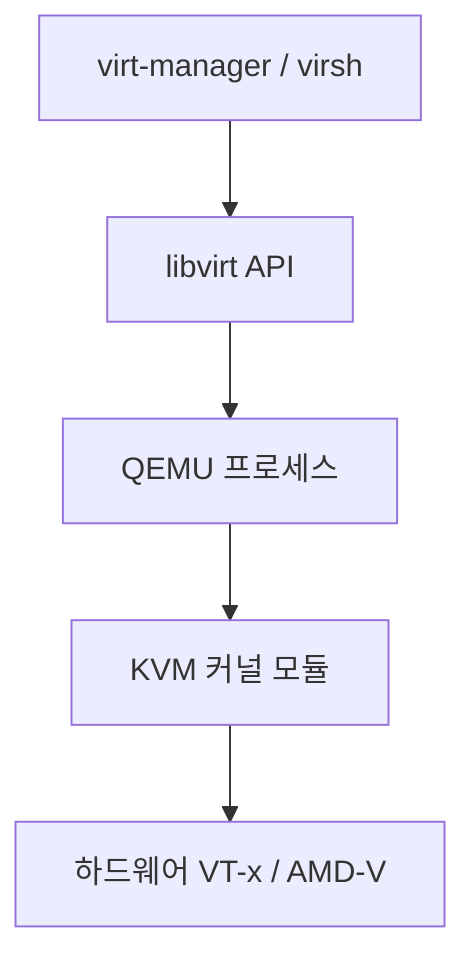

# KVM과 QEMU: Linux 가상화 스택 완전 가이드

AWS, GCP, Azure 모두 KVM 기반으로 운영된다.
KVM은 Linux 커널에 내장된 하이퍼바이저이고,
QEMU는 그 위에서 장치를 에뮬레이션하는 에뮬레이터다.
두 가지는 역할이 다르며, 함께 동작한다.

---

## 1. KVM vs QEMU 역할 구분

| 구분 | KVM | QEMU |
|------|-----|------|
| 정체 | Linux 커널 모듈 | 에뮬레이터/가상머신 관리자 |
| 역할 | CPU 가상화 가속 | 디스크, NIC, 그래픽 장치 에뮬레이션 |
| 접근 | `/dev/kvm` 장치 파일 | 유저스페이스 프로세스 |
| 단독 사용 | 불가 (QEMU와 함께) | 가능 (KVM 없이 순수 에뮬레이션) |

**KVM 단독으로는 VM을 실행할 수 없다.**
QEMU가 KVM에 `ioctl()`로 요청을 보내
하드웨어 가속 CPU 실행을 위임하는 구조다.

---

## 2. 전체 스택 구조



| 계층 | 역할 |
|------|------|
| 하드웨어 | Intel VT-x / AMD-V 하드웨어 가상화 확장 |
| KVM 모듈 | `/dev/kvm` 인터페이스, CPU 명령 직접 실행 |
| QEMU | 가상 장치 에뮬레이션, VM 프로세스 관리 |
| libvirt | QEMU/KVM 통합 관리 API (XML 기반 VM 정의) |
| virt-manager | libvirt GUI 프론트엔드 |

---

## 3. 가상화 지원 확인

```bash
# VT-x(vmx) / AMD-V(svm) 플래그 확인
grep -c vmx /proc/cpuinfo    # Intel
grep -c svm /proc/cpuinfo    # AMD

# 한 번에 확인
lscpu | grep -i virtualization

# Ubuntu: kvm-ok 도구
sudo apt install cpu-checker
sudo kvm-ok
# 정상 출력: "INFO: /dev/kvm exists. KVM acceleration can be used"

# /dev/kvm 존재 확인
ls -la /dev/kvm
```

BIOS에서 Virtualization Technology(VT-x 또는 AMD-V)가
활성화되어 있어야 한다.

---

## 4. 설치

```bash
# Ubuntu/Debian
sudo apt install -y \
  qemu-kvm libvirt-daemon-system libvirt-clients \
  bridge-utils virt-manager virtinst qemu-guest-agent

# RHEL/Fedora
sudo dnf install -y \
  qemu-kvm libvirt libvirt-client virt-install \
  virt-manager bridge-utils

# 사용자 그룹 추가 (재로그인 필요)
sudo usermod -aG kvm,libvirt $USER

# libvirtd 시작
sudo systemctl enable --now libvirtd
```

---

## 5. VM 생성 (virt-install)

### 기본 VM 생성

```bash
virt-install \
  --connect qemu:///system \
  --name ubuntu-server-01 \
  --virt-type kvm \
  --os-variant ubuntu24.04 \
  --vcpus 4 \
  --memory 8192 \
  --disk path=/var/lib/libvirt/images/ubuntu-01.qcow2,\
size=50,bus=virtio,format=qcow2,cache=writeback \
  --network network=default,model=virtio \
  --cdrom /opt/isos/ubuntu-24.04-live-server-amd64.iso \
  --graphics none \
  --console pty,target_type=serial \
  --extra-args 'console=ttyS0,115200n8'
```

### CI/CD 테스트 VM (네스티드 가상화 활성화)

```bash
virt-install \
  --name ci-runner \
  --vcpus 4 --memory 8192 \
  --disk size=40,bus=virtio,format=qcow2 \
  --network network=default,model=virtio \
  --os-variant ubuntu24.04 \
  --cpu host-passthrough \    # 호스트 CPU 기능 그대로 노출
  --location http://archive.ubuntu.com/ubuntu/dists/noble/main/installer-amd64/ \
  --noautoconsole
```

`--cpu host-passthrough`: 게스트 VM 안에서도 KVM을 실행할 수 있게 한다.
Kubernetes 노드 테스트, Minikube 실행 등에 사용한다.

---

## 6. QEMU 최신 버전

| 버전 | 릴리즈 | 상태 |
|------|--------|------|
| 10.2.2 | 2026-03-17 | 최신 안정 |
| 10.2.0 | 2025-12-24 | 안정 |
| 10.0.0 | 2025-04-23 | 안정 |
| 9.2.4 | 2025-05-26 | LTS |

**QEMU 10.2.0 주요 변경사항** (2025-12-24):
- `cpr-exec` 마이그레이션 모드: 기존 연결 유지하면서 VM 업데이트
- 메인 루프를 io_uring으로 전환 → 이벤트 핸들링 성능 향상

**QEMU 10.0.0 주요 변경사항** (2025-04-23):
- `virtio-scsi multiqueue`: 여러 I/O 스레드로 요청 분산
- x86 Clearwater Forest, Sierra Forest v2 신규 CPU 모델 추가

---

## 7. 하이퍼바이저 비교

| 항목 | KVM | VMware ESXi | VirtualBox | Hyper-V |
|------|-----|------------|-----------|---------|
| 타입 | Type 1 (커널 내장) | Type 1 | Type 2 | Type 1 |
| 라이선스 | 오픈소스 | 상용 | 오픈소스 | Windows 포함 |
| CPU 오버헤드 | ~3-5% | ~5-15% | 높음 | 중간 |
| 디스크 I/O | ~85-90% (virtio) | ~65-80% | 낮음 | 중간 |
| 클라우드 채택 | AWS, GCP, Azure 전체 | VMware Cloud | - | Azure |
| 관리 도구 | virt-manager, Cockpit | vSphere | GUI 내장 | Hyper-V Manager |

---

## 8. 네트워크 모드 비교

| 모드 | 동작 | 성능 | 용도 |
|------|------|------|------|
| **NAT** | SLIRP 소프트웨어 변환 | 낮음 | 간단한 인터넷 접근 |
| **Bridge** | 물리 NIC와 가상 브릿지 연결 | 근접 네이티브 | VM에 독립 IP 부여 |
| **macvtap** | 물리 NIC에 직접 연결 | Bridge보다 높음 | 낮은 레이턴시 필요 시 |
| **Private Bridge** | VM 간 격리 가상 네트워크 | VM 간 고성능 | VM 간 통신 전용 |

---

## 9. virtio 드라이버

virtio는 반가상화 I/O 인터페이스다.
하드웨어 에뮬레이션 오버헤드를 줄여 성능을 크게 향상시킨다.

| 드라이버 | 용도 | 특징 |
|---------|------|------|
| `virtio-net` | 네트워크 | 멀티큐, 기본 e1000 대비 성능 대폭 향상 |
| `virtio-blk` | 블록 장치 | 거의 네이티브 수준 디스크 I/O |
| `virtio-scsi` | SCSI 디스크 | 멀티큐 지원 (QEMU 10.0+) |
| `virtio-mem` | 메모리 | 동적 메모리 할당 |
| `virtio-serial` | 시리얼 포트 | qemu-ga 통신 채널 |

---

## 10. QEMU Guest Agent

게스트 OS 내부에서 실행되는 데몬.
하이퍼바이저가 게스트 OS 수준의 작업을 수행할 수 있게 한다.

```bash
# 게스트 Linux에 설치
sudo apt install qemu-guest-agent
sudo systemctl enable --now qemu-guest-agent
```

**핵심 기능: 파일시스템 freeze/thaw**

백업·스냅샷 전 파일시스템을 동결해
데이터 일관성을 보장한다.

```
스냅샷 흐름:
libvirt → QMP(guest-fsfreeze-freeze) → virtio-serial → qemu-ga
qemu-ga → FIFREEZE ioctl() → 파일시스템 동결
백업 완료 → guest-fsfreeze-thaw → 해제
```

| QMP 명령 | 설명 |
|---------|------|
| `guest-fsfreeze-freeze` | 파일시스템 동결 (일관된 스냅샷) |
| `guest-fsfreeze-thaw` | 파일시스템 해제 |
| `guest-shutdown` | 게스트 OS 종료 |
| `guest-get-osinfo` | 게스트 OS 정보 조회 |

---

## 11. 네스티드 가상화

VM 안에서 또 다른 VM을 실행한다.
Linux 커널 v4.20부터 기본 활성화.

```bash
# Intel 영구 활성화
echo "options kvm-intel nested=1" | \
  sudo tee /etc/modprobe.d/kvm.conf

# AMD 영구 활성화
echo "options kvm-amd nested=1" | \
  sudo tee /etc/modprobe.d/kvm.conf

# 확인 (Intel)
cat /sys/module/kvm_intel/parameters/nested   # Y

# 확인 (AMD)
cat /sys/module/kvm_amd/parameters/nested     # 1
```

| 활용 사례 | 설명 |
|---------|------|
| Kubernetes 노드 테스트 | Minikube, Kind을 VM 내에서 실행 |
| 하이퍼바이저 CI/CD | VM 프로비저닝 자동화 테스트 |
| OpenStack DevStack | 개발 환경 구성 |

**제약**: 네스티드 VM이 실행 중인 게스트는
라이브 마이그레이션, 세이브/로드 불가.

---

## 12. virsh 기본 명령어

```bash
virsh list --all              # 전체 VM 목록
virsh start   VM_NAME         # VM 시작
virsh shutdown VM_NAME        # 정상 종료 (ACPI)
virsh destroy VM_NAME         # 강제 종료
virsh dominfo VM_NAME         # VM 정보 확인
virsh dumpxml VM_NAME         # VM XML 설정 출력

# 스냅샷
virsh snapshot-create-as VM_NAME snap1
virsh snapshot-list VM_NAME
virsh snapshot-revert VM_NAME snap1
```

---

## 참고 자료

- [QEMU 공식 사이트](https://www.qemu.org/)
  — 확인: 2026-04-17
- [QEMU 10.2.0 릴리즈 노트](https://www.qemu.org/2025/12/24/qemu-10-2-0/)
  — 확인: 2026-04-17
- [KVM 공식 문서](https://www.linux-kvm.org/page/Main_Page)
  — 확인: 2026-04-17
- [Linux 커널 네스티드 가상화 문서](https://docs.kernel.org/virt/kvm/x86/running-nested-guests.html)
  — 확인: 2026-04-17
- [QEMU Guest Agent 공식 문서](https://qemu-project.gitlab.io/qemu/interop/qemu-ga.html)
  — 확인: 2026-04-17
- [KubeVirt 공식 사이트](https://kubevirt.io/)
  — 확인: 2026-04-17
