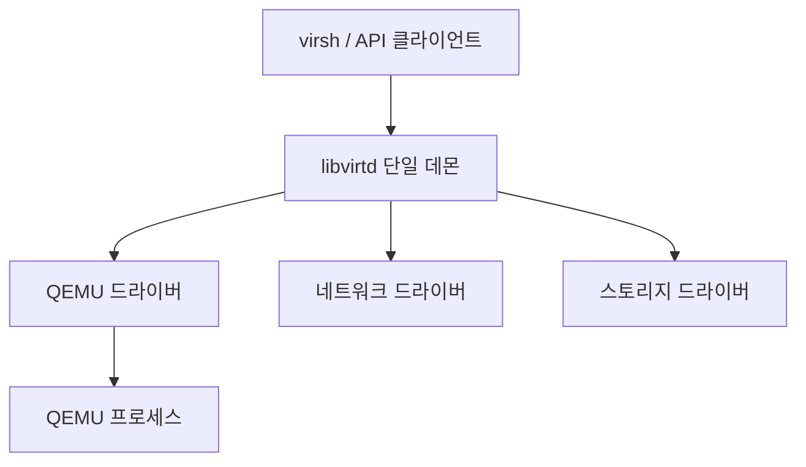

# libvirt와 virsh: 가상화 관리 완전 가이드

libvirt는 KVM, Xen, LXC, VMware ESX 등 다양한 하이퍼바이저를
하나의 API로 통합 관리하는 가상화 관리 라이브러리다.
virsh는 libvirt의 CLI 클라이언트다.

최신 버전: **v12.2.0** (2026-04-01)

---

## 1. 아키텍처

### 전통 방식 (단일 데몬)



### 모듈러 방식 (Fedora 36+, RHEL 9+)

각 드라이버를 독립 데몬으로 분리. 한 보조 데몬 장애가
QEMU 데몬에 영향을 주지 않는다.

| 데몬 | 역할 |
|------|------|
| `virtqemud` | QEMU/KVM 하이퍼바이저 |
| `virtnetworkd` | 가상 네트워크 관리 |
| `virtstoraged` | 스토리지 풀·볼륨 관리 |
| `virtlogd` | QEMU 로그 관리 |
| `virtlockd` | 스토리지 잠금 |
| `virtproxyd` | 레거시 소켓 경로 하위 호환 |

---

## 2. 연결 URI

```
driver[+transport]://[user@][host][:port]/[path]
```

| URI | 권한 | 용도 |
|-----|------|------|
| `qemu:///system` | 시스템 전체 | 서버 가상화, 모든 사용자 VM |
| `qemu:///session` | 현재 사용자 | 데스크탑 가상화 |
| `qemu+ssh://root@host/system` | 원격 | SSH 터널, 암호화 |
| `qemu+tls://host/system` | 원격 | x509 인증서, 암호화 |

`qemu:///system`은 `/dev/kvm`, 블록 디바이스, PCI/USB 등
호스트 리소스 전체에 접근 가능하다.
`qemu:///session`은 해당 사용자 권한 내에서만 동작한다.

---

## 3. 설치 및 기동

```bash
# Ubuntu/Debian
sudo apt install -y \
  libvirt-daemon-system libvirt-clients \
  virtinst virt-manager qemu-guest-agent

# RHEL/Fedora
sudo dnf install -y \
  libvirt libvirt-client virt-install virt-manager

# 사용자 그룹 추가 (재로그인 필요)
sudo usermod -aG kvm,libvirt $USER

# 서비스 시작
sudo systemctl enable --now libvirtd

# 연결 확인
virsh -c qemu:///system version
```

---

## 4. Domain XML 구조

VM은 XML로 정의된다. 주요 섹션:

```xml
<domain type='kvm'>
  <!-- 기본 정보 -->
  <name>prod-server-01</name>
  <uuid>4dea22b3-1d52-d8f3-2516-782e98ab3fa0</uuid>
  <memory unit='GiB'>8</memory>
  <vcpu placement='static'>4</vcpu>

  <!-- 부팅 설정 -->
  <os>
    <type>hvm</type>
    <boot dev='hd'/>
  </os>

  <!-- CPU 토폴로지 -->
  <cpu mode='host-model'>
    <topology sockets='1' cores='2' threads='2'/>
  </cpu>

  <!-- 장치 -->
  <devices>

    <!-- 디스크 -->
    <disk type='file' device='disk'>
      <driver name='qemu' type='qcow2'/>
      <source file='/var/lib/libvirt/images/server.qcow2'/>
      <target dev='vda' bus='virtio'/>
    </disk>

    <!-- 네트워크 -->
    <interface type='network'>
      <source network='default'/>
      <model type='virtio'/>
    </interface>

  </devices>
</domain>
```

### CPU mode 옵션

| mode | 설명 |
|------|------|
| `host-passthrough` | 호스트 CPU 기능 그대로 노출 (네스티드 가상화용) |
| `host-model` | 호스트와 유사하지만 마이그레이션 안전 |
| `custom` | 특정 CPU 모델 지정 |

---

## 5. virsh VM 관리 명령어

### 라이프사이클

```bash
virsh list --all              # 전체 VM 목록
virsh start   <vm>            # 시작
virsh shutdown <vm>           # 정상 종료 (ACPI)
virsh reboot  <vm>            # 재시작
virsh destroy <vm>            # 강제 전원 차단
virsh suspend <vm>            # 일시 정지
virsh resume  <vm>            # 재개
virsh autostart <vm>          # 부팅 시 자동 시작 등록
virsh autostart --disable <vm>
```

### 정의 관리

```bash
virsh define  vm.xml          # XML에서 VM 정의 (영구)
virsh create  vm.xml          # XML에서 VM 생성 및 시작 (임시)
virsh dumpxml <vm>            # XML 설정 출력
virsh edit    <vm>            # XML 편집

# VM 완전 삭제 (스토리지 포함)
virsh undefine <vm> --remove-all-storage --nvram
```

### 정보 조회

```bash
virsh dominfo <vm>            # 기본 정보
virsh domblklist <vm>         # 블록 디바이스 목록
virsh domiflist <vm>          # 네트워크 인터페이스 목록
virsh domifaddr <vm>          # 게스트 IP 주소 (qemu-ga 필요)
virsh domstats <vm>           # 성능 통계
```

### 리소스 변경

```bash
# 실행 중 변경
virsh setvcpus <vm> 6 --live
virsh setmem <vm> 8G --live

# 영구 변경 (다음 부팅 적용)
virsh setvcpus <vm> 6 --config
virsh setmem <vm> 8G --config
```

### 핫플러그

```bash
# 디스크 추가
virsh attach-disk <vm> /var/lib/libvirt/images/data.qcow2 vdb \
  --driver qemu --subdriver qcow2 --persistent

# 디스크 제거
virsh detach-disk <vm> vdb --persistent

# 네트워크 인터페이스 추가
virsh attach-interface <vm> bridge br1 \
  --model virtio --persistent
```

### 마이그레이션

```bash
# 라이브 마이그레이션 (공유 스토리지)
virsh migrate --live --persistent --tunnelled \
  <vm> qemu+ssh://host02.example.com/system

# 스토리지 복사 포함
virsh migrate --live --persistent --copy-storage-all \
  <vm> qemu+ssh://host02.example.com/system --verbose
```

---

## 6. 네트워크 관리

### 네트워크 모드 비교

| 모드 | 외부 접근 | 호스트-VM 통신 | 용도 |
|------|---------|--------------|------|
| **NAT** | 아웃바운드만 | 가능 | 기본, 간단한 인터넷 접근 |
| **Routed** | 양방향 | 가능 | 라우터 설정이 있는 환경 |
| **Isolated** | 불가 | 가능 | VM 간 격리 테스트 |
| **Bridge** | 양방향 | 가능 | VM에 독립 IP 부여 |
| **macvtap** | 양방향 | 불가 | 낮은 레이턴시 |

기본 네트워크: `virbr0` (192.168.122.0/24, NAT, dnsmasq DHCP)

### 네트워크 관리 명령어

```bash
virsh net-list --all
virsh net-dumpxml default
virsh net-define network.xml
virsh net-start  <net>
virsh net-destroy <net>
virsh net-undefine <net>
virsh net-autostart <net>
```

### 격리 네트워크 XML 예시

```xml
<network>
  <name>isolated-net</name>
  <bridge name='virbr1' stp='on' delay='0'/>
  <ip address='10.10.10.1' netmask='255.255.255.0'>
    <dhcp>
      <range start='10.10.10.100' end='10.10.10.200'/>
    </dhcp>
  </ip>
</network>
```

---

## 7. 스토리지 풀 관리

| 타입 | 백엔드 | 특징 |
|------|--------|------|
| `dir` | 디렉토리 | 가장 단순, 기본값 |
| `logical` | LVM VG | 블록 레벨, 빠른 프로비저닝 |
| `netfs` | NFS/GlusterFS | 네트워크 마운트 |
| `rbd` | Ceph RADOS | 분산 스토리지, 클러스터 |
| `iscsi` | iSCSI 타겟 | 볼륨 생성 불가, LUN 직접 사용 |
| `zfs` | ZFS 풀 | ZFS 스냅샷 지원 |

### 풀 생성 워크플로우

```bash
# 1. 정의
virsh pool-define pool.xml

# 2. 빌드 (디렉토리 생성, LVM VG 초기화 등)
virsh pool-build <pool>

# 3. 시작 및 자동시작
virsh pool-start <pool>
virsh pool-autostart <pool>
```

### 볼륨 관리

```bash
virsh vol-create-as <pool> <name> 20G --format qcow2
virsh vol-list <pool>
virsh vol-info <vol> <pool>
virsh vol-clone <src> <dst> --pool <pool>
virsh vol-resize <vol> 40G --pool <pool>
virsh vol-delete <vol> <pool>
```

---

## 8. 스냅샷 관리

libvirt 스냅샷은 두 가지 타입이 있다.

| 타입 | 저장 위치 | 특징 |
|------|---------|------|
| **내부 스냅샷** | qcow2 파일 내부 | 단순, VM 중지 불필요 |
| **외부 스냅샷** | 별도 오버레이 파일 | 더 유연, 체이닝 가능 |

```bash
# 생성
virsh snapshot-create-as <vm> snap1 \
  --description "Before update"

# 목록
virsh snapshot-list <vm>

# 복원
virsh snapshot-revert <vm> snap1

# 삭제
virsh snapshot-delete <vm> snap1
```

---

## 9. Python API 활용

```python
import libvirt

# 연결
conn = libvirt.open('qemu:///system')

# VM 목록
for dom in conn.listAllDomains():
    state, _, _, _, _ = dom.info()[0], *dom.info()[1:]
    print(dom.name(), state)

# VM 제어
dom = conn.lookupByName('myvm')
dom.create()      # 시작
dom.shutdown()    # 정상 종료
dom.destroy()     # 강제 종료

# XML로 VM 정의
xml = open('vm.xml').read()
dom = conn.defineXML(xml)   # 영구
dom = conn.createXML(xml, 0) # 임시

conn.close()
```

---

## 10. Cockpit 웹 UI

브라우저에서 libvirt를 관리하는 웹 인터페이스.

```bash
# Ubuntu
apt install cockpit cockpit-machines
systemctl enable --now cockpit.socket

# RHEL/Fedora
dnf install cockpit cockpit-machines
systemctl enable --now cockpit.socket
```

`https://host:9090` → "Virtual Machines" 탭

주요 기능: VM 생성 마법사, 브라우저 내 콘솔(VNC/SPICE),
CPU·메모리·디스크 핫플러그, 스냅샷 관리, 마이그레이션.

---

## 11. sVirt 보안 격리

각 QEMU VM이 고유한 SELinux MCS 레이블로 격리된다.
VM 간 파일 접근이 커널 레벨에서 차단된다.

```xml
<!-- Domain XML에서 sVirt 레이블 확인 -->
<seclabel type='dynamic' model='selinux' relabel='yes'>
  <label>system_u:system_r:svirt_t:s0:c123,c456</label>
</seclabel>
```

| 모드 | 설명 |
|------|------|
| `dynamic` | libvirt가 자동으로 고유 레이블 생성 (기본) |
| `static` | 관리자가 레이블 직접 지정 |
| `none` | 격리 비활성화 |

AppArmor 환경에서는 VM 시작 시 UUID 기반 프로파일이
자동 생성되어 해당 VM에 필요한 파일만 접근을 허용한다.

---

## 참고 자료

- [libvirt 공식 문서](https://libvirt.org/)
  — 확인: 2026-04-17
- [libvirt 릴리즈 노트](https://libvirt.org/news.html)
  — 확인: 2026-04-17
- [Domain XML 포맷](https://libvirt.org/formatdomain.html)
  — 확인: 2026-04-17
- [libvirt 스토리지 관리](https://libvirt.org/storage.html)
  — 확인: 2026-04-17
- [libvirt 가상 네트워킹](https://wiki.libvirt.org/VirtualNetworking.html)
  — 확인: 2026-04-17
- [libvirt Python 바인딩](https://libvirt.org/python.html)
  — 확인: 2026-04-17
- [cockpit-machines GitHub](https://github.com/cockpit-project/cockpit-machines)
  — 확인: 2026-04-17
