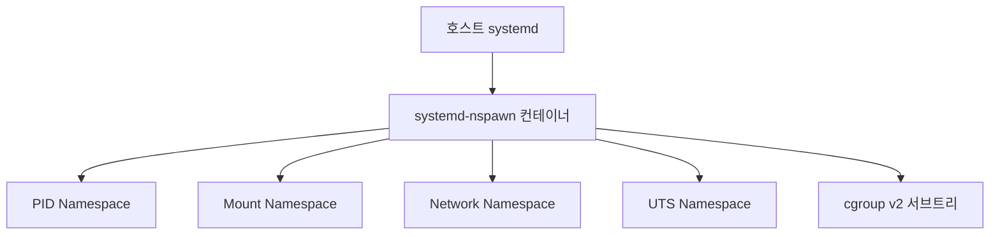

# systemd-nspawn: 경량 OS 컨테이너 완전 가이드

systemd-nspawn은 "namespace spawn"의 약자다.
chroot보다 강력하고, 완전한 OS 컨테이너를 실행하는 데 최적화된
경량 컨테이너 도구다. 중앙 데몬 없이 systemd와 직접 통합된다.

systemd v258 기준 (2025-09 릴리즈).

---

## 1. chroot vs nspawn vs Docker

| 항목 | chroot | systemd-nspawn | Docker |
|------|--------|---------------|--------|
| 파일시스템 격리 | O | O | O |
| 프로세스 격리 (PID ns) | X | O | O |
| 네트워크 격리 | X | O (선택) | O |
| cgroup 제한 | X | O | O |
| PID 1 | 지정 없음 | systemd init | 앱 프로세스 |
| 데몬 | X | X (systemd 통합) | dockerd 필수 |
| 이미지 형식 | 디렉토리 | 디렉토리/raw | OCI 레이어 |
| 이식성 | 낮음 | 낮음 | 높음 |
| 주 용도 | 단순 격리 | OS 테스트, 빌드 | 앱 배포 |

**systemd-nspawn이 적합한 경우:**
- systemd 서비스 유닛 통합 테스트
- 격리된 패키지 빌드 환경
- 여러 배포판 동시 테스트
- VM보다 낮은 오버헤드, Docker보다 강한 systemd 통합이 필요할 때

---

## 2. 격리 메커니즘



| Namespace | 격리 대상 | 비고 |
|-----------|---------|------|
| Mount | 파일시스템 뷰 | `/sys`, `/proc` 읽기 전용 |
| PID | 프로세스 ID | 컨테이너 init이 PID 1 |
| Network | NIC, 라우팅 테이블 | `--private-network`으로 활성화 |
| UTS | hostname, domainname | 별도 hostname 설정 가능 |
| IPC | System V IPC, POSIX MQ | 호스트와 격리 |
| User | UID/GID 매핑 | `--private-users`로 활성화 |

systemd v258부터 **cgroup v1 완전 제거**, cgroupv2 전용.

---

## 3. 컨테이너 생성

컨테이너 rootfs는 `/var/lib/machines/`에 배치한다.

### Debian/Ubuntu

```bash
sudo debootstrap \
  --include=systemd,dbus,locales,bash-completion \
  bookworm \
  /var/lib/machines/debian
```

### RHEL/AlmaLinux

```bash
sudo dnf \
  --releasever=9 \
  --installroot=/var/lib/machines/almalinux9 \
  --setopt=install_weak_deps=False \
  install almalinux-release systemd dnf \
          iputils iproute passwd vim-minimal
```

### Arch Linux

```bash
sudo pacstrap -c -d /var/lib/machines/arch base
```

### 최소 rootfs 크기 참고

| 배포판 | 최소 크기 |
|--------|---------|
| Alpine | ~16 MB |
| Debian | ~338 MB |
| Fedora | ~507 MB |

---

## 4. 기본 사용법

```bash
# 단순 쉘 실행 (chroot 방식)
sudo systemd-nspawn -D /var/lib/machines/debian

# systemd를 PID 1로 부팅 (권장)
sudo systemd-nspawn -bD /var/lib/machines/debian

# 이름 지정 (machinectl 연동)
sudo systemd-nspawn -bD /var/lib/machines/debian \
  --machine=debian-test

# 에페메럴 실행 (종료 시 변경사항 폐기)
sudo systemd-nspawn -xD /var/lib/machines/debian
```

---

## 5. 주요 실행 옵션

### 기본 옵션

| 옵션 | 설명 |
|------|------|
| `-b` / `--boot` | systemd를 PID 1로 실행 |
| `-x` / `--ephemeral` | 종료 시 변경사항 폐기 |
| `-D` / `--directory=` | rootfs 디렉토리 지정 |
| `-M` / `--machine=` | 컨테이너 이름 지정 |
| `--read-only` | rootfs 읽기 전용 마운트 |

### 네트워크 옵션

| 옵션 | 설명 |
|------|------|
| `--network-veth` | veth 쌍 생성 (호스트: `ve-<name>`, 컨테이너: `host0`) |
| `--private-network` | 완전 격리 (인터페이스 없음) |
| `--network-bridge=` | 지정 브리지에 컨테이너 연결 |
| `--network-interface=` | 물리 인터페이스를 컨테이너로 이전 |

### 스토리지 옵션

| 옵션 | 설명 |
|------|------|
| `--bind=<host>:<container>` | 읽기/쓰기 바인드 마운트 |
| `--bind-ro=<host>:<container>` | 읽기 전용 바인드 마운트 |
| `--tmpfs=<path>` | tmpfs 마운트 |

### 보안 옵션

| 옵션 | 설명 |
|------|------|
| `-U` | `--private-users=pick --private-users-chown` 단축 |
| `--private-users=pick` | User namespace + 동적 UID 범위 자동 선택 |
| `--private-users-chown` | rootfs 소유권을 매핑 UID로 변경 |
| `--no-new-privileges` | setuid/파일 capability 상승 차단 |
| `--capability=` | 추가 Linux capability 부여 |
| `--drop-capability=` | capability 제거 |

---

## 6. .nspawn 설정 파일

반복 실행 시 옵션을 파일로 고정한다.
위치: `/etc/systemd/nspawn/<이름>.nspawn`

```ini
[Exec]
Boot=yes

[Files]
Bind=/srv/data
BindReadOnly=/etc/resolv.conf:/etc/resolv.conf
TemporaryFileSystem=/tmp

[Network]
Private=yes
VirtualEthernet=yes
```

---

## 7. machinectl

machinectl은 `/var/lib/machines/` 컨테이너를
`systemd-nspawn@.service` 템플릿으로 관리한다.

### 라이프사이클

```bash
machinectl list                # 실행 중 컨테이너 목록
machinectl list-images         # 설치된 이미지 목록
machinectl start  <name>       # 컨테이너 시작 (systemd 서비스)
machinectl poweroff <name>     # 정상 종료
machinectl reboot  <name>      # 재부팅
machinectl terminate <name>    # 강제 종료
machinectl enable  <name>      # 부팅 시 자동 시작
machinectl disable <name>      # 자동 시작 해제
```

### 접근 및 모니터링

```bash
machinectl login <name>        # 컨테이너 터미널 로그인
machinectl shell <name>        # 직접 쉘 세션 (getty 없이)
machinectl status <name>       # 런타임 상태 + 최근 로그
journalctl -M <name>           # 컨테이너 전용 저널
```

### 파일 전송

```bash
machinectl copy-to   <name> <src> <dst>   # 호스트 → 컨테이너
machinectl copy-from <name> <src> <dst>   # 컨테이너 → 호스트
machinectl bind      <name> <host-path>   # 실행 중 동적 바인드
```

---

## 8. 네트워킹

### 네트워크 모드

| 모드 | 설정 | 특징 |
|------|------|------|
| 호스트 공유 (기본) | 옵션 없음 | 격리 없음, 가장 단순 |
| veth 격리 | `--network-veth` | 호스트-컨테이너 분리, DHCP 자동화 |
| 완전 격리 | `--private-network` | 인터페이스 없음, 인터넷 차단 |
| 브리지 | `--network-bridge=br0` | 동일 LAN, 독립 IP |

### veth 네트워크 + systemd-networkd 자동 구성

```
호스트 networkd → ve-<name> IP 할당 + DHCP 서버 + IP 마스커레이드
컨테이너 networkd → host0 DHCP 클라이언트
결과: 컨테이너 → 호스트 → 외부 인터넷 자동 연결
```

systemd-networkd가 호스트와 컨테이너 양쪽에서 실행되면
추가 설정 없이 자동으로 구성된다.

---

## 9. 보안

### 기본 제한

- `/sys/`, `/proc/sys/` 읽기 전용
- 호스트 네트워크 인터페이스 변경 불가
- 시스템 클럭 변경 불가
- 디바이스 노드 생성 불가
- 커널 모듈 로드 불가

### User Namespace (--private-users)

```bash
# 서비스 템플릿 기본값: -U
# = --private-users=pick --private-users-chown
machinectl start debian
```

**User namespace 미사용 시 주의:**
컨테이너 내 root = 사실상 호스트 root다.
신뢰할 수 없는 코드는 반드시 user namespace와 함께 실행해야 한다.

### v257 이후 변경사항 (보안 관련)

| 버전 | 변경 |
|------|------|
| v257 | SSH 공개키 자동 전파 (`--bind-user=`) |
| v258 | cgroup v1 제거, TTY 권한 제한 강화 |
| v258 | 비특권 디렉토리 컨테이너 지원 확대 |

---

## 10. 실무 활용 패턴

### 격리된 패키지 빌드

```bash
# 에페메럴 컨테이너: 빌드 후 흔적 없음
sudo systemd-nspawn -xD /var/lib/machines/debian \
  --bind=/src/mypackage:/build \
  -- bash -c "cd /build && dpkg-buildpackage -b"
```

### systemd 서비스 통합 테스트

```bash
# 컨테이너에서 systemd 서비스 유닛 테스트
sudo systemd-nspawn -bD /var/lib/machines/debian \
  --bind=/etc/systemd/system/myapp.service:/etc/systemd/system/myapp.service
```

```bash
# 컨테이너 안에서
machinectl shell debian
systemctl enable --now myapp
systemctl status myapp
journalctl -u myapp
```

### 여러 배포판 동시 운영

```bash
# 각 배포판을 독립 컨테이너로
machinectl list-images
#  NAME         TYPE      RO  USAGE  MODIFIED
#  debian       directory no  338M   ...
#  almalinux9   directory no  507M   ...
#  arch         directory no  800M   ...

machinectl start debian
machinectl start almalinux9
machinectl shell debian
```

### CI/CD 격리 빌드 (스크립트)

```bash
#!/bin/bash
CONTAINER=build-env
IMAGE=/var/lib/machines/debian

# 에페메럴 실행으로 격리된 빌드
sudo systemd-nspawn \
  --ephemeral \
  --directory="$IMAGE" \
  --machine="$CONTAINER" \
  --bind="$(pwd):/workspace" \
  --bind-ro=/etc/resolv.conf \
  -- bash -c "
    cd /workspace
    apt-get update -q
    apt-get install -y --no-install-recommends build-essential
    make all
  "
```

---

## 참고 자료

- [systemd-nspawn(1) 매뉴얼](https://man7.org/linux/man-pages/man1/systemd-nspawn.1.html)
  — 확인: 2026-04-17
- [systemd.nspawn(5) 매뉴얼](https://man7.org/linux/man-pages/man5/systemd.nspawn.5.html)
  — 확인: 2026-04-17
- [machinectl(1) 매뉴얼](https://man7.org/linux/man-pages/man1/machinectl.1.html)
  — 확인: 2026-04-17
- [systemd v258 릴리즈 노트](https://github.com/systemd/systemd/releases/tag/v258)
  — 확인: 2026-04-17
- [systemd v257 릴리즈 노트](https://github.com/systemd/systemd/releases/tag/v257)
  — 확인: 2026-04-17
