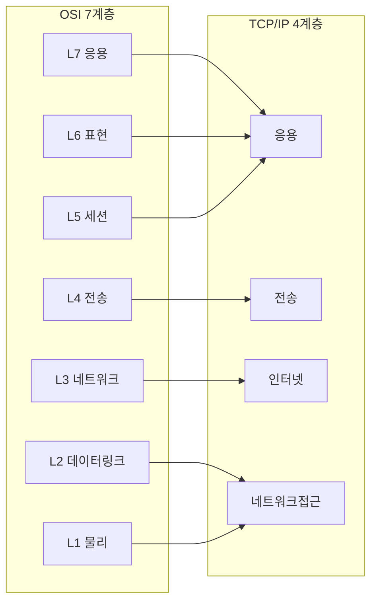
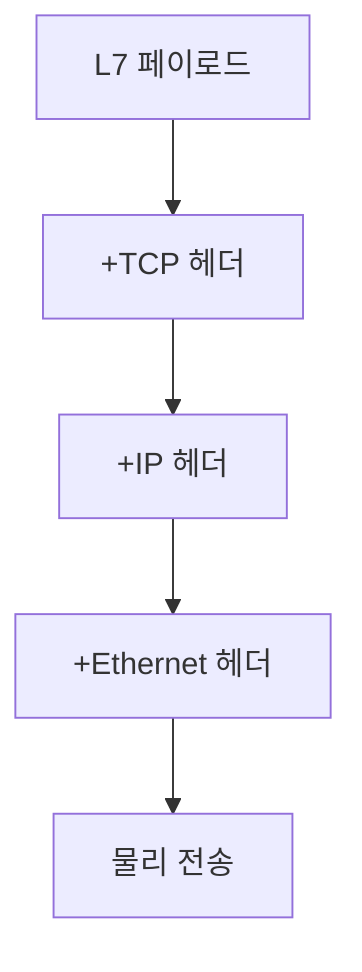
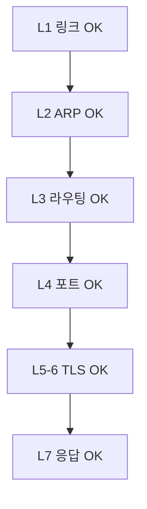

# OSI 7계층과 TCP/IP 모델

네트워크 장애 대응은 항상 한 가지 질문에서 시작한다.
**"어느 계층에서 끊겼는가?"**

OSI와 TCP/IP는 이 질문에 답하기 위한 공용 좌표계다.
모델을 외우는 것이 목적이 아니라, 증상을 계층에 매핑해
디버깅 도구와 책임 주체를 한 번에 좁히는 데 쓴다.

---

## 1. 왜 두 모델이 공존하는가

| 모델 | 제정 | 성격 | 실무 위치 |
|---|---|---|---|
| OSI 7 Layer | 1984, ISO/IEC 7498 | 이론적 참조 모델 | 교육·문서·계층 호칭 표준 |
| TCP/IP 4 Layer | RFC 1122 (1989) | 실제 구현 모델 | 인터넷·리눅스 스택이 따르는 현실 |
| 하이브리드 5 Layer | Tanenbaum 교재 계열 | 절충 모델 | L1/L2를 분리해 실무 디버깅에 편리 |

- OSI는 **대화의 언어**다. "L7 장애", "L4 로드밸런서"는 모두 OSI 번호를 쓴다.
- TCP/IP는 **코드가 실제 따르는 구조**다. 리눅스 커널 네트워크 스택,
  소켓 API, 패킷 캡처 도구 모두 TCP/IP에 맞춰 설계되었다.
- 5계층 하이브리드는 TCP/IP의 "네트워크 접근" 하나를 **L1 물리와 L2 링크로 쪼갠** 모델로,
  케이블·스위치 장애와 프레임 문제를 구분해 다루기 때문에 교재·커널 문서에서 자주 쓴다.
- 실무 엔지니어는 **OSI 번호로 말하고, TCP/IP로 구현을 이해한다**.

---

## 2. 모델 비교 한눈에

| OSI | TCP/IP | 대표 프로토콜 | 주소 단위 | 대표 장비 |
|:-:|:-:|---|---|---|
| L7 응용 | 응용 | HTTP, gRPC, DNS, SSH | URI, 헤더 | API GW, WAF, **L7 LB** |
| L6 표현 | 응용 | JPEG, UTF-8, gzip | — | — |
| L5 세션 | 응용 | SOCKS, RPC | — | — |
| L4 전송 | 전송 | TCP, UDP, SCTP, QUIC (위 UDP) | 포트 | L4 LB |
| L3 네트워크 | 인터넷 | IP, ICMP, IGMP, IPsec | IP 주소 | 라우터, L3 스위치 |
| L2 데이터링크 | 네트워크 접근 | Ethernet, ARP, VLAN, MPLS | MAC 주소 | 스위치, 브리지 |
| L1 물리 | 네트워크 접근 | 광섬유, 전기 신호, 5G NR | — | NIC, 허브, 트랜시버 |

> TCP/IP는 L5·L6·L7을 **응용 계층 하나로 합친다**.
> 실제로 TLS·세션·HTTP가 한 라이브러리 안에 섞여 있으므로
> 구현 관점에서는 이쪽이 더 정확하다.

**TLS는 의도적으로 표에서 뺐다**. TLS는 L4 위에서 시작해 세션(L5) · 암호화(L6)를
모두 포함하므로 단일 계층에 못 박으면 오히려 혼란을 준다
(자세한 내용은 8절 참고). **라우팅 프로토콜(BGP, OSPF)도 분류가 까다롭다** —
OSPF는 IP 위에서 동작하는 L3 제어 평면, BGP는 **TCP/179 위의 L7 애플리케이션 프로토콜**이다.
둘 다 L3 라우팅 정보를 교환하지만 전송 계층은 다르다.

---

## 3. 각 계층 상세

### 3-1. L1 물리 계층

| 항목 | 내용 |
|---|---|
| 역할 | 비트(0/1)를 전기·광·전파 신호로 변환 |
| 단위 | 비트 (bit) |
| 대표 기술 | 구리선, 광섬유, Wi-Fi 6E/7, 5G NR |
| 장애 증상 | 링크 다운, CRC 오류, 광 파워 저하 |
| 확인 도구 | `ethtool`, 스위치 포트 통계 |

실무에서 L1은 **케이블 교체·트랜시버 확인** 수준까지만 본다.
클라우드에서는 고객이 건드릴 수 없는 층이지만,
**hybrid cloud의 전용선(Direct Connect, Interconnect)**이
끊기면 L1부터 의심해야 한다.

### 3-2. L2 데이터링크 계층

| 항목 | 내용 |
|---|---|
| 역할 | 같은 네트워크(LAN) 안에서 프레임 전달 |
| 단위 | 프레임 (frame) |
| 주소 | MAC (48bit) |
| 대표 기술 | Ethernet, ARP, VLAN (802.1Q), LLDP, STP |
| 장애 증상 | 같은 서브넷끼리 통신 불가, ARP 테이블 이상 |
| 확인 도구 | `ip neigh`, `arp`, `bridge fdb`, `tcpdump -e` |

**VLAN/오버레이**가 L2의 실무 핵심이다.

- **VLAN (802.1Q)**: 물리 네트워크 하나에 태그로 가상 분할
- **VXLAN·Geneve**: L3 위에 L2 프레임을 터널링 — K8s CNI가 사용
- **MTU 함정**: 오버레이는 헤더 오버헤드로 유효 MTU가 줄어든다
  ([MTU·MSS](./mtu-mss.md) 참고)

### 3-3. L3 네트워크 계층

| 항목 | 내용 |
|---|---|
| 역할 | 서로 다른 네트워크 사이 경로 결정·전달 |
| 단위 | 패킷 (packet) |
| 주소 | IPv4 (32bit) / IPv6 (128bit) |
| 대표 프로토콜 | IP, ICMP, IGMP, IPsec |
| 장애 증상 | `destination unreachable`, 라우팅 루프, TTL 초과 |
| 확인 도구 | `ip route`, `mtr`, `traceroute`, `ping` |

L3는 **라우팅의 세계**다.

- **라우터·L3 스위치**가 이 계층에서 결정을 내린다
- **ICMP**는 L3의 진단·에러 보고 채널 — 차단하면 Path MTU Discovery도 깨진다
- **IPsec**은 L3 암호화. VPC 간 VPN에서 주로 사용

**라우팅 프로토콜**은 "L3 경로를 만드는 제어 평면"이며, 프로토콜 자체가
실행되는 계층은 따로 있다.

| 프로토콜 | 전송 | 분류 | 용도 |
|---|---|---|---|
| OSPF | IP 직접 (프로토콜 89) | L3 제어 평면 | 같은 AS 내부 (IGP) |
| IS-IS | CLNS (L2 위) | L2 제어 평면 | 대규모 백본 (통신사) |
| BGP | TCP/179 | **L7 애플리케이션** | AS 간 (EGP) · DC 패브릭 |

자세한 내용: [BGP 기본](../ip-routing/bgp.md)

### 3-4. L4 전송 계층

| 항목 | TCP | UDP | SCTP |
|---|---|---|---|
| 연결 | 연결형 | 비연결형 | 연결형, 멀티홈 |
| 신뢰성 | 보장 | 없음 | 보장 |
| 순서 | 보장 | 없음 | 스트림별 보장 (HOL 회피) |
| 혼잡 제어 | 있음 (CUBIC, BBR) | 없음 | 있음 |
| 헤더 크기 | 20~60B | 8B | 12B + 청크 |
| 대표 용도 | HTTP/1.1·2, DB, gRPC | DNS, QUIC 하단, VoIP | 통신사 시그널링 (SS7/SIGTRAN) |

> **QUIC**은 이 표에서 뺐다. QUIC은 L4 프로토콜이 아니라 **UDP 위에서 돌아가는
> 상위 프로토콜**로, TLS 1.3·혼잡 제어·스트림 다중화를 한 데 묶었기 때문이다.
> 자세한 내용은 [HTTP/3·QUIC](../http/http3-quic.md).

L4의 핵심은 **포트 번호로 프로세스를 구분**하는 것이다.

- **TCP 3-way handshake**: SYN → SYN-ACK → ACK
- **TCP 4-way termination**: FIN → ACK → FIN → ACK
- **상태 이슈**:
  - `CLOSE_WAIT` 누적 → 애플리케이션이 소켓 `close()`를 호출하지 않음 (FD 고갈)
  - `TIME_WAIT` 누적 → 클라이언트 측 사용 포트 고갈 (`ephemeral port` 범위 확인)
  - `SYN_RECV` 증가 → SYN 플러드 또는 백엔드 과부하
- **혼잡 제어**: 리눅스 기본은 여전히 **CUBIC**(대부분의 디스트로 기본값).
  **BBR**은 Google·대형 CDN·YouTube 등에서 채택이 확산 중이며, 커널 4.9+에서 사용 가능

### 3-5. L5~L7 응용 계층 (TCP/IP는 하나로 통합)

| OSI | 책임 | 실제 구현 |
|---|---|---|
| L5 세션 | 연결 수립·유지·종료 | SOCKS, RPC, HTTP keep-alive |
| L6 표현 | 인코딩·암호화·압축 | gzip, UTF-8, Protocol Buffers, ASN.1 |
| L7 응용 | 애플리케이션 의미 | HTTP, gRPC, DNS, SSH |

- **TLS는 단일 계층으로 매핑되지 않는다** — 아래 TCP 스트림을 받아 세션을
  수립(L5적)하고 암호화(L6적)하며 ALPN으로 L7 선택까지 관여한다.
  Cloudflare·Cisco·RFC 문헌도 L4~L6 사이를 유동적으로 서술한다.
- **L7은 가장 넓은 계층** — API Gateway, WAF, Service Mesh의 무대
- **gRPC는 HTTP/2 위의 L7 프로토콜**, 즉 HTTP를 전송 수단으로 쓴다

---

## 4. 캡슐화와 역캡슐화

송신 시 상위 계층 데이터에 **헤더가 하나씩 붙어**(캡슐화)
수신 측에서는 **역순으로 벗겨진다**(역캡슐화).

| 계층 | 단위 호칭 | 헤더에 들어가는 핵심 정보 |
|---|---|---|
| L7 | 메시지 | HTTP 메서드, URI, 헤더 |
| L4 | 세그먼트 (TCP) / 데이터그램 (UDP) | 출발·목적 포트, 시퀀스 |
| L3 | 패킷 | 출발·목적 IP, TTL, 프로토콜 번호 |
| L2 | 프레임 | 출발·목적 MAC, VLAN 태그 |
| L1 | 비트 | — |

### 캡슐화가 중요한 이유

- **MTU 계산**: 1500B Ethernet MTU에 IP(20) + TCP(20) → L7 payload 최대 1460B
- **오버레이 손실**: VXLAN 헤더 50B → 유효 MTU 1450B로 감소
- **tcpdump 읽기**: 각 레이어 헤더를 분리해서 보면 어디서 깨졌는지 즉시 판단

---

## 5. 실무 매핑 — 계층별 "무엇을 의심하는가"

### 5-1. 증상 → 계층 매핑

| 증상 | 우선 의심 계층 | 확인 |
|---|---|---|
| 링크 자체가 없음 | L1 | 케이블, 트랜시버, `ethtool` |
| 같은 서브넷인데 안 됨 | L2 | ARP 테이블, VLAN 태깅 |
| 다른 서브넷이 안 됨 | L3 | 라우팅 테이블, 보안 그룹·NACL |
| 특정 포트만 안 됨 | L3/L4 | SG/NACL(L3·L4), `ss`, NetworkPolicy |
| TCP SYN은 뜨는데 응답 없음 | L4 | 백엔드 `LISTEN` 상태, `TIME_WAIT` |
| TLS 핸드셰이크 실패 | L5~L6 | 인증서 체인, SNI, ALPN, 시스템 시간 |
| 200은 뜨는데 틀림 | L7 | 앱 로그, trace |

> **K8s NetworkPolicy**는 기본적으로 L3·L4(IP·포트) 규칙이지만,
> Cilium 같은 eBPF CNI는 L7(HTTP 메서드·경로)까지 확장한다.
> 차단 의심 시 L3/L4 먼저 보고, L7 룰이 있다면 CNI별 로그를 확인한다.

### 5-2. 계층별 주요 도구

| 계층 | 리눅스 도구 | K8s 도구 |
|---|---|---|
| L1 | `ethtool`, `dmesg` | 노드 문제, 클라우드 콘솔 |
| L2 | `ip neigh`, `bridge`, `tcpdump -e` | CNI 로그, IPAM |
| L3 | `ip route`, `mtr`, `traceroute` | Service, Endpoints, NetworkPolicy |
| L4 | `ss`, `iperf3`, `tcpdump` | Service (ClusterIP), kube-proxy |
| L7 | `curl -v`, `openssl s_client` | Ingress, Gateway API, Mesh |

- **mtr**은 ICMP/UDP/TCP 모두 지원 — 방화벽이 ICMP만 막으면 TCP 모드 사용
- **ss**가 `netstat`보다 빠르고 상세 — `ss -tnp`, `ss -s`를 기본으로

### 5-3. 책임 주체 매핑

| 계층 | 클라우드 환경 | 온프레미스 환경 |
|---|---|---|
| L1 | CSP | 네트워크팀 |
| L2 | CSP (VPC) | 네트워크팀 |
| L3 | 공동 (VPC 라우팅 고객, 백본 CSP) | 네트워크팀 |
| L4 | 앱팀 + 네트워크팀 | 앱팀 + 네트워크팀 |
| L7 | 앱팀 | 앱팀 |

**"내 책임이 아닌 계층까지 확인해서 에스컬레이션하는 것"**이
DevOps 엔지니어의 실무 감각이다.

---

## 6. 계층 경계가 흐려지는 현대 기술

전통적 모델의 경계를 무너뜨리는 기술이 등장하면서
"엄격한 7계층 사고"는 오히려 해를 끼친다.

### 6-1. QUIC (HTTP/3)

- UDP(L4) 위에서 **TLS 1.3 + 혼잡 제어 + 스트림 다중화**를 재구현
- 전통 모델로는 L4~L6이 한 덩어리
- 0-RTT 재연결, connection migration(IP 변경 시 유지)이 특징
- 자세한 내용: [HTTP/3·QUIC](../http/http3-quic.md)

### 6-2. Service Mesh (Istio, Linkerd, Cilium)

- 애플리케이션 코드 밖에서 **L4~L7 트래픽을 가로채** 정책·관측 적용
- mTLS, 재시도, 서킷 브레이커, 카나리 — 전통적으로 앱이 하던 일을 인프라 계층으로
- 데이터플레인 구현은 제품별로 다르다:

| 제품 | 데이터플레인 | 실행 위치 |
|---|---|---|
| Istio (sidecar) | Envoy | 파드마다 사이드카 |
| Istio Ambient | ztunnel(Rust 유저스페이스, L4) + waypoint(Envoy, L7) | 노드 + 별도 파드 |
| Linkerd | linkerd2-proxy (Rust) | 파드마다 사이드카 |
| Cilium Mesh | eBPF + Envoy (L7 필요 시) | 노드 커널 + 파드 |

### 6-3. eBPF

- 커널 훅에서 **L2~L7 어느 지점에도 로직 삽입**
- Cilium: L3 라우팅 + L4 LB + L7 정책을 한 데이터플레인에서
- 관측: `bpftrace`, Pixie, Parca — 계층 구분 없이 측정

### 6-4. L4와 L7 로드밸런서 구분은 여전히 유효

현대 기술이 경계를 흐려도, **L4 LB와 L7 LB의 차이는 핵심 개념**이다.

| 항목 | L4 LB | L7 LB |
|---|---|---|
| 대표 제품 | AWS NLB, HAProxy TCP, IPVS | AWS ALB, Envoy, Nginx, Traefik |
| 라우팅 기준 | IP + 포트 | URI, 헤더, 쿠키 |
| TLS 종료 | 통과(passthrough) | 종료(termination) |
| 오버헤드 | 낮음 | 상대적으로 높음 |
| 용도 | DB, gRPC, 고성능 | REST API, 마이크로서비스 |

자세한 비교: [L4·L7 로드밸런서](../lb-proxy/l4-l7.md)

---

## 7. 트러블슈팅 실전 패턴

### 7-1. Bottom-Up 접근

장애 원인을 모를 때는 **L1부터 L7 방향**으로 올라가며 제거한다.

| 단계 | 명령 예시 | 이 단계가 OK면 |
|---|---|---|
| L1 | `ip link show` | 링크 업 |
| L2 | `ip neigh show` | ARP 해결됨 |
| L3 | `ping`, `mtr` | 목적지까지 경로 존재 |
| L4 | `ss -lntp`, `nc -zv host port` | 포트 열려 있음 |
| L5~6 | `openssl s_client -connect host:443` | TLS 핸드셰이크 성공 |
| L7 | `curl -v https://…` | 앱이 정상 응답 |

### 7-2. Top-Down 접근

증상이 L7에 가까우면 **위에서 아래로** 내려간다.

| 증상 | 시작 계층 |
|---|---|
| 502/504 | L7 → L4 (백엔드 응답 확인) |
| TLS 오류 | L5/L6 → L4 |
| Connection refused | L4 → L3 |
| Connection timeout | L3 → L2 |

### 7-3. Kubernetes에서의 계층 매핑

| 증상 | 의심 K8s 리소스 | 의심 계층 |
|---|---|---|
| 파드 간 통신 불가 | NetworkPolicy, CNI | L3 |
| Service IP 안 됨 | kube-proxy, iptables/IPVS | L4 |
| DNS 실패 | CoreDNS | L7 |
| Ingress 404 | IngressClass, 경로 규칙 | L7 |
| mTLS 실패 | Mesh 정책 | L5-L7 |

---

## 8. 자주 혼동되는 지점

| 오해 | 사실 |
|---|---|
| TLS는 L7이다 | 단일 계층 매핑 불가. L4 위에서 L5(세션)·L6(암호화)·L7 선택(ALPN)까지 관여. |
| DNS는 UDP만 쓴다 | 프로토콜은 L7. 전송은 UDP·TCP 모두 (응답 512B 초과·DNSSEC·AXFR·DoT·DoH). |
| BGP는 L3 프로토콜이다 | L3 경로를 다루지만, 프로토콜 자체는 TCP/179 위에서 동작하는 L7. |
| 로드밸런서는 다 같다 | L4/L7은 동작·능력·오버헤드가 전혀 다르다. |
| OSI를 몰라도 된다 | 계층 호칭 표준이라 엔지니어 간 소통에 필수. |
| TCP/IP가 OSI를 대체했다 | 공존한다. 이론 모델과 구현 모델의 역할이 다르다. |

---

## 9. 요약

| 포인트 | 한 줄 요약 |
|---|---|
| 왜 OSI를 배우는가 | 장애를 **계층 번호로 말하기** 위해 |
| 왜 TCP/IP도 배우는가 | 리눅스 스택·소켓 API가 **이 모델로 구현**되어 있어서 |
| 계층 호칭의 실전 가치 | 책임 분리, 디버깅 도구 선택, 에스컬레이션 경로 결정 |
| 현대의 함정 | QUIC·Mesh·eBPF는 **계층을 넘나든다** — 엄격한 분리에 얽매이지 말 것 |
| 트러블슈팅 철학 | Bottom-up vs Top-down을 **증상에 맞춰** 선택 |

---

## 참고 자료

- [RFC 1122 — Requirements for Internet Hosts (Communication Layers)](https://www.rfc-editor.org/rfc/rfc1122) — 확인: 2026-04-20
- [ISO/IEC 7498-1 OSI Reference Model](https://www.iso.org/standard/20269.html) — 확인: 2026-04-20
- [Cloudflare Learning — What is the OSI model?](https://www.cloudflare.com/learning/ddos/glossary/open-systems-interconnection-model-osi/) — 확인: 2026-04-20
- [Cloudflare Learning — What is the Internet Protocol?](https://www.cloudflare.com/learning/network-layer/internet-protocol/) — 확인: 2026-04-20
- [Google SRE Workbook — Data Processing Pipelines](https://sre.google/workbook/) — 확인: 2026-04-20
- [Linux kernel networking documentation](https://www.kernel.org/doc/html/latest/networking/) — 확인: 2026-04-20
