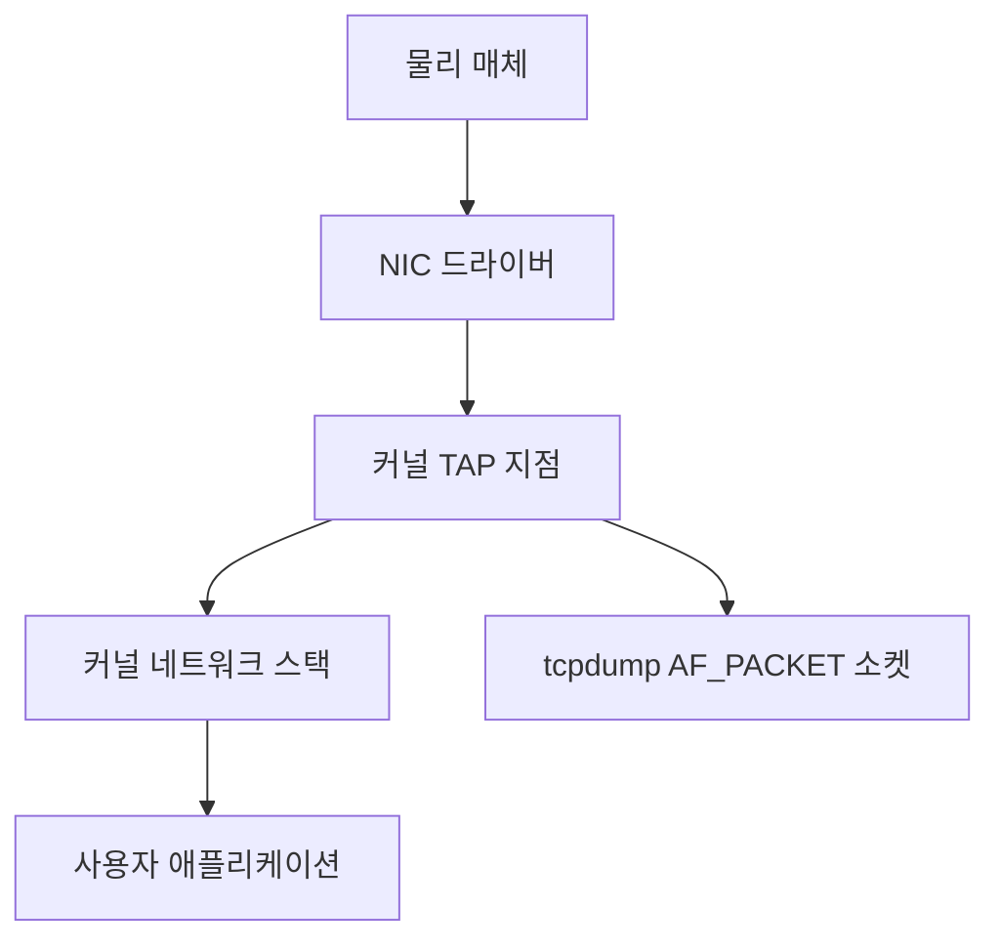

# 패킷 분석 (tcpdump · Wireshark · tshark)

네트워크 장애의 마지막 진실은 **와이어에 흐르는 비트**에 있다.
애플리케이션 로그가 `"connection reset"`이라고 해도
그게 SYN 단계인지, TLS 핸드셰이크인지, 중간 LB가 끊은 건지는
패킷을 직접 봐야 확정된다.

이 글은 **어떤 도구를 · 언제 · 어떻게** 쓰는지를 실무 관점에서 정리한다.

---

## 1. 도구 선택 매트릭스

| 상황 | 권장 도구 | 이유 |
|---|---|---|
| 프로덕션 서버 SSH 접속 중 | `tcpdump` | 거의 모든 리눅스에 기본 설치 |
| 큰 캡처 파일을 CLI로 분석 | `tshark` | Wireshark 엔진을 터미널에서 |
| 복잡한 프로토콜 분해, 시각화 | Wireshark GUI | 색상, 흐름 그래프, RTT 분석 |
| K8s 파드 트래픽 | `kubectl debug` + tcpdump 또는 Inspektor Gadget | 네임스페이스 진입 필요 |
| 대규모 연속 관측 | eBPF 기반 도구 (Pixie, Cilium Hubble) | 오버헤드 낮고 선택적 |
| 10Gbps 이상 회선 | `netsniff-ng`, AF_PACKET v3, DPDK | tcpdump로는 드롭 발생 |

**실무 공식**:
1. **캡처는 tcpdump** (어디서나 구함, 가볍다)
2. **분석은 Wireshark** (pcap 파일 다운로드 후)
3. **자동화·대용량은 tshark** (배치·파이프라인)

---

## 2. 패킷 캡처 원리

### 2-1. 스택 전경



| 구성 요소 | 역할 |
|---|---|
| NIC 드라이버 | 프레임을 링 버퍼에 올린다 |
| TAP 지점 | 커널이 모든 인입 프레임을 복제해 소켓에 전달 |
| AF_PACKET 소켓 | tcpdump가 커널과 연결되는 인터페이스 |
| libpcap | tcpdump·Wireshark 공통 캡처 라이브러리 |
| BPF 필터 | 커널 내부에서 패킷을 선별 — 사용자 공간 복사 비용 절감 |

### 2-2. BPF는 왜 중요한가

BPF(Berkeley Packet Filter)는 **커널 안에서 필터를 평가**하기 때문에
- 매칭 안 되는 패킷은 **사용자 공간으로 복사되지 않는다**
- CPU·메모리 비용이 극적으로 줄어든다
- 프로덕션에서 `tcpdump host 1.2.3.4`처럼 **좁은 필터**가 필수인 이유

> 필터 없이 tcpdump를 돌리면 고트래픽 서버에서
> **CPU 점유 급증 + 패킷 드롭** 위험이 크다.

### 2-3. pcap vs pcapng

| 포맷 | 확장자 | 특징 |
|---|---|---|
| pcap (classic) | `.pcap` | 단순, 단일 링크 타입만 기록 |
| pcapng | `.pcapng` | 다중 인터페이스, 주석, 타임스탬프 정밀도 확장 |

현대 Wireshark·tshark는 기본을 **pcapng**으로 쓰지만,
자동화 파이프라인·구형 도구와의 호환은 `-F pcap`으로 강제 가능.

---

## 3. tcpdump 실전

### 3-1. 자주 쓰는 플래그

| 플래그 | 용도 |
|---|---|
| `-i <iface>` | 캡처할 인터페이스 (`any`는 모든 인터페이스) |
| `-n` | IP·포트 숫자 그대로 (DNS 역조회 끔) |
| `-nn` | `-n` + 서비스 이름도 해석 안 함 |
| `-w file.pcap` | 파일 저장 (나중에 Wireshark로 분석) |
| `-r file.pcap` | 파일 재생 |
| `-c <N>` | N개만 잡고 종료 |
| `-s <N>` | 스냅 길이 (바이트). 기본 262144. `-s 0`은 "전체"가 아니라 **기본값으로 리셋** |
| `-tttt` | 사람이 읽는 절대 타임스탬프 |
| `-v / -vv / -vvv` | 상세도 증가 |
| `-e` | L2 헤더(MAC) 포함 출력 |
| `-X` | 헥스·ASCII 동시 출력 (페이로드 분석용) |
| `-A` | ASCII만 출력 (HTTP 등 평문) |
| `-Z <user>` | 캡처 시작 후 권한 하향 (root 유지 금지) |
| `-G <sec>` | 시간 기반 회전. strftime 포맷을 `-w`에 함께 써야 의미 있음 |
| `-C <units>` | 크기 기반 회전. 단위는 **백만 바이트(1,000,000 B)** — `-C 1000`은 약 0.93 GiB |
| `-W <N>` | `-G` 또는 `-C`와 함께 보관 개수 한정. `-G`+`-C`+`-W` 동시 지정 시 `-W`는 파일명에만 영향 |

### 3-2. 필수 패턴

```bash
# 가장 기본 — 특정 호스트로 가는 모든 트래픽
tcpdump -i eth0 -nn host 10.0.0.5

# 특정 포트 (양방향)
tcpdump -i any -nn port 443

# 저장 후 나중에 분석 (SSH 세션 끊겨도 데이터 안전)
tcpdump -i eth0 -nn -w /tmp/debug.pcap host 10.0.0.5

# 크기 기반 회전: 약 1,000MB(0.93GiB)마다 새 파일, 최대 5개 (capture.pcap, .pcap1 ...)
tcpdump -i eth0 -nn -w /tmp/capture.pcap \
  -C 1000 -W 5 -Z tcpdump host 10.0.0.5

# 시간 기반 회전: 1시간마다 새 파일 (strftime은 -G와 함께만 동작)
tcpdump -i eth0 -nn -w '/tmp/capture-%Y%m%d-%H.pcap' \
  -G 3600 -W 24 -Z tcpdump host 10.0.0.5

# TCP SYN만 (연결 시도 추적) — SYN 비트만 켜진 패킷
tcpdump -i eth0 -nn 'tcp[tcpflags] & (tcp-syn|tcp-ack) == tcp-syn'

# 페이로드에 특정 문자열 (HTTP Host 헤더 등)
tcpdump -i eth0 -nn -A 'tcp port 80' | grep Host
```

### 3-3. 드롭 감지

```bash
# 캡처 종료 시 통계 출력:
#   12345 packets captured
#   12400 packets received by filter
#   55 packets dropped by kernel   ← 이 수치가 0이 아니면 문제
```

**드롭 대응**:
- 필터를 더 좁힌다
- `-B <KiB>`로 커널 버퍼 크기를 늘린다 (예: `-B 4096` = 4 MiB, 기본 2 MiB)
- 실시간 대화식 디버깅에서 표시 지연이 거슬리면 `--immediate-mode` (libpcap 1.5+)
- 파일 저장 디스크의 IO 경합 확인
- 10Gbps 이상은 `netsniff-ng`, AF_PACKET mmap, AF_XDP, PF_RING

---

## 4. BPF 필터 문법

### 4-1. 기본 문법

```
[proto] [dir] [type] [id]
```

| 요소 | 값 예시 |
|---|---|
| proto | `tcp`, `udp`, `icmp`, `arp`, `ip`, `ip6`, `ether` |
| dir | `src`, `dst`, (양방향) |
| type | `host`, `net`, `port`, `portrange` |
| id | 값 (IP, 포트, CIDR) |

### 4-2. 실전 필터 모음

| 시나리오 | 필터 |
|---|---|
| 단일 호스트 양방향 | `host 10.0.0.5` |
| 송신만 | `src 10.0.0.5` |
| 서브넷 | `net 10.0.0.0/24` |
| 포트 범위 | `portrange 5000-6000` |
| 호스트 + 포트 | `host 10.0.0.5 and port 443` |
| HTTP + HTTPS 제외 DNS | `(port 80 or 443) and not port 53` |
| 멀티캐스트 포함 | `multicast` |
| 특정 MAC | `ether host aa:bb:cc:dd:ee:ff` |
| VLAN 100만 | `vlan 100` |
| TCP 플래그 비트 매칭 | `tcp[tcpflags] & tcp-rst != 0` |
| 페이로드 길이 | `greater 1000` |
| IP fragment (MF=1 또는 offset>0) | `ip[6:2] & 0x3fff != 0` |
| Fragment offset만 (첫 조각 제외) | `ip[6:2] & 0x1fff != 0` |

### 4-3. 플래그 매칭 치트시트

| 관심사 | 필터 |
|---|---|
| SYN (연결 시작) | `tcp[tcpflags] & (tcp-syn\|tcp-ack) == tcp-syn` |
| SYN-ACK | `tcp[tcpflags] & (tcp-syn\|tcp-ack) == (tcp-syn\|tcp-ack)` |
| RST (강제 종료) | `tcp[tcpflags] & tcp-rst != 0` |
| FIN (정상 종료) | `tcp[tcpflags] & tcp-fin != 0` |

> 비트 연산은 **괄호**로 묶어 한 번의 AND 연산으로 표현하는 것이 관례다.
> 여러 번 AND 연산을 `and`로 이어 붙이면 동작은 같아도 가독성이 낮고
> 구현·파서에 따라 오해를 만들 수 있다.

**주의**: VXLAN·Geneve 오버레이 내부 트래픽은 외부 헤더 기준으로는 필터가 안 맞는다.
안에서 돌리거나, `vxlan` 키워드 또는 UDP 포트(4789)를 기준으로 잡아야 한다.

---

## 5. tshark 실전

tshark는 **Wireshark 엔진을 CLI로 쓰는 도구**다.
프로토콜 해석 수준이 tcpdump보다 깊다.

### 5-1. 기본 사용

```bash
# 인터페이스 목록
tshark -D

# 실시간 캡처 + 필터
tshark -i eth0 -f "tcp port 443" -Y "tls.handshake.type == 1"

# 파일 재생 + 필드 추출 (CSV 파이프라인용)
tshark -r capture.pcapng -Y "http.request" \
  -T fields -e http.host -e http.request.uri -e ip.src

# 실시간 HTTP 요청 헤더만 뽑기
tshark -i eth0 -Y "http.request" -T fields \
  -e frame.time -e ip.src -e http.host -e http.request.uri
```

### 5-2. Capture Filter vs Display Filter

| 구분 | 적용 시점 | 문법 | 예시 |
|---|---|---|---|
| Capture Filter (`-f`) | 캡처 시 (BPF) | tcpdump 문법 | `tcp port 443` |
| Display Filter (`-Y`) | 해석 후 | Wireshark 문법 | `tls.handshake.type == 1` |

**원칙**:
- **Capture Filter로 먼저 좁혀라** — 용량·CPU·드롭 방지
- **Display Filter로 정밀 분석** — 캡처 끝난 뒤 여러 번 반복 가능

### 5-3. 자주 쓰는 Display Filter

| 목적 | 필터 |
|---|---|
| HTTP 요청만 | `http.request` |
| 특정 URL | `http.request.uri contains "/api"` |
| TLS Client Hello | `tls.handshake.type == 1` |
| TLS 인증서 | `tls.handshake.type == 11` |
| 재전송 | `tcp.analysis.retransmission` |
| 0-window | `tcp.analysis.zero_window` |
| RTT 이상 | `tcp.analysis.ack_rtt > 0.5` |
| DNS 응답 | `dns.flags.response == 1` |
| ICMP 불가 | `icmp.type == 3` |

---

## 6. Wireshark GUI 필살기

### 6-1. Follow Stream

한 TCP 세션 전체를 한 화면에서 재조립.
`Right-click → Follow → TCP/TLS/HTTP Stream`.
HTTP 요청·응답을 **사람이 읽는 형태로** 본다.

### 6-2. Expert Information

`Analyze → Expert Information`이
전체 캡처에서 **이상 징후**를 자동 탐지한다.

| 분류 | 의미 |
|---|---|
| Chat | 정상 이벤트 |
| Note | 주목할 만한 일 (keep-alive, window 변화) |
| Warning | 주의 (retransmission, duplicate ACK) |
| Error | 명백한 문제 (checksum fail, malformed) |

### 6-3. I/O Graphs

`Statistics → I/O Graphs`로 시간당 처리량·에러를 시각화.
**"특정 시각에만 느렸다"**를 입증할 때 필수.

### 6-4. TLS 복호화

TLS 트래픽도 다음이 있으면 복호화 가능:
- **SSLKEYLOGFILE** 환경변수로 기록된 세션 키 파일
  (브라우저·curl·Node.js·Go 모두 지원)
- RSA 프라이빗 키 (Forward Secrecy 사용 시 **불가**)

**현대 실무에서는 SSLKEYLOGFILE 방식이 사실상 표준**이다.
TLS 1.3은 전부 PFS이고, TLS 1.2도 ECDHE 계열 암호 스위트를 쓰면
**RSA 프라이빗 키로 복호화할 수 없다** — PFS의 전제는 동일하다.

```bash
export SSLKEYLOGFILE=/tmp/sslkeys.log
curl https://example.com
# Wireshark → Preferences → Protocols → TLS → (Pre-)Master Secret Log
```

| 언어·도구 | SSLKEYLOGFILE 지원 |
|---|---|
| 브라우저 (Chrome·Firefox) | 환경변수로 바로 지원 |
| curl (OpenSSL·NSS·wolfSSL 빌드) | 지원 |
| Node.js | 지원 (`--tls-keylog=/path/to/file`) |
| Go | 지원 (`tls.Config.KeyLogWriter`) |
| Python (ssl 모듈) | 지원 (`context.keylog_filename`) |
| Java (JDK) | **기본 미지원** — `jSSLKeyLog` agent 또는 `-Djavax.net.debug=ssl:handshake` 필요 |

> SSLKEYLOGFILE은 개발·디버깅 전용이다.
> 운영 환경에 남기면 **트래픽 전체가 복호화 가능**해지므로
> 배포 이미지·쿠버네티스 컨피그에서 누락되는지 반드시 확인한다.

---

## 7. 캡처 파일 관리

### 7-1. 파일 회전 전략

| 플래그 | 의미 |
|---|---|
| `-G <sec>` | 초 단위 회전 |
| `-C <MB>` | 크기 단위 회전 |
| `-W <N>` | 최대 파일 개수 (링 버퍼) |

**프로덕션 권장**: `-C 1000 -W 10` (약 0.93 GiB × 10 = 최대 9.3 GiB).
24시간 로그처럼 쓰고 장애 직후 구간만 추출.
`-G`와 `-C`를 동시에 쓰면 `-W`는 파일명 템플릿만 영향하므로,
**시간·크기 중 하나만 선택**하는 것이 안전하다.

### 7-2. 합치기·쪼개기·변환

| 작업 | 도구 |
|---|---|
| 여러 pcap 병합 | `mergecap -w out.pcap a.pcap b.pcap` |
| 패킷 개수 기준 분할 | `editcap -c <N> in.pcap out.pcap` |
| 시간 기준 분할 | `editcap -i <seconds> in.pcap out.pcap` |
| 시간 구간 잘라내기 | `editcap -A <start> -B <end> in.pcap out.pcap` |
| IP 스크램블·익명화 | `tcprewrite --seed=...`, `pktanon` |
| TLS 키 임베드 (복호화용) | `editcap --inject-secrets tls,keys.log in.pcap out.pcapng` |
| 포맷 변환 | `editcap -F pcap in.pcapng out.pcap` |
| 통계 요약 | `capinfos capture.pcapng` |

---

## 8. 프로덕션 주의사항

### 8-1. 성능

| 리스크 | 완화 |
|---|---|
| 넓은 필터 → CPU 급증 | 호스트·포트로 최대한 좁히기 |
| 디스크 IO 병목 | 별도 디스크, `-C`·`-W`로 회전 |
| 커널 드롭 | `-B 4096` 이상, `net.core.rmem_max` 상향 |
| 10G+ 초과 | netsniff-ng, PF_RING, AF_XDP |

### 8-2. 보안·컴플라이언스

| 리스크 | 대응 |
|---|---|
| 평문 페이로드 노출 (HTTP, 평문 DB) | **암호화 우선**. 불가피하면 캡처 파일 접근 제어 |
| PII·카드번호 기록 | 익명화 또는 페이로드 제외 (`-s 68`로 헤더만) |
| TLS 키 로그 유출 | `SSLKEYLOGFILE`은 개발 환경만, 배포 금지 |
| 루트 권한 | tcpdump 사용자를 CAP_NET_RAW 그룹으로 분리, `-Z` 필수 |
| 감사 | 캡처 실행자·호스트·필터·기간을 중앙 로깅(SIEM)에 적재, 변경관리 티켓 연결 |

> **페이로드 스냅 제한**이 실무 기본이다.
> `-s 96` 정도면 L2~L4 헤더 + TLS Hello 앞부분까지 잡히면서
> 본문은 기록하지 않는다.

### 8-3. 캡처 권한 분리 (루트 회피)

```bash
# 바이너리에 capability만 부여 — setuid 대신 권장
sudo setcap 'cap_net_raw,cap_net_admin=eip' /usr/bin/tcpdump

# 특정 그룹만 사용 가능하게
sudo groupadd pcap
sudo chgrp pcap /usr/bin/tcpdump
sudo chmod 750 /usr/bin/tcpdump
```

---

## 9. Kubernetes·컨테이너 환경

### 9-1. 어려운 이유

- 파드는 **별도 네트워크 네임스페이스**에 있다
- 호스트에서 `tcpdump -i eth0`만으로는 파드 트래픽이 잡히지 않을 수 있다
- CNI·Service·Ingress 계층마다 패킷이 변형된다 (SNAT·DNAT·오버레이)

### 9-2. 접근 방법

| 방법 | 언제 |
|---|---|
| `kubectl debug <pod> --image=nicolaka/netshoot` | 파드 내부에서 tcpdump |
| `kubectl debug node/<node>` | 노드 네트워크 네임스페이스 진입 |
| Sidecar ephemeral container | 파드 제거 없이 진입 |
| Inspektor Gadget | eBPF 기반, 전체 노드 관찰 |
| Cilium Hubble | Cilium CNI 전용, L3~L7 흐름 관찰 |

### 9-3. 실전 예시

```bash
# 1. 파드에 임시 netshoot 컨테이너 붙이기 (파드 레벨 트래픽)
kubectl debug -it mypod --image=nicolaka/netshoot -- /bin/bash

# 2. 파드 안에서 캡처
tcpdump -i eth0 -nn -w /tmp/pod.pcap host 10.0.0.5

# 3. 파일 꺼내기
kubectl cp mypod:/tmp/pod.pcap ./pod.pcap

# 노드 레벨 접근 (호스트 네트워크·CNI 데이터 경로까지)
kubectl debug node/<node-name> -it --image=nicolaka/netshoot
# 진입 후 chroot /host 또는 nsenter로 호스트 네임스페이스 진입 가능
```

> Ephemeral container는 **생성 즉시 대상 파드의 네트워크 네임스페이스를 공유**하므로
> tcpdump로 파드 트래픽을 캡처하는 데는 `--target`이 필요 없다.
> `--target=<컨테이너명>`은 **프로세스(PID) 네임스페이스 공유** 옵션이며,
> `/proc/<pid>/net/*` 접근이나 `strace` 같은 작업 시 유용하다.
> 컨테이너 런타임(containerd·CRI-O)이 `shareProcessNamespace`를 지원해야 한다.

---

## 10. 현대 대안 — eBPF 기반 관측

tcpdump는 여전히 최고지만, **대규모 연속 관측**에는 eBPF 기반이 낫다.

| 도구 | CNCF 성숙도 (2026-04) | 특징 |
|---|---|---|
| **Cilium Hubble** | Cilium: Graduated | CNI가 Cilium이면 즉시 사용. L3~L7 흐름 기록. |
| **Pixie** | Sandbox | K8s 자동 계측, PxL 스크립트 기반 분석 |
| **Inspektor Gadget** | Sandbox | kubectl 플러그인, 시스템콜·네트워크 이벤트 |
| **KubeShark** | 별도 오픈소스 | API 트래픽(HTTP·gRPC·Kafka) 전용 시각화 |
| **Retina (Microsoft)** | 별도 오픈소스 | eBPF 기반 K8s 네트워크 관측 (Azure 주도) |
| **bpftrace** | 별도 | 애드훅 BPF 스크립트 실행 |

| 비교 | tcpdump | eBPF (Hubble 등) |
|---|---|---|
| 프로덕션 상시 관측 | 부담 큼 | 가볍게 가능 |
| 페이로드 전체 | 가능 (주의) | 일반적으로 메타데이터만 |
| 설치 | 기본 설치 | CNI·플랫폼 의존 |
| 세부 프로토콜 분석 | 최강 (Wireshark) | 프로토콜별 제한 |

**결론**: **이벤트 감지·장기 추적은 eBPF**, **정밀 해부는 pcap + Wireshark**로 조합.

---

## 11. 실전 시나리오 5선

### 시나리오 1 — "연결은 되는데 TLS에서 끊긴다"

```bash
tcpdump -i any -nn -w /tmp/tls.pcap 'host api.example.com and port 443'
# 몇 회 재현 후 중단
```

Wireshark에서:
- `tls.handshake.type == 1` 필터 → Client Hello 확인
- `tls.handshake.type == 2` → Server Hello가 없다면
  **SNI 미스매치 · 서버 TLS 버전/암호 스위트 협상 실패 ·
  중간 방화벽의 TLS 인스펙션 개입** 중 하나
- Alert 레코드(`tls.record.content_type == 21`) → 실패 사유 즉시 확인

### 시나리오 2 — "간헐적 502"

LB→백엔드 구간 캡처:
```bash
tcpdump -i eth0 -nn -w /tmp/502.pcap \
  'host <backend_ip> and port 8080'
```

Display Filter: `tcp.analysis.retransmission or tcp.flags.reset == 1`
→ RST가 백엔드에서 왔는지 LB에서 왔는지 방향 확인.

### 시나리오 3 — "DNS 응답이 늦다"

```bash
tcpdump -i any -nn 'port 53' -w /tmp/dns.pcap
```
- Display Filter: `dns.time > 0.1` → 응답이 100ms 초과인 쿼리
- `dns.flags.truncated == 1` → UDP 512B 초과로 잘림, TCP 재질의 발생 (성능 저하)

### 시나리오 4 — "TCP 연결이 한참 있다가 끊긴다"

- `tcp.analysis.keep_alive` → keep-alive로 유지됨
- `tcp.flags.reset == 1 and tcp.analysis.ack_lost_segment` → 중간 NAT/방화벽 idle timeout
- 대책: keep-alive 간격 ↓, LB idle timeout ↑

### 시나리오 5 — "K8s에서 Service DNS가 간헐적으로 실패"

파드 안에서:
```bash
tcpdump -i eth0 -nn port 53 -w /tmp/coredns.pcap
```
- `dns.flags.rcode != 0` → CoreDNS가 NXDOMAIN 반환
- 기본 `ndots: 5` 때문에 짧은 이름 하나가 **search 경로 수만큼** 쿼리로 증폭되어
  CoreDNS 부하와 지연이 누적. 자세한 원리와 튜닝은 [DNS 설정](../dns/dns-config.md)

---

## 12. 요약

| 선택 | 기준 |
|---|---|
| **tcpdump** | 어디서나 쓸 수 있는 캡처 주력 |
| **tshark** | 스크립트·대용량·필드 추출 |
| **Wireshark** | 정밀 해부, 프로토콜 시각화 |
| **SSLKEYLOGFILE** | TLS 1.3/PFS 복호화 유일한 현실적 방법 |
| **eBPF (Hubble·Pixie)** | 대규모 상시 관측 |
| **스냅 제한·필터 좁히기** | 프로덕션 기본 위생 |
| **kubectl debug --target** | 파드 네임스페이스 진입 필수 옵션 |

---

## 참고 자료

- [tcpdump(1) · libpcap 공식](https://www.tcpdump.org/) — 확인: 2026-04-20
- [Wireshark User's Guide](https://www.wireshark.org/docs/wsug_html_chunked/) — 확인: 2026-04-20
- [Wireshark Display Filter Reference](https://www.wireshark.org/docs/dfref/) — 확인: 2026-04-20
- [RFC 1761 — snoop Version 2 Packet Capture File Format](https://www.rfc-editor.org/rfc/rfc1761)
- [Cloudflare Blog — Diagnosing network issues](https://blog.cloudflare.com/tag/debugging/) — 확인: 2026-04-20
- [Linux kernel — AF_PACKET v3, PACKET_MMAP](https://www.kernel.org/doc/html/latest/networking/packet_mmap.html) — 확인: 2026-04-20
- [Cilium Hubble docs](https://docs.cilium.io/en/stable/gettingstarted/hubble/) — 확인: 2026-04-20
- [Inspektor Gadget docs](https://inspektor-gadget.io/docs/) — 확인: 2026-04-20
- [Pixie docs](https://docs.px.dev/) — 확인: 2026-04-20
