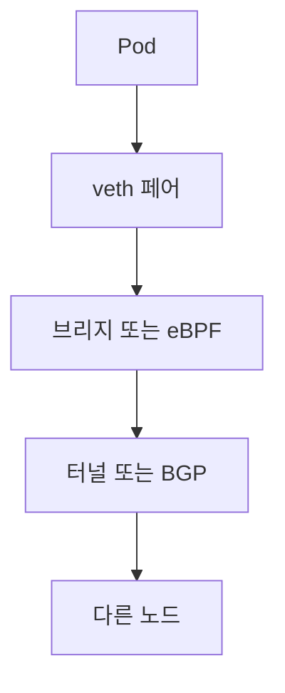
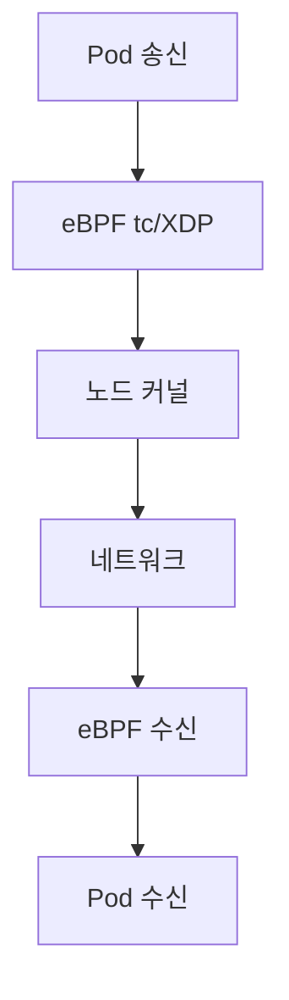

# CNI 비교 (Calico · Cilium · Flannel · AWS VPC CNI)

Kubernetes의 **네트워크는 클러스터가 스스로 해결하지 않는다.**
CNI(Container Network Interface) 플러그인이 Pod에 IP를 주고,
Pod 간 통신 경로를 만들고, NetworkPolicy를 강제한다.

CNI 선택은 성능·기능·운영 복잡도의 균형 문제다.
**한번 정하면 바꾸기 어려운** 결정이므로 특성을 정확히 이해해야 한다.

> 서비스 메시(L7)는 [Service Mesh](./service-mesh.md).
> K8s NetworkPolicy 리소스 자체는 `kubernetes/` 카테고리로.

---

## 1. CNI가 하는 일

| 책임 | 상세 |
|---|---|
| IP 할당 (IPAM) | 각 Pod에 고유 IP 부여 |
| 네트워크 설정 | veth pair, 브리지, 라우트 테이블 구성 |
| Pod 간 통신 | 같은 노드, 다른 노드 |
| 외부 통신 | NAT, Service, 인터넷 |
| NetworkPolicy | 3계층 이상 트래픽 제어 |
| 암호화 (옵션) | 노드 간 WireGuard / IPsec |
| 관측 (옵션) | 흐름 로그, eBPF 이벤트 |

CNI 표준은 **스펙만 정의** — 구현은 플러그인별로 매우 다르다.

---

## 2. 기술 선택 축

### 2-1. 데이터 플레인

| 데이터플레인 | 방식 | 대표 |
|---|---|---|
| Linux bridge + iptables | 전통 | kube-proxy, Flannel |
| 순수 L3 라우팅 (BGP) | 오버헤드 없음 | Calico BGP |
| 오버레이 (VXLAN/Geneve) | 어느 네트워크에서도 동작 | Flannel VXLAN, Calico VXLAN |
| eBPF | 커널 훅, 정책·LB·라우팅 통합 | Cilium, Calico eBPF 모드 |
| 클라우드 SDN | 클라우드 네이티브 ENI | AWS VPC CNI, Azure CNI |

### 2-2. 오버레이 vs 언더레이

| 오버레이 | 언더레이 (Native) |
|---|---|
| VXLAN·Geneve·GRE 터널로 Pod IP를 감쌈 | Pod IP를 노드 네트워크에 **직접 라우팅** |
| 기반 네트워크 변경 불필요 | BGP·라우팅 테이블 조작 필요 |
| 오버헤드(50~80B), 이중 캡슐화 주의 | 오버헤드 없음, 성능 최고 |
| 네트워크팀 독립적 | 네트워크팀·클라우드와 협업 |

---

## 3. 주요 CNI 비교

| 항목 | Flannel | Calico | **Cilium** | AWS VPC CNI |
|---|---|---|---|---|
| 데이터플레인 | VXLAN 기본, host-gw | iptables → BGP/VXLAN/**eBPF** | **eBPF** (기본), Envoy L7 | ENI 직접 할당 |
| Pod IP | 오버레이 | 언더레이(BGP) 또는 오버레이 | 선택 가능 | **VPC IP 직접** |
| NetworkPolicy | 없음 (기본) | 강력 (Calico 전용 확장) | 매우 강력 (L3~L7) | **v1.14+ 네이티브 (eBPF)** |
| L7 정책 | — | 제한적 | **HTTP, Kafka, DNS, gRPC** | — |
| 암호화 | 없음 | WireGuard·IPsec | WireGuard·IPsec | 없음 |
| 관측 | 없음 | Felix 로그 | **Hubble** | VPC Flow Log |
| 서비스 메시 | 없음 | — | **Cilium Service Mesh** | — |
| 성능 | 낮음 (VXLAN) | 높음 (BGP) | **최고** (eBPF + 커널 데이터패스 바이패스) | 높음 (native) |
| 운영 복잡도 | 낮음 | 중간 | **상대적으로 높음** | 낮음 (EKS 기본) |
| CNCF 성숙도 | — | CNCF 미등재 (Tigera 주도) | **Graduated** (2023-10) | — |
| 주 사용처 | 학습·간단 환경 | 온프레·멀티클라우드 | **프로덕션 표준** (관측·성능) | AWS EKS 기본 |

---

## 4. Flannel

### 4-1. 특징

- 가장 단순한 CNI, 학습·개발 환경에 적합
- **VXLAN(기본)** 또는 host-gw(같은 L2) 모드
- NetworkPolicy **미지원** — 필요하면 Calico를 policy-only로 얹음

### 4-2. 언제 쓰는가

- 미니 클러스터, 학습용 kubeadm 클러스터
- IPsec·관측·정책이 필요 없는 환경
- 부트스트랩용 임시 CNI

### 4-3. 한계

- 기능·관측 부족 → 프로덕션 부적합
- 현대 프로덕션은 대부분 **Cilium 또는 Calico**로 대체

---

## 5. Calico

### 5-1. 데이터 플레인 옵션

| 모드 | 특징 |
|---|---|
| **BGP** (기본) | 노드가 TOR/fabric과 eBGP — 언더레이 통합 |
| VXLAN | BGP 불가한 환경 대응 |
| IPIP | 오래된 모드, VXLAN 선호 |
| **eBPF 모드** | kube-proxy 대체, eBPF 데이터패스 |
| WireGuard | 노드 간 Pod 트래픽 암호화 |

### 5-2. 장점

- **NetworkPolicy**의 사실상 표준 (GlobalNetworkPolicy 등 확장)
- BGP로 **언더레이 통합** — 클라우드/온프레 어디서나
- 대규모 클러스터 운영 경험 풍부
- **Typha**로 컨트롤 플레인 수평 확장

### 5-3. 한계

- L7 기능은 상대적으로 약함
- 메시·관측 측면은 Cilium 대비 부족
- BGP 통합 환경이 아니면 VXLAN으로 회귀 → 이점 감소

### 5-4. Calico Open Source vs Enterprise (Tigera)

- OSS는 핵심 기능 충분
- **Tigera Enterprise**는 관측·컴플라이언스·멀티클러스터·eBPF 확장

---

## 6. Cilium

### 6-1. 데이터 플레인의 혁신

- iptables 체인을 **eBPF 맵 조회**로 대체 → 규모에 따라 수배 이상 성능
- **kube-proxy 제거** 가능 (eBPF가 Service LB까지 처리)
- **XDP**로 DDoS 필터를 NIC 수준에서 적용

### 6-2. 핵심 기능

| 기능 | 내용 |
|---|---|
| L3~L4 NetworkPolicy | 표준 + 확장(FQDN, Entity) |
| **L7 정책** | HTTP, Kafka, DNS, gRPC 메서드/경로 기반 |
| **Hubble** | 분산 관측, L3~L7 흐름 로깅 |
| Cluster Mesh | 여러 클러스터 간 서비스 디스커버리·mTLS |
| **Cilium Service Mesh** | 사이드카리스 mesh (L4) + Envoy(L7 필요 시) |
| Transparent Encryption | WireGuard / IPsec |
| Gateway API | 네이티브 구현 |
| Egress Gateway | 특정 네임스페이스 트래픽을 지정 노드 NAT로 |

### 6-3. Cilium 선택 이유

- **관측성**: Hubble이 사실상 표준
- **성능**: 대규모 클러스터에서 iptables의 O(N) 지옥 회피
- **통합**: CNI + 서비스 메시 + L7 정책 + 암호화 한 스택
- **미래**: eBPF 생태계의 중심

### 6-4. 고려할 점

- **운영 복잡도 높음** — eBPF·커널 버전 의존성
- Ingress·Gateway API는 다른 구현과 경쟁 중 (Istio Gateway, Contour 등)
- 최신 기능이 빠르게 추가돼 **버전 업 주기가 짧음**

---

## 7. AWS VPC CNI

### 7-1. 특성

- Pod에 **VPC 프라이빗 IP 직접 할당**
- ENI를 Pod에 매핑 → 성능·보안 그룹·IAM·VPC 통합이 자연스러움
- EKS **기본 CNI**

### 7-2. 장점

- **오버헤드 없음** — VPC 네이티브
- SG for Pods, Pod IAM으로 **Pod 단위 보안** 가능
- AWS 관측·Flow Log·PrivateLink와 직접 연동

### 7-3. 한계와 현재 상태

- **IP 고갈** — Pod IP가 VPC CIDR 소모. 대응 3축:
  - **Prefix Delegation**: ENI에 /28(16 IP) IPv4 접두사 또는 /80 IPv6 접두사 부여 (Nitro 인스턴스 필수)
  - **VPC Secondary CIDR**: 추가 CIDR로 VPC 확장
  - **Custom Networking**: Pod를 별도 서브넷(예: 100.64/10)에 배치
- **NetworkPolicy**는 **v1.14 (2023-08, K8s 1.25+)부터 eBPF 기반 네이티브 지원**.
  표준 K8s NetworkPolicy만 쓴다면 Calico/Cilium 불필요.
  L7 정책이나 FQDN 정책 등 고급 기능이 필요하면 여전히 Cilium chaining이 흔함
- 멀티 클라우드·온프레 이동 어려움
- 일부 엣지 기능(Egress Gateway 등)은 없음

### 7-4. Chaining

Cilium을 `chaining` 모드로 VPC CNI 위에 얹어 **L7 정책·관측**만 추가하는 패턴이 흔하다.

---

## 8. 그 외 주요 CNI

| 이름 | 특징 |
|---|---|
| **Azure CNI** | AKS 기본, VPC CNI와 유사 모델. Azure CNI Overlay·Powered by Cilium 제공 |
| **GKE Dataplane V2** | Cilium 기반, GKE 기본 신규 옵션 |
| **OpenShift OVN-Kubernetes** | Geneve 오버레이, EgressIP·Multi-NIC 특화 |
| **kube-router** | BGP + IPVS, 경량 |
| **Antrea** | Open vSwitch 기반, Broadcom(구 VMware) 주도, **CNCF Sandbox** |
| **Weave Net** | 레거시, 신규 채택 드묾 |
| **Multus** | Pod에 **여러 NIC** 부착 (통신사·전용 워크로드) |

**GKE Dataplane V2**는 Cilium을 기반으로 하지만 Google의 매니지드 버전이다.
**Azure CNI Powered by Cilium**도 같은 맥락.

---

## 9. 선택 기준

### 9-1. 시나리오별

| 시나리오 | 추천 |
|---|---|
| AWS EKS 일반 | AWS VPC CNI (+ Cilium chaining) |
| EKS 대규모·관측 중시 | **Cilium** (기본 CNI 대체) |
| Azure AKS | Azure CNI Powered by Cilium |
| GCP GKE | Dataplane V2 (= Cilium 기반) |
| 온프레 BGP 가능 | **Calico BGP** 또는 Cilium |
| 온프레 BGP 불가 | Calico VXLAN 또는 Cilium VXLAN |
| 엔터프라이즈 보안·감사 | Calico Enterprise · Cilium Enterprise |
| 학습·개발 | Flannel, K3s 기본 |
| 멀티 클러스터 | **Cilium Cluster Mesh** |

### 9-2. "쓰면 안 되는" 조합

- **Flannel + 프로덕션** — NetworkPolicy 없음
- **VPC CNI + 고밀도 Pod** (IP 고갈 위험 — Prefix delegation 필수)
- **Calico IPIP + 클라우드 하이브리드** (MTU 이중 캡슐 혼란)
- **kube-proxy iptables + 수천 Service** (규모 성능 붕괴 → Cilium 또는 IPVS)

---

## 10. 마이그레이션 주의

- CNI 교체는 **기존 Pod 전체 재시작** 필요
- 실전 경로는 둘 중 하나:
  - 신규 노드 풀에 새 CNI 설치 → 워크로드 drain·이전
  - **새 클러스터 blue/green 전환**
- NetworkPolicy·Pod IP 대역·Service CIDR을 **동일하게 유지**해야 이식 편함
- **Multus는 Pod에 여러 NIC를 부착하는 메타 CNI**이지 과도기 전환 도구가 아니다.
  정책·IPAM 충돌 우려로 CNI 교체 수단으로는 권장되지 않는다.

---

## 11. 관측 메트릭

| 메트릭 | 의미 |
|---|---|
| Pod IP 할당 시간 | IPAM 성능 |
| veth 생성 시간 | CNI 설정 속도 |
| NetworkPolicy 평가 시간 | 대규모 정책의 영향 |
| DNS 지연 (CoreDNS p99) | Cluster DNS 상태 |
| 노드 간 지연 | 오버레이·MTU 이슈 조짐 |
| Hubble 드롭 이벤트 (Cilium) | 정책 위반·에러 |
| Felix syncer lag (Calico) | 컨트롤 플레인 지연 |
| VPC CNI ENI 부족 경고 | IP 고갈 임박 |

---

## 12. 요약

| 주제 | 한 줄 요약 |
|---|---|
| 선택의 본질 | 성능·기능·운영 복잡도의 균형 |
| Flannel | 학습용, 프로덕션 부적합 |
| Calico | BGP 언더레이 표준, NetworkPolicy 정립 |
| Cilium | eBPF 데이터패스 + 관측 + 서비스 메시, 현대 표준 |
| AWS VPC CNI | VPC IP 직접 할당, IP 고갈 대응이 핵심 |
| 오버레이 vs 언더레이 | 성능·복잡도 트레이드오프 |
| 선택 후 바꾸기 어렵다 | 설계 단계에서 신중히 결정 |
| MTU | 오버레이는 항상 오버헤드 고려 |
| 암호화 | 노드 간 WireGuard/IPsec가 현대 기본 |
| 관측 | Hubble (Cilium) / Felix (Calico) / Flow Log (VPC) 조합 |

---

## 참고 자료

- [CNI 스펙](https://github.com/containernetworking/cni/blob/main/SPEC.md) — 확인: 2026-04-20
- [Calico docs](https://docs.tigera.io/calico/latest/) — 확인: 2026-04-20
- [Cilium docs](https://docs.cilium.io/en/stable/) — 확인: 2026-04-20
- [Cilium Hubble docs](https://docs.cilium.io/en/stable/gettingstarted/hubble/) — 확인: 2026-04-20
- [Flannel docs](https://github.com/flannel-io/flannel) — 확인: 2026-04-20
- [AWS VPC CNI](https://github.com/aws/amazon-vpc-cni-k8s) — 확인: 2026-04-20
- [EKS Networking Best Practices](https://aws.github.io/aws-eks-best-practices/networking/) — 확인: 2026-04-20
- [GKE Dataplane V2](https://cloud.google.com/kubernetes-engine/docs/concepts/dataplane-v2) — 확인: 2026-04-20
- [Azure CNI Powered by Cilium](https://learn.microsoft.com/en-us/azure/aks/azure-cni-powered-by-cilium) — 확인: 2026-04-20
- [Kubernetes NetworkPolicy](https://kubernetes.io/docs/concepts/services-networking/network-policies/) — 확인: 2026-04-20
