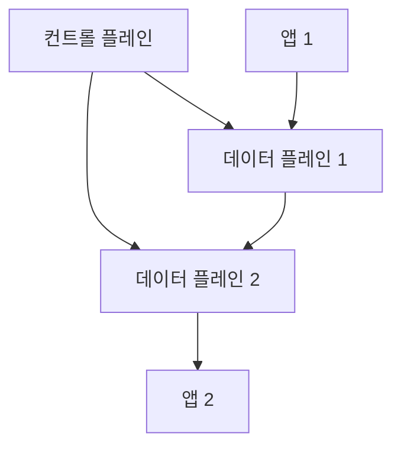
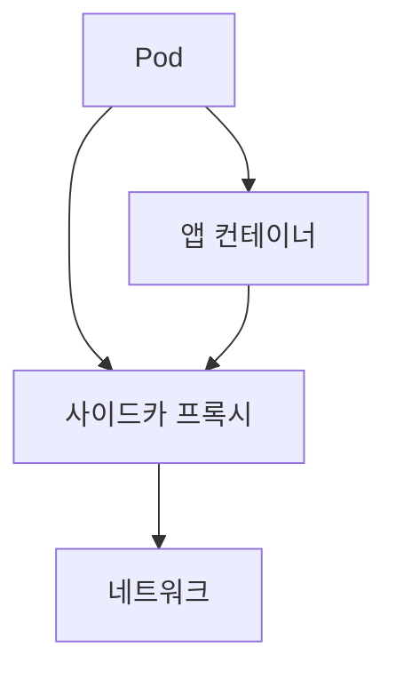
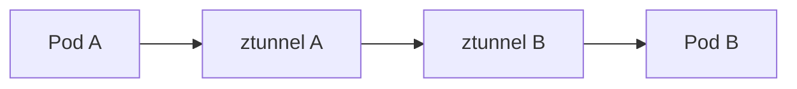

# Service Mesh (Istio · Linkerd · Cilium · Ambient)

서비스 메시는 **"앱 코드 밖에서 서비스 간 통신을 제어·관측·보안하는 인프라 계층"**이다.

전통적으로 앱이 했던 mTLS·재시도·서킷브레이커·관측·카나리·트래픽 정책을
**데이터 플레인(사이드카·노드 프록시)**이 가로채 처리하고,
**컨트롤 플레인**이 정책을 배포한다.

> 서비스 메시 **구현**은 이 글(네트워크), **Zero Trust 전략**은 `security/`,
> **Gateway API·K8s 리소스 매핑**은 `kubernetes/`로 분리.
> mTLS 기본은 [mTLS 기본](../tls-pki/mtls-basics.md), CNI 비교는 [CNI 비교](./cni-comparison.md).

---

## 1. 서비스 메시가 해결하는 문제

| 전통 앱의 책임 | 메시가 외부화 |
|---|---|
| 재시도·타임아웃 | 사이드카 정책 |
| 서킷 브레이커 | Outlier detection |
| mTLS·SPIFFE | 자동 인증서 발급·순환 |
| 관측 (지연·에러율) | 자동 tracing·metrics |
| 카나리·블루그린 | 정책 기반 트래픽 분할 |
| 지역 라우팅 | Locality LB |
| 인증·인가 | 정책 엔진 |

**한 줄 요약**: 앱이 해왔던 "네트워크 공통 관심사"를 **인프라 레이어로** 옮긴다.

---

## 2. 아키텍처 — 컨트롤 플레인과 데이터 플레인



| 구성 | 역할 |
|---|---|
| 컨트롤 플레인 | 정책·인증서·디스커버리 배포 |
| 데이터 플레인 | 실제 트래픽 처리 (프록시 또는 커널) |
| CA | 워크로드 인증서 발급 |
| xDS API | 컨트롤-데이터 플레인 간 표준 프로토콜 |

---

## 3. 배포 모델 진화

### 3-1. Sidecar (1세대)



- 각 Pod 안에 프록시를 추가 (Istio Envoy, Linkerd linkerd2-proxy)
- 앱이 의식하지 못한 채 **모든 트래픽을 가로챔**
- 장점: 완전한 L7 제어, 앱 격리
- 단점: 리소스·지연 오버헤드, 파드마다 사이드카 중복

### 3-2. Node-level (2세대)

- 노드 하나에 프록시(데몬셋)를 두고 여러 Pod이 공유
- 사이드카 오버헤드 제거
- Cilium Service Mesh, Istio Ambient ztunnel의 접근 방식

### 3-3. Ambient Mesh (Istio, 2024~)

**사이드카를 없애되 L4와 L7을 분리**하는 새로운 모델.

| 계층 | 컴포넌트 | 위치 |
|---|---|---|
| **L4 (zero-trust 전송)** | **ztunnel** (Rust) | 노드당 1개 |
| **L7 (정책·트래픽 관리)** | **Waypoint** (Envoy) | 네임스페이스별 별도 Pod |

- ztunnel이 mTLS·기본 L4 관측·인증만 담당
- L7 정책이 필요한 네임스페이스만 Waypoint를 옵션으로 추가
- **도입 비용이 낮고 필요한 만큼만 지불**하는 설계

---

## 4. 주요 메시 비교

| 항목 | **Istio** | **Linkerd** | **Cilium** | Kuma |
|---|---|---|---|---|
| 데이터 플레인 | Envoy (sidecar) 또는 **Ambient (ztunnel + Waypoint)** | **linkerd2-proxy** (Rust, 소형) | eBPF + Envoy (L7 필요 시) | Envoy |
| 컨트롤 플레인 | istiod | Linkerd control plane | Cilium Agent + Operator | Kuma CP |
| 주 언어 | Go·C++ | **Rust** | Go·C·eBPF | Go |
| 리소스 오버헤드 | 중~높음 (Ambient가 낮춤) | **매우 낮음** | 낮음 (eBPF) | 중간 |
| mTLS | 자동 (앱 트래픽 암호화) | **자동, 기본 on** | **Peer ID만** (Beta) — 암호화는 WireGuard/IPsec에 위임 | 자동 |
| L7 기능 | 최강 (HTTP, gRPC, 정책 풍부) | HTTP/gRPC 충실 | HTTP, Kafka, DNS, gRPC | 강함 |
| 멀티클러스터 | Primary-Remote, 복잡 | 간단 Multi-cluster | Cluster Mesh (단일 trust domain 제약) | Zone 개념 |
| 관측 | Kiali, Jaeger, Prometheus | **Linkerd-viz (내장)** | **Hubble** | GUI 내장 |
| CNCF | **Graduated (2023-07)** | **Graduated (2021-07)** | **Graduated (2023-10)** | Sandbox |
| 학습 곡선 | 높음 | **낮음** | 중간 | 중간 |

---

## 5. Istio — 가장 널리 쓰이는 메시

### 5-1. 핵심 리소스 (Gateway API 중심)

현재는 K8s **Gateway API**가 권장 방식이다. Istio 자체 API(`VirtualService`,
`DestinationRule`)도 여전히 사용된다.

| 리소스 | 역할 |
|---|---|
| `Gateway` (Gateway API) | 외부 트래픽 진입 |
| `HTTPRoute` | L7 라우팅 규칙 |
| `VirtualService` (Istio) | 전통 API, 고급 시나리오 |
| `DestinationRule` | LB·서킷 브레이커·TLS |
| `PeerAuthentication` | mTLS 모드 (STRICT·PERMISSIVE) |
| `AuthorizationPolicy` | 요청 단위 인가 |

### 5-2. Sidecar 모드

- 각 워크로드에 **Envoy 사이드카** 자동 주입
- `istio-proxy` 컨테이너가 iptables 리디렉션으로 트래픽 캡처
- 메모리 약 50~100MiB/사이드카

### 5-3. Ambient 모드 (2024+)

- **ztunnel** (Rust) DaemonSet이 노드당 1개 → L4 HBONE(HTTP/2 CONNECT 기반) 터널
- **Waypoint**(Envoy Pod)는 네임스페이스별 L7 정책 필요 시 배치
- 기존 사이드카 모드와 혼용 가능
- 2024년 일반 사용(GA) 선언 이후 프로덕션 채택 가속

### 5-4. Istio 선택 이유

- 기능·생태계 가장 풍부 — 고급 트래픽 관리, 외부 인증, WASM 필터
- Gateway API 레퍼런스 구현체 중 하나
- 대규모 운영 실적 풍부 (Google Cloud, IBM, Salesforce 등)

---

## 6. Linkerd — "가볍고 안전한 기본값"

### 6-1. 특징

- **linkerd2-proxy** — Rust 기반 경량 사이드카
- 기본값부터 **mTLS on**, 설정 최소
- Linkerd-viz 대시보드·메트릭 내장
- 2023년 CNCF Graduated

### 6-2. 선택 이유

| 장점 | 단점 |
|---|---|
| 단순·빠른 도입 | 기능 폭이 Istio보다 좁음 |
| 낮은 오버헤드 (Rust) | 멀티클러스터·고급 정책 다소 제한적 |
| "boring" 안정성 철학 | L7 프로토콜 범위가 Istio보다 좁음 |

### 6-3. Linkerd의 변화

- 2024년 Linkerd 메인테이너 Buoyant가 **stable 릴리스 바이너리를 무상 배포에서 제외**
- 오픈소스 프로젝트의 **`edge` 릴리스는 계속 무상 공개** (메인테이너가 공식 빌드)
- 50인 이하 조직은 여전히 무료, 그 이상은 프로덕션 사용 시 **Buoyant Enterprise for Linkerd (BEL)** 유료 라이선스 필요
- 설계 철학은 변함없지만 **상업 모델이 변경**된 점은 선택 시 고려

---

## 7. Cilium Service Mesh

### 7-1. 특징

- **eBPF로 L4 트래픽을 노드 커널에서 처리** → 사이드카리스
- L7 정책이 필요하면 파드별 **Envoy**를 삽입
- **Mutual Authentication (Beta)**: SPIFFE SVID로 peer identity 검증,
  실제 데이터 암호화는 **WireGuard 또는 IPsec**에 위임

### 7-2. 선택 이유

- CNI와 메시를 **한 컴포넌트**로 통합
- 사이드카 오버헤드 없음
- Hubble로 L3~L7 관측 일원화
- Gateway API 네이티브

### 7-3. 한계

- mTLS가 Istio·Linkerd처럼 "앱 간 데이터 평면 mTLS"는 아니다
- L7 정책 범위는 Istio보다 좁음
- Cluster Mesh·멀티 클러스터 제약 존재 (Mutual Auth와 혼용 이슈)

---

## 8. HBONE (HTTP/2 Based Overlay Network Environment)

**Istio Ambient**와 일부 메시가 쓰는 프로토콜. L4 터널을 HTTP/2 CONNECT로 감싼다.



| 특성 | 내용 |
|---|---|
| 스택 | TCP → **TLS (mTLS, SPIFFE cert)** → HTTP/2 → **CONNECT** (원본 TCP 터널링) |
| Well-known 포트 | **15008** (방화벽·NetworkPolicy 예외에 필요) |
| 장점 | 중간 L7 장비·LB가 HTTP/2로 인식 가능 |
| 단점 | HTTP/2 라이브러리·스택 의존 |

HBONE은 Ambient의 **L4 zero-trust 전송**의 정체다.

---

## 9. 관측 — Mesh를 쓰는 진짜 이유

### 9-1. 자동 획득 메트릭

| 메트릭 | 설명 |
|---|---|
| Request rate | 서비스 간 RPS |
| Error rate | 5xx·timeout |
| Latency percentile | p50/p95/p99 |
| 서비스 의존성 그래프 | Kiali·Hubble UI |
| mTLS 상태 | 암호화 적용률 |

### 9-2. 관측 대시보드

| 제품 | 기본 도구 |
|---|---|
| Istio | Kiali, Grafana, Jaeger/Tempo, Prometheus |
| Linkerd | Linkerd-viz (Dashboard + Grafana) |
| Cilium | **Hubble UI** |
| Kuma | GUI 내장 |

---

## 10. 멀티 클러스터

| 메시 | 멀티클러스터 접근 |
|---|---|
| Istio | Primary-Remote / Primary-Primary, 공통 trust domain |
| Linkerd | 간단한 gateway 기반 |
| Cilium | Cluster Mesh — 노드가 서로를 직접 참조 |
| Kuma | Zone/Global 구조 |

**공통 요구**: 공통 trust domain, CA, 서비스 디스커버리 동기화.

---

## 11. 도입 고려사항

### 11-1. 실제로 필요한가?

| 필요 | 필요 없음 |
|---|---|
| 수십~수백 서비스 | 서비스 몇 개의 소규모 |
| 강력한 보안 요구 (금융·공공) | 개발 환경 |
| 카나리·진행형 배포 | 단순한 배포 파이프라인 |
| 서비스 간 가시성 필수 | 이미 APM으로 충족 |

> **조기 도입 경고**: Istio 사이드카 모드를 소규모 클러스터에
> 넣으면 오버헤드·복잡도에 비해 이점이 적다. 오늘날의 선택은
> 대체로 **Ambient / Linkerd / Cilium Mesh**로 시작하는 것이 현실적.

### 11-2. 점진적 도입

1. **관측만** 먼저 활성 (L4 수준)
2. mTLS를 네임스페이스 단위로 확장
3. L7 정책은 필요한 곳만 (Waypoint 등)
4. 멀티클러스터·고급 트래픽 관리는 마지막 단계

### 11-3. 데이터 플레인 위치 선택

| 배포 | 언제 |
|---|---|
| 사이드카 | 세밀한 격리가 필요, 기존 Istio 생태계 |
| Ambient ztunnel + Waypoint | 새 도입·오버헤드 최소화 |
| eBPF (Cilium) | CNI부터 통합·관측 중시 |
| 혼합 | 점진적 이전·다른 조직 레이어 |

---

## 12. 트러블슈팅

### 12-1. 공통 증상

| 증상 | 원인 |
|---|---|
| 503 No Healthy Upstream (Envoy 계열) | Envoy 설정 누락, 서비스 엔드포인트 없음 |
| mTLS 실패 | trust domain 불일치, 시계 차이, 인증서 수명 |
| 지연 증가 | 사이드카 오버헤드, 큰 access log |
| CPU 급증 | iptables redirect 루프, 큰 RPS |
| Waypoint 미연결 | 네임스페이스 라벨 누락 |

### 12-2. Istio 도구

```bash
# 설정 확인
istioctl proxy-config listener <pod> -n <ns>
istioctl proxy-config route <pod> -n <ns>
istioctl proxy-config cluster <pod> -n <ns>

# 인증서·mTLS
istioctl proxy-config secret <pod> -n <ns>

# Ambient
istioctl experimental ztunnel-config workloads
```

### 12-3. Linkerd 도구

```bash
linkerd check
linkerd viz stat deploy
linkerd viz top
linkerd viz tap
```

### 12-4. Cilium Hubble

```bash
hubble observe --namespace prod
hubble observe --pod frontend --verdict DROPPED
cilium connectivity test
```

---

## 13. 보안 모델

| 항목 | 메시의 역할 |
|---|---|
| 워크로드 신원 | SPIFFE URI |
| mTLS | 자동 인증서 발급·순환 |
| 인가 | AuthorizationPolicy (Istio), ServerPolicy (Linkerd) |
| 네트워크 격리 | NetworkPolicy (CNI) + AuthorizationPolicy (메시) 병용 |
| Zero Trust | 메시가 mTLS·정책으로 implement, 전략은 `security/` |

---

## 14. 요약

| 주제 | 한 줄 요약 |
|---|---|
| 메시의 본질 | 앱 밖에서 네트워크 공통 관심사 처리 |
| 데이터 플레인 | 사이드카 → 노드 → Ambient로 진화 |
| Istio Ambient | ztunnel(L4) + Waypoint(L7), 사이드카 대안 |
| Linkerd | 가장 가볍고 단순, Rust 프록시 |
| Cilium Mesh | eBPF + Envoy, CNI와 통합 |
| HBONE | L4 mTLS 터널을 HTTP/2 CONNECT로 감쌈 |
| 선택 기준 | 규모·기능·운영 역량 삼각형 |
| 관측 | 메시 도입의 실질적 최대 이득 |
| 도입 경고 | 초기부터 과도하게 넣으면 짐, 점진적 확장 |
| 보안 | 메시 mTLS와 CNI NetworkPolicy는 병행 |

---

## 참고 자료

- [Istio docs](https://istio.io/latest/docs/) — 확인: 2026-04-20
- [Istio Ambient Mesh](https://istio.io/latest/docs/ambient/) — 확인: 2026-04-20
- [Linkerd docs](https://linkerd.io/2/overview/) — 확인: 2026-04-20
- [Cilium Service Mesh](https://docs.cilium.io/en/stable/network/servicemesh/) — 확인: 2026-04-20
- [Kuma docs](https://kuma.io/docs/) — 확인: 2026-04-20
- [HBONE spec (Istio)](https://istio.io/latest/docs/ambient/architecture/traffic-flow/) — 확인: 2026-04-20
- [SPIFFE docs](https://spiffe.io/docs/) — 확인: 2026-04-20
- [Envoy docs](https://www.envoyproxy.io/docs/envoy/latest/) — 확인: 2026-04-20
- [Gateway API](https://gateway-api.sigs.k8s.io/) — 확인: 2026-04-20
- [Kiali](https://kiali.io/) — 확인: 2026-04-20
