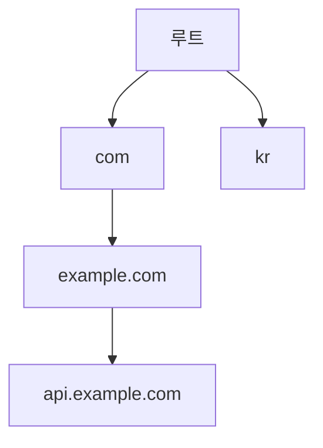
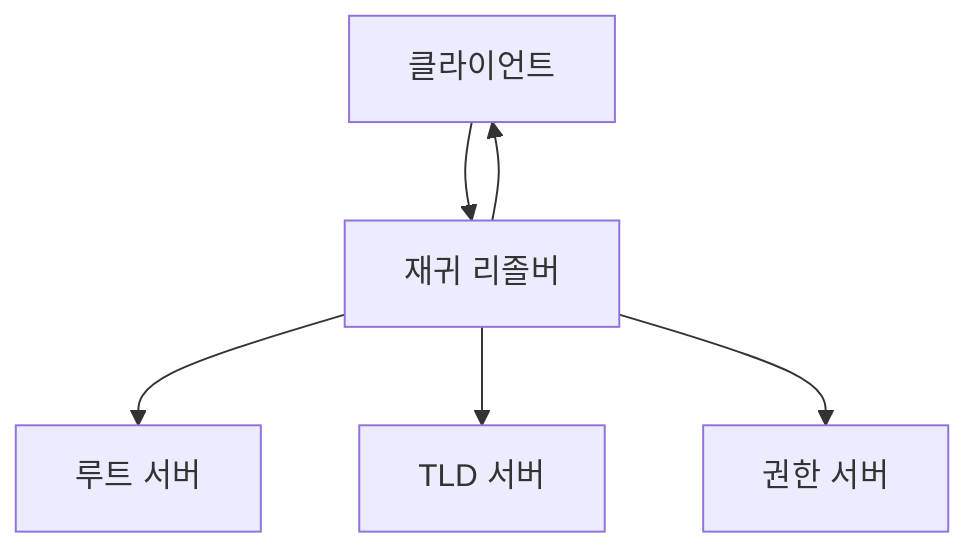
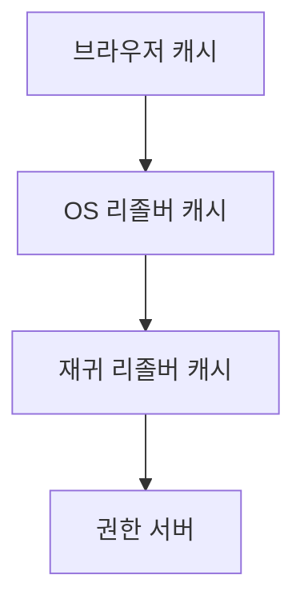
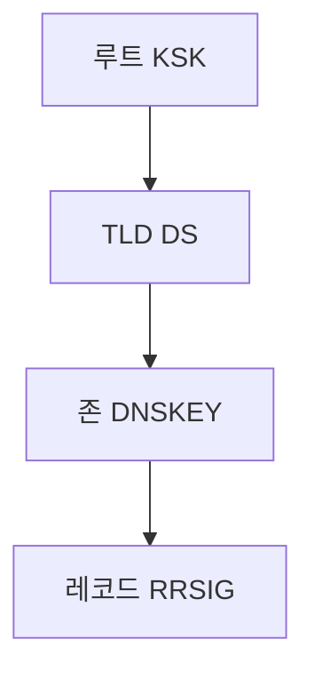
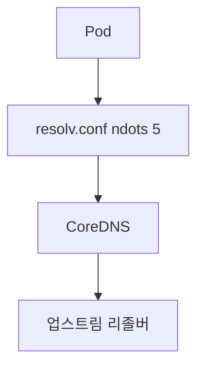

# DNS 아키텍처 (Authoritative · Recursive · DNSSEC · 암호화)

DNS는 "이름 → IP"만 하는 단순한 프로토콜로 보이지만,
실제로는 **서명 체인 · 캐싱 계층 · 프라이버시 · 암호화**가 얽힌
분산 시스템이다.

이 글은 DevOps 엔지니어가 **DNS 장애 대응과 보안 설계**를 할 때
필요한 아키텍처적 이해를 정리한다.
리눅스 호스트 리졸버 설정은 [DNS 설정](./dns-config.md),
운영 주제(TTL, SRV, 클러스터 DNS 동작)는 [DNS 운영](./dns-operations.md)을 참고.

---

## 1. 네임스페이스와 위임 체인

### 1-1. 계층 구조



> 루트 존의 이름은 빈 레이블(`.`)이며, FQDN 끝의 점이 루트를 가리킨다.

- **루트 존**은 13개 이름(A~M)의 서버군 — **실제로는 애니캐스트로 수천 개** 인스턴스
- **TLD 존**(com, kr, org 등)은 각 레지스트리가 운영
- 각 존은 **하위 존에 대한 위임**을 NS 레코드로 표시

### 1-2. 위임의 핵심

`api.example.com`을 질의하면:
1. 루트가 "com은 여기에 물어봐"
2. com TLD가 "example.com은 여기에 물어봐"
3. example.com 권한 서버가 "api.example.com은 10.0.0.1"

이 **위임 체인**이 끊어지면 도메인이 통째로 해석되지 않는다.
(권한 서버 변경 시 "전파 기간"이 필요한 이유)

---

## 2. Authoritative vs Recursive

| 구분 | 역할 | 대표 구현 |
|---|---|---|
| **Authoritative** | 특정 존(zone)의 **원본 데이터**를 제공 | NSD, Knot DNS, Route 53, PowerDNS |
| **Recursive (Resolver)** | 사용자 쿼리를 받아 권한 서버를 순회해 **답을 찾아주는** 서버 | Unbound, BIND, dnsmasq, systemd-resolved, CoreDNS |

> **권한과 재귀는 분리하는 것이 표준이다.**
> DNS amplification의 주요 매개체는 **오픈 리졸버**(누구나 재귀 허용하는 리졸버)다.
> 권한/재귀를 분리하면 (1) 공격면 분리, (2) RRL·ACL 정책 격리,
> (3) 캐시 포이즈닝 영향 범위 축소, (4) 업스트림 장애 격리가 가능하다.

### 2-1. 재귀 리졸버의 동작



1. 클라이언트 → 재귀 리졸버 (재귀 질의, RD=1)
2. 재귀 리졸버 → 루트 → TLD → 권한 (반복 질의, RD=0)
3. 결과 캐싱 후 클라이언트에 반환

### 2-2. 오픈 리졸버 vs 사설 리졸버

| 유형 | 예시 | 용도 |
|---|---|---|
| 오픈 | 1.1.1.1 (Cloudflare), 8.8.8.8 (Google), 9.9.9.9 (Quad9) | 일반 사용자 |
| ISP | 통신사 제공 | 기본 리졸버 |
| 사설 | 기업 내부 Unbound/CoreDNS | 내부 도메인 Split-DNS |
| 클라우드 | Route 53 Resolver, Cloud DNS | VPC 내부 조회 |

---

## 3. 레코드 타입

DevOps 실무에서 반드시 아는 레코드:

| 타입 | 용도 | 예시 |
|---|---|---|
| A | IPv4 주소 | `example.com → 93.184.216.34` |
| AAAA | IPv6 주소 | `example.com → 2606:2800:220:...` |
| CNAME | 별칭 | `www → example.com` |
| MX | 메일 서버 | `10 mail.example.com` |
| TXT | 텍스트 (SPF, DKIM, 도메인 검증) | |
| NS | 네임서버 위임 | |
| PTR | 역조회 (IP → 이름) | `34.216.184.93.in-addr.arpa` |
| SRV | 서비스 위치 (포트 포함) | `_sip._tcp.example.com` |
| CAA | CA 발급 제어 | `0 issue "letsencrypt.org"` |
| DS · DNSKEY · RRSIG | DNSSEC | |
| HTTPS · SVCB | HTTPS 서비스 힌트 (ALPN·ECH·IP) | |
| TLSA | DANE (TLS 인증서 고정) | |

### 3-1. CNAME 제약

- **CNAME은 다른 레코드와 공존 못함** (특히 apex 도메인의 MX·NS 충돌)
- 이 때문에 `example.com`에는 CNAME을 못 씀 → **ALIAS/ANAME** 벤더 확장 등장
- Route 53 Alias, Cloudflare CNAME flattening, Azure Alias record 등이 해결

### 3-2. HTTPS/SVCB 레코드 (RFC 9460)

2023년 표준화된 새 레코드 타입. 브라우저가 **HTTPS 연결을 시작하기 전에**
ALPN·ECH(Encrypted Client Hello)·대체 IP를 DNS로 받는다.

```
example.com. 3600 IN HTTPS 1 . alpn=h3,h2 ipv4hint=93.184.216.34
```

| 필드 | 의미 |
|---|---|
| `1` | 우선순위. **0 = AliasMode** (CNAME 대체), **≥1 = ServiceMode** (파라미터 지정) |
| `.` | target — `.`은 "이 레코드가 속한 이름 자체" |
| `alpn=h3,h2` | 지원 프로토콜 |
| `ipv4hint=…` | 사전 IP 힌트 (A 쿼리 없이 연결 시도 가능) |

Chrome·Safari는 이미 쿼리하고, Cloudflare·Google은 응답한다.
**HTTP/3 도입 속도와 ECH 보급의 핵심 인프라**.

---

## 4. 캐싱과 TTL

### 4-1. 캐싱 계층



| 계층 | 일반적인 TTL 상한 |
|---|---|
| 브라우저 | 수 초~수 분 |
| OS (nscd·systemd-resolved) | 권한 TTL 존중 (보통 몇 분~시간) |
| 재귀 리졸버 | 권한 TTL. 구현 내부 cap 적용 (예: Unbound `cache-max-ttl` 기본 86400s) |
| 권한 서버 | 관리자가 설정한 TTL (레코드마다) |

**RFC 8767 (Serving Stale Data)**: 권한 서버 응답이 없을 때
만료된 레코드를 **최대 1~3일(권장 604800s)까지** 재사용해 장애 내성 확보.
stale 응답의 TTL은 30초로 설정. TTL cap과는 별개 주제다.

### 4-2. TTL 설계 원칙

- **변하지 않는 레코드** (회사 대표 IP): 3600~86400
- **자주 바뀌는 레코드** (DR·배포 전환): 60~300
- **전환 직전**: 미리 TTL 낮추기 → 전환 → 다시 올리기
- 자세한 운영 주제: [DNS 운영](./dns-operations.md)

### 4-3. Negative Caching

"없음" 응답(NXDOMAIN)도 캐싱된다 (RFC 2308).
SOA 레코드의 **minimum** 필드가 negative TTL.
오타로 잘못된 이름을 한 번 질의하면 TTL 동안 반복 실패.

---

## 5. DNSSEC — 응답의 위변조 방지

### 5-1. 왜 필요한가

- DNS 응답은 기본적으로 UDP 평문이다 → **캐시 포이즈닝 취약**
- 2008년 Kaminsky 공격으로 심각성이 드러남
- **DNSSEC**은 각 레코드셋에 **서명**을 붙여 검증 가능하게 만든다

### 5-2. 핵심 레코드

| 레코드 | 역할 |
|---|---|
| **DNSKEY** | 존의 공개 키 |
| **RRSIG** | 레코드셋에 대한 서명 |
| **DS** | 상위 존에 넣는 자식 키의 해시 (위임 링크) |
| **NSEC / NSEC3** | "이 이름은 없다"의 서명된 증명 (존 열거 방지) |

### 5-3. 신뢰 체인



- 루트 KSK는 IANA가 관리 — **KSK 롤오버**는 전 세계 리졸버가 추적
- 각 존은 상위에 DS를 등록해 체인에 참여
- 중간에 링크가 끊어지면 **SERVFAIL** — 이것이 "DNSSEC 때문에 사이트 다운"의 주원인

### 5-4. DNSSEC의 한계

| 한계 | 내용 |
|---|---|
| 프라이버시 없음 | 서명만 붙일 뿐 질의·응답은 여전히 평문 |
| 운영 복잡 | 키 롤오버·DS 등록 자동화 부족 |
| 채택률 | 주요 TLD는 대부분 서명. 2차 도메인은 .com 약 4%, ccTLD 절반 이하 |
| 응답 크기 증가 | UDP 512B 초과 → TCP 폴백 또는 EDNS0 필수 |

**DNSSEC은 프라이버시 도구가 아니다**. 그 역할은 DoT·DoH·DoQ가 맡는다.

> **알고리즘 권장**: DNSKEY는 RSA-1024가 deprecated된 이후
> **ECDSA P-256 (algorithm 13)** 또는 **Ed25519 (algorithm 15)**가 표준 선택.
> RSA 2048 이상도 여전히 허용되지만 응답 크기가 커진다.

---

## 6. DNS 암호화 — DoT · DoH · DoQ

DNS 질의·응답을 암호화해 **프라이버시**와 **무결성**을 동시에 제공.

| 프로토콜 | 전송 | 포트 | RFC |
|---|---|---|---|
| DoT (DNS over TLS) | TCP + TLS | 853 | RFC 7858 |
| DoH (DNS over HTTPS) | HTTPS | 443 | RFC 8484 |
| DoQ (DNS over QUIC) | QUIC (UDP) | 853 | RFC 9250 |

### 6-1. 비교

| 항목 | DoT | DoH | DoQ |
|---|---|---|---|
| 탐지·차단 | 쉽다 (전용 포트) | 어렵다 (HTTPS에 섞임) | 어렵다 (QUIC) |
| 성능 | 양호 | HTTPS 오버헤드 | 0-RTT·HoL 해소로 손실망 유리 |
| 브라우저 사용 | 제한 | Chrome·Firefox 기본 | Chrome·Firefox 지원 |
| 기업 네트워크 | 통제 용이 | **통제 어려움** (DDR로 완화) | 통제 어려움 |

> **DDR** (Discovery of Designated Resolvers, RFC 9462/9463):
> 엔드포인트가 기업 리졸버의 DoT/DoH 엔드포인트를 **자동 발견**할 수 있도록 한 표준.
> Chrome·Firefox의 기본 DoH가 기업 리졸버를 우회하는 문제를 해결하는 방향.

### 6-2. 실무 선택 기준

| 상황 | 권장 |
|---|---|
| 기업 프라이빗 환경 | DoT (관리 용이) |
| 공용 리졸버 (1.1.1.1, 8.8.8.8) | DoH + DoT 병용 |
| 모바일·고지연 네트워크 | DoQ (0-RTT) |
| 레거시 장비 | 평문 UDP (불가피할 때만) |

### 6-3. ECH (Encrypted Client Hello)

TLS 1.3 Client Hello에 담기던 **SNI를 암호화**.
HTTPS DNS 레코드를 통해 ECH 키를 받아 사용.
**DNS 아키텍처 변화의 연쇄 효과**.

---

## 7. 메시지 포맷과 전송 제약

### 7-1. UDP vs TCP

| 전송 | 사용 |
|---|---|
| UDP 53 | 기본 (작은 응답) |
| TCP 53 | 응답 ≥ 512B, AXFR/IXFR (존 전송), DoT |

### 7-2. EDNS0 (Extension Mechanisms for DNS)

- 기본 DNS는 UDP payload **512B 제한** → DNSSEC 응답이 초과
- EDNS0로 **최대 4096B**까지 협상 가능
- **ECS (EDNS Client Subnet)**: 재귀 리졸버가 클라이언트 대역을 권한 서버에 전달
  → CDN·GeoDNS가 올바른 edge로 라우팅하게 도움

### 7-3. EDNS 관련 공격·방어

| 공격 | 방어 |
|---|---|
| Amplification (작은 질의 → 큰 응답) | 오픈 리졸버 금지, 응답 크기 제한 |
| Cache poisoning | DNSSEC, 소스 포트 랜덤화, 0x20 인코딩 |
| DNS tunneling (데이터 유출) | TXT 쿼리 패턴 탐지, DNS 트래픽 로그 분석 |

---

## 8. 클러스터·클라우드 DNS 아키텍처

### 8-1. Kubernetes DNS



- **CoreDNS**가 클러스터 DNS 표준 (이전 kube-dns 대체)
- Service → ClusterIP, Pod → A 레코드 자동 생성
- **NodeLocal DNSCache**: 각 노드에 DNS 캐시 파드 → 지연·부하 감소
- **`ndots: 5` 함정**: 외부 도메인 하나를 해석해도 search 도메인 순회로
  5회 가량의 쿼리가 증폭돼 CoreDNS CPU 병목·지연을 유발.
  FQDN 끝에 `.`을 붙이거나 Pod `dnsConfig.options`의 ndots를 낮춰 해결
- 자세한 설정: [DNS 운영](./dns-operations.md)

### 8-2. 클라우드 DNS 서비스

| CSP | Public | Private | 특징 |
|---|---|---|---|
| AWS | Route 53 | Route 53 Resolver, Private Hosted Zone | VPC Endpoint로 내부 접근 |
| GCP | Cloud DNS | Cloud DNS (Private Zone) | Forwarding, Peering |
| Azure | Azure DNS | Private DNS Zones | 링크 기반 연결 |

### 8-3. Split-Horizon DNS

같은 이름에 대해 **내부/외부에서 다른 응답**을 주는 구조.

| 뷰 | 대상 | 응답 |
|---|---|---|
| 외부 | 인터넷 | 퍼블릭 LB IP |
| 내부 | VPC | 프라이빗 ENI IP |

Route 53은 Public + Private zone, CoreDNS는 `view` 플러그인으로 구현.

---

## 9. 트러블슈팅 진단 도구

| 도구 | 용도 |
|---|---|
| `dig +trace example.com` | 루트부터 권한까지 위임 체인 추적 |
| `dig @1.1.1.1 example.com` | 특정 리졸버에 직접 질의 |
| `dig +dnssec example.com` | DNSSEC 서명·RRSIG 확인 |
| `delv example.com` | DNSSEC 검증 (BIND 내장) |
| `kdig` | Knot DNS의 확장된 dig |
| `dnsviz.net` | DNSSEC 체인·오류 시각화 |
| `dig CHAOS TXT id.server` | 어느 애니캐스트 인스턴스에서 응답했는지 |
| `dig +norecurse @<auth-ns> <name>` | 권한 서버에 직접 질의 (위임 확인) |
| `resolvectl status` / `resolvectl query` | systemd-resolved 현재 상태·질의 (구 `systemd-resolve`는 deprecated) |

### 9-1. 자주 만나는 증상

| 증상 | 원인 |
|---|---|
| SERVFAIL | DNSSEC 검증 실패, 상위 위임 끊김 |
| NXDOMAIN | 실제 없는 이름, negative 캐시 |
| REFUSED | 해당 리졸버가 그 존을 서비스 안 함 |
| 답은 오지만 잘못된 IP | Split-DNS 잘못 매핑, DNS 캐시 오염 |
| 응답 간헐적 지연 | UDP 드롭, TCP 폴백 지연 |

---

## 10. 요약

| 개념 | 한 줄 요약 |
|---|---|
| Authoritative vs Recursive | 원본 데이터 제공 vs 답을 찾아주는 역할 |
| 위임 체인 | 루트 → TLD → 존 NS 레코드로 연결 |
| 레코드 | A/AAAA/CNAME/MX/TXT/SRV/CAA/HTTPS 등 |
| CNAME 제약 | apex에 쓰지 못함 — ALIAS/CNAME flattening 필요 |
| TTL | 변화 예상 여부로 설계, 전환 전 사전 축소 |
| DNSSEC | 서명 체인으로 위변조 방지. 프라이버시는 아님 |
| DoT/DoH/DoQ | 프라이버시·무결성을 추가하는 전송 암호화 |
| HTTPS/SVCB | 브라우저가 DNS에서 ALPN·ECH·IP 힌트 수신 |
| EDNS0 | 512B 제한 돌파, ECS로 CDN 최적화 |
| K8s | CoreDNS + NodeLocal DNSCache가 표준 |

---

## 참고 자료

- [RFC 1034 / 1035 — DNS Concepts & Specification](https://www.rfc-editor.org/rfc/rfc1035) — 확인: 2026-04-20
- [RFC 4033~4035 — DNSSEC](https://www.rfc-editor.org/rfc/rfc4033) — 확인: 2026-04-20
- [RFC 7858 — DNS over TLS](https://www.rfc-editor.org/rfc/rfc7858) — 확인: 2026-04-20
- [RFC 8484 — DNS Queries over HTTPS (DoH)](https://www.rfc-editor.org/rfc/rfc8484) — 확인: 2026-04-20
- [RFC 9250 — DNS over Dedicated QUIC Connections](https://www.rfc-editor.org/rfc/rfc9250) — 확인: 2026-04-20
- [RFC 9460 — Service Binding and Parameter Specification via the DNS](https://www.rfc-editor.org/rfc/rfc9460) — 확인: 2026-04-20
- [RFC 2308 — Negative Caching of DNS Queries](https://www.rfc-editor.org/rfc/rfc2308) — 확인: 2026-04-20
- [RFC 8767 — Serving Stale Data](https://www.rfc-editor.org/rfc/rfc8767) — 확인: 2026-04-20
- [Cloudflare Learning Center — DNS](https://www.cloudflare.com/learning/dns/) — 확인: 2026-04-20
- [CoreDNS docs](https://coredns.io/manual/toc/) — 확인: 2026-04-20
- [dnsviz.net](https://dnsviz.net/) — 확인: 2026-04-20
