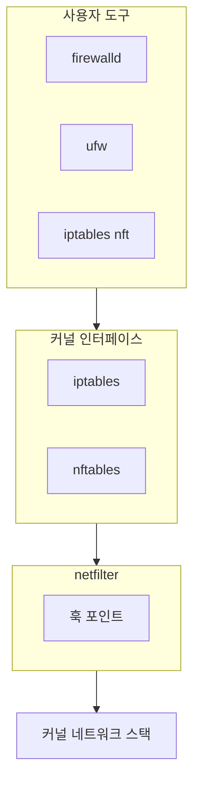
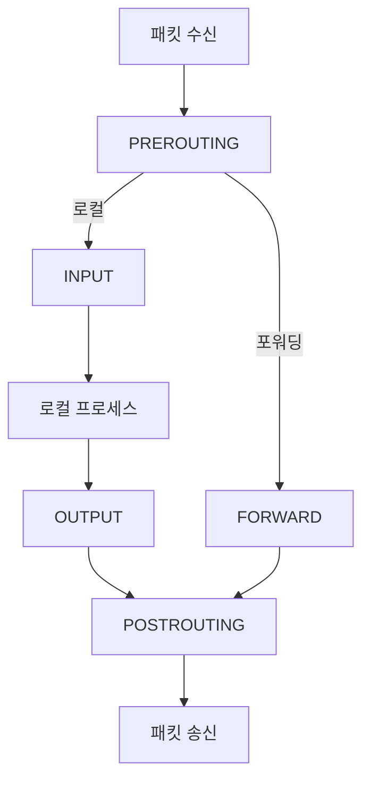
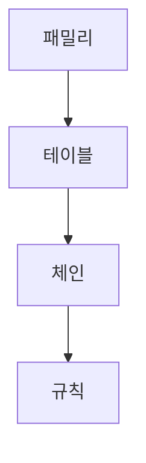
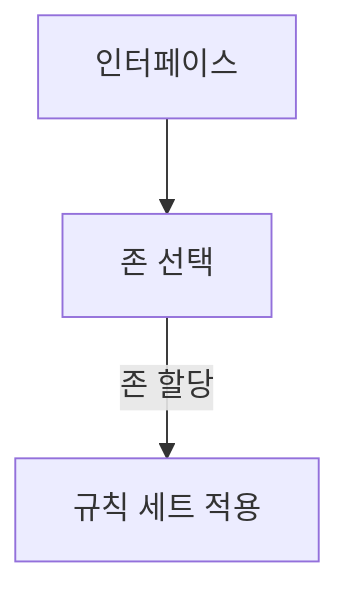
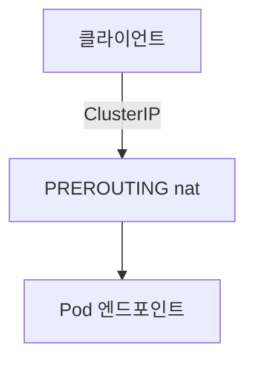
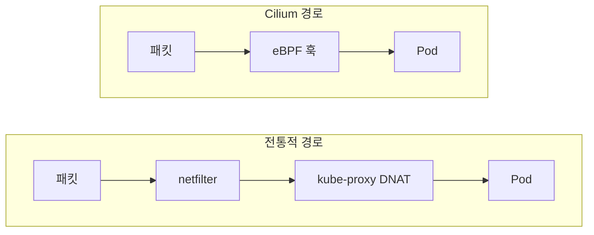

# 방화벽 (iptables, nftables, firewalld, ufw)

Linux 방화벽은 단일 도구가 아니라 커널의 **netfilter** 프레임워크
위에 쌓인 계층 구조다. 계층을 이해하면 어떤 도구를 쓰든
동일한 원리로 접근할 수 있다.

---

## 계층 구조



| 노드 | 설명 |
|------|------|
| firewalld | RHEL 기본 프론트엔드 |
| ufw | Ubuntu 기본 프론트엔드 |
| iptables / nft | 저수준 규칙 관리 도구 |
| iptables (x_tables) | 레거시 커널 인터페이스 |
| nftables | 현대 커널 인터페이스 |
| netfilter 훅 | 커널 내 패킷 처리 체인 연결 |

| 계층 | 역할 |
|------|------|
| **netfilter** | 커널 내 패킷 처리 훅 프레임워크 |
| **iptables / nftables** | netfilter 규칙을 관리하는 커널 모듈 |
| **firewalld / ufw** | 위 도구를 추상화한 사용자 친화 프론트엔드 |

---

## iptables

### 테이블과 체인

iptables는 **테이블 → 체인 → 규칙** 순서로 구성된다.



#### 테이블 역할

| 테이블 | 용도 | 주요 체인 |
|--------|------|-----------|
| **filter** | 패킷 허용/차단 (기본 테이블) | INPUT, OUTPUT, FORWARD |
| **nat** | 주소 변환 (SNAT/DNAT) | PREROUTING, OUTPUT, POSTROUTING |
| **mangle** | 패킷 헤더 수정 (TTL, TOS 등) | 모든 5개 체인 |
| **raw** | conntrack 이전 처리, 연결 추적 제외 | PREROUTING, OUTPUT |
| **security** | SELinux 기반 네트워크 보안 | INPUT, OUTPUT, FORWARD |

#### 기본 체인 의미

| 체인 | 적용 시점 |
|------|-----------|
| **PREROUTING** | 패킷이 네트워크 인터페이스 진입 직후, 라우팅 결정 전 |
| **INPUT** | 로컬 프로세스로 향하는 패킷 |
| **FORWARD** | 다른 호스트로 포워딩되는 패킷 |
| **OUTPUT** | 로컬 프로세스가 생성한 패킷 |
| **POSTROUTING** | 패킷이 인터페이스를 떠나기 직전 |

---

### 규칙 관리 명령어

```bash
# 규칙 조회 (라인 번호 + 바이트/패킷 카운터 포함)
iptables -L -n -v --line-numbers
iptables -t nat -L -n -v

# 규칙 추가 (-A: 끝에 추가)
iptables -A INPUT -p tcp --dport 22 -j ACCEPT
iptables -A INPUT -s 10.0.0.0/8 -j ACCEPT

# 규칙 삽입 (-I: 특정 위치에 삽입, 기본 1번)
iptables -I INPUT 1 -p tcp --dport 80 -j ACCEPT

# 규칙 삭제 (-D)
iptables -D INPUT -p tcp --dport 80 -j ACCEPT   # 내용으로
iptables -D INPUT 3                              # 라인 번호로

# 체인 전체 비우기 (-F)
iptables -F INPUT
iptables -F          # 전체 테이블 flush

# 사용자 정의 체인 생성 (-N) / 삭제 (-X)
iptables -N MY-CHAIN
iptables -X MY-CHAIN

# 기본 정책 변경 (-P)
iptables -P INPUT DROP
iptables -P FORWARD DROP
iptables -P OUTPUT ACCEPT
```

---

### 타겟 (Target)

| 타겟 | 동작 |
|------|------|
| **ACCEPT** | 패킷 허용 |
| **DROP** | 패킷 조용히 폐기 (응답 없음) |
| **REJECT** | 패킷 폐기 + ICMP 오류 응답 반환 |
| **LOG** | 커널 로그에 기록 후 다음 규칙 계속 평가 |
| **RETURN** | 현재 체인 중단 → 호출 체인으로 복귀 |
| **MASQUERADE** | 동적 IP의 SNAT (PPP/DHCP 환경) |
| **SNAT** | 출발지 IP 변환 (고정 외부 IP) |
| **DNAT** | 목적지 IP/포트 변환 (포트 포워딩) |

```bash
# REJECT는 응답을 보낼 때 유형 지정 가능
iptables -A INPUT -p tcp --dport 23 \
  -j REJECT --reject-with tcp-reset

# LOG: 접두사와 로그 레벨 지정
iptables -A INPUT -p tcp --dport 22 \
  -j LOG --log-prefix "[SSH-ATTEMPT] " --log-level 4

# LOG 다음에 DROP을 추가해야 실제 차단됨
iptables -A INPUT -p tcp --dport 22 \
  -m state --state NEW -s 0/0 -j DROP
```

---

### 연결 상태 추적 (conntrack)

`-m state` 또는 `-m conntrack`으로 연결 상태를 필터링한다.

| 상태 | 의미 |
|------|------|
| **NEW** | 새로운 연결 첫 패킷 |
| **ESTABLISHED** | 기존 연결의 패킷 (양방향) |
| **RELATED** | 기존 연결과 관련된 새 연결 (FTP data, ICMP 오류 등) |
| **INVALID** | 어떤 상태에도 속하지 않는 패킷 |

```bash
# Stateful 방화벽 기본 패턴
# 기존 연결은 허용, 새 연결은 선택적으로 허용
iptables -A INPUT -m state \
  --state ESTABLISHED,RELATED -j ACCEPT
iptables -A INPUT -m state --state INVALID -j DROP
iptables -A INPUT -p tcp --dport 443 \
  -m state --state NEW -j ACCEPT
iptables -A INPUT -j DROP   # 기본 차단

# conntrack 테이블 조회
conntrack -L
conntrack -L --src 192.168.1.10
```

---

### NAT 설정

```bash
# MASQUERADE: 인터넷 공유 (동적 외부 IP)
iptables -t nat -A POSTROUTING \
  -o eth0 -j MASQUERADE

# SNAT: 고정 외부 IP로 변환
iptables -t nat -A POSTROUTING \
  -s 10.0.0.0/24 -o eth0 \
  -j SNAT --to-source 203.0.113.10

# DNAT: 포트 포워딩 (외부 80 → 내부 서버 8080)
iptables -t nat -A PREROUTING \
  -i eth0 -p tcp --dport 80 \
  -j DNAT --to-destination 10.0.0.10:8080

# IP 포워딩 활성화 (NAT 동작 전제 조건)
echo 1 > /proc/sys/net/ipv4/ip_forward
# 영구 설정: /etc/sysctl.conf
# net.ipv4.ip_forward = 1
```

---

### 규칙 영구 저장

재부팅 후에도 규칙이 유지되려면 별도 저장이 필요하다.

```bash
# 규칙 저장
iptables-save > /etc/iptables/rules.v4
ip6tables-save > /etc/iptables/rules.v6

# 규칙 복원
iptables-restore < /etc/iptables/rules.v4

# Ubuntu: iptables-persistent 패키지
apt install iptables-persistent
# 저장: netfilter-persistent save
# 자동 복원: systemd 서비스가 처리

# RHEL/CentOS: iptables-services
dnf install iptables-services
systemctl enable iptables
# /etc/sysconfig/iptables 에 저장됨
```

---

## nftables

nftables는 Linux 3.13부터 도입된 **iptables의 현대적 대안**이다.
Debian 10, RHEL 8, Ubuntu 20.04 이후 기본 방화벽 백엔드다.

### iptables vs nftables 비교

| 항목 | iptables | nftables |
|------|----------|----------|
| 커널 도입 | 2001 (2.4) | 2014 (3.13) |
| 문법 | 테이블별 독립 명령 | 단일 `nft` 명령 |
| 성능 | 규칙 수에 선형 비례 | 세트·맵으로 O(1) 조회 |
| IPv4/IPv6 | 별도 (`iptables`/`ip6tables`) | 단일 규칙셋 통합 |
| 규칙 원자적 갱신 | 불가 | 가능 (`nft -f`) |
| 디버깅 | 제한적 | `nft monitor trace` |
| 세트/맵 지원 | 제한적 (ipset 별도) | 네이티브 지원 |
| 배포판 기본 | 레거시 | RHEL 8+, Debian 10+, Ubuntu 20.04+ |

---

### 기본 문법

nftables는 **패밀리 → 테이블 → 체인 → 규칙** 계층이다.



| 계층 | 설명 |
|------|------|
| 패밀리(family) | `ip`(IPv4), `ip6`(IPv6), `inet`(IPv4+IPv6), `arp`, `bridge`, `netdev` |
| 테이블(table) | 임의 이름 지정 |
| 체인(chain) | 훅 포인트 연결 |
| 규칙(rule) | 매칭 + 액션 |

```bash
# 현재 규칙 전체 조회
nft list ruleset

# 테이블 생성
nft add table inet filter

# 체인 생성 (훅 연결)
nft add chain inet filter input \
  { type filter hook input priority 0 \; policy drop \; }
nft add chain inet filter output \
  { type filter hook output priority 0 \; policy accept \; }
nft add chain inet filter forward \
  { type filter hook forward priority 0 \; policy drop \; }

# 규칙 추가
nft add rule inet filter input \
  ct state established,related accept
nft add rule inet filter input \
  tcp dport 22 accept
nft add rule inet filter input \
  tcp dport { 80, 443 } accept

# 규칙 삭제 (핸들 번호 사용)
nft -a list chain inet filter input   # 핸들 확인
nft delete rule inet filter input handle 5

# 규칙 파일로 적재
nft -f /etc/nftables.conf
```

#### nftables 설정 파일 예시

```nft
#!/usr/sbin/nft -f

flush ruleset

table inet filter {
    chain input {
        type filter hook input priority 0; policy drop;

        # loopback 허용
        iif lo accept

        # 기존 연결 허용
        ct state established,related accept

        # 유효하지 않은 패킷 차단
        ct state invalid drop

        # ICMP 허용
        ip protocol icmp accept
        ip6 nexthdr ipv6-icmp accept

        # SSH 허용 (특정 소스만)
        ip saddr 10.0.0.0/8 tcp dport 22 accept

        # HTTP/HTTPS 허용
        tcp dport { 80, 443 } accept
    }

    chain output {
        type filter hook output priority 0; policy accept;
    }

    chain forward {
        type filter hook forward priority 0; policy drop;
    }
}
```

---

### 세트(set)와 맵(map)

세트와 맵은 nftables의 핵심 장점으로 다수의 IP/포트를
**단일 조회(O(1))** 로 처리한다.

```nft
table inet filter {
    # 세트: IP 주소 목록
    set blocked_ips {
        type ipv4_addr
        flags interval
        elements = {
            192.168.100.0/24,
            10.10.10.10,
            203.0.113.0/28
        }
    }

    # 동적 세트: 자동 만료 (rate limiting)
    # rate over 초과 IP를 등록하고 timeout 후 자동 삭제
    set ssh_ratelimit {
        type ipv4_addr
        flags dynamic,timeout
        timeout 60s
    }

    # 맵: IP → 액션 매핑
    map port_redirect {
        type inet_service : inet_service
        elements = { 8080 : 80, 8443 : 443 }
    }

    chain input {
        type filter hook input priority 0; policy drop;

        # 세트를 이용한 차단
        ip saddr @blocked_ips drop

        # SSH brute-force 방지 (rate limit)
        # 분당 3회 초과 시 set에 등록하고 즉시 drop.
        # accept 이후에 drop이 오는 구조는 도달 불가이므로
        # update + drop을 한 규칙에서 처리해야 한다.
        tcp dport 22 ct state new \
          update @ssh_ratelimit \
            { ip saddr timeout 60s limit rate over 3/minute } \
          drop
        tcp dport 22 ct state new accept

        ct state established,related accept
    }
}
```

---

### iptables → nftables 마이그레이션

```bash
# 자동 변환 도구 설치
apt install iptables-nftables-compat   # Debian/Ubuntu
dnf install iptables-nftables-compat   # RHEL

# 기존 iptables 규칙을 nftables 형식으로 변환
iptables-save | iptables-restore-translate -f /dev/stdin \
  > /etc/nftables.conf

# ip6tables도 동일하게
ip6tables-save | ip6tables-restore-translate -f /dev/stdin \
  >> /etc/nftables.conf

# 변환 결과 확인
nft -c -f /etc/nftables.conf   # dry-run

# 적용
systemctl enable --now nftables
```

> iptables-legacy와 nftables가 동시에 동작하면
> 규칙 우선순위 충돌이 발생할 수 있다.
> 마이그레이션 후 iptables-legacy 규칙을 반드시 flush한다.

---

## firewalld

RHEL/CentOS/Fedora의 기본 방화벽 관리 데몬이다.
백엔드로 nftables(RHEL 8+) 또는 iptables를 사용한다.
**존(zone)** 개념으로 인터페이스별 신뢰 수준을 다르게 적용한다.

### 존(Zone) 개념



- 기본 존은 `public`이다.
- 인터페이스에 존을 할당하면 해당 존의 규칙 세트가 적용된다.

| 존 | 신뢰 수준 | 기본 정책 |
|----|-----------|-----------|
| **drop** | 최저 | 모든 수신 패킷 drop, 송신만 허용 |
| **block** | | 모든 수신 패킷 reject |
| **public** | 낮음 | ssh만 허용 (기본 존) |
| **external** | | ssh 허용 + MASQUERADE |
| **internal** | 중간 | ssh, mdns, samba-client, dhcpv6 등 |
| **home** | 높음 | 위 + cups |
| **work** | 높음 | ssh, dhcpv6, ipp-client |
| **dmz** | | ssh만 허용 |
| **trusted** | 최고 | 모든 연결 허용 |

---

### firewall-cmd 주요 명령어

```bash
# 상태 확인
firewall-cmd --state
firewall-cmd --get-active-zones
firewall-cmd --get-default-zone

# 존 정보 조회
firewall-cmd --list-all                         # 기본 존
firewall-cmd --zone=public --list-all           # 특정 존
firewall-cmd --list-all-zones                   # 모든 존

# 서비스 허용 (런타임)
firewall-cmd --add-service=https
# 영구 저장 (--permanent 플래그)
firewall-cmd --permanent --add-service=https
firewall-cmd --reload   # 영구 규칙 적용

# 포트 직접 지정
firewall-cmd --permanent --add-port=8080/tcp
firewall-cmd --permanent --remove-port=8080/tcp

# 인터페이스 존 변경
firewall-cmd --permanent --zone=internal \
  --change-interface=eth1

# 리치 규칙(Rich Rule): 세밀한 제어
firewall-cmd --permanent --add-rich-rule='
  rule family="ipv4"
  source address="10.0.0.0/8"
  service name="ssh"
  accept'

# 패닉 모드 (긴급 차단)
firewall-cmd --panic-on
firewall-cmd --panic-off

# 런타임 → 영구 저장
firewall-cmd --runtime-to-permanent
```

#### 런타임 vs 영구 규칙

| 구분 | 옵션 | 재부팅 후 |
|------|------|-----------|
| 런타임 | 없음 | 사라짐 |
| 영구 | `--permanent` | 유지 |
| 즉시 + 영구 | `--permanent` 후 `--reload` | 유지 |

---

## ufw

Ubuntu의 기본 방화벽 프론트엔드로, iptables/nftables를 추상화한다.
단순한 서버 방화벽 설정에 최적화되어 있다.

### 기본 사용법

```bash
# 활성화/비활성화
ufw enable
ufw disable
ufw status verbose   # 상세 상태 확인
ufw status numbered  # 번호 포함 조회

# 기본 정책 설정
ufw default deny incoming
ufw default allow outgoing

# 서비스 허용
ufw allow ssh              # /etc/ufw/applications.d 프로파일 사용
ufw allow 22/tcp           # 포트 직접 지정
ufw allow from 10.0.0.0/8  # 소스 IP 기반
ufw allow from 10.0.0.5 to any port 5432  # 소스+포트 조합

# 서비스 차단
ufw deny http
ufw deny from 203.0.113.100

# 규칙 삭제
ufw delete allow ssh         # 내용으로 삭제
ufw delete 3                 # 번호로 삭제 (ufw status numbered)

# 로깅
ufw logging on
ufw logging medium   # low | medium | high | full
```

---

### ufw status verbose 출력 예시

```
Status: active
Logging: on (low)
Default: deny (incoming), allow (outgoing), disabled (routed)
New profiles: skip

To                         Action      From
--                         ------      ----
22/tcp                     ALLOW IN    Anywhere
80/tcp                     ALLOW IN    Anywhere
443/tcp                    ALLOW IN    Anywhere
5432/tcp                   ALLOW IN    10.0.0.0/8
22/tcp (v6)                ALLOW IN    Anywhere (v6)
80/tcp (v6)                ALLOW IN    Anywhere (v6)
```

---

### 앱 프로파일

```bash
# 등록된 앱 프로파일 조회
ufw app list

# 앱 정보 확인
ufw app info OpenSSH

# 앱 기반 허용
ufw allow "Nginx Full"   # Nginx HTTP + HTTPS
```

앱 프로파일 파일 위치: `/etc/ufw/applications.d/`

```ini
# 예시: /etc/ufw/applications.d/myapp
[MyApp]
title=My Application
description=Custom application firewall profile
ports=8080,8443/tcp
```

---

## Kubernetes 환경에서의 방화벽

Kubernetes는 노드 방화벽 위에서 독자적인 네트워크 규칙을
추가로 관리한다. 이 계층을 이해하지 못하면 예기치 않은
트래픽 차단 또는 보안 헛점이 발생한다.

### kube-proxy 모드와 iptables

kube-proxy는 Service를 구현하기 위해 iptables(또는 ipvs) 규칙을
자동으로 생성·관리한다.



- `PREROUTING nat`: kube-proxy가 생성한 DNAT 규칙이 적용된다.
- `Pod 엔드포인트`: 실제 Pod IP와 포트로 변환된다.

```bash
# kube-proxy가 생성한 규칙 확인
iptables -t nat -L KUBE-SERVICES -n --line-numbers
iptables -t nat -L KUBE-SVC-XXXXXXXX -n

# kube-proxy 모드 확인
kubectl get configmap kube-proxy -n kube-system \
  -o jsonpath='{.data.config\.conf}' | grep mode
```

| kube-proxy 모드 | 구현 방식 | 특징 |
|-----------------|-----------|------|
| **iptables** | DNAT 규칙 | 기본값, 규칙 수에 비례해 성능 저하 |
| **ipvs** | IP Virtual Server | 대규모 서비스에서 성능 우수 |
| **nftables** | nft 규칙 | 베타(K8s 1.31+), GA 예정(1.33+) |

---

### Cilium eBPF와 iptables 우회

Cilium CNI는 iptables를 완전히 우회하고 eBPF 프로그램을
커널에 직접 주입하여 패킷을 처리한다.



- 전통적 경로: `iptables/netfilter` → kube-proxy가 생성한 DNAT
  규칙을 통해 Pod로 전달된다.
- Cilium 경로: XDP/TC 훅에 eBPF 프로그램이 주입되어 커널
  네트워크 스택을 우회한다.

```bash
# Cilium 설치 시 kube-proxy 대체 모드 확인
kubectl get configmap cilium-config -n kube-system \
  -o jsonpath='{.data.kube-proxy-replacement}'

# eBPF 데이터플레인 상태
cilium status --verbose
cilium bpf lb list   # 로드밸런서 엔트리

# iptables 규칙이 비어있으면 Cilium이 완전히 대체한 것
iptables -t nat -L KUBE-SERVICES -n 2>/dev/null || \
  echo "kube-proxy 규칙 없음 (Cilium 전담)"
```

> Cilium이 kube-proxy를 대체하더라도 노드 수준의
> 관리 트래픽(SSH, kubelet API 등)을 위한 방화벽 규칙은
> 여전히 iptables/nftables로 관리해야 한다.

---

### 노드 방화벽 설정 주의사항

Kubernetes 노드에 방화벽을 적용할 때 반드시 아래 포트를
허용해야 한다.

#### 컨트롤 플레인 노드

```bash
# 컨트롤 플레인 필수 포트 허용
# API Server
iptables -A INPUT -p tcp --dport 6443 -j ACCEPT
# etcd
iptables -A INPUT -p tcp --dport 2379:2380 -j ACCEPT
# Scheduler (10259), Controller Manager (10257)
# K8s 1.24+ 기준 — 비보안 포트(10251/10252)는 제거됨
iptables -A INPUT -p tcp --dport 10257 -j ACCEPT
iptables -A INPUT -p tcp --dport 10259 -j ACCEPT
# kubelet API
iptables -A INPUT -p tcp --dport 10250 -j ACCEPT
```

#### 워커 노드

```bash
# kubelet API
iptables -A INPUT -p tcp --dport 10250 -j ACCEPT
# NodePort 범위 (기본 30000-32767)
iptables -A INPUT -p tcp --dport 30000:32767 -j ACCEPT
iptables -A INPUT -p udp --dport 30000:32767 -j ACCEPT
```

#### 포트 참조표

| 포트 | 프로토콜 | 컴포넌트 | 방향 |
|------|----------|---------|------|
| 6443 | TCP | kube-apiserver | 인바운드 |
| 2379-2380 | TCP | etcd | 내부 |
| 10250 | TCP | kubelet API | 내부 |
| 10259 | TCP | kube-scheduler (HTTPS) | 내부 |
| 10257 | TCP | kube-controller-manager (HTTPS) | 내부 |
| 30000-32767 | TCP/UDP | NodePort | 인바운드 |
| 4240 | TCP | Cilium health check | 내부 |
| 4244 | TCP | Cilium Hubble | 내부 |
| 8472 | UDP | VXLAN (flannel/overlay) | 내부 |
| 51820-51821 | UDP | WireGuard (Cilium 암호화) | 내부 |

> **K8s 1.24+ 기준**: kube-scheduler(10251)와
> kube-controller-manager(10252)의 비보안 HTTP 포트는
> K8s 1.24에서 제거되었다. 각각 10259(HTTPS),
> 10257(HTTPS)로 교체해서 사용해야 한다.

---

### ClusterIP와 NodePort 주의사항

```bash
# ClusterIP는 iptables DNAT으로 구현
# 외부에서 ClusterIP 직접 접근 불가 (노드 외부)
# 아래 규칙이 있으면 ClusterIP 범위 외부 접근 차단됨
iptables -A INPUT -d 10.96.0.0/12 \
  -m comment --comment "k8s ClusterIP 차단 (외부)" \
  -j DROP

# NodePort: 노드 IP로 외부 접근 허용
# kube-proxy가 자동으로 DNAT 규칙 추가
# 방화벽에서 30000-32767 포트가 열려있는지 확인
iptables -L INPUT -n | grep 30000

# Pod 간 통신: FORWARD 체인이 DROP이면 안됨
iptables -P FORWARD ACCEPT
# 또는 CNI가 관리하는 규칙이 있는지 확인
iptables -L FORWARD -n -v
```

---

## 트러블슈팅 팁

```bash
# 패킷이 어느 체인에서 차단되는지 추적
iptables -t raw -A PREROUTING -s <소스IP> -j TRACE
iptables -t raw -A OUTPUT -d <대상IP> -j TRACE
# 로그 확인
dmesg | grep TRACE
# 추적 완료 후 규칙 삭제
iptables -t raw -D PREROUTING -s <소스IP> -j TRACE

# nftables 실시간 추적
nft monitor trace

# conntrack 상태 조회
conntrack -L | grep <IP>
conntrack -E   # 이벤트 실시간 모니터링

# 방화벽 규칙 카운터 확인 (패킷 수 0이면 규칙에 도달 안 함)
iptables -L -n -v | grep -v "0     0"
```

---

## 참고 자료

- [netfilter 공식 문서](https://www.netfilter.org/documentation/)
  — 확인: 2026-04-17
- [nftables Wiki](https://wiki.nftables.org/)
  — 확인: 2026-04-17
- [firewalld 공식 문서](https://firewalld.org/documentation/)
  — 확인: 2026-04-17
- [ufw 매뉴얼 페이지 (Ubuntu)](https://manpages.ubuntu.com/manpages/ufw.8.html)
  — 확인: 2026-04-17
- [Kubernetes 네트워킹 포트 요구사항](https://kubernetes.io/docs/reference/networking/ports-and-protocols/)
  — 확인: 2026-04-17
- [Cilium kube-proxy 대체 문서](https://docs.cilium.io/en/stable/network/kubernetes/kubeproxy-free/)
  — 확인: 2026-04-17
- [RHEL 9 firewalld 가이드](https://access.redhat.com/documentation/en-us/red_hat_enterprise_linux/9/html/configuring_firewalls_and_packet_filters/)
  — 확인: 2026-04-17
