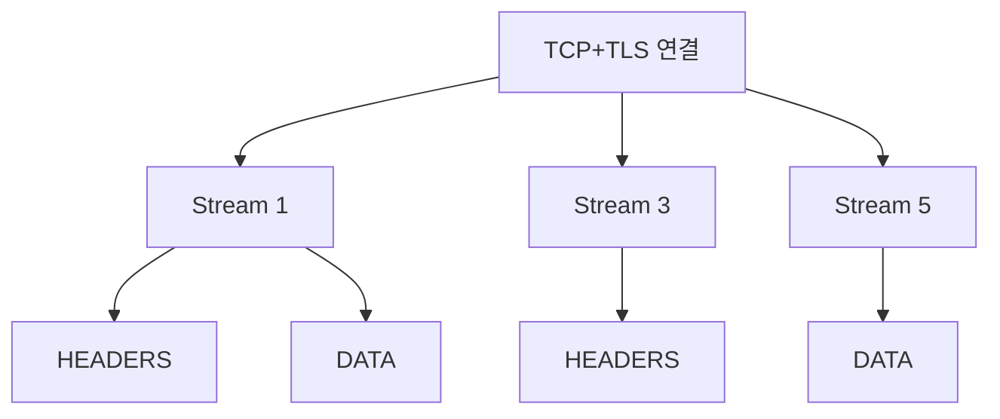

# HTTP 버전 (1.1 · 2 · 3 비교)

HTTP는 하나의 프로토콜이 아니라 **세 세대**가 공존하는 생태계다.
같은 URL이 클라이언트·중간 경로에 따라 HTTP/1.1, HTTP/2, HTTP/3 중
어느 것으로 전달될지 달라진다.

이 글은 세 버전의 **본질적 차이**와 **실무 선택 기준**을 정리한다.
HTTP/3·QUIC의 상세는 [HTTP/3·QUIC](./http3-quic.md) 참고.

---

## 1. 한눈에 비교

| 항목 | HTTP/1.1 | HTTP/2 | HTTP/3 |
|---|---|---|---|
| 발행 | RFC 7230~7235 (2014), RFC 9112 (2022) | RFC 7540 (2015), RFC 9113 (2022) | RFC 9114 (2022) |
| 전송 | TCP | TCP + TLS | **QUIC (UDP + TLS 1.3)** |
| 프레이밍 | 텍스트 | 이진 프레임 | 이진 프레임 (QUIC 스트림) |
| 다중 요청 | 연결 당 1개 (Keep-Alive로 순차) | **단일 연결 다중 스트림** | 단일 연결 다중 스트림 |
| HoL blocking | 전송·앱 레벨 모두 | TCP 레벨 존재 | **완전 제거** (스트림별 독립) |
| 헤더 압축 | 없음 | HPACK | QPACK |
| 서버 푸시 | 없음 | 규격 있음, 브라우저가 폐기 | 규격 있음(RFC 9114 §4.6), 구현 거의 없음 |
| 기본 암호화 | 선택 | 사실상 필수 | **필수** |
| 0-RTT 재연결 | 없음 | 없음 | 있음 |
| 포트 | TCP/80·443 | TCP/443 (브라우저는 ALPN h2만) | **UDP/443** |

---

## 2. HTTP/1.1

### 2-1. 특징

- 텍스트 기반 프로토콜
- **Keep-Alive**로 한 TCP 연결에서 순차 요청·응답
- **Pipelining**은 규격상 존재하지만 실무에선 비활성 (HoL blocking 심각)
- `chunked transfer-encoding`으로 스트리밍

### 2-2. HoL blocking (앱 레벨)

```
Req1 → Req2 → Req3  (같은 연결로 순차)
Resp1 지연 → Resp2·3도 대기
```

- 브라우저는 이를 회피하기 위해 **도메인당 6개 병렬 연결** 유지
- 그래도 이미지·스크립트가 수십 개인 페이지에선 연결 오버헤드 막대
- **domain sharding** (static.example.com, img.example.com 등)이 당시의 트릭

### 2-3. 아직도 HTTP/1.1이 쓰이는 이유

| 영역 | 이유 |
|---|---|
| 서버 간 내부 API | 단순성, 디버깅 용이 |
| 레거시 클라이언트 | IoT, 내장 기기 |
| curl/wget 스크립트 | 기본이 1.1 |
| 헬스체크·프로브 | 가볍고 충분 |

---

## 3. HTTP/2

### 3-1. 핵심 변화

| 변경 | 효과 |
|---|---|
| 이진 프레이밍 | 파싱 단순·효율화 |
| **Stream** 개념 | 단일 연결에서 다중 요청·응답 동시 진행 |
| **Multiplexing** | 병렬 연결 대신 하나의 연결에서 다 처리 |
| **Header Compression (HPACK)** | 반복 헤더 대폭 축소 |
| Priority | 스트림 우선순위 지정 (실무 효과는 제한적) |
| Server Push | 서버가 미리 리소스 전송 — **대부분 브라우저가 폐기** |

### 3-2. 스트림과 프레임



- 한 TCP 연결에 **홀수(클라) / 짝수(서버) 번호 스트림**이 공존
- 각 스트림은 독립된 HEADERS + DATA 프레임 시퀀스
- 크기 큰 응답도 조각내서 다른 스트림과 번갈아 전송

### 3-3. HTTP/2의 한계 — TCP HoL blocking

앱 레벨 HoL은 해결했지만, **TCP 자체의 HoL은 남아있다**:

- 한 스트림의 패킷이 유실되면 **모든 스트림이 대기**
- 모바일·WiFi 환경에서 손실률이 높으면 성능 역전 가능
- QUIC이 이 문제를 푸는 이유 → HTTP/3 등장

### 3-4. Cleartext HTTP/2 (h2c)

- TLS 없이 HTTP/2 쓰는 방식 — `Upgrade: h2c` 또는 prior knowledge
- **브라우저는 지원하지 않음** → 주로 사이드카-로컬 앱(localhost) 또는
  메시 내부 plaintext 구간
- 실제 운영의 gRPC는 대부분 **h2 (TLS 포함)**로 배포된다

### 3-5. gRPC

- HTTP/2 위의 바이너리 RPC
- 스트리밍 (단방향·양방향) 지원
- protobuf + HTTP/2 multiplexing = 내부 마이크로서비스 통신의 기본

---

## 4. HTTP/3

### 4-1. 핵심 변화

| 변경 | 효과 |
|---|---|
| **QUIC 위**에서 동작 | UDP 기반 커스텀 전송 |
| 스트림 수준 독립성 | **완전한 HoL blocking 제거** |
| 0-RTT 재연결 | 재접속이 매우 빠름 |
| Connection Migration | IP 바뀌어도 연결 유지 (Wi-Fi ↔ LTE) |
| 암호화 필수 | TLS 1.3이 프로토콜에 통합 |
| 헤더 압축 | **QPACK** (HPACK의 순서 의존성 해결) |

### 4-2. 진입 경로 — Alt-Svc

HTTP/3는 브라우저가 **처음부터 UDP로 말할 수는 없다**:

```
# 첫 응답은 HTTP/2 (TCP)
HTTP/2 200
Alt-Svc: h3=":443"; ma=86400

# 이후 요청부터 HTTP/3 (QUIC)로 전환
```

- 서버가 **`Alt-Svc` 헤더(RFC 7838)**로 "h3 엔드포인트 있음" 광고
- 브라우저가 다음 요청부터 QUIC로 전환 (happy eyeballs)
- **HTTPS DNS 레코드(RFC 9460)**로 DNS 단계에서 더 빠른 발견 가능
- 프로토콜 협상의 실체는 **ALPN (RFC 7301)** — TLS 핸드셰이크에서
  `h2`/`http/1.1`/`h3` 토큰으로 선택

### 4-3. 현재 배포 (2026-04)

| 서비스 | 상태 |
|---|---|
| Chrome/Edge | 기본 활성 |
| Firefox | 기본 활성 |
| Safari | 지원 |
| Cloudflare | 전면 배포 |
| Google (YouTube, Search) | 전면 배포 |
| AWS CloudFront | 2022-08 GA |
| AWS ALB/NLB | **아직 HTTP/3 미지원** (2026-04) |
| Nginx | 1.25+ 정식 지원 |
| Envoy | **downstream(클라이언트 ← Envoy) GA**, upstream(Envoy → 백엔드)은 alpha |
| HAProxy | 3.0+ 지원 |

상세: [HTTP/3·QUIC](./http3-quic.md)

---

## 5. 성능 비교의 현실

### 5-1. "HTTP/2가 빠르다"는 조건부

| 상황 | 최적 |
|---|---|
| 고대역폭·저지연 (데이터센터 내부) | HTTP/1.1도 충분 |
| 브라우저 ↔ 웹 (많은 리소스) | HTTP/2, HTTP/3 |
| 모바일·고지연·손실망 | **HTTP/3** |
| 장기 스트리밍 (비디오·게임) | HTTP/3 (connection migration) |
| 단일 큰 파일 전송 | 차이 미미 |

### 5-2. 실측 포인트

- **p50보다 p99**를 본다 — HTTP/3 이점은 꼬리 지연에서 두드러짐
- **모바일 환경**에서 가장 큰 개선
- **프록시·LB의 성능**이 중요 — 잘못 구성하면 역효과

---

## 6. 운영 관점 선택 기준

### 6-1. 서비스 엣지

| 선택 | 이유 |
|---|---|
| **HTTPS (HTTP/1.1 + /2 + /3)** 활성화 | 사용자 브라우저에 맞춰 자동 협상 |
| HTTP/3 기본 활성 | CDN 또는 LB가 지원하면 켤 것 |
| Alt-Svc + HTTPS DNS | 빠른 HTTP/3 전환 |

### 6-2. 내부 서비스 간

| 선택 | 이유 |
|---|---|
| HTTP/1.1 | 단순, 디버깅 쉬움 |
| HTTP/2 | 지속 연결, 헤더 압축 — gRPC에 필수 |
| HTTP/3 | 내부 망 손실률이 높거나 광역 메시 |

### 6-3. 방화벽·경계 장비

- HTTP/3은 UDP/443을 쓰므로 **일부 방화벽에서 차단**
- 기업망에서 "HTTP/3 안 됨" 이슈가 흔함 → TCP 폴백이 필요
- UDP 속도 제한을 QoS로 거는 NAT·엔드포인트에 주의

---

## 7. 기능 차이 세부

### 7-1. 헤더 압축

| 버전 | 방식 | 특징 |
|---|---|---|
| HTTP/1.1 | 없음 | 매 요청 전체 헤더 반복 |
| HTTP/2 | HPACK | 허프만 + 동적 테이블. 순서 의존 |
| HTTP/3 | QPACK | 동적 테이블 업데이트가 **스트림과 분리** |

### 7-2. Flow Control

| 버전 | 수준 |
|---|---|
| HTTP/1.1 | TCP 윈도우만 |
| HTTP/2 | TCP + 스트림별 앱 레벨 윈도우 |
| HTTP/3 | QUIC 스트림 + 연결 레벨 윈도우 |

### 7-3. 상태 코드·메서드

- **변경 없음**. GET/POST, 200/404 등은 모든 버전에서 동일
- 의미 정의는 **RFC 9110 (HTTP Semantics)**로 버전 독립적으로 분리됨

---

## 8. 트러블슈팅

### 8-1. 어떤 버전으로 말하고 있는지 확인

```bash
# curl (HTTP/1.1 기본)
curl -v https://example.com

# HTTP/2 강제
curl --http2 -v https://example.com

# HTTP/3 (curl이 QUIC 빌드여야 함)
# --http3는 Alt-Svc 캐시에 의존, 첫 요청은 h2로 폴백될 수 있다
# 강제 QUIC 연결은 --http3-only
curl --http3-only -v https://example.com

# 프로토콜 협상 결과만 보기
curl -so /dev/null -w "%{http_version}\n" https://example.com

# 브라우저: 개발자 도구 → Network 탭 → Protocol 열
```

### 8-2. 자주 만나는 증상

| 증상 | 원인 |
|---|---|
| 브라우저만 HTTP/2, curl은 HTTP/1.1 | ALPN 미지원 curl, 브라우저만 h2 협상 |
| HTTP/3 안 됨 | 방화벽 UDP/443 차단, LB 미지원 |
| HTTP/2 성능이 오히려 나쁨 | TLS reverse proxy 체인에서 멀티플렉싱 해소 실패 |
| h2c 브라우저 접속 안 됨 | 브라우저는 h2c 미지원 — TLS로 붙여야 함 |

### 8-3. 장비 체크

| 장비 | 확인 |
|---|---|
| CDN | HTTP/3 토글, Alt-Svc 자동 생성 |
| L7 LB | ALPN 설정에 `h2`, `h3` 포함 |
| WAF | HTTP/2 RST flood (CVE-2023-44487) 방어 |
| 방화벽 | UDP/443 인바운드 허용 |

---

## 9. 보안 맥락

### 9-1. 필수 암호화

- HTTP/2는 규격상 평문 허용이지만 **브라우저는 TLS만 지원**
- HTTP/3은 QUIC 자체가 TLS 1.3 포함 → 평문 불가
- 중간 장비의 **SSL inspection**이 HTTP/3에 대응 못하면 트래픽 차단 발생

### 9-2. HTTP/2 Rapid Reset (CVE-2023-44487)

- 클라이언트가 스트림을 만들자마자 RST로 취소하는 패턴을 대량 반복
- 2023년 Google·Cloudflare·AWS가 동시 대응한 사상 최대 L7 DDoS
- 대응: `SETTINGS_MAX_CONCURRENT_STREAMS` 제한, 스트림 개설률 제한

### 9-3. MadeYouReset (CVE-2025-8671, 2025-08)

- **HTTP/2의 신규 취약점** — Rapid Reset의 변종. 서버가 클라이언트에게
  스트림 리셋을 유도하는 프레임 패턴으로 리소스 고갈
- Tomcat, Netty, Varnish, F5 등 다수 HTTP/2 구현 영향
- 대응: Rapid Reset 완화책과 유사 — 스트림 개설·리셋 비율 제한

---

## 10. 요약

| 주제 | 한 줄 요약 |
|---|---|
| HTTP/1.1 | 텍스트, 연결당 1개, 여전히 내부·레거시에서 현역 |
| HTTP/2 | 이진 프레임, 멀티플렉싱, TCP HoL 남음 |
| HTTP/3 | QUIC 위, TCP HoL 제거, 0-RTT, Connection Migration |
| ALPN | 버전 협상은 TLS 단계에서 — 필수 확장 |
| Alt-Svc | HTTP/3로 전환하는 표준 광고 수단 |
| HTTPS DNS | DNS 단계에서 HTTP/3 힌트 수신 (RFC 9460) |
| 모바일 | HTTP/3 이점이 가장 크게 나타나는 환경 |
| 내부 서비스 | gRPC 쓰면 HTTP/2 필수, 그 외엔 1.1도 충분 |
| 보안 | Rapid Reset 계열 대응 필수, UDP/443 방화벽 확인 |
| 의미 분리 | 메서드·상태 코드 정의는 RFC 9110으로 버전 독립 |

---

## 참고 자료

- [RFC 9110 — HTTP Semantics](https://www.rfc-editor.org/rfc/rfc9110) — 확인: 2026-04-20
- [RFC 9112 — HTTP/1.1](https://www.rfc-editor.org/rfc/rfc9112) — 확인: 2026-04-20
- [RFC 9113 — HTTP/2](https://www.rfc-editor.org/rfc/rfc9113) — 확인: 2026-04-20
- [RFC 9114 — HTTP/3](https://www.rfc-editor.org/rfc/rfc9114) — 확인: 2026-04-20
- [RFC 7541 — HPACK](https://www.rfc-editor.org/rfc/rfc7541) — 확인: 2026-04-20
- [RFC 9204 — QPACK](https://www.rfc-editor.org/rfc/rfc9204) — 확인: 2026-04-20
- [RFC 9460 — HTTPS/SVCB DNS Records](https://www.rfc-editor.org/rfc/rfc9460) — 확인: 2026-04-20
- [RFC 7838 — Alt-Svc](https://www.rfc-editor.org/rfc/rfc7838) — 확인: 2026-04-20
- [RFC 7301 — ALPN](https://www.rfc-editor.org/rfc/rfc7301) — 확인: 2026-04-20
- [Cloudflare Blog — HTTP/3 overview](https://blog.cloudflare.com/http3-the-past-present-and-future/) — 확인: 2026-04-20
- [Cloudflare Blog — HTTP/2 Rapid Reset](https://blog.cloudflare.com/technical-breakdown-http2-rapid-reset-ddos-attack/) — 확인: 2026-04-20
- [MDN — Evolution of HTTP](https://developer.mozilla.org/docs/Web/HTTP/Basics_of_HTTP/Evolution_of_HTTP) — 확인: 2026-04-20
- [Chrome — QUIC and HTTP/3 status](https://www.chromium.org/quic/) — 확인: 2026-04-20
