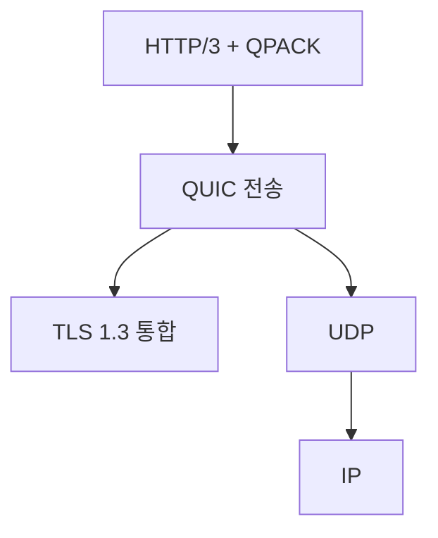
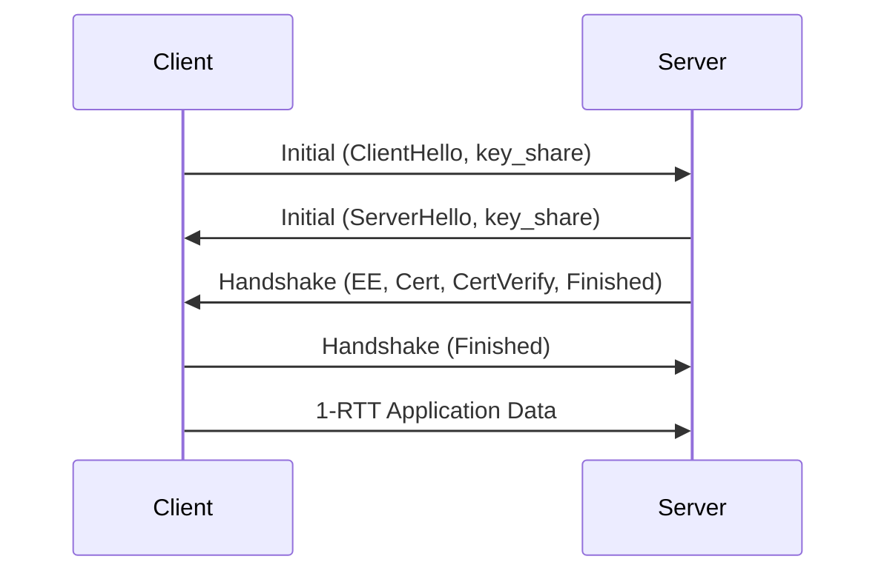
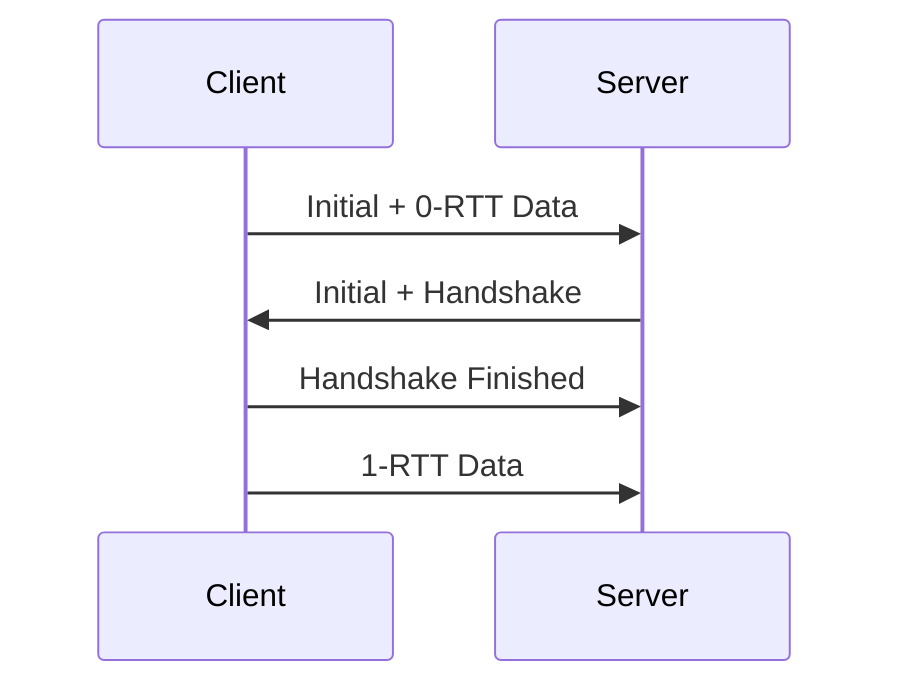
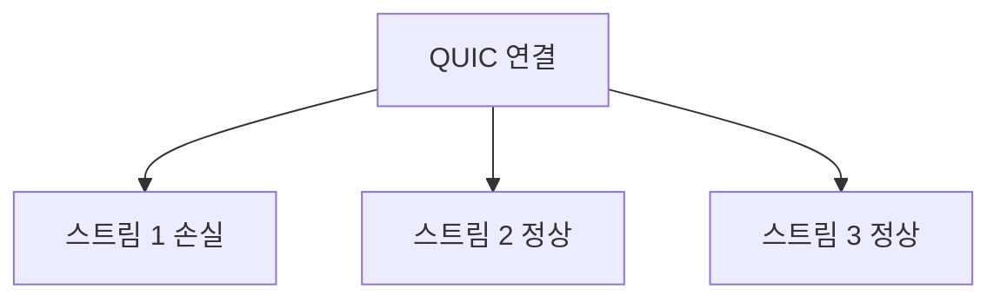

# HTTP/3 · QUIC 심층 (0-RTT · Migration · 운영 함정)

QUIC은 **UDP 위에 TCP+TLS+HTTP/2의 핵심 기능을 재조립**한 전송 프로토콜이다.
HTTP/3은 그 위에서 동작하는 HTTP 매핑일 뿐이며, 혁신의 90%는 QUIC에 있다.

이 글은 [HTTP 버전 비교](./http-versions.md)에서 다루지 않은
**QUIC의 실제 구조, 0-RTT 보안 함정, Connection Migration,
UDP/443 차단·NAT 문제, 운영 메트릭**을 다룬다.

---

## 1. 왜 QUIC인가

### 1-1. TCP가 못 고치는 것

| TCP의 한계 | QUIC의 답 |
|---|---|
| TCP HoL blocking — 한 스트림 손실이 전체 지연 | **스트림별 독립 암호화·손실 복구** |
| OS 커널에 박힌 코드 — 개선 배포 수년 | **유저스페이스 구현** → 프로토콜 진화 가속 |
| 3-way handshake + TLS = 2-3 RTT | **1-RTT, 재연결 0-RTT** |
| IP 바뀌면 연결 끊김 | **Connection ID 기반 Migration** |
| 미들박스가 헤더 검열·변형 | **암호화된 전송 계층** — 변조 어려움 |

### 1-2. 왜 UDP를 택했는가

- 기존 TCP를 커널에서 고치는 건 수십 년 단위 배포 문제
- 새 전송 프로토콜을 "꼭 필요한 만큼" 인터넷이 허용할 곳은 **UDP/443** 정도
- QUIC 자체는 UDP를 **얇은 전달자**로만 사용하고, 신뢰성·혼잡 제어·암호화는 전부 위에서 구현

---

## 2. 프로토콜 스택



| 계층 | 역할 |
|---|---|
| HTTP/3 (RFC 9114) | HTTP 의미를 QUIC 스트림에 매핑 |
| QPACK (RFC 9204) | HTTP/3 내부에서 사용하는 HoL-safe 헤더 압축 |
| QUIC 전송 (RFC 9000) | 스트림·흐름 제어·혼잡 제어·손실 복구 |
| QUIC-TLS (RFC 9001) | TLS 1.3 핸드셰이크·키 스케줄 통합 |
| UDP | 최소한의 전송 수단 |

TLS가 **별도 계층이 아니라 QUIC 안에 통합**된 것이 구조적 핵심.

---

## 3. 핸드셰이크 자세히

### 3-1. 1-RTT



- **Initial packet**이 평문(헤더는 보호) — 최소한의 협상 필드
- Handshake packet부터 **완전 암호화**
- TLS 1.3 대비: **핸드셰이크 자체가 전송 프로토콜에 융합** → 추가 RTT 없음

### 3-2. 0-RTT



- 재접속 시 클라이언트가 **핸드셰이크 완료를 기다리지 않고** 데이터 전송
- **재전송 공격 위험** — idempotent 요청(GET 등)만 안전
- 서버는 `anti-replay` 윈도우·`max_early_data_size` 제한 필요

### 3-3. 초기 패킷 크기 제약

| 제한 | 값 |
|---|---|
| Initial packet 최소 크기 | **1200 B** (RFC 9000) |
| Anti-amplification 비율 | 서버는 검증 전까지 받은 바이트의 **3배까지만** 송신 |

- PQ TLS 같이 큰 Client Hello에서 중요 — Initial이 여러 패킷에 걸칠 수 있음
- Retry 토큰으로 **주소 검증**을 거쳐 anti-amplification 해제

---

## 4. Connection ID와 Migration

### 4-1. 4-튜플 의존성 제거

전통 TCP는 `(src_ip, src_port, dst_ip, dst_port)`가 바뀌면 연결이 끊긴다.
QUIC은 **Connection ID (CID)**로 연결을 식별:

```
Packet → CID 추출 → 해당 연결의 상태로 라우팅
```

- 서버가 **`NEW_CONNECTION_ID` 프레임**으로 여러 CID를 미리 발급
- 클라이언트는 경로 변경 시 **`RETIRE_CONNECTION_ID`**로 기존 CID를 폐기하고 새 CID로 전환
- `active_connection_id_limit` 트랜스포트 파라미터로 동시에 사용할 CID 수 결정
- NAT 재바인딩·IP 변경에도 세션 유지

### 4-2. Connection Migration 실전

| 시나리오 | 결과 |
|---|---|
| Wi-Fi → LTE 전환 | **HTTP/3 연결 유지**, TCP는 재연결 필요 |
| 모바일에서 터널 진입 | 무중단 |
| IP 주소 변경 (DHCP 리스 갱신) | 무중단 |

**Path Validation (PATH_CHALLENGE / PATH_RESPONSE)**:
- 새 경로가 활성화되기 전, 서버는 **PATH_CHALLENGE**를 보내 클라이언트 응답을 검증
- 검증이 끝날 때까지 **3x anti-amplification 제한**이 다시 적용
- 서버 주도 Migration은 현재 표준에서 불가 — **클라이언트만 경로 전환 개시 가능**

### 4-3. 서버 측 라우팅 문제

- LB가 **CID로 일관되게 같은 백엔드로 보내야** 함
- 3~5계층 해시만 쓰는 전통 LB는 CID 기반 라우팅이 불가
- **QUIC-aware LB** 필요 (Cloudflare UDP 로드밸런싱, Envoy, HAProxy 3+ 등)

---

## 5. 혼잡 제어와 손실 복구

### 5-1. 혼잡 제어

- 기본은 **CUBIC 또는 BBR** — TCP와 동일 알고리즘 재사용
- 중요한 차이: **유저스페이스 구현** → 서버마다 다른 알고리즘 쓸 수 있음
- Google QUIC은 BBR로 실측 이점을 얻었다고 공개

### 5-2. 손실 복구

- TCP 3-dup ACK 같은 옛 방식 대신 **시간 기반 재전송 + 정확한 RTT 샘플링**
- **ACK 프레임의 Range 필드**(RFC 9000 §19.3)로 여러 수신 구간을 한 번에 확인 응답 —
  개수는 가변, 구현체가 성능 한계로 자체 상한 적용
- **PTO(Probe Timeout)**로 손실 감지 속도 향상

### 5-3. 스트림 분리



- 스트림 1에서 UDP 패킷이 유실돼도 **스트림 2·3은 그대로 진행**
- HTTP/2가 TCP에 의존하면서 생긴 HoL의 근본 해결

---

## 6. 헤더 압축 — QPACK

HPACK은 **스트림 순서에 HoL 의존**이라 QUIC에는 부적합.
QPACK은 다음을 도입:

| 구성 | 역할 |
|---|---|
| 정적 테이블 | 헤더 이름·값 조합 99개 엔트리 (RFC 9204 Appendix A) |
| 동적 테이블 | 반복 헤더 캐싱 |
| Encoder Stream | 동적 테이블 업데이트 전용 단방향 스트림 |
| Decoder Stream | 동적 참조 확인 단방향 스트림 |
| Required Insert Count | 참조된 동적 삽입 수 — HoL 회피 |

**결과**: 스트림들이 **순서와 무관하게** 헤더 압축 공유 가능.

---

## 7. 운영 — LB·CDN·방화벽

### 7-1. 로드밸런서 선택

| LB | HTTP/3 상태 |
|---|---|
| AWS CloudFront | GA (2022-08) |
| AWS ALB | **미지원** (2026-04) |
| GCP Cloud Load Balancing | GA |
| Azure Front Door | GA |
| Cloudflare | 기본 활성 |
| Nginx | 1.25+ 정식 |
| HAProxy | **2.6+ (2022-05) downstream 정식**, 3.3+ upstream 실험 |
| Envoy | downstream GA, upstream alpha |
| Traefik | 3.0+ (Experimental → 안정) |

### 7-2. 방화벽·NAT 함정

| 문제 | 영향 |
|---|---|
| UDP/443 차단 | HTTP/3 완전 실패 → 브라우저가 TCP 폴백 |
| UDP NAT 타임아웃 짧음 (30~60s) | 유휴 연결 조기 종료, 재연결 빈발 |
| Stateful 방화벽이 UDP 플로우 state 관리 부족 | 세션 드롭 |
| IPv6 필터 정책 불일치 | IPv6에서만 차단 |

### 7-3. QoS·트래픽 쉐이핑

- 일부 ISP·기업망이 UDP에 대해 **낮은 우선순위** 부여
- 비디오·VoIP와 공유 대역에서 QUIC이 불리할 수 있음

### 7-4. 알려진 보안 이슈

- QUIC는 **flood·amplification**에 대비해 Retry + 3x 제한 내장
- 그럼에도 큰 트래픽 공격에 대응하려면 **연결 속도 제한**, BPF/XDP 드롭
- QUIC의 TLS 1.3이 **CNSA 2.0·NIST PQC 권고의 적용 대상** — 전환 시 TLS 1.3과 같은 궤적

---

## 8. 관측 — 메트릭·qlog

### 8-1. 핵심 지표

| 메트릭 | 의미 |
|---|---|
| Handshake 성공률 | 0-RTT 포함 성공 비율 |
| Handshake RTT 분포 | 초기 연결 지연 |
| 0-RTT 거부율 | anti-replay에 의한 재전송 비율 |
| PTO 이벤트 | 손실 감지 빈도 |
| Migration 횟수 | 이동 빈번도 |
| UDP 드롭 | 하위 스택 품질 지표 |

### 8-2. qlog · qvis

QUIC은 표준 **qlog** (JSON 기반) 디버그 로그가 있다:

- qlog.org 스펙으로 이벤트·타임라인 기록
- **qvis**(qvis.quictools.info)로 시각화
- 이벤트 예: `packet_sent`, `packet_lost`, `recovery_metrics_updated`

네트워크 시뮬레이션 없이도 **패킷 레벨 분석**을 할 수 있는 첫 번째 프로토콜.

### 8-3. Wireshark

- 최신 Wireshark는 QUIC을 자동 분해
- **TLS 키 로그**를 주면 0-RTT/1-RTT 페이로드 복호화 가능
- SSLKEYLOGFILE 환경변수와 동일 방식

---

## 9. gRPC over QUIC (HTTP/3)

- gRPC 표준은 HTTP/2 기반. HTTP/3 지원은 구현체별로 **매우 제한적**
- gRPC-dotnet은 지원, **gRPC-Go 등 주요 구현은 미지원** (이슈 #5186 진행 중)
- 실무에선 quic-go 기반 **ConnectRPC** 등 우회 경로를 주로 사용
- 모바일 gRPC 워크로드에서 HoL 제거·Migration 이점이 큼
- 서비스 메시에서는 **아직 실험적** — Envoy upstream QUIC이 alpha

---

## 10. 실전 트러블슈팅

### 10-1. 증상별 체크

| 증상 | 우선 확인 |
|---|---|
| HTTP/3 아예 안 됨 | UDP/443 방화벽, Alt-Svc 헤더 존재 여부 |
| 연결은 되지만 느림 | 손실률, ISP의 UDP 우선순위 |
| Migration 후 끊김 | LB의 CID 라우팅 지원 |
| 0-RTT 동작 안 함 | 서버의 `max_early_data_size` 설정 |
| 크롬만 실패 | QUIC 버전 불일치, blocklist |

### 10-2. 명령 모음

```bash
# Alt-Svc 헤더 확인
curl -I https://example.com | grep -i alt-svc

# HTTPS DNS 레코드 확인
dig example.com HTTPS +short

# h3 강제
curl --http3-only -v https://example.com

# qlog 생성 (서버가 지원해야)
# → 대부분의 구현은 환경변수 QLOGDIR 설정
export QLOGDIR=/tmp/qlog

# Wireshark 실시간 분석
# TLS 키 로그를 주면 QUIC 페이로드 복호화
export SSLKEYLOGFILE=/tmp/sslkey.log
```

### 10-3. CDN 특화

- Cloudflare: Dashboard → SSL/TLS → Edge Certificates → HTTP/3 토글
- AWS CloudFront: Distribution 설정 → HTTP/3 지원 옵션
- Azure Front Door: 프로필별 HTTP/3 활성

---

## 11. 요약

| 주제 | 한 줄 요약 |
|---|---|
| QUIC | UDP 위 유저스페이스 전송 프로토콜 — TCP+TLS+HTTP/2의 재조립 |
| HTTP/3 | QUIC 위의 HTTP 매핑 (RFC 9114) |
| 1-RTT / 0-RTT | TLS 1.3 통합으로 재연결이 극적으로 빠름 |
| 0-RTT 주의 | idempotent 요청에만, anti-replay 필수 |
| Connection ID | 4-튜플 의존성 제거 → Migration 가능 |
| LB 라우팅 | CID 인식 LB 필요 — ALB 같은 전통 LB는 미지원 |
| HoL 제거 | 스트림별 독립 암호화·손실 복구 |
| 방화벽 | UDP/443 차단이 여전히 큰 장벽 |
| qlog | 표준 디버그 로그로 패킷 레벨 분석 용이 |
| 배포 | CDN·현대 LB는 지원, 전통 LB·기업 방화벽이 주요 장애물 |

---

## 참고 자료

- [RFC 9000 — QUIC Transport](https://www.rfc-editor.org/rfc/rfc9000) — 확인: 2026-04-20
- [RFC 9001 — Using TLS to Secure QUIC](https://www.rfc-editor.org/rfc/rfc9001) — 확인: 2026-04-20
- [RFC 9002 — QUIC Loss Detection and Congestion Control](https://www.rfc-editor.org/rfc/rfc9002) — 확인: 2026-04-20
- [RFC 9114 — HTTP/3](https://www.rfc-editor.org/rfc/rfc9114) — 확인: 2026-04-20
- [RFC 9204 — QPACK](https://www.rfc-editor.org/rfc/rfc9204) — 확인: 2026-04-20
- [qlog Main Spec (IETF Draft)](https://datatracker.ietf.org/doc/draft-ietf-quic-qlog-main-schema/) — 확인: 2026-04-20
- [qvis](https://qvis.quictools.info/) — 확인: 2026-04-20
- [Cloudflare Blog — Five years of HTTP/3](https://blog.cloudflare.com/http3-usage-one-year-on/) — 확인: 2026-04-20
- [Google — QUIC protocol](https://www.chromium.org/quic/) — 확인: 2026-04-20
- [Meta — How Meta scaled QUIC](https://engineering.fb.com/2022/10/25/networking-traffic/) — 확인: 2026-04-20
- [Nginx QUIC docs](https://nginx.org/en/docs/quic.html) — 확인: 2026-04-20
