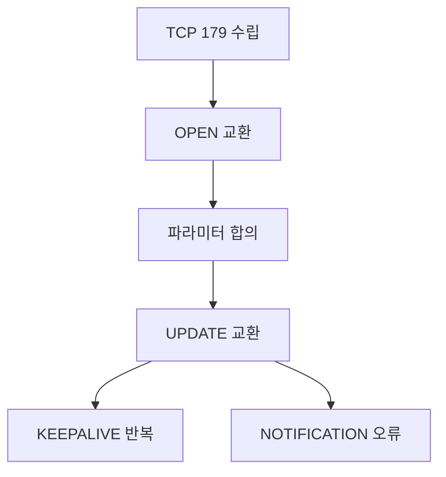
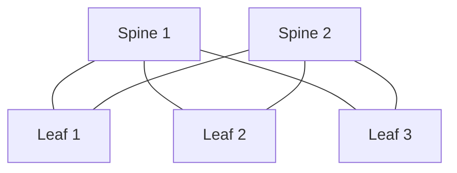

# BGP 기본 (AS · 피어링 · BGP in DC)

BGP는 원래 **인터넷을 연결하는 라우팅 프로토콜**이었지만,
현대 데이터센터·Kubernetes·클라우드 하이브리드에서도 핵심 도구가 되었다.

- Calico·Cilium은 BGP로 Pod CIDR을 광고한다
- AWS Direct Connect, Azure ExpressRoute는 BGP로 경로를 교환한다
- MetalLB·Cilium LB IPAM은 BGP로 서비스 VIP를 광고한다

이 글은 인터넷 BGP의 기본 개념을 짧게 짚고,
**DevOps 엔지니어가 실제로 접하는 BGP 사용 패턴**에 집중한다.

---

## 1. AS와 BGP의 기본 구도

### 1-1. Autonomous System (AS)

**AS**는 한 조직이 운영하는 라우팅 도메인이다.

| 항목 | 내용 |
|---|---|
| 목적 | 한 조직의 라우팅 정책 단위 |
| 번호 | 16비트(0~65535) + 32비트(65536~4294967295) |
| 사설 AS | 64512~65534 (16b), 4200000000~4294967294 (32b) |
| 할당 | RIR (APNIC, ARIN, RIPE 등) |

### 1-2. IGP vs EGP

| 분류 | 동작 범위 | 대표 프로토콜 |
|---|---|---|
| IGP (Interior Gateway Protocol) | 같은 AS 내부 | OSPF, IS-IS, RIP |
| EGP (Exterior Gateway Protocol) | AS 간 | **BGP-4** (사실상 유일) |

BGP는 원래 EGP지만, 같은 AS 안에서도 쓰면 **iBGP**,
다른 AS와 쓰면 **eBGP**라고 부른다.

### 1-3. iBGP vs eBGP

| 특성 | eBGP | iBGP |
|---|---|---|
| 상대 AS | 다름 | 같음 |
| TTL 기본 | 1 (옆집 라우터) | 255 |
| 경로 재광고 | 이웃에게 전파 | **iBGP 피어에는 재광고 안 함** (split horizon) |
| AS_PATH 변경 | 자기 AS 추가 | 건드리지 않음 |
| LOCAL_PREF | 0 | 경로 선택 지표 |
| 설계 의도 | AS 간 정책 | AS 내부 경로 전파 |

**iBGP split horizon 규칙**: iBGP **피어로부터 받은** 경로는
**다른 iBGP 피어에게 재광고하지 않는다** (eBGP에서 받은 경로는 iBGP로 전파함).
이 규칙 때문에 AS 내부 라우터가 많아지면 **풀 메시 iBGP**가 필요하다 —
Route Reflector가 해결책.

---

## 2. 메시지와 세션 수립



| 메시지 | 용도 |
|---|---|
| OPEN | AS 번호·Hold Time·Capabilities 통지 |
| UPDATE | 경로 광고·철회 |
| KEEPALIVE | 세션 유지 (기본 60초 간격) |
| NOTIFICATION | 오류 시 세션 종료 사유 전달 |
| ROUTE-REFRESH | 정책 변경 후 전체 재광고 요청 |

세션 상태 머신: **Idle → Connect → Active → OpenSent → OpenConfirm → Established**.
"Established가 아니면 경로는 못 받는다."

---

## 3. 경로 속성과 선택 알고리즘

UPDATE 메시지에는 여러 **Path Attribute**가 함께 온다.

### 3-1. 주요 속성

| 속성 | 유형 | 의미 |
|---|---|---|
| AS_PATH | Well-known mandatory | 경로가 거쳐온 AS 목록 — 루프 방지, 길이 비교 |
| NEXT_HOP | Well-known mandatory | 다음 홉 IP |
| LOCAL_PREF | Well-known discretionary | AS 내부 선호도 (iBGP에서만 의미) |
| MED (Multi-Exit Discriminator) | Optional | 다른 AS에게 "이 경로로 들어와달라" 힌트 |
| COMMUNITY | Optional transitive | 32비트 태그 (RFC 1997) — 정책 제어 |
| LARGE_COMMUNITY | Optional transitive | 4-byte ASN용 확장 (RFC 8092) — 현대 표준 |
| ORIGIN | Well-known mandatory | IGP / EGP / Incomplete |

### 3-2. 경로 선택 순서 (현업 머릿속에 박아둘 순서)

| 순위 | 지표 | 비고 |
|---|---|---|
| 1 | Weight (높을수록 우선) | **Cisco/Arista 벤더 확장** — FRR·BIRD에 없음 |
| 2 | LOCAL_PREF (높을수록 우선) | iBGP 내부 선호 표현 |
| 3 | 자기가 originate한 경로 | |
| 4 | AS_PATH 길이 (짧을수록 우선) | 표준 척도 |
| 5 | ORIGIN | IGP > EGP > Incomplete |
| 6 | MED (낮을수록 우선) | 같은 AS에서 온 경로끼리만 |
| 7 | eBGP > iBGP | |
| 8 | IGP metric (낮을수록 우선) | next-hop까지 거리 |
| 9 | Router ID (낮을수록 우선) | 마지막 동점 해결 |

**암기 포인트**: LOCAL_PREF → AS_PATH → MED → eBGP/iBGP 순서가
표준 구현의 실무 90%를 커버한다. Weight는 Cisco 계열 전용.

---

## 4. Route Reflector와 Confederation

### 4-1. 풀 메시 문제

iBGP는 split horizon 때문에 **N개 라우터가 모두 서로 피어링**해야 한다.
피어 수는 N(N−1)/2로 증가 — 100대면 ~5000 세션.

### 4-2. Route Reflector (RR)

RR은 "iBGP 경로를 다른 iBGP 피어에게 재광고해도 된다"는 예외를 가진 라우터.

| 역할 | 내용 |
|---|---|
| RR Client | RR로부터 경로 받고, RR에게만 광고 |
| Non-Client iBGP | 전통 방식대로 풀 메시 |
| Cluster ID | RR 그룹 식별자 — 루프 방지 |

실무에선 대부분 **RR 이중화** + Cluster ID로 구성.

### 4-3. Confederation

AS를 여러 Sub-AS로 나눠서 관리하는 방식. RR보다 복잡해서
현대 DC에서는 **거의 RR만 쓴다**.

---

## 5. BGP in Data Center (BGP in the DC)

현대 대규모 DC 네트워크는 **스파인-리프 + eBGP**로 구성된다.
이것이 RFC 7938 "BGP as a Data-Center Routing Protocol"의 권고다.

### 5-1. Clos 토폴로지



| 계층 | 역할 |
|---|---|
| Spine | 모든 Leaf를 연결하는 고속 백본 |
| Leaf (ToR) | 서버·랙과 직결 |

**모든 서버 간 홉 수는 동일** (Leaf ↔ Spine ↔ Leaf = 2홉).
ECMP 경로 수가 많아 Fabric 전체가 **수평 확장** 가능.

> **ECMP 활성화 필수 설정**: BGP 기본 동작은 하나의 best path만 설치한다.
> Fabric에서 여러 Spine 경로를 동시에 쓰려면 구현별로 추가 설정이 필요하다:
>
> - FRR/Cisco: `maximum-paths <N>`
> - `bestpath as-path multipath-relax` (다른 이웃 AS 경로도 ECMP로)
> - 또는 BGP Add-Paths (RFC 7911)

### 5-2. 왜 OSPF가 아닌 BGP인가

| 이유 | 상세 |
|---|---|
| 단일 프로토콜 | DC 내부(Underlay) + 클라우드 연결(Overlay·WAN)을 BGP로 통합 |
| 확장성 | OSPF LSA 플러딩이 대규모에 부담 |
| 정책 표현력 | Community·LOCAL_PREF 등 풍부한 정책 |
| 장애 격리 | AS 경계가 폴트 도메인 역할 |

**RFC 7938의 ASN 설계 권고**:

| 계층 | ASN 할당 |
|---|---|
| Tier-1 (Spine) | 단일 공용 ASN 또는 각 Spine별 고유 ASN |
| Tier-2 (클러스터) | 클러스터마다 고유 ASN |
| Tier-3 (Leaf/ToR) | ToR마다 고유 ASN |

모든 링크는 **eBGP**로 동작 — iBGP split horizon 문제를 회피한다.
사설 AS(4-byte 포함)를 넉넉히 써서 고유성을 확보한다.

### 5-3. BGP Unnumbered

링크마다 IP 주소를 할당하지 않고 **IPv6 링크 로컬**로 피어링.

```
# FRR 예시
router bgp 65001
 neighbor swp1 interface remote-as external
 neighbor swp2 interface remote-as external
 address-family ipv4 unicast
  redistribute connected
```

**장점**: IP 절약, 자동 구성, 설정 단순.
Calico·Cumulus·SONiC·Arista가 지원.

---

## 6. Kubernetes에서 만나는 BGP

### 6-1. Calico BGP 모드

Calico는 기본적으로 각 노드를 **작은 BGP 라우터**로 만들어
Pod CIDR을 광고한다.

| 광고 주체 | 대상 | 광고되는 prefix |
|---|---|---|
| Node A (calico-node) | ToR switch | 10.244.1.0/24 (Node A Pod CIDR) |
| Node B (calico-node) | ToR switch | 10.244.2.0/24 (Node B Pod CIDR) |

| Calico BGP 모드 | 특징 |
|---|---|
| Full Mesh (기본) | 모든 노드끼리 iBGP 피어 (~100~200노드까지 권장) |
| Route Reflector | RR 노드를 둬서 확장, 수백~수천 노드 클러스터 표준 |
| External BGP (ToR) | ToR 스위치와 직접 피어링 — 언더레이 통합 |

### 6-2. Cilium BGP Control Plane

Cilium은 GoBGP 기반 BGP Control Plane으로
- Pod CIDR 광고
- LoadBalancer 서비스 IP 광고 (LB IPAM)
- MD5 인증·Route Reflector·Community 지원

### 6-3. MetalLB BGP 모드

MetalLB는 베어메탈 K8s에서 **LoadBalancer 서비스 VIP**를
BGP로 TOR에 광고해 External IP를 실제로 라우팅 가능하게 만든다.

| MetalLB 모드 | 동작 |
|---|---|
| L2 | ARP/NDP로 VIP 응답 — 단일 노드만 트래픽 수신 |
| BGP | 여러 노드가 동시에 광고, ECMP 분산 |

**프로덕션에서 BGP 모드를 선호**하는 이유는 ECMP로 노드 장애 시
세션 유지·부하 분산이 가능하기 때문이다.

---

## 7. 클라우드 BGP

### 7-1. AWS Direct Connect · Azure ExpressRoute · GCP Cloud Interconnect

온프레미스-클라우드 전용선은 **BGP로 경로를 교환**한다.

| CSP | 용어 | 기본 타이머 |
|---|---|---|
| AWS | Virtual Interface (VIF) | Hold 90s, Keepalive 30s (**RFC 기본값 180/60과 다름**) |
| Azure | ExpressRoute Circuit | Hold 180s, Keepalive 60s |
| GCP | Cloud Interconnect VLAN Attachment | **Hold 60s, Keepalive 20s** (조정 가능, 20~60) |

**요구사항**:
- 사설 AS 사용 (64512~65534)
- MD5 인증 (선택)
- BFD로 빠른 장애 감지 (권장)
- IPv4 + IPv6 개별 세션

### 7-2. AWS Transit Gateway 동적 라우팅

TGW와 VPN·Direct Connect 연결 시 BGP가 경로를 자동 전파.
경로 수 제한(기본 1000)·ECMP 옵션 등이 설계 포인트.

---

## 8. BGP 보안 — RPKI · BGPsec

BGP는 원래 **경로 출처를 검증하지 않는** 프로토콜이라
**경로 하이재킹**이 실제 장애로 이어졌다
(2008-02 Pakistan Telecom이 YouTube `208.65.153.0/24`를 잘못 광고해 글로벌 장애 등).

### 8-1. RPKI (Resource Public Key Infrastructure)

| 구성 | 역할 |
|---|---|
| ROA (Route Origin Authorization) | "AS X가 prefix P를 광고해도 된다" 서명 |
| Validator | Cloudflare `rpki-client`, Routinator, FORT |
| Router | Validator에서 받은 VRP로 경로 검증 |

RPKI로 검증된 경로만 수락하면 **단순 하이재킹은 차단**된다.
Cloudflare·Google·NTT 등 주요 사업자는 이미 채택.

### 8-2. BGPsec · RPKI-ROV 한계

- **BGPsec**: AS_PATH 서명 — 복잡도 대비 채택 매우 낮음
- **RPKI-ROV**: 출처(origin)만 검증, **경로 조작은 막지 못함**
- **ASPA**: AS_PATH 일관성 검증 — 2025-12 RIPE NCC, 2026-01 ARIN이
  프로덕션 지원을 시작하며 차세대 라우팅 보안으로 자리잡는 중

---

## 9. 타이머·BFD·컨버전스

### 9-1. 기본 BGP 타이머

| 타이머 | 기본 | 역할 |
|---|---|---|
| Keepalive | 60 s | 주기적 헬로 |
| Hold | 180 s | 이 시간 동안 아무것도 못 받으면 세션 종료 |
| MRAI (Minimum Route Advertisement Interval) | RFC 기본 30s(eBGP)/5s(iBGP) — **현대 구현은 대부분 0 또는 비활성** | 광고 최소 간격 |

### 9-2. BFD로 빠른 장애 감지

BFD는 밀리초 단위 헬로로 경로 장애를 감지한다.
BGP는 Hold Time이 길어서 BFD 없이는 장애 감지가 수십 초 걸린다.

```
# FRR 예시
interface swp1
 bfd
router bgp 65001
 neighbor 192.0.2.1 bfd
```

BFD + BGP = **서브초 컨버전스**. DC 패브릭에서 필수.

---

## 10. 트러블슈팅 체크리스트

| 증상 | 확인 |
|---|---|
| 세션이 Established 안 됨 | TCP 179 reachability, AS 번호 오타, `neighbor` 설정 |
| 세션은 되는데 경로 없음 | `redistribute`·정책 필터·next-hop self 여부 |
| 일부 경로만 전파 안 됨 | 프리픽스 리스트·route-map, community 필터 |
| 경로 플래핑 | Link flap, Damping 정책, BFD 타이머 |
| 잘못된 경로 선택 | 선택 알고리즘 순서로 역추적 (LOCAL_PREF부터) |
| 하이재킹 의심 | RPKI 검증 상태, BGPStream |

**FRR 명령**:
```bash
vtysh -c 'show bgp summary'
vtysh -c 'show bgp ipv4 unicast'
vtysh -c 'show bgp ipv4 unicast neighbors 192.0.2.1'
vtysh -c 'show bgp ipv4 unicast <prefix>'
```

---

## 11. 요약

| 개념 | 한 줄 요약 |
|---|---|
| AS | 한 조직의 라우팅 정책 도메인 |
| eBGP vs iBGP | AS 간 vs AS 내부. iBGP는 split horizon 규칙 있음 |
| 경로 선택 | LOCAL_PREF → AS_PATH → MED → eBGP/iBGP 순이 실무 90% |
| Route Reflector | iBGP 풀 메시 문제를 해결 |
| BGP in DC | Clos + eBGP, AS per ToR (RFC 7938) |
| Unnumbered | IPv6 링크 로컬로 IP 절약 |
| K8s | Calico·Cilium·MetalLB가 모두 BGP 사용 |
| 클라우드 | Direct Connect·ExpressRoute·Interconnect 모두 BGP |
| 보안 | RPKI로 origin 검증 — 채택률 급상승 |
| BFD | 서브초 컨버전스 필수 |

---

## 참고 자료

- [RFC 4271 — BGP-4](https://www.rfc-editor.org/rfc/rfc4271) — 확인: 2026-04-20
- [RFC 7938 — BGP as a DC Routing Protocol](https://www.rfc-editor.org/rfc/rfc7938) — 확인: 2026-04-20
- [RFC 4364 — BGP/MPLS IP VPNs](https://www.rfc-editor.org/rfc/rfc4364) — 확인: 2026-04-20
- [RFC 6480 — RPKI Architecture](https://www.rfc-editor.org/rfc/rfc6480) — 확인: 2026-04-20
- [RFC 5880 — Bidirectional Forwarding Detection (BFD)](https://www.rfc-editor.org/rfc/rfc5880) — 확인: 2026-04-20
- [FRR BGP docs](https://docs.frrouting.org/en/latest/bgp.html) — 확인: 2026-04-20
- [Calico docs — BGP networking](https://docs.tigera.io/calico/latest/networking/configuring/bgp) — 확인: 2026-04-20
- [Cilium BGP Control Plane](https://docs.cilium.io/en/stable/network/bgp-control-plane/) — 확인: 2026-04-20
- [MetalLB BGP mode](https://metallb.universe.tf/concepts/bgp/) — 확인: 2026-04-20
- [Cloudflare — A brief history of the Internet's biggest BGP incidents](https://blog.cloudflare.com/rpki/) — 확인: 2026-04-20
- [NIST RPKI Monitor](https://rpki-monitor.antd.nist.gov/) — 확인: 2026-04-20
