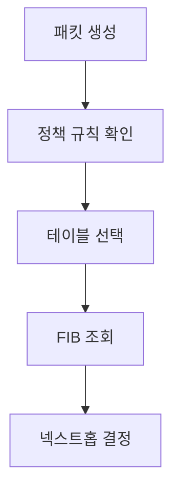
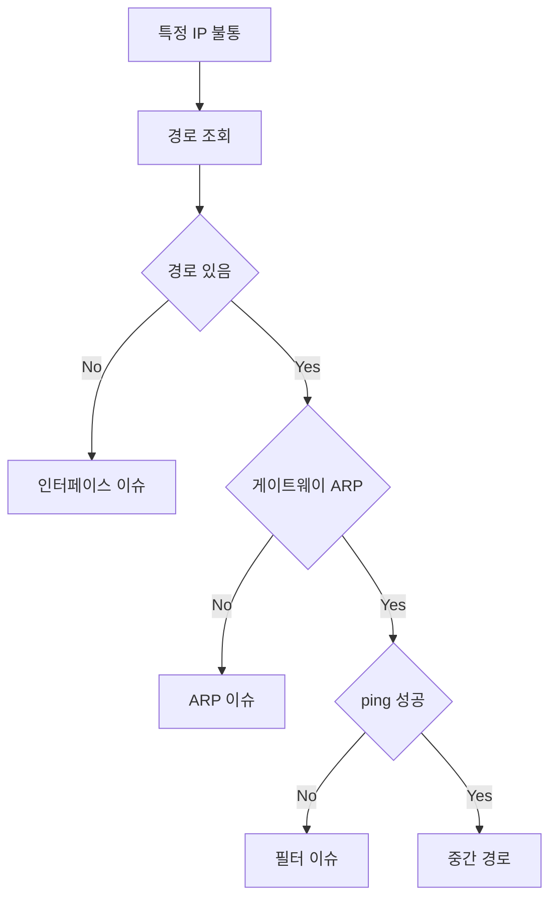

# 라우팅 기본 (테이블 · ECMP · 정책 라우팅)

"ping은 되는데 curl은 안 된다", "같은 노드에서 특정 IP만 안 된다"
같은 이상 증상의 90%는 **라우팅 테이블에서 해석할 수 있다**.

이 글은 리눅스 호스트 관점에서 라우팅 결정이 어떻게 이루어지는지,
ECMP·정책 라우팅·클라우드 VPC 라우팅까지 실무에 필요한 범위를 정리한다.

> BGP·OSPF 같은 라우팅 프로토콜의 상세는 [BGP 기본](./bgp-basics.md) 참고.

---

## 1. 라우팅 결정의 3단계



| 단계 | 주체 | 설명 |
|---|---|---|
| 정책 규칙 | `ip rule` | "이 조건이면 저 테이블을 본다" |
| 테이블 선택 | 규칙 결과 | main, local, default, 사용자 정의 |
| FIB 조회 | 커널 | **가장 긴 prefix 매치** 원칙 |

RIB(Routing Information Base)는 제어 평면(BGP·OSPF 데몬 등)에서 학습한
**모든 경로**의 집합, FIB(Forwarding Information Base)는 커널 포워딩 경로에
**실제로 설치된** 최적 경로다. 실무에서 "라우팅 테이블을 본다"는 대부분 FIB다.

---

## 2. 리눅스 라우팅 테이블 읽는 법

### 2-1. 기본 조회

```bash
# 모든 경로 (main 테이블 기본)
ip route show

# 더 읽기 쉬운 출력
ip -c route

# 특정 IP로 가는 경로가 어떻게 결정될지 시뮬레이션
ip route get 1.1.1.1
```

### 2-2. 대표 출력 해석

```
default via 10.0.0.1 dev eth0 proto dhcp src 10.0.0.15 metric 100
10.0.0.0/24 dev eth0 proto kernel scope link src 10.0.0.15
169.254.169.254 dev eth0 scope link
```

| 필드 | 의미 |
|---|---|
| `default` | 0.0.0.0/0 — 매칭되는 경로가 없을 때 사용 |
| `via <IP>` | 넥스트홉 게이트웨이 |
| `dev <iface>` | 나가는 인터페이스 |
| `proto` | 경로를 설치한 주체 (kernel, dhcp, bgp, static) |
| `scope link` | 같은 L2에 있어 ARP로 바로 해결 |
| `scope host` | 자기 자신 (local 테이블) |
| `src` | 송신 시 source IP로 쓸 값 |
| `metric` | 같은 prefix 경로가 여럿일 때의 우선순위 (낮을수록 우선) |

### 2-3. 가장 긴 prefix 매치

```bash
# 예시 FIB
default via 10.0.0.1 dev eth0
10.0.0.0/8 via 10.0.0.2 dev eth0
10.1.0.0/16 via 10.0.0.3 dev eth0
10.1.2.0/24 via 10.0.0.4 dev eth0

# 10.1.2.5로 보내면?
# → /24 > /16 > /8 > default, 따라서 10.0.0.4가 선택됨
```

**원칙**: 커널은 항상 **가장 구체적인(=prefix 길이가 가장 긴) 경로**를 택한다.

---

## 3. 경로 추가·삭제

```bash
# 정적 경로 추가 (일시)
ip route add 192.168.10.0/24 via 10.0.0.5

# 특정 인터페이스 경유
ip route add 192.168.10.0/24 dev tun0

# 특정 src IP로 강제 (멀티홈 호스트)
ip route add 192.168.10.0/24 via 10.0.0.5 src 10.0.0.15

# 삭제
ip route del 192.168.10.0/24

# 영구 설정
# - systemd-networkd: /etc/systemd/network/*.network
# - NetworkManager: nmcli connection modify ... ipv4.routes
# - netplan: /etc/netplan/*.yaml
```

---

## 4. ECMP — Equal-Cost Multi-Path

여러 경로가 동일한 비용으로 존재할 때 **트래픽을 분산**한다.

```bash
ip route add default \
  nexthop via 10.0.0.1 dev eth0 weight 1 \
  nexthop via 10.0.0.2 dev eth0 weight 1
```

### 4-1. 해시 기반 분산

ECMP는 라운드로빈이 아니라 **패킷 헤더 해시**로 경로를 고른다:

| 리눅스 설정 | 해시 입력 |
|---|---|
| `fib_multipath_hash_policy = 0` (기본) | 외부 L3 (src·dst IP) |
| `= 1` | 외부 L3 + L4 (포트 포함) |
| `= 2` | 외부 L3 기본, 캡슐화 패킷은 **내부 L3 우선** |
| `= 3` | `fib_multipath_hash_fields` 비트마스크로 필드 직접 지정 |

```bash
# 현재 정책 확인·변경
sysctl net.ipv4.fib_multipath_hash_policy
sysctl -w net.ipv4.fib_multipath_hash_policy=1
```

### 4-2. 같은 플로우는 같은 경로

해시 분산의 핵심 효과는 **같은 (src, dst, src port, dst port) 플로우가 항상 같은 경로로**
간다는 것이다. TCP 순서 보장·상태 유지를 위해 필수다.

### 4-3. 한계

| 한계 | 내용 |
|---|---|
| 엘리펀트 플로우 | 한 덩치 큰 플로우가 한 경로를 독점 → 불균형 |
| 해시 폴라라이제이션 | 다단 ECMP에서 같은 해시 사용 시 일부 경로에만 몰림 |
| 경로 추가·삭제 | **기본 ECMP는 버킷을 재해싱** → 기존 플로우 상당수가 경로 변경·리셋 |
| 해시 정책 변경 | 운영 중 정책을 바꾸면 모든 기존 플로우가 재해싱됨 |

**Resilient Nexthop Group** (Linux 5.12+, `type resilient`)은 경로 변경 시
해시 버킷 재배치를 최소화해 **이미 연결된 세션은 그대로 유지**한다.
BGP·BFD 기반 DC 패브릭에서 빠른 컨버전스와 세션 유지를 동시에 챙길 수 있다.

DC 스파인-리프 구조에서는 ECMP가 기본이지만
**L4 해시 정책** 전환과 **플로우렛 스위칭**이 엘리펀트 플로우 완화에 쓰인다.

---

## 5. 정책 라우팅 (Policy Routing)

"출발지가 X면 테이블 A, Y면 테이블 B"처럼 **복잡한 결정**을 할 때 쓴다.

### 5-1. 기본 테이블들

| 테이블 | 번호 | 용도 |
|---|---|---|
| `local` | 255 | 자기 자신·브로드캐스트 |
| `main` | 254 | 일반 유저가 만지는 "그" 테이블 |
| `default` | 253 | 거의 안 씀 |
| `unspec` | 0 | 내부 |

### 5-2. 규칙 조회·추가

```bash
# 현재 규칙
ip rule show

# 출력 예
# 0:    from all lookup local
# 32766:  from all lookup main
# 32767:  from all lookup default
```

```bash
# 사용자 정의 테이블
echo "100 mgmt" | sudo tee -a /etc/iproute2/rt_tables

# 관리망 서브넷에서 오는 트래픽은 mgmt 테이블로
ip rule add from 10.10.0.0/24 table mgmt priority 1000

# mgmt 테이블에 기본 경로 설정
ip route add default via 10.10.0.1 table mgmt
```

### 5-3. 실전 쓰임새

| 시나리오 | 해결 |
|---|---|
| 멀티홈 (WAN 2개) | 출발 인터페이스별 테이블 분리 |
| VPN over default route | VPN 트래픽은 별도 테이블 |
| K8s Egress Gateway | 특정 파드 네임스페이스만 NAT 경유 |
| 클라우드 VPC endpoint | 특정 대역만 프라이빗 엔드포인트로 |

WireGuard·OpenVPN 같은 VPN 도구도 내부적으로 정책 라우팅을 사용한다.

---

## 6. 넥스트홉 그룹 (nexthop object)

리눅스 5.3+에서 도입된 **재사용 가능한 넥스트홉 객체**.
BGP Unnumbered·eBPF 데이터플레인·Cilium·FRR이 사용한다.

```bash
# 넥스트홉 객체 생성
ip nexthop add id 1 via 10.0.0.1 dev eth0
ip nexthop add id 2 via 10.0.0.2 dev eth0

# 그룹으로 묶기 (ECMP)
ip nexthop add id 100 group 1/2

# 경로는 그룹만 참조
ip route add 192.168.0.0/16 nhid 100
```

**장점**:
- ECMP 업데이트 시 경로 수천 개를 한 번에 갱신 가능
- FIB 메모리 절감
- BGP·BFD 연동 시 컨버전스 가속

---

## 7. Source-Based Routing과 Reverse Path Filter

멀티홈 호스트에서 **출발지 IP**에 따라 경로가 달라질 때,
리눅스 기본 동작은 다음과 같다.

### 7-1. `rp_filter`

| 값 | 의미 |
|---|---|
| 0 | 검증 안 함 |
| 1 | **엄격**(RFC 3704 권장): 수신 패킷의 역경로가 같은 인터페이스인지 확인 |
| 2 | 느슨: 역경로가 **어떤 인터페이스든** 있으면 OK |

**증상**: 멀티홈 환경에서 비대칭 라우팅 패킷이 **소리 없이 드롭**.
이때 `sysctl -w net.ipv4.conf.all.rp_filter=2`로 완화 (보안 트레이드오프 있음).

> **함정**: `net.ipv4.conf.all.rp_filter`와
> `net.ipv4.conf.<iface>.rp_filter` 중 **더 큰 값이 최종 적용**된다.
> `all`만 0으로 낮춰도 인터페이스별 값이 1이면 여전히 strict로 동작한다.
> 반드시 `default` 또는 개별 인터페이스 값도 함께 조정해야 한다.

> IPv6에는 `rp_filter` sysctl이 없다. 동등 기능은 netfilter의
> `rpfilter` 매치(`ip6tables ... -m rpfilter`)로 구현한다.

### 7-2. ARP 필터링

```bash
# 멀티홈 + 같은 서브넷에 여러 인터페이스 시 필수
sysctl -w net.ipv4.conf.all.arp_filter=1
sysctl -w net.ipv4.conf.all.arp_announce=2
sysctl -w net.ipv4.conf.all.arp_ignore=1
```

ARP 테이블 오염·ARP 스푸핑 방지에 사용.

---

## 8. 클라우드 VPC 라우팅

### 8-1. 라우트 테이블 구조

| CSP | 명칭 | 기본 경로 |
|---|---|---|
| AWS | Route Table | local (VPC CIDR), IGW 기본, 명시 추가 |
| GCP | VPC Route | Subnet 기본, Default Internet |
| Azure | Route Table (UDR) | System routes + 사용자 정의 |

VPC 내부는 **묵시적 local 경로**로 항상 통신 가능.
외부로 가려면 IGW·NAT·TGW·VPN 중 하나가 필요하다.

### 8-2. 리눅스 호스트와 VPC 라우팅의 상호작용

- 인스턴스 내부 `ip route`는 **VPC DHCP가 기본 게이트웨이만 설정**
- 실제 라우팅 결정은 **VPC 라우트 테이블에서** 일어남
- 인스턴스에서 static route를 추가해도 **VPC 라우트 테이블이 없으면 반환 트래픽 불가**

### 8-3. AWS 예시 — NAT 게이트웨이 경로

```
# 프라이빗 서브넷 라우트 테이블
Destination        Target
10.0.0.0/16        local
0.0.0.0/0          nat-gateway-id
```

**함정**:
- NAT GW는 **AZ 단위**다. 다른 AZ의 NAT GW를 쓰면 AZ 교차 요금 발생
- NAT GW는 **outbound only**. 인바운드는 IGW + EIP 또는 LB 필요
- **처리량 요금**(GB당 과금)이 크로스 AZ 요금보다 부담이 큰 경우가 많다
- **S3·DynamoDB는 Gateway VPC Endpoint**로 NAT GW를 우회하는 것이 비용·지연 양쪽에서 유리

---

## 9. K8s에서의 라우팅

| 상황 | 어디서 결정? |
|---|---|
| 파드 → 같은 노드 파드 | veth pair + 노드 라우팅 |
| 파드 → 다른 노드 파드 | CNI (Calico BGP, Cilium eBPF, VXLAN 등) |
| 파드 → ClusterIP | kube-proxy (iptables/IPVS) 또는 eBPF |
| 파드 → 외부 | 노드의 기본 경로, SNAT |
| 외부 → Service | NodePort / LoadBalancer / Ingress |

```bash
# 노드에서 파드로 가는 경로 확인
ip route show table main

# 예: Calico BGP 모드가 설치한 경로
10.244.1.0/24 via 10.0.0.12 dev eth0 proto bird
10.244.2.0/24 via 10.0.0.13 dev eth0 proto bird
```

**주의**: Calico는 모드에 따라 경로 proto가 다르다.

| Calico 모드 | proto 표시 | 비고 |
|---|---|---|
| BGP (BIRD) | `proto bird` | 전통적 기본 |
| VXLAN | `proto 80` 또는 Calico 자체 프로토 | BIRD 없음 |
| WireGuard | `proto 80` | 노드 간 암호화 |
| eBPF 모드 | `proto 80` + eBPF 맵 | BGP 옵션 |

**Cilium 환경**에서는 대부분 **eBPF 기반 포워딩**이므로 `ip route`에 파드 경로가
보이지 않을 수 있다. `cilium bpf tunnel list`, `cilium bpf lb list`로 확인.

---

## 10. 트러블슈팅 플로우



### 10-1. 체크 순서

| 단계 | 명령 |
|---|---|
| 경로 존재 | `ip route get <dst>` |
| 넥스트홉 ARP | `ip neigh show <gw>` |
| 정책 규칙 | `ip rule show` |
| rp_filter | `sysctl -a \| grep rp_filter` |
| 인터페이스 상태 | `ip -s link show <iface>` |
| 컨트롤 플레인 | FRR·BIRD 로그, BGP 세션 상태 |

---

## 11. IPv6 라우팅 차이

IPv6 라우팅은 기본 메커니즘은 같지만 실무 도구·sysctl이 다르다.

| 항목 | IPv4 | IPv6 |
|---|---|---|
| 경로 조회 | `ip route` 또는 `ip -4 route` | `ip -6 route` |
| 정책 규칙 | `ip rule` | `ip -6 rule` |
| sysctl 경로 | `net.ipv4.*` | `net.ipv6.*` |
| 역경로 필터 | `rp_filter` sysctl | netfilter `rpfilter` 모듈 |
| 링크 로컬 | 169.254/16 | fe80::/10 (모든 인터페이스마다 존재) |
| 기본 경로 학습 | DHCP | RA (Router Advertisement) + SLAAC |

```bash
# 대표 명령
ip -6 route show
ip -6 rule show
ip -6 route get 2001:db8::1

# IPv6 RA 수신 여부 제어
sysctl net.ipv6.conf.eth0.accept_ra
```

> IPv6는 **링크 로컬 주소(fe80::)**가 모든 인터페이스에 자동 부여되며,
> 경로 조회 시 인터페이스를 명시해야 한다 (예: `ping fe80::1%eth0`).

---

## 12. 요약

| 개념 | 한 줄 요약 |
|---|---|
| FIB vs RIB | 커널이 실제로 쓰는 경로 vs 학습된 모든 경로 |
| Longest prefix match | 항상 더 구체적인 경로가 이긴다 |
| ECMP | 동일 비용 경로를 해시로 분산 — 같은 플로우는 같은 경로 |
| 정책 라우팅 | 출발지·마크·포트 등 조건별로 테이블 선택 |
| nexthop 객체 | 대규모 BGP·eBPF에서 FIB 효율을 끌어올림 |
| rp_filter | 비대칭 라우팅 환경에서 드롭 원인 1순위 |
| VPC 라우팅 | 호스트 `ip route`는 절반만 보인다 — 클라우드 라우트 테이블과 함께 봐라 |

---

## 참고 자료

- [RFC 4632 — CIDR](https://www.rfc-editor.org/rfc/rfc4632) — 확인: 2026-04-20
- [RFC 2992 — Analysis of ECMP Hashing](https://www.rfc-editor.org/rfc/rfc2992) — 확인: 2026-04-20
- [Linux kernel — ip-sysctl (rp_filter, fib_multipath)](https://www.kernel.org/doc/html/latest/networking/ip-sysctl.html) — 확인: 2026-04-20
- [man 8 ip-route](https://man7.org/linux/man-pages/man8/ip-route.8.html) — 확인: 2026-04-20
- [man 8 ip-rule](https://man7.org/linux/man-pages/man8/ip-rule.8.html) — 확인: 2026-04-20
- [Cilium docs — Routing concepts](https://docs.cilium.io/en/stable/network/concepts/routing/) — 확인: 2026-04-20
- [Calico docs — BGP with Kubernetes](https://docs.tigera.io/calico/latest/networking/configuring/bgp) — 확인: 2026-04-20
- [AWS VPC routing](https://docs.aws.amazon.com/vpc/latest/userguide/VPC_Route_Tables.html) — 확인: 2026-04-20
- [GCP VPC routes](https://cloud.google.com/vpc/docs/routes) — 확인: 2026-04-20
