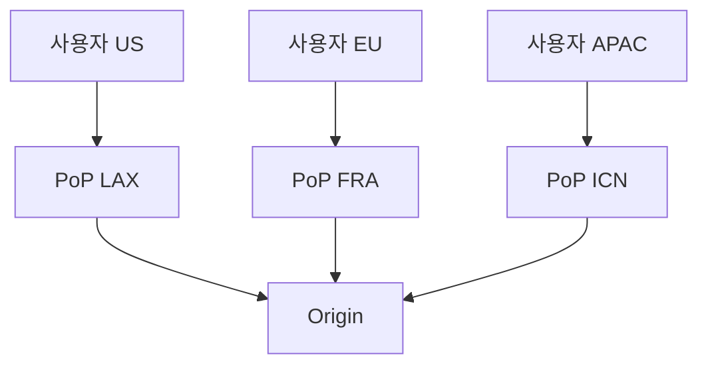
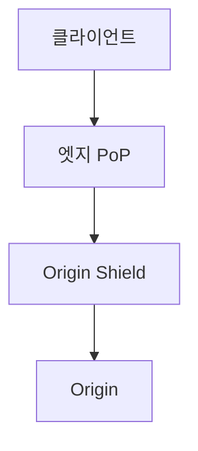

# CDN · Edge (캐싱 계층 · Origin Shielding · Edge Compute)

CDN은 단순한 "이미지·정적 파일 가속기"가 아니다.
현대 CDN은 **Anycast 네트워크 + 다단 캐시 계층 + 엣지 컴퓨트 + 보안 레이어**가
결합된 **분산 애플리케이션 플랫폼**이다.

이 글은 DevOps 엔지니어가 CDN을 **설계·운영·디버그**할 때 필요한 개념을 정리한다.

> 로드밸런서·리버스 프록시 기본은 [L4·L7 기본](./l4-l7-basics.md),
> [리버스 프록시](./reverse-proxy.md) 참고.

---

## 1. CDN의 본질

| 역할 | 내용 |
|---|---|
| **거리 단축** | 사용자 근처 PoP(Point of Presence)에서 응답 |
| **Origin 보호** | 캐시로 원본 요청 수를 수십~수천 배 줄임 |
| **보안 레이어** | DDoS 흡수, WAF, 봇 관리 |
| **엣지 로직** | JS·WASM 함수 실행으로 응답 커스터마이즈 |
| **프로토콜 최적화** | TLS 1.3·HTTP/3·PQ·HTTP/2 멀티플렉싱을 엣지에서 종료 |

**통찰**: "CDN 도입의 가장 큰 가치는 **지연 감소가 아니라 origin 부하 감소와 보안**"이라는 것이
실무의 공감대다.

---

## 2. 네트워크 구조 — Anycast

### 2-1. Anycast의 의미

- 여러 PoP가 **같은 IP를 BGP로 광고** → 경로가 가장 짧은 PoP로 자동 라우팅
- 장애 시 BGP 수렴(수 초)으로 다른 PoP가 흡수
- DNS 기반 GeoDNS보다 **세밀하고 빠른** 재조정

### 2-2. Anycast의 주의점

- 대용량 파일 업로드는 **PoP 간 부하 편향** 유발
- 한 플로우가 BGP 경로 변경으로 **다른 PoP로 옮겨가면** TCP 리셋
- QUIC의 Connection Migration이 이 문제를 완화

---

## 3. 캐시 계층

### 3-1. 다단 캐시

| 계층 | 역할 |
|---|---|
| 클라이언트 | 브라우저·앱 로컬 캐시 |
| 엣지 PoP | 사용자 가까운 캐시 (HIT이면 여기서 응답) |
| Origin Shield | Origin 앞의 중간 캐시 — 여러 PoP의 miss를 합침 |
| Origin | 실제 소스 |

### 3-2. Origin Shield

- 여러 PoP의 **MISS 요청을 하나의 shield에서 통합** → Origin에는 한 번만 감
- Origin 부하를 수십 배 줄이는 핵심 기능
- 벤더별 구현:

| 벤더 | 기능 |
|---|---|
| CloudFront | **Tiered Cache**(기본, Regional Edge Cache) + **Origin Shield**(옵션 추가 레이어) |
| Cloudflare | **Tiered Cache**(기본)·**Regional Tiered Cache**·**Argo Smart Routing** |
| Fastly | **Shielding** — POP 1개를 shield로 지정 |

### 3-3. 캐시 키

| 구성 요소 | 설명 |
|---|---|
| 호스트명 | 같은 경로라도 도메인 다르면 다른 캐시 |
| 경로 | `/api/users/1` |
| 쿼리 파라미터 | 선택적 포함 (기본: 포함) |
| 특정 헤더 | `Vary`로 명시된 헤더 |
| 쿠키 | 원하는 쿠키만 포함 가능 |

**잘못된 캐시 키 = 낮은 HIT율 or 잘못된 응답 공유**.
예: `?utm_*` 분석 파라미터를 포함하면 사실상 캐시 무력화.

### 3-4. Cache-Control 기본

| 지시자 | 의미 |
|---|---|
| `public` | 중간 캐시 저장 허용 |
| `private` | 브라우저만, CDN 저장 금지 |
| `max-age=<sec>` | fresh TTL |
| `s-maxage=<sec>` | 공유(CDN) 전용 TTL |
| `no-cache` | 매번 재검증 (If-Modified-Since 등) |
| `no-store` | 저장 금지 |
| `stale-while-revalidate=<sec>` | 만료됐어도 잠시 제공 + 백그라운드 갱신 |
| `stale-if-error=<sec>` | 원본 에러 시 오래된 것 제공 |
| `immutable` | 버전 해시된 자산 — 절대 변경 안 됨 |
| `must-revalidate` | 만료 시 반드시 재검증 — stale 정책과 충돌 주의 |

> `stale-while-revalidate`·`stale-if-error`는 원래 RFC 5861(2010)에서 정의되었고,
> RFC 9111(2022)에 통합되었다.

### 조건부 요청 (재검증)

| 헤더 | 용도 |
|---|---|
| `ETag` · `If-None-Match` | 콘텐츠 해시 기반 재검증 |
| `Last-Modified` · `If-Modified-Since` | 시간 기반 재검증 |
| 응답 `304 Not Modified` | 본문 없이 갱신 — 대역 절감 |

CDN 캐시가 만료돼도 **304로 끝나면 Origin에서 페이로드를 받지 않는다** —
`stale-while-revalidate`과 결합해 HIT·revalidate 비용을 동시에 낮춘다.

### 3-5. 캐시 무효화 (Purge·Invalidate)

| 방식 | 특징 |
|---|---|
| URL 기반 Purge | 특정 경로 무효화 — 가장 일반 |
| 태그/서로게이트 키 (Surrogate-Key, Cache-Tag) | 연관 객체 일괄 무효화 |
| 와일드카드 Purge | 경로 패턴 기반 (벤더별 제약) |
| Soft Purge | 유효 표시만 — stale-if-error로 보호 |
| Full flush | 위험, 거의 안 씀 |

**Fastly Surrogate-Key**와 **Cloudflare Cache-Tag**는
특히 대규모 사이트의 복합 무효화에서 사실상 표준 패턴이다.

---

## 4. 엣지 컴퓨트

엣지에서 코드를 실행해 응답을 가공하는 기능.

| CDN | 제품 | 런타임·특징 |
|---|---|---|
| Cloudflare | Workers | V8 isolate, WASM, Durable Objects, 전 PoP 실행 |
| Fastly | **Fastly Compute (구 Compute@Edge)** | WASM (Rust, JS, Go 등) |
| AWS | Lambda@Edge | Node.js·Python, **13개 Regional Edge Cache**에서만 실행 |
| AWS | CloudFront Functions | **ECMAScript 5.1 제약** JS, 네트워크·FS 접근 불가, 전 Edge Location(225+) |
| Vercel / Netlify | Edge Functions | V8 isolate. **애플리케이션 호스팅 + 엣지** 통합 플랫폼 |
| Akamai | EdgeWorkers | V8 isolate |

### 4-1. 엣지 컴퓨트 유스케이스

| 유스케이스 | 설명 |
|---|---|
| A/B 테스팅 | 요청을 여러 버전으로 라우팅 |
| 인증 검증 | JWT 검증을 엣지에서 수행 |
| 지역별 응답 | 사용자 지역에 맞춰 콘텐츠 변형 |
| 봇·스팸 차단 | 룰 기반 또는 ML 모델 실행 |
| 이미지 변환 | 리사이징·WebP 자동 변환 |
| HTML rewriting | 실시간 HTML 주입·변경 |

### 4-2. 제약

- CPU·메모리·실행 시간 상한 (수 ms~수백 ms)
- 지속 커넥션·상태 저장 제한 (Durable Objects 예외)
- 지역 간 상태 동기화 문제
- 관측·디버깅이 전통 서버보다 어려움

---

## 5. 엣지 프로토콜 최적화

### 5-1. TLS

- CDN이 **TLS 1.3 종료** → Origin은 HTTP/1.1도 가능 (내부가 안전한 경우)
- **PQ 하이브리드 키 교환**을 엣지에서 종료 → Origin까지 전환 안 해도 HNDL 방어
- SNI·ALPN·ECH도 엣지가 처리

### 5-2. HTTP/3

- CDN은 대부분 엣지에서 HTTP/3 제공
- Origin과의 연결은 HTTP/2 + 재사용 커넥션이 일반적
- UDP 차단 환경도 엣지에서 TCP 폴백

### 5-3. 요청 병합 (Collapsed Forwarding)

- 여러 사용자가 **같은 MISS 요청**을 동시에 하면 Origin에 **한 번만 보냄**
- Nginx `proxy_cache_lock`, Fastly/Cloudflare 내장
- thundering herd 방지의 핵심

---

## 6. 보안 레이어

### 6-1. DDoS 흡수

- Anycast + 수 Tbps 네트워크 수용량 = **자연스러운 흡수**
- 볼륨·애플리케이션 공격 모두 엣지에서 필터
- HTTP/2 Rapid Reset, MadeYouReset 같은 신규 벡터도 엣지 업데이트로 대응

### 6-2. WAF

- OWASP Top 10 룰셋 (CRS, ModSecurity 호환)
- 봇 관리 (CAPTCHA, 행동 분석)
- Rate limiting · API 보호

### 6-3. 엣지 인증

- **Zero Trust Access** 제품 (Cloudflare Access, Akamai EAA) → CDN이 SSO·정책 적용
- IP 차단·지오 블록도 엣지에서

### 6-4. Signed URL · Signed Cookie

콘텐츠 접근을 **서명된 토큰**으로 제한하는 CDN 공통 패턴.

| 벤더 | 구현 |
|---|---|
| CloudFront | Signed URL / Signed Cookie |
| Cloudflare | URL Token Authentication |
| Fastly | Signed URL (VCL 또는 Compute) |
| Akamai | Token Authentication |

주 용도: 유료 동영상 스트리밍, 대용량 다운로드, 사용자별 제한.

---

## 7. Origin 연결 방식

### 7-1. 연결 방식

| 방식 | 특징 |
|---|---|
| 공개 Origin (Public IP) | 가장 단순, 직접 접근 차단 필수 |
| IP 화이트리스트 | CDN IP 범위만 허용 |
| CDN 전용 헤더·토큰 | 추가 헤더 검증 |
| **mTLS Origin Pull** | 엣지 ↔ Origin mTLS 인증 |
| Private Link / Service Connect | CDN과 Origin이 사설 네트워크로 |
| Tunneled (Cloudflare Tunnel, AWS VPC origin) | Origin이 CDN에 **아웃바운드 연결** |

### 7-2. Origin 부하 예측

- 캐시 HIT율 80% = Origin 부하가 **5배 감소**
- HIT율 99% = **100배 감소**
- 단 **캐시 MISS가 집중되는 이벤트**(퍼지 직후, 신상품 출시)는 예외
- Collapsed Forwarding, Origin Shield가 이 상황의 방어선

---

## 8. 관측 — 핵심 지표

### 8-1. CDN 메트릭

| 메트릭 | 의미 |
|---|---|
| Cache HIT 비율 | 성능의 핵심 지표 |
| Bandwidth | 트래픽량 |
| Request count per status | 5xx·4xx·2xx 분포 |
| Edge vs Origin response time | 엣지 효과 측정 |
| Origin 응답 크기 | 압축·최적화 기회 |
| PoP별 분포 | 지역별 수요 |
| 블록·챌린지 | WAF·봇 관리 활동 |

### 8-2. 로그 스트리밍

- Cloudflare Logpush, AWS Kinesis Firehose, Fastly Real-time Log Streaming
- 보통 **S3·BigQuery·Datadog·Splunk**로 지속 적재
- 샘플링·비용 관리 중요 (전체 로그는 수십 TB/일)

---

## 9. 운영 함정

| 함정 | 원인 |
|---|---|
| 낮은 HIT율 | `Set-Cookie`, 쿼리 파라미터 과다, `Vary: *`, **`Vary: User-Agent`·`Vary: Cookie`** 캐시 파편화 |
| 잘못된 응답 공유 | 로그인 사용자 콘텐츠가 캐시됨 (`Cache-Control: private` 누락) |
| 퍼지 지연 | CDN 내부 전파 시간 (보통 수 초~수 분) |
| Origin 폭주 | 큰 객체의 동시 MISS, Origin Shield 없음 |
| HTTPS 인증서 오류 | CDN 인증서와 Origin 인증서 불일치 |
| UDP 차단 | HTTP/3 못 씀 — 엣지에서 폴백 |
| 지역 차단 오작동 | VPN·프록시 사용자 오판 |
| 캐시 포이즈닝 | 헤더 검증 부족 |

---

## 10. 설계 체크리스트

| 영역 | 점검 |
|---|---|
| 캐시 전략 | HIT율 목표, TTL 정책 수립 |
| 무효화 | 태그·서로게이트 키 기반 전략 |
| Origin 보호 | Shield + 화이트리스트 + mTLS |
| 보안 | WAF·DDoS·봇 관리 룰 |
| 엣지 컴퓨트 | 필요한 로직만 엣지로 (복잡도 관리) |
| 관측 | HIT율·5xx·지연 p99 SLO 설정 |
| 비용 | 트래픽·요청·엣지 실행·로그 저장 |
| 실패 시나리오 | 엣지 장애 시 Origin 직접 접근 경로, 폴백 DNS |

---

## 11. 주요 벤더 특성

| 벤더 | 강점 | 주 사용처 |
|---|---|---|
| **Cloudflare** | 개발자 친화, Workers/WASM, Zero Trust, **R2 (egress 무료)** | 종합 인프라 |
| **Fastly** | VCL 세밀한 제어, Compute@Edge | 미디어, e커머스 |
| **AWS CloudFront** | AWS 생태계 통합, Lambda@Edge | AWS 중심 |
| **Akamai** | 역사·기업 영업, 고급 보안 | 금융, 엔터프라이즈 |
| **Google Cloud CDN** | GCP 통합, Cloud Armor WAF | GCP 중심 |
| **Bunny·Fastly Deliver** | 단순성·가격 | 중소 규모 |
| **Vercel / Netlify** | 프론트엔드 최적화 | Jamstack |

---

## 12. 요약

| 개념 | 한 줄 요약 |
|---|---|
| Anycast | 같은 IP를 여러 PoP가 광고 — 가장 가까운 곳이 수신 |
| 다단 캐시 | 엣지 + Origin Shield가 Origin 부하 핵심 감소 |
| 캐시 키 | 키 설계가 HIT율의 90%를 결정 |
| Purge | Surrogate Key / Cache Tag가 현대 표준 |
| 엣지 컴퓨트 | V8 isolate·WASM로 ms급 실행 |
| 프로토콜 | TLS 1.3·HTTP/3·PQ가 엣지에서 끝남 |
| Origin 보호 | mTLS·화이트리스트·Shield |
| HIT율 | 20% → 80% → 99% 구간이 Origin 부하를 5x → 100x 감소 |
| 관측 | HIT율·5xx·p99·지역별 SLO |
| 벤더 선택 | 조직의 생태계·보안 요구·엣지 언어에 맞춰 |

---

## 참고 자료

- [RFC 9111 — HTTP Caching](https://www.rfc-editor.org/rfc/rfc9111) — 확인: 2026-04-20
- [RFC 5861 — stale-while-revalidate / stale-if-error](https://www.rfc-editor.org/rfc/rfc5861) — 확인: 2026-04-20
- [Cloudflare Learning — CDN](https://www.cloudflare.com/learning/cdn/) — 확인: 2026-04-20
- [AWS CloudFront — Tiered cache and Origin Shield](https://docs.aws.amazon.com/AmazonCloudFront/latest/DeveloperGuide/origin-shield.html) — 확인: 2026-04-20
- [Fastly — Surrogate Keys](https://docs.fastly.com/en/guides/getting-started-with-surrogate-keys) — 확인: 2026-04-20
- [Cloudflare Blog — Anycast](https://blog.cloudflare.com/a-brief-anycast-primer/) — 확인: 2026-04-20
- [MDN — Cache-Control](https://developer.mozilla.org/docs/Web/HTTP/Headers/Cache-Control) — 확인: 2026-04-20
- [HTTP Archive Web Almanac — CDN](https://almanac.httparchive.org/en/2024/cdn) — 확인: 2026-04-20
- [Cloudflare — Workers platform](https://developers.cloudflare.com/workers/) — 확인: 2026-04-20
- [Fastly — Compute@Edge](https://www.fastly.com/products/edge-compute) — 확인: 2026-04-20
