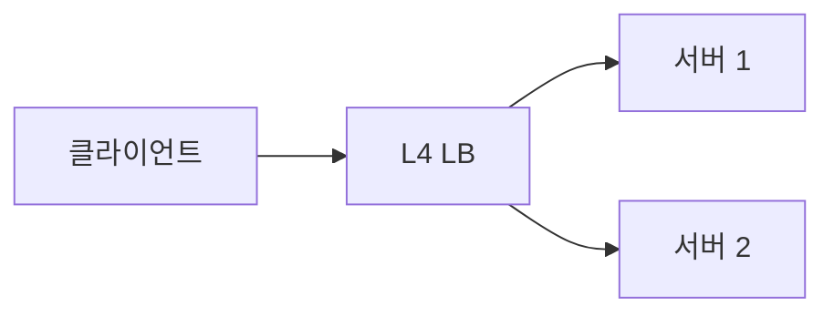
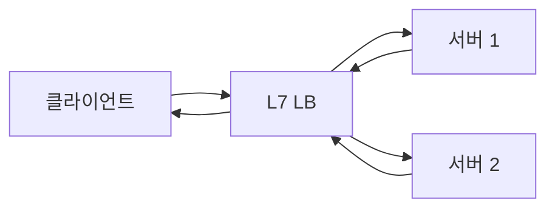
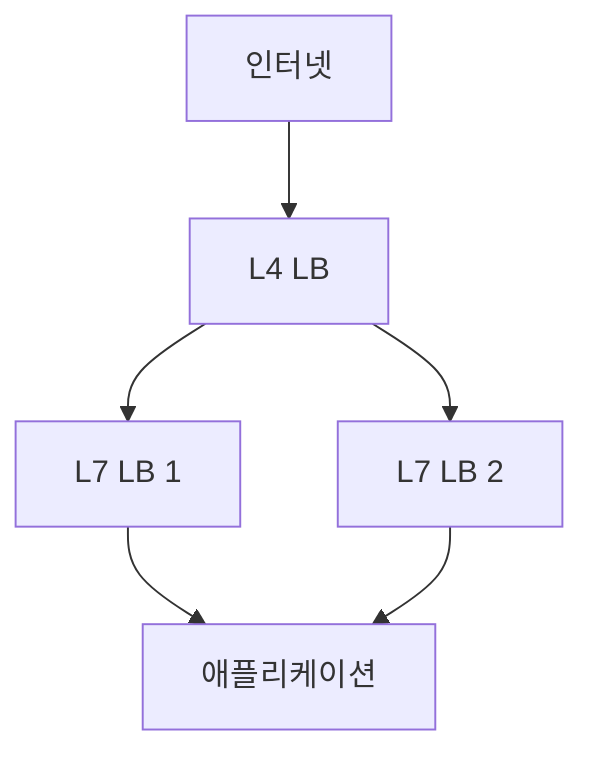

# L4 · L7 로드밸런서 (알고리즘 · 세션 유지)

로드밸런서 선택은 단순히 "어떤 브랜드를 쓸까"가 아니라
**어느 계층에서 동작하는가**가 본질이다.
L4와 L7은 라우팅 기준·성능·기능·관측 지점이 모두 다르다.

이 글은 L4·L7의 근본 차이, 분산 알고리즘, 세션 유지, 헬스체크까지
**실무 설계에 필요한 공통 지식**을 다룬다.

> 개별 제품(Nginx·HAProxy·Envoy)의 상세는 [리버스 프록시](./reverse-proxy.md),
> 엣지·CDN은 [CDN·Edge](./cdn-edge.md) 참고.

---

## 1. L4 vs L7 한눈에

| 항목 | L4 (전송) | L7 (응용) |
|---|---|---|
| 결정 기준 | IP + 포트 | URI, 헤더, 쿠키, 메서드 |
| TLS | **통과(passthrough)** | **종료(termination)** — 평문 재암호화 |
| 페이로드 검사 | 안 함 | 함 |
| CPU 오버헤드 | 낮음 | 상대적으로 높음 |
| 관측 | 커넥션, 바이트 | 요청 단위 지연·상태 코드 |
| 대표 제품 | AWS NLB, HAProxy TCP, IPVS, MetalLB | AWS ALB, Envoy, Nginx, Traefik |
| 프로토콜 | TCP, UDP, QUIC(UDP) | HTTP/1/2/3, gRPC |
| 상태 유지 | connection-level | request-level |

**한 줄 요약**:
- **L4** = 포트·IP 단위 스위치
- **L7** = 요청 내용을 이해하는 리버스 프록시

---

## 2. 동작 방식

### 2-1. L4 (직접/NAT/DSR)

| 모드 | 응답 경로 |
|---|---|
| NAT | LB → 서버, 서버 → LB → 클라 (양방향 LB 경유) |
| L2 DSR | 같은 broadcast domain. LB가 MAC 재작성, 서버 loopback VIP로 응답 |
| L3 DSR (IP 터널) | GRE/IPIP/GUE 터널로 패킷 전달, Maglev·Cloudflare Unimog가 대표 구현 |

**DSR의 장점**:
- 서버가 **클라이언트 IP를 그대로** 수신 (NAT처럼 덮어쓰지 않음)
- 응답이 LB를 거치지 않아 **대역·CPU 절감** — 대형 클라우드·CDN의 기본

**단점**:
- 서버에 **VIP를 loopback**으로 설정 + ARP 억제 필요
- L2 DSR은 같은 L2/VLAN, L3 DSR은 **GRE/IPIP 터널** 필요
- **MTU·PMTUD 복잡도** 증가 (터널 오버헤드)
- TCP 상태 추적 방화벽·WAF가 **비대칭 경로**를 이해해야 함

### 2-2. L7

- 클라이언트 ↔ LB, LB ↔ 서버가 **완전히 별개의 TCP·TLS 연결**
- LB가 HTTP 요청 헤더를 파싱해 **라우팅 결정**
- 응답도 LB를 거쳐 반환

### 2-3. TLS 취급 방식

| 방식 | 설명 | 사용처 |
|---|---|---|
| Passthrough | TLS 해독 안 함. **SNI·ALPN 헤더**만 inspect해 라우팅 | E2E 암호화 필수, mTLS, 금융·의료 |
| Termination | LB에서 복호화 후 평문으로 백엔드 전달 | 대부분의 웹 |
| Re-encryption | LB에서 복호화 후 **다시 TLS로** 백엔드 연결 | Zero Trust, 내부망 암호화 |

**실무의 기본**은 Termination 또는 Re-encryption.

> Re-encryption은 Zero Trust에 필수지만 **CPU 2회 암복호 오버헤드**,
> **사설 CA 운영**, **mTLS 인증서 순환** 비용을 수반한다.
> 자세한 발급 흐름은 [mTLS 기본](../tls-pki/mtls-basics.md).

---

## 3. 분산 알고리즘

### 3-1. 기본 알고리즘

| 알고리즘 | 특징 |
|---|---|
| Round Robin | 차례대로 — 균일 트래픽이 전제 |
| Weighted Round Robin | 서버 성능 차이에 가중치 |
| Least Connections | 현재 연결 수 가장 적은 서버로 — 가장 안전한 기본 |
| Least Response Time | 응답 시간 낮은 서버 — 동적 환경 |
| Random / P2C | 무작위 or Power-of-Two-Choices |
| Source IP Hash | 출발지 IP로 해시 — 세션 유지 대체 |
| URI Hash | URI로 해시 — 캐시 적중률 극대화 |

### 3-2. Power-of-Two-Choices (P2C)

- 무작위로 **두 서버를 뽑아 덜 바쁜 쪽**을 고른다
- 균일 랜덤과 Least Connections 사이의 좋은 타협
- 구현·계산 비용이 매우 낮고 결과가 좋아 **현대 LB의 기본 선택**
- Envoy의 기본 `LEAST_REQUEST` 정책은 **P2C로 구현**된다
- Linkerd는 **Peak EWMA**(latency-aware P2C)로 꼬리 지연이 큰 워크로드에 최적화

### 3-3. Consistent Hashing

- 노드가 늘거나 줄 때 **이동하는 키의 비율을 최소화**
- 캐시·샤딩된 DB·세션 스티키 구현의 핵심
- **Maglev**(Google) · **Rendezvous**(HRW) · **Ring** 등 변종

### 3-4. 알고리즘 선택 가이드

| 상황 | 권장 |
|---|---|
| 균일 서버·짧은 요청 | Round Robin |
| 서버 성능 편차 큼 | Weighted RR |
| 요청 시간 편차 큼 (LLM 추론 등) | Least Connections, P2C, **Peak EWMA** |
| 세션 기반 앱 | Source IP Hash 또는 쿠키 스티키 |
| 캐시 효율 중요 | URI Hash, Consistent Hashing |
| 대규모 마이크로서비스 | **P2C + Health-aware** |

---

## 4. 헬스체크

### 4-1. 수준별 헬스체크

| 수준 | 내용 |
|---|---|
| L3 | ICMP ping — 거의 안 씀 |
| L4 | TCP connect — 포트가 열려있는지 |
| L7 | HTTP GET, 상태 코드·응답 본문 확인 |
| 의존성 인식 | DB 연결 포함 여부까지 (주의: 캐스케이드 장애) |

### 4-2. Active vs Passive

| 방식 | 설명 |
|---|---|
| Active | LB가 주기적으로 직접 헬스체크 요청 |
| Passive | 실제 트래픽의 실패를 통해 판단 (`outlier detection`) |

Envoy는 둘을 조합한다 — **active health check**로 주기 확인, **outlier detection**으로
연속 5xx·success rate·local origin failure 기반 **이상 호스트를 eject(제외)**.
성능 우선 분산은 별도의 LB 알고리즘(LEAST_REQUEST, Peak EWMA)이 담당.

### 4-3. Readiness vs Liveness (K8s 개념과 연결)

- **Liveness**: 프로세스가 살아있는가 → 죽었으면 재시작
- **Readiness**: 트래픽 받을 준비 됐는가 → Yes 인지 여부로 LB 포함/제외
- K8s Service는 Readiness 기반으로 엔드포인트 등록

### 4-4. 흔한 함정

| 함정 | 내용 |
|---|---|
| 헬스체크가 너무 자주 | 백엔드 부하·로그 스팸 |
| 너무 드물게 | 장애 감지 지연 |
| 헬스체크가 DB 포함 | DB 느림 → 모든 서버 unhealthy → 완전 장애 |
| 헬스체크 경로를 rate limit | 503 반환 → 서버 제외 |
| `/` 기본 경로 | 메인 페이지 지연이 헬스체크에 반영 |
| HTTPS 인증서 검증 엄격 | 만료 직후 전체 unhealthy |

---

## 5. 세션 유지 (Stickiness · Affinity)

상태를 서버 로컬에 저장하는 **레거시 웹앱**에서 필수.

### 5-1. 방식 비교

| 방식 | 장점 | 단점 |
|---|---|---|
| Source IP Hash | 서버 설정 불필요 | 캐리어 NAT 뒤에서 편향 |
| 쿠키 Duration-based (LB 삽입) | LB가 쿠키 생성·해시 | HTTP(S)에서만 |
| 쿠키 Application-based (앱 삽입) | 앱 제어, LB는 학습 | 초기 연결에 스티키 없음 |
| 커넥션 ID (QUIC) | Migration 포함 정확 | LB가 QUIC CID 이해해야 |

> AWS ALB 공식 용어로는 각각 **Duration-based cookie**와
> **Application-based cookie** 스티키 세션으로 구분된다.

### 5-2. 설계 원칙

- **가능하면 stateless로 만들라** — 세션을 Redis·DB로 옮기기
- 스티키는 **원치 않는 불균형**의 씨앗
- DR·롤링 배포·스케일 다운 시 **세션 드랍** 불가피

---

## 6. L4·L7 선택 기준

### 6-1. 상황별 권장

| 시나리오 | L4 | L7 |
|---|---|---|
| 일반 REST API | — | ✓ |
| gRPC | — | ✓ (HTTP/2 인식) |
| TCP 장기 커넥션 (DB, WebSocket) | ✓ | — |
| 엔드 투 엔드 TLS 필수 | ✓ (passthrough) | ✓ (re-encrypt) |
| 매우 낮은 지연 (HFT, 게임) | ✓ | — |
| 경로 기반 라우팅 (/api vs /static) | — | ✓ |
| 카나리·블루/그린 | — | ✓ |
| WAF·요청 검사 | — | ✓ |
| QUIC/HTTP3 | ✓ (UDP L4) | ✓ (HTTP/3 인식) |

### 6-2. 계층화

현대 아키텍처는 **두 계층 모두 쓴다**:

- **L4**: 높은 처리량, 애니캐스트, DDoS 분산
- **L7**: 경로 라우팅, WAF, 카나리
- 예:
  - 클라우드 — **AWS NLB/GCP TCP LB (L4) → Envoy Fleet / ALB (L7) → App**
  - 온프레미스 — **MetalLB·IPVS (L4) → Envoy·Nginx (L7) → App**

---

## 7. Proxy Protocol — 클라이언트 IP 전달

### 7-1. 왜 필요한가

- L4 LB가 NAT를 쓰면 서버가 보는 source IP는 **LB의 IP**
- 서버가 진짜 클라이언트 IP를 알아야 로그·레이트리밋·지오블록에 활용 가능

### 7-2. 방법

| 방법 | 계층 | 특징 |
|---|---|---|
| **PROXY Protocol v1/v2** | L4 | TCP 페이로드 시작에 텍스트/바이너리 헤더 삽입 |
| X-Forwarded-For | L7 | HTTP 헤더에 추가 |
| X-Real-IP | L7 | 한 단계 프록시 IP |
| Forwarded (RFC 7239) | L7 | 표준 헤더 |

**PROXY Protocol**은 **AWS NLB·Cloudflare·HAProxy·Envoy**가 지원.
서버 쪽도 이를 **파싱할 수 있어야** 한다.

### 7-3. 보안 주의

- `X-Forwarded-For`는 **클라이언트가 조작 가능** — 신뢰할 수 있는 소스에서만 믿는다
- 신뢰 경계에서 **덮어쓰기** 필요 (첫 홉 프록시가 재작성)

---

## 8. 글로벌 로드밸런싱 (GSLB)

여러 리전·DC 간 분산은 별도 레이어.

| 방식 | 특징 |
|---|---|
| DNS 기반 (GeoDNS, 가중치) | 분 단위 RTO, 브라우저 DNS 캐시 한계 |
| Anycast | 여러 PoP가 같은 IP 광고 — 수 초 전환 |
| GSLB + 헬스체크 | Route 53 Failover, Cloudflare LB |
| Service Mesh Multi-Cluster | Mesh 레벨 경로 관리 |

Cloudflare·Google·Akamai 같은 CDN은 **Anycast + L4/L7 계층화**가 기본 구조.

> **트레이드오프**: DNS는 TTL 때문에 분 단위 전환이 한계,
> Anycast는 수 초(BGP 수렴)에 전환되지만 **BGP 경로 변경이 플로우를 섞을 수 있다**.
> 대형 서비스는 Anycast + 클라이언트 재시도 로직을 함께 설계한다.

---

## 9. 관측 — 핵심 메트릭

### 9-1. L4 LB

| 메트릭 | 의미 |
|---|---|
| New connections/s | 초당 새 연결 |
| Active connections | 동시 커넥션 수 |
| Bytes in/out | 대역폭 |
| TCP RST | 비정상 종료 |
| Target health | 정상 백엔드 수 |

### 9-2. L7 LB

| 메트릭 | 의미 |
|---|---|
| Requests/s | 처리량 |
| p50/p95/p99 latency | 응답 지연 분포 |
| 5xx 비율 | 서버 오류 |
| 4xx 비율 | 클라이언트 오류 |
| Upstream vs downstream 분리 | 병목 구간 식별 |
| Connection pool 사용률 | 재사용 효율 |

### 9-3. LB 없는 현대 아키텍처?

- **Service Mesh**가 사이드카·eBPF로 LB 기능을 분산 수행
- 각 파드 옆에 Envoy·linkerd-proxy 또는 노드의 eBPF가 L7 결정
- "중앙 LB 없음"이 아니라 **분산된 LB**

---

## 10. 자주 만나는 문제

| 증상 | 원인 |
|---|---|
| 특정 서버만 고부하 | Source IP Hash + NAT 뒤 클라이언트 → 분산 편향 |
| WebSocket 끊김 | L7 LB timeout < 연결 수명, 또는 L4로 내려야 함 |
| gRPC 분산 안 됨 | 기본 `pick_first`가 첫 주소 고정 → `round_robin` 또는 xDS/메시 필요 |
| 헬스체크 통과하는데 500 반환 | 헬스체크 경로와 실제 경로의 의존성 차이 |
| 스케일 아웃 후에도 부하 편향 | 장기 커넥션이 기존 서버에 고정 — drain 필요 |
| Canary가 예상대로 분산 안 됨 | 세션 스티키가 오버라이드 |

---

## 11. 요약

| 개념 | 한 줄 요약 |
|---|---|
| L4 vs L7 | 포트·IP 스위치 vs 요청 내용 이해 |
| TLS | passthrough · termination · re-encryption 선택 |
| 알고리즘 | P2C가 현대 기본, Consistent Hash는 캐시·세션용 |
| 헬스체크 | L7로, DB 포함 금지, 경로는 전용으로 |
| 세션 유지 | 가능하면 stateless — 어쩔 수 없을 때 쿠키 |
| DSR | L4 LB의 성능 필살기, 설정 복잡 |
| Proxy Protocol | L4에서 클라이언트 IP 전달 표준 |
| GSLB | DNS·Anycast 계층으로 글로벌 분산 |
| 관측 | L4는 연결·바이트, L7은 요청·지연·코드 |
| Service Mesh | LB 기능이 사이드카·eBPF로 분산 |

---

## 참고 자료

- [RFC 7239 — Forwarded HTTP Header](https://www.rfc-editor.org/rfc/rfc7239) — 확인: 2026-04-20
- [HAProxy PROXY Protocol](https://www.haproxy.com/blog/use-the-proxy-protocol-to-preserve-a-clients-ip-address) — 확인: 2026-04-20
- [Envoy Load Balancing](https://www.envoyproxy.io/docs/envoy/latest/intro/arch_overview/upstream/load_balancing/overview) — 확인: 2026-04-20
- [Google Maglev paper](https://research.google/pubs/pub44824/) — 확인: 2026-04-20
- [The Power of Two Choices in Randomized Load Balancing (Mitzenmacher)](https://www.eecs.harvard.edu/~michaelm/postscripts/tpds2001.pdf) — 확인: 2026-04-20
- [Cloudflare Blog — How Cloudflare load balancing works](https://blog.cloudflare.com/unimog/) — 확인: 2026-04-20
- [AWS ELB types comparison](https://docs.aws.amazon.com/elasticloadbalancing/latest/userguide/introduction.html) — 확인: 2026-04-20
- [Linkerd Client-side load balancing](https://linkerd.io/2/features/load-balancing/) — 확인: 2026-04-20
