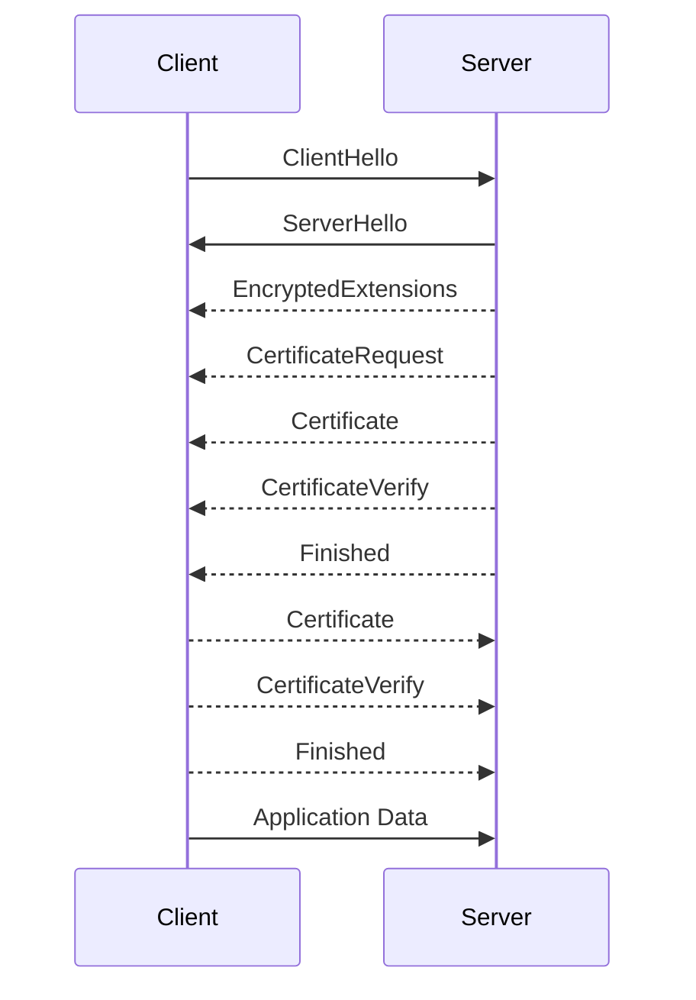
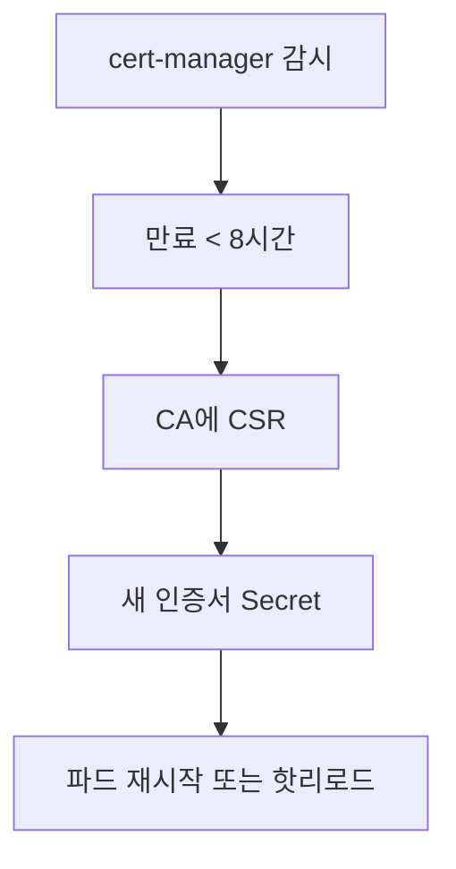

# mTLS 기본 (상호 인증 · 발급 흐름 · SPIFFE)

TLS는 서버가 자기를 증명하는 구조다.
**mTLS(Mutual TLS)**는 거기에 **클라이언트도 자신의 인증서로 증명**하는 대칭 구조를 추가한다.

Zero Trust 네트워크·서비스 메시·API 게이트웨이 등에서
**"누가 누구에게 말하고 있는가"**를 암호학적으로 보장하는 데 쓰인다.

> TLS 핸드셰이크·인증서 개념은 [TLS 기본](./tls-basics.md) 먼저 읽는 걸 권장.
> Zero Trust **전략**은 `security/`로, 서비스 메시 **구현**은 `network/`로 분리.

---

## 1. mTLS가 해결하는 문제

### 1-1. 단방향 TLS의 한계

일반 TLS는 서버 신원만 검증한다. 클라이언트 신원은
- API 키 (쿠키·Bearer 토큰) — 유출되면 끝
- IP 기반 ACL — 동적 클라우드 IP에 부적합
- VPN — 입장했으면 다 통함 (flat network)

### 1-2. mTLS의 본질

- **암호화 채널의 양쪽 끝점 모두를 검증**
- 중간자 공격·자격 증명 탈취에 강함
- 자격 증명 자체가 **단기 인증서** → 유출 영향 최소
- **SPIFFE/SPIRE**로 표준 ID 체계 결합 가능

### 1-3. Zero Trust와의 연결

"Never trust, always verify"의 핵심 메커니즘.
네트워크 경계(perimeter)가 아니라 **각 연결마다 인증**한다.
서비스 메시(Istio, Linkerd, Cilium Mesh)는 사실상 mTLS 기반이다.

---

## 2. mTLS 핸드셰이크



> RFC 8446 기준으로 서버는 **EncryptedExtensions 다음에 CertificateRequest를 먼저 보내고**
> 이어서 자기 Certificate·CertificateVerify·Finished를 보낸다.
> 클라이언트는 서버 Finished를 수신한 직후 **같은 flight에서**
> Certificate·CertificateVerify·Finished를 이어서 전송한다.

| 단계 | TLS | mTLS 추가 |
|---|---|---|
| EncryptedExtensions 이후 | 없음 | **CertificateRequest** — 서버가 클라이언트 인증서 요청 |
| 서버 Certificate | 서버 인증서 전송 | (같음) |
| 서버 CertificateVerify | TLS 1.3부터 도입 | 서버도 **키 소유 증명**(PoP) |
| 클라이언트 Certificate | 없음 | **클라이언트가 인증서 제시** |
| 클라이언트 CertificateVerify | 없음 | **클라이언트 개인키로 서명** → PoP |

### 2-1. 서버의 CertificateRequest

- 서버가 수락할 수 있는 **CA 목록**(Distinguished Names)을 전달
- 클라이언트는 이 CA 중 하나가 발급한 인증서를 제시해야 함
- 서버는 클라이언트 인증서 체인을 루트까지 검증

### 2-2. 무엇을 검증하는가

| 검증 | 설명 |
|---|---|
| 체인 | 클라이언트 인증서 → 중간 CA → 루트 CA |
| 만료 | notBefore ≤ now ≤ notAfter |
| 폐기 | CRL·OCSP·짧은 수명 |
| EKU | `clientAuth` (1.3.6.1.5.5.7.3.2) |
| Subject | 정책에 따라 CN·SAN·OU 매칭 |
| Key Usage | digitalSignature 등 |

---

## 3. 신원(Identity) 표현 방식

클라이언트 인증서의 Subject/SAN으로 **누구인가**를 표현.

### 3-1. 전통 방식

| 방식 | 예시 |
|---|---|
| CN 기반 | `CN=payments.internal` |
| SAN DNS | `DNS:payments.svc.cluster.local` |
| SAN URI | `URI:spiffe://example.org/ns/default/sa/payments` |
| OU/O | `O=Engineering, OU=Payments` |

### 3-2. SPIFFE / SPIRE

CNCF Graduated 표준. **SPIFFE ID**는 URI 형태의 워크로드 신원.

```
spiffe://<trust-domain>/<workload-path>
```

예시:
```
spiffe://example.org/ns/prod/sa/checkout
```

- **SPIFFE SVID**: X.509 또는 JWT 형태의 단기 인증서
- **SPIRE**: SPIFFE SVID 발급 에이전트/서버
- **trust domain** 경계는 복수 클러스터·복수 데이터센터 연합에 사용

서비스 메시에서는 SPIFFE ID를 **NetworkPolicy·AuthorizationPolicy**의
기준으로 쓴다.

---

## 4. 서비스 메시의 mTLS

### 4-1. Istio

| 모드 | 의미 |
|---|---|
| `STRICT` | mTLS만 허용 — 다른 트래픽은 거부 |
| `PERMISSIVE` | mTLS 우선, 평문도 일단 허용 (마이그레이션용) |
| `DISABLE` | mTLS 비활성 |

```yaml
apiVersion: security.istio.io/v1
kind: PeerAuthentication
metadata:
  name: default
  namespace: prod
spec:
  mtls:
    mode: STRICT
```

- Istio는 내부 CA(`istiod`)로 워크로드 인증서 자동 발급·순환
- 인증서 수명 기본 24시간, **수명의 80% 시점(약 19시간)**에 자동 갱신
  (`WORKLOAD_CERT_TTL`, `SECRET_GRACE_PERIOD_RATIO` 환경변수)
- SPIFFE ID를 `URI:spiffe://cluster.local/ns/<ns>/sa/<sa>` 형태로 SAN에 기록

### 4-2. Linkerd

- 기본으로 모든 메시 내 트래픽 mTLS
- 인증서 24시간 수명, 자동 갱신
- 발급은 `linkerd-identity` 컨트롤러가 담당

### 4-3. Cilium Mesh

- L3~L4는 eBPF, L7은 Envoy (필요 시)
- **Cilium Mutual Authentication (Beta, 2026-04 기준)**:
  SPIFFE SVID로 **peer identity만 out-of-band 검증**하고,
  실제 데이터 암호화는 WireGuard/IPsec에 위임하는 모델
- Istio·Linkerd처럼 데이터 플레인 전체가 mTLS로 감싸이지는 않는다
- 현재 **Cluster Mesh와는 호환 불가** 등 제약이 있어 도입 전 공식 문서 확인 필수

---

## 5. 실전 구성 — Nginx·Envoy

### 5-1. Nginx mTLS

```nginx
server {
    listen 443 ssl;
    server_name api.internal;

    ssl_certificate /etc/ssl/server.crt;
    ssl_certificate_key /etc/ssl/server.key;

    # 클라이언트 CA (이 CA가 발급한 인증서만 허용)
    ssl_client_certificate /etc/ssl/client-ca.crt;
    # on | optional | optional_no_ca | off
    #   optional: 제시하면 검증, 미제시도 허용
    #   optional_no_ca: 제시하면 체인 검증 생략하고 변수만 전달
    ssl_verify_client on;
    ssl_verify_depth 2;

    # 체인이 유효하면 서브젝트 정보를 백엔드로 전달
    location / {
        proxy_set_header X-Client-DN $ssl_client_s_dn;
        proxy_set_header X-Client-Verify $ssl_client_verify;
        proxy_pass http://backend;
    }
}
```

### 5-2. Envoy mTLS

```yaml
transport_socket:
  name: envoy.transport_sockets.tls
  typed_config:
    "@type": type.googleapis.com/envoy.extensions.transport_sockets.tls.v3.DownstreamTlsContext
    require_client_certificate: true
    common_tls_context:
      tls_certificates:
        - certificate_chain: {filename: "/etc/ssl/server.crt"}
          private_key: {filename: "/etc/ssl/server.key"}
      validation_context:
        trusted_ca: {filename: "/etc/ssl/client-ca.crt"}
        match_typed_subject_alt_names:
          - san_type: URI
            matcher:
              exact: "spiffe://example.org/ns/prod/sa/checkout"
```

---

## 6. 인증서 발급 흐름

### 6-1. 공개 인터넷 vs 내부

| 대상 | 발급 주체 |
|---|---|
| 공개 HTTPS | Let's Encrypt, ZeroSSL, 상용 CA |
| 내부 mTLS | 사설 CA (step-ca, cert-manager ClusterIssuer) |
| 서비스 메시 | Istio `istiod`, Linkerd, SPIRE |
| 클라우드 | AWS Private CA, GCP CAS, Azure Key Vault |

### 6-2. cert-manager (Kubernetes 표준)

```yaml
apiVersion: cert-manager.io/v1
kind: Issuer
metadata:
  name: internal-ca
  namespace: prod
spec:
  ca:
    secretName: ca-key-pair

---
apiVersion: cert-manager.io/v1
kind: Certificate
metadata:
  name: payments-client
  namespace: prod
spec:
  secretName: payments-tls
  duration: 24h
  renewBefore: 8h
  subject:
    organizations: ["example"]
  commonName: payments.prod
  usages:
    - client auth
    - digital signature
    - key encipherment
  uris:
    - spiffe://example.org/ns/prod/sa/payments
  issuerRef:
    name: internal-ca
    kind: Issuer
```

핵심은 **짧은 수명(24시간) + 자동 갱신(8시간 전)** + SPIFFE URI.

> `usages` 값은 **Issuer 종류에 따라 해석이 다르다**. `CA`·`SelfSigned` Issuer는
> 요청 그대로 발급하지만, ACME·Vault 등 외부 Issuer는 Issuer 측 정책에 의해
> 무시·강제될 수 있다. 발급 후 `openssl x509 -noout -text`로 실제 EKU를 확인.

### 6-3. ACME로 사설 CA

- **RFC 8555**(ACME)는 공개 CA 전용이 아니다
- `step-ca`, `smallstep/ca`, `boulder` 포크로 사설 ACME 서버 운영 가능
- cert-manager가 ACME 프로토콜로 내부 CA와 통신

---

## 7. 폐기 · 갱신 · 순환

### 7-1. 짧은 수명이 표준

| 수명 | 특징 |
|---|---|
| 24시간 (서비스 메시) | 실질적으로 폐기가 필요 없음 |
| 7~30일 (내부 API) | cert-manager로 자동 갱신 |
| 90일 (공개 HTTPS) | Let's Encrypt 기본 |
| 10년 (루트 CA) | 절대 유출되면 안 됨 |

**이유**: OCSP·CRL 인프라 없이도 탈취된 키의 **활용 시간을 제한**.

### 7-2. 키 순환 자동화



- **핫 리로드 지원 앱**: Envoy, Nginx reload, HAProxy runtime API
- 지원 안 하면 **롤링 재시작** 필요 → Istio는 사이드카가 자동 처리

---

## 8. 흔한 실수·함정

| 실수 | 영향 |
|---|---|
| 서버만 인증서 갱신하고 루트 CA 교체 누락 | 전체 통신 실패 |
| 클라이언트 인증서 EKU에 `clientAuth` 없음 | 서버가 거부 |
| Istio PERMISSIVE를 운영에 그대로 둠 | mTLS 보호 실질 없음 |
| SPIFFE trust domain 불일치 | 다중 클러스터 간 실패 |
| 클라이언트 인증서 만료 알림 부재 | 단순 만료로 전체 장애 |
| 공개 CA 인증서를 mTLS 클라이언트 인증으로 사용 | CA가 아무에게나 발급 가능 → 사실상 인증 불가 |
| CA 체인이 클라이언트에 설치되지 않음 | `UNKNOWN_CA` |
| OCSP Must-Staple를 mTLS에서 기대 | 이미 폐기 방향 |

> **공개 CA로는 mTLS 클라이언트 인증 하지 말라.**
> "Let's Encrypt가 발급했으니 신뢰"라면 **지구상 누구든** 인증서를 받을 수 있다.
> mTLS의 클라이언트 측은 **반드시 사설 CA**로 발급한다.
>
> 추가로 공개 CA 인증서는 **Certificate Transparency 로그에 영구 공개**되므로
> 사내 클라이언트 신원까지 외부에 노출되는 부작용이 있다.
> CA/Browser Forum도 TLS 서버 인증서에서 `clientAuth` EKU를 제거하는 방향이다.

---

## 9. 관측과 트러블슈팅

### 9-1. 핵심 명령

```bash
# 서버에 클라이언트 인증서와 함께 연결
openssl s_client -connect api.internal:443 \
  -cert client.crt -key client.key -CAfile ca.crt

# 서버가 요구하는 CA 목록 확인
openssl s_client -connect api.internal:443 \
  -showcerts 2>&1 | grep -A2 "Acceptable client certificate CA names"

# curl
curl --cert client.crt --key client.key --cacert ca.crt https://api.internal
```

### 9-2. Istio 디버깅

```bash
# 인증서 확인 (`istioctl authn tls-check`는 deprecated)
istioctl proxy-config secret <pod> -n <ns>

# 리스너 TLS 설정 확인
istioctl proxy-config listener <pod> -n <ns> --port 15006 -o json \
  | grep -iA2 transport_socket

# SPIFFE ID 검증
kubectl exec <pod> -- openssl x509 \
  -in /var/run/secrets/workload-spiffe-credentials/client.crt \
  -noout -text | grep -A1 "URI:"
```

### 9-3. 흔한 오류 매핑

| 증상 | 원인 |
|---|---|
| `HANDSHAKE_FAILURE` | CertificateRequest 이후 인증서 제시 안 됨 |
| `UNKNOWN_CA` | 서버가 클라이언트 CA 모름 |
| `BAD_CERTIFICATE` | EKU·만료·체인 문제 |
| `CERTIFICATE_REVOKED` | CRL/OCSP 상 폐기 |
| Istio `TLS error: 268435581` | 상대 워크로드 PERMISSIVE/DISABLE 모드 |

---

## 10. 설계 체크리스트

| 영역 | 확인 |
|---|---|
| 자격 증명 수명 | 24시간~7일 |
| 발급 주체 | 사설 CA 또는 SPIRE |
| 신원 표현 | SPIFFE URI 권장 |
| EKU | 서버 `serverAuth`, 클라이언트 `clientAuth` |
| 자동화 | cert-manager, Istio, SPIRE 등 |
| 폐기 대응 | 짧은 수명으로 OCSP 의존 최소화 |
| 관측 | 만료 임박 알림, mTLS 적용률 메트릭 |
| 장애 대응 | 루트 CA 키 롤오버 플레이북 |

---

## 11. 요약

| 개념 | 한 줄 요약 |
|---|---|
| mTLS | 양쪽 엔드포인트가 모두 인증서를 제시하는 TLS |
| CertificateRequest | 서버가 요청해야 클라이언트 인증서 제시가 일어남 |
| SPIFFE | URI 형태의 표준 워크로드 신원 |
| 수명 | 서비스 메시 24h, 내부 API 7~30일이 현대 기본 |
| cert-manager | K8s에서 mTLS 자동화의 사실상 표준 |
| Istio | PERMISSIVE는 마이그레이션 전용, 운영은 STRICT |
| 공개 CA | mTLS 클라이언트 인증에 **절대** 사용하지 말 것 |
| 관측 | `istioctl authn tls-check`, `openssl s_client -cert` 중심 |

---

## 참고 자료

- [RFC 8446 — TLS 1.3 (Client Authentication)](https://www.rfc-editor.org/rfc/rfc8446) — 확인: 2026-04-20
- [RFC 5280 — X.509 PKIX](https://www.rfc-editor.org/rfc/rfc5280) — 확인: 2026-04-20
- [RFC 8555 — ACME](https://www.rfc-editor.org/rfc/rfc8555) — 확인: 2026-04-20
- [SPIFFE Specifications](https://github.com/spiffe/spiffe/tree/main/standards) — 확인: 2026-04-20
- [SPIRE docs](https://spiffe.io/docs/latest/spire-about/) — 확인: 2026-04-20
- [cert-manager docs](https://cert-manager.io/docs/) — 확인: 2026-04-20
- [Istio Security — PeerAuthentication](https://istio.io/latest/docs/reference/config/security/peer_authentication/) — 확인: 2026-04-20
- [Linkerd automatic mTLS](https://linkerd.io/2/features/automatic-mtls/) — 확인: 2026-04-20
- [Cilium Service Mesh mTLS](https://docs.cilium.io/en/stable/network/servicemesh/mutual-authentication/) — 확인: 2026-04-20
- [Envoy TLS transport socket](https://www.envoyproxy.io/docs/envoy/latest/api-v3/extensions/transport_sockets/tls/v3/tls.proto) — 확인: 2026-04-20
- [step-ca — Private CA with ACME](https://smallstep.com/docs/step-ca) — 확인: 2026-04-20
