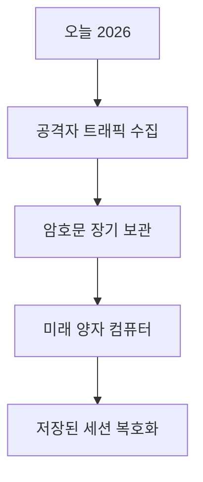
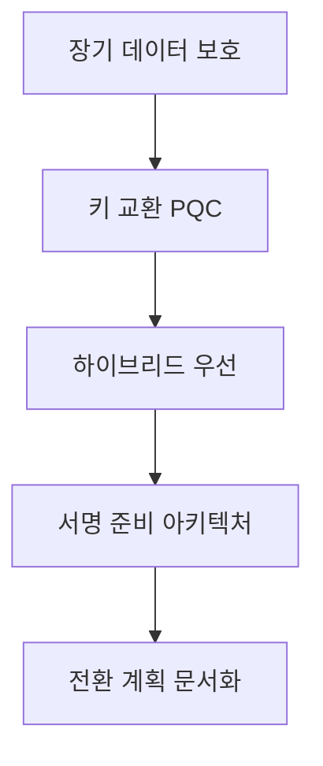

# 포스트 양자 TLS (ML-KEM · 하이브리드 · HNDL)

양자 컴퓨터는 **RSA · ECDHE · ECDSA**를 모두 깰 수 있다.
2026년 현재 대규모 양자 컴퓨터는 없지만, 공격자가 오늘 암호화된 트래픽을
**저장해 두고 미래에 복호화**하는 **HNDL(Harvest Now, Decrypt Later)**
위협이 이미 현실이다.

TLS 생태계는 이에 대비해 **양자 내성 암호(Post-Quantum Cryptography, PQC)**로
전환 중이며, 2025~2026년에 이 전환이 본격화되고 있다.

---

## 1. 왜 지금 PQC인가

### 1-1. HNDL 위협



- **장기 보안이 필요한 데이터**(의료, 금융, 국가 기밀, VPN 페이로드)는
  오늘 암호화해도 10~20년 뒤 복호화 당할 수 있다
- **PFS도 무력화** — 오늘 교환된 임시 키도 양자 컴퓨터가 나오면 복원
- 따라서 **전환은 빠를수록 낫다**

### 1-2. 무엇이 깨지는가

| 알고리즘 유형 | 예시 | 양자 컴퓨터 공격 |
|---|---|---|
| 공개키 암호 | RSA, ECDHE, DH | Shor 알고리즘으로 **완전 파괴** |
| 서명 | RSA, ECDSA, Ed25519 | 동일 |
| 대칭키 | AES-256, ChaCha20 | **Grover로 이론상 유효 키 길이 절반** — AES-128 위험, AES-256 유지 가능 |
| 해시 | SHA-256, SHA-384 | Grover로 **pre-image 난이도 절반** — SHA-384 이상 권장 |

> Grover 가속은 이론치이며, 병렬화·메모리·T-게이트 비용 한계로
> **실제 유효 공격 수준은 더 보수적**이다. NIST PQC 보안 레벨 산정도
> 이 한계를 반영하고 있다 (레벨 1/3/5가 AES-128/192/256에 대응).

**결론**: 대칭키·해시는 크기만 키우면 유지 가능하지만,
**공개키 기반 키 교환과 서명은 완전 교체 필요**.

---

## 2. NIST PQC 표준 (2024~2026)

2024년 8월 NIST는 첫 번째 FIPS 표준 3개를 발행했고, 2025~2026년에 확장된다.

| FIPS | 이름 | 기반 원안 | 용도 | 발행 |
|---|---|---|---|---|
| **203** | ML-KEM (Module-Lattice-Based KEM) | **Kyber** | 키 캡슐화 (키 교환) | 2024-08 발행 |
| **204** | ML-DSA (Module-Lattice-Based DSA) | **Dilithium** | 서명 | 2024-08 발행 |
| **205** | SLH-DSA (Stateless Hash-Based DSA) | **SPHINCS+** | 서명 (해시 기반) | 2024-08 발행 |
| **206** | FN-DSA | **Falcon** | 서명 | 2025-08 IPD 공개, **2026 말~2027 초 최종 예정** |

### 2-1. ML-KEM 파라미터

| 변형 | 공개키 (B) | 암호문 (B) | NIST 레벨 |
|---|---|---|---|
| ML-KEM-512 | 800 | 768 | 1 (AES-128 수준) |
| ML-KEM-768 | 1184 | 1088 | 3 (AES-192 수준) |
| ML-KEM-1024 | 1568 | 1568 | 5 (AES-256 수준) |

TLS에서는 **ML-KEM-768이 기본 선택**(레벨 3 = AES-192 상당).

### 2-2. ML-DSA 파라미터

| 변형 | 공개키 (B) | 서명 (B) | NIST 레벨 |
|---|---|---|---|
| ML-DSA-44 | 1312 | 2420 | 2 |
| ML-DSA-65 | 1952 | 3309 | 3 |
| ML-DSA-87 | 2592 | 4627 | 5 |

**기존 ECDSA(서명 64B)보다 훨씬 크다** → TLS 핸드셰이크 크기 급증.

---

## 3. 하이브리드 키 교환 (TLS 1.3에서 실제 쓰이는 방식)

### 3-1. 왜 "하이브리드"인가

PQC 알고리즘은 **아직 충분히 검증되지 않았다**는 우려가 있다.
고전 암호와 PQC를 **동시에** 실행하고, **두 공유 비밀을 연결(concatenate)**한
뒤 TLS 1.3의 HKDF에 그대로 주입한다.
**어느 한쪽이 깨져도 다른 쪽이 살아남는다.**

- X25519MLKEM768의 표준(draft-ietf-tls-ecdhe-mlkem) 방식:
  `shared_secret = ML-KEM shared secret ‖ X25519 shared secret` → HKDF-Extract/Expand
- 초기 논의 단계에서 XOR도 후보였지만, IETF 표준은 **concatenation + HKDF**로 확정

### 3-2. TLS 1.3 Named Group 코드포인트

| Named Group | 구성 | 현재 상태 |
|---|---|---|
| `X25519Kyber768Draft00` (0x6399) | X25519 + Kyber 768 (draft 버전) | **Deprecated** — 2024~2025 초기 배포 |
| `X25519MLKEM768` (0x11EC, 4588) | X25519 + **표준화된 ML-KEM-768** | **현재 표준** — 2025~2026 주력 |
| `SecP256r1MLKEM768` (0x11EB, 4587) | NIST P-256 + ML-KEM-768 | 연방 요구 대응 |
| 순수 `MLKEM768` (0x0768 등) | ML-KEM만 | 단독 배포는 보수적으로 |

### 3-3. 핸드셰이크 오버헤드

| 항목 | 전통 | 하이브리드 X25519MLKEM768 |
|---|---|---|
| Client key_share | 32 B | 32 + 1184 = **1216 B** |
| Server key_share | 32 B | 32 + 1088 = **1120 B** |
| 전체 Client Hello | 대개 ~500 B | **~2 KB** |

**1 MTU(~1460B)를 초과** → Client Hello가 **두 패킷에 걸쳐 전송**.
이 때문에 일부 middlebox·LB가 핸드셰이크를 망가뜨리는 사례가 있다 (소위 **middlebox intolerance**).

---

## 4. 현재 배포 상황 (2026-04)

### 4-1. 클라이언트

| 클라이언트 | 상태 |
|---|---|
| Chrome/Edge (Chromium) | 124부터 `X25519Kyber768` 기본 활성, **131부터 X25519MLKEM768로 전환** |
| Firefox 데스크톱 | **132+ 기본 활성** (mlkem768x25519) |
| Firefox Android | 145+ 기본 활성 |
| Safari | **iOS/iPadOS 26, macOS Tahoe 26(2025-10) 이후 기본** (Safari 26 계열) |
| Go `crypto/tls` | 1.23+ ML-KEM 지원 |
| OpenSSL | 3.5 (2025-04)부터 내장 ML-KEM |
| BoringSSL | 지원 |

### 4-2. 서버·CDN

| 서비스 | 상태 |
|---|---|
| Cloudflare | 2024-09 GA, 2026-Q1 기준 브라우저 기원 연결 중 **약 57%가 X25519MLKEM768**(Cloudflare Radar) |
| Google (YouTube·Search) | 2024년부터 배포 |
| AWS | **KMS·ACM·Secrets Manager·S3·Payments Cryptography GA**. 2026년 중 Kyber 제거, ML-KEM 단일 지원 |
| Azure | Front Door·Application Gateway 2026 로드맵 |
| Let's Encrypt | ACME 워크로드 대상 PQC 적용 연구 중 |

### 4-3. 실제 확인

```bash
# OpenSSL 3.5+ 예시
openssl s_client -connect example.com:443 -groups X25519MLKEM768

# 크롬에서 확인
# chrome://flags/#enable-tls13-kyber 또는 개발자 도구 Security 탭
```

---

## 5. 서명 전환은 더 느리다

키 교환은 **서버 한쪽의 교체**만으로 효과가 있지만, 서명은
- CA가 PQC 서명으로 인증서 발급
- OS·브라우저가 PQC 루트 신뢰
- 서버가 PQC 인증서를 배포

이 **전체 신뢰 체인**이 갖춰져야 의미가 있다.

| 주체 | 2026-04 진행 |
|---|---|
| NIST 서명 표준 | FIPS 204·205 완료, 206은 IPD 단계 |
| IETF LAMPS WG | ML-DSA 인증서 프로파일(draft-ietf-lamps-dilithium-certificates) 진행 |
| 전환 방안 | dual-algorithm certificate, Merkle Tree Certificate 논의 |
| PKI 테스트넷 | Cloudflare, Google 실험 중 |
| 공개 CA 발급 | 2027 전후 목표 |
| 브라우저 루트 신뢰 | 준비 단계 |
| 하드웨어 HSM 지원 | 점진 확대 |

**서명 전환은 수년이 더 걸린다.** 대신 **키 교환은 빠르게 전환**해
HNDL을 먼저 막는 것이 현재 전략이다.

---

## 6. 실무 전환 전략

### 6-1. 우선순위



| 단계 | 조치 |
|---|---|
| 1 | **HNDL 위협 인벤토리** — 장기 기밀 데이터가 흐르는 경로 목록화 |
| 2 | **키 교환부터 전환** — 서버·CDN에서 X25519MLKEM768 활성화 |
| 3 | **하이브리드 모드** — 순수 PQC 단독 배포는 보수적으로 |
| 4 | **크립토 애자일(Crypto Agility)** — 알고리즘을 쉽게 교체할 수 있는 설정 구조 |
| 5 | **서명 전환 아키텍처 준비** — HSM·CA·인증서 발급 파이프라인 |

### 6-2. 지연 · 대역폭 영향 평가

| 항목 | 변화 |
|---|---|
| Client Hello 크기 | 1 KB → **2+ KB** |
| 초기 RTT | 일부 환경에서 **추가 TCP 세그먼트** 발생 |
| CPU | 키 교환 계산량은 ML-KEM이 생각보다 낮음 — 대부분 문제 없음 |
| 메모리 | 인증서 수명 내 키 쌍 여러 개 보관 (하이브리드) |

**Cloudflare의 실측**에 따르면 사용자 체감 지연 증가는 **수 ms**에 그친다.

### 6-3. middlebox 호환성 문제

일부 중간 장비(기업 DLP, 구형 LB)가 **크기가 큰 Client Hello**를
이해하지 못하고 핸드셰이크를 drop한다.

| 증상 | 원인 |
|---|---|
| PQ 비활성 시 정상, 활성 시 실패 | middlebox가 확장 파싱 실패 |
| 특정 네트워크에서만 실패 | 기업 방화벽 SSL inspection |
| 오래된 LB 뒤 서버 | 구형 SSL termination 미지원 |

**대응**: 대부분 벤더 업데이트로 해결. Cloudflare는 HTTPS 재연결 시
자동으로 비-PQ로 폴백하는 매커니즘도 갖추고 있다.

---

## 7. 표준 문서 맵

| 문서 | 내용 |
|---|---|
| FIPS 203 | ML-KEM (발행) |
| FIPS 204 | ML-DSA (발행) |
| FIPS 205 | SLH-DSA (발행) |
| FIPS 206 IPD | FN-DSA (공개 리뷰 중) |
| draft-ietf-tls-hybrid-design | TLS 1.3 하이브리드 설계 (IETF 드래프트) |
| draft-ietf-tls-ecdhe-mlkem | X25519MLKEM768 코드포인트 (IETF 드래프트) |
| draft-connolly-tls-mlkem-key-agreement | 순수 ML-KEM 코드포인트 제안 |
| draft-ietf-lamps-dilithium-certificates | ML-DSA X.509 인증서 프로파일 |
| QUIC (RFC 9001) | QUIC은 TLS 1.3을 그대로 사용 — 키 교환 확장 시 동반 전환 |
| NSA CNSA 2.0 | 미국 정부 PQ 로드맵 |
| BSI TR-02102 | 독일 PQ 권고 |

---

## 8. 흔한 오해

| 오해 | 사실 |
|---|---|
| 양자 컴퓨터 아직 없으니 무시해도 된다 | HNDL 때문에 **지금 저장된 데이터도 위험** |
| TLS 1.3만 쓰면 PFS라 안전하다 | ECDHE 임시 키도 양자에게는 무력 |
| AES-256만 쓰면 양자에도 안전하다 | 키 교환이 RSA/ECDHE면 결국 깨짐 |
| PQC를 켜면 성능이 크게 나빠진다 | CPU는 거의 영향 없음, **핸드셰이크 크기**가 주요 이슈 |
| 서명까지 지금 바꿔야 한다 | 생태계 준비 전이라 현재는 **키 교환 우선** |
| 하이브리드는 과도기 조치라 곧 사라진다 | 최소 5~10년은 표준 유지될 전망 |

---

## 9. 체크리스트

| 영역 | 점검 |
|---|---|
| 인벤토리 | 장기 보안이 필요한 트래픽 식별 |
| 서버 | OpenSSL/BoringSSL 버전, X25519MLKEM768 지원 |
| CDN | 공급사의 PQC 지원 현황·활성화 방법 |
| 클라이언트 | 주 고객 브라우저·SDK가 지원하는가 |
| middlebox | DLP·LB가 2KB+ Client Hello 허용 |
| 모니터링 | PQ 활용률 메트릭, 폴백 발생률 |
| 크립토 애자일 | 알고리즘 교체가 배포 1회로 가능한 구조인가 |
| 서명 전환 | 루트 CA·HSM 로드맵 수립 |

---

## 10. 요약

| 개념 | 한 줄 요약 |
|---|---|
| HNDL | 오늘 수집, 미래 양자로 복호화 — **PFS도 무력화** |
| ML-KEM | NIST FIPS 203 키 캡슐화, Kyber 기반 |
| ML-DSA | NIST FIPS 204 서명, Dilithium 기반 |
| X25519MLKEM768 | TLS 1.3의 현 표준 하이브리드 키 교환 |
| 우선순위 | 키 교환 먼저 → 서명은 생태계 성숙 후 |
| 하이브리드 | 고전 + PQC 병행으로 리스크 최소화 |
| 오버헤드 | CPU는 OK, **핸드셰이크 크기 2KB+**가 실무 이슈 |
| middlebox | 구형 장비는 큰 Client Hello에서 실패 — 폴백 설계 |
| 배포 | Chrome·Firefox·Cloudflare·Google 이미 주력, AWS·Azure 단계적 |
| 크립토 애자일 | 알고리즘 교체가 쉬운 설정 구조 필요 |

---

## 참고 자료

- [FIPS 203 — Module-Lattice-Based Key-Encapsulation Mechanism](https://csrc.nist.gov/pubs/fips/203/final) — 확인: 2026-04-20
- [FIPS 204 — Module-Lattice-Based Digital Signature Standard](https://csrc.nist.gov/pubs/fips/204/final) — 확인: 2026-04-20
- [FIPS 205 — Stateless Hash-Based Digital Signature Standard](https://csrc.nist.gov/pubs/fips/205/final) — 확인: 2026-04-20
- [draft-ietf-tls-hybrid-design](https://datatracker.ietf.org/doc/draft-ietf-tls-hybrid-design/) — 확인: 2026-04-20
- [draft-ietf-tls-ecdhe-mlkem](https://datatracker.ietf.org/doc/draft-ietf-tls-ecdhe-mlkem/) — 확인: 2026-04-20
- [Cloudflare — Defending against future threats: Cloudflare goes post-quantum](https://blog.cloudflare.com/post-quantum-for-all/) — 확인: 2026-04-20
- [Cloudflare — NIST's pleasant post-quantum surprise](https://blog.cloudflare.com/nists-pleasant-post-quantum-surprise/) — 확인: 2026-04-20
- [Google Security Blog — Post-Quantum Readiness for TLS](https://security.googleblog.com/2024/05/advancing-our-amazing-bet-on-asymmetric.html) — 확인: 2026-04-20
- [Chromium — Post-quantum TLS status](https://www.chromium.org/quic/post-quantum-key-agreement/) — 확인: 2026-04-20
- [OpenSSL 3.5 release notes](https://www.openssl.org/news/cl35.txt) — 확인: 2026-04-20
- [NSA CNSA 2.0](https://www.nsa.gov/Press-Room/Press-Releases-Statements/Press-Release-View/Article/3148990/) — 확인: 2026-04-20
- [BSI TR-02102 Cryptographic Mechanisms](https://www.bsi.bund.de/EN/Themen/Unternehmen-und-Organisationen/Standards-und-Zertifizierung/Technische-Richtlinien/TR-nach-Thema-sortiert/tr02102/tr02102.html) — 확인: 2026-04-20
