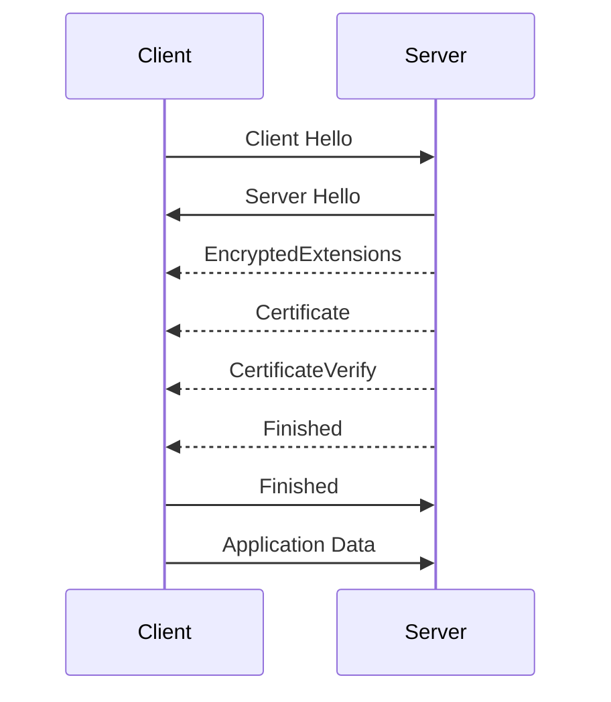
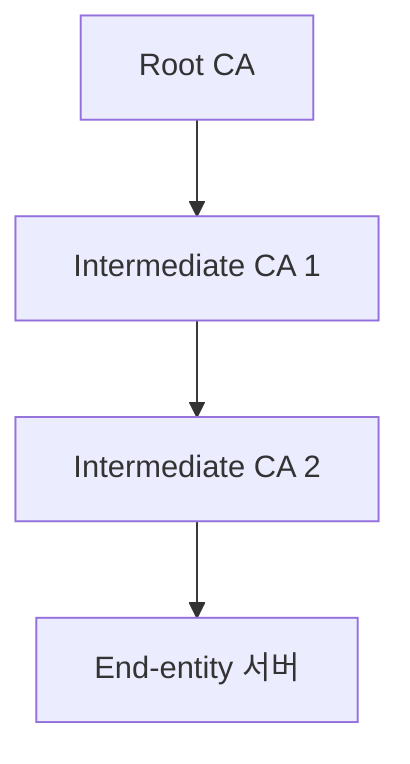

# TLS 기본 (핸드셰이크 · 인증서 · SNI · ALPN)

TLS는 인터넷 암호화의 기본 레이어다. 대부분의 DevOps 엔지니어는
TLS를 "그냥 되는 것"으로 대하다가 **인증서 만료 · 핸드셰이크 실패 ·
체인 깨짐**을 만나면 한참을 헤맨다.

이 글은 TLS 1.2/1.3의 핸드셰이크, 인증서 체인, SNI·ALPN 같은 확장,
그리고 실무 트러블슈팅을 다룬다.

> **상호 인증(mTLS)**: [mTLS 기본](./mtls-basics.md)
> **양자 내성 암호 전환**: [포스트 양자 TLS](./post-quantum-tls.md)
> **HTTP/3 위의 TLS**: [HTTP/3·QUIC](../http/http3-quic.md)

---

## 1. TLS가 보장하는 것

| 속성 | 설명 | 메커니즘 |
|---|---|---|
| 기밀성 (Confidentiality) | 도청 방지 | 대칭키 암호 (AES-GCM, ChaCha20) |
| 무결성 (Integrity) | 변조 탐지 | AEAD MAC |
| 인증 (Authentication) | 상대방 신원 확인 | X.509 인증서 + CA |
| 전방 안전성 (Forward Secrecy) | 과거 세션 보호 | (EC)DHE 임시 키 교환 |

**TLS의 목적은 암호화가 아니라 "인증된 암호화"다.**
서버 인증 없이 암호화만 하면 중간자 공격에 뚫린다.

---

## 2. TLS 1.3 핸드셰이크 (현대 표준)

### 2-1. 기본 1-RTT 흐름



| 메시지 | 포함 내용 |
|---|---|
| Client Hello (평문) | 지원 버전, 암호 스위트, **key_share**, **SNI (평문)**, ALPN 목록 |
| Server Hello (평문) | 선택된 버전·암호, **key_share** |
| EncryptedExtensions (암호화) | ALPN 결과, 확장 설정 — 여기부터는 전부 암호화 |
| Certificate (암호화) | 서버 인증서 체인 |
| CertificateVerify (암호화) | 서명 — 서버가 개인키를 가졌음을 증명 |
| Finished (암호화) | 핸드셰이크 무결성 검증 |

**1-RTT 달성**: Client Hello에 이미 `key_share`가 있어
Server Hello 직후부터 모든 핸드셰이크 메시지가 **암호화**된다.
TLS 1.2가 Certificate 등을 평문으로 보냈던 것과의 큰 차이.

### 2-2. 0-RTT (Early Data)

- 클라이언트가 **재접속 시**에는 핸드셰이크 완료 전 데이터를 보낼 수 있다
- **재전송 공격 위험** — GET 같은 idempotent 요청만 안전
- 서버 측 방어: `max_early_data_size` 제한, 단일 사용 티켓(single-use),
  strike register로 anti-replay window 유지
- 서버가 `0_rtt_enabled`로 허용해야 동작

### 2-3. 주요 변경점 (TLS 1.2 → 1.3)

| 항목 | TLS 1.2 | TLS 1.3 |
|---|---|---|
| 핸드셰이크 | 2-RTT | 1-RTT (+ 0-RTT 옵션) |
| 키 교환 | 정적 RSA(PFS 없음)·정적 DH·DHE·ECDHE | **(EC)DHE만** (PFS 필수) |
| 인증 | RSA, DSA, ECDSA | 서명 스킴 명시적 분리 |
| 대칭 암호 | CBC, GCM, ChaCha20 | **AEAD만** |
| 해시 | MD5, SHA-1, SHA-2 | SHA-2 이상 |
| 재협상 | 가능 (취약) | **불가** |
| 압축 | 가능 (CRIME 취약) | **불가** |
| Cipher Suite 수 | 300개 이상 | **5개** |

> TLS 1.2의 **정적 RSA 키 교환은 PFS를 제공하지 않는다** — 서버 개인키가
> 유출되면 과거 세션까지 복호화된다. draft-ietf-tls-deprecate-obsolete-kex는
> 정적 RSA·정적 DH를 명시적으로 deprecate한다.

---

## 3. 인증서 (X.509)

### 3-1. 인증서의 핵심 필드

| 필드 | 의미 |
|---|---|
| Subject | 인증서의 주체 (CN, O, OU 등) |
| Issuer | 발급자 (CA) |
| Serial Number | CA 내 고유 번호 |
| Validity | 발급일·만료일 |
| Subject Public Key Info | 공개키 |
| Extensions | 다양한 부가 정보 |
| Signature | CA 개인키의 서명 |

### 3-2. 꼭 알아야 할 Extension

| Extension | 용도 |
|---|---|
| **Subject Alternative Name (SAN)** | 인증서가 커버하는 도메인/IP (현대 핵심) |
| **Key Usage** | 서명·키암호 등 용도 제한 |
| **Extended Key Usage (EKU)** | Server Auth, Client Auth, Code Signing 등 |
| **Basic Constraints** | CA인지 여부, pathLenConstraint |
| **Authority Information Access (AIA)** | 발급자 인증서 URL, OCSP URL |
| **CRL Distribution Points** | 폐기 목록 위치 |
| **SCT (Signed Certificate Timestamp)** | Certificate Transparency 로그 증명 |

> **Subject CN은 현대 브라우저에서 무시된다.**
> 반드시 **SAN**에 모든 도메인을 넣어야 한다 (Chrome 58+부터 의무).

### 3-3. 인증서 체인



- **루트 CA**는 클라이언트 OS/브라우저에 **사전 설치**되어 있다
- **중간 CA**는 서버가 핸드셰이크 시 함께 전송해야 한다
- 서버가 중간 CA를 빼먹으면 **일부 클라이언트(특히 모바일·오래된 시스템)에서 실패**
- **Cross-sign**: 여러 루트에 연결되는 중간 인증서 — 호환성 전략

> **Root Program**: 각 플랫폼은 독자 루트 CA 프로그램을 운영한다.
> Chrome Root Store, Mozilla CA Program, Apple Trust Store, Microsoft Trusted Root Program.
> 루트 만료·키 롤오버(예: Let's Encrypt ISRG Root X1 2024 전환) 때마다
> 호환성 영향이 크므로 이벤트를 추적해야 한다.

### 3-4. 인증서 폐기 — OCSP / CRL / OCSP Stapling

| 메커니즘 | 특징 |
|---|---|
| **CRL** | 폐기 목록 전체 다운로드 — 크고 비효율 |
| **OCSP** | 인증서 1개 상태 실시간 질의 — **프라이버시·지연 문제** |
| **OCSP Stapling** (RFC 6066) | 서버가 OCSP 응답을 미리 받아 핸드셰이크에 첨부 |
| **Must-Staple** (RFC 7633) | **사실상 폐기** — Let's Encrypt 2025-05 갱신 중단, Chrome·Safari 미지원 |
| **CRLite · Short-lived certs** | 현대 대안. 브라우저 내장 CRL 스냅샷 + 짧은 수명 인증서 |

**2026년 현황**:
- **Let's Encrypt**: 기본 90일 유지, **6일짜리 `shortlived` 프로파일과 IP 인증서 2026-01 GA**
- **CA/Browser Forum Ballot SC-081v3 (2025-04 통과)**: 공개 TLS 인증서 수명 단축 스케줄
  - 2026-03-15부터 **최대 200일**
  - 2027-03-15부터 **최대 100일**
  - 2029-03-15부터 **최대 47일** + DCV 재사용 10일
- OCSP는 Let's Encrypt가 2025년에 발급 중단 — 생태계 전체가 CRLite·단축 수명으로 이동 중

---

## 4. SNI (Server Name Indication)

### 4-1. 왜 필요한가

한 IP에 여러 HTTPS 서비스를 호스팅할 때, 서버는 클라이언트가
**어떤 도메인을 요청하는지** 알아야 맞는 인증서를 보낼 수 있다.

```
Client Hello
  └─ SNI extension: server_name = api.example.com
```

HTTP/1.1의 `Host` 헤더와 같은 역할을, **TLS 핸드셰이크 단계에서** 한다.

### 4-2. SNI는 평문이다

전통 TLS에서 SNI는 **암호화되지 않은 채 전송**된다.
→ 사용자가 어떤 사이트를 방문하는지 노출 (검열·추적 가능).

### 4-3. ECH (Encrypted Client Hello)

이 문제를 해결하는 것이 **ECH**다.

| 항목 | 내용 |
|---|---|
| 표준 | **RFC 9849 (ECH 본체, 2026-02 발행)**, RFC 9180 (HPKE 암호화) |
| 키 배포 | DNS HTTPS/SVCB 레코드 (RFC 9460)의 `ech=` 파라미터 |
| 효과 | Client Hello 전체가 암호화되어 SNI·ALPN 노출 없음 |
| 채택 | Cloudflare·Firefox·Chrome 단계적 활성화 |

**ECH 활성화에는 DNS + CA + 서버·클라이언트 모두의 지원**이 필요하다.

---

## 5. ALPN (Application-Layer Protocol Negotiation)

### 5-1. 개념

TLS 핸드셰이크 중에 **어떤 L7 프로토콜을 쓸지** 협상.

| ALPN ID | 프로토콜 |
|---|---|
| `http/1.1` | HTTP/1.1 |
| `h2` | HTTP/2 |
| `h3` | HTTP/3 (QUIC) |
| `mqtt` | MQTT |
| `stun.turn` | STUN/TURN |

### 5-2. 왜 중요한가

- HTTP/2·HTTP/3은 **ALPN 없이 사용 불가** (브라우저 요구)
- `h2`는 반드시 TLS + ALPN 협상으로 결정
- 로드밸런서에서 "HTTP/2 안 됨" 문제의 대부분은 **ALPN 미설정**

```bash
# 직접 확인
openssl s_client -connect example.com:443 -alpn h2,http/1.1 \
  -servername example.com
```

---

## 6. 암호 스위트와 서명 스킴

### 6-1. TLS 1.3 허용 암호 스위트 (모두 AEAD)

| Cipher Suite | AES | 모드 | 해시 |
|---|---|---|---|
| TLS_AES_128_GCM_SHA256 | AES-128 | GCM | SHA-256 |
| TLS_AES_256_GCM_SHA384 | AES-256 | GCM | SHA-384 |
| TLS_CHACHA20_POLY1305_SHA256 | ChaCha20 | Poly1305 | SHA-256 |
| TLS_AES_128_CCM_SHA256 | AES-128 | CCM | SHA-256 |
| TLS_AES_128_CCM_8_SHA256 | AES-128 | CCM-8 | SHA-256 |

**ChaCha20-Poly1305**는 AES 하드웨어 가속이 없는 모바일·저전력 환경에서 빠르다.

### 6-2. 서명 스킴

| 스킴 | 키 유형 | 비고 |
|---|---|---|
| rsa_pss_rsae_sha256 | 일반 RSA 인증서 + PSS 서명 | **대부분의 실제 배포** 인증서가 여기 해당 |
| rsa_pss_pss_sha256 | RSA-PSS 전용 인증서 | OID 1.2.840.113549.1.1.10 — 거의 안 쓰임 |
| ecdsa_secp256r1_sha256 | ECDSA P-256 | 가장 흔한 현대 선택 |
| ed25519 | Ed25519 | 현대, 짧고 빠름 |
| rsa_pkcs1_sha256 | RSA | TLS 1.2 레거시 (1.3에서는 인증용으로만 허용) |

---

## 7. 세션 재개

핸드셰이크 CPU·RTT 비용을 줄이기 위한 캐싱 메커니즘.

| 방식 | 특징 |
|---|---|
| Session ID (TLS 1.2) | 서버에 세션 상태 저장 |
| Session Ticket (TLS 1.2) | 서버가 발급한 암호화 티켓을 클라이언트가 보관 |
| PSK (Pre-Shared Key, TLS 1.3) | 재개·외부 PSK 통합 |

**주의**: 여러 서버 간 티켓 키를 공유해야 LB 뒤에서도 재개가 동작.
**주기적 rotation** 필수 (PFS 약화 방지).

---

## 8. 실무 설정 권장

### 8-1. Mozilla SSL Configuration Generator

Mozilla의 3단계 프로파일이 사실상 업계 기본.

| 프로파일 | TLS 버전 | 대상 |
|---|---|---|
| Modern | 1.3만 | 현대 클라이언트만 있을 때 |
| Intermediate | 1.2 + 1.3 | 대부분의 일반 서비스 |
| Old | 1.0~1.3 | 극도 레거시 호환 (금지 권장) |

**2026년 권장: Intermediate 이상**.
TLS 1.0/1.1은 2021년 RFC 8996으로 공식 폐기됨.

### 8-2. Nginx 예시 (Mozilla Intermediate 기반)

```nginx
ssl_protocols TLSv1.2 TLSv1.3;

# TLS 1.2 cipher (TLS 1.3은 아래 conf_command로 별도 제어)
ssl_ciphers ECDHE-ECDSA-AES128-GCM-SHA256:ECDHE-RSA-AES128-GCM-SHA256:ECDHE-ECDSA-CHACHA20-POLY1305:ECDHE-RSA-CHACHA20-POLY1305:ECDHE-ECDSA-AES256-GCM-SHA384:ECDHE-RSA-AES256-GCM-SHA384;
ssl_prefer_server_ciphers off;

# TLS 1.3 cipher suite (필요 시)
ssl_conf_command Ciphersuites TLS_AES_128_GCM_SHA256:TLS_AES_256_GCM_SHA384:TLS_CHACHA20_POLY1305_SHA256;

ssl_session_cache shared:SSL:50m;
ssl_session_tickets on;
ssl_session_timeout 1d;

# OCSP Stapling (2026년에도 여전히 유효한 서버들에만 의미)
ssl_stapling on;
ssl_stapling_verify on;

add_header Strict-Transport-Security "max-age=63072000" always;
```

> **Mozilla SSL Config Generator** (ssl-config.mozilla.org)가 출력하는
> 최신 cipher 목록을 그대로 쓰는 것이 안전하다. 위 예시도 생성기 출력을
> 간략화한 것이며, 배포 대상 클라이언트에 따라 달라질 수 있다.

### 8-3. 필수 HTTP 헤더

| 헤더 | 목적 |
|---|---|
| `Strict-Transport-Security` | HTTPS 강제 (HSTS) |
| `Content-Security-Policy` | 스크립트·프레임 제어 |
| `X-Content-Type-Options: nosniff` | MIME 스니핑 방지 |

> **HSTS `includeSubDomains; preload` 주의**: preload list에 등록하면
> 사용자가 HTTPS 미대응 서브도메인에 접근 불가능해지고, **제거에 수개월 소요**된다.
> 모든 서브도메인이 HTTPS를 완벽 지원하는지 확인한 뒤에만 활성화한다.

---

## 9. Certificate Transparency · CAA

### 9-1. Certificate Transparency (CT)

- CA가 발급한 모든 인증서를 **공개 CT 로그**에 기록
- 브라우저는 **SCT (Signed Certificate Timestamp)**가 없으면 신뢰 안 함
- Chrome은 인증서 신뢰의 **하드 요구사항**

공개 CT 로그 덕분에 **오발급을 전 세계가 감시**할 수 있다.
(crt.sh, censys.io로 검색 가능)

### 9-2. CAA 레코드

DNS에서 "이 도메인은 CA X만 발급 가능"을 지정 — 앞서 DNS 편에서 다룸.
[DNS 운영 — CAA](../dns/dns-operations.md#2-3-caa--인증서-발급-통제) 참고.

---

## 10. 트러블슈팅

### 10-1. 명령 한 줄씩

```bash
# 서버 전체 정보
openssl s_client -connect example.com:443 -servername example.com \
  -showcerts < /dev/null

# TLS 1.3만
openssl s_client -connect example.com:443 -tls1_3

# 특정 암호 스위트
openssl s_client -connect example.com:443 -cipher 'ECDHE+AESGCM'

# ALPN 확인
openssl s_client -connect example.com:443 -alpn h2,http/1.1

# 인증서 만료 확인
echo | openssl s_client -connect example.com:443 -servername example.com \
  2>/dev/null | openssl x509 -noout -dates
```

### 10-2. 온라인 도구

| 도구 | 용도 |
|---|---|
| [SSL Labs](https://www.ssllabs.com/ssltest/) | 서버 설정 종합 점수 |
| [testssl.sh](https://testssl.sh/) | CLI 종합 스캐너 |
| [crt.sh](https://crt.sh/) | CT 로그 검색 |
| [Hardenize](https://www.hardenize.com/) | TLS + DNS + 이메일 종합 |

### 10-3. 자주 만나는 실패

| 오류 | 원인 |
|---|---|
| `SSL_ERROR_NO_CYPHER_OVERLAP` | 클라이언트·서버가 공통 암호 없음 |
| `HANDSHAKE_FAILURE` | 인증서·서명 불일치, SNI 불일치 |
| `BAD_CERTIFICATE` | 체인 끊김, 만료, SAN 불일치 |
| `UNKNOWN_CA` | 중간 CA 누락, 클라이언트에 루트 없음 |
| `CERTIFICATE_EXPIRED` | 만료 (모니터링 부재) |
| `CERTIFICATE_REVOKED` | 키 유출 등 폐기됨 |
| `APPLICATION_DATA_AFTER_CLOSE_NOTIFY` | 조기 연결 종료 |

---

## 11. 요약

| 주제 | 한 줄 요약 |
|---|---|
| TLS 1.3 | 1-RTT 기본, 0-RTT 옵션, PFS 필수, 재협상·압축 제거 |
| 인증서 | SAN이 핵심, CN은 무시됨 |
| 체인 | 중간 CA를 서버가 보내야 함 |
| SNI | 서버가 어떤 인증서를 보낼지 선택하는 실마리 — 평문 |
| ECH | SNI 노출 해결책 — DNS·CA·클라이언트 모두 협력 |
| ALPN | HTTP/2·HTTP/3에 필수 |
| 폐기 | OCSP Stapling + 짧은 수명 인증서가 현대적 방향 |
| 세션 재개 | PSK(TLS 1.3)로 통합, 티켓 키 rotation 필요 |
| 설정 | Mozilla Intermediate가 실무 기본 |
| CT | SCT 없으면 브라우저가 거부 |

---

## 참고 자료

- [RFC 8446 — TLS 1.3](https://www.rfc-editor.org/rfc/rfc8446) — 확인: 2026-04-20
- [RFC 5246 — TLS 1.2](https://www.rfc-editor.org/rfc/rfc5246) — 확인: 2026-04-20
- [RFC 8996 — Deprecating TLS 1.0/1.1](https://www.rfc-editor.org/rfc/rfc8996) — 확인: 2026-04-20
- [RFC 6066 — TLS Extensions (SNI, Stapling)](https://www.rfc-editor.org/rfc/rfc6066) — 확인: 2026-04-20
- [RFC 7633 — Must-Staple](https://www.rfc-editor.org/rfc/rfc7633) — 확인: 2026-04-20
- [RFC 6962 — Certificate Transparency](https://www.rfc-editor.org/rfc/rfc6962) — 확인: 2026-04-20
- [Mozilla SSL Configuration Generator](https://ssl-config.mozilla.org/) — 확인: 2026-04-20
- [Cloudflare Blog — ECH rollout](https://blog.cloudflare.com/encrypted-client-hello/) — 확인: 2026-04-20
- [Let's Encrypt — Chain of Trust](https://letsencrypt.org/certificates/) — 확인: 2026-04-20
- [testssl.sh](https://testssl.sh/) — 확인: 2026-04-20
- [crt.sh](https://crt.sh/) — 확인: 2026-04-20
