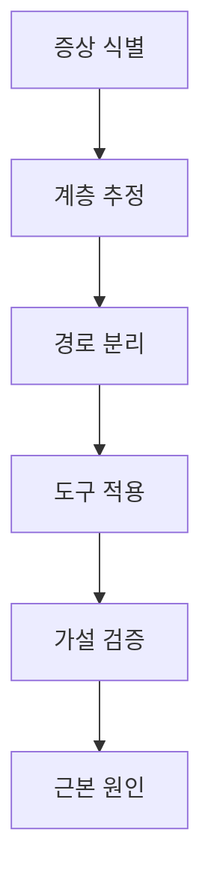

# 네트워크 트러블슈팅 (mtr · ss · iperf3 · eBPF)

네트워크 장애는 **계층별 도구를 순서대로** 쓸 때 가장 빠르게 범위가 좁혀진다.
이 글은 Linux 호스트 기준으로 **실무에서 반복 사용하는 절차와 도구**를 정리한다.

> 계층 이론은 [OSI·TCP/IP](../basics/osi-tcp-ip.md),
> 패킷 캡처는 [패킷 분석](../basics/packet-analysis.md),
> 개별 도구(iproute2·firewall·SSH)는 `host-tools/` 참고.

---

## 1. 전체 흐름 — 구조화된 접근



### 1-1. "무엇을 먼저 물어볼 것인가"

| 질문 | 좁혀지는 영역 |
|---|---|
| 모두에게 발생하는가, 일부에게만? | 클라이언트 측 vs 서버 측 |
| 언제부터 시작? 재현 가능한가? | 변경·배포와의 상관 |
| 증상이 지연인가, 실패인가, 일부 실패인가? | L3/L4/L7 우선 분기 |
| 영향 받는 서비스는 하나인가, 여러 개인가? | 경로 공통점 |
| 프로토콜은 TCP·UDP·QUIC·HTTP/x 중 무엇? | 도구 선택 |

---

## 2. 계층별 기본 도구

| 계층 | 기본 도구 |
|---|---|
| L1/L2 | `ip -s link`, `ethtool`, `bridge fdb`, `ip neigh` |
| L3 | `ip route get`, `ip rule`, `mtr`, `traceroute` |
| L4 | `ss`, `tcpdump`, `nc`, `iperf3` |
| TLS/L5-6 | `openssl s_client`, `curl -v` |
| L7 HTTP | `curl -v`, `tshark -Y http`, Envoy admin |
| DNS | `dig`, `delv`, `resolvectl` |
| K8s | `kubectl debug`, Hubble, Cilium, `ksniff` |

---

## 3. 연결성 확인 — ping · mtr · traceroute

### 3-1. `mtr` — 거의 항상 traceroute보다 낫다

```bash
# TCP 포트 443로 경로 확인 (ICMP 차단 환경)
mtr -T -P 443 example.com

# UDP로 DNS 확인
mtr -u -P 53 1.1.1.1

# 숫자만 (-n) 리포트 형식으로 50회 측정. -b를 붙이면 IP와 이름 모두 표시
mtr -rn -c 50 example.com

# IPv6 경로
mtr -6 -T -P 443 example.com
```

| 플래그 | 의미 |
|---|---|
| `-T` | TCP |
| `-u` | UDP |
| `-P <port>` | 목적지 포트 |
| `-n` | DNS 역조회 안 함 |
| `-r` | report 모드 (CI 자동화에 유용) |
| `-c <N>` | N회만 측정 |

**해석 포인트**:
- **한 홉에서만 loss** → 그 홉의 라우터가 ICMP 제한적으로 응답할 수 있음 (실제 전달은 정상)
- **이후 모든 홉에서 loss** → 실제 경로 손실
- **지연이 특정 홉에서 급증** → 그 구간 병목

### 3-2. `traceroute`

- mtr이 없을 때만 대체로 사용
- `traceroute -T -p 443`로 TCP 경로 확인
- 방화벽 정책에 따라 실제 경로와 다르게 보일 수 있음

---

## 4. 소켓 상태 — `ss`

### 4-1. 기본 사용

```bash
# 모든 리스닝 TCP 포트
ss -lntp

# 모든 ESTABLISHED 연결
ss -tn state established

# 특정 포트
ss -tn sport = :443

# 소켓 통계 요약
ss -s
```

### 4-2. 상태 이상 진단

| 상태 | 많을 때 의미 |
|---|---|
| `TIME_WAIT` | 클라이언트에서 짧은 연결 많음 — 포트 고갈 가능 |
| `CLOSE_WAIT` | 앱이 `close()` 호출 안 함 — FD 누수 징후 |
| `SYN_RECV` | SYN 플러드 또는 백엔드 과부하 |
| `LAST_ACK` | 종료 중 FIN 교환이 막힘 |

### 4-3. 혼잡 제어·추가 정보

```bash
# CC 알고리즘·RTT·cwnd·retrans 표시
ss -ti state established

# 소켓 메모리 상세 (skmem - rmem_alloc, wmem_queued 등)
ss -tnm

# 기본 출력에 Send-Q / Recv-Q가 이미 포함
ss -tn
```

**해석 포인트**:
- **Recv-Q 누적** → 앱이 소켓을 느리게 읽음
- **Send-Q 누적** → 원격 수신 측이 처리 못 함
- `rtt:30.5/4.2` → 평균 30.5ms, 변동 4.2ms
- `cwnd`가 10에서 정체 → slow start 초반 또는 손실 감지
- `retrans:0/3` → 전송 3번 중 재전송 실패 기록 있음 (경로 손실 의심)

---

## 5. 대역폭·지연 측정 — `iperf3`

### 5-1. 기본

```bash
# 서버
iperf3 -s

# 클라이언트
iperf3 -c server.internal -t 30 -P 4
```

| 플래그 | 의미 |
|---|---|
| `-t <sec>` | 테스트 시간 |
| `-P <N>` | 병렬 스트림 수 |
| `-u` | UDP 모드 (`-b 1G` 같이 대역 지정) |
| `-R` | 역방향 (서버 → 클라이언트) |
| `-J` | JSON 출력 |

### 5-2. 유의점

- iperf3는 **CPU·NIC 성능**에 민감 — 한 스트림만 쓰면 CPU 코어 하나에 묶임
- **프로덕션 트래픽 경로**와 같은 엣지를 타지 않으면 의미가 다르다
- UDP 측정은 **드롭·jitter**를 본다

### 5-3. K8s 환경

```bash
# 서버 Pod + Service (재시작 시 IP 변경 대비)
kubectl run iperf-server --image=networkstatic/iperf3 \
  --port 5201 -- -s
kubectl expose pod iperf-server --port 5201

# 클라이언트 (Service 이름으로 접근)
kubectl run -it --rm iperf-client --image=networkstatic/iperf3 \
  --restart=Never -- -c iperf-server -t 30
```

- **Pod-to-Pod**: Pod IP로 직접 측정
- **Pod-to-Service**: ClusterIP 또는 Service 이름 (kube-proxy·CNI LB 경로)
- **Pod-to-External**: NAT·egress 경로

세 경로를 각각 측정해야 CNI·MTU·오버레이·kube-proxy 문제를 분리할 수 있다.

---

## 6. 패킷 캡처와 해석

`tcpdump` · `tshark` · Wireshark 상세는
[패킷 분석](../basics/packet-analysis.md) 글 참고. 여기서는 **트러블슈팅 문맥에서의 짧은 명령 모음**.

```bash
# 기본 — 목적 호스트 필터
sudo tcpdump -i any -nn host <ip> and port 443 -w /tmp/dump.pcap

# SYN만
sudo tcpdump -i any -nn 'tcp[tcpflags] & (tcp-syn|tcp-ack) == tcp-syn'

# RST 찾기
sudo tcpdump -i any -nn 'tcp[tcpflags] & tcp-rst != 0'

# MTU 분석
sudo tcpdump -i any -nn 'icmp[icmptype] == 3 and icmp[icmpcode] == 4'

# MTU 능동 측정 (DF 비트 + 크기 조정)
ping -M do -s 1472 <host>
tracepath <host>
```

> `-i any`는 Linux cooked-mode(SLL) 헤더가 붙어 VLAN 등 L2 필터가
> 기대대로 동작하지 않을 수 있다. 정밀 분석은 특정 인터페이스(`-i eth0`)로.

---

## 7. DNS 진단

```bash
# 위임 체인 끝까지 따라가기
dig +trace example.com

# 특정 리졸버에 직접 질의
dig @1.1.1.1 example.com +short

# DNSSEC 검증
delv example.com

# 리졸버 현재 상태 (systemd-resolved)
resolvectl status
resolvectl query example.com

# 파드 안에서 CoreDNS 확인
kubectl exec -it <pod> -- nslookup kubernetes.default
```

**DNS 실패 체크 순서**:
1. 리졸버에 도달 가능?
2. 외부 도메인 조회 가능?
3. Split-DNS (회사 내부 도메인)?
4. NXDOMAIN? SERVFAIL?
5. ndots·search로 인한 경로 폭증?

---

## 8. TLS 트러블슈팅

```bash
# 전체 핸드셰이크
openssl s_client -connect example.com:443 \
  -servername example.com -showcerts -tlsextdebug </dev/null

# TLS 1.3만
openssl s_client -connect example.com:443 -tls1_3

# 특정 ALPN
openssl s_client -connect example.com:443 -alpn h2

# 인증서 만료
echo | openssl s_client -connect example.com:443 -servername example.com 2>/dev/null \
  | openssl x509 -noout -dates

# Certificate Transparency 로그에서 이력
# crt.sh 검색 결과 참조
```

**자주 만나는 실패**:
- `UNKNOWN_CA` — 체인 누락 또는 클라이언트 신뢰 안 된 루트
- `HANDSHAKE_FAILURE` — 암호 스위트·버전·ALPN 불일치
- `CERTIFICATE_EXPIRED` — 시스템 시간 / 실제 만료
- `SNI` 문제 — `-servername` 없이 들어가면 default vhost 응답

---

## 9. K8s 전용 도구

### 9-1. `kubectl debug`

```bash
# 임시 netshoot 컨테이너를 pod 네트워크 네임스페이스에 붙이기
kubectl debug -it <pod> --image=nicolaka/netshoot -- bash

# 노드 네임스페이스 진입
kubectl debug node/<node> -it --image=nicolaka/netshoot
```

### 9-2. Cilium Hubble

```bash
# Pod 관련 흐름 관찰
hubble observe --pod frontend-abc --follow

# 드롭된 흐름만
hubble observe --verdict DROPPED

# 클러스터 전체 연결성 테스트
cilium connectivity test
```

### 9-3. Service/Endpoint 확인

```bash
# Service 라우팅
kubectl get svc
kubectl get endpointslice

# kube-proxy IPVS (사용 시)
ipvsadm -Ln | head

# Service → Pod 매핑이 맞는지
kubectl describe svc <svc>
```

### 9-4. Istio / 메시

```bash
istioctl proxy-config listener <pod> -n <ns>
istioctl proxy-config route <pod> -n <ns>
istioctl proxy-config cluster <pod> -n <ns>
istioctl proxy-config secret <pod> -n <ns>
```

---

## 10. eBPF 기반 관측 (modern)

```bash
# Inspektor Gadget (image-based)
kubectl gadget run trace_dns:latest       # K8s
sudo ig run trace_dns:latest              # 호스트

# bpftrace로 TCP retransmit 추적
sudo bpftrace -e 'kprobe:tcp_retransmit_skb { @[comm] = count(); }'

# retrans·rtt 빠르게
sudo tcpretrans     # bcc-tools
sudo tcprtt         # bcc-tools

# Pixie
px run px/http_data
px live px/http_data
```

**eBPF가 강점**인 영역:
- 시스템 전체 관측, 로그 없이도 패킷 경로 추적
- conntrack 상태·NAT 변환
- Pod 간 L7 흐름 (HTTP·gRPC·Kafka) — Hubble·Pixie 등

---

## 10-5. QUIC / HTTP/3 진단

```bash
# Alt-Svc 헤더 확인
curl -I https://example.com | grep -i alt-svc

# HTTP/3 강제
curl --http3-only -v https://example.com

# qlog 생성 (지원 구현)
export QLOGDIR=/tmp/qlog

# Wireshark에서 QUIC 복호화는 SSLKEYLOGFILE 사용
export SSLKEYLOGFILE=/tmp/sslkey.log
```

자세히는 [HTTP/3·QUIC](../http/http3-quic.md).

---

## 10-6. curl 단계별 지연 분리

```bash
cat > /tmp/curl-format.txt <<'EOF'
    dns:      %{time_namelookup}\n
    connect:  %{time_connect}\n
    tls:      %{time_appconnect}\n
    ttfb:     %{time_starttransfer}\n
    total:    %{time_total}\n
EOF
curl -o /dev/null -s -w "@/tmp/curl-format.txt" https://example.com
```

"어느 계층이 느린가"를 한 번에 분리한다.

---

## 11. 증상 → 원인 매핑

| 증상 | 가장 흔한 원인 |
|---|---|
| `Connection refused` | 대상 포트 LISTEN 없음, SG/NACL 차단, Service 미설정 |
| `Connection timeout` | 경로 단절, 방화벽 DROP, 인스턴스 다운 |
| 첫 요청 성공, 이후 실패 | keep-alive 커넥션 끊김, NAT idle 타임아웃 |
| 작은 요청 OK, 큰 요청 타임아웃 | **MTU 블랙홀** (ICMP 차단) |
| HTTPS만 실패 | TLS 인증서·ALPN, SNI 미전달 |
| 특정 도메인만 실패 | DNS, Split-DNS, CDN 경로 |
| p99만 나쁘다 | 큐 누적, 꼬리 지연, LB 알고리즘 |
| 재시도 폭증 | retry budget 없음, 백엔드 5xx |
| CPU 급증 | iptables 체인·conntrack, 대형 ACL, TLS re-encrypt |
| 간헐적 끊김 | 비대칭 라우팅, rp_filter, NAT, conntrack 표 고갈 |
| IPv4는 되는데 IPv6 실패 | ICMPv6 Packet Too Big 차단, IPv6 라우팅 누락, dual-stack 설정 불일치 |

---

## 12. 진단 플레이북 (요약)

### 12-1. "앱이 외부 호출 실패"

1. `dig` / `resolvectl query` — 이름 해결되나?
2. `mtr -T -P 443 <host>` — L3 경로?
3. `curl -v https://<host>` — TLS·HTTP 단계까지?
4. `tcpdump -nn host <host>` — 실제 전송되나?
5. Pod이면 `kubectl debug` + 같은 단계 반복
6. `conntrack -L` · `cat /proc/sys/net/netfilter/nf_conntrack_count`
   vs `nf_conntrack_max`, `dmesg | grep conntrack` ("table full" 시그니처) /
   Hubble 드롭 이벤트

### 12-2. "간헐적 502/504"

1. LB 로그 — upstream 주소·RT
2. 백엔드 `ss -ti` — ESTABLISHED와 cwnd
3. `tcpdump` — RST 방향
4. MTU·PMTUD 의심 시 MSS 클램핑
5. 백엔드 GC·CPU·pool saturation 확인

### 12-3. "K8s에서 DNS 느림"

1. `kubectl -n kube-system get pods -l k8s-app=kube-dns` — CoreDNS 파드
2. `coredns_dns_request_duration_seconds` 그래프
3. `ndots: 5`로 인한 search 증폭 (ndots 튜닝)
4. NodeLocal DNSCache 미설치 여부
5. 업스트림 리졸버 응답 지연

### 12-4. "클러스터 내 Pod-to-Pod 불통"

1. `kubectl get netpol` — NetworkPolicy 차단?
2. `hubble observe --verdict DROPPED` (Cilium) 또는 Calico Felix 로그
3. 같은 노드만 OK면 **CNI 노드 간 경로 문제** (VXLAN·BGP)
4. 다른 노드 OK면 **로컬 iptables/eBPF 문제**
5. MTU 미스매치 점검

---

## 13. 운영 팁

| 팁 | 이유 |
|---|---|
| **도구 박스 이미지를 준비** (netshoot, wireshark, iperf3) | 긴급 시 바로 쓸 수 있게 |
| **flow log + APM + mesh 관측**을 연결 | 계층 간 상관 분석 |
| 재현 가능한 시점을 **timestamp 단위**로 기록 | 로그 매칭 |
| Postmortem에 **도달 계층과 가설** 남기기 | 반복 학습 |
| **MTU 함정** 별도 런북 | 재현이 어려운 증상 1순위 |
| 사이드카·프록시는 **자체 메트릭·admin 엔드포인트** 활용 | Envoy `:15000` 등 |

---

## 14. 요약

| 주제 | 한 줄 요약 |
|---|---|
| 접근 | 증상 → 계층 → 경로 → 도구 → 가설 검증 |
| L3 | mtr이 traceroute보다 기본 |
| L4 | ss 한 줄로 90% 드러남 |
| 대역·지연 | iperf3로 병목 확인 |
| DNS | dig/delv/resolvectl 조합 |
| TLS | openssl s_client가 여전히 강력 |
| K8s | kubectl debug + Hubble이 현대 기본 |
| eBPF | 로그 없이도 L3~L7 관측 |
| 증상 매핑 | MTU·conntrack·keep-alive가 단골 |
| 플레이북 | 반복 장애 유형은 체크리스트화 |

---

## 참고 자료

- [mtr — 공식](https://www.bitwizard.nl/mtr/) — 확인: 2026-04-20
- [ss (iproute2)](https://man7.org/linux/man-pages/man8/ss.8.html) — 확인: 2026-04-20
- [iperf3](https://iperf.fr/) — 확인: 2026-04-20
- [tcpdump](https://www.tcpdump.org/) — 확인: 2026-04-20
- [bpftrace](https://bpftrace.org/) — 확인: 2026-04-20
- [bcc-tools](https://github.com/iovisor/bcc) — 확인: 2026-04-20
- [Cilium Hubble](https://docs.cilium.io/en/stable/gettingstarted/hubble/) — 확인: 2026-04-20
- [Inspektor Gadget](https://inspektor-gadget.io/) — 확인: 2026-04-20
- [netshoot container](https://github.com/nicolaka/netshoot) — 확인: 2026-04-20
- [Google SRE Workbook — Debugging](https://sre.google/workbook/) — 확인: 2026-04-20
- [Brendan Gregg — Linux Performance](https://www.brendangregg.com/linuxperf.html) — 확인: 2026-04-20
