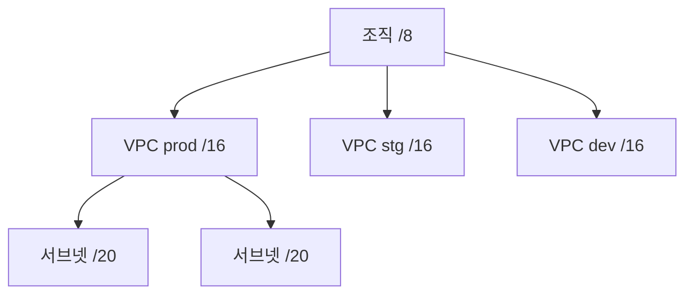
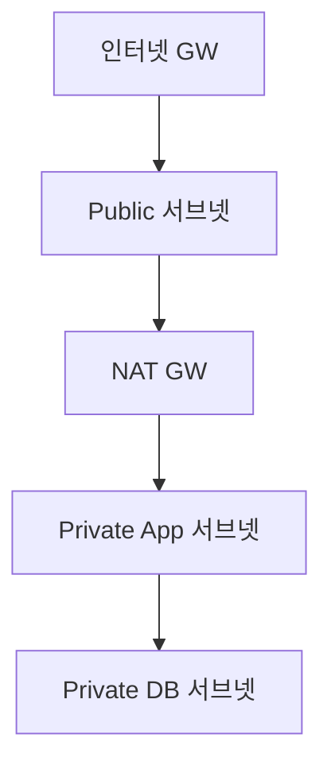
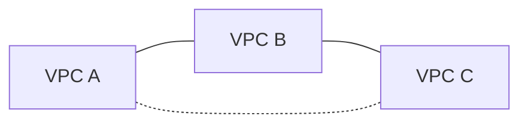
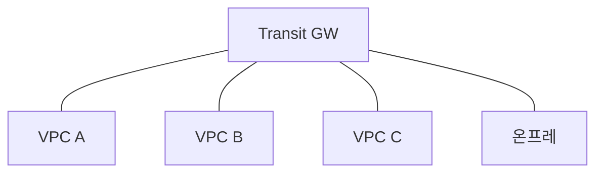

# VPC 설계 (서브넷 · NAT · Peering · Transit)

VPC는 클라우드의 가상 네트워크다.
"VPC 만들기" 자체는 5분이면 끝나지만, **잘못 설계하면 수 년을 끌고 다니는 유산**이 된다.

이 글은 AWS·GCP·Azure 3대 CSP의 공통 개념으로 VPC 설계의 원칙,
서브넷·라우팅·NAT·Peering·Transit Gateway·엔드포인트까지 다룬다.

> 라우팅·BGP 원리는 [라우팅 기본](../ip-routing/routing-basics.md),
> [BGP 기본](../ip-routing/bgp-basics.md) 참고.
> 온프레 연결(VPN)은 [VPN·WireGuard](./vpn-wireguard.md).

---

## 1. VPC란

| 항목 | 내용 |
|---|---|
| 개념 | 클라우드 안에서 논리적으로 격리된 네트워크 |
| CIDR | 생성 시 결정, 나중에 변경·확장 제한적 |
| 단위 | 리전별 VPC — AWS·GCP는 리전 단위, Azure VNet도 리전 단위 |
| 교차 리전 | 별도 연결 (Peering·TGW 등) 필요 |

### 1-1. CSP별 명칭

| 개념 | AWS | GCP | Azure |
|---|---|---|---|
| 가상 네트워크 | VPC (리전) | **VPC Network (글로벌 리소스)** | VNet (리전) |
| 서브넷 | Subnet (AZ별) | Subnet (리전 단위, 모든 존에서 사용) | Subnet (리전, 존은 리소스별) |
| 라우트 테이블 | Route Table | Route 리소스 | Route Table (UDR) |
| 내부 DNS | Route 53 Private Hosted Zone + Resolver | Cloud DNS (Private Zone) | Private DNS Zone |
| 엔드포인트 | VPC Endpoint (Gateway·Interface) | Private Service Connect | Private Endpoint |

> **주의**: GCP VPC는 **글로벌 리소스**다. 같은 VPC 안이면 리전이 달라도
> peering 없이 통신되며, 서브넷은 리전 단위이지만 하나로 다중 존을 커버한다.
> AWS 멘탈 모델로 GCP를 설계하면 서브넷을 존별로 중복 생성해 IP가 낭비된다.

### 1-2. 공통 원칙

- **IP 겹침 금지**: 다른 VPC·온프레와 CIDR이 겹치면 연결 불가
- **광역 CIDR 선점**: 한 번 만든 CIDR은 확장·축소가 어려움 → 넉넉히 잡는다
- **사설 대역만 사용**: RFC 1918 범위 (10/8, 172.16/12, 192.168/16)
- **리전별 분리**: 하나의 VPC를 여러 리전에 걸치지 않는다

---

## 2. CIDR 설계

### 2-1. 기본 원칙

- **조직 전체에 하나의 최상위 대역**을 잡는다 (예: 10.0.0.0/8)
- **환경별 VPC는 /16** (65,536 IP) 이상 권장
- **서브넷은 /20~/24** — 너무 작으면 K8s 대규모 클러스터에서 부족

### 2-2. 규모별 참고

| 용도 | CIDR 권장 | IP 수 |
|---|---|---|
| 소규모 dev | /24 | 256 |
| 일반 앱 서브넷 | /22 | 1024 |
| K8s Pod 범위 | /16 | 65,536 |
| VPC 전체 | /16 ~ /12 | 65K~1M |

### 2-3. 피해야 할 선택

- **10.0.0.0/24, 172.31.0.0/16 (AWS 기본 VPC)** 겹침
- **192.168.0.0/24** 같이 가정용 라우터와 충돌
- 너무 작은 VPC → K8s Pod IP 고갈
- **서로 다른 VPC가 같은 CIDR** → Peering·TGW 불가

---

## 3. 서브넷 분할

### 3-1. 3-티어 기본 구조

| 서브넷 | 특징 | 예시 리소스 |
|---|---|---|
| Public | IGW 경유 인바운드 가능 | LB, Bastion |
| Private App | Outbound만 (NAT 경유) | ECS·EKS·VM |
| Private DB | 인터넷 차단, 앱 서브넷만 접근 | RDS·Aurora |

### 3-2. AZ/존 단위 분리

- **최소 3개 AZ에 동일 서브넷 배치** — 가용성 핵심
- AWS 서브넷은 AZ별, GCP 서브넷은 리전 단위지만 **존별 리소스 배치** 권장
- 각 AZ별 NAT GW 권장 (AZ 교차 요금 회피)

### 3-3. Kubernetes 전용 CIDR

| 영역 | 권장 |
|---|---|
| 노드 서브넷 | /22 정도 |
| Pod CIDR | 별도 **secondary CIDR** 또는 VPC 연결 확장 |
| Service CIDR | VPC와 겹치지 않는 별도 범위 |

AWS **VPC Secondary CIDR**로 대규모 Pod IP 수용.
GCP **Alias IP**로 Pod/Service를 서브넷 내에서 할당.

---

## 4. 라우트 테이블과 인터넷 경계

### 4-1. 라우트 기본 형태

| 목적지 | 타겟 | 의미 |
|---|---|---|
| `10.0.0.0/16` | local | VPC 내부 (자동) |
| `0.0.0.0/0` | IGW | 인터넷 (Public) |
| `0.0.0.0/0` | NAT GW | Outbound 인터넷 (Private) |
| `10.100.0.0/16` | TGW | 다른 VPC 또는 온프레 |
| `169.254.169.254` | local | 메타데이터 서비스 (자동) |

### 4-2. NAT Gateway의 실상

| 장점 | 단점 |
|---|---|
| 관리형, 고가용성 | **GB당 처리 요금** (크로스 AZ보다 큼) |
| Regional NAT GW(AWS, 2025-11) 출시로 multi-AZ 자동 | Zonal NAT GW는 여전히 AZ 단위 장애 영향 |
| 대역폭 자동 확장 | 비용이 누적되면 연간 수만 달러 |

> **Regional NAT Gateway (AWS, 2025-11)**: multi-AZ에 자동 확장되어
> AZ 단일 장애 영향을 제거. 기존 **Zonal NAT Gateway**는 AZ별로 생성해
> AZ 교차 요금을 줄이는 전통 패턴. 신규 설계는 Regional 우선 고려.

**비용 최적화**:
- **VPC Gateway Endpoint**로 S3·DynamoDB 트래픽 **NAT 우회** (무료)
- VPC Interface Endpoint (PrivateLink)로 기타 AWS 서비스 직접 접근
- 3rd-party 자체 NAT(`fck-nat`, HA NAT instance) 대안

### 4-3. Egress-Only IGW (IPv6)

- IPv6은 NAT이 없다 (퍼블릭 주소 무한 공급)
- IPv6 인스턴스가 인바운드 없이 **아웃바운드만 하고 싶을 때** Egress-Only IGW 사용

---

## 5. VPC 간 연결

### 5-1. VPC Peering

| 특성 | 내용 |
|---|---|
| 종류 | 1:1 연결 |
| 비전이성 | **A↔B, B↔C라도 A↔C 자동 안됨** |
| CIDR | 겹치지 않아야 |
| 리전·계정 | 교차 지원 (Cross-region, Cross-account) |
| 대역 | 제한 없음 (리전 내), 리전 간 별도 요금 |

**한계**: VPC 많아지면 **풀 메시** 관리 부담 → TGW로 전환.

### 5-2. Transit Gateway / Hub-and-Spoke

- 중심 **TGW에 여러 VPC·VPN·Direct Connect를 연결**
- 라우트 테이블로 **세밀한 경로 제어** (격리·공유)
- CSP별 대응:

| CSP | 제품 |
|---|---|
| AWS | Transit Gateway, Cloud WAN |
| GCP | Network Connectivity Center |
| Azure | Virtual WAN |

### 5-3. VPC Endpoint / PrivateLink

서비스에 **인터넷 거치지 않고** 접근.

| 종류 (AWS 예) | 비용 | 특징 |
|---|---|---|
| **Gateway Endpoint** | 무료 | S3·DynamoDB 전용, 라우트 테이블로 연결 |
| **Interface Endpoint (PrivateLink)** | AZ당 시간당 ~$0.01 + GB당 ~$0.01 | ENI 기반, 다른 AWS 서비스·3rd-party |
| Private Service Connect (GCP) | — | 유사 개념 |
| Private Endpoint (Azure) | — | 유사 개념 |

Gateway Endpoint는 **NAT GW 비용 회피**의 핵심.
대부분의 VPC는 `S3` Gateway Endpoint를 기본으로 두어야 한다.

> **NAT vs Interface Endpoint 분기점**: 월 트래픽이 대략 160 GB를 넘어서면
> Interface Endpoint가 NAT보다 저렴해진다. 다만 Interface Endpoint는
> AZ·엔드포인트 개수에 비례해 시간 요금이 쌓이므로 사용 서비스 수를
> 의식적으로 관리해야 한다.

---

## 6. 온프레 연결

| 방식 | 대역폭 | 지연 |
|---|---|---|
| Site-to-Site VPN | **터널당 최대 5 Gbps** (AWS 2025-11), TGW ECMP로 수십 Gbps 집계 | ~30-50ms |
| Direct Connect / ExpressRoute / Interconnect | 1~100 Gbps | ~10ms 이하 |
| SD-WAN Appliance | 다양 | 다양 |

상세:
- [BGP 기본 — 클라우드 BGP](../ip-routing/bgp-basics.md#7-클라우드-bgp)
- [VPN·WireGuard](./vpn-wireguard.md)

---

## 7. 보안 — SG · NACL · Flow Log

### 7-1. Security Group (SG)

- **Stateful**: Outbound 허용된 반환은 자동
- 인스턴스·ENI 단위 적용
- 허용 규칙만 (Deny 없음)
- **SG를 SG에 참조** 가능 — "해당 SG가 붙은 모든 ENI의 사설 IP 집합"을 의미
  - 같은 VPC 또는 peered VPC 안에서만 사용 가능
  - CIDR 하드코딩 없이 동적 IP 환경(Auto Scaling·Spot) 대응
- 기본 한도: **inbound·outbound 각 60 규칙**, ENI당 최대 5 SG 적용 가능

### 7-2. NACL (Network ACL)

- **Stateless**: 양방향 규칙 필요
- 서브넷 단위 적용
- 허용·거부 둘 다 가능
- **낮은 번호부터 평가 → 첫 매치에서 즉시 결정** (이후 규칙은 무시)
  - 앞쪽에 넓은 allow가 있으면 뒤의 deny가 무력화되는 흔한 실수

### 7-3. 조합 원칙

| 원칙 | 이유 |
|---|---|
| SG로 끝내는 게 보통 | Stateful 편리, 관리 단순 |
| NACL은 **보호막** | 광범위한 IP 차단 (DDoS, 지오 블록) |
| Flow Log 전수 활성 | 포렌식·컴플라이언스 필수 |

### 7-4. Flow Log

- VPC Flow Log (AWS), VPC Flow Logs (GCP), NSG Flow Logs (Azure)
- 기본 v2: 5-tuple + 허용/거부, 바이트·패킷 수
- **AWS Flow Log v3+ 커스텀 포맷**: `pkt-srcaddr`, `pkt-dstaddr`,
  `traffic-path`, `flow-direction`, `vpc-id`, `subnet-id` 등 추가 필드.
  NAT 뒤 실제 원본/목적 IP 확인에 사실상 필수
- CloudWatch Logs Insights · Athena · BigQuery · Azure Monitor로 분석
- Traffic Mirroring으로 **전체 패킷 캡처** 가능 (비용 큼)

---

## 8. IPv6·Dual Stack

| 항목 | 내용 |
|---|---|
| AWS | IPv6 VPC 지원 (`/56` 프리픽스 자동 할당) |
| GCP | IPv4/IPv6 dual-stack 서브넷 지원 |
| Azure | dual-stack 서브넷 지원 |

- IPv6는 **NAT 없음** — 각 인스턴스가 퍼블릭 IPv6
- Outbound 제한은 **Egress-Only IGW**
- K8s에서 dual-stack은 Pod·Service·CoreDNS 모두 대응 필요

---

## 9. 설계 체크리스트

| 영역 | 점검 |
|---|---|
| CIDR | 조직 전역 /8, 환경별 /16 할당 체계 |
| 겹침 | 다른 VPC·온프레·파트너와 겹치지 않음 |
| 서브넷 분리 | Public/App/DB + 최소 3 AZ |
| NAT | AZ별 GW, S3/DynamoDB는 Gateway Endpoint |
| 연결 | VPC 수 많으면 TGW 전환 |
| SG/NACL | SG 기본, NACL은 보호막 |
| Flow Log | 모든 VPC에 활성 + 중앙 수집 |
| DNS | Private Hosted Zone + Resolver 규칙 |
| IPv6 | 장기 로드맵에 dual-stack 포함 |
| 문서화 | 네트워크 다이어그램·IP 할당표 주기적 갱신 |

---

## 10. 자주 마주치는 장애

| 증상 | 원인 |
|---|---|
| "다른 VPC 안 됨" | Peering 없음, 라우트 미설정, SG 차단, CIDR 겹침 |
| NAT 비용 급증 | S3 Gateway Endpoint 미설정, 크로스 AZ NAT 사용 |
| Pod IP 고갈 | 서브넷 너무 작음 → Secondary CIDR 추가 |
| DNS 해결 실패 | Private Zone 연결 누락, Resolver 규칙 누락 |
| TGW 경로 루프 | 라우트 테이블에서 같은 CIDR 복수 광고 |
| Flow Log 조회 느림 | CloudWatch Log → Athena·BigQuery 전환 |
| 특정 포트만 실패 | NACL 양방향 규칙 미설정 (Stateless) |

---

## 11. 요약

| 주제 | 한 줄 요약 |
|---|---|
| VPC | 리전 단위 논리 네트워크 |
| CIDR | 겹치면 안 됨, 크게 잡고 세분화 |
| 서브넷 | 3-티어 + 3 AZ가 기본 |
| NAT | AZ별, 비용 주의, Gateway Endpoint로 우회 |
| Peering vs TGW | 소수는 Peering, 다수는 TGW |
| PrivateLink | 인터넷 거치지 않는 서비스 접근 |
| SG vs NACL | Stateful vs Stateless, SG가 주력 |
| IPv6 | NAT 없음, Egress-Only IGW |
| Flow Log | 모든 환경에 활성화 |
| 온프레 | VPN은 가성비, Direct Connect는 대역·지연 |

---

## 참고 자료

- [AWS VPC docs](https://docs.aws.amazon.com/vpc/) — 확인: 2026-04-20
- [AWS Transit Gateway](https://docs.aws.amazon.com/vpc/latest/tgw/) — 확인: 2026-04-20
- [AWS PrivateLink](https://docs.aws.amazon.com/vpc/latest/privatelink/) — 확인: 2026-04-20
- [GCP VPC overview](https://cloud.google.com/vpc/docs/overview) — 확인: 2026-04-20
- [GCP Network Connectivity Center](https://cloud.google.com/network-connectivity/docs/network-connectivity-center/concepts/overview) — 확인: 2026-04-20
- [Azure VNet docs](https://learn.microsoft.com/azure/virtual-network/) — 확인: 2026-04-20
- [Azure Virtual WAN](https://learn.microsoft.com/azure/virtual-wan/) — 확인: 2026-04-20
- [RFC 1918 — Private Address Space](https://www.rfc-editor.org/rfc/rfc1918) — 확인: 2026-04-20
- [RFC 6177 — IPv6 Address Assignment to End Sites](https://www.rfc-editor.org/rfc/rfc6177) — 확인: 2026-04-20
- [VPC Flow Logs — AWS Whitepaper](https://docs.aws.amazon.com/vpc/latest/userguide/flow-logs.html) — 확인: 2026-04-20
