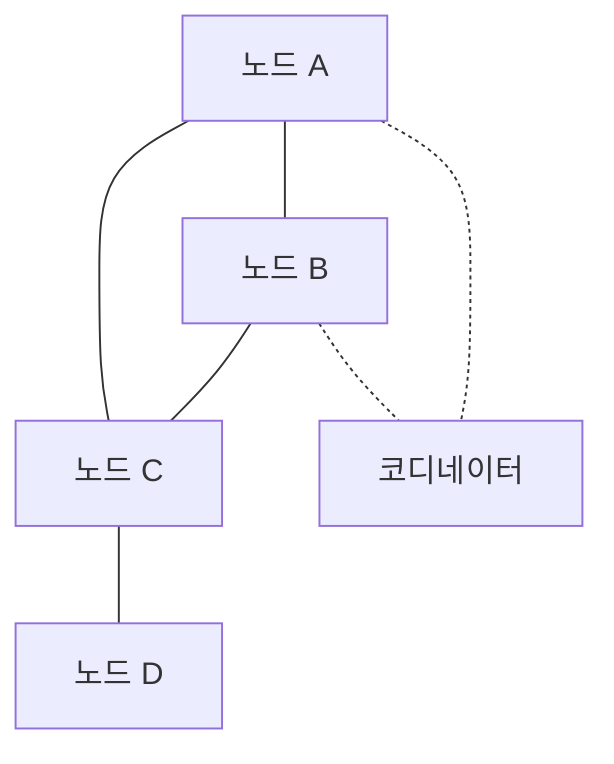

# VPN · WireGuard (IPsec 비교 · Mesh VPN)

VPN은 "보호된 채널을 한 번 만들면 끝"이 아니라
**프로토콜·키 관리·경로·NAT·성능**이 얽힌 시스템이다.

이 글은 실무에서 만나는 3가지 VPN 층위를 정리한다.

1. **Site-to-Site IPsec** — 온프레-클라우드·DC 간
2. **WireGuard** — 현대 경량 커널 VPN
3. **Overlay Mesh VPN** — Tailscale·Nebula·ZeroTier처럼 분산된 P2P 메시

> VPC 자체는 [VPC 설계](./vpc-design.md), 클라우드 VPN 상세는
> [BGP 기본 — 클라우드 BGP](../ip-routing/bgp-basics.md#7-클라우드-bgp) 참고.

---

## 1. VPN 유형

| 유형 | 용도 | 대표 구현 |
|---|---|---|
| **IPsec (Site-to-Site)** | 온프레-클라우드, DC 간 | strongSwan, AWS/Azure/GCP VPN |
| **IPsec (Remote Access)** | 개인 사용자 연결 | IKEv2/IPsec, L2TP/IPsec |
| **TLS VPN (Remote Access)** | 개인 사용자 연결 | OpenVPN, AnyConnect |
| **WireGuard** | 모든 용도 (경량·현대) | wg, wg-quick, 커널 모듈 |
| **Overlay Mesh VPN** | 다수 노드의 자동 메시 | Tailscale, Nebula, ZeroTier, Innernet |
| **Zero Trust Remote Access** | 기업 SaaS 접근 | Cloudflare Access, Tailscale, Twingate |

---

## 2. IPsec 개요

### 2-1. 구성

| 계층 | 역할 |
|---|---|
| IKE (v2) | 키 협상·인증 (UDP 500). NAT 환경에선 **NAT-T**가 IKE·ESP를 UDP 4500으로 인캡슐레이션 — ESP는 L4 포트가 없어 NAT 디바이스가 상태 추적 불가 |
| ESP | 실제 암호화된 페이로드 |
| AH | 인증만 (현대에선 거의 안 씀) |

### 2-2. 모드

| 모드 | 특징 |
|---|---|
| Transport | IP 헤더 유지, 페이로드만 암호화 |
| Tunnel | 새 IP 헤더 + 원본 패킷 전체 암호화 — VPN의 실무 기본 |

### 2-3. 장단점

| 장점 | 단점 |
|---|---|
| 상호운용성 (모든 밴더·OS) | **설정 복잡** — IKE 파라미터·정책·SA 매트릭스 |
| AES·SHA2 하드웨어 가속 광범위 | 방화벽 UDP 500/4500·ESP 통과 이슈 |
| Route-based VPN (BGP 통합) | 키 교환·재협상이 무겁다 |
| 엔터프라이즈·감사에 친숙 | NAT·Double NAT 환경 취약 |

### 2-4. 클라우드 VPN

| CSP | 제품 | 특징 |
|---|---|---|
| AWS | Site-to-Site VPN | **터널당 최대 5 Gbps** (2025-11, TGW/Cloud WAN 연결 + 고정 IP CGW + Large 옵션 전제, 기본은 1.25 Gbps) |
| GCP | Cloud VPN | HA VPN, SLA 99.99% (터널 2개) |
| Azure | VPN Gateway | Generation 2 SKU, P2S·S2S 모두 |

### 2-5. Route-based vs Policy-based

| 구분 | 동작 |
|---|---|
| Policy-based | "X 서브넷 → Y 서브넷 트래픽만 터널로" — ACL 기반 |
| Route-based | 가상 터널 인터페이스에 라우트를 걸면 자동으로 암호화 |

**Route-based**가 현대 표준. BGP로 동적 라우팅 가능, 경로 변경·HA·ECMP에 유리.

---

## 3. WireGuard

### 3-1. 철학

- "Linus Torvalds가 칭찬한 VPN" — 2020년 Linux 커널 메인라인 병합
- **코드 베이스 4,000줄 수준** (OpenVPN·strongSwan은 수십만 줄)
- 보안 감사·포멀 검증이 가능할 만큼 작다
- 현대 대칭 암호(ChaCha20, Poly1305, Curve25519, BLAKE2s)만 고정

### 3-2. 동작 모델


- 가상 인터페이스 `wg0` 하나
- **피어(peer)** 개념으로 대칭 — "클라이언트/서버" 구분이 코드상 없음
- 각 피어마다 **공개 키 + AllowedIPs**
- 트래픽이 오면 **source IP로 peer를 찾아 키로 복호화**

### 3-3. Cryptokey Routing

```
[Interface]
PrivateKey = ...
Address = 10.0.0.1/24
ListenPort = 51820

[Peer]
PublicKey = <PeerB-pubkey>
AllowedIPs = 10.0.0.2/32, 192.168.10.0/24
Endpoint = peerB.example.com:51820
PersistentKeepalive = 25
```

- `AllowedIPs`는 **양방향 역할**을 겸한다:
  - **송신**: 커널이 패킷 목적지를 보고 **어떤 peer로 보낼지** 결정 (라우팅)
  - **수신**: 복호화된 평문의 source IP가 해당 peer의 AllowedIPs에 있어야 수락 (인증)
- "어떤 키로 복호 가능한지 = 어떤 주소를 사용할 수 있는지"

### 3-4. 장단점

| 장점 | 단점 |
|---|---|
| 매우 빠름 (커널 모듈 + 적은 컨텍스트 스위치) | Enterprise 감사 도구 지원이 상대적으로 약함 |
| 설정 파일 **20줄 수준** | 동적 피어 관리는 외부 도구 필요 |
| **UDP 단일 포트** (기본 51820) — 방화벽 간단 | 공식적 로드밸런싱·HA 기능 없음 |
| IPv6 1급 시민 | 복잡한 정책(ACL·QoS) 없음 |
| 공격 표면 매우 작음 | 로그가 기본적으로 없음 (진단 어려움) |

### 3-5. 오버헤드

| 헤더 | 바이트 |
|---|---|
| 외부 IPv4 | 20 |
| UDP | 8 |
| WireGuard 헤더(타입+reserved+receiver index+counter = 16B) + Poly1305 인증 태그 16B | 32 |
| **총 오버헤드 (IPv4)** | **60** |
| **IPv6일 때** | **80** (외부 IPv6 40) |

→ MTU 1500 링크에서 WireGuard 실질 payload는 **1440**. MSS 클램핑 필요.
자세히는 [MTU·MSS](../basics/mtu-mss.md).

### 3-6. NAT 통과

- WireGuard는 **UDP 51820** 하나로 동작 → NAT 친화적
- **PersistentKeepalive** (25초)로 NAT 바인딩 유지
- 양쪽 모두 NAT 뒤라면 **별도 relay/hole punching** 필요 (Tailscale DERP 등)

---

## 4. WireGuard 운영 팁

### 4-1. 커널 모듈 vs userspace

| 구현 | 특징 |
|---|---|
| Linux 5.6+ 커널 모듈 | 최고 성능 |
| `boringtun` (Rust) | macOS·Windows·eBPF 환경에서 유용 |
| `wireguard-go` | 이식성, 성능은 커널보다 낮음 |
| DPDK·XDP 구현 | 고성능 엣지 |

### 4-2. 라우팅 전략

| 전략 | AllowedIPs |
|---|---|
| 풀 터널 (모든 트래픽) | `0.0.0.0/0, ::/0` |
| 스플릿 터널 | 특정 서브넷만 |
| 허브-앤-스포크 | 허브가 모든 peer의 CIDR을 가짐 |
| 메시 | 각 peer가 모두의 CIDR을 AllowedIPs에 기록 |

### 4-3. 자동화

- **wg-quick**은 단순 1노드 시나리오에 적합
- 규모가 커지면:
  - **Netmaker, WG Easy, WireGuard-UI**로 GUI 관리
  - **Tailscale, Innernet**으로 자동 피어 분배
  - Ansible·Terraform으로 정적 관리도 가능

### 4-4. 관측

- 기본 로그 없음 → `wg show`로 상태 확인
- `wg show dump`를 Prometheus exporter(`wireguard_exporter`)로 메트릭화
- 패킷 캡처는 `wg0` 가상 인터페이스에 tcpdump

---

## 5. IPsec vs WireGuard 비교

| 항목 | IPsec (IKEv2) | WireGuard |
|---|---|---|
| 프로토콜 수명 | 1998~ | 2015~ (2020 커널 병합) |
| 설정 복잡도 | 높음 | 매우 낮음 |
| 코드량 | 수십만 줄 | ~4,000줄 |
| 성능 | 높음 (HW 가속) | 매우 높음 (커널) |
| 암호 | 다양 (선택 가능) | 고정 (ChaCha20-Poly1305 등) |
| 포트·방화벽 | UDP 500/4500 + ESP | UDP 단일 |
| NAT | NAT-T 필요 | 친화적 |
| 상호운용 | 벤더 무관 | 구현 제한적 |
| 엔터프라이즈 | 감사·HA·BGP 풍부 | 보조 도구 필요 |
| 모바일 | IKEv2 재접속 지원 | Persistent Keepalive + roaming |
| K8s | IPsec CNI 제한적 | Cilium WireGuard, Calico WireGuard 옵션 |

**선택 기준**:
- **상호운용·엔터프라이즈** → IPsec
- **단순·고성능·모던 팀** → WireGuard
- **많은 노드·P2P 메시** → Overlay Mesh VPN

---

## 6. Overlay Mesh VPN

### 6-1. 문제

전통 VPN은 **중앙 집중**이다. 사용자 → VPN 게이트웨이 → 내부 망.
클라우드 멀티 리전·재택·IoT 시대에는:
- 중앙 VPN이 SPOF·병목
- 양방향 NAT·모바일 환경에 불리
- 수백~수천 노드의 VPN 게이트웨이 설정 부담

### 6-2. Mesh 원리



- **코디네이터**(control plane)는 키·IP 교환만 담당
- 실제 트래픽은 노드 **직접 P2P**
- NAT 양쪽이라도 **STUN·hole punching**, 안 되면 **DERP 같은 relay**
- WireGuard를 데이터 플레인으로 쓰는 경우가 많음

### 6-3. 대표 제품

| 제품 | 데이터 | 제어 | 라이선스 |
|---|---|---|---|
| **Tailscale** | WireGuard | MagicDNS·ACL·DERP relay | 상용 + 개인 무료 |
| **Headscale** | WireGuard | Tailscale 호환 오픈소스 coordinator | BSD-3-Clause |
| **Nebula** (Slack) | Noise_IK 기반 자체 프로토콜 | Lighthouse 방식 | MIT |
| **ZeroTier** | 자체 프로토콜 | 글로벌 controllers | BSL 1.1 (GPL 자동 전환 조항) |
| **Netmaker** | WireGuard | 자체 서버 | Apache 2.0 (오픈 코어, Professional은 상용) |
| **Innernet** (Tonari) | WireGuard | 간단 서버 | MIT |

> WireGuard와 Nebula 모두 **Noise Protocol Framework** 기반(WireGuard는 Noise_IKpsk2 패턴).
> 비슷한 암호 스위트·보안 속성이 자연스러운 이유다.

### 6-4. 언제 쓰는가

| 시나리오 | 적합 |
|---|---|
| 다수의 개발자 원격 접근 | Tailscale |
| 멀티 클라우드 내부 링크 | Nebula, Netmaker |
| IoT 펜스·엣지 | Netmaker, ZeroTier |
| 소규모 개인·팀 | Tailscale free, Innernet |
| 완전 자체 운영 | Headscale, Nebula |

---

## 7. Zero Trust Remote Access

**전통 VPN**: 한 번 들어오면 내부 네트워크 전체 신뢰.
**Zero Trust**: 연결마다 **신원·컨텍스트**에 따라 정책 평가.

| 제품 | 특징 |
|---|---|
| Cloudflare Access + Tunnel | Cloudflare 엣지에서 인증 → 내부 앱에 직접 |
| Tailscale (with ACL) | 각 노드·사용자 단위 정책 |
| Twingate | 에이전트 기반, IP 숨김 |
| Google BeyondCorp | 내부 표준 (구글 자체) |
| Pomerium | 오픈소스 Zero Trust 게이트웨이 |

- VPN 카테고리와 경계가 흐려지는 영역
- 세부 전략은 `security/` 카테고리 참조

---

## 8. K8s CNI와 WireGuard

최근 주요 CNI는 **WireGuard로 Node 간 트래픽 암호화** 옵션 제공.

| CNI | 전송 암호화 옵션 |
|---|---|
| Calico | WireGuard로 노드 간 Pod 트래픽 암호화 |
| Cilium | WireGuard 또는 IPsec 중 선택 (Transparent Encryption) |
| Flannel | 공식 지원 없음 (외부 설정 필요) |

> CNI 전송 암호화와 **Service Mesh의 mTLS**는 다른 레이어다.
> CNI는 L3 터널을 암호화(노드 간), Mesh는 L7 워크로드 인증·암호화.
> 둘은 서로 중첩 사용 가능하며, 목적·위협 모델이 다르다.

---

## 9. 트러블슈팅

### 9-1. 공통

```bash
# 터널 인터페이스 상태
ip -s link show wg0  # WireGuard
ip -s link show ipsec0  # strongSwan (VTI)

# 라우팅 확인
ip route get <remote_ip>

# NAT traversal
tcpdump -i any udp port 4500 or udp port 500   # IPsec
tcpdump -i any udp port 51820                   # WireGuard
```

### 9-2. WireGuard 전용

```bash
# 피어 상태
wg show

# 최근 handshake 시각, rx/tx 바이트
wg show wg0 latest-handshakes

# 트래픽이 가야 하는데 안 감 → AllowedIPs 누락 의심
wg show wg0 allowed-ips
```

### 9-3. IPsec 전용 (strongSwan)

```bash
swanctl --list-sas
swanctl --log
ipsec statusall
```

### 9-4. MTU 관련

- VPN은 오버헤드가 크므로 **큰 요청·TLS 인증서에서만 타임아웃**이 흔함
- MSS 클램핑 필요:

```bash
# WireGuard 인터페이스에서
iptables -t mangle -A FORWARD -o wg0 -p tcp --tcp-flags SYN,RST SYN \
  -j TCPMSS --clamp-mss-to-pmtu
```

---

## 10. 보안 체크리스트

| 항목 | 점검 |
|---|---|
| 키 관리 | 키 회전 프로세스, HSM/Secrets 저장소 |
| PSK | IKE PSK는 DH 실패 시 마지막 방어선 — 길고 복잡하게 |
| PFS | DH group 14(2048) 이상, 권장 ECDHE |
| 알고리즘 | AEAD만 — AES-GCM, ChaCha20-Poly1305 |
| 감사 | VPN 접속 로그, 중앙 집중 수집 |
| 2FA | Remote Access는 2FA 필수 |
| 분할 | Split tunneling 정책 (내부 트래픽만 터널) |
| 취약점 | strongSwan·WireGuard CVE 알림 구독 |
| PQ | 하이브리드 PQ (IPsec PQ-IKEv2, **Rosenpass**가 WireGuard 옆에서 PQ PSK 주입) 추적 |

---

## 11. 요약

| 주제 | 한 줄 요약 |
|---|---|
| IPsec | 전통 표준, 상호운용·엔터프라이즈 강점, 설정 복잡 |
| WireGuard | 커널 친화 현대 VPN, 설정 최소, UDP 단일 포트 |
| Cryptokey Routing | AllowedIPs가 키와 라우팅을 동시에 결정 |
| MTU | WireGuard 오버헤드 60B(IPv4)·80B(IPv6), MSS 클램핑 필수 |
| Mesh VPN | Tailscale·Nebula·ZeroTier로 P2P 자동 메시 |
| Zero Trust | 연결마다 정책 평가, 전통 VPN의 대체 흐름 |
| K8s | CNI(Calico·Cilium)가 WireGuard·IPsec으로 노드 간 암호화 |
| 선택 기준 | 상호운용 IPsec, 단순·고성능 WireGuard, 메시는 Overlay |

---

## 참고 자료

- [WireGuard 공식](https://www.wireguard.com/) — 확인: 2026-04-20
- [WireGuard 논문 (Donenfeld 2017)](https://www.wireguard.com/papers/wireguard.pdf) — 확인: 2026-04-20
- [strongSwan docs](https://docs.strongswan.org/) — 확인: 2026-04-20
- [RFC 7296 — IKEv2](https://www.rfc-editor.org/rfc/rfc7296) — 확인: 2026-04-20
- [RFC 4301 — IPsec Architecture](https://www.rfc-editor.org/rfc/rfc4301) — 확인: 2026-04-20
- [Tailscale docs](https://tailscale.com/kb/) — 확인: 2026-04-20
- [Nebula GitHub](https://github.com/slackhq/nebula) — 확인: 2026-04-20
- [Netmaker docs](https://netmaker.io/docs) — 확인: 2026-04-20
- [Cilium WireGuard transparent encryption](https://docs.cilium.io/en/stable/security/network/encryption-wireguard/) — 확인: 2026-04-20
- [Calico WireGuard](https://docs.tigera.io/calico/latest/network-policy/encrypt-cluster-pod-traffic) — 확인: 2026-04-20
- [Cloudflare Blog — Post-quantum WireGuard](https://blog.cloudflare.com/post-quantum-wireguard/) — 확인: 2026-04-20
