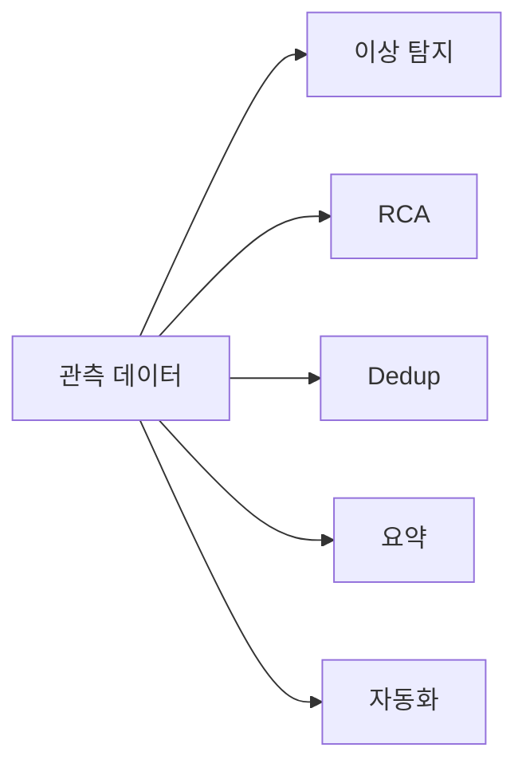
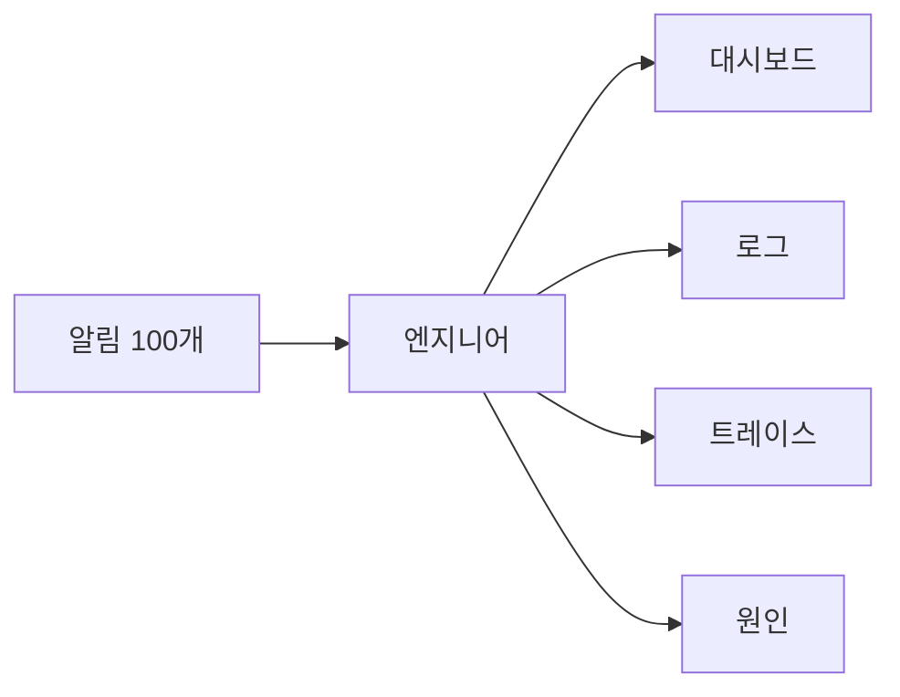
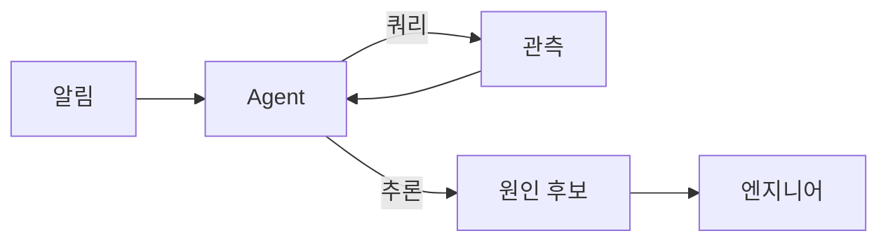

# AIOps 개요

> **2026년 AIOps의 진실**: LLM과 agent 프레임워크 덕에 RCA·이상 탐지·
> deduplication·summarization은 의미 있는 보조 도구가 됐다. 그러나
> **AIOps는 잘못 설계된 알림·대시보드의 대체가 아니다** — 노이즈를 줄이는
> 자동화 도구이지 근본 원인을 풀지 않는다. 이 글은 AIOps의 5대 활용,
> LLM·agent 시대의 변화, 글로벌 스탠다드 깊이의 함정 (hallucination·
> adversarial telemetry·prompt 의존)을 다룬다.

- **주제 경계**: 알림 설계 원칙은 [알림 설계](../alerting/alerting-design.md),
  비용은 [관측 비용](../cost/observability-cost.md), 인시던트 대응
  프로세스는 sre 카테고리. 이 글은 **AIOps 자체**.
- **선행**: [관측성 개념](../concepts/observability-concepts.md), [알림 설계](../alerting/alerting-design.md).

---

## 1. 한 줄 정의

> **AIOps**는 "ML·통계·LLM으로 관측 데이터의 패턴을 자동 분석해 운영
> 의사결정을 보조하는 도구·관행"이다.

- 약어 풀이: 2016 **Algorithmic IT Operations** → 2017 **AI for IT
  Operations** (Gartner 정의 변천)
- 2024년 이후 **LLM·agent 프레임워크**가 합류 — 단순 통계 ML에서 RCA·
  자연어 요약까지
- 라이선스 다양 — 오픈 소스(Robusta·HolmesGPT[CNCF Sandbox]·K8sGPT·
  `grafana/promql-anomaly-detection`), SaaS(Datadog Watchdog·Bits AI SRE·
  Splunk ITSI·Dynatrace Davis·NewRelic AI 등)

---

## 2. 무엇을 하나 — 5대 활용



| 활용 | 설명 |
|---|---|
| **이상 탐지 (Anomaly Detection)** | 임계값 없이 baseline에서 벗어남 감지 |
| **RCA (Root Cause Analysis)** | 알림 폭주 시 가장 윗단의 원인 후보 추론 |
| **Alert Dedup·Grouping** | 의미적 유사 알림 자동 묶음 |
| **요약·자연어 보고** | "지난 1시간 사고 요약 한 문단" — Slack·이메일 |
| **자동 조치** | runbook 자동 실행 (수직 확장·재시작·rollback) — 위험 |

---

## 3. 이상 탐지 (Anomaly Detection)

### 3.1 기존 방식 — 임계값의 한계

```yaml
# 임계값 단순
- alert: HighCPU
  expr: cpu_usage > 0.8
```

| 문제 | 설명 |
|---|---|
| 정상 변동도 fire | 트래픽 자연 증가에 fire |
| seasonal 패턴 무시 | 매주 월요일 9AM 정상 spike에 fire |
| baseline shift | 새 서비스 배포 후 baseline 영구 변화 — 임계값 재조정 필요 |

### 3.2 ML/LLM 기반

| 기법 | 사용 |
|---|---|
| **Holt-Winters / Prophet** | seasonal decomposition, 주간·일간 패턴 학습 |
| **Isolation Forest / DBSCAN** | 통계적 outlier |
| **AutoEncoder** | 다차원 메트릭의 압축·복원, 잔차로 이상 |
| **LLM zero-shot** | "이 시계열에서 이상 시점은 언제?" 자연어 질의 |
| **Topology-aware** | 의존성 그래프 + 메트릭 → AZ·service 단위 |

> **현실**: 단순 통계로 70%, LLM·복잡 ML이 추가 10%. 90%+ accuracy는
> 도메인 적응 어려움. **임계값 + 통계 anomaly 조합이 표준**, LLM은
> RCA·summarization으로 비중 ↑.

### 3.3 도구

| 도구 | 모델 |
|---|---|
| **Datadog Watchdog** | 자동 ML, threshold 없음 |
| **Splunk ITSI** | 통계 + ML |
| **Dynatrace Davis** | causal + ML |
| **Grafana Anomaly Alerts** | GA (2026-04-22, Cost Management 영역). Adaptive Traces anomaly는 Public Preview |
| **Robusta** | OSS K8s alert 강화 |
| **Anodot·Sumo Logic LogReduce** | 시계열·로그 anomaly |
| **자체 — PyOD·Prophet·Forecasting** | 직접 구현 |

---

## 4. RCA — Root Cause Analysis

### 4.1 전통 RCA의 한계



알림 100개·로그 수십만 줄·trace 1만 개를 사람이 손으로 — 30분~1시간.

### 4.2 LLM·agent 기반 RCA



| 단계 | 동작 |
|---|---|
| 1 | 알림 트리거 시 agent가 자동 발동 |
| 2 | 관련 메트릭·로그·트레이스를 자동 수집 (PromQL·LogQL·TraceQL 자동 생성) |
| 3 | LLM이 패턴·correlation 분석, **causal graph** 추론 |
| 4 | 원인 후보 N개 ranking, evidence 첨부 |
| 5 | 엔지니어에게 자연어 보고 — Slack thread, runbook 추천 |

### 4.3 도구·프레임워크

| 도구 | 모델 |
|---|---|
| **Datadog Bits AI SRE** | 2025-12 GA, 인시던트 응답·RCA 전용 agent (일반 어시스턴트 Bits AI와 분리) |
| **Splunk AI Assistant** | SPL 자동 생성·요약 |
| **PagerDuty AIOps** | incident 자동 grouping·RCA |
| **Honeycomb Query Assistant** | natural language → query |
| **OpenAI / Anthropic Claude as agent** | 사내 자체 통합 |
| **HolmesGPT** (CNCF Sandbox 2025-10) + K8sGPT | OSS K8s agentic RCA — ReAct 루프로 도구 반복 호출 |

> **현실 평가**: LLM RCA는 **시작점 후보**를 제시 — 결론은 사람이.
> 대표 사례: alert + 관련 로그 그룹·trace 정렬 + "최근 deploy 이후
> latency 증가" 같은 hypothesis. 정확도는 60~80% (도메인 의존).

---

## 5. Alert Deduplication·Grouping

### 5.1 기존 방식

| 메커니즘 | 한계 |
|---|---|
| Alertmanager `group_by: [service, alertname]` | 같은 라벨만 가능, 의미적 유사 X |
| Inhibition rule | 명시적 규칙 필요 |

### 5.2 LLM·임베딩 기반

| 기법 | 효과 |
|---|---|
| **임베딩 유사도** | description text를 vector로 → 거리 기반 grouping |
| **의미적 분류** | "DB connection pool" vs "DB query slow" 자동 묶음 |
| **시간 + 의미** | 1시간 내 발생한 의미적 유사 알림 자동 묶음 |

> **PagerDuty/Opsgenie/IRM이 native 통합**: 도구 변경 없이도 자동 grouping
> 활성 가능. 노이즈 30~60% 자동 감소 (보고된 실측).

> **한계**: 자동 grouping이 노이즈는 줄이지만 **잘못 설계된 알림 자체는
> 못 고친다** — symptom 기반·runbook 강제 같은 [알림 설계](../alerting/alerting-design.md)
> 원칙이 우선.

---

## 6. 자연어 요약·보고

| 활용 | 예 |
|---|---|
| **incident summary** | "지난 1시간 incident: checkout p99 latency 4× 증가, DB connection pool 고갈, 14:32 deploy 영향 의심" |
| **postmortem 초안** | timeline·메트릭 그래프 자동 추출, 스크립트 생성 |
| **dashboard explainer** | "이 차트의 spike는 매주 월요일 정상 패턴" |
| **runbook 자동화** | 과거 incident에서 운영 단계 추출 |
| **on-call handoff 요약** | 시프트 종료 시 "지난 12시간 활성 사고·해결 사항" |

> **2026의 일반 패턴**: SaaS는 거의 모두 자연어 incident summary 제공.
> 자체 호스팅은 OpenAI/Claude API 호출하는 작은 봇으로 흉내 가능.

---

## 7. 자동 조치 — 가장 위험한 영역

### 7.1 단계별 자동화

| 수준 | 권장 |
|---|---|
| **수직 확장 (메모리·CPU)** | 안전 — HPA·VPA 표준 |
| **재시작 (rolling restart)** | 안전, runbook 자동화 OK |
| **rollback** | 자동화 가능하나 검증 필수 — 회귀 알림 시 자동 롤백 |
| **traffic shift (region 분산)** | 위험 — 사람의 판단 |
| **중요 서비스 deploy block** | 정책 기반 OK (error budget) |
| **DB schema 변경 자동** | **금지** — 데이터 손실 위험 |

> **AIOps 자동 조치는 위험한 영역**. SLA에 직결되는 결정은 항상 사람의
> 마지막 판단. 자동화는 "조치 후보 제안 + 한 클릭 실행"이 가장 안전.

### 7.2 LLM agent의 자동 조치 함정

| 함정 | 결과 |
|---|---|
| **hallucination** | 존재하지 않는 명령어 추천, "GREAT IDEA"로 적용 → 사고 |
| **adversarial telemetry / reward hacking** | 공격자가 그럴듯한 가짜 에러·메트릭으로 agent 오인. arxiv 2508.06394 실험: prompt injection 단독은 0% 성공이나 **reward-hacking 형태(설득력 있는 fake error)는 90% 탈취** |
| **prompt injection** | 로그·메트릭에 숨긴 명령어로 agent 탈취 (단독으론 효과 적음, telemetry 결합 시 위험) |
| **권한 오남용** | agent의 K8s RBAC가 너무 광범위 |

> **OWASP Gen AI LLM Top 10 매핑**: hallucination = LLM09(Misinformation),
> prompt injection = LLM01, 권한 오남용 = LLM06(Excessive Agency).
> 보안 검토 시 OWASP 체크리스트 활용.

> **read-only / write tool 분리**: agent의 도구를 **조회 전용**(메트릭·
> 로그·트레이스 query)과 **변경 전용**(kubectl scale/restart)으로 분리해
> 별도 RBAC 부여. 변경 도구는 항상 사람 승인 게이트.

---

## 8. 도입 — 4 단계

| 단계 | 활동 |
|---|---|
| 1. **summarize** | LLM 자연어 요약만 — 위험 가장 낮음 |
| 2. **dedup·group** | 알림 자동 grouping 활성 |
| 3. **assist RCA** | agent가 hypothesis 제시, 사람이 결정 |
| 4. **auto-remediate** | 작은 범위·검증된 조치만 (재시작·HPA), 사람 승인 |

> **0번 단계가 우선**: AIOps 도입 전에 **알림 설계가 정상**이어야 한다.
> 노이즈가 70%인 환경에서 AIOps는 **노이즈를 가리는 안티패턴**이 된다.
> [알림 설계](../alerting/alerting-design.md)를 먼저.

---

## 9. 데이터·프라이버시

| 영역 | 위험 |
|---|---|
| 메트릭·로그를 외부 LLM API에 전송 | 데이터 누출 |
| PII가 로그에 — LLM이 학습 데이터로? | GDPR·HIPAA 위반 |
| 사내망 설계 외부 노출 | 보안 |
| API 비용 | 매 alert당 LLM 호출 = $$ |

| 대응 | 설명 |
|---|---|
| **on-prem LLM** | Llama·Qwen·Mistral 자체 호스팅 |
| **DLP / redaction** | 전송 전 PII 마스킹 |
| **enterprise endpoint** | Anthropic Enterprise, OpenAI Enterprise — 학습 비활용 보장 |
| **selective context** | 모든 데이터 전송 X, 관련만 |
| **audit log** | LLM 입출력 보관 — 감사 |

---

## 10. 평가 — AIOps는 효과가 있나

### 10.1 측정 KPI

| KPI | 측정 |
|---|---|
| **MTTA (Mean Time to Acknowledge)** | 호출 후 응답 시간 |
| **MTTR (Mean Time to Resolve)** | 사고 해결 시간 |
| **알림 노이즈 비율** | total alerts vs page-worthy |
| **runbook hit rate** | RCA 추천이 실제 원인이었나 |
| **false positive rate** | 자동 조치의 잘못된 사례 |

### 10.2 현실 효과

| 영역 | 보고된 효과 |
|---|---|
| 알림 grouping·dedup | 30~60% 노이즈 감소 |
| 자연어 요약 | postmortem 작성 시간 50% 절감 |
| RCA 후보 ranking | MTTR 10~30% 절감 |
| 자동 조치 | 단순 사고 80% 자동화, 복잡 사고 변화 적음 |

> **현실 평가**: AIOps는 **운영 효율 보조 도구**로 효과 있음. 그러나
> "AIOps가 SRE를 대체"는 마케팅. 사람의 판단·근본 원인 설계는 그대로.

---

## 11. 안티패턴

| 안티패턴 | 결과 | 교정 |
|---|---|---|
| 알림 설계 부실한데 AIOps로 가림 | 노이즈만 자동 묶임, 근본 원인 무시 | 알림 설계 먼저 |
| LLM 자동 조치를 critical 시스템에 | hallucination·adversarial로 사고 | "조치 제안 + 사람 승인" |
| 로그·메트릭을 모두 외부 LLM API로 | 데이터 누출, 비용 폭주 | on-prem 또는 enterprise endpoint, selective context |
| LLM 답변을 검증 없이 신뢰 | hallucination · 잘못된 PromQL | 사람 검토, evidence 첨부 강제 |
| AIOps SaaS를 ML·통계 없이 | 단순 임베딩 grouping은 이미 가능 | 도구 비교, 효과 측정 |
| RCA agent에 광범위 RBAC | 권한 오남용 위험 | least privilege, audit |
| 자동 rollback에 SLO 미반영 | 정상 deploy도 rollback | error budget 기반 |
| "AI가 말했으니 맞다"식 신뢰 | 자동화 편향 | hypothesis로만 |
| LLM 응답 시간 30s+를 알림 critical path에 | 알림 지연 | async로 보조 |
| 학습 데이터에 사내 incident 그대로 | 외부 학습 위험 | enterprise endpoint·redaction |
| AIOps ROI 측정 없이 도입 | 효과 불명 | KPI 정의·측정 |
| prompt를 git에 평문 + 비밀 키 함께 | secret 노출 | secret manager |
| 메트릭 변조에 agent 흔들림 | adversarial vulnerability | 메트릭 access·integrity 통제 |

---

## 12. 운영 체크리스트

- [ ] AIOps 도입 전 알림 설계 검토 — 노이즈 < 30% 확인
- [ ] 1단계: 자연어 요약·dedup만 활성
- [ ] LLM 자동 조치는 작은 범위(재시작·HPA)만, 사람 승인 후
- [ ] DB·schema 자동 조치 금지
- [ ] 데이터 전송 전 PII redaction
- [ ] enterprise/on-prem LLM endpoint, 학습 비활용 보장
- [ ] LLM API 비용 모니터링 + budget alert
- [ ] agent의 K8s RBAC는 least privilege
- [ ] LLM 입출력 audit log
- [ ] 자동 조치는 evidence·hypothesis로 강제
- [ ] KPI (MTTA·MTTR·노이즈·runbook hit) 추적
- [ ] hallucination·adversarial 위험 인식 — 검증 필수
- [ ] AIOps가 잘못 설계된 알림을 가리지 않는지 분기 검토

---

## 참고 자료

- [ACM CSUR — A Survey of AIOps in the Era of LLMs](https://dl.acm.org/doi/10.1145/3746635) (확인 2026-04-25)
- [Log Anomaly Detection in AIOps with LLMs (Sciencedirect)](https://www.sciencedirect.com/science/article/pii/S2667305325001346) (확인 2026-04-25)
- [Topology-Aware Active LLM Agents for Anomaly Detection](https://www.researchgate.net/publication/402763483_Breaking_the_Observability_Tax_Dynamic_Resolution_Anomaly_Detection_via_Topology-Aware_Active_LLM_Agents) (확인 2026-04-25)
- [When AIOps Become AI Oops — Adversarial Telemetry](https://arxiv.org/html/2508.06394v2) (확인 2026-04-25)
- [Datadog Watchdog](https://docs.datadoghq.com/monitors/types/anomaly/) (확인 2026-04-25)
- [PagerDuty AIOps](https://www.pagerduty.com/platform/aiops/) (확인 2026-04-25)
- [Robusta — OSS K8s observability AI](https://robusta.dev/) (확인 2026-04-25)
- [HolmesGPT — RCA Agent](https://github.com/robusta-dev/holmesgpt) (확인 2026-04-25)
- [K8sGPT — K8s Diagnose CLI](https://k8sgpt.ai/) (확인 2026-04-25)
- [Top AIOps Platforms 2026 (OpenObserve)](https://openobserve.ai/blog/top-10-aiops-platforms/) (확인 2026-04-25)
