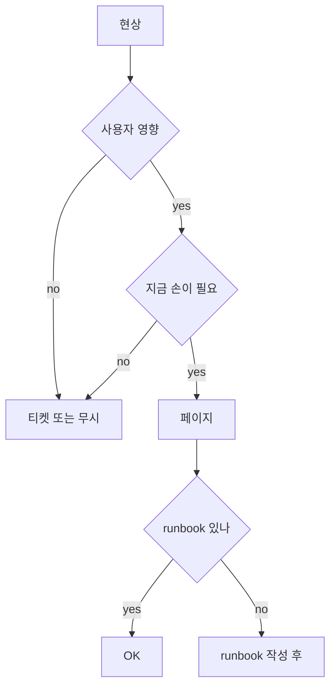
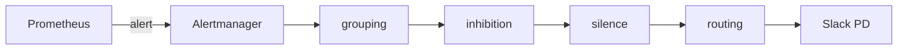

# 알림 설계·피로 감축

> **알림은 적을수록 좋다.** 좋은 알림은 "사람이 지금 무언가 해야 한다"를
> 정확히 말한다. 나쁜 알림은 "뭔가 일어났다"만 던진다. Google SRE의
> 원칙 — **증상 기반(Symptom-Based)**, **두 페이지/시프트 상한**,
> **silence·inhibition·grouping**의 3단 노이즈 감축. 2026 시점 핵심은
> 변하지 않았고, 새로운 도구(Grafana OnCall·LLM 기반 deduplication)는
> 같은 원칙을 자동화한다.

- **주제 경계**: 이 글은 **알림 설계 원칙과 노이즈 감축**을 다룬다.
  Multi-window는 [Multi-window 알림](multi-window-alerting.md), Burn rate
  기반은 [SLO 알림](slo-alerting.md), 라우팅·온콜 스케줄링 도구는
  [Grafana OnCall](grafana-oncall.md), Alertmanager 자체는
  [Alertmanager](../prometheus/alertmanager.md), SLO 룰 생성은
  [Sloth·Pyrra](../slo-as-code/slo-rule-generators.md), 인시던트 대응
  프로세스·포스트모템은 `sre/` 카테고리.
- **선행**: [관측성 개념](../concepts/observability-concepts.md), 기본
  Alertmanager.

---

## 1. 좋은 알림의 정의 (Google SRE)

> "알림은 사람이 즉시 손으로 무언가 해야 할 때만 페이지하라."

| 질문 | yes/no |
|---|---|
| 사용자가 영향받고 있는가? | 알림 가치 있음 |
| 사람이 지금 손으로 해야 하는가? | 페이지 |
| 자동으로 회복되는가? | 페이지 금지 (티켓 또는 무시) |
| 같은 일이 반복돼서 보고 싶은가? | 대시보드, 알림 아님 |
| "뭔가 이상한가" 정도? | 티켓 |

> **두 페이지/시프트 상한**: SRE Book "Being On-Call" 챕터 + Workbook
> 의 모범 (8~12시간 시프트당 ≤ 2 페이지). 그 이상이면 알림 설계 실패.

> **MTTA 침식**: 노이즈 알림이 많으면 엔지니어가 "어차피 자동 복구"라
> 학습 → 진짜 페이지의 응답 시간이 늘어남. 알림 신뢰성은 **응답 속도의
> 1차 변수**.

---

## 2. Symptom vs Cause — 가장 중요한 구분

### 2.1 정의

| 종류 | 정의 | 예 |
|---|---|---|
| **Symptom (증상)** | **사용자가 경험하는 결과** | "5xx error rate 1% 초과", "checkout latency p99 > 2s" |
| **Cause (원인)** | 기술적 내부 상태 | "DB CPU 90%", "Pod restart 3회", "queue depth 1000" |

### 2.2 왜 증상에 알림하는가

| 측면 | 증상 기반 | 원인 기반 |
|---|---|---|
| 사용자 영향과의 정합 | 정확 — 영향 있을 때만 발화 | 부정확 — 내부 회복으로 사용자 영향 없을 수 있음 |
| 알림 수 | 적음 (사용자 영향 케이스만) | 많음 (모든 내부 이상) |
| 진단 가치 | 영향만 알림 — 원인은 metric/log/trace로 | 원인 직접 — 단 영향 모름 |
| 인프라 변경 시 | 안정 (URL은 그대로) | 부서짐 (DB·서비스 구조 변경 시 룰 재작성) |

> **Google SRE의 한 줄**: "Page on symptoms, not causes." 모든 알림 설계
> 의 출발점.

### 2.3 보조 알림 — Cause-based의 자리

원인 기반 알림은 **티켓·warning** 수준에서 사용:

| 신호 | 처리 |
|---|---|
| Disk 90% | 티켓 — 24시간 내 정리 |
| 인증서 만료 30일 전 | 티켓 |
| 백업 실패 1회 | 티켓 (반복 시 페이지) |
| Replication lag 증가 | warning, 임계 시 페이지 |
| Pod CrashLoopBackOff | warning (사용자 영향 없으면) |

> **티켓·warning이 사라지면**: 일주일 모이는 자동 daily report로 정리
> 가능. 페이지로 변경되면 dispatch 즉시.

---

## 3. 알림 설계 4 단계 — 룰 작성 전 체크

### 3.1 알림 설계 결정 트리



### 3.2 알림 명세 4 항목

| 항목 | 의미 |
|---|---|
| **summary** | 한 줄 — 무슨 일이 났나 (사용자 영향 표현) |
| **description** | 상황·메트릭 값·영향 범위 |
| **runbook_url** | 어떤 단계로 진단·조치하는가 (반드시 존재) |
| **dashboard_url** | 클릭 한 번에 관련 그래프 |

```yaml
- alert: HighErrorRate
  expr: |
    sum(rate(http_requests_total{status=~"5.."}[5m])) by (service)
    /
    sum(rate(http_requests_total[5m])) by (service)
    > 0.01
  for: 5m
  labels:
    severity: page
    team: payments
  annotations:
    summary: "{{ $labels.service }} error rate above 1%"
    description: |
      {{ $labels.service }}의 5xx 비율이 5분 평균 {{ $value | humanizePercentage }}
      입니다. 사용자 요청 실패가 진행 중입니다.
    runbook_url: "https://runbooks.example.com/high-error-rate"
    dashboard_url: "https://grafana.example.com/d/service-red?var-service={{ $labels.service }}"
```

> **runbook_url 없는 알림은 발화 금지 정책**: PR 리뷰에서 차단. 신규
> 알림 = 신규 runbook 페어. 운영의 가장 큰 자산이 runbook 라이브러리.

---

## 4. 4 단계 노이즈 감축 — Alertmanager 표준

### 4.1 흐름



### 4.2 Grouping — 폭풍을 묶음

같은 사고는 한 알림으로:

```yaml
route:
  group_by: ['alertname', 'service', 'cluster']
  group_wait: 30s          # 첫 알림 모음 대기
  group_interval: 5m       # 추가 발화 대기
  repeat_interval: 4h      # resolved 안 된 채 재알림
```

| 파라미터 | 의미 |
|---|---|
| `group_by` | 묶음 단위. service·cluster·alertname이 표준 |
| `group_wait` | 첫 알림 후 30초 대기 — 같은 그룹의 다른 알림 합류 |
| `group_interval` | 그룹 활성 동안 추가 알림 묶음 주기 |
| `repeat_interval` | 같은 그룹 resolved 안 됐을 때 재발화 |

> **`group_by: [...]` 너무 좁으면 폭풍**: alertname·instance·pod로 묶으면
> 100개 pod 이상 시 100개 알림. service 단위까지 묶기.

### 4.3 Inhibition — 상위 알림이 하위 알림을 가림

```yaml
inhibit_rules:
  - source_matchers:
      - severity = page
      - alertname = ClusterDown
    target_matchers:
      - severity = warning
    equal: ['cluster']
```

| 패턴 | 효과 |
|---|---|
| 클러스터 down 시 모든 클러스터 내 warning 가림 | 진짜 알림만 노출 |
| Pod CrashLoop 페이지 시 동일 Pod의 latency warning 가림 | 원인이 알림되면 결과는 묻음 |
| Region 전면 outage 시 region 내 모든 알림 가림 | 진짜 incident commander만 호출 |

> **inhibition 안 쓰면 일어나는 일**: DB가 죽으면 50개 서비스의 모든
> RED·USE 알림이 동시에 폭발. 알림 = 사고 직후 정신없는 시간.

> **`equal:` 절의 의미**: source와 target 알림 **양쪽에 같은 라벨이 모두
> 존재하고 값이 같아야** inhibition 적용. 위 예에서 `cluster` 라벨이 두
> 알림에 다 있어야 — source(ClusterDown)에는 있고 target(warning)에 없으면
> 미작동. inhibition 미작동의 1번 원인.

### 4.4 Silence — 의도적 일시 차단

| 사용 | 시간 |
|---|---|
| 정기 점검 | 변경 시간 동안 |
| 알려진 회귀 (이미 티켓) | 수정 PR 머지까지 |
| 야간/주말 운영 안 하는 비즈니스 시간외 | 시간대 기반 |
| flapping 디버깅 중 | 단기 |

> **silence는 명시적 만료 강제**: 무한 silence 금지. 모든 silence는
> creator·reason·expiry 기재. silence를 잊고 critical 누락 = 사고.

> **정기 무음은 `time_intervals` (구 `mute_time_intervals`)**: 야간·주말
> 같은 정적 무음은 silence가 아닌 `time_intervals` 룰로 정의 — 라우팅
> 단계에서 자동 적용. silence는 ad-hoc, time_intervals는 정기.

```yaml
time_intervals:
  - name: business-hours
    time_intervals:
      - weekdays: [monday:friday]
        times: [{ start_time: '09:00', end_time: '18:00' }]
        location: 'Asia/Seoul'

route:
  routes:
    - matchers: [severity = ticket]
      mute_time_intervals: [outside-business-hours]
      receiver: jira
```

### 4.5 Routing — 적절한 채널·온콜

```yaml
route:
  receiver: default-slack
  routes:
    - matchers: [severity = page]
      receiver: pagerduty
      continue: true
    - matchers: [team = payments]
      receiver: payments-slack
    - matchers: [severity = ticket]
      receiver: jira-tickets
```

| 라우팅 키 | 사용 |
|---|---|
| `severity` | page → PagerDuty, warning → Slack, ticket → Jira |
| `continue: true` | 한 라우트가 매칭돼도 다음 룰까지 평가 — 의도 없이 두면 **다중 receiver로 알림 폭주** |
| `team` | 팀별 Slack 채널 |
| `cluster`·`region` | 지역 온콜 분기 |
| `service` | 서비스 owner 분기 |
| `business_hours` (라벨로) | 시간대별 — `time_intervals`와 함께 |

---

## 5. 알림 피로의 5 원인

| 원인 | 예 |
|---|---|
| **flaky alert** | flapping — 임계값 근처 진동 |
| **redundant** | symptoms + causes 동시 발화 |
| **unactionable** | 받아도 할 수 있는 게 없음 ("Disk 60%") |
| **for missing**| 일시 spike에 즉발화 |
| **ungrouped** | 같은 사고가 100개 알림 |

### 5.1 flapping 잡기

```yaml
- alert: HighErrorRate
  expr: rate(...) > 0.01
  for: 5m              # 5분 지속될 때만
```

> **`for:` 절은 noise 최대 감축 도구**: 임계값이 1초 짧게 넘는 spike를
> 무시. p95 latency 알림은 보통 `for: 5m~15m`. SLO burn rate 알림은
> [Multi-window 알림](multi-window-alerting.md)이 더 강력.

### 5.2 `keep_firing_for` — 모던 해법 (Prometheus 2.42+)

```yaml
- alert: HighErrorRate
  expr: rate(...) > 0.01
  for: 5m
  keep_firing_for: 15m   # 임계값 회복해도 15분 firing 유지
  labels: { severity: page }
```

| 절 | 의미 |
|---|---|
| `for` | 발화 지연 — spike 차단 |
| `keep_firing_for` | **resolve 지연** — 임계 회복 후에도 N분 firing 유지 → flap·false resolution 차단 |

> **`keep_firing_for`가 hysteresis의 표준**: 이전엔 PromQL로 `last_over_time`
> 등 복잡한 표현으로 hysteresis를 흉내냈으나 정확하지 않았다. 2.42+에서는
> `keep_firing_for`로 깔끔히 해결.

> **PagerDuty incident dedup**: hysteresis가 없으면 임계 진동마다 incident
> 생성·해제 반복으로 페이지 폭주. `keep_firing_for: 15m` 권장.

---

## 6. Watchdog — 알림 시스템 자체가 죽으면

> "조용한 alertmanager는 행복한 alertmanager가 아니다."

알림 시스템 자체(Prometheus·Alertmanager·웹훅 게이트웨이)가 다운되면
**아무 알림도 안 온다 = 모든 게 정상으로 보임**. 이 silent failure를
잡는 표준 패턴이 **Watchdog**(또는 Dead Man's Switch).

```yaml
- alert: Watchdog
  expr: vector(1)        # 항상 1 — 무조건 firing
  labels:
    severity: none       # 라우팅에서만 처리, 사람에게는 안 감
  annotations:
    summary: "Watchdog 알림 — 항상 fire"
```

| 컴포넌트 | 역할 |
|---|---|
| Watchdog 룰 | Prometheus가 항상 firing alert 1개 emit |
| Alertmanager 라우팅 | Watchdog만 외부 heartbeat 서비스로 |
| **PagerDuty/Opsgenie Heartbeat** | 5분간 heartbeat 미수신 → 별도 incident 생성 |
| Dead Man's Snitch (서드파티) | 같은 패턴, 작은 회사용 |

> **이중 안전망**: 알림 파이프라인 어디가 끊어져도 Heartbeat 서비스가
> 침묵을 감지해 페이지. Prometheus Operator의 `kube-prometheus-stack`
> 룰에 기본 포함.

> **메트릭 사라짐 (no-data)**: 다른 종류의 silent failure — 메트릭 자체가
> 안 들어옴. `absent(up{job="checkout"})` 또는 `absent_over_time(...[10m])`로
> 알림.

---

## 7. severity 모델 — 표준 4단

| severity | 액션 |
|---|---|
| **critical / page** | 즉시 호출 (PagerDuty), SLA에 직결 |
| **warning** | Slack 알림, 시간 내 해결 (티켓 변환 가능) |
| **ticket** | Jira·issue 자동 생성, 24h~72h 처리 |
| **info** | 대시보드만, 알림 X |

> **severity는 라벨 표준화**: alert rule 작성자가 무작위로 정하면
> 라우팅·inhibition 룰 의미 없음. PR template에 `severity: page` 강제,
> 명시 안 하면 lint fail.

### 7.1 페이지 자격 5 원칙 (Google SRE)

1. 사용자 영향 또는 SLO 위반 임박
2. 자동 복구 안 됨
3. 사람의 즉각 조치 필요
4. runbook 존재
5. 시프트당 ≤ 2 발생

---

## 8. on-call 운영 — 알림 설계의 시작점

알림 설계는 결국 **on-call 사람의 부담** 측정. 좋은 룰:

| 측정 | 목표 |
|---|---|
| **시프트당 페이지** | ≤ 2 |
| **MTTA (acknowledge)** | < 5분 |
| **잘못된 알림 (false positive)** | < 5% |
| **runbook hit rate** | > 80% (페이지 시 runbook이 실제 도움) |
| **자동 복구 알림 비율** | < 10% |

> **on-call retro**: 매주 시프트 끝나면 받은 페이지를 리뷰. 노이즈 알림
> = 즉시 PR로 룰 수정. 노이즈를 방치하면 누적.

자세한 on-call 프로세스는 sre 카테고리, 도구는 [Grafana OnCall](grafana-oncall.md).

---

## 9. 60~80% 알림이 noise — 분류 표준

| 종류 | 비율 (전형적) | 처리 |
|---|---|---|
| **자동 복구 transient** | 30~40% | `for:` 늘림 또는 룰 제거 |
| **중복 (한 사고의 다중 알림)** | 20~30% | grouping·inhibition |
| **unactionable** | 10~20% | 룰 제거, 대시보드로 |
| **진짜 알림 (페이지 자격)** | 20~40% | 그대로 |

> **목표**: 노이즈를 줄이면 진짜 알림 비율이 70%+. 60% 미만이면 룰
> 청소가 필요.

---

## 10. LLM·AIOps 기반 노이즈 감축 (2026)

| 기능 | 설명 |
|---|---|
| **자동 grouping** | 의미적 유사 알림 묶음 — service·label만이 아닌 description embedding |
| **자동 silence 제안** | flapping 알림을 학습해 silence 권장 |
| **runbook 자동 생성** | 과거 incident에서 운영 단계 추출 |
| **summarization** | 알림 폭풍을 한 문장 요약으로 — Slack에 |
| **anomaly detection** | 임계값 없이 baseline에서 벗어남 감지 |

> **현실 평가**: AIOps는 **alert 노이즈를 줄이는 보조 도구**로 가치 있음.
> 그러나 **잘못 설계된 알림을 자동 grouping으로 가리는 건 안티패턴** —
> 근본 원인을 알림 설계에서 풀어야 한다 ([AIOps 개요](../aiops/aiops-overview.md)).

---

## 11. 안티패턴

| 안티패턴 | 결과 | 교정 |
|---|---|---|
| 모든 metric에 알림 | 노이즈 폭증 | symptom + actionable만 |
| Disk 60%·CPU 70%에 페이지 | unactionable | 90%·디스크 풀 위협 시만 |
| `for:` 없이 즉시 발화 | spike noise | `for: 5m+` |
| runbook 없는 페이지 | 새벽 3시에 막막 | runbook 강제 |
| `severity` 미명시 | routing 깨짐 | label lint |
| `group_by: [alertname, instance]` | pod 단위 폭풍 | service 단위 |
| inhibition 미사용 | 상위 사고 시 100개 알림 | severity·cluster 기반 |
| 영구 silence | critical 영구 차단 | 만료 강제 |
| paging team이 너무 broad | 모르는 팀 호출 | service owner 라벨 기반 |
| same event를 여러 룰에서 | 중복 | 한 룰 |
| symptom + cause 동시 페이지 | 중복 + 진단 혼란 | symptom만 페이지, cause는 warning |
| `repeat_interval` 너무 짧음 | resolved 안 된 사고 5분마다 알림 | 4~12h |
| Email로만 critical 알림 | 새벽에 못 봄 | PagerDuty + SMS |
| flapping 계속 무시 | 진짜 알림 trust 저하 | 즉각 룰 수정 |
| dashboard에 알림 안 보임 | 운영자가 상황 모름 | annotation·overlay |
| Watchdog/heartbeat 없음 | 알림 시스템 다운 = 침묵 = 사고 | 항상 firing alert + Heartbeat 서비스 |
| flapping에 PromQL hysteresis 어설프게 | 의도대로 안 동작 | `keep_firing_for` (2.42+) |
| 메트릭 사라짐(no-data) 미감지 | exporter·scrape 다운 silent | `absent_over_time(...[10m])` |
| `continue: true`를 모든 라우트에 | 다중 receiver로 알림 폭주 | 의도된 multi-channel만 |
| 정기 야간 silence를 매번 수동 | silence 만료 누락 risk | `time_intervals` 라우팅 |
| inhibition `equal:` 라벨이 source/target 한쪽만 | inhibition 미작동 | 양쪽 라벨 일치 검증 |

---

## 12. 운영 체크리스트

- [ ] 모든 page는 symptom 기반 (사용자 영향)
- [ ] 모든 page는 runbook URL 존재
- [ ] severity 4단(page·warning·ticket·info) 라벨 표준
- [ ] `for:` 절 모든 룰에 — spike 차단
- [ ] grouping: `service`·`cluster` 단위, 너무 좁게 안 함
- [ ] inhibition rule — 상위 알림이 하위 가림
- [ ] silence는 만료 시간 강제
- [ ] 시프트당 페이지 ≤ 2 monitoring
- [ ] MTTA·false positive·runbook hit rate KPI 추적
- [ ] on-call 후 weekly retro로 노이즈 룰 청소
- [ ] paging이 service owner team에게 정확히 라우팅
- [ ] 룰 PR 시 lint (`amtool check-config`, `promtool check rules`)
- [ ] 알림 dashboard로 활성·해결률 모니터링
- [ ] 분기 1회 룰 audit — 90일 발화 0회는 검토
- [ ] AIOps deduplication은 보조, 근본 원인은 룰 수정
- [ ] Watchdog 알림 + 외부 Heartbeat (PD/Opsgenie) 이중 안전망
- [ ] hysteresis는 `keep_firing_for` (2.42+) 사용
- [ ] 메트릭 사라짐 감지 — `absent_over_time` 룰
- [ ] 정기 무음은 `time_intervals`, ad-hoc은 silence
- [ ] inhibition `equal:` 라벨 양쪽 일치 검증
- [ ] `continue: true`는 의도된 multi-channel에만

---

## 참고 자료

- [Google SRE Book — Monitoring Distributed Systems](https://sre.google/sre-book/monitoring-distributed-systems/) (확인 2026-04-25)
- [Google SRE Workbook — Alerting on SLOs](https://sre.google/workbook/alerting-on-slos/) (확인 2026-04-25)
- [Google Cloud Blog — Why Focus on Symptoms, Not Causes](https://cloud.google.com/blog/topics/developers-practitioners/why-focus-symptoms-not-causes) (확인 2026-04-25)
- [Prometheus Alertmanager 공식 문서](https://prometheus.io/docs/alerting/latest/alertmanager/) (확인 2026-04-25)
- [Alertmanager Configuration](https://prometheus.io/docs/alerting/latest/configuration/) (확인 2026-04-25)
- [New Relic — 5 Common Sources of Alert Fatigue](https://newrelic.com/blog/best-practices/alert-fatigue-sources) (확인 2026-04-25)
- [Better Stack — Solving Noisy Alerts](https://betterstack.com/community/guides/monitoring/best-practices-alert-fatigue/) (확인 2026-04-25)
- [Practical Framework to Reduce Alert Noise (drdroid)](https://notes.drdroid.io/a-practical-framework-to-reduce-alert-noise-without-missing-incidents) (확인 2026-04-25)
- [Atlassian — Alert Fatigue](https://www.atlassian.com/incident-management/on-call/alert-fatigue) (확인 2026-04-25)
