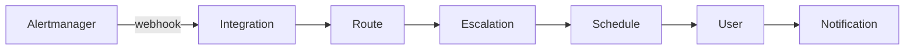
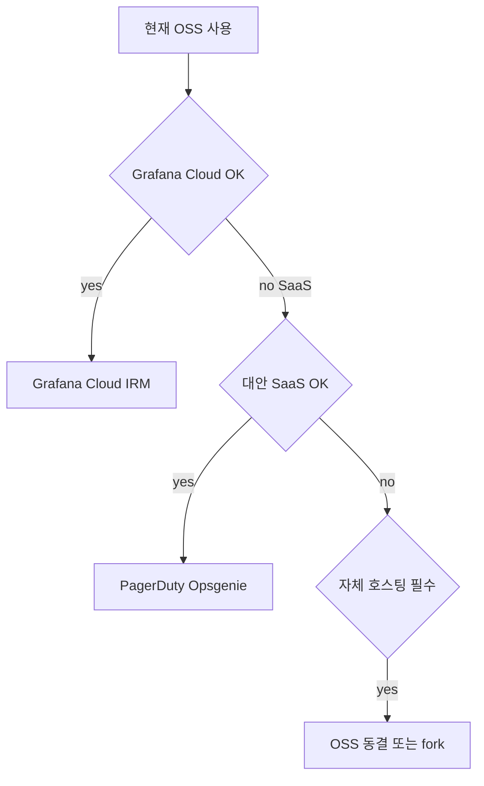
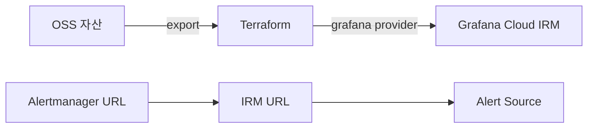

# Grafana OnCall

> **2026-03-24, OSS는 archived.** 알림 라우팅·온콜 스케줄링·escalation
> chain의 OSS 표준이었던 Grafana OnCall은 2025-03-11 maintenance 모드,
> 2026-03-24 archived. 활성 개발은 **Grafana Cloud IRM**(Incident Response
> & Management)으로 통합. 이 글은 (1) 핵심 개념, (2) OSS 운영 중인 환경의
> 마이그레이션 경로, (3) 자체 호스팅 대안을 다룬다.

- **주제 경계**: 알림 설계 원칙은 [알림 설계](alerting-design.md), burn
  rate 알림은 [SLO 알림](slo-alerting.md)·[Multi-window 알림](multi-window-alerting.md),
  Alertmanager 자체는 [Alertmanager](../prometheus/alertmanager.md), 인시던트
  대응 프로세스·포스트모템은 sre 카테고리. 이 글은 **온콜 도구 자체**.
- **선행**: [알림 설계](alerting-design.md), 기본 Alertmanager.

---

## 1. 한 줄 정의

> **Grafana OnCall**은 "알림을 사람·교대·escalation 정책에 따라 라우팅
> 하는 온콜 관리 도구"다.

- Alertmanager·webhook·다수 SaaS의 알림을 수신
- escalation chain·schedule·notification 정책에 따라 라우팅
- 라이선스 AGPLv3 (OSS) — **2026-03-24 archived**, 활성 개발은 **Grafana
  Cloud IRM**

---

## 2. 2025-2026 라이프사이클

| 시점 | 사건 |
|---|---|
| 2021 | Grafana OnCall 출시 (Amixr 인수 기반) |
| 2023 | Cloud + OSS 병행 |
| **2025-03-11** | **OSS maintenance 모드** — 신기능 중단, critical bug·CVE만 |
| 2025-Q4 | Grafana Cloud IRM 발표 (OnCall + Incident + SIRM 통합) |
| **2026-03-24** | **OSS archived** — 저장소 read-only, **Cloud Connection·SMS·voice·모바일 push 동시 정지** |

> **escalation chain의 핵심 채널 손실**: SMS·voice·모바일 push가 끊기면
> escalation 2~3단계(폰콜·문자)가 사실상 작동 불능. 1차(Slack)에서 막히면
> 호출 도달 안 됨. **2026-03-24 이전에 Cloud IRM 또는 SaaS 마이그레이션
> 미완료된 환경은 즉시 행동 필요**.

> **운영 결정**: 신규 도입은 OSS 금지. **Grafana Cloud IRM**, **PagerDuty/
> Opsgenie 같은 SaaS**, 또는 **자체 호스팅 OSS 대안**(아래 §6) 중 선택.

> **Opsgenie도 EOL**: Atlassian이 2025-04에 Opsgenie의 **2027-04-05 EOL**을
> 공식 발표, Jira Service Management(JSM)로 통합. Opsgenie를 새 마이그
> 레이션 대상으로 선택하면 1년 안에 다시 마이그레이션 필요.

---

## 3. 핵심 개념 — 도구 무관 공통



| 개념 | 역할 |
|---|---|
| **Integration** | 알림 수신 endpoint — Alertmanager·webhook·datadog·sentry 등 별 |
| **Route** | 라벨·payload 기반 분기 — `severity = page` → escalation chain A |
| **Escalation Chain** | 단계별 호출 — 1차 5분 무응답 시 2차, 그래도 안 받으면 3차 |
| **Schedule** | 누가 언제 on-call인가 — rotation·shift·timezone |
| **Notification Rule** | 사용자별 채널 우선순위 — Slack 1차, SMS 2차, Phone 3차 |
| **Acknowledge / Resolve** | 호출 응답 / 사고 종료 |

> **PagerDuty·Opsgenie·Grafana OnCall은 동일 모델**: 이름만 다르다.
> 도구 선택은 **integrations 풍부도·UX·가격·escalation 정밀도**.

---

## 4. Escalation Chain — 단계 설계

### 4.1 표준 패턴

| 단계 | 시간 | 채널 |
|---|---|---|
| 1 | 즉시 | primary on-call의 Slack + push |
| 2 | 5분 무응답 | primary on-call의 SMS + Phone |
| 3 | 15분 무응답 | secondary on-call의 모든 채널 |
| 4 | 30분 무응답 | manager 호출 |
| 5 | 1시간 무응답 | incident commander 호출 |

**Acknowledge Timeout**: ack 후에도 진척 없으면 **30분 후 escalation
재개**가 표준. 졸음 ack·오인 ack 방지의 핵심.

### 4.2 severity별 다른 chain

| severity | chain |
|---|---|
| `page` (critical) | 위 표준 5단계 |
| `warning` | Slack 알림만, 비즈니스 시간 manager 호출 |
| `ticket` | Jira 자동 생성, 24h 후 미해결 시 escalation |
| `info` | 채널만 |

> **escalation 자체가 알림 피로 원인**: 너무 빠른 escalation은 잠든 사람
> 깨우는 빈도가 높다. **5분 1차 → 15분 secondary**가 SRE 표준 (Workbook
> "Being on-call").

---

## 5. Schedule — rotation·shift 설계

### 5.1 기본 패턴

| 패턴 | 설명 |
|---|---|
| **weekly rotation** | 일주일씩 — 가장 흔함 |
| **follow-the-sun** | 지역별 8시간 — 글로벌 팀 |
| **primary + secondary** | 항상 두 명 on-call (백업) |
| **business hours only** | 9-6 시간만 page, 외에는 ticket |
| **override** | 휴가·사정으로 임시 교대 |

### 5.2 fairness 원칙

- **shift 길이 ≤ 1주**: 일주일 이상은 burnout
- **휴식 보장**: 주말 시프트 다음 주는 평일 시프트 금지
- **rotation 간격 ≥ 2주**: 같은 사람이 매주 page 받지 않게
- **rotation 자동화**: 손으로 매번 생성 안 함, ical·terraform

> **healthy on-call rotation의 KPI**: 시프트당 페이지 ≤ 2 ([알림 설계 §1](alerting-design.md#1-좋은-알림의-정의-google-sre)),
> 인당 시프트 빈도 ≥ 4주 1회, 시프트 후 weekly retro로 노이즈 청소.

---

## 6. OSS archived 이후 — 4 가지 선택지

### 6.1 결정 트리



### 6.2 옵션별 비교

| 옵션 | 모델 | on-prem | EOL/위험 | 강점 |
|---|---|---|---|---|
| **Grafana Cloud IRM** | SaaS | 불가 | 활성 개발 | OnCall+Incident+SIRM 통합, Grafana 생태계 |
| **PagerDuty** | SaaS | 불가 | 활성 — 시장 리더 | integration 가장 풍부, Process Automation |
| **Opsgenie** | SaaS (Atlassian) | 불가 | **2027-04-05 EOL → JSM 통합** | Jira 연동, 가격 |
| **Squadcast** | SaaS | 불가 | 활성 | 작은 팀 친화, 합리적 가격 |
| **incident.io** | SaaS | 불가 | 활성 — 신생 | Slack 중심, modern UX |
| **FireHydrant** | SaaS | 불가 | 활성 | 인시던트 라이프사이클 강함 |
| **JSM (Jira Service Management)** | SaaS | DC 옵션 | Atlassian 표준 | Opsgenie 수렴 destination |
| **OSS OnCall fork (자체)** | 자체 | 가능 | 보안·integration 유지 부담 | 비용 0, 통제 |

> **"순수 OSS + on-prem"이 진짜 요건이면**: Grafana OnCall OSS의 자리를
> 1:1 대체하는 활성 OSS는 2026 시점 거의 없다. **Alertmanager + Slack
> webhook + 자체 schedule 스크립트** 조합으로 escalation을 흉내내거나,
> on-prem이 가능한 SaaS hybrid (예: JSM Data Center)로 가는 것이 표준.

### 6.3 마이그레이션 경로 — Cloud IRM



| 단계 | 활동 |
|---|---|
| 1 | OSS 자산 (integration·route·escalation·schedule) 문서화 |
| 2 | Terraform `grafana` provider로 IRM 리소스 정의 |
| 3 | IRM에서 알림 수신 URL 발급 |
| 4 | Alertmanager·기타 알림 source의 webhook URL 갱신 |
| 5 | **2~4주 dual-routing** — 야간·주말 시프트 1~2 사이클을 검증해야 안전 |
| 6 | 검증 후 OSS shutdown |

---

## 7. Alertmanager 통합 — webhook receiver 표준

### 7.1 Alertmanager 측

```yaml
receivers:
  - name: oncall-webhook
    webhook_configs:
      - url: "https://your-oncall.example.com/integrations/v1/alertmanager/<token>/"
        send_resolved: true

route:
  receiver: oncall-webhook
  routes:
    - matchers: [severity = page]
      receiver: oncall-webhook
      continue: true
```

### 7.2 OnCall(IRM) 측

| 설정 | 의미 |
|---|---|
| **Integration: Alertmanager** | webhook URL 발급, 자동 grouping_key |
| **Routing template** | Jinja로 alert payload 분기 (`{{ payload.labels.severity }} == "page"`) |
| **Escalation Chain** | 위 §4 |
| **Schedule** | 위 §5 |

---

## 8. Alertmanager만으로 + escalation? — 한계

순수 Alertmanager는 **routing + grouping + inhibition + silence**까지.
**escalation chain·schedule·acknowledge 메커니즘은 없다**.

| 기능 | Alertmanager | OnCall/PagerDuty |
|---|---|---|
| routing | ✓ | ✓ |
| grouping | ✓ | ✓ (자체 또는 외부) |
| inhibition | ✓ | 부분 |
| silence | ✓ | ✓ |
| **escalation chain** | ✗ | ✓ |
| **schedule rotation** | ✗ | ✓ |
| **acknowledge** | ✗ | ✓ |
| mobile app·push | ✗ | ✓ |
| SMS/phone | ✗ | ✓ |

> **결론**: 작은 팀·단일 on-call이면 Alertmanager + Slack webhook만으로도
> 가능. 그러나 escalation·schedule이 필요한 순간 별도 도구 필요.

---

## 9. 보안

| 영역 | 권장 |
|---|---|
| webhook URL | secret 취급 — git에 직접 X, vault·external-secrets |
| OSS 외부 노출 | OAuth proxy + IP 제한 |
| Slack/Teams app token | 별도 vault, 회전 |
| API key (Cloud IRM) | `grafana_api_key` Terraform 또는 `external-secrets` |
| audit log | 누가 silence·escalation override 했는지 |
| RBAC | 팀별 schedule·escalation 분리 |
| **SSO·SCIM** | 엔터프라이즈는 OIDC + SCIM (Okta·Entra) 필수. 사용자 lifecycle 자동 |

---

## 10. 안티패턴

| 안티패턴 | 결과 | 교정 |
|---|---|---|
| OSS 신규 도입 (2026 이후) | 곧 archived | Cloud IRM·PagerDuty |
| escalation 1단계만 (primary 무응답 = 끝) | 사고 누락 | 최소 2~3단계 |
| 2분 escalation | 응답 시간 부족, 잠 깨우기만 | 5~10분 1차 |
| 모든 알림에 같은 chain | low-severity도 phone 호출 | severity별 분기 |
| schedule 1인 365일 | burnout | rotation 강제 |
| schedule override 영구 | 책임 분산 | 만료 시간 |
| webhook URL 코드 커밋 | secret 노출 | vault |
| acknowledge 강제 안 함 | 진짜 응답인지 모호 | acknowledge ≠ resolve |
| 자동 resolve 없음 | resolved alert이 계속 fire | Alertmanager `send_resolved: true` + OnCall 자동 처리 |
| Cloud IRM 마이그레이션 미루기 | 2026-04 이후 SMS·Phone 손실 | 즉시 Terraform 마이그레이션 |
| escalation에 매니저 마지막 단계 | 매니저 burnout | incident commander roster |
| weekly retro 없이 on-call 끝 | 노이즈 룰 누적 | 매주 review |

---

## 11. 운영 체크리스트

- [ ] 신규 도입은 Cloud IRM 또는 SaaS — OSS 금지
- [ ] OSS 운영 중이면 2026 Q2 안에 마이그레이션 plan
- [ ] escalation chain ≥ 3단계 (primary → secondary → manager)
- [ ] 1차 응답 시간 5~10분, 모든 단계 timeout 명시
- [ ] schedule rotation 자동화 (Terraform·ical)
- [ ] shift 길이 ≤ 1주, 휴식 보장
- [ ] severity별 다른 chain (page·warning·ticket·info)
- [ ] webhook URL은 secret으로 관리
- [ ] acknowledge·resolve 구분, 자동 resolve 활성
- [ ] schedule override는 만료 시간 강제
- [ ] weekly on-call retro로 노이즈 룰 청소
- [ ] runbook URL은 모든 알림에서 클릭 가능
- [ ] 모바일 push·SMS·phone 채널 백업 — escalation의 의미

---

## 참고 자료

- [Grafana OnCall OSS 공식 문서](https://grafana.com/docs/oncall/latest/) (확인 2026-04-25)
- [OnCall OSS Maintenance 공지](https://grafana.com/blog/grafana-oncall-maintenance-mode/) (확인 2026-04-25)
- [OSS → Cloud IRM 마이그레이션 가이드](https://grafana.com/docs/grafana-cloud/alerting-and-irm/irm/set-up/migrate/oncall-oss/) (확인 2026-04-25)
- [Grafana Cloud IRM](https://grafana.com/products/cloud/irm/) (확인 2026-04-25)
- [Grafana OnCall GitHub (archived)](https://github.com/grafana/oncall) (확인 2026-04-25)
- [Google SRE Workbook — Being On-Call](https://sre.google/workbook/on-call/) (확인 2026-04-25)
- [Atlassian — On-Call Best Practices](https://www.atlassian.com/incident-management/on-call) (확인 2026-04-25)
- [PagerDuty — On-Call 배경](https://www.pagerduty.com/resources/learn/on-call-best-practices/) (확인 2026-04-25)
