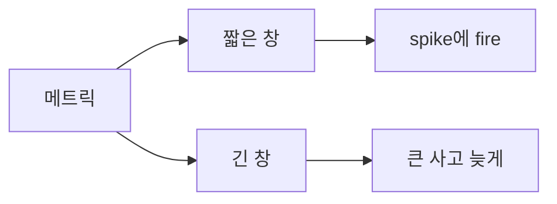
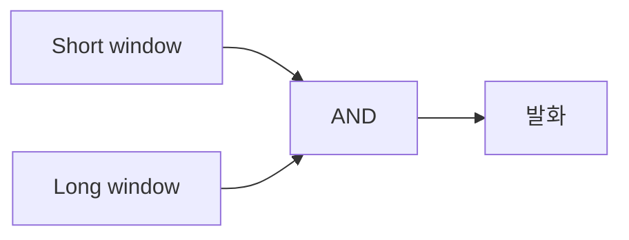
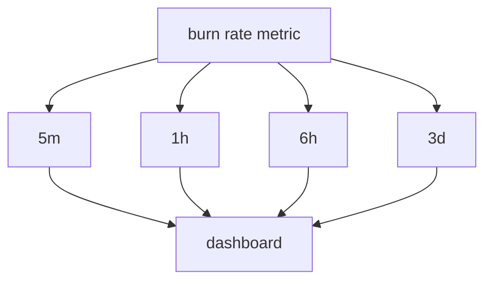
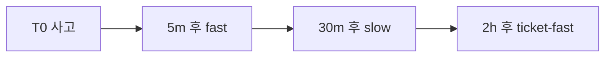

# Multi-window 알림

> **단일 창 알림은 둘 중 하나가 깨진다 — 너무 느리거나 너무 시끄럽거나.**
> 짧은 창은 spike에 흔들리고, 긴 창은 큰 사고를 늦게 잡는다. Google SRE
> Workbook의 답은 **두 창을 AND로 조합**한 multi-window-multi-burn-rate.
> 짧은 창이 "지금 진짜 문제다"를 확인하고, 긴 창이 "노이즈가 아니다"를
> 보증한다. burn rate 기반 SLO 알림의 사실상 표준.

- **주제 경계**: 일반 알림 설계는 [알림 설계](alerting-design.md), SLO
  burn rate 수식·운영은 [SLO 알림](slo-alerting.md), 룰 자동 생성은
  [Sloth·Pyrra](../slo-as-code/slo-rule-generators.md), Alertmanager
  자체는 [Alertmanager](../prometheus/alertmanager.md), 표준 명세는
  [OpenSLO](../slo-as-code/openslo.md).
- **선행**: [SLO 알림](slo-alerting.md)의 burn rate 정의 권장.

---

## 1. 단일 창의 두 가지 실패



| 창 | 장점 | 단점 |
|---|---|---|
| **짧은 (예: 5m)** | 빠른 감지 | spike·잡음에 false positive |
| **긴 (예: 6h)** | 안정 — 노이즈 없음 | 큰 사고도 6시간 후 |

**Multi-window**: 두 창을 AND로 묶어서 둘 다 만족할 때만 발화 — 빠른
감지 + 안정성 동시.

---

## 2. burn rate 복습

> **burn rate** = 현재 에러 비율 ÷ SLO가 허용하는 에러 비율.

| 의미 | 예 |
|---|---|
| burn rate 1× | SLO 정확히 소진 — 28일 window면 28일에 budget 0 |
| burn rate 14.4× | 28일 budget을 **2일에 다 씀** |
| burn rate 6× | 28일 budget을 **5일에 다 씀** |
| burn rate 0× | error 0 — budget 그대로 |

수식·운영 자세히는 [SLO 알림](slo-alerting.md).

---

## 3. Google SRE Workbook 표준 — 4단 알림

| 알림 | severity | short window | long window | burn rate | budget 소진 시간 |
|---|---|---|---|---|---|
| **page-fast** | critical | 5m | 1h | **14.4×** | 약 2일 |
| **page-slow** | critical | 30m | 6h | **6×** | 약 5일 |
| **ticket-fast** | warning | 2h | 1d | **3×** | 약 10일 |
| **ticket-slow** | warning | 6h | 3d | **1×** | window 전체 (28d) |

> **표준 vs 구현체**: SRE Workbook 표 5.6의 정전(canonical)은 14.4·6·1
> (3단). Sloth·Pyrra 등 도구는 ticket을 더 세분화해 4단(14.4·6·3·1) 구현.

> **burn rate 숫자 도출**: 28일 SLO window 기준,
> `burn_rate = window_duration / target_consume_time`.
> 14.4 ≈ 28/2(2일 소진), 6 ≈ 28/5, 3 ≈ 28/10, 1 = 28/28.
> 7일 또는 90일 SLO window에 적용 시 비례로 재계산.

### 3.1 왜 두 창의 AND인가



| 시나리오 | short만 | long만 | 두 창 AND |
|---|---|---|---|
| 5분간 100% 에러 후 회복 | fire (1시간) | 계산상 fire 안 됨 | **fire 안 됨** ✓ |
| 1시간 지속 7% 에러 | fire (5분 평균 7% > 14.4×0.001) | fire (~12분 차에 1h 평균이 임계 도달) | **~12분에 AND 만족 → fire** ✓ |
| 영구적 0.5% 에러 | fire 안 됨 | fire 안 됨 | fire 안 됨 ✓ (page 자격 X) |
| 6시간 지속 1% 에러 | fire (5분) | 6시간 평균 1% — fire 안 됨 | fire 안 됨, 그러나 **30m+6h 룰**이 잡음 |

> **순수 long window의 단점**: 사고가 끝나도 "긴 창에서 평균 burn"이 한참
> 남아 알림이 늦게 resolved. 짧은 창이 "지금은 정상"을 확인 → 빠른
> resolved.

---

## 4. PromQL 구현 — Page-Fast

```yaml
- alert: HighErrorBudgetBurn-PageFast
  expr: |
    (
      job:slo_errors_per_request:ratio_rate5m{service="checkout"} > (14.4 * 0.001)
      and
      job:slo_errors_per_request:ratio_rate1h{service="checkout"} > (14.4 * 0.001)
    )
  for: 2m
  labels:
    severity: page
    long_window: "1h"
    short_window: "5m"
  annotations:
    summary: "{{ $labels.service }} fast burn (14.4x)"
    description: |
      Error rate 5m·1h 모두 14.4× burn rate 초과. SLO 99.9% target.
      예상 budget 소진: 2일 이내. 즉시 조치 필요.
    runbook_url: "https://runbooks.example.com/slo-burn"
```

| 부분 | 설명 |
|---|---|
| `job:...:ratio_rate5m` | recording rule로 미리 계산된 5분 error 비율 |
| `> 14.4 * 0.001` | SLO 99.9% (= 0.1% error budget)의 14.4배 |
| `and` | 두 창 동시 만족 |
| `for: 2m` | 두 창 모두 2분 지속 후 발화 — flap 방지. SRE Workbook canonical은 `for: 1m`이고 본 글의 2m은 flap 보수화 변형 |

> **recording rule 우선**: rolling window 비율은 매번 raw 시계열 합산이
> 비싸다. **base rate를 recording rule로** 미리 만들어 두고 알림 룰에서
> 참조. Sloth·Pyrra가 자동 생성.

### 4.1 4단 모두 한 SLO에

```yaml
groups:
  - name: slo-checkout
    rules:
      # recording — burn rate
      - record: job:slo_errors_per_request:ratio_rate5m
        expr: |
          sum(rate(http_requests_total{service="checkout",code=~"5.."}[5m]))
          /
          sum(rate(http_requests_total{service="checkout"}[5m]))
      # ... rate30m, rate1h, rate2h, rate6h, rate1d, rate3d 동일

      # alert — page-fast (14.4×)
      - alert: SLOBurnPageFast
        expr: |
          job:slo_errors_per_request:ratio_rate5m > (14.4 * 0.001)
          and job:slo_errors_per_request:ratio_rate1h > (14.4 * 0.001)
        for: 2m
        labels: { severity: page }

      # alert — page-slow (6×)
      - alert: SLOBurnPageSlow
        expr: |
          job:slo_errors_per_request:ratio_rate30m > (6 * 0.001)
          and job:slo_errors_per_request:ratio_rate6h > (6 * 0.001)
        for: 15m
        labels: { severity: page }

      # alert — ticket-fast (3×)
      - alert: SLOBurnTicketFast
        expr: |
          job:slo_errors_per_request:ratio_rate2h > (3 * 0.001)
          and job:slo_errors_per_request:ratio_rate1d > (3 * 0.001)
        for: 1h
        labels: { severity: ticket }

      # alert — ticket-slow (1×)
      - alert: SLOBurnTicketSlow
        expr: |
          job:slo_errors_per_request:ratio_rate6h > (1 * 0.001)
          and job:slo_errors_per_request:ratio_rate3d > (1 * 0.001)
        for: 3h
        labels: { severity: ticket }
```

> **SLO target 변경 시 14.4·6·3·1 그대로**: burn rate 계수는 SLO 무관.
> error budget(`1 - target`)만 바뀜. 99.9% → 99.95%면 곱 수 그대로,
> 임계값(`0.001` → `0.0005`)만 변경.

---

## 5. window 선정 — burn rate vs 시간

| 목표 budget 소진 시간 | burn rate | 권장 window 조합 |
|---|---|---|
| 1시간 (catastrophic) | 720× (28d/1h, 실험적) | 1m + 5m (실험적) |
| 2일 | **14.4×** | 5m + 1h ← page-fast |
| 5일 | **6×** | 30m + 6h ← page-slow |
| 10일 | **3×** | 2h + 1d ← ticket-fast |
| 30일 (window 끝) | **1×** | 6h + 3d ← ticket-slow |

> **window 비율의 황금률**: short window는 long window의 **1/12**가
> 표준. 5m/1h, 30m/6h, 2h/1d, 6h/3d 모두 1:12. 너무 좁으면 spike,
> 너무 넓으면 confirmation 의미 없음.

---

## 6. for: vs 두 창 — 무엇을 어떻게 결합

| 메커니즘 | 효과 |
|---|---|
| `for:` only | 한 창 + 지속 시간 — spike만 차단, 큰 사고도 같은 시간 늦어짐 |
| Multi-window only | 빠른 감지 + 노이즈 차단 — but spike에 한 번 발화 가능 |
| **Multi-window + 짧은 `for:`** | **둘의 조합 — 표준** |

```yaml
# 표준 패턴
expr: short_burn AND long_burn
for: 2m   # 또는 burn rate에 따라 0~5m
```

> `for:` 절은 **multi-window보다 짧게**. 보통 page-fast는 2m, page-slow는
> 15m, ticket은 1h+. for가 너무 길면 multi-window의 빠른 감지 의미 사라짐.

---

## 7. 시각화 — burn rate dashboard



| 패널 | 표시 |
|---|---|
| 4 burn rate (5m·1h·6h·3d) | 시간별 라인, threshold (14.4·6·3·1) overlay |
| 잔여 error budget | gauge 0~100% |
| 활성 알림 표 | 어느 단계 firing |
| burn rate forecast | 현재 추세로 budget 소진 시점 예측 |

> **forecast 패널의 가치**: burn rate가 14.4×를 넘기 전에 4×에서 미리
> 트렌드를 본다. 사람이 페이지를 받기 전에 PR 리뷰·preventive action
> 가능.

---

## 8. 알림 폭주 시나리오 — 4단의 동작

장애 시간 흐름:



| 시점 | 발화 |
|---|---|
| T+5m | page-fast (14.4× 5m+1h) — 즉시 호출 |
| T+30m | page-slow도 발화 — 같은 사고 |
| T+2h | ticket-fast도 — 같은 사고 |

**inhibition으로 가림**: page-fast가 fire인 동안 page-slow·ticket은 가린다.

```yaml
inhibit_rules:
  - source_matchers:
      - alertname = SLOBurnPageFast
    target_matchers:
      - alertname =~ "SLOBurn(PageSlow|TicketFast|TicketSlow)"
    equal: ['service']
```

자세한 inhibition은 [알림 설계 4.3](alerting-design.md#43-inhibition--상위-알림이-하위-알림을-가림).

---

## 9. low-traffic 서비스의 함정

trafic이 적으면 5분 창에 요청 수가 너무 적어 통계적 의미 없음.

| 트래픽 | 5분 요청 수 | 1 에러 |
|---|---|---|
| 1k req/s | 300,000 | burn rate 미미 |
| 10 req/s | 3,000 | burn rate 0.03% |
| 0.1 req/s | 30 | **1 에러 = 3.3% rate** — 1 에러로 14.4× 초과 |

> **min request count 게이트**: 적은 트래픽 서비스는 burn rate에 추가
> 조건. 예: `requests > 100 in long window`. 또는 SLO를 **availability
> 대신 latency·correctness**로 재설계.

```yaml
# 추가 게이트 — 지난 1시간 총 요청 수가 100 초과일 때만
expr: |
  short_burn > 14.4 * 0.001
  and long_burn > 14.4 * 0.001
  and on(service) group_left()
      (sum by (service) (increase(http_requests_total[1h])) > 100)
```

> **PromQL 주의**: `increase(...[1h])`는 1시간 누적 카운트 증가량 (req/s
> 가 아님). burn rate metric에 service 외 다른 라벨이 살아 있으면
> `group_left()`로 매칭 분기. 실 환경에서 라벨 집합 점검 후 `on(service)`
> 또는 `ignoring(...)` 선택.

---

## 10. 안티패턴

| 안티패턴 | 결과 | 교정 |
|---|---|---|
| 단일 창 + 낮은 임계값 | spike에 false positive 폭주 | multi-window AND |
| 단일 창 + 높은 임계값 | 큰 사고 늦게 감지 | short window 조합 |
| short:long 비율 1:12 안 지킴 | confirmation 의미 약함 | 5m:1h, 30m:6h 등 표준 |
| recording rule 없이 raw | Prometheus 부하 | base rate를 recording rule로 |
| `for:` 너무 길게 (예: 30m) | multi-window 의미 무 | 2~15m |
| 4단 모두 page | 알림 폭주 | page는 14.4·6, 나머지 ticket |
| inhibition 미사용 | 한 사고 4 알림 | page-fast가 다른 단계 가림 |
| low-traffic 서비스에 같은 룰 | 1 에러로 false positive | min count 게이트 |
| burn rate 임계값 SLO에 무관하게 | 임계값 의미 없음 | `14.4 * (1-target)` 비례 |
| ticket-slow `for:` 없이 | 일시 burn에 ticket 폭주 | `for: 3h+` |
| recording rule rate window vs alert window 불일치 | 알림 룰 evaluation 부정확 | 동일 window |
| dashboard 없이 알림만 | 사고 시 컨텍스트 부족 | burn rate dashboard 필수 |

---

## 11. 운영 체크리스트

- [ ] 4단 알림 (page-fast/slow, ticket-fast/slow) 표준 구현
- [ ] short:long 비율 1:12 (5m:1h, 30m:6h, 2h:1d, 6h:3d)
- [ ] burn rate 14.4·6·3·1 임계값 SRE Workbook 표준 따름
- [ ] base rate는 recording rule로 사전 계산
- [ ] `for:` 절은 multi-window보다 짧게 (2m·15m·1h·3h)
- [ ] inhibition으로 page-fast가 다른 단계 가림
- [ ] low-traffic 서비스는 min request count 게이트
- [ ] burn rate dashboard — 4창 + threshold overlay + forecast
- [ ] runbook URL 모든 알림에 강제
- [ ] Sloth·Pyrra로 자동 생성 ([Sloth·Pyrra](../slo-as-code/slo-rule-generators.md))
- [ ] alert lint(`promtool check rules`) CI 통과
- [ ] SLO target 변경 시 임계값 자동 재계산 (도구가 처리)

---

## 참고 자료

- [Google SRE Workbook — Alerting on SLOs](https://sre.google/workbook/alerting-on-slos/) (확인 2026-04-25)
- [Grafana — Multi-window Multi-burn-rate Alerts](https://grafana.com/blog/2025/02/28/how-to-implement-multi-window-multi-burn-rate-alerts-with-grafana-cloud/) (확인 2026-04-25)
- [SoundCloud — Alerting on SLOs like Pros](https://developers.soundcloud.com/blog/alerting-on-slos/) (확인 2026-04-25)
- [Sloth — Multi-window Multi-burn rate Alerting](https://sloth.dev/) (확인 2026-04-25)
- [Pyrra — Burn rate alerts](https://github.com/pyrra-dev/pyrra) (확인 2026-04-25)
- [Google SRE Workbook — Implementing SLOs (Ch.5)](https://sre.google/workbook/implementing-slos/) (확인 2026-04-25)
- [Seznam.cz — SLO based alerting journey](https://medium.com/@sklik.devops/our-journey-towards-slo-based-alerting-bd8bbe23c1d6) (확인 2026-04-25)
