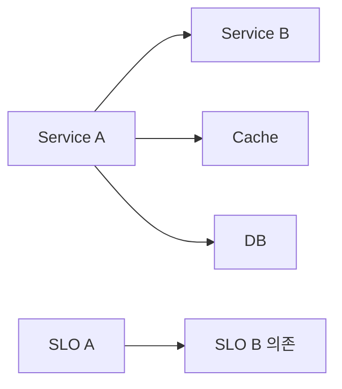

# SLO 알림

> **알림은 SLO를 깨고 있을 때만 울려야 한다.** 단순 임계값(error rate >
> 0.01)은 트래픽·SLO 무관하게 발화한다. **Burn Rate**는 "현재 속도로
> error budget을 얼마나 빨리 태우는가"를 정확히 측정해 알림과 SLO를
> 정렬한다. 이 글은 burn rate 수식·운영 원칙·임계값 결정·OOO 함정과
> 임계값 0.999% target에서 14.4×의 의미까지 완결적으로.

- **주제 경계**: 알림 일반 설계는 [알림 설계](alerting-design.md), 두 창
  AND 조합 메커니즘은 [Multi-window 알림](multi-window-alerting.md), 룰
  자동 생성은 [Sloth·Pyrra](../slo-as-code/slo-rule-generators.md), 명세
  표준은 [OpenSLO](../slo-as-code/openslo.md), SLO 개념·수학은
  [sre/SLO](../../sre/slo.md). 이 글은 "**SLO 기반 알림의 수식과
  운영 결정**".
- **선행**: [Multi-window 알림](multi-window-alerting.md), 기본 SLO 개념.

---

## 1. 한 줄 정의

> **SLO 알림**은 "error budget이 의미 있는 속도로 소진되는 순간에만
> 발화하는 알림"이다.

- 임계값 = **burn rate** (배수, SLO 무관)
- 알림 = **multi-window AND** (빠른 감지 + 노이즈 차단)
- 4단 구조 — page-fast / page-slow / ticket-fast / ticket-slow

---

## 2. SLO 알림이 단순 임계값보다 나은 이유

| 시나리오 | 단순 임계값 (`error_rate > 0.01`) | SLO 알림 (`burn rate > 14.4`) |
|---|---|---|
| 큰 사고 (10% error 1시간) | 즉시 fire | 즉시 fire ✓ |
| 잔잔한 0.5% error 영구 | fire 안 됨 (0.01 미만) | budget 천천히 소진 — ticket으로 fire ✓ |
| 99.5% target에서 0.5% error | 같은 임계값 — fire 안 됨 | 정확히 1× burn — ticket-slow에서 fire ✓ |
| 99.99% target에서 0.05% error | fire 안 됨 (0.01 미만) | 5× burn — ticket-fast(3×) 발화 ✓ |
| 5분 spike 50% | fire | multi-window AND로 차단 ✓ |

> **SLO 알림 = "사용자 약속을 깨고 있다"**. 시간·SLO 변경에 자동 적응.

---

## 3. burn rate 수식 — 정확히

```
burn_rate = error_rate / (1 - SLO_target)
```

| target | error budget (1-target) | error rate 1% 시 burn rate |
|---|---|---|
| 99.9% | 0.001 | 10× |
| 99.95% | 0.0005 | 20× |
| 99.99% | 0.0001 | 100× |
| 99.5% | 0.005 | 2× |

### 3.1 의미 해석

- **burn rate 1×** = SLO 정확히 정상 — window 내 budget 0으로 끝
- **burn rate N×** = N배 빨리 budget 소진. 28일 window면 28/N일에 소진
- **burn rate < 1** = SLO 여유 — budget 적립

### 3.2 budget 소진 시간

| burn rate | 28일 window 소진 |
|---|---|
| 14.4× | 약 2일 |
| 6× | 약 5일 (4.7일) |
| 3× | 약 9~10일 |
| 1× | 28일 (window 끝) |
| 0.5× | 56일 (소진 안 됨) |

---

## 4. PromQL — recording rule 기반

### 4.1 base rate

먼저 **error rate를 recording rule**로:

```yaml
- record: job:slo_errors_per_request:ratio_rate5m
  labels: { service: checkout, slo: 'availability-99.9' }
  expr: |
    sum by (service) (
      rate(http_requests_total{service="checkout",code=~"5.."}[5m])
    )
    /
    sum by (service) (
      rate(http_requests_total{service="checkout"}[5m])
    )
```

여러 시간 창 (5m·30m·1h·2h·6h·1d·3d) 각각 동일 패턴으로 생성.

### 4.2 burn rate alert

```yaml
- alert: SLOBurnPageFast
  expr: |
    job:slo_errors_per_request:ratio_rate5m{service="checkout"} > (14.4 * 0.001)
    and
    job:slo_errors_per_request:ratio_rate1h{service="checkout"} > (14.4 * 0.001)
  for: 1m
  keep_firing_for: 15m
  labels:
    severity: page
    slo: 'availability-99.9'
  annotations:
    summary: "{{ $labels.service }} fast burn (14.4x)"
    runbook_url: "https://runbooks.example.com/slo-burn"
```

> **scalar 비교**: `(14.4 * 0.001)`는 스칼라 — 그냥 `>`로 비교한다.
> `on()/group_left`는 vector-vector 매칭에만. 스칼라에 modifier를 쓰면
> parse error.

> **target 변경 자동화**: target을 코드 한 곳에서 읽어 임계값 4단을
> 자동 재계산하려면 Sloth·Pyrra처럼 SLO spec 기반 룰 자동 생성기가 표준.
> 또는 `slo:objective` recording rule(vector)을 만들고
> `... > on(service) group_left() (14.4 * (1 - slo:objective))` 패턴.

> **`keep_firing_for`**: burn rate가 임계 회복해도 15분 firing 유지 →
> flap·false resolution 차단 ([알림 설계 5.2](alerting-design.md#52-keep_firing_for--모던-해법-prometheus-242)).

---

## 5. error budget 메트릭

burn rate와 함께 **잔여 budget**을 메트릭으로:

```yaml
# slo:availability:ratio_rate28d 가 28일 rolling 가용성 (0~1)이라고 가정
- record: slo:error_budget_remaining
  labels: { service: checkout, slo: 'availability-99.9' }
  expr: |
    1 - ((1 - slo:availability:ratio_rate28d) / 0.001)
```

> **수식**: `consumed = (1 - availability) / budget`, `remaining = 1 - consumed`.
> 결과는 1.0(=100%, 모두 남음) ~ 음수(소진 후 초과). 분모 0.001은 SLO
> 99.9%의 budget(0.1%). target 변경 시 함께 갱신.

> **PromQL 실수 주의**: `sum_over_time(rate_28d[28d])`처럼 이미 rolling
> rate인 metric을 또 시간 합산하면 단위가 깨진다. rolling rate는 그대로
> 쓰거나, raw error/total에서 계산해야 함.

| 메트릭 | 의미 |
|---|---|
| `slo:error_budget_remaining` | 0 ~ 1 (= 100%) — 1.0이면 모두 남음 |
| `slo:error_budget_burn_rate` | 현재 burn rate (배수) |
| `slo:availability_28d` | 28일 평균 가용성 |
| `slo:objective` | target (예: 0.999) |

> **dashboard 패널**:
> - error budget remaining (gauge, 0~100%)
> - burn rate by window (4 line + threshold overlay)
> - forecast — `predict_linear(slo:error_budget_remaining[6h], 86400 * 7)`
>   현재 추세 6시간 기준으로 7일 후 예상 잔여 budget

> **분모 0 함정**: `sum(rate(errors)) / sum(rate(requests))`에서 분모가
> 0이면 NaN. low-traffic 서비스가 일시 무트래픽일 때 alert가 silent에
> 빠진다. Sloth는 자동으로 처리하지만 손작성 시 `or vector(0)` 또는
> 분모 게이트 추가.

---

## 6. 4단 알림 매트릭스

| 알림 | severity | short | long | burn × | budget 소진 | `for` |
|---|---|---|---|---|---|---|
| **page-fast** | critical | 5m | 1h | 14.4 | ~2일 | 1m |
| **page-slow** | critical | 30m | 6h | 6 | ~5일 | 15m |
| **ticket-fast** | warning | 2h | 1d | 3 | ~10일 | 1h |
| **ticket-slow** | warning | 6h | 3d | 1 | window 끝 | 3h |

자세한 메커니즘은 [Multi-window 알림 §3](multi-window-alerting.md#3-google-sre-workbook-표준--4단-알림).

---

## 7. SLO target 결정 — 알림 빈도와의 직결

target이 너무 높으면 **모든 fluctuation이 burn**으로 보인다.

| target | 28일 budget | error rate 0.5%면 |
|---|---|---|
| 99% | 6.7시간 | 0.5× burn — OK |
| 99.5% | 3.4시간 | 1× burn — ticket-slow ✓ |
| 99.9% | 40.3분 | 5× burn — page-slow 즉시 |
| 99.99% | 4분 | 50× burn — page-fast 즉시, 매일 |
| 99.999% | 26초 | **500× burn** — 끊임없이 page |

> **현실 권장**: 99.9~99.95가 거의 모든 인터넷 서비스의 sweet spot.
> 99.99%는 진짜 critical infra (auth·DB·payment), 99.999%는 보통 비현실.
> [sre/SLO](../../sre/slo.md)의 target 결정 가이드.

---

## 8. window 선택 — rolling vs calendar

| 방식 | 사용 |
|---|---|
| **Rolling 28d (또는 30d)** | 가장 흔함 — 항상 직전 28일. 알림에 자연 |
| **Rolling 7d** | fast-moving 서비스, 작은 budget |
| **Calendar 30d (월)** | 비즈니스 보고 — Q1 가용성 등 |
| **Calendar 90d (분기)** | SLA 보고 |

> **알림에는 rolling이 자연**: calendar는 월말에 reset되는 burn rate가
> 직관에 안 맞음. **알림 = rolling, 보고 = calendar** 분리도 흔한 패턴.

---

## 9. recording rule — Prometheus 부하 조심

base error rate 7개 창·서비스 100개 = **700개 rule 평가**. 부하가 만만찮다.

| 최적화 | 효과 |
|---|---|
| **rule_files 분리** | 서비스별 namespace별로 분리해 reload 영향 최소 |
| **rule evaluation interval 30s** | 디폴트 1m을 30s로 — burn rate 5m 창은 30s로 충분 |
| **higher-level recording**| 7개 burn rate를 하나의 vector matrix로 사전 계산 가능 |
| **VictoriaMetrics·Mimir** | 룰 평가 분산 (`vmalert`, Mimir ruler) |

> **함정**: alert rule은 evaluation 시점에만 평가. evaluation interval 1m
> 인데 alert window 30s면 의미 없음 — interval ≤ window/4가 표준.

---

## 10. low-traffic 함정 — burn rate의 약점

target 99.9% (budget = 0.001) 가정:

| 트래픽 | 5분 요청 | 1 에러 error rate | burn rate |
|---|---|---|---|
| 1k req/s | 300k | 0.00033% | 0.0033× (미미) |
| 10 req/s | 3k | 0.033% | **0.33×** |
| 0.1 req/s | 30 | 3.33% | **33×** |
| 0.01 req/s | 3 | 33% | **333×** |

> **0.1 req/s 서비스**: 1 에러로 33× burn — page-fast 14.4× 즉시 초과.
> **burn rate가 통계적 의미를 잃음**. 대안:
> - **min request count 게이트** (Multi-window §9)
> - **availability 대신 latency·correctness SLO**
> - **synthetic check 기반 SLO** — 인공 트래픽으로 통계 안정

---

## 11. SLI 종류 — alert도 같이 변함

| SLI | 알림 expr |
|---|---|
| **availability** (error/total) | burn rate (이 글의 표준) |
| **latency p99 < threshold** | `histogram_quantile(0.99, ...) > threshold` 비율의 SLO 적용 |
| **correctness** (data integrity) | 검증 실패 비율 |
| **freshness** | `time() - last_seen > threshold` 비율 |
| **throughput** (capacity) | drop·queue depth 비율 |

> **latency SLO**: `slow_request_ratio = bucket > threshold ÷ total`을
> SLI로. burn rate 동일 적용. classic vs Native Histogram 차이는
> [Native·Exponential Histogram](../metric-storage/exponential-histograms.md).

---

## 12. dependency SLO — 외부 의존의 비교



서비스 A의 SLO가 99.9%면, 의존 서비스 B·C·D의 SLO는 더 높아야 (예:
99.95%). 의존성 SLO 합집합 분석:

```
SLO_A_max ≤ SLO_B × SLO_C × SLO_D × ...
```

> **현실**: 의존이 5개 99.9%면 max 가능 SLO_A = 99.5%. 99.9% target은
> 비현실. circuit breaker·retry로 보강하거나 target 낮추거나.

> **독립 가정 주의**: 위 곱셈 규칙은 의존이 **독립적으로 실패**할 때만
> 정확. 같은 AZ·같은 컨트롤 플레인 공유 시 correlated failure로 더
> 나빠지고, retry/fallback이 있으면 더 좋아진다. SRE Workbook
> "Calculus of Service Availability" 참조.

---

## 13. error budget policy — 알림 + 행동

| 잔여 budget | 액션 |
|---|---|
| 100~50% | 정상 운영 |
| 50~20% | 신규 feature 배포 review 강화 |
| 20~10% | 비-critical 배포 동결 |
| < 10% | **모든 배포 동결**, reliability work 우선 |
| < 0% (소진) | postmortem 강제, 다음 window까지 stricter |

> **policy는 코드가 아니라 사람의 약속**: budget 소진 알림이 와도 액션이
> 자동화되진 않는다. PR 봇·CI 차단 룰로 일부 자동화는 가능 — 그러나
> 최종 판단은 incident commander.

---

## 14. 안티패턴

| 안티패턴 | 결과 | 교정 |
|---|---|---|
| 단순 임계값 (error rate > 0.01) | SLO 무관, 트래픽 spike에 흔들림 | burn rate 기반 |
| `on()/group_left`를 스칼라 비교에 적용 | parse error 또는 의도와 다른 결과 | 스칼라는 직접 `>`, vector는 modifier |
| `sum_over_time`을 이미 rolling rate에 또 적용 | 단위 깨짐, 무의미한 값 | rolling rate는 그대로 사용 |
| 4단 모두 page | 알림 폭주 | page는 14.4·6, 나머지 ticket |
| target 99.999% | 알림 끊임없음 | 99.9~99.95 권장 |
| 의존 5개 99.9% + target 99.9% | 수학적 불가능 | target 낮추거나 의존 SLO 강화 |
| low-traffic에 burn rate 적용 | 1 에러로 page | min count 게이트 |
| recording rule 없이 raw rate | Prometheus 부하 | recording rule 우선 |
| evaluation interval > window/4 | 알림 평가 부정확 | interval ≤ 30s |
| budget 소진 후 정책 없음 | 동일 사고 반복 | error budget policy 명시 |
| SLI를 단일만 (availability만) | latency·freshness 무시 | 다중 SLI |
| `keep_firing_for` 없이 | flap → PD 폭주 | 15m+ 권장 |
| target 변경 시 4단 임계값 수동 | drift | `(1-target)` 자동 |
| dashboard 없이 알림만 | 사고 시 burn rate 시각화 부재 | 4창 + forecast 패널 |
| 의존 SLO 없이 own SLO만 | 외부 의존 영향 못 봄 | dependency SLO 매트릭스 |
| ticket으로 정의해놓고 PD에 보냄 | 경고가 페이지로 변질 | severity·routing 정합 |

---

## 15. 운영 체크리스트

- [ ] 모든 SLO는 burn rate 기반 4단 알림 (page-fast/slow, ticket-fast/slow)
- [ ] base error rate 7개 창 recording rule
- [ ] target 결정은 99.9~99.95가 현실 sweet spot, 의존 SLO 매트릭스 확인
- [ ] `(1-target)` 식으로 임계값 동적 — Sloth·Pyrra 자동
- [ ] error budget remaining 메트릭·dashboard
- [ ] error budget policy 명시 — 50%·20%·10%·0% 액션
- [ ] inhibition: page-fast가 다른 단계 가림
- [ ] `keep_firing_for: 15m` flap 차단
- [ ] low-traffic 게이트 (min request count)
- [ ] SLI 다중 — availability + latency + freshness
- [ ] evaluation interval ≤ 30s
- [ ] alert PR에 runbook URL 강제
- [ ] dependency SLO 매트릭스 — own target ≤ Π(deps)
- [ ] 분기마다 SLO 재검토 — 비즈니스 신뢰도 vs cost

---

## 참고 자료

- [Google SRE Workbook — Alerting on SLOs](https://sre.google/workbook/alerting-on-slos/) (확인 2026-04-25)
- [Google SRE Workbook — Implementing SLOs](https://sre.google/workbook/implementing-slos/) (확인 2026-04-25)
- [Google SRE Book — Service Level Objectives](https://sre.google/sre-book/service-level-objectives/) (확인 2026-04-25)
- [Sloth — Multi-window Multi-burn rate Alerting](https://sloth.dev/) (확인 2026-04-25)
- [Pyrra — Burn rate alerts](https://github.com/pyrra-dev/pyrra) (확인 2026-04-25)
- [SoundCloud — Alerting on SLOs like Pros](https://developers.soundcloud.com/blog/alerting-on-slos/) (확인 2026-04-25)
- [Grafana — Multi-window multi-burn-rate alerts](https://grafana.com/blog/2025/02/28/how-to-implement-multi-window-multi-burn-rate-alerts-with-grafana-cloud/) (확인 2026-04-25)
- [Prometheus — Alerting Rules](https://prometheus.io/docs/prometheus/latest/configuration/alerting_rules/) (확인 2026-04-25)
