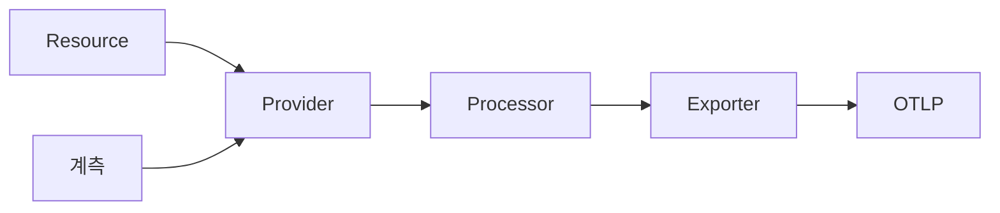
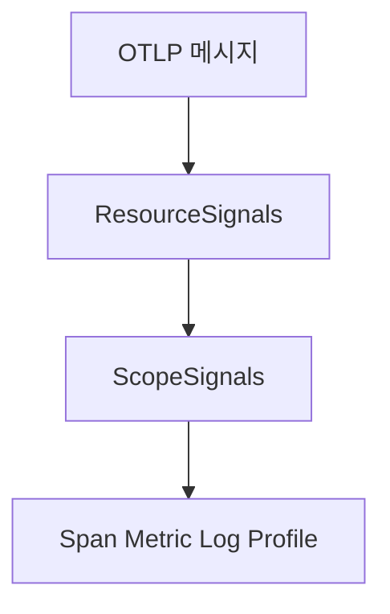
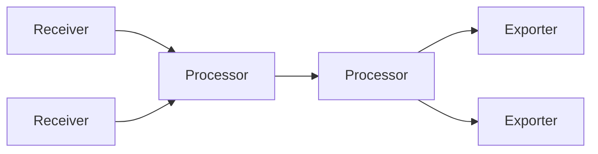
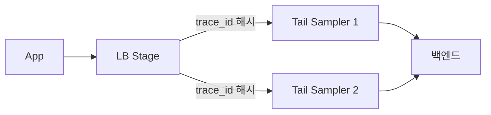

# OpenTelemetry 개요

> **관측성의 표준이 된 단일 프로젝트.** 2019년 OpenCensus(Google)와
> OpenTracing(CNCF)이 합쳐져 출범. 2026년 시점 OpenTelemetry는 **CNCF
> 두 번째로 활발한 프로젝트**(Kubernetes 다음)이며, 모든 주요 SaaS·OSS
> 백엔드가 OTLP를 native 수신한다. 트레이스·메트릭·로그 신호가 stable,
> 프로파일은 Public Alpha로 진입했다.

- **주제 경계**: 이 글은 **OpenTelemetry 프로젝트 전반의 구조**를 다룬다.
  Prometheus와의 상호운용은 [Prometheus·OpenTelemetry](prometheus-opentelemetry.md),
  K8s 자동 계측은 [OTel Operator](otel-operator.md), Collector 파이프라인
  심화는 [OTel Collector](../tracing/otel-collector.md), 표준 속성은
  [Semantic Conventions](../concepts/semantic-conventions.md), 컨텍스트
  전파는 [Trace Context](../tracing/trace-context.md), 프로파일링은
  [연속 프로파일링](../profiling/continuous-profiling.md) 참조.
- **선행**: [관측성 개념](../concepts/observability-concepts.md).

---

## 1. 한 문장 정의

> **OpenTelemetry**는 "벤더 중립의 텔레메트리 생성·수집·전송 표준"이다.

- 표준은 **Specification + SemConv + OTLP**, 구현은 **API/SDK + Collector
  + Instrumentation Library**
- 데이터 모델·전송 프로토콜·속성 명명까지 한 곳에서 정의 → 백엔드 교체 시
  애플리케이션 코드 변경 0
- 라이선스 **Apache 2.0**, 거버넌스 **CNCF**

---

## 2. 역사·거버넌스

| 시점 | 사건 |
|---|---|
| 2016 | Google이 **OpenCensus** 공개 (메트릭+트레이스 통합 라이브러리) |
| 2016 | **OpenTracing** CNCF 입회 (트레이스 API only) |
| 2019-05 | **합병** → OpenTelemetry, CNCF Sandbox 입회 |
| 2021-08 | **CNCF Incubating** 승격 |
| 2021~22 | Tracing API/SDK·Protocol stable |
| 2023~24 | Logs Bridge API·Metrics SDK stable |
| 2025 | 모든 주요 백엔드가 OTLP native 수신 |
| 2026-03 | **Profiles 신호 Public Alpha** |
| 2026 현재 | CNCF **Incubating**, K8s 다음 두 번째로 활발한 CNCF 프로젝트 |

> **"de facto graduated"라는 표현 주의**: 실 사용도와 채택률은 graduated
> 수준이지만 **공식 maturity는 Incubating**. graduation 신청은 진행 중
> (CNCF TOC issue #1739).

---

## 3. 5대 컴포넌트

| 컴포넌트 | 역할 |
|---|---|
| **Specification** | 데이터 모델, API contract, OTLP, SemConv 명세 — 모든 SDK가 따라야 함 |
| **API** | 애플리케이션이 호출하는 표면. **SDK 없으면 no-op** |
| **SDK** | API의 실제 구현. 샘플링·배치·resource·exporter 설정 |
| **Instrumentation Library** | HTTP·DB·메시지큐 등 **자동 계측** |
| **Collector** | 수신·변환·전달 프록시. 백엔드 다중화·재시도·필터의 단일 지점 |

---

## 4. 4 신호의 현재 상태 (2026-04)

| 신호 | API | SDK | OTLP | Spec |
|---|---|---|---|---|
| **Traces** | Stable | Stable | Stable | LTS |
| **Metrics** | Stable | Stable (언어별 mixed) | Stable | Stable |
| **Logs** | Stable (Bridge) | Stable (언어별 mixed) | Stable | Stable |
| **Profiles** | Development | Development | **Alpha** (2026-03 공개) | Development |
| **Baggage** | Stable | Stable | N/A | Stable |
| **Events** | (Logs SemConv 위 실험) | — | — | Experimental |

> **현실 권장**: 프로덕션에 트레이스·메트릭·로그 3종은 즉시 적용. 프로파일
> 은 Pyroscope·Parca의 native 포맷을 유지하면서 OTLP 듀얼라이트로 실험.
> ([연속 프로파일링 5장](../profiling/continuous-profiling.md#5-opentelemetry-profiles--2026-public-alpha))

---

## 5. API vs SDK — 분리의 의미

OpenTelemetry는 **API**와 **SDK**를 의도적으로 분리한다.

| 측면 | API | SDK |
|---|---|---|
| 의존성 | 라이브러리에 포함 가능 | 애플리케이션에서만 |
| 동작 | SDK 미설치 시 **no-op** | 실제로 신호 생성 |
| 변경 빈도 | 매우 안정 — major 안 바뀜 | 빈번한 개선 |

> **왜 분리하는가**: 라이브러리 작성자(예: HTTP 클라이언트 lib)가 SDK까지
> 의존하면 **소비자의 SDK 선택을 강제**하게 된다. API만 의존하면 소비자는
> 자기 SDK를 자유롭게 선택, 미선택 시 lib는 안전하게 no-op.

---

## 6. SDK — Resource·Provider·Processor·Exporter

| 요소 | 역할 |
|---|---|
| **Resource** | "이 텔레메트리가 어디서 왔는가" — `service.name`, `service.version`, `host.name`, `cloud.region` 등 |
| **Tracer / Meter / Logger Provider** | 신호별 SDK 진입점 — resource·sampler·processor·exporter 묶음 |
| **Span/Log/Metric Processor** | 배치·샘플링·변환. Tracer는 **BatchSpanProcessor**가 디폴트 |
| **Exporter** | OTLP gRPC/HTTP, console, file, 벤더 SaaS native |
| **Sampler** | head 결정 — `ParentBased`, `TraceIdRatioBased`, `AlwaysOn/Off` |

> **resource.service.name 누락은 1순위 함정**: 미설정 시 `unknown_service`
> 로 들어가 백엔드에서 검색이 안 된다. SDK 초기화 또는
> `OTEL_SERVICE_NAME` 환경변수로 강제.

### 6.1 Resource Detector — 자동 감지 체이닝

SDK는 환경에서 attribute를 **자동 감지**하는 detector 체인을 제공한다.

| Detector | 추출 |
|---|---|
| `env` | `OTEL_RESOURCE_ATTRIBUTES`, `OTEL_SERVICE_NAME` |
| `host` | `host.name`, `host.id`, `host.arch`, `os.type` |
| `process` | `process.pid`, `process.command`, `process.runtime.name` |
| `container` | `container.id` (cgroup 파싱) |
| `k8s` | `k8s.pod.name`·`k8s.namespace.name` (downward API 필요) |
| `aws.ec2`·`gcp`·`azure` | metadata service에서 region·zone·instance |

**우선순위**: `OTEL_SERVICE_NAME` > `OTEL_RESOURCE_ATTRIBUTES` > 코드 설정
> 자동 detector 결과. 즉 환경변수가 detector를 override.

> **K8s downward API 패턴**: Pod manifest에서
> `OTEL_RESOURCE_ATTRIBUTES=k8s.pod.name=$(POD_NAME),k8s.namespace.name=$(POD_NS)`
> 주입 → 한 곳에서 일관된 라벨링. [OTel Operator](otel-operator.md)는 이를
> 자동화한다.

> **detector 충돌 주의**: `host` detector가 emit한 `host.name`과 환경변수
> `OTEL_RESOURCE_ATTRIBUTES=host.name=foo`가 다르면 환경변수 우선. 디버깅
> 시 `OTEL_LOG_LEVEL=debug`로 최종 resource를 출력해 확인.

---

## 7. 자동 계측 vs 수동 계측

| 모드 | 동작 | 장단점 |
|---|---|---|
| **Auto** | 빌드/시작 시 라이브러리 hook 자동 주입 | 코드 변경 0, 빠른 도입. 라이브러리 지원 범위 한정 |
| **Manual** | 코드에 `with tracer.start_as_current_span(...)` | 비즈니스 로직까지 가능. 유지보수 비용 |
| **하이브리드** | auto + 핵심 도메인은 manual | 권장 |

### 7.1 언어별 auto 도입 방식

| 언어 | 메커니즘 |
|---|---|
| **Java** | **javaagent** (`-javaagent:opentelemetry-javaagent.jar`) — bytecode 변환 |
| **Python** | `opentelemetry-bootstrap` + `opentelemetry-instrument` 명령어로 wrap |
| **Node.js** | `--require @opentelemetry/auto-instrumentations-node/register` |
| **.NET** | `OpenTelemetry.AutoInstrumentation` profiler API |
| **Go** | **eBPF 기반 (OBI)** — runtime 변경 없이 외부 주입 (실험) |
| **Ruby** | gem `opentelemetry-instrumentation-all` |
| **PHP** | extension 기반 |

> **Go는 특수**: Go는 동적 hook 메커니즘이 없어 **컴파일 타임 SDK + 라이브러리별
> wrapper**가 표준. 2025~2026년 **OBI (OTel eBPF Instrumentation)**가
> "재컴파일·재시작 없이" Go 바이너리에 SDK 효과를 부여하는 방식으로 진행 중
> (2026 Beta·GA 목표). 프로덕션 critical은 SDK 수동 통합 권장.

### 7.2 BatchSpanProcessor — 데이터 손실 방지

| 파라미터 | 디폴트 | 의미 |
|---|---|---|
| `scheduledDelayMillis` | 5000 | 배치 export 주기 |
| `maxQueueSize` | 2048 | 큐 한도, 초과 시 drop |
| `maxExportBatchSize` | 512 | 한 번 export하는 span 수 |
| `exportTimeoutMillis` | 30000 | export 타임아웃 |

**shutdown 시퀀스**:

1. SDK `Shutdown()` 호출 → 큐의 남은 span을 강제 flush
2. K8s `terminationGracePeriodSeconds`가 export 완료보다 짧으면 손실
3. SIGTERM 수신 핸들러에 `Shutdown()` 명시

> **K8s 권장**: `terminationGracePeriodSeconds: 60` + preStop sleep 5~10s.
> exporter timeout(30s)이 grace 안에 들어와야 마지막 batch가 도착.

> **drop 표시**: 큐 가득참은 SDK 내부 메트릭 `otel_sdk_span_processor_dropped_count`
> 등으로 노출. 알림 룰 1순위.

---

## 8. OTLP — 단일 전송 프로토콜

| 측면 | 내용 |
|---|---|
| 정의 | OTel **Protocol** — 4신호 모두를 같은 protobuf 스키마로 |
| 전송 | **gRPC** (default, 4317) 또는 **HTTP/protobuf** (4318) 또는 HTTP/JSON |
| 압축 | gzip (default), zstd (Collector 일부 receiver) |
| 시간 단위 | UnixNano (epoch nanoseconds) |
| 메타 | `Resource`(공통) + `InstrumentationScope`(라이브러리 + version) + 신호 |

> **OTLP/HTTP vs gRPC**: 둘 다 **unary** RPC (양방향 스트리밍 아님). gRPC
> 는 HTTP/2 기반 connection multiplexing·HPACK 헤더 압축으로 throughput
> 우위. HTTP는 동기 페이로드라 backpressure가 단순, L7 LB·WAF inspection
> 친화적. **사이드카·서버리스는 HTTP** (Lambda·Cloudflare Workers).
> 게이트웨이가 gRPC를 막는 환경도 흔함. 대규모 클러스터는 gRPC.

> **gRPC keepalive 함정**: idle connection을 LB가 close하면 다음 export가
> 끊긴다. SDK·Collector 양쪽 keepalive timeout이 LB idle timeout보다 짧아야
> reconnect.

> **포트 노출 보안**: 4317/4318 모두 인증 없이 외부 노출 시 텔레메트리
> 위변조 가능 — mTLS 또는 헤더 토큰 인증 표준. 게이트웨이만 외부에 두고
> 백엔드 OTLP는 internal.

> **non-OTLP 백엔드**: Datadog·NewRelic 등은 자체 형식이 있지만 OTLP를
> 직접 수신한다. SDK는 항상 OTLP exporter, 변환은 백엔드 또는 Collector
> 가 담당하는 패턴이 표준.

---

## 9. Collector — 수집·가공·라우팅의 단일 지점

| 컴포넌트 | 역할 | 예 |
|---|---|---|
| **Receiver** | 텔레메트리 수신 | otlp, prometheus, jaeger, fluentforward, kafka |
| **Processor** | 변환·필터·배치 | batch, memory_limiter, attributes, transform, k8sattributes, tail_sampling |
| **Exporter** | 외부 전송 | otlp, prometheusremotewrite, loki, datadog, awsxray |
| **Connector** | 한 파이프라인의 출력을 다른 파이프라인의 입력으로 | spanmetrics, servicegraph, count, routing |
| **Extension** | 사이드카 기능 | health_check, pprof, zpages, file_storage |

> **Connector의 가치**: trace → 메트릭 derivation (`spanmetrics`)을 SDK에서
> 하지 않고 Collector에서 일괄 — 모든 언어 SDK 변경 없이 RED 메트릭을 얻음.

### 9.1 Core vs Contrib

| 배포 | 내용 |
|---|---|
| **Core** | 안정·필수 컴포넌트만. 이미지 작고 의존성 단순 |
| **Contrib** | Core + 200+ 컴포넌트. 이미지 크고 attack surface 큼 |
| **Custom** | **OCB (OpenTelemetry Collector Builder)**로 필요 컴포넌트만 빌드. **권장 패턴** |

> **OCB 권장**: contrib를 그대로 쓰면 이미지 ~600MB, 사용 안 하는 컴포넌트
> 다수. OCB로 자기 환경에 필요한 것만 골라 빌드 → ~100MB.

### 9.2 배포 패턴

| 패턴 | 사용처 | 장단 |
|---|---|---|
| **Agent (DaemonSet/Sidecar)** | 노드별 1개. 로컬 OTLP 수신, k8sattribute 부착 | 가장 보편. 한 hop 감소 |
| **Gateway (Deployment)** | 클러스터 단일 진입점. 인증·route·tail sampling | tail sampling·라우팅·필터 거점 |
| **Agent + Gateway** | agent는 enrichment·local fallback, gateway는 정책·라우팅 | **표준** 프로덕션 토폴로지 |
| **In-app (단순)** | SDK가 직접 백엔드로 | 작은 환경. 백엔드 변경 시 재배포 |

### 9.3 Tail Sampling — Load-Balancing Exporter 패턴

tail sampling은 trace 전체를 본 뒤 결정하므로 **같은 trace의 모든 span이
같은 Collector replica에 모여야** 한다. 단순 replica 증설 + Service
balancing은 trace를 분산시켜 결정 깨짐.

| 단계 | 역할 |
|---|---|
| **Stage 1** (Collector LB) | `loadbalancing` exporter가 **trace_id로 hash** → 같은 trace는 항상 같은 second-stage replica로 |
| **Stage 2** (Tail Sampler) | `tail_sampling` processor가 trace 전체를 보고 결정 |

> **단일 replica는 OOM 위험**: tail sampling은 메모리에 trace 전체를 잠시
> 보관 (typical 30s decision wait). 트래픽 폭주 시 OOM. memory_limiter
> processor 필수.

> **Gateway HA**: Stage 2도 replica 다수 가능 — Stage 1 hash가 일관되게
> 라우팅하므로. Pod anti-affinity·HPA 적용.

자세한 파이프라인 패턴은 [OTel Collector](../tracing/otel-collector.md) 참조.

---

## 10. SemConv — 속성 명명 표준

OTel **Semantic Conventions**는 신호 이름·속성 이름·값을 표준화한다.

| 영역 | 예 |
|---|---|
| Resource | `service.name`, `service.namespace`, `service.instance.id`, `cloud.region`, `k8s.pod.name` |
| HTTP | `http.request.method`, `http.response.status_code`, `url.path` |
| RPC | `rpc.system`, `rpc.service`, `rpc.method` |
| DB | `db.system`, `db.statement`, `db.name` |
| Messaging | `messaging.system`, `messaging.destination.name`, `messaging.operation` |
| GenAI | `gen_ai.system`, `gen_ai.request.model`, `gen_ai.usage.input_tokens` (안정화 진행) |

> **2024-2025 대전환**: HTTP·RPC SemConv가 **breaking 변경** (`http.method`
> → `http.request.method`). SDK 디폴트는 **dual emit** 옵션이 있다 —
> `OTEL_SEMCONV_STABILITY_OPT_IN=http/dup` 등. dual emit으로 마이그레이션
> 후 단일로.

상세는 [Semantic Conventions](../concepts/semantic-conventions.md) 참조.

---

## 11. 컨텍스트 전파 — propagator

`traceparent`/`tracestate`/`baggage` 헤더 표준은 [Trace Context](../tracing/trace-context.md)
에서 다룬다. 핵심만:

| 환경변수 | 디폴트 |
|---|---|
| `OTEL_PROPAGATORS` | `tracecontext,baggage` |
| 추가 가능 | `b3`·`b3multi`·`jaeger`·`xray`·`ottrace` |

| 동작 | 의미 |
|---|---|
| **inject** | 나열된 모든 propagator로 헤더 출력 |
| **extract** | 나열 순서대로 시도, **첫 매칭이 우선** |

> **legacy 환경 마이그레이션**: `tracecontext,baggage,b3` 식으로 잠시 양립.
> `tracecontext`를 항상 첫 번째에. b3 single (`b3`) vs multi (`b3multi`)
> 차이는 Istio·Envoy가 single 디폴트라는 점에서 결정. tracestate 길이
> 제한(512자) 초과 시 vendor entry 손실 위험 — 자세히는
> [Trace Context](../tracing/trace-context.md).

---

## 12. 메트릭 — Temporality 선택

OTel 메트릭의 핵심 결정: **Cumulative vs Delta**.

| 모드 | 의미 | 호환 |
|---|---|---|
| **Cumulative** | 누적값 (Prometheus 스타일). reset 시 백엔드가 처리 | Prometheus·Mimir·Cortex `remote_write` 호환 |
| **Delta** | 직전 export 이후 증분 | Datadog·Dynatrace·일부 SaaS 선호 |

> **결정 기준**: 백엔드가 Prometheus 계열이면 **Cumulative** (디폴트).
> Datadog·Dynatrace가 1차 백엔드면 **Delta**. Collector
> `cumulativetodelta` processor로 변환 가능 — SDK는 cumulative로 두고
> exporter 직전 변환이 표준.

> **Histogram bucket 폭발 회피**: dense bucket 대신 **Exponential
> Histogram** ([Native·Exponential Histogram](../metric-storage/exponential-histograms.md)).
> 자동 bucket 적응으로 카디널리티 안정.

---

## 13. 안정성 정책 — 무엇이 깨지지 않는가

| 보장 | 의미 |
|---|---|
| **API stable** | major 변경 시 deprecation 1 minor 이상 유예. 호출 코드 깨지지 않음 |
| **OTLP stable** | wire format이 깨지지 않음. 신규 필드는 backward compatible |
| **SDK stable** | 동작 일관 — sampler·processor 동작 명세 |
| **SemConv stable** | stable 등급 속성은 깨지지 않음. experimental은 변경 허용 |

> **SDK 업그레이드 정책**: 6개월 단위 minor. 버그·CVE는 patch. major는
> 매우 드뭄. 라이브러리 호환성 표는 SDK 릴리스 노트에서 명시.

---

## 14. 도입 로드맵 (3개월)

| 주차 | 활동 |
|---|---|
| 1 | **단일 서비스 + 자동 계측**. Collector(agent) 1대, 백엔드 1개 |
| 2 | **resource attribute 표준화** — `service.name`, `service.namespace`, `service.version`, `deployment.environment` |
| 3 | **propagator 통일** (`tracecontext,baggage`). 게이트웨이 헤더 allowlist |
| 4 | 메트릭 — Prometheus exposition + OTLP 둘 다. Collector가 prometheus receiver로 |
| 5~6 | 로그 — 기존 stdout JSON을 Collector(filelog receiver)가 수집해 trace_id 부착 |
| 7~8 | tail sampling 도입 (Collector gateway). 에러·고지연 우선 보존 |
| 9~10 | 핵심 비즈니스 단계 manual span. SemConv `http`·`db` dual-emit 마이그레이션 |
| 11~12 | 멀티 백엔드 라우팅(Connector), span metrics derivation, PII 필터 정책 |

---

## 15. 안티패턴

| 안티패턴 | 결과 | 교정 |
|---|---|---|
| `service.name` 미설정 | `unknown_service`로 검색 불가 | `OTEL_SERVICE_NAME` 강제 |
| API만 import, SDK 미초기화 | no-op — 신호 안 나감 | SDK 초기화 명시 |
| auto + manual 중복 계측 | span 중복·고cardinality | 한 라이브러리에 하나의 instrumentation만 |
| baggage에 PII | 외부 노출 위험 | 화이트리스트, edge에서 strip |
| `OTEL_TRACES_EXPORTER=none` 무인지 사용 | 신호 손실 | 기본 `otlp` 유지, 명시 변경만 |
| Collector contrib 그대로 사용 | 이미지 비대, attack surface | OCB로 슬림 빌드 |
| SDK 디폴트 BatchSpanProcessor 미설정 | shutdown 시 마지막 배치 손실 | `Shutdown()` 호출, K8s `terminationGracePeriodSeconds` |
| 메트릭 SDK에 dense Histogram 그대로 | bucket 폭발 | **Exponential Histogram** ([Native·Exponential Histogram](../metric-storage/exponential-histograms.md)) |
| Collector single instance | gateway SPOF | replica + pod anti-affinity, behind Service |
| Resource 누락한 OTLP send | 백엔드에서 origin 추적 불가 | Resource detector 활성 |
| SemConv legacy attribute만 사용 | 신규 dashboard 깨짐 | dual-emit 후 stable로 통일 |
| breaking-change SemConv 무시 | 검색·alert rule 망가짐 | `OTEL_SEMCONV_STABILITY_OPT_IN` 점검 |
| OTel Logs API 직접 호출, Bridge 미사용 | 호환성·중복 | bridge 권장, 기존 logger와 같이 보냄 |

---

## 16. 운영 체크리스트

- [ ] resource: `service.name`, `service.namespace`, `service.version`, `deployment.environment` 모두 설정
- [ ] auto-instrumentation 도입 — Java/Python/Node/.NET 우선
- [ ] `OTEL_PROPAGATORS=tracecontext,baggage` 디폴트
- [ ] Collector Agent + Gateway 2층 배치
- [ ] Collector OCB로 슬림 빌드, contrib 그대로 사용 안 함
- [ ] SDK BatchSpanProcessor `Shutdown()` 호출 + grace period
- [ ] tail sampling은 gateway에서 (head는 SDK)
- [ ] SemConv stable 속성으로 통일, legacy는 dual-emit 마이그레이션
- [ ] 메트릭은 **Exponential Histogram** 표준
- [ ] Logs는 Bridge API 또는 filelog receiver
- [ ] Profile은 native(Pyroscope) + OTLP/Profiles 듀얼 가능 시점 검토
- [ ] PII baggage 화이트리스트, edge strip
- [ ] OTLP gRPC vs HTTP — 환경(서버리스/사이드카) 별로 결정
- [ ] Collector replica·anti-affinity·HPA
- [ ] Collector `memory_limiter` processor 활성, OTLP exporter `sending_queue`·재시도 설정
- [ ] Collector 자체 메트릭 (`otelcol_*`) 모니터링 — drop·refused·queue size
- [ ] tail sampling은 `loadbalancing` exporter로 stage 분리 (HA + 일관 결정)

---

## 참고 자료

- [OpenTelemetry — What is OpenTelemetry](https://opentelemetry.io/docs/what-is-opentelemetry/) (확인 2026-04-25)
- [OpenTelemetry Specification](https://opentelemetry.io/docs/specs/otel/) (확인 2026-04-25)
- [Specification Status Summary](https://opentelemetry.io/docs/specs/status/) (확인 2026-04-25)
- [OTel Collector Architecture](https://opentelemetry.io/docs/collector/architecture/) (확인 2026-04-25)
- [OTel Collector Configuration](https://opentelemetry.io/docs/collector/configuration/) (확인 2026-04-25)
- [OpenTelemetry CNCF Project Page](https://www.cncf.io/projects/opentelemetry/) (확인 2026-04-25)
- [OpenTelemetry — Sustaining the Project](https://www.cncf.io/blog/2026/03/31/sustaining-opentelemetry-moving-from-dependency-management-to-stewardship/) (확인 2026-04-25)
- [OpenTelemetry Project Journey Report](https://www.cncf.io/reports/opentelemetry-project-journey-report/) (확인 2026-04-25)
- [Profiles Public Alpha 발표](https://opentelemetry.io/blog/2026/profiles-alpha/) (확인 2026-04-25)
- [OpenTelemetry Collector Builder (OCB)](https://opentelemetry.io/docs/collector/custom-collector/) (확인 2026-04-25)
- [OTel Semantic Conventions](https://opentelemetry.io/docs/specs/semconv/) (확인 2026-04-25)
- [OTel Auto-Instrumentation](https://opentelemetry.io/docs/zero-code/) (확인 2026-04-25)
- [OBI (eBPF Instrumentation) 2026 Goals](https://opentelemetry.io/blog/2026/obi-goals/) (확인 2026-04-25)
