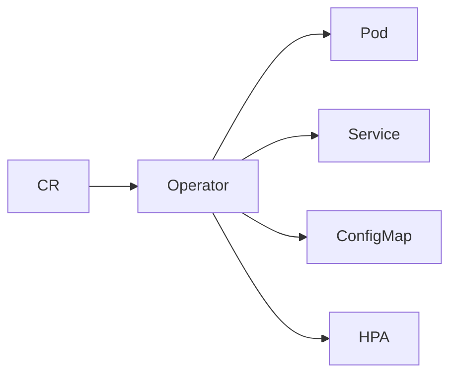
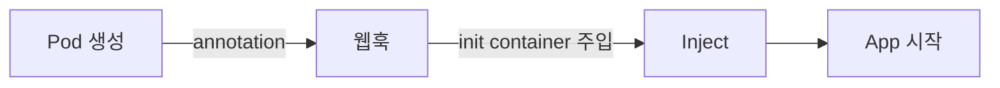
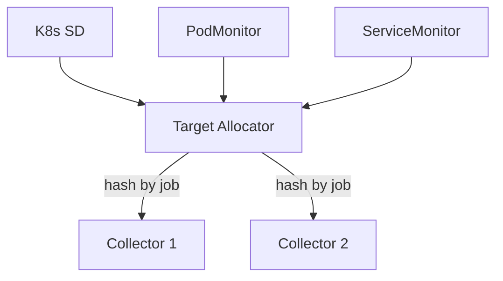
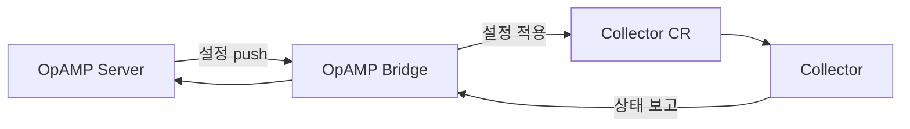
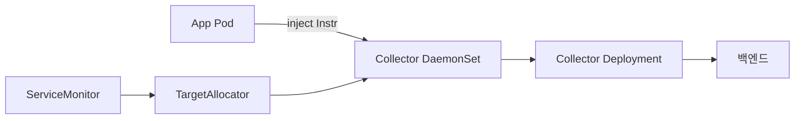

# OTel Operator

> **K8s에서 OpenTelemetry를 운영하는 표준 도구.** 두 개의 CRD —
> `OpenTelemetryCollector`와 `Instrumentation` — 만으로 Collector
> 토폴로지와 자동 계측을 선언적으로 관리한다. cert-manager 의존, Helm
> 또는 manifest로 설치, **Target Allocator**로 Prometheus 스크레이프
> 분산 + **OpAMP Bridge**로 에이전트 원격 제어까지 통합한다.

- **주제 경계**: OTel 자체는 [OpenTelemetry 개요](opentelemetry-overview.md),
  Prometheus 통합은 [Prometheus·OpenTelemetry](prometheus-opentelemetry.md),
  Collector 파이프라인은 [OTel Collector](../tracing/otel-collector.md),
  Trace Context는 [Trace Context](../tracing/trace-context.md),
  Grafana 측 에이전트는 [Grafana Alloy](../grafana/grafana-alloy.md).
- **선행**: K8s 기본 (Operator·CRD·webhook), [관측성 개념](../concepts/observability-concepts.md).

---

## 1. 한 문장 정의

> **OTel Operator**는 "K8s에서 Collector와 auto-instrumentation을 CRD로
> 선언적으로 관리하는 컨트롤러"다.

- 두 핵심 CRD: **`OpenTelemetryCollector`** (Collector 배포) +
  **`Instrumentation`** (자동 계측 정책)
- 보조 컴포넌트: **Target Allocator** (Prometheus 스크레이프 분산),
  **OpAMP Bridge** (원격 설정 관리)
- 라이선스 Apache 2.0, 거버넌스 OpenTelemetry SIG

---

## 2. 왜 Operator가 필요한가

순수 Helm/manifest로 Collector를 배포하면 다음이 수동:

| 영역 | 수동 시 부담 |
|---|---|
| 환경별 다중 Collector (agent + gateway) | 두 종류 manifest, 라벨링 분리 |
| auto-instrumentation 적용 | sidecar init container, env var, version 매핑 |
| 설정 파일 reload | ConfigMap watch + sidecar reloader |
| TLS 인증서 갱신 | cert-manager 또는 수동 |
| Prometheus 스크레이프 HA | sharding 키 직접 구현 |
| 에이전트 원격 제어 | self-implemented |

Operator는 위 모두를 **CRD 한 줄**로 위임한다.

---

## 3. 설치

### 3.1 의존성·전제

| 항목 | 요건 |
|---|---|
| **cert-manager** | 필수 (또는 Helm `autoGenerateCert.enabled`) — 웹훅 TLS |
| Kubernetes | **1.28+** 권장 (Operator 최신 버전 기준), 1.27 minimum |
| 권한 | cluster-admin (CRD·webhook 등록) |

### 3.2 두 가지 경로

| 경로 | 용도 |
|---|---|
| **Helm chart** (`open-telemetry/opentelemetry-operator`) | 프로덕션 표준. values로 manage, NetworkPolicy·HPA 통합 |
| **release manifest** (`opentelemetry-operator.yaml`) | 빠른 설치, GitOps 단순 |

```yaml
# values.yaml 예
manager:
  collectorImage:
    repository: otel/opentelemetry-collector-contrib
admissionWebhooks:
  certManager:
    enabled: true
```

> **cert-manager 없이 self-signed**: Helm `admissionWebhooks.certManager.enabled=false`
> + auto-generated cert 옵션. 단 회전·만료 관리가 자체 부담 — cert-manager
> 권장.

---

## 4. CRD ① — `OpenTelemetryCollector`



### 4.1 4가지 mode

| mode | K8s 리소스 | 사용 |
|---|---|---|
| **deployment** (디폴트) | `Deployment` | 중앙 gateway. tail sampling·라우팅 |
| **daemonset** | `DaemonSet` | 노드별 1개 — host 메트릭·로그·local OTLP 수신 |
| **statefulset** | `StatefulSet` | stable identity가 필요한 경우 (Target Allocator의 일부 모드) |
| **sidecar** | Pod에 sidecar container 주입 | 앱과 1:1 — 짧은 lifecycle, 단순 forward |

### 4.2 minimal 예

```yaml
apiVersion: opentelemetry.io/v1beta1
kind: OpenTelemetryCollector
metadata:
  name: agent
  namespace: observability
spec:
  mode: daemonset
  image: otel/opentelemetry-collector-contrib:0.150.0
  config:
    receivers:
      otlp:
        protocols:
          grpc:
            endpoint: 0.0.0.0:4317
          http:
            endpoint: 0.0.0.0:4318
    processors:
      batch: {}
      memory_limiter:
        check_interval: 1s
        limit_percentage: 75
        spike_limit_percentage: 25
      k8sattributes: {}
    exporters:
      otlp:
        endpoint: gateway.observability:4317
    service:
      pipelines:
        traces:
          receivers: [otlp]
          processors: [memory_limiter, k8sattributes, batch]
          exporters: [otlp]
```

### 4.3 CRD API 성숙도 — 2026-04 시점

| CRD | API |
|---|---|
| **OpenTelemetryCollector** | **v1beta1** (current) — v1alpha1은 자동 변환 |
| **Instrumentation** | **v1alpha1** — beta 진입 미정 |
| **OpAMPBridge** | v1alpha1 |
| **OpenTelemetryTargetAllocator** | v1alpha1 (별도 CR로 분리 진행 중) |

| 측면 | v1alpha1 | v1beta1 |
|---|---|---|
| `config` 필드 | string | **structured** YAML, validation |
| 마이그레이션 | Operator가 자동 변환 (보존) — 단 일부 필드는 manual |

> **Instrumentation은 왜 여전히 v1alpha1**: SDK·자동 계측 라이브러리의
> 환경변수 표준이 아직 진화 중이라 의도적 alpha 유지. v1beta1 마이그레이션
> 강제는 아직 없으니 그대로 사용. v1beta1 발표 시 마이그레이션 도구 제공
> 예정.

> **`config` 필드의 `${}` 변수 제약**: 환경변수 전개는 가능하지만 **port
> 같은 필드는 변수로 못 받는다** (validation 실패). secrets는
> `env:`+`valueFrom:` 패턴으로.

### 4.4 자동 생성 리소스

| 리소스 | 자동 생성 |
|---|---|
| Deployment/DaemonSet/StatefulSet | yes |
| Service (ClusterIP) | yes — 받는 protocol마다 port 자동 |
| ConfigMap (rendered config) | yes |
| ServiceAccount + RBAC | yes (k8sattributes 처리에 필요) |
| HorizontalPodAutoscaler | spec.autoscaler 명시 시 |
| PodMonitor / ServiceMonitor | spec.observability 명시 시 |
| Ingress / Route | spec.ingress 명시 시 |

---

## 5. CRD ② — `Instrumentation`



### 5.1 흐름

1. 사용자가 Pod/Deployment에 **annotation**(`instrumentation.opentelemetry.io/inject-java: "true"`) 부착
2. Operator의 mutating webhook이 Pod 생성 가로챔
3. `Instrumentation` CR을 namespace에서 조회
4. **init container**가 sidecar로 주입 — 자동 계측 라이브러리를 emptyDir에 복사
5. 앱 컨테이너의 환경변수(`JAVA_TOOL_OPTIONS`·`PYTHONPATH`·`NODE_OPTIONS`)에 hook 추가

### 5.2 지원 언어

| 언어 | 메커니즘 | 상태 |
|---|---|---|
| **Java** | javaagent (`-javaagent:opentelemetry-javaagent.jar`) | 안정 |
| **Python** | site-packages 추가 + `OTEL_PYTHON_AUTO_INSTRUMENT` | 안정 |
| **Node.js** | `--require @opentelemetry/auto-instrumentations-node/register` | 안정 |
| **.NET** | profiler API + IL rewriting | 안정 |
| **Go** | **OBI** (eBPF) — 단 single-container Pod 한정 | 실험 (2026 GA 목표) |
| **Apache HTTPD** | 모듈 주입 | 안정 |
| **Nginx** | 모듈 주입 | 안정 |

### 5.3 Instrumentation CR 예

```yaml
apiVersion: opentelemetry.io/v1alpha1
kind: Instrumentation
metadata:
  name: default
  namespace: my-app
spec:
  exporter:
    endpoint: http://agent.observability:4318
  propagators:
    - tracecontext
    - baggage
  sampler:
    type: parentbased_traceidratio
    argument: "0.1"
  resource:
    addK8sUIDAttributes: true
  java:
    image: ghcr.io/open-telemetry/opentelemetry-operator/autoinstrumentation-java:2.27.0
    env:
      - name: OTEL_INSTRUMENTATION_HTTP_CAPTURE_HEADERS_SERVER_REQUEST
        value: "x-tenant-id"
```

### 5.4 적용 annotation

| annotation | 의미 |
|---|---|
| `instrumentation.opentelemetry.io/inject-java: "true"` | namespace의 default Instrumentation 사용 |
| `instrumentation.opentelemetry.io/inject-python: "ns/name"` | 다른 namespace의 CR 명시 |
| `instrumentation.opentelemetry.io/container-names: "app"` | 다중 컨테이너 Pod에서 어느 컨테이너에 주입할지 |
| `sidecar.opentelemetry.io/inject: "agent"` | sidecar Collector 주입 (Collector CR과 연동) |

### 5.5 자동 계측의 비용 — 트레이드오프

| 측면 | 영향 |
|---|---|
| **startup 지연** | Java 2~10s, Python·Node 1~3s (init container 복사 + agent 로드) |
| **CPU·메모리** | 5~15% 추가. 메모리 limit 빠듯하면 OOM 위험 — request·limit 재산정 |
| **호환성 함정** | Java: SecurityManager·CDS·일부 Class Loader / GraalVM native-image 미지원 / Spring Boot DevTools 충돌. Python: `multiprocessing` fork 모델 / asyncio context 일부 |
| **opt-out 메커니즘** | 환경별로 disable: `OTEL_SDK_DISABLED=true` 또는 annotation으로 inject 제외 |

> **언제 쓰면 안 되는가**: ① ms 단위 latency가 critical한 핫 path (HFT
> 류) ② startup time에 SLO가 걸린 서버리스 cold start ③ GraalVM native
> image build 환경. 이 경우엔 **수동 SDK + 컴파일 시 통합** 권장.

### 5.6 SDK 환경변수 자동 주입

Operator가 자동 주입하는 변수:

| 변수 | 값 |
|---|---|
| `OTEL_SERVICE_NAME` | Pod label 또는 Deployment name |
| `OTEL_RESOURCE_ATTRIBUTES` | `k8s.namespace.name`, `k8s.pod.name`, `k8s.pod.uid`, `service.version` 등 |
| `OTEL_EXPORTER_OTLP_ENDPOINT` | Instrumentation CR의 endpoint |
| `OTEL_PROPAGATORS` | CR 명시 또는 기본 |
| `OTEL_TRACES_SAMPLER` / `OTEL_TRACES_SAMPLER_ARG` | sampler 설정 |

> **`addK8sUIDAttributes: true`**: pod uid·node uid를 resource로 추가 →
> **service.instance.id 충돌 회피**의 표준 방법.

---

## 6. Target Allocator — Prometheus 스크레이프 분산



### 6.1 동기

순수 `prometheus` receiver는 인스턴스마다 **모든 target을 scrape** —
HA 시 중복. 또한 prometheus-operator의 ServiceMonitor·PodMonitor를 직접
이해하지 못한다.

Target Allocator(TA)가 두 문제 해결:

| 문제 | 해결 |
|---|---|
| 다중 Collector 중복 scrape | TA가 **target을 hash 분배**, 각 Collector는 자기 몫만 scrape |
| ServiceMonitor·PodMonitor 미지원 | TA가 prometheus-operator CRD를 watch, Prometheus 설정으로 변환 |

### 6.2 활성화

```yaml
apiVersion: opentelemetry.io/v1beta1
kind: OpenTelemetryCollector
metadata:
  name: prom
spec:
  mode: statefulset           # TA는 stateful·daemon 모드만 지원
  targetAllocator:
    enabled: true
    serviceAccount: ta-sa
    prometheusCR:
      enabled: true            # ServiceMonitor·PodMonitor 자동 변환
  config:
    receivers:
      prometheus:
        config:
          scrape_configs:
            - job_name: 'kubernetes-pods'
              http_sd_configs:
                - url: http://${SHARD}.target-allocator.observability.svc:80/jobs/kubernetes-pods/targets
```

| 옵션 | 동작 |
|---|---|
| `mode: statefulset` 또는 `daemonset` | TA 지원 모드 (deployment 미지원) |
| `prometheusCR.enabled` | ServiceMonitor·PodMonitor watch |
| sharding 알고리즘 | `consistent-hashing` (디폴트) 또는 `least-weighted` |

> **Prometheus 운영 자산 재활용**: 기존 prometheus-operator Stack을 그대로
> 두고 OTel Collector를 메트릭 수집기로 바꿀 때 **ServiceMonitor를 그대로
> 사용**. 메트릭 dashboard·alert는 영향 없이 백엔드만 OTel로.

> **TA의 SPOF 주의**: TA pod가 죽으면 Collector는 마지막 target list로
> 계속 scrape하지만 신규 target이 안 들어옴. TA replica·HPA 검토.

> **`prometheusCR.enabled: true` RBAC**: TA ServiceAccount에 추가 권한
> 필요 — `monitoring.coreos.com/servicemonitors,podmonitors`의 get·list·
> watch + 라벨 selector 범위에 따라 namespace 전반 watch. 미설정 시
> "watch 안 되는데 에러는 silent"한 무성격 실패 → 일부 target 누락.

---

## 7. OpAMP Bridge — 원격 에이전트 관리

OpAMP (Open Agent Management Protocol)는 OTel SIG의 에이전트 원격 제어
표준.



| 기능 | 설명 |
|---|---|
| **설정 원격 push** | YAML config을 server에서 수정 → Bridge가 CR 업데이트 |
| **agent 상태 추적** | 헬스·버전·인식된 capability를 실시간 보고 |
| **인증서 갱신** | server가 신규 cert를 secure channel로 push |
| **점진 롤아웃** | percent-based, 라벨 기반 그룹 배포 |

> **누가 OpAMP 서버를 운영하는가**: 자체(상용 SaaS — Splunk·Elastic·
> NewRelic 일부 제공) 또는 OSS는 적음 (`opamp-go` 기반 자체 구현). 수십~
> 수백 개 클러스터를 가진 조직에서 가치가 큼. 단일 클러스터는 GitOps만으로
> 충분.

> **성숙도 주의**: OpAMP Bridge는 **alpha/early-beta**. 30초 polling
> 메커니즘 등 large-scale 운영 이슈가 active development 중. **프로덕션
> critical path에 의존 금지** — 다중 클러스터 설정 단일 출처가 OpAMP
> 하나에만 의존하면 Bridge 장애 시 모든 에이전트 freeze. GitOps + Argo CD
> 가 1차, OpAMP는 보조 채널 권장.

---

## 8. 멀티 환경 표준 토폴로지



| 컴포넌트 | 역할 |
|---|---|
| **Instrumentation CR** | 모든 namespace의 자동 계측 정책 |
| **Collector DaemonSet** | 노드별 1개 — OTLP 수신, host·k8s metric, prometheus scrape |
| **Collector Deployment** (gateway) | tail sampling·라우팅·인증·백엔드 다중화 |
| **Target Allocator** | Prometheus 스크레이프 분산 |
| **OpAMP Bridge** (선택) | 다중 클러스터 통합 관리 |

---

## 9. 보안

| 영역 | 권장 |
|---|---|
| webhook TLS | cert-manager 사용 |
| Collector RBAC | k8sattributes 처리에 `pods/get,list,watch`·`namespaces/get,list,watch` — 최소권한 |
| OTLP endpoint 노출 | DaemonSet OTLP는 hostPort 또는 ClusterIP만 |
| Instrumentation 이미지 | digest pinning, 자체 registry mirror |
| init container 권한 | 디폴트 non-root, **read-only filesystem** |
| Pod Security Standards | **restricted** 프로파일과 양립 — 단 sidecar Collector는 hostPath 필요 시 baseline |
| network policy | DaemonSet ↔ Gateway, Gateway ↔ 외부 백엔드만 허용 |

> **이미지 검증**: Instrumentation CR의 auto-instrumentation 이미지는
> Sigstore·cosign 서명 검증 가능. supply-chain 공격면이 큰 부분이라
> Kyverno·Gatekeeper 정책으로 강제.

### 9.1 mutating webhook 안정화

| 옵션 | 권장 |
|---|---|
| `failurePolicy` | **`Ignore`** — webhook 다운 시에도 Pod 생성 가능 (텔레메트리 일부 누락 vs 전체 차단의 트레이드오프) |
| `timeoutSeconds` | 5 (디폴트 10) — webhook 지연 시 빨리 fallback |
| `namespaceSelector` | `kube-system`·`kube-public` 등 system namespace 제외 (라벨 또는 `excludedNamespaces`) |
| `objectSelector` | inject annotation 있는 Pod만 |

> **`failurePolicy: Fail` 위험**: 텔레메트리 100% 보장은 좋지만 Operator
> 장애 시 **모든 새 Pod 생성 실패** = 클러스터 outage. SaaS·인터넷
> 노출 클러스터는 항상 `Ignore`.

### 9.2 Operator HA

| 측면 | 권장 |
|---|---|
| Replicas | 2~3 (active-passive — leader election) |
| **HPA 의미 없음** | replica 늘려도 active leader는 1개 — request·limit·priorityClass가 본질 |
| `priorityClassName` | system-cluster-critical (다른 워크로드보다 우선) |
| `PodDisruptionBudget` | minAvailable 1 |
| Resource | CPU 100m~500m, Memory 256Mi~1Gi (클러스터 규모 따라) |

> **Operator pod OOM의 도미노**: webhook timeout → 새 Pod 생성 실패 →
> CD/CI 깨짐. Operator OOM 알림은 SLO에 들어가야 한다.

---

## 10. 운영 함정

| 함정 | 증상 | 교정 |
|---|---|---|
| cert-manager 없이 webhook 활성 | 설치 실패 | cert-manager 먼저 |
| Instrumentation CR이 다른 namespace에 있는데 Pod에서 짧은 이름 사용 | 주입 안 됨 | `inject-java: "ns/name"` 형식 |
| Go OBI를 multi-container Pod에 사용 | 작동 안 함 | single-container Pod로 분리 |
| `container-names` 미명시 | 모든 컨테이너에 inject 시도 | 명시 |
| `OpenTelemetryCollector` v1alpha1 그대로 | 신기능 미적용 | v1beta1으로 마이그레이션 |
| TA 활성화 후 mode=deployment | TA 동작 안 함 | statefulset 또는 daemonset |
| Collector image pin 없이 `latest` | 의도치 않은 업그레이드 | semver pin |
| `${VAR}` 변수로 port 지정 | validation 실패 | port는 hard-coded |
| ServiceMonitor 라벨 selector mismatch | 일부 target 누락 | `prometheusCR.serviceMonitorSelector` 명시 |
| sidecar mode로 모든 앱에 Collector | 메모리 폭발 | DaemonSet 우선, sidecar는 짧은 lifecycle 앱 한정 |
| Instrumentation 이미지 버전이 SDK 호환 안 됨 | 자동 계측 동작 안 함 | Operator 버전과 매칭 |
| Operator pod 자체 OOM | webhook 타임아웃 → Pod 생성 실패 | Operator request·limit·priorityClass·PDB |
| webhook `failurePolicy: Fail` 그대로 + Operator 단일 replica | Operator 장애 = 클러스터 신규 Pod 생성 차단 | `Ignore` 또는 replica 2+ |
| DaemonSet에 hostPort/hostNetwork + 노드 OOM | OOM-killed 시 노드 전체 텔레메트리 단절 | resource limit 보수, OOMKill 알림, NodeFeature 제외 |
| Operator HPA로 replica 확장 기대 | leader election이라 active 1개 | request·limit·priorityClass로 안정성 |
| 자동 계측을 hot-path latency critical app에 적용 | 5~15% overhead | 수동 SDK + 컴파일 통합 |

---

## 11. 운영 체크리스트

- [ ] cert-manager 설치 + 자동 갱신 확인
- [ ] Operator replica ≥ 2 (leader election), priorityClass·PDB 설정
- [ ] mutating webhook `failurePolicy: Ignore`, timeoutSeconds 5
- [ ] CRD: Collector는 `v1beta1`, Instrumentation은 `v1alpha1` (현재 표준)
- [ ] DaemonSet (agent) + Deployment (gateway) 2단 토폴로지
- [ ] `Instrumentation` CR namespace 또는 cluster scope 정책
- [ ] auto-instrumentation 이미지 digest pinning
- [ ] Collector 이미지 OCB 슬림 빌드
- [ ] Target Allocator 활성 (Prometheus 자산 재활용 시)
- [ ] OpAMP Bridge — 다중 클러스터 시 검토
- [ ] webhook TLS는 cert-manager 발급
- [ ] PodSecurity restricted 호환 검증
- [ ] sidecar mode 사용 시 메모리 누적 모니터링
- [ ] `addK8sUIDAttributes: true`로 instance 충돌 회피
- [ ] `OTEL_RESOURCE_ATTRIBUTES`에 `service.namespace`·`deployment.environment` 자동 주입 검증

---

## 참고 자료

- [OpenTelemetry Operator for Kubernetes](https://opentelemetry.io/docs/platforms/kubernetes/operator/) (확인 2026-04-25)
- [OTel Operator GitHub README](https://github.com/open-telemetry/opentelemetry-operator) (확인 2026-04-25)
- [Injecting Auto-instrumentation](https://opentelemetry.io/docs/platforms/kubernetes/operator/automatic/) (확인 2026-04-25)
- [Auto-instrumentation Troubleshooting](https://opentelemetry.io/docs/platforms/kubernetes/operator/troubleshooting/automatic/) (확인 2026-04-25)
- [Target Allocator 공식 문서](https://opentelemetry.io/docs/platforms/kubernetes/operator/target-allocator/) (확인 2026-04-25)
- [Target Allocator README (cmd/otel-allocator)](https://github.com/open-telemetry/opentelemetry-operator/blob/main/cmd/otel-allocator/README.md) (확인 2026-04-25)
- [Helm chart](https://github.com/open-telemetry/opentelemetry-helm-charts) (확인 2026-04-25)
- [OpAMP Specification](https://github.com/open-telemetry/opamp-spec) (확인 2026-04-25)
- [OpAMP Bridge README](https://github.com/open-telemetry/opentelemetry-operator/tree/main/cmd/operator-opamp-bridge) (확인 2026-04-25)
- [OpenTelemetryCollector v1beta1 API](https://github.com/open-telemetry/opentelemetry-operator/blob/main/docs/api/opentelemetrycollectors.md) (확인 2026-04-25)
- [Instrumentation API](https://github.com/open-telemetry/opentelemetry-operator/blob/main/docs/api/instrumentations.md) (확인 2026-04-25)
