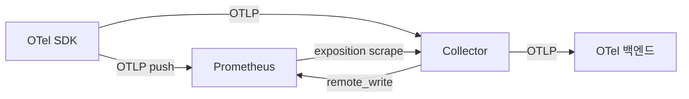
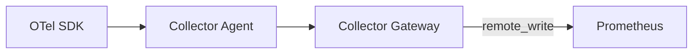
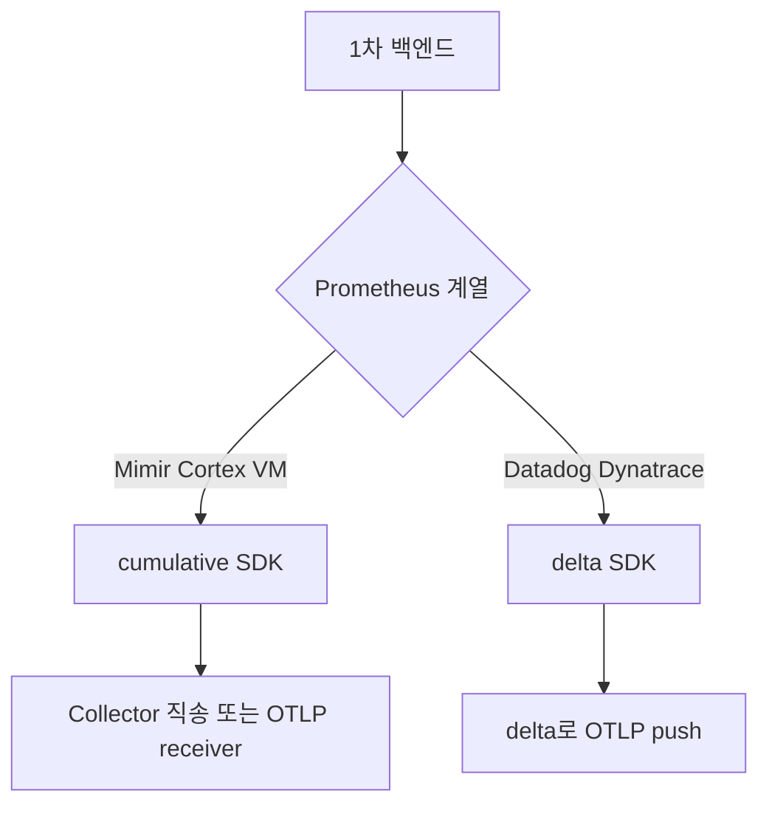

# Prometheus·OpenTelemetry

> **두 메트릭 표준의 수렴.** Prometheus는 pull·exposition format 중심,
> OpenTelemetry는 push·OTLP·SDK 중심으로 발전했다. 2025~2026년 두 진영은
> 의도적으로 가까워졌다 — Prometheus 3.x는 **OTLP receiver native
> 지원**, OTel은 **`prometheusremotewrite` exporter / Prometheus
> receiver** 양방향 변환을 안정화. 이 글은 4가지 상호운용 축, 메트릭
> 매핑 규칙, 운영 함정을 다룬다.

- **주제 경계**: 이 글은 **Prometheus와 OTel의 상호운용**을 다룬다.
  Prometheus 자체는 [Prometheus 아키텍처](../prometheus/prometheus-architecture.md)·
  [PromQL 고급](../prometheus/promql-advanced.md), OTel 자체는
  [OpenTelemetry 개요](opentelemetry-overview.md), Native·Exponential
  Histogram은 [전용 글](../metric-storage/exponential-histograms.md),
  Collector 파이프라인은 [OTel Collector](../tracing/otel-collector.md),
  exemplar는 [Exemplars](../concepts/exemplars.md) 참조.
- **선행**: [관측성 개념](../concepts/observability-concepts.md),
  Prometheus 기본 모델.

---

## 1. 왜 두 표준이 같이 살아남았나

| 측면 | Prometheus | OpenTelemetry |
|---|---|---|
| 수집 모델 | **pull** (scrape) 중심 | **push** (OTLP) 중심 |
| 데이터 모델 | text/protobuf exposition | protobuf (4신호 통합) |
| 메트릭 의미 | cumulative (`Counter`·`Gauge`·`Histogram`·`Summary`) | cumulative + **delta** 둘 다 |
| 라벨링 철학 | 작고 단단한 라벨 셋 | resource + scope + datapoint 3층 |
| 강점 | PromQL, 대규모 시계열 저장, alert | trace·log와 통합, vendor 독립 |

> **수렴의 결과**: Prometheus는 OTel의 데이터 모델·SemConv를 받아들이고,
> OTel은 Prometheus를 사실상 디폴트 메트릭 백엔드로 인정. 둘 중 하나만
> 쓰는 환경은 더 이상 표준 답이 아니다.

---

## 2. 4가지 상호운용 축



| 축 | 방향 | 사용 도구 |
|---|---|---|
| **A** | OTel SDK → Prometheus | Prometheus OTLP receiver (`--web.enable-otlp-receiver`) |
| **B** | OTel SDK → Collector → Prometheus | Collector `prometheusremotewrite` exporter |
| **C** | Prometheus exposition → Collector | Collector `prometheus` receiver (scrape) |
| **D** | Prometheus → OTLP 백엔드 | Prometheus `remote_write` v2 (OTLP) — 진행 중 |

대부분 환경은 **A 또는 B**. exporter 풀 모델이 깊이 박혀 있으면 **C** 추가.

---

## 3. 축 A — Prometheus가 OTLP를 직접 수신

Prometheus 2.55+ (3.x)에서 native OTLP receiver.

| 항목 | 값 |
|---|---|
| 활성화 | CLI 플래그 `--web.enable-otlp-receiver` (디폴트 OFF) |
| 엔드포인트 | `POST /api/v1/otlp/v1/metrics` |
| 프로토콜 | OTLP/HTTP (protobuf) |
| 안정성 | 2.55에서 GA, 3.x에서 native UTF-8 |

### 3.1 SDK 측 환경변수

OTel spec의 path 처리 규칙은 **base 변수와 per-signal 변수가 다르다**.

| 변수 | 동작 |
|---|---|
| `OTEL_EXPORTER_OTLP_ENDPOINT` (base) | SDK가 신호별 path를 **자동으로 덧붙임** (`/v1/metrics`, `/v1/traces`, `/v1/logs`) |
| `OTEL_EXPORTER_OTLP_METRICS_ENDPOINT` (per-signal) | 사용자가 지정한 URL을 **그대로 사용**, 자동 append 없음 |

```text
# 권장 패턴 1 — base 변수 + 자동 append
OTEL_EXPORTER_OTLP_PROTOCOL=http/protobuf
OTEL_EXPORTER_OTLP_ENDPOINT=http://prometheus:9090/api/v1/otlp
# 결과: 메트릭은 .../api/v1/otlp/v1/metrics 로 전송

# 권장 패턴 2 — per-signal 변수, 전체 path 명시
OTEL_EXPORTER_OTLP_METRICS_ENDPOINT=http://prometheus:9090/api/v1/otlp/v1/metrics
```

> **흔한 실수**: per-signal 변수에 `/v1/otlp` base만 적으면 SDK가 그대로
> POST → Prometheus `/api/v1/otlp` 404. base 변수를 쓰거나 전체 path 명시.

### 3.2 권장 prometheus.yaml 설정

```yaml
storage:
  tsdb:
    out_of_order_time_window: 30m

otlp:
  promote_resource_attributes:
    - service.name
    - service.namespace
    - service.instance.id
    - service.version
    - deployment.environment
    - k8s.namespace.name
    - k8s.pod.name
  translation_strategy: UnderscoreEscapingWithSuffixes
```

| 옵션 | 의미 |
|---|---|
| `out_of_order_time_window` | TSDB 전역 OOO 허용 창. push 모델은 다중 replica·재시도로 OOO 빈번 → 보통 30m. 큰 창 = WAL·메모리 비용 증가 — 트레이드오프 |
| `promote_resource_attributes` | resource attribute를 시계열 라벨로 승격. **명시 안 하면 `target_info` 메트릭에 갇혀 PromQL `join` 필요** |
| `translation_strategy` | OTel 점(`.`) → Prometheus 호환 변환 정책 |

### 3.3 보안

> **OTLP receiver는 인증 없이 공개되면 위변조·DoS 위험**. Prometheus는
> 기본 인증이 없어 의도적으로 default OFF. 운영 시:
> - **사이드카 nginx + Bearer token** 또는 mTLS 게이트웨이
> - 또는 Collector를 가운데 두고 Prometheus는 internal port만 노출

---

## 4. 축 B — Collector → Prometheus remote_write

Collector `prometheusremotewrite` exporter는 가장 검증된 경로.



| 측면 | 동작 |
|---|---|
| 변환 | OTLP metric → Prometheus remote_write protobuf |
| 라벨 | OTel resource → `target_info` + label promote |
| Histogram | OTel Explicit/Exponential Histogram → Prometheus classic·native |
| 안정성 | OTel Collector contrib에서 stable |

### 4.1 cumulativetodelta · deltatocumulative

| 시나리오 | 처리 |
|---|---|
| OTel SDK가 cumulative emit + Prometheus 수신 | **그대로 OK** |
| OTel SDK가 delta emit + Prometheus 수신 | **`deltatocumulative` processor 필수** |
| OTel SDK가 cumulative + Datadog 수신 | Collector `cumulativetodelta` processor |

> **권장**: SDK는 **cumulative** 디폴트 유지. delta가 필요한 백엔드만
> exporter 직전에 변환. 양쪽으로 가는 환경은 fork 시점에 정책 결정.

> **`prometheusremotewrite` exporter의 비-cumulative drop**: monotonic
> counter·histogram·summary가 delta로 들어오면 **drop**. SDK가 delta
> 디폴트(.NET 일부)로 시작했다면 즉시 cumulative로 변경하거나
> `deltatocumulative` 추가.

### 4.2 Remote Write v2 (PRW 2.0) — 현재 상태

| 측면 | 2026-04 시점 |
|---|---|
| Prometheus PRW v2 spec | **Experimental** (server receiver는 stable 진입 진행) |
| Native Histogram·exemplar·metadata 한 페이로드 | spec 정의 완료 |
| `created_timestamp`로 reset 정확 처리 | spec 정의 완료 |
| 압축 | snappy 디폴트, zstd는 **옵션** (receiver 호환 확인 필수) |
| Collector `prometheusremotewriteexporter` v2 | **In Development, partially implemented** ([contrib #33661](https://github.com/open-telemetry/opentelemetry-collector-contrib/issues/33661)) — 프로덕션 미권장 |

> **결론**: PRW v1을 default 유지. Mimir·Cortex·VictoriaMetrics가 v2
> 수신 stable이고, Collector exporter v2가 "Stable" 표기로 바뀐 시점
> 에 마이그레이션. 그때까진 v1 + classic/native histogram dual-emit이
> 검증된 조합.

---

## 5. 축 C — Collector가 Prometheus exposition scrape

기존 exporter (node-exporter·cadvisor·kube-state-metrics)는 OTel로 즉시
바뀌지 않는다 — Collector `prometheus` receiver가 scrape.

```yaml
receivers:
  prometheus:
    config:
      scrape_configs:
        - job_name: 'kubernetes-pods'
          kubernetes_sd_configs:
            - role: pod
```

| 동작 | 효과 |
|---|---|
| Prometheus exposition pull | 내부적으로 OTel metric으로 변환 |
| `_total`·`_count`·`_sum` suffix 정규화 | OTel Counter·Histogram으로 매핑 |
| job·instance 라벨 | OTel resource로 변환 |

> **함정 — 이중 수집**: 같은 exporter를 Prometheus 자체 scrape도 하고
> Collector도 scrape하면 **메트릭 중복**. 한 곳에서만.

> **service discovery**: Prometheus의 `kubernetes_sd_configs`·EC2 SD
> 등은 그대로 receiver 안에 사용 가능 — 기존 운영 자산 재활용.

---

## 6. 메트릭 매핑 — OTel ↔ Prometheus

### 6.1 Counter·Gauge·Histogram·Summary

| OTel | Prometheus | 비고 |
|---|---|---|
| **Sum (monotonic)** | Counter | `_total` suffix 자동 추가 |
| **Sum (non-monotonic)** | Gauge | 음수 가능 |
| **Gauge** | Gauge | 1:1 |
| **Histogram (Explicit)** | classic Histogram | `_bucket{le=...}`·`_count`·`_sum` 분리 |
| **Histogram (Exponential)** | **Native Histogram** | scale·zero_count 보존 ([전용 글](../metric-storage/exponential-histograms.md)) |
| **Summary** | Summary | quantile 라벨 |

### 6.2 Resource → Label

| OTel Resource attribute | Prometheus 매핑 |
|---|---|
| `service.name` + `service.namespace` | **`job`** 라벨 |
| `service.instance.id` | **`instance`** 라벨 |
| 기타 resource | `target_info{job, instance, ...}` 게이지 (값 1) |

> **`target_info`는 join용**: PromQL에서
> `up * on(job, instance) group_left(deployment_environment) target_info`
> 로 환경 정보 부착. 자주 쓰면 `promote_resource_attributes`로 직접 승격.

> **`target_info` OOO 함정**: pod restart로 같은 `service.instance.id`가
> timestamp drift된 채 다시 push되면 Prometheus가 OOO 거부 → join 대상
> 메트릭이 일시적으로 끊긴다 ([Prometheus #16063](https://github.com/prometheus/prometheus/issues/16063)).
> `out_of_order_time_window`로 완화하지만 근본 해결은 안 됨.

> **`promote_resource_attributes`는 와일드카드 미지원**: resource
> attribute 수십 개를 모두 자동 승격하는 옵션이 없다. 카디널리티 폭발
> 방지 차원에서 의도적인 설계 — 핵심 attribute만 명시.

### 6.3 Scope (instrumentation library)

| OTel | Prometheus 라벨 |
|---|---|
| `InstrumentationScope.name` | `otel_scope_name` |
| `InstrumentationScope.version` | `otel_scope_version` |
| Scope attribute | `otel_scope_*` prefix |

### 6.4 Unit·이름

| 입력 | 출력 |
|---|---|
| `By` (bytes) | `_bytes` suffix |
| `s` (seconds) | `_seconds` suffix |
| `m/s` | `_meters_per_second` |
| `{packet}` (브래킷 단위) | drop |
| `http.server.request.duration` (UCUM `s`) | `http_server_request_duration_seconds` |

> **점(`.`) 처리**: `http.server.request.duration` → translation_strategy
> 따라 `http_server_request_duration` (underscore 변환) 또는 그대로 (UTF-8
> mode). Prometheus 3.x는 UTF-8 metric name·label name 지원.

### 6.5 Exemplar

| OTel | Prometheus |
|---|---|
| Sample.attributes의 `trace_id`·`span_id` | exemplar의 `trace_id`·`span_id` 라벨 |
| 길이 | OpenMetrics 1.0 한도 128자 |

자세한 의미·운영은 [Exemplars](../concepts/exemplars.md).

---

## 7. UTF-8 metric name — Prometheus 3.x

| 항목 | 2.x | 3.x |
|---|---|---|
| 라벨 이름 | `[a-zA-Z_][a-zA-Z0-9_]*` | UTF-8 |
| 메트릭 이름 | `[a-zA-Z_:][a-zA-Z0-9_:]*` | UTF-8 |
| OTel name 그대로 보존 | 불가 — 변환 필요 | 가능 (translation_strategy: NoUTF8EscapingWithSuffixes) |

| translation_strategy | 동작 |
|---|---|
| `UnderscoreEscapingWithSuffixes` (디폴트) | `.` → `_` + unit/`_total` suffix. 2.x 호환 |
| `NoUTF8EscapingWithSuffixes` | `.` 보존. 3.x UTF-8 모드 |
| `NoTranslation` | 어떤 변환도 안 함. **EXPERIMENTAL — 같은 이름·다른 type/unit 충돌 시 데이터 손상**. 프로덕션 사용 금지 |

> **2.x→3.x 마이그레이션**: 동시 환경에서는 `UnderscoreEscapingWithSuffixes`
> 유지. PromQL·dashboard·alert rule이 모두 UTF-8 호환되면 전환.

---

## 8. delta vs cumulative — 결정 트리



| 백엔드 | 권장 SDK temporality |
|---|---|
| Prometheus·Mimir·Thanos·Cortex·VictoriaMetrics | **Cumulative** |
| Datadog·Dynatrace | Delta (혹은 cumulative + Collector cumulativetodelta) |
| 둘 다 (멀티 백엔드) | SDK cumulative + Collector에서 백엔드별 변환 |

> **언어 SDK 디폴트**:
> - Java/Python/Node SDK는 **cumulative** 디폴트
> - **.NET** 자동 계측은 일부 **delta** 디폴트 — 환경변수
>   `OTEL_EXPORTER_OTLP_METRICS_TEMPORALITY_PREFERENCE=cumulative` 권장

> **deltatocumulative processor**: 메모리에 직전 값을 보관해 누적 계산.
> Collector replica 분리 시 **stage 분리 + trace_id-like 키 hash** 필요.
> tail sampling과 비슷한 함정 ([OTel 개요 9.3](opentelemetry-overview.md#93-tail-sampling--load-balancing-exporter-패턴)).

---

## 9. Native Histogram ↔ Exponential / NHCB

Prometheus Native Histogram은 두 종류:

| 종류 | 약어 | 의미 |
|---|---|---|
| **Exponential Native** | (schema ≥ -8) | base 2 exponential — OTel Exponential과 1:1 |
| **Native with Custom Buckets** | **NHCB** (schema -53) | 사용자 지정 bucket을 Native 데이터 모델로. **OTel Explicit Histogram과 매칭** |

### 9.1 매핑 표

| OTel | Prometheus |
|---|---|
| Exponential Histogram | Exponential Native (직매핑, scale·zero_count 보존) |
| Explicit Histogram | classic Histogram (디폴트) 또는 **NHCB** (`convert_classic_histograms_to_nhcb` 활성 시) |

> **classic → NHCB 점진 전환**: 2026-02 Prometheus 블로그 "Modernizing
> Composite Samples"에서 강조. classic을 그대로 쓰는 기존 exporter도
> NHCB로 받으면 series 수 감소·쿼리 성능 향상. dual-emit이 필요 없는
> 마이그레이션 경로.

### 9.2 PromQL·Wire format

| 측면 | Native (둘 다) | classic |
|---|---|---|
| Wire format | PRW v2 protobuf 신규 메시지 | exposition `_bucket` 시리즈 분해 |
| PromQL | `histogram_quantile()` 동일 사용 |
| 시리즈 수 | 메트릭 1개 = series 1 | bucket 수만큼 series |

자세한 매핑·튜닝은 [Native·Exponential Histogram](../metric-storage/exponential-histograms.md).

> **3.x 마이그레이션 함정**: `scrape_classic_histograms`가
> **`always_scrape_classic_histograms`로 rename**. 2.x → 3.x 전환 시
> 옵션이 silently 무효화되어 dual-emit이 깨질 수 있다.

---

## 10. Job·Instance — staleness·target health

OTel push 모델의 가장 큰 함정.

| 측면 | Prometheus pull | OTel push |
|---|---|---|
| **target health** | `up` 메트릭 자동 — scrape 실패 시 0 | **자동 `up` 없음** — 어떻게 "사라진 instance"를 알 수 있나 |
| **staleness marker** | scrape 실패 → 명시적 stale | OTLP는 명시 stale 없음, 5분 후 자동 stale |
| **dedup** | 같은 series 중복 scrape는 정상 | 다중 replica가 같은 series push 시 **out_of_order** 또는 dedup 필요 |

### 10.1 target health 대안

| 방법 | 설명 |
|---|---|
| **Collector heartbeat** | Collector가 자체 health 메트릭 push (`otelcol_*`) |
| **service.instance.id 카운트** | `count by (job)(target_info)` — pod 수 모니터링 |
| **last seen 타임** | `time() - max(timestamp(metric)) by (instance)` |
| **explicit liveness probe** | K8s liveness + push 빈도 알림 |

> **5분 staleness rule**: Prometheus는 마지막 sample 후 5분 지나면 그
> series를 자동 stale 처리. push 메트릭도 동일 — push가 끊긴 instance의
> 메트릭은 5분 후 PromQL에서 보이지 않게 됨.

### 10.2 scrape interval vs export interval

| 모델 | 디폴트 |
|---|---|
| Prometheus scrape | **15s** (`scrape_interval`) |
| OTel SDK Periodic Reader | **60s** (`OTEL_METRIC_EXPORT_INTERVAL`) |

> **반드시 5분 미만**: export interval이 5분 이상이면 staleness rule에
> 걸려 series가 자주 사라진다. 60s 디폴트는 안전. 그러나 dashboard
> step·rate window·alert `for:` 절은 두 모델 간 차이를 반영해야 한다 —
> `rate(...[1m])`이 60s push에선 의미가 약하다 → `rate(...[5m])` 권장.

### 10.3 deltatocumulative OOM 위험

| 위험 | 설명 |
|---|---|
| in-memory 상태 | 모든 series의 직전 누적값을 메모리에 보관 |
| `max_streams` 디폴트 | max int (사실상 unbounded) |
| 카디널리티 폭발 시 | OOM 직격 |

> **운영 가이드**: `max_streams`를 **명시 한도**로 설정 + Collector
> `memory_limiter` 활성. delta 변환을 안 해도 되는 백엔드면 SDK를
> cumulative로 두는 편이 항상 안전. delta가 필수면 [load-balancing
> exporter](opentelemetry-overview.md#93-tail-sampling--load-balancing-exporter-패턴)
> + `routing_key: metric` 또는 attribute 기반 hash로 stage 분리.

---

## 11. 마이그레이션 — pull → push 점진 전환

| 단계 | 행동 |
|---|---|
| 1 | 기존 exporter는 **그대로 유지** (Prometheus가 직접 scrape) |
| 2 | 새 서비스만 OTel SDK + OTLP push 시작. Collector(agent)에서 받아 `prometheusremotewrite`로 |
| 3 | Resource attribute 4종(`service.name`·`service.namespace`·`service.version`·`deployment.environment`) 표준화 |
| 4 | `promote_resource_attributes` 명시 — `target_info` join 부담 제거 |
| 5 | classic histogram → Exponential Histogram (SDK 측) + Native Histogram (Prometheus 측) dual-emit. **3.x 옵션명 변경 주의**: `scrape_classic_histograms` → `always_scrape_classic_histograms`. 또는 `convert_classic_histograms_to_nhcb` 활성으로 NHCB 자동 변환 |
| 6 | Prometheus `--web.enable-otlp-receiver` 활성, Collector 우회 옵션 추가 (간단한 환경) |
| 7 | 기존 `node-exporter`·`cadvisor`도 Collector `prometheus` receiver로 흡수 (Pull 통일) |
| 8 | PromQL alert·dashboard를 OTel SemConv stable name 기준으로 점진 변경 (`http_request_duration_seconds` → `http_server_request_duration_seconds`) |

---

## 12. 안티패턴

| 안티패턴 | 결과 | 교정 |
|---|---|---|
| `--web.enable-otlp-receiver` 인증 없이 외부 노출 | 메트릭 위변조·DoS | mTLS·token, 사이드카 인증 |
| `out_of_order_time_window` 미설정 | 다중 replica push 시 drop | 30m 권장 |
| `promote_resource_attributes` 미설정 | 모든 쿼리가 `target_info` join 필요 | 핵심 attribute 명시 승격 |
| OTel SDK delta로 emit + Prometheus 직송 | 메트릭 drop | cumulative 또는 deltatocumulative |
| 같은 exporter를 Prometheus·Collector 둘 다 scrape | series 중복 | 한 곳만 |
| classic histogram + dense bucket | 카디널리티 폭발 | Exponential Histogram + Native |
| 이름에 `.` 보존하면서 PromQL alert는 underscore | 검색·alert 미작동 | translation_strategy 통일 |
| job·instance 안 붙이고 OTLP push | `up` 같은 patternfailure 미감지 | resource로 service.namespace + instance.id 강제 |
| OTLP receiver TLS off | 평문 전송 | TLS 강제 |
| Prometheus → OTel 백엔드 마이그레이션 시 PRW v1 그대로 | exemplar·native 누락 | PRW v2 사용 |
| `service.name`만 있고 `service.namespace` 없음 | `job` 라벨 충돌 | 둘 다 명시 |
| Collector replica 다수 + deltatocumulative | 누적 상태 분산 | hash 라우팅으로 같은 replica에 |
| `_total` suffix 수동 부여 | 중복 (`_total_total`) | SDK Counter 사용, suffix는 Prometheus가 |
| per-signal endpoint 변수에 base URL 적기 | 404 — 메트릭 누락 | base 변수 사용 (자동 append) 또는 전체 path 명시 |
| `NoTranslation` strategy 프로덕션 사용 | 같은 이름·다른 type 충돌 시 데이터 손상 | `UnderscoreEscapingWithSuffixes` 또는 `NoUTF8EscapingWithSuffixes` |
| OTel export interval > 5분 | staleness rule로 series 사라짐 | ≤ 60s 권장 |
| `deltatocumulative` `max_streams` 미설정 | OOM | 명시 한도 + memory_limiter |
| 3.x 업그레이드 시 `scrape_classic_histograms` 그대로 | dual-emit silent 무효 | `always_scrape_classic_histograms`로 rename |
| zstd compression을 receiver 호환 미확인 채 활성 | 페이로드 거부 | snappy 디폴트 유지, receiver 확인 후 zstd |

---

## 13. 운영 체크리스트

- [ ] 단일 진실 정의 — SDK temporality (cumulative 권장) 정책 문서화
- [ ] `--web.enable-otlp-receiver` 활성 시 인증 게이트웨이
- [ ] `out_of_order_time_window: 30m`
- [ ] `promote_resource_attributes` 핵심 attribute 명시
- [ ] PRW v1 default 유지, v2 exporter는 stable 표기 시점에 마이그레이션
- [ ] Native Histogram + Exponential Histogram dual-emit
- [ ] target health 모니터링 — `target_info` count 또는 collector heartbeat
- [ ] translation_strategy 일관 (대규모 환경은 `UnderscoreEscapingWithSuffixes` 유지)
- [ ] 같은 exporter는 한 곳만 scrape
- [ ] `service.name`·`service.namespace`·`service.instance.id` 모두 SDK resource에
- [ ] exemplar 활성 — `EnableExemplars=true` (SDK)
- [ ] OTel `host_metrics` receiver와 Prometheus `node-exporter`의 중복 점검
- [ ] PromQL alert·dashboard의 metric name이 OTel SemConv stable과 정합
- [ ] OTel SDK export interval ≤ 60s (5분 staleness 안전 마진)
- [ ] rate window는 push interval의 4× 이상 (`rate(...[5m])` over 60s push)
- [ ] `deltatocumulative` processor 사용 시 `max_streams` 한도 + memory_limiter
- [ ] `target_info` OOO 발생 시 `out_of_order_time_window` 점검
- [ ] 3.x로 업그레이드 시 `always_scrape_classic_histograms` 옵션명 점검
- [ ] `absent_over_time(metric[10m])`로 instance 사라짐 alert

---

## 참고 자료

- [Prometheus — Using Prometheus as your OTel backend](https://prometheus.io/docs/guides/opentelemetry/) (확인 2026-04-25)
- [OTel — Prometheus and OpenMetrics Compatibility](https://opentelemetry.io/docs/specs/otel/compatibility/prometheus_and_openmetrics/) (확인 2026-04-25)
- [OTel Blog — Prometheus and OpenTelemetry Better Together](https://opentelemetry.io/blog/2024/prom-and-otel/) (확인 2026-04-25)
- [Collector contrib — prometheusremotewrite exporter](https://github.com/open-telemetry/opentelemetry-collector-contrib/blob/main/exporter/prometheusremotewriteexporter/README.md) (확인 2026-04-25)
- [Collector contrib — prometheus receiver](https://github.com/open-telemetry/opentelemetry-collector-contrib/blob/main/receiver/prometheusreceiver/README.md) (확인 2026-04-25)
- [Prometheus Remote Write 2.0 spec](https://prometheus.io/docs/specs/prw/remote_write_spec_2_0/) (확인 2026-04-25)
- [PromCon 2024 — Prometheus 3.0 Native Histograms](https://prometheus.io/blog/2024/11/14/prometheus-3-0/) (확인 2026-04-25)
- [Prometheus 3.x UTF-8 Names](https://prometheus.io/docs/concepts/data_model/#metric-names-and-labels) (확인 2026-04-25)
- [Collector contrib — deltatocumulative processor](https://github.com/open-telemetry/opentelemetry-collector-contrib/tree/main/processor/deltatocumulativeprocessor) (확인 2026-04-25)
- [OTel SDK Configuration — Metrics](https://opentelemetry.io/docs/languages/sdk-configuration/otlp-exporter/) (확인 2026-04-25)
