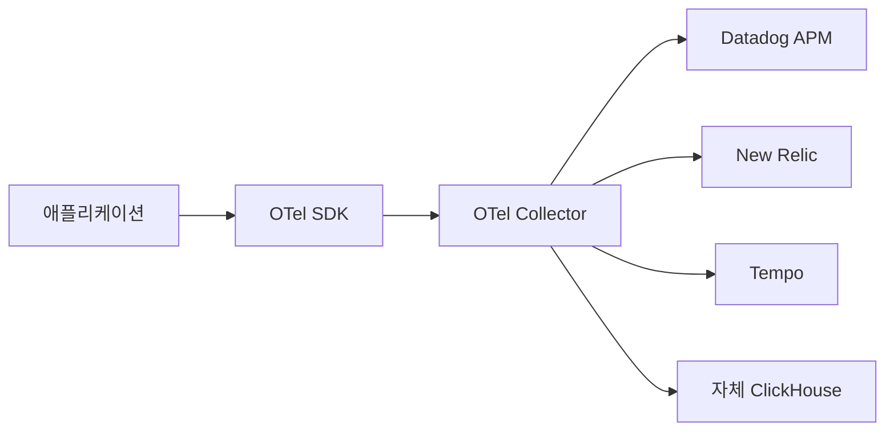

# APM과 관측성

> **APM**(Application Performance Monitoring)은 OTel이 등장하기 전부터
> 애플리케이션 계층 관측을 책임져 온 도구 카테고리다. 2026년 시점에
> APM은 사라진 게 아니라 **관측성의 한 계층**으로 흡수되었고,
> OpenTelemetry가 그 **공통 입력 규격**이 되었다.

- **주제 경계**: 이 글은 APM **용어와 위치**를 정리한다. 트레이스
  도구는 [Jaeger·Tempo](../tracing/jaeger-tempo.md), 프로파일은
  [연속 프로파일링](../profiling/continuous-profiling.md), RUM은
  [Synthetic 모니터링](../rum-synthetic/synthetic-monitoring.md).
- **선행**: [관측성 개념](observability-concepts.md), [Semantic
  Conventions](semantic-conventions.md), [Exemplars](exemplars.md).

---

## 1. APM이란 무엇이었나

### 1.1 정의 (Gartner 출신)

> APM은 **애플리케이션의 가용성과 성능을 사용자 관점에서 측정·진단**
> 하는 도구 카테고리. Gartner의 정의는 5가지 차원을 포함한다:
> ① End User Experience Monitoring(EUM/RUM·Synthetic),
> ② Runtime Application Architecture, ③ Business Transaction,
> ④ Deep Dive Component Monitoring(코드/메서드 레벨),
> ⑤ Analytics·Reporting.

핵심 차별점은 **트랜잭션 단위 분석**이다. 옛 모니터링이 호스트·프로세스
지표였다면 APM은 **요청 한 건의 코드 경로**를 따라간다.

### 1.2 세대별 진화

| 세대 | 시기 | 대표 | 특징 |
|---|---|---|---|
| 1세대 | 2000년대 초 | Wily Introscope, 옛 BMC | JVM 바이트코드 계측 |
| 2세대 | 2008~2015 | AppDynamics, New Relic, Dynatrace | 자동 계측, SaaS, BTM |
| 2세대 OSS 분파 | 2010 후반 | Pinpoint, Scouter, SkyWalking, Stagemonitor | OSS, 한국·중국에서 활약 |
| 3세대 | 2019~ | Datadog APM, Honeycomb, Lightstep | 트레이스 중심, 분산 시스템 |
| 4세대 (수렴) | 2022~ | OTel 표준 + 다양한 백엔드 | **계측은 OTel, 백엔드는 선택** |

> 한국 사용자에게 익숙한 **Pinpoint**(NAVER, 2012 개발 시작 → 2015년
> OSS 공개)와 **Scouter**(LG CNS, 2015)는 2세대 OSS 분파의 대표격.
> 자체 에이전트 + 자체 UI 구조로 JVM 호환성에 강점이 있었다.

---

## 2. 옛 APM과 OTel — 무엇이 같고 다른가

### 2.1 같은 것: "트랜잭션을 따라간다"

| 옛 APM 용어 | OTel 용어 |
|---|---|
| Transaction (BTM) | Trace |
| Call (또는 Method 호출) | Span |
| Snapshot, Sample | Trace + Exemplar |
| End User Action | Root Span (HTTP server) |
| Database Call | DB Client Span |
| External Call | HTTP Client Span |
| Error Rate, Apdex | Error Rate, SLO |
| Throughput | Traffic (Golden Signal) |

> 같은 개념을 다르게 부르고 있을 뿐이다. 단, 옛 APM은 **자체 데이터
> 모델·자체 와이어 포맷·자체 백엔드**가 한 묶음이라 마이그레이션이
> 어려웠다.

### 2.2 다른 것: 데이터 모델의 개방성

| 항목 | 옛 APM | OTel |
|---|---|---|
| 데이터 모델 | 벤더 독자 | 공개 표준(SemConv) |
| 와이어 포맷 | 벤더 바이너리 | OTLP |
| 에이전트 | 벤더 SDK | OTel SDK·자동 계측 |
| 백엔드 | 동일 벤더만 | 임의 OTel 호환 |
| 가격 | 호스트당·트랜잭션당 | 백엔드 자유 |

> 핵심: **계측은 OTel로 통일**, **백엔드는 갈아끼울 수 있다**. 이게
> 옛 APM 시대와의 결정적 차이.

---

## 3. APM이 다루는 다섯 영역과 OTel 매핑

### 3.1 EUM/RUM — End User Monitoring

브라우저·모바일에서 실제 사용자 경험 측정.

| 측정 대상 | OTel 매핑 |
|---|---|
| Page Load Time | OTel Web SDK 자동 계측 |
| Core Web Vitals (LCP·INP·CLS) | OTel JavaScript SDK + Web Vitals attributes |
| JS 에러 | OTel Logs / Span Event |
| 사용자 세션 | Resource attributes(`session.id`) |

> RUM은 OTel 전환이 가장 늦은 영역. 2024~2026년에 **OTel JS SDK**가
> 안정화되며 가속.

### 3.2 Distributed Tracing

옛 APM의 **BTM**(Business Transaction Management)이 분산 시스템으로
일반화된 형태.

| 옛 APM 기능 | OTel 구현 |
|---|---|
| 트랜잭션 그룹화 | `service.name` + `http.route` |
| Slow Transaction 분석 | `histogram_quantile` + Exemplar |
| External Call 분리 | Span Kind=CLIENT |
| 에러 분류 | `exception.type`, Span Status=ERROR |

자세한 내용은 [Trace Context](../tracing/trace-context.md),
[샘플링 전략](../tracing/sampling-strategies.md).

### 3.3 Code-level Profiling

옛 APM의 **Deep Dive**는 메서드 단위 호출 시간 통계. 2026년에는
**연속 프로파일링**(Continuous Profiling)으로 진화.

| 옛 방식 | 현재 |
|---|---|
| 의심 시점에 thread dump | 항상 켜진 샘플링 프로파일러 |
| 자체 viewer (DAtree, Pinpoint) | Pyroscope·Parca + Flamegraph |
| 단일 프로세스 | trace_id로 분산 trace와 연결 |

자세한 내용은
[연속 프로파일링](../profiling/continuous-profiling.md).

### 3.4 Database / External Call

| 옛 APM 화면 | OTel SemConv |
|---|---|
| SQL Time Top N | `db.client.operation.duration` + `db.statement` exemplar |
| Slow Query 캡처 | DB Span + `db.query.text`(정규화) |
| 외부 API 응답 | Client HTTP Span + status_code |

### 3.5 비즈니스 트랜잭션·Apdex

옛 APM은 **Apdex**(Application Performance Index, 0~1) 점수를 단일
KPI로 즐겨 썼다. 현대는 **SLO + Burn Rate**로 대체.

| 옛 KPI | 현대 대체 |
|---|---|
| Apdex (T 임계 + 4T) | SLO 99.9% & Latency p99 < X |
| Stall Rate | Error Rate (Golden Signal) |
| 응답시간 평균 | p50·p99·p999 분포 |

> Apdex 공식: `(Satisfied + Tolerating/2) / Total`. T 이내는 만족,
> T~4T는 관용, 4T 초과·실패는 0점. 분포의 꼬리를 가리는 한계로
> SLO·분위수 기반으로 옮긴 게 표준.

---

## 4. 벤더 락인 종식 — 2026 시장 변화

### 4.1 OTel이 일으킨 시장 충격

전통 APM 벤더의 가장 큰 자산은 **자체 계측 SDK + 자체 백엔드의
잠금 효과**였다. OTel이 이 둘을 분리하면서:

| 변화 | 결과 |
|---|---|
| 계측 SDK 표준화 | 벤더 SDK 차별점 약화 |
| 데이터 자체가 중립 | 백엔드 갈아타기 비용 ↓ |
| 백엔드 경쟁 심화 | 가격·UX·분석 깊이로 차별화 |
| 비용 가시성 요구 | 호스트·custom metric 단가에 대한 협상력 ↑ |

### 4.2 벤더 대응 정리

| 벤더 | 2026 OTel 대응 |
|---|---|
| **New Relic** | "APM + OpenTelemetry Convergence" GA, OTel 시그널 First-class |
| **Datadog** | OTLP 수신 정식 지원, "Custom Metric" 단가 이슈 지속 |
| **Dynatrace** | OneAgent + OTel 동시 지원. **Smartscape**(자동 토폴로지) · **PurePath**(코드 레벨 트랜잭션)를 OTel 위에서 재구성 중 |
| **Honeycomb** | OTel-native 출범 → Wide events 모델 |
| **Splunk** | Observability Cloud로 OTel 흡수, **SignalFx receiver deprecated** |
| **Elastic** | Elastic APM Agent → OTel SDK 일치화 진행 |
| **Grafana Labs** | Beyla를 OTel에 기증 → **OBI**(OpenTelemetry eBPF Instrumentation) Beta(KubeCon EU 2026-04) |

> 가장 큰 트렌드: **벤더 SDK는 점차 OTel 호환 계층**으로 변모, 자체
> SDK는 deprecated 또는 유지보수 모드.

### 4.3 비용 모델의 재편

전통 APM 가격 = **호스트당 + 사용자당 + 트랜잭션 단위**가 일반적.
OTel 시대에는 **수집 GB + 보관 GB + 쿼리량**이 일반적.

| 항목 | 옛 APM | OTel SaaS |
|---|---|---|
| 호스트 단가 | 있음 | 점차 폐지 |
| Custom Metric | 메트릭당 별도 단가 | 카디널리티 기반 |
| 트레이스 | 트랜잭션당 | GB·샘플링 비율 |
| 데이터 보관 | 7~30일 | 옵션화(7d / 30d / 1y) |

자세한 비용 분석은 [관측 비용](../cost/observability-cost.md).

### 4.4 OTel의 현실적 한계 — 2026.04 시점

"OTel이 모든 것을 해결한다"는 신화에 반대되는 사실들:

| 한계 | 영향 |
|---|---|
| **Profiles는 Public Alpha**(2026-03~) | OSS 스택의 trace ↔ profile 연결은 GA 전 |
| **Logs SemConv 안정화 지연** | 로그 attribute 호환은 메트릭·트레이스 대비 미흡 |
| **자동 계측 커버리지 격차** | Java/Node/Python > Go/Rust |
| **OTLP 와이어 표준 ≠ attribute 의미 호환** | 백엔드 간 같은 키여도 해석·집계 정책 다를 수 있음 |
| **Wide Events 직접 지원 안 함** | OTel은 Logs로 감지만, Honeycomb 같은 백엔드 모델로의 자연 매핑은 별도 설계 필요 |
| **벤더 SDK 수준의 깊이 일부 미흡** | Smartscape처럼 토폴로지 자동 생성은 백엔드 책임 |

> 정책: **표준은 OTel로 가되, 한계는 인지하고 백엔드에서 보완**한다.

---

## 5. AIOps와 APM의 관계

옛 APM 4세대(2024~)부터 모든 메이저 벤더가 **AIOps**(이상 탐지·자동
RCA·LLM 챗) 기능을 합쳤다.

| 벤더 | AIOps 자산 |
|---|---|
| Datadog | Watchdog, Bits AI |
| Dynatrace | Davis AI |
| New Relic | New Relic AI |
| Splunk | ITSI, AI Assistant |
| Honeycomb | Query Assistant |

OTel 시대에도 **데이터 표준화는 AIOps의 입력 품질을 끌어올린다**.
SemConv가 통일되면 모델·룰이 서비스 간 이식 가능해진다. 단, AIOps의
**거짓 양성·블랙박스 위험**은 여전히 운영 리스크. 자세한 도구 평가
기준은 [AIOps 개요](../aiops/aiops-overview.md).

---

## 6. APM에서 OTel로 — 마이그레이션 패턴

### 6.1 단계별 패턴

| 단계 | 내용 | 기간 |
|---|---|---|
| 1. Dual Pipeline | OTel SDK 추가, 옛 에이전트 유지 | 1~3개월 |
| 2. 백엔드 평가 | OTel 데이터로 신규 백엔드 PoC | 1개월 |
| 3. 절반 이전 | 비핵심 서비스부터 OTel only | 3~6개월 |
| 4. 전체 이전 | 옛 에이전트 제거 | 6~12개월 |

### 6.2 흔한 마이그레이션 함정

| 함정 | 결과 | 처방 |
|---|---|---|
| 옛 대시보드를 그대로 SemConv 키로 옮김 | 빈 화면 | 키 매핑 테이블 + 변환 |
| 옛 알림 임계치 그대로 | 새 메트릭 단위 다름 | 임계치 재산정 |
| 옛 APM 식별자를 trace_id로 가정 | trace 매칭 실패 | OTel trace_id 표준화 |
| 자동 계측 라이브러리 누락 | 일부 span 누락 | 안정도별로 분리된 instrumentation 리포 사용 |
| 옛 RUM과 백엔드 trace_id 불일치 | 사용자 → 백엔드 점프 안 됨 | W3C TraceContext 전파 |

### 6.3 코드 변경 없는 경로 — 무침투 계측

옛 APM과 OTel 시대의 결정적 차이 중 하나가 **zero-code 계측 옵션의
다양화**다.

| 방식 | 동작 | 한계 |
|---|---|---|
| 바이트코드 인스트루멘테이션 | JVM·.NET 런타임에 후킹 | Go·Rust 등 컴파일 언어에 약함 |
| Operator 기반 사이드카 주입 | K8s에서 init container/SDK 자동 부착 | 컨테이너 환경 한정 |
| **eBPF 기반 계측** | 커널·유저공간 무침투 관찰 | L4-L7 가시성, 코드 레벨 깊이 ↓ |

| 환경 | 무코드 OTel 도입 |
|---|---|
| K8s | OTel Operator로 자동 주입 (Java·Python·.NET·Node·Go) |
| Linux 서비스 | OBI(OTel eBPF Instrumentation, 구 Beyla), Pixie |
| 서버리스 | Lambda Layer / Cloud Run sidecar |

> 트레이드오프: eBPF는 **앱 재배포 0**이지만 코드 레벨 변수·함수
> 인자는 못 본다. 깊은 진단은 SDK 자동 계측, 무침투 보조는 eBPF.
> 자세한 구현은
> [OTel Operator](../cloud-native/otel-operator.md),
> [eBPF 관측](../ebpf/ebpf-observability.md).

---

## 7. 의사결정 — 옛 APM을 유지할 때 vs 떠날 때

### 7.1 유지가 합리적인 경우

- 라이선스가 이미 5년 단위로 묶여 있음
- 옛 APM의 특정 화면(예: Pinpoint Servermap, Dynatrace Smartscape)이
  팀 워크플로의 핵심
- OTel auto-instrumentation 미지원 레거시 런타임

### 7.2 OTel로 떠나는 게 합리적인 경우

- **데이터 자체에 대한 통제권**이 컴플라이언스 요건
- 데이터 거주(EU·한국 등) 요건으로 자체 백엔드 필요
- 멀티 벤더 백엔드를 두고 싶음(메트릭은 Mimir, trace는 SaaS 등)
- 비용 가시성·예측가능성이 우선
- 벤더 가격 인상에 협상력이 필요
- 신규 마이크로서비스 비중 ≥ 50%

### 7.3 추천 표준 셋트(2026)

| 영역 | OSS 자체 운영 | SaaS |
|---|---|---|
| 계측 | OTel SDK | OTel SDK (벤더 SDK 지양) |
| 수집 | OTel Collector | OTel Collector |
| 메트릭 | Prometheus + Mimir | Datadog · NR · Grafana Cloud |
| 트레이스 | Tempo · Jaeger | Honeycomb · Datadog APM |
| 로그 | Loki · ClickHouse | Datadog Logs · Splunk |
| 프로파일 | Pyroscope · Parca | Polar Signals · Datadog Profiler |

> 저장 레이어가 갈리더라도 **계측·수집은 항상 OTel**이 정답.

---

## 8. 흔한 실수

| 실수 | 결과 | 처방 |
|---|---|---|
| OTel과 벤더 SDK 둘 다 켜기 | trace 중복·이중 계측 | 한 번에 하나만 |
| Apdex만 SLO로 옮기기 | 분포 꼬리 가림 | Latency 분위수 + Error 분리 |
| RUM을 잊기 | 백엔드만 통합, 사용자 경험 누락 | OTel JS SDK 함께 |
| trace_id 형식 불일치 | 점프 끊김 | W3C 32-byte hex 표준 |
| 옛 알림 그대로 이식 | 임계치 의미 바뀜 | 단위·SemConv 재검토 |
| 자동 계측 의존 100% | 비즈니스 로직 단계 누락 | manual span 일부 추가 |

---

## 9. 다음 단계

- [Trace Context](../tracing/trace-context.md) — W3C 표준
- [샘플링 전략](../tracing/sampling-strategies.md) — Head vs Tail
- [Jaeger·Tempo](../tracing/jaeger-tempo.md) — 트레이스 백엔드
- [연속 프로파일링](../profiling/continuous-profiling.md) — Deep Dive 후속
- [Synthetic 모니터링](../rum-synthetic/synthetic-monitoring.md) — EUM
- [관측 비용](../cost/observability-cost.md)

---

## 참고 자료

- [What is OpenTelemetry — opentelemetry.io](https://opentelemetry.io/docs/what-is-opentelemetry/) (2026-04 확인)
- [New Relic APM + OpenTelemetry Convergence — APMdigest](https://www.apmdigest.com/new-relic-apm-agents-now-offer-enhanced-opentelemetry-compatibility)
- [From chaos to clarity — CNCF (2025-11)](https://www.cncf.io/blog/2025/11/27/from-chaos-to-clarity-how-opentelemetry-unified-observability-across-clouds/)
- [2026 Observability Predictions — APMdigest](https://www.apmdigest.com/2026-observability-predictions-6)
- [Observability Trends 2026 — IBM](https://www.ibm.com/think/insights/observability-trends)
- [Top Observability Tools in 2026 — Uptrace](https://uptrace.dev/tools/top-observability-tools)
- [OpenTelemetry eBPF Instrumentation (OBI) — KubeCon EU 2026](https://opentelemetry.io/blog/2026/obi-beta/)
- [Splunk SignalFx receiver deprecated](https://help.splunk.com/en/splunk-observability-cloud/manage-data/available-data-sources/supported-integrations-in-splunk-observability-cloud/opentelemetry-receivers/signalfx-receiver-deprecated)
- [Dynatrace OneAgent and OpenTelemetry](https://docs.dynatrace.com/docs/ingest-from/dynatrace-oneagent/oneagent-and-opentelemetry/configuration)
- [Apdex Specification](https://www.apdex.org/specs/)
- [Pinpoint](https://github.com/pinpoint-apm/pinpoint), [Scouter](https://github.com/scouter-project/scouter) — 한국 OSS APM
- Gartner, *Magic Quadrant for Observability Platforms* (2024+)
