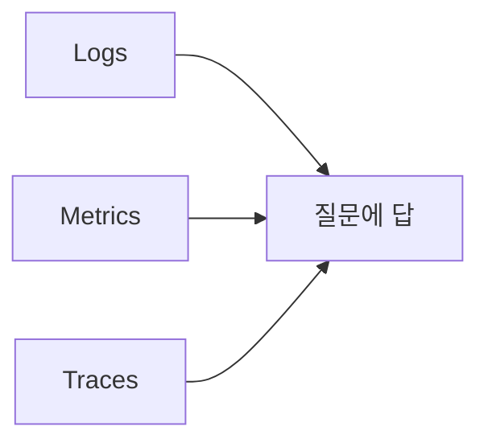
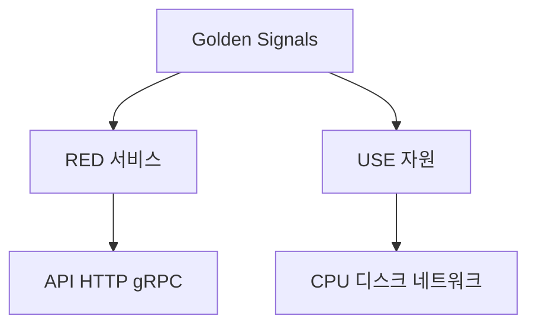
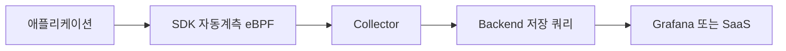

# 관측성 개념

> "보이지 않으면 고칠 수 없다." 관측성(Observability)은 **모니터링의
> 진화형**이 아니라 **다른 질문에 답하는 도구**다. 모니터링이 "알려진
> 실패"를 감시한다면, 관측성은 **사전에 정의하지 않은 질문**을 시스템
> 외부에서 던질 수 있는 능력이다(Charity Majors, *Observability
> Engineering*).

- **주제 경계**: 이 글은 관측성의 **개념 지도**를 정리한다. 도구별 구현은
  뒤따르는 글에서, SLO·에러 버짓 같은 운영 수학은 [`sre/`](../../sre/)에서
  다룬다.
- **혼동 주의**: "4 Signals"라는 용어는 **두 가지 전혀 다른 의미**로
  쓰인다. ① OpenTelemetry의 텔레메트리 4종(Logs·Metrics·Traces·Profiles),
  ② Google SRE의 4 Golden Signals(Latency·Traffic·Errors·Saturation).
  이 글은 둘을 분리해서 설명한다.
- **관측성의 3축**: 본문 전반에서 다음 구분을 사용한다.
  - **계측(Instrumentation)** — 데이터를 만드는 곳 (SDK · 자동 계측 · eBPF)
  - **수집·가공(Collector·Pipeline)** — 라우팅·변환·샘플링하는 곳
  - **저장·쿼리(Backend)** — 보관하고 답하는 곳

---

## 1. 모니터링 vs 관측성 — 무엇이 다른가

| 구분 | 모니터링(Monitoring) | 관측성(Observability) |
|---|---|---|
| 출발점 | 사전에 정의한 임계치·대시보드 | 시스템이 만든 텔레메트리 |
| 답하는 질문 | "이 지표가 정상인가?" | "왜 그런 일이 일어났나?" |
| 미지의 문제 | 잡지 못함(unknown unknowns) | 사후 탐색으로 잡음 |
| 카디널리티 | 낮음(미리 정의된 라벨) | 높음(임의 차원 분해) |
| 데이터 모델 | 사전 집계된 지표 | 원시 이벤트 + 인덱스 |

> 모니터링은 **결과**를 보고, 관측성은 **원인**을 묻는다. 둘은 배타적이지
> 않다. 운영 시스템에는 양쪽이 모두 필요하다.

관측성은 **제어이론** 용어에서 빌려왔다. "시스템 외부에서 출력만으로
내부 상태를 추론할 수 있는가"가 원의(原義)다. 분산 시스템에서는 모든
상태를 출력으로 노출하기가 불가능하므로, **얼마나 효율적으로 추론할
수 있는가**의 정도 문제로 바뀐다.

---

## 2. 3 Pillars의 기원과 그 한계

### 2.1 3 Pillars란

2017년경 업계에서 "관측성 = Logs · Metrics · Traces 세 기둥"이라는
설명이 빠르게 퍼졌다. Cindy Sridharan의 *Distributed Systems
Observability*(O'Reilly) 책이 이 표현을 대중화했다. 관측성의 원의(原義)는
1960년 Kálmán이 제어이론에서 정의한 "출력만으로 내부 상태를 추론할 수
있는 정도"였고, Charity Majors가 *Observability Engineering* 1장에서
이 정의를 분산 시스템에 다시 가져왔다.



- **Logs**: 이벤트의 텍스트 기록(언제·무엇이)
- **Metrics**: 시간 시계열로 집계된 수치
- **Traces**: 분산 요청 경로의 인과 관계

### 2.2 Charity Majors의 비판

Charity Majors(Honeycomb 공동창업자)는 2025년에 다시 한 번 정리하며,
"3 Pillars는 마케팅 용어이지 기술 용어가 아니다"라고 못 박았다.
핵심 비판:

1. **데이터 사일로를 정당화한다** — 같은 이벤트를 세 곳에 다른
   포맷으로 저장하면 비용이 늘 뿐 아니라 **drift**(필드·라벨의 점진적
   불일치)가 누적되어 시그널 간 신뢰가 깨진다
2. **상관관계가 끊긴다** — 메트릭 대시보드의 스파이크와 로그 파일의
   ERROR가 같은 요청인지 인덱스로 이어주지 못한다(이게 본질, 비용은
   부산물)
3. **High Cardinality 질문에 답하지 못한다** — 사전 집계된 메트릭은
   "user_id=42, region=ap-northeast-2의 99분위"를 사후에 못 묻는다

대안으로 그가 제시한 것이 **Observability 2.0** = "넓은 구조화 이벤트
하나(wide events)에 모든 차원을 담고, 사후에 임의로 분해(slice)한다"는
모델이다. 이 글의 §6에서 다시 다룬다.

### 2.3 그래도 3 Pillars가 살아남은 이유

- 도구 시장이 **이미 셋으로 분화**되어 있어 인지 모델이 강하다
  (Prometheus·Loki·Tempo, Datadog Metrics·Logs·APM 등)
- 운영 팀의 일상 워크플로(대시보드·로그 조회·트레이스 검색)가
  분리돼 있다
- OpenTelemetry조차 **시그널 단위로 스펙을 안정화**하면서 분리 모델을
  강화했다

---

## 3. OpenTelemetry의 시그널 4종

OpenTelemetry는 2026년 현재 **네 가지 시그널**을 정의한다. **Pillar가
아닌 Signal**이라는 용어를 의도적으로 쓴다.

| 시그널 | 데이터 모델 | 안정화 상태(2026.04) | 대표 용도 |
|---|---|---|---|
| **Traces** | Span 트리 | Stable, LTS | 요청 인과 관계 |
| **Metrics** | 시계열(누적·게이지·히스토그램) | Stable | 시계열 KPI |
| **Logs** | 구조화 이벤트 | Stable | 컨텍스트 풍부한 사건 |
| **Profiles** | pprof 기반 샘플 | **Public Alpha**(2026.03) | CPU·메모리 핫스팟 |

> Profiles 시그널은 **2026년 3월 26일 Public Alpha 진입**, GA는 Q3 2026이
> 커뮤니티 목표(KubeCon EU 2026 세션 발표). Pyroscope·Parca·Polar Signals가
> OTel Profiles 스펙으로 수렴하는 중이다. 자세한 내용은
> [연속 프로파일링](../profiling/continuous-profiling.md).

### 3.3 Metrics 노출 포맷 — OpenMetrics

Metrics 시그널은 데이터 모델만으로는 부족하고 **노출 포맷(exposition
format)**이 필요하다. 표준은 **OpenMetrics**(CNCF Incubating, 2018~)로,
Prometheus의 텍스트 포맷을 IETF 호환 표준으로 일반화한 규격이다.

| 포맷 | 위치 |
|---|---|
| Prometheus exposition | 사실상 표준, 모든 SDK가 emit |
| OpenMetrics | Prometheus의 상위 호환, Exemplar·Native Histogram 정의 |
| OTLP | OTel의 바이너리(gRPC/HTTP) 와이어 포맷 |

> OpenMetrics ≡ Prometheus → OTel 메트릭 간 상호운용 계약. **Exemplar**
> (메트릭→트레이스 다리)도 OpenMetrics가 처음 정의했다. 자세한 내용은
> [Exemplars](exemplars.md).

### 3.1 시그널 간 상호 참조

OTel의 진짜 가치는 시그널 간 **컨텍스트 전파**다. 같은 요청은 어디서
보든 동일한 `trace_id`·`span_id`를 가진다.

```mermaid
flowchart LR
  Req[HTTP 요청] --> Trace[span_id 부여]
  Trace --> Log[로그에 trace_id]
  Trace --> Metric[메트릭 exemplar]
  Trace --> Profile[프로파일 샘플 태그]
```



- 메트릭의 **Exemplar**가 트레이스로 점프하는 다리가 된다
  ([Exemplars](exemplars.md) 참고)
- 로그의 `trace_id`·`span_id` 필드로 트레이스 → 로그 정밀 조회
- Profile 샘플은 `span_id`로 태깅되어 "이 RPC가 느렸을 때 CPU는 어디
  있었나"를 묻는다

### 3.2 Events 시그널은 별도가 아니다

한때 "Events"가 다섯 번째 시그널 후보로 거론됐으나, 2024년 결정으로
**Logs의 일부**로 흡수됐다. `event.name` 속성이 붙은 Log 레코드가
Event다. 시그널 수를 늘리지 않은 것은 OTel의 의도된 선택이다.

---

## 4. 4 Golden Signals — 무엇을 측정할 것인가

이건 **데이터 모델이 아니라 측정 대상**의 문제다. Google SRE Book
(*Monitoring Distributed Systems* 챕터)이 제시한 "유저 지향 시스템
모니터링의 최소 셋트".

| 시그널 | 정의 | 측정 단위 |
|---|---|---|
| **Latency** | 요청 처리 시간 | p50·p95·p99·p999 |
| **Traffic** | 시스템에 들어오는 부하 | RPS, QPS, msg/s |
| **Errors** | 실패한 요청의 비율 | 4xx·5xx, 비즈니스 실패 |
| **Saturation** | 자원이 얼마나 가득 찼나 | CPU·MEM·queue depth |

### 4.1 흔한 실수

- **성공 지연만 측정**: 에러 응답이 빠를수록 평균 지연이 좋아 보인다
  → 성공/실패 분리 측정 필수
- **평균값**: 평균 지연은 분포의 꼬리(tail latency)를 가린다
  → 분위수(percentile) 사용
- **Saturation 누락**: CPU 50%지만 큐 길이가 100이면 이미 포화
  → "한계까지 얼마나 남았나"가 본질

### 4.2 RED Method (서비스용)

Tom Wilkie(Grafana)가 마이크로서비스용으로 단순화한 변형.

| 시그널 | 의미 |
|---|---|
| **Rate** | 초당 요청 수 |
| **Errors** | 실패한 요청 수 |
| **Duration** | 요청 처리 시간 |

= Golden Signals에서 **Saturation을 뺀** 것. 트래픽 핸들링 마이크로
서비스에 잘 맞고, 인프라 자원 측정은 다른 지표로 보충한다.

### 4.3 USE Method (자원용)

Brendan Gregg가 호스트·서브시스템 진단용으로 제시.

| 시그널 | 의미 |
|---|---|
| **Utilization** | 자원 사용률 |
| **Saturation** | 추가 작업이 큐에 쌓인 정도 |
| **Errors** | 자원 단위 에러 |

= **CPU·디스크·네트워크 같은 인프라 자원**에 적용. 서비스 RED와 자원
USE를 함께 보는 게 표준이다.

### 4.4 셋의 관계



> Golden Signals는 **상위 개념**, RED는 그중 서비스 측면, USE는 자원
> 측면. 함께 사용하는 게 정상이다.

### 4.5 Golden Signals → SLI → SLO 연결

| 층위 | 무엇 | 관할 카테고리 |
|---|---|---|
| **Golden Signals** | 어떤 측정 대상을 고를 것인가 | `observability/` |
| **SLI** | 그 측정값을 사용자 경험으로 정의 | `observability/`(계측)·`sre/`(정의) |
| **SLO** | SLI에 목표·기간·에러 버짓 부여 | `sre/` |
| **알림 룰·Burn Rate** | SLO 위반 감지·페이지 | `observability/`·`sre/` |

> Golden Signals(예: 99분위 지연)는 **SLI 후보군**이다. SLI는 "성공의
> 정의"이고 SLO는 "그 SLI의 목표치·기간". SLO 수학과 에러 버짓 분배는
> [`sre/`](../../sre/), 룰 자동 생성은
> [SLO as Code](../slo-as-code/slo-rule-generators.md).

---

## 5. 데이터가 흐르는 길 — 계측 · Collector · Backend

시그널 종류·측정 대상이 정해져도, **데이터가 어디서 만들어져 어디로
흐르는가**가 빠지면 운영 의사결정이 닫히지 않는다. OTel Specification의
최상위 목차 자체가 이 흐름을 따른다.



### 5.1 계측(Instrumentation) 모델

| 방식 | 설명 | 장단점 |
|---|---|---|
| **Manual SDK** | 코드에서 명시적으로 span·metric 생성 | 정밀하나 도입 비용 큼 |
| **Auto-instrumentation** | 라이브러리 훅으로 자동 계측 | 표준 라이브러리 80% 커버 |
| **Zero-code (Operator)** | K8s에서 사이드카·init으로 주입 | 코드 변경 0, 언어 제약 |
| **eBPF** | 커널·유저공간을 외부에서 관측 | 무침투, 라벨 풍부도 ↓ |
| **Library instrumentation** | DB·HTTP 라이브러리가 OTel 직접 emit | 의존성 줄지만 보급 진행 중 |

> 자세한 K8s 자동 계측은 [OTel Operator](../cloud-native/otel-operator.md),
> eBPF 관측은 [eBPF 관측](../ebpf/ebpf-observability.md)에서.

### 5.2 OTel Collector — 시그널 파이프라인의 중추

Collector는 **Receivers → Processors → Exporters** 파이프라인을
시그널별로 구성한다.

| 컴포넌트 | 역할 | 예시 |
|---|---|---|
| Receiver | 입력 수집 | OTLP, Prometheus scrape, Filelog, Hostmetrics |
| Processor | 가공·필터·샘플링 | batch, attributes, tail_sampling, redaction |
| Exporter | 백엔드로 전송 | Prometheus RW, Loki, Tempo, Datadog, Kafka |

Collector를 두는 이유:

- **벤더 락인 차단** — 백엔드 변경이 Exporter 교체로 한정
- **샘플링·정규화·PII 제거** 같은 정책을 인프라 한 곳에서 적용
- **버퍼링·재시도·백프레셔**로 백엔드 장애에서 앱 분리

자세한 운영 패턴은 [OTel Collector](../tracing/otel-collector.md).

### 5.3 Backend 선택의 분기

| 축 | OSS 자체 운영 | 벤더 SaaS |
|---|---|---|
| 메트릭 | Prometheus + Mimir/Thanos/VictoriaMetrics | Datadog, New Relic |
| 로그 | Loki, Elastic, ClickHouse | Datadog Logs, Splunk |
| 트레이스 | Tempo, Jaeger | Datadog APM, Honeycomb |
| Wide events | ClickHouse·SigNoz·HyperDX | Honeycomb, Axiom |

> 핵심: **계측·수집은 OTel로 통일**하고, 저장·쿼리만 갈아끼우는 게
> 2026년 표준 패턴.

---

## 6. Pillar vs Signal — 용어 정리

OTel·Charity Majors가 강조하는 핵심 구분:

| 용어 | 성격 | 누가 쓰는가 |
|---|---|---|
| **Pillar** | 마케팅 용어 | 벤더, 영업 자료 |
| **Signal** | 기술 용어 | OTel 스펙, SRE Book |

> "Profiling을 Pillar로 부르면 비싸게 팔 수 있다"는 게 Charity의
> 풍자다. 기술 문서는 **Signal**을 쓴다.

또 하나의 용어 충돌: 본 글에서 "**4 Signals**"는 두 의미가 모두 통용된다.

- OTel 문맥: Logs · Metrics · Traces · Profiles (데이터 종류)
- SRE 문맥: Latency · Traffic · Errors · Saturation (측정 대상)

문서를 읽을 때 **어떤 4 Signals인지** 항상 확인한다.

---

## 7. Observability 2.0 — Wide Events

Charity Majors가 *Observability Engineering*(O'Reilly)과 후속 글에서
제시한 차세대 모델.

### 7.1 핵심 아이디어

> 서비스 인스턴스가 처리한 **요청 한 건당** 모든 컨텍스트를 담은
> **하나의 구조화 이벤트**(wide event)를 남긴다. 사후에 어떤 차원
> (user_id, region, build_sha, feature_flag 상태…)으로든 분해할
> 수 있다.

```json
{
  "timestamp": "2026-04-25T09:13:21Z",
  "trace_id": "4bf9...",
  "span_id": "00f0...",
  "service.name": "checkout",
  "http.route": "/v1/orders",
  "http.request.method": "POST",
  "http.response.status_code": 500,
  "duration_ms": 412,
  "exception.type": "PaymentDeclined",
  "user.id": "u_842",
  "cloud.region": "ap-northeast-2",
  "service.version": "9a1b2c",
  "feature_flag.key": "new_pricing",
  "feature_flag.variant": "on",
  "db.operation.batch.size": 7,
  "db.client.operation.duration": 0.281
}
```

> 이 예시는 OTel **Semantic Conventions** 키로 정렬했다. 키 표준의
> 전체 목록·버전 안정성 정책은 다음 글
> [Semantic Conventions](semantic-conventions.md).

이 한 이벤트가 **로그·메트릭·트레이스의 입력**이 된다. 메트릭은
이 이벤트를 그룹화·집계해 만들고, 트레이스는 `trace_id`로 묶어 만들고,
로그는 그대로 보존한다.

### 7.2 무엇이 다른가

| 항목 | 1.0 (3 Pillars) | 2.0 (Wide Events) |
|---|---|---|
| 데이터 저장 | 시그널별 사일로 | 단일 이벤트 스토어 |
| 카디널리티 | 비용 폭발(시계열) | 컬럼나 인덱스로 흡수 |
| 미지의 질문 | 사전 정의해야 답함 | 사후 분해 가능 |
| 비용 모델 | 시계열·로그 라인별 | 이벤트당 + 컬럼 압축 |

> 구현체는 두 갈래로 나뉜다. **OSS·자체 운영**: ClickHouse·DuckDB
> 위의 SigNoz·HyperDX(ClickStack)·Polar Signals(메트릭/프로파일).
> **SaaS**: Honeycomb·Axiom·Datadog Flex Logs·Splunk Observability
> Cloud. §5.3의 분기와 동일하게 **계측은 OTel로 공통**, 저장/쿼리
> 레이어만 갈린다.

### 7.3 Wide Events ↔ 샘플링 트레이드오프

Wide Events는 본질적으로 "가능하면 다 보관"의 극단이고, 그 반대편에
**샘플링**이 있다.

| 전략 | 비용 | 미지의 질문 응답력 |
|---|---|---|
| 100% Wide Events | 높음 | 최상 |
| Tail-based 샘플링 | 중간 | 흥미 트레이스 보존 |
| Head-based 확률 샘플링 | 낮음 | 특이 사례 누락 |
| 메트릭만 + 샘플 트레이스 | 매우 낮음 | unknown unknowns 한계 |

> 운영에서는 **둘을 섞는다**. 핵심 도메인은 wide event로 보관, 외곽은
> tail sampling으로 비용 통제. 샘플링 상세는
> [샘플링 전략](../tracing/sampling-strategies.md).

### 7.4 함정

- 이벤트당 수십~수백 필드를 만들면 **비용이 다시 폭발**한다
  → 무엇을 wide로 둘지 설계 필요
- **PII**가 이벤트에 섞여 들어가기 쉽다
  → 수집 단계에서 마스킹·해싱
- 메트릭 수준의 **빠른 대시보드 응답**은 별도 사전 집계 필요
  → 컬럼 스토어 + Recording Rules 같은 사전 집계의 결합

---

## 8. 도입 시 의사결정 — 어디서 시작할 것인가

### 8.1 단계별 권장 경로

| 단계 | 우선 도입 | 이유 |
|---|---|---|
| 1 | Golden Signals + 메트릭 | 사고 감지의 최소선 |
| 2 | 구조화 로그 + trace_id 필드 | 사후 조사·상관관계 |
| 3 | 분산 트레이싱 | 마이크로서비스 인과 |
| 4 | Exemplars 연동 | 메트릭→트레이스 다리 |
| 5 | Continuous Profiling | 효율·비용 최적화 |
| 6 | Wide Events 도입 | unknown unknowns 대응 |

### 8.2 도구 선택의 분기점

- **계측 표준**: 신규는 무조건 **OpenTelemetry**가 정답.
  벤더 SDK는 점차 OTel 호환을 의무화하는 추세
- **저장 레이어**(§5.3 표 참고)는 시그널별로 갈아끼울 수 있게 둔다
- **Collector 위치**: 사이드카(앱 옆) · DaemonSet(노드별) · Gateway
  (중앙 집중) — 트래픽·격리 요구에 따라 선택

---

## 9. 흔한 안티패턴

| 안티패턴 | 왜 문제인가 | 처방 |
|---|---|---|
| 메트릭만 잘 만들고 끝 | 미지의 문제는 못 잡음 | 로그·트레이스 상관관계 |
| 모든 로그를 INFO로 저장 | 비용 폭발, 노이즈 | 우선순위 샘플링 |
| 평균 지연만 본다 | 꼬리 지연 사고 놓침 | p99·p999 |
| Trace ID 누락 | 시그널 간 점프 불가 | OTel SDK 자동 전파 |
| 카디널리티 무제한 | 시계열 DB OOM | 라벨 가드레일 |
| Saturation 누락 | 갑작스런 한계 | 큐 깊이·conn pool |

자세한 도구별 가이드는 [카디널리티 관리](../metric-storage/cardinality-management.md),
[로그 운영 정책](../logging/log-operations.md)에서.

---

## 10. 다음 단계

- [Semantic Conventions](semantic-conventions.md) — 시그널 간 일관성을
  만드는 OTel 표준 속성
- [Exemplars](exemplars.md) — 메트릭에서 트레이스로 점프하는 다리
- [APM과 관측성](apm-overview.md) — 옛 APM이 OTel 시대로 수렴하는 흐름
- [Prometheus 아키텍처](../prometheus/prometheus-architecture.md)
- [관측 비용](../cost/observability-cost.md)

---

## 참고 자료

- [Observability primer — OpenTelemetry](https://opentelemetry.io/docs/concepts/observability-primer/) (2026-04 확인)
- [Signals — OpenTelemetry](https://opentelemetry.io/docs/concepts/signals/) (2026-04 확인)
- [OpenTelemetry Profiles Enters Public Alpha (2026-03-26)](https://opentelemetry.io/blog/2026/profiles-alpha/)
- [Specification Status Summary — OpenTelemetry](https://opentelemetry.io/docs/specs/status/) (2026-04 확인)
- [OpenTelemetry Collector — 공식 문서](https://opentelemetry.io/docs/collector/) (2026-04 확인)
- [OpenMetrics 스펙](https://github.com/prometheus/OpenMetrics) (CNCF Incubating)
- [Logs Event API — OpenTelemetry Specification](https://opentelemetry.io/docs/specs/otel/logs/event-api/)
- [Monitoring Distributed Systems — Google SRE Book](https://sre.google/sre-book/monitoring-distributed-systems/)
- [The USE Method — Brendan Gregg](https://www.brendangregg.com/usemethod.html)
- [The RED Method — Tom Wilkie / Grafana Labs](https://grafana.com/blog/2018/08/02/the-red-method-how-to-instrument-your-services/)
- [Charity Majors, "How many pillars of observability can you fit on the head of a pin?"](https://charity.wtf/2025/10/30/the-pillar-is-a-lie/) (2025-10)
- [Charity Majors, *Observability 2.0*](https://charity.wtf/tag/observability-2-0/)
- Charity Majors, Liz Fong-Jones, George Miranda, *Observability Engineering* (O'Reilly, 2022)
- Cindy Sridharan, *Distributed Systems Observability* (O'Reilly, 2018)
