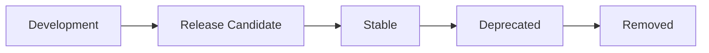

# Semantic Conventions

> **Semantic Conventions**(이하 **SemConv**)은 OpenTelemetry가 정의하는
> **공통 속성 키·값 체계**다. 같은 속성을 부르는 이름이 라이브러리·언어·
> 백엔드마다 다르면 텔레메트리는 검색·집계 가능한 데이터가 되지 못한다.
> SemConv는 그 **공통 어휘**다.

- **주제 경계**: 이 글은 **표준 자체와 운영 정책**을 다룬다. 개별
  속성의 전수 목록은 [공식 SemConv 1.40](https://opentelemetry.io/docs/specs/semconv/)
  참조.
- **선행**: [관측성 개념](observability-concepts.md)에서 다룬 OTel 시그널
  4종(Logs · Metrics · Traces · Profiles)의 **속성층** 표준이 SemConv다.

---

## 1. 왜 표준이 필요한가

### 1.1 일관성의 가치

| 시나리오 | SemConv 없을 때 | SemConv 있을 때 |
|---|---|---|
| HTTP 상태 필드 | `status`, `http.status`, `httpStatusCode` 혼재 | `http.response.status_code`로 통일 |
| 서비스 이름 | `app`, `service`, `serviceName` | `service.name` |
| K8s Pod | `pod`, `k8s_pod`, `pod_name` | `k8s.pod.name` |
| DB 호출 | `db_op`, `query_type`, `database.action` | `db.operation.name` |
| 백엔드 쿼리 | 도구마다 다른 키로 작성 | 한 번 작성, 어디서든 동작 |

> **드리프트 → 신뢰 붕괴**. 키 이름이 일관되지 않으면 대시보드·알림이
> 새 마이크로서비스가 추가될 때마다 깨진다.

### 1.2 SemConv가 해결한 비용

- **벤더 락인 방어**: SDK가 OTel SemConv로 emit → 백엔드 교체 시
  대시보드·알림 수정 0
- **언어 간 통일**: Go 서비스의 `service.name`과 Python 서비스의
  `service.name`이 같은 의미
- **자동 계측 호환**: HTTP 라이브러리 자동 계측이 표준 속성을 만들면
  벤더 SDK 없이도 즉시 차원 분석 가능

---

## 2. 적용 범위 — 다섯 영역

| 영역 | 대표 속성 | 예시 |
|---|---|---|
| **Resource** | 텔레메트리 송신 주체의 고정 속성 | `service.name`, `k8s.pod.name` |
| **Trace** | Span의 작업 의미 | `http.route`, `db.system.name` |
| **Metric** | 시계열 메트릭 이름·단위·라벨 | `http.server.request.duration` |
| **Log** | LogRecord의 속성·이벤트 이름 | `event.name`, `exception.type` |
| **Profile** | 프로파일 샘플의 컨텍스트 | `thread.id`, `process.executable.name` |

각 키는 **"이름 + 데이터 타입 + 권장 단위 + 안정성 등급"**까지 표준화된다.
단순 명명 규칙이 아니라 **계약**이다.

---

## 3. 안정성 라이프사이클

OTel SemConv는 속성 단위로 **개발 → RC → 안정** 단계를 거친다.



| 단계 | 의미 | 변경 가능성 |
|---|---|---|
| **Development** | 실험적 도입 | 자유롭게 변경, 깨질 수 있음 |
| **Release Candidate** | 곧 안정화 | 하위 호환 깨는 변경은 **고지 후만** |
| **Stable** | 1.x 안정 보장 | 하위 호환 깨지 않음(LTS) |
| **Deprecated** | 폐지 예고 | 일정 기간 병행 emit |
| **Removed** | 제거 | SDK 새 버전에서 사라짐 |

### 3.1 2026.04 기준 주요 영역의 상태

| 영역 | 상태 | 비고 |
|---|---|---|
| HTTP | **Stable** | v1.23.0(2024-02)에서 안정화. v1.20→1.23에서 `http.method` → `http.request.method` 등 breaking change |
| Resource(`service.*`) | **Stable** | 거의 모든 백엔드가 의존 |
| Database | **RC** | 1.40에서 Stable 후보 |
| Kubernetes | **RC**(2026.03) | 피처 게이트로 시범 운영 |
| Messaging | RC | Kafka·SQS·RabbitMQ 등 |
| GenAI | **Development** | LLM·에이전트 spans/metrics |
| Feature Flag | Development | OpenFeature와 정렬 중 |
| Profiles | Development | Public Alpha와 함께 진행 |

> 운영 경고: **Development** 속성 키만 사용하는 대시보드/알림은
> 다음 릴리스에서 깨질 수 있다. 같은 의미의 stable 키와 **병행 emit**
> 권장.

> 용어 변천: 2025년 OTel 안정화 정책 개정으로 종전 **"Experimental"**이
> **"Development"**로 리네이밍됐고 RC 단계가 추가됐다. 옛 SDK·문서는
> 여전히 "experimental"이라 표기할 수 있는데 의미는 동일하다.

---

## 4. 명명 규칙

### 4.1 점 표기 + 네임스페이스

```
service.name
service.namespace
service.version
http.request.method
http.response.status_code
db.system.name
k8s.pod.name
exception.type
```

규칙 요약:

- 소문자, 단어는 점(`.`)으로 분리
- 같은 도메인은 같은 prefix 공유 (`http.*`, `k8s.*`)
- 약자는 그대로(`db`, `k8s`, `http`)
- 단위는 키에 명시하지 않음(`duration` 키 + 단위 메타데이터로)

### 4.2 데이터 타입과 카디널리티

| 타입 | 예 | 카디널리티 주의 |
|---|---|---|
| string | `service.name` | 고정 셋트만 |
| int/double | `http.response.status_code` | 코드/그룹은 OK |
| boolean | `feature_flag.evaluation.success` | 안전 |
| string[] | `http.request.header.<key>` | 동적 키 주의 |

> **카디널리티 폭발의 90%는 SemConv 위반**에서 시작한다. `user.id`를
> 메트릭 라벨로 쓰면 안 되는 이유는
> [카디널리티 관리](../metric-storage/cardinality-management.md).

---

## 5. Resource — 송신 주체의 정체

`Resource`는 텔레메트리를 만든 **엔티티의 고정 속성**이다. 매 신호마다
emit되지 않고, **SDK 초기화 시 한 번** 결정된다.

### 5.1 필수에 가까운 Resource 속성

| 속성 | 의미 |
|---|---|
| `service.name` | 서비스 식별자(없으면 `unknown_service`) |
| `service.namespace` | 멀티팀 환경의 그룹 |
| `service.version` | 배포 식별 (Git SHA·SemVer) |
| `service.instance.id` | 인스턴스/Pod 단위 식별 |
| `deployment.environment.name` | prod·staging·dev |
| `host.name`·`host.id` | 노드 |
| `k8s.namespace.name`·`k8s.pod.name`·`k8s.deployment.name` | K8s |
| `cloud.provider`·`cloud.region`·`cloud.availability_zone` | CSP |
| `telemetry.sdk.name`·`telemetry.sdk.version` | SDK 자체 |

> `service.name`이 비어 있으면 SDK는 `unknown_service:<process.executable.name>`
> 으로 fallback. **누락 시 디버깅 시간 30분 이상**.

### 5.2 Resource Detector

OTel Collector·SDK는 환경에서 자동으로 Resource를 채운다.

| Detector | 채우는 속성 |
|---|---|
| EC2 | `cloud.*`, `host.id` |
| EKS·GKE·AKS | `cloud.*`, `k8s.cluster.name` |
| K8s Downward API | `k8s.pod.*`, `k8s.namespace.name` |
| OTel Operator(K8s) | `k8s.*` 자동 주입 + SDK 환경변수 |
| Process | `process.pid`, `process.executable.name` |
| OS | `os.type`, `os.version` |

운영 패턴: **앱 → SDK Detector** + **Collector → Resource Processor**
중복 적용. 앱이 누락해도 Collector에서 보강.

### 5.3 충돌 시 우선순위 — Collector resource processor

같은 키가 여러 단계에서 emit되면 **마지막 가공 단계가 이긴다**.
Collector `resource`/`attributes` processor의 액션이 정책을 결정한다.

| 액션 | 동작 |
|---|---|
| `insert` | 키가 없을 때만 추가 |
| `update` | 키가 있을 때만 덮어쓰기 |
| `upsert` | 있으면 덮어쓰기, 없으면 추가 |
| `delete` | 키 제거 |

> 흔한 사고: 앱이 정확한 `service.version`을 emit했는데 Collector에서
> 옛 값으로 `upsert`해 덮어써버리는 경우. 결과: 카나리 메트릭이 잘못된
> 버전으로 집계. 정책: **Collector는 `insert`로 보강만, 덮어쓰기는
> 명시적 의도일 때만**.

### 5.4 `service.instance.id` 생성 규칙

운영에서 자주 잘못 쓰는 속성. 권장 정책:

| 환경 | 권장 값 |
|---|---|
| K8s | `k8s.pod.uid` (Downward API) |
| VM | `host.id` 또는 systemd machine-id |
| 일반 프로세스 | UUID v4를 SDK 시작 시 생성 |

> **재시작마다 다른 값**이어야 한다. 같은 값을 영속화하면 메트릭에서
> "재시작 전후가 동일 인스턴스"로 잘못 집계. 반대로 매 요청마다
> 바뀌면 카디널리티 폭발.

---

## 6. 시그널별 핵심 SemConv

### 6.0 SpanKind와 Span Status — 속성 이전의 계약

SemConv는 키 이름 외에도 **언제 어떤 SpanKind/Status를 쓸지**까지
규정한다. 같은 HTTP 5xx여도 SpanKind에 따라 Status 처리가 다르다.

| SpanKind | 의미 | 예 |
|---|---|---|
| `SERVER` | 외부 → 자기 서비스 진입 | HTTP 핸들러 |
| `CLIENT` | 자기 서비스 → 외부 호출 | HTTP/DB 클라이언트 |
| `PRODUCER` | 메시지 비동기 발행 | Kafka producer |
| `CONSUMER` | 메시지 비동기 수신 | Kafka consumer |
| `INTERNAL` | 내부 함수 경계 | 라이브러리 내부 |

| Span Status | 언제 |
|---|---|
| `OK` | 명시적으로 성공 표기(드물게 사용) |
| `UNSET` | 기본값. SemConv가 ERROR로 명시 안 한 경우 |
| `ERROR` | SemConv가 정의한 실패 상황 |

> HTTP 4xx의 Status 정책: **Server span은 UNSET**(클라이언트 잘못),
> **Client span은 ERROR**(클라이언트 호출 실패). 5xx는 양쪽 모두
> ERROR. 이 규정을 어기면 에러율 메트릭이 의미를 잃는다.

### 6.1 HTTP (Stable)

| 속성 | 타입 | 예 |
|---|---|---|
| `http.request.method` | string | `GET`, `POST` |
| `http.route` | string | `/users/:id` (라우트 템플릿) |
| `http.response.status_code` | int | `200`, `503` |
| `url.full` | string | `https://api.example.com/v1/users/42` |
| `server.address`·`server.port` | | 서버 측 |
| `client.address` | | 클라이언트 측 |
| `network.protocol.name`·`network.protocol.version` | | `http`, `1.1`/`2`/`3` |

> `http.route` 핵심 — **실제 URL이 아니라 라우트 템플릿**(`/users/:id`).
> 그렇지 않으면 카디널리티 폭발.

### 6.2 메트릭 이름과 단위

| 메트릭 | 단위 | 비고 |
|---|---|---|
| `http.server.request.duration` | s (Histogram) | UCUM 표준 단위 |
| `http.client.request.duration` | s | |
| `db.client.operation.duration` | s | RC |
| `messaging.client.published.messages` | `{message}` | 무차원 |
| `system.cpu.utilization` | 1 | 0..1 비율 |

> 단위는 **UCUM**(Unified Code for Units of Measure)을 따른다.
> `s`·`By`·`bit`·`1`(무차원 비율) 등. 함정: 퍼센트는 `%`이지만 OTel은
> **0~1 비율을 `1`로 표기**하는 게 권장이다(예: `system.cpu.utilization`).
> Counter 메트릭의 `_total` 접미사는 **OTel 자체에는 없고** Prometheus
> exporter가 변환 시 자동 추가한다.

### 6.3 Database (RC)

```yaml
db.system.name: "postgresql"
db.namespace: "orders_prod"
db.operation.name: "SELECT"
db.collection.name: "orders"
db.query.text: "SELECT * FROM orders WHERE id = $1"
db.response.status_code: "00000"
```

> `db.query.text`는 **민감 정보가 섞일 수 있다**. Collector의
> attribute processor로 정규화·마스킹 권장.

### 6.4 Exceptions

| 속성 | 의미 |
|---|---|
| `exception.type` | 예외 클래스/종류 |
| `exception.message` | 메시지 |
| `exception.stacktrace` | 스택 트레이스(다중 라인 string) |

> Span의 `recordException()` 호출이 위 속성을 부착한 Span Event를 만든다.

### 6.6 Baggage — SemConv가 정의하지 않는 영역

**Baggage**(W3C Baggage 헤더)는 RPC 경계를 가로질러 전파되는
key-value지만 자동으로 Span 속성이 되지는 않는다. SemConv는 Baggage
표준 키를 정의하지 않는다.

| 항목 | Trace Context | Baggage | SemConv |
|---|---|---|---|
| 무엇 | 인과 관계(`trace_id`, `span_id`) | 임의 KV 전파 | 속성 키 표준 |
| 표준 위치 | W3C Trace Context | W3C Baggage | OTel SemConv |
| 자동 감지 | 모든 SDK | 명시적 사용 | SDK·계측 라이브러리 |

> 실무 패턴: Baggage로 받은 `tenant.id`를 **Span Processor에서
> SemConv 키 형태로 attribute에 부착**한다. PII가 Baggage에 실리지
> 않게 정책으로 강제. 자세한 내용은
> [Trace Context](../tracing/trace-context.md).

### 6.5 Logs (Event)

`event.name`이 있는 Log 레코드 = OTel Event.

```json
{
  "event.name": "feature_flag.evaluation",
  "feature_flag.key": "checkout.new_pricing",
  "feature_flag.variant": "on",
  "feature_flag.provider.name": "OpenFeature"
}
```

---

## 7. 발전 중인 영역

### 7.1 Kubernetes (RC, 2026-03)

K8s 속성은 **2026년 3월 RC로 승격**. 1.x 안정 버전이 2026 하반기 예상.

| 속성 | 의미 |
|---|---|
| `k8s.cluster.name`·`k8s.cluster.uid` | 클러스터 |
| `k8s.namespace.name` | 네임스페이스 |
| `k8s.pod.name`·`k8s.pod.uid` | 파드 |
| `k8s.deployment.name`·`k8s.statefulset.name`·`k8s.daemonset.name` | 워크로드 |
| `k8s.container.name`·`k8s.container.restart_count` | 컨테이너 |
| `k8s.node.name`·`k8s.node.uid` | 노드 |

### 7.2 GenAI (Development)

LLM·에이전트 관측의 사실상 표준. 진행 중이지만 빠르게 채택되는 중.

| 속성 | 의미 |
|---|---|
| `gen_ai.system` | `openai`, `anthropic`, `vertex` 등 |
| `gen_ai.request.model` | 요청 모델 |
| `gen_ai.usage.input_tokens`·`gen_ai.usage.output_tokens` | 토큰 |
| `gen_ai.operation.name` | `chat`, `embeddings`, `text_completion` |

> 안정화 전이라 **breaking change 가능**. SDK 옵션
> `OTEL_SEMCONV_STABILITY_OPT_IN=gen_ai_latest_experimental`로 최신
> 버전 emit 강제.

### 7.3 Feature Flag (Development)

[OpenFeature](https://openfeature.dev) 프로젝트와 정렬 중.

| 속성 | 의미 |
|---|---|
| `feature_flag.key` | 플래그 키 |
| `feature_flag.variant` | 평가 결과 변형 |
| `feature_flag.provider.name` | 평가 제공자 |
| `feature_flag.context.id` | 평가 컨텍스트(사용자 등) |

> 카나리 분석·실험 결과 결합의 핵심. Feature Flag 도구 자체는
> [`cicd/`](../../cicd/) 카테고리.

---

## 8. Schema URL — 버전 마이그레이션

SemConv는 한 번 stable이라도 **장기적으로 breaking change**가 일어난다
(예: HTTP 1.20 vs 1.23 키 변경). OTel은 이를 **schema URL**로 해결한다.

```
schema_url = "https://opentelemetry.io/schemas/1.40.0"
```

각 텔레메트리는 자기가 따른 SemConv **버전**을 알린다. Collector는
`schema` 변환 규칙으로 옛 키를 새 키로 바꿀 수 있다.

| 상황 | 처리 |
|---|---|
| 앱은 1.30, 백엔드는 1.40 | Collector가 1.30 → 1.40 변환 |
| 라이브러리 자동 계측이 옛 키 emit | Schema URL이 있으면 변환 가능 |
| Schema URL 누락 | 변환 불가, 키 혼재 |

> **모든 신규 SDK 초기화 시 schema URL을 명시**한다. 누락은 미래
> 마이그레이션 비용.

### 8.1 OTEL_SEMCONV_STABILITY_OPT_IN

특정 영역의 stable 전환 중에 **이전 버전 키도 같이 emit**해서 대시보드
호환을 지키는 환경 변수.

```bash
# HTTP만 새 키 emit (마이그레이션 완료 후 권장)
OTEL_SEMCONV_STABILITY_OPT_IN=http

# HTTP는 새 키 + 옛 키 둘 다 (마이그레이션 기간 한정)
OTEL_SEMCONV_STABILITY_OPT_IN=http/dup

# GenAI 최신 실험 버전
OTEL_SEMCONV_STABILITY_OPT_IN=gen_ai_latest_experimental
```

> `dup` 모드의 트레이드오프: **속성 수와 메트릭 시계열이 사실상
> 2배**가 되어 비용·카디널리티가 늘어난다. **마이그레이션 기간만
> 사용**하고, 대시보드·알림이 새 키로 옮겨지면 즉시 `http`로 전환한다.

### 8.2 Schema 변환의 한계

이론상 Collector의 schema 변환이 자동 마이그레이션을 해주지만,
실제로는 **2026.04 시점 schema processor가 미성숙**해서 모든 breaking
change를 자동으로 못 따라간다. 안전한 운영 정책:

- 새 SDK 버전은 **carve-out 단위**(서비스 1~2개)로 먼저 적용
- `dup` 모드를 일정 기간 운영하며 양쪽 키 보존
- 대시보드 마이그레이션 완료 후 `dup` 해제

---

## 9. 운영 정책 — 팀 단위 적용

### 9.1 표준 정책 4가지

1. **Resource 최소 셋트 강제** — `service.name`, `service.version`,
   `deployment.environment.name`, `service.instance.id`. CI에서 부재 시
   배포 차단
2. **카디널리티 가드레일** — `user.id`·`request.id` 같은 무한 차원은
   메트릭 라벨에서 금지, 로그·트레이스 속성으로만 허용
3. **PII 정규화** — Collector `attributes` processor에서 마스킹·해싱·
   삭제. `db.query.text`는 normalize
4. **Schema URL 명시** — SDK 초기화 시 hardcode

### 9.2 사내 커스텀 속성

표준에 없는 도메인 속성은 **회사 prefix**로:

```
acme.tenant.id
acme.order.priority
acme.payment.gateway
```

> 사내 prefix를 안 쓰면 OTel이 같은 키를 stable화할 때 **충돌**한다.

### 9.3 Weaver — SemConv 검증·코드 생성

**Weaver**는 OTel SIG의 독립 CLI 도구(`open-telemetry/weaver`)로,
사내 SemConv 레지스트리를 정의하고 정책으로 검증하며 코드·문서를
자동 생성한다. Collector contrib와는 별개 도구다.

```bash
# 사내 정책으로 SemConv 레지스트리 검증
weaver registry check --policy=acme-policies.rego

# attribute key 코드 자동 생성
weaver registry generate code --target=go
```

| 활용 | 효과 |
|---|---|
| 정책 강제(rego) | 카디널리티·prefix 위반 차단 |
| 코드 생성 | SDK 사용 시 키 오타 방지 |
| 문서 생성 | 사내 SemConv 카탈로그 자동화 |

### 9.4 PII 위험 SemConv 키 — 정책 대상 목록

GDPR·PCI-DSS 환경에서 **Collector 레벨에서 마스킹·삭제·해싱**해야 할
표준 키:

| 키 | 위험 | 처방 |
|---|---|---|
| `db.query.text` | 쿼리 파라미터에 PII | placeholder 정규화 |
| `url.full` | 쿼리스트링 PII | `url.path`로 대체, 쿼리 제거 |
| `http.request.header.*` | Cookie·Authorization | 헤더 allowlist |
| `http.request.body`·`http.response.body` | 본문 PII | 기본 OFF |
| `user.id`·`user.email` | 직접 식별자 | 해싱 |
| `client.address` | IP주소 | 마스킹·국가 단위로 변환 |
| `exception.message` | 메시지에 PII | 정규식 마스킹 |
| `gen_ai.prompt`·`gen_ai.completion` | LLM 입출력 | 정책에 따라 OFF/마스킹 |

---

## 10. 흔한 실수와 처방

| 실수 | 결과 | 처방 |
|---|---|---|
| `service.name` 미설정 | `unknown_service` 폭주 | SDK init 강제 |
| Path를 `http.route` 대신 사용 | 카디널리티 폭발 | 라우트 템플릿화 |
| 단위 mix(`ms`/`s`) | 대시보드 잘못된 값 | UCUM 단위 표준화 |
| custom 키에 prefix 없음 | OTel과 충돌 | 회사 namespace 부여 |
| 스택트레이스를 메트릭에 | 시계열 폭주 | 로그/트레이스에만 |
| Schema URL 누락 | 마이그레이션 불가 | 모든 SDK init에 명시 |
| Resource 중복 emit | 비용·드리프트 | Detector + Processor 한 곳에서 |
| Development 속성에 의존 | 다음 릴리스에서 깨짐 | stable 키 병행 |

---

## 11. 다음 단계

- [Exemplars](exemplars.md) — 메트릭 → 트레이스 연결
- [APM과 관측성](apm-overview.md) — 옛 APM 속성과 OTel SemConv 수렴
- [OTel Collector](../tracing/otel-collector.md) — 속성 정규화·재라벨링
- [카디널리티 관리](../metric-storage/cardinality-management.md) —
  잘못된 SemConv 사용이 카디널리티에 미치는 영향
- [OTel Operator](../cloud-native/otel-operator.md) — K8s 환경에서
  Resource Detector 자동화

---

## 참고 자료

- [Semantic Conventions — OpenTelemetry](https://opentelemetry.io/docs/concepts/semantic-conventions/) (2026-04 확인)
- [Semantic Conventions 1.40.0 spec](https://opentelemetry.io/docs/specs/semconv/) (2026-02-19 릴리스)
- [Resource semantic conventions](https://opentelemetry.io/docs/specs/semconv/resource/) (2026-04 확인)
- [HTTP semantic conventions (Stable)](https://opentelemetry.io/docs/specs/semconv/http/http-spans/)
- [Database semantic conventions (RC)](https://opentelemetry.io/docs/specs/semconv/database/)
- [Kubernetes attributes promoted to RC (2026-03)](https://opentelemetry.io/blog/2026/k8s-semconv-rc/)
- [GenAI semantic conventions (Development)](https://opentelemetry.io/docs/specs/semconv/gen-ai/)
- [Feature Flag semantic conventions](https://opentelemetry.io/docs/specs/semconv/feature-flags/)
- [OpenTelemetry Schema URL spec](https://opentelemetry.io/docs/specs/otel/schemas/)
- [Weaver — SemConv policy/codegen](https://github.com/open-telemetry/weaver)
- [UCUM — Unified Code for Units of Measure](https://ucum.org/)
