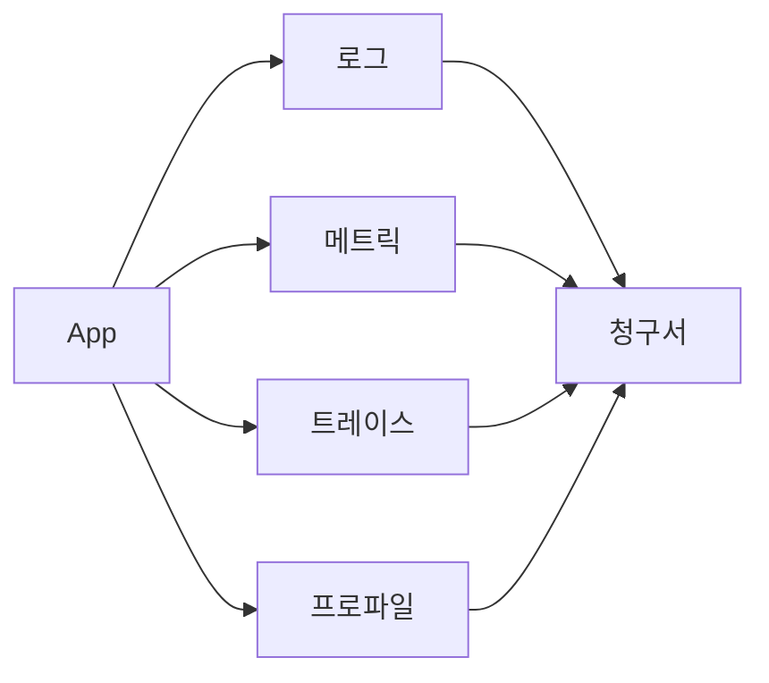
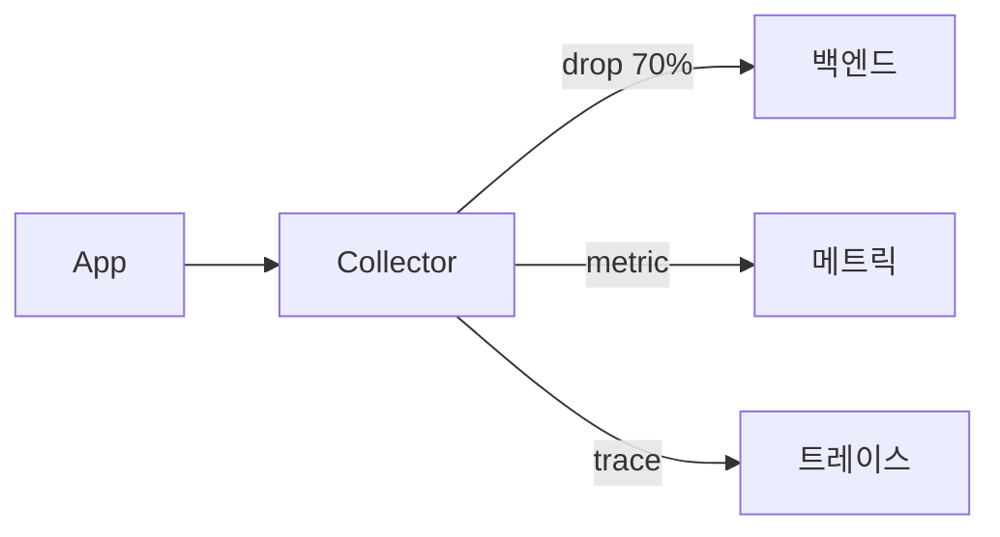
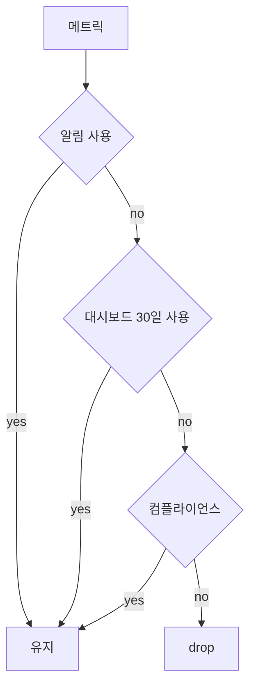

# 관측 비용

> **관측은 무료가 아니다.** Datadog 청구서 충격, Splunk·Elastic 라이선스
> 폭발은 어느 회사에나 한 번씩 온다. 관측 비용의 3 변수는 **volume**(얼마나
> 들어오나), **cardinality**(시계열 개수), **retention**(얼마나 보관).
> 셋 중 하나라도 곱셈처럼 늘면 청구서가 폭주한다. 이 글은 4 신호 별
> 비용 구조, 카디널리티·샘플링·보존 정책의 표준 패턴, 예산 알림과
> Showback/Chargeback까지 다룬다.

- **주제 경계**: 카디널리티 자체 심화는
  [카디널리티 관리](../metric-storage/cardinality-management.md), 샘플링
  알고리즘은 [샘플링 전략](../tracing/sampling-strategies.md), 로그
  파이프라인 운영은 [로그 운영 정책](../logging/log-operations.md), eBPF
  비용은 [eBPF 관측](../ebpf/ebpf-observability.md), profile 비용은
  [연속 프로파일링](../profiling/continuous-profiling.md). 이 글은 4
  신호 **공통의 비용 통제 프레임워크**.
- **선행**: [관측성 개념](../concepts/observability-concepts.md).

---

## 1. 한 줄 정의

> **관측 비용 통제**는 "신호의 볼륨·카디널리티·보존을 사용 가치에 맞게
> 조정해 청구서를 통제하는 운영 활동"이다.

- **3 변수**: volume × cardinality × retention
- **4 신호 공통**: 메트릭·로그·트레이스·프로파일
- **목표**: 가시성 손실 없이 20~50% 절감 (업계 표준 절감 폭)

---

## 2. 비용은 어디서 폭발하는가



| 신호 | 전형적 비중 | 주요 비용 driver |
|---|---|---|
| **로그** | **50%+** | volume·retention. raw 텍스트, 압축률 |
| **메트릭** | 20~30% | **카디널리티** (시계열 수) |
| **트레이스** | 10~20% | volume (head sampling 후), 인덱스 |
| **프로파일** | 5~10% | 노드 수 × 보존 |
| **RUM·Synthetic** | < 5% | check 수 × region |

> **로그가 1순위 절감 대상**: 50% 이상이면서 **정보 밀도가 낮음**(중복·
> 무관 noise 다수). 메트릭 카디널리티는 *기하급수적*으로 폭발 가능 —
> 한 labels 잘못 더하면 하루 만에 청구서 5배.

---

## 3. 메트릭 — 카디널리티가 결정

### 3.1 카디널리티 폭발 시나리오

| 메트릭 | 라벨 | 시계열 수 |
|---|---|---|
| `http_requests_total` | `service`(20) × `endpoint`(50) × `status`(5) | 5,000 |
| 위 + `user_id` (10K active) | × 10,000 | **5천만** |
| 위 + `request_id` (per-request) | unbounded | **무한** |

> **고cardinality 라벨 금지 1순위**: `user_id`, `request_id`, `trace_id`,
> `email`, `ip`, 자유 텍스트 path, timestamp. 대신 **attribute** 또는
> exemplar로 처리.

### 3.0 실제 폭발 사례 — Top 4

| 사례 | 원인 | 교정 |
|---|---|---|
| **HTTP 미들웨어가 path 정규화 안 함** | `/users/123/orders/456` 등 ID 그대로 라벨 | route template (`/users/:id/orders/:id`) |
| **kube-state-metrics 모든 pod label** | autoscale·deploy로 pod 라벨 폭발 | `metric_relabel`로 사용 라벨만 keep |
| **Kafka consumer/topic/partition 모두 라벨** | partition 수 × consumer × topic | partition 라벨 drop, topic 단위로만 |
| **gRPC method를 다이나믹 strings로** | gRPC reflection 기반 자동 계측 | 메서드 이름 enum 화이트리스트 |

### 3.2 통제 패턴

| 기법 | 효과 |
|---|---|
| **drop 규칙** | scrape 시점에 라벨 제거 (`metric_relabel_configs`) |
| **recording rule aggregation** | high-cardinality → low-cardinality 사전 집계 |
| **endpoint long-tail bucketing** | `path="/api/v1/users/{id}"` 정규화, 그 외 `/other` |
| **Native Histogram** | classic dense bucket 대신 ([Native·Exponential](../metric-storage/exponential-histograms.md)) |
| **active series limit** | per-tenant 한도 + 알림. Mimir·VictoriaMetrics, Prometheus Agent mode `queue_config` |
| **Exemplar** | trace 정보를 라벨이 아닌 exemplar로 |
| **Adaptive Metrics** | 사용 안 하는 시계열을 자동 식별·aggregate (Grafana Cloud·Mimir) |

자세한 cardinality 통제는 [카디널리티 관리](../metric-storage/cardinality-management.md).

---

## 4. 로그 — volume × retention

### 4.1 분류 → 처리

| 카테고리 | 보존 | 처리 |
|---|---|---|
| **audit** (보안·컴플라이언스) | 7년 등 법적 요구 | cold object store, 압축 |
| **error/warning** | 30~90일 hot, 1년 cold | full 인덱스 |
| **info (business critical)** | 14~30일 hot | 인덱스 + 검색 |
| **debug** | 1~3일 (또는 disable in prod) | 임시 활성, drop 빠르게 |
| **access log** | 7~30일 | 샘플링 + aggregated 메트릭으로 변환 |

> **debug 로그 prod 비활성**: 디버깅 시 임시 활성 → 트래픽 따라 5~10× 폭증.
> 평소는 disable. dynamic log level 권장.

### 4.2 hot vs warm vs cold

| 단계 | 응답 | 단가 | 사용 |
|---|---|---|---|
| **hot** | 즉시 (ms) | 가장 비쌈 | 최근 ~14일 |
| **warm** | 분~십 초 | 중간 | 14~90일 |
| **cold** (S3·GCS) | 시간 | 낮음 | 90일~7년 |

> **30~50% 절감**: hot retention을 14일로 자르고 외에는 cold object store.
> Loki는 default가 **TSDB shipper(Single Store)** — chunk와 인덱스 모두
> object storage라 별도 NoSQL 의존이 없어 hot SSD 비용 거의 제거.
> Elastic 기반 환경의 hot SSD가 1순위 절감 대상.

### 4.3 first-mile 처리 — 보내기 전에 줄임



| 처리 | 효과 |
|---|---|
| **filter** | 무관 noise (헬스체크 200) drop |
| **sample** | INFO의 1%만 보존 |
| **aggregate** | access log → request rate 메트릭으로 |
| **transform** | PII 제거, 라벨 정규화 |

OTel Collector·Alloy·Vector·Fluent Bit 모두 first-mile 가능. 자세히는
[로그 파이프라인](../logging/log-pipeline.md).

### 4.4 Observability Pipeline 카테고리 (2024~2026)

전용 SaaS·OSS도 등장:

| 도구 | 모델 | 특징 |
|---|---|---|
| **Cribl Stream** | SaaS·on-prem | log routing·shaping·enrichment 표준 |
| **Edge Delta** | SaaS | edge에서 aggregate, 메트릭 변환 |
| **Grepr** | SaaS | log dedup·summarization 자동화 |
| **Mezmo (LogDNA)** | SaaS | log 중심, 변환·라우팅 |

> **OTel Collector + Vector vs 전용 pipeline**: 자유도와 비용은 OSS,
> 운영 부담 줄이려면 전용 SaaS. 대규모 로그(수 TB/일+)에서 가치 큼.

---

## 5. 트레이스 — head + tail 결합

### 5.1 head sampling

| 비율 | 사용 |
|---|---|
| 100% | dev·staging |
| 1~10% | 일반 production |
| 0.1% | 초고-traffic edge |

> **head 단점**: 결정 시점엔 **아직 에러도 모름**. 1% sample이면 99%의
> 에러 trace 손실.

### 5.2 tail sampling — Collector

| 정책 | 효과 |
|---|---|
| `errors` | 에러 status 100% 보존 |
| `latency > 1s` | 슬로우 trace 100% |
| `random` | 1~5% baseline |
| `composite` | 위를 OR로 결합 |

> **80~90% 볼륨 절감 + 디버깅 가치 보존**: tail sampling이 표준. Collector
> stage 분리 + load-balancing exporter 필요 ([OTel 개요 §9.3](../cloud-native/opentelemetry-overview.md#93-tail-sampling--load-balancing-exporter-패턴)).

> **인프라 비용 트레이드오프**: tail은 30s~1m 동안 trace 전체를 메모리
> 버퍼링 — Collector 메모리·CPU 비용 ↑. 또한 같은 trace의 모든 span이
> 같은 second-stage replica로 가야 해 **2-tier Collector + load-balancing
> exporter** 필수 → 운영 복잡도·인프라 비용 증가. SaaS 청구액 절감 vs
> 자체 인프라 비용 증가 균형을 보고 결정.

### 5.3 spanmetrics 변환

| 변환 | 결과 |
|---|---|
| trace → RED 메트릭 (Connector) | 메트릭 1개로 모든 trace 요약 |
| trace는 sample 보존 | 비용 동시 절감 |

---

## 6. 프로파일 — 보존·라벨 통제

| 영역 | 표준 |
|---|---|
| 샘플링 주파수 | 도구별 기본값: **Parca 19Hz** (prime, sync 회피) · **Pyroscope 100Hz** · **eBPF perf 99Hz** ([연속 프로파일링 §8.3](../profiling/continuous-profiling.md#83-비용-가이드)) |
| 보존 | raw 7일 + aggregated 90일 |
| 라벨 | service-level만, request_id·user_id 금지 |
| 노드 수 | 모든 노드 + 인터프리터 unwinder는 추가 메모리 |

> **프로파일은 비용 작아 보이지만 노드 수에 비례**: 1만 노드 + Pixie =
> ~10TB raw 메모리 (별도 풀 권장).

---

## 7. SaaS vs 자체 호스팅 — TCO 비교

| 측면 | SaaS (Datadog·NewRelic·Splunk) | 자체 호스팅 (Mimir·Loki·Tempo·Pyroscope) |
|---|---|---|
| **시작 비용** | 낮음 — 가입만 | 높음 — 셋업·운영 |
| **스케일 비용** | volume 비례, 곱셈식 폭발 | infrastructure 비례, 선형 |
| **운영 부담** | 낮음 | 높음 — SRE 팀 필요 |
| **vendor lock-in** | 높음 | 낮음 (OTel) |
| **데이터 출처** | 일부 SaaS는 데이터 소유권 모호 | 전적 소유 |
| **컴플라이언스** | data residency 한계 | 자유 |
| **break-even point** | 100GB~10TB/일 (변수에 따라) | 그 이상 |

> **break-even은 변수가 많다**: 신호 종류(메트릭 카디널리티 vs 로그 볼륨),
> region 수, SRE 인건비, 컴플라이언스 요건에 따라 달라진다. **고cardinality
> 메트릭이 많으면 일찍 SaaS가 비싸지고**, **로그·트레이스가 단순 대량이면
> SaaS가 더 오래 합리적**. 분기마다 재계산.

> **현실 권장 가이드**: 작은~중간 규모는 SaaS, 대규모(>500GB/일)는 자체
> 호스팅. ClickHouse 기반 Loki·자체 Mimir는 1TB/일 기준 SaaS 대비 60~80%
> 저렴 사례 다수.

---

## 8. 예산·알림 — FinOps 표준 패턴

### 8.1 budget 설정

| 단위 | 예 |
|---|---|
| 월 USD 한도 | $50K/월 |
| 신호별 한도 | logs $30K, metrics $15K, traces $5K |
| 팀별 한도 | payments-team 월 $10K |
| 서비스별 한도 | checkout 월 $2K |

### 8.2 burn 알림

```yaml
# Prometheus 자체 호스팅 — 수집량 기반
- alert: ObservabilityBudgetBurn
  expr: |
    sum by (tenant) (rate(prometheus_tsdb_head_samples_appended_total[1h]))
      > 50000  # samples/s
  labels: { severity: warning }

# SaaS — Datadog estimated usage 메트릭 (직접 청구액은 별도 Cost API로)
# 예: APM ingested bytes·indexed spans
# Datadog monitor 표현(PromQL과 별개): avg:datadog.estimated_usage.apm.ingested_bytes{*}
```

> **SaaS 청구액 메트릭 주의**: Datadog의 estimated usage는
> `datadog.estimated_usage.<product>.<metric>` 형식 (예: `apm.ingested_bytes`,
> `apm.indexed_spans`). 실제 dollar 단위 청구액은 SaaS의 **Cost
> Management API**로 별도 조회 — Prometheus 메트릭으로는 ingested_bytes
> 같은 사용량 proxy를 보고 자체 단가표로 환산이 표준.

| 알림 | 의미 |
|---|---|
| **ingestion rate** | 시계열·log line 초당 |
| **active series count** | 메트릭 카디널리티 |
| **budget consumed** | 월 한도 대비 % |
| **forecast (predict_linear)** | 이 추세로 월말 도달 예상 |

### 8.3 Showback / Chargeback

| 모델 | 설명 |
|---|---|
| **Showback** | 팀별 사용량 보고만 — "당신 팀이 얼마 썼다" |
| **Chargeback** | 실제 비용을 팀 예산에 청구 |
| 라벨 | `team`, `service`, `cost_center` 필수 |
| 도구 | Grafana 대시보드, 자체 데이터 + Cloudability·Apptio 통합 |

> **Showback이 1차 단계**: 갑자기 chargeback 도입 시 팀의 백래시.
> "당신 팀이 월 $X를 썼고 cardinality top contributor"를 보여주면
> 팀이 자율로 줄임.

---

## 9. 1주 cleanup — 즉시 효과 큰 항목

| 항목 | 평균 절감 |
|---|---|
| 1년+ idle dashboard·alert 룰 제거 | 메트릭 5~15% |
| INFO 로그 1% 샘플링 또는 drop | 로그 30~50% |
| `_total` _bucket 미사용 prefix drop | 메트릭 5~10% |
| classic histogram → Native | 메트릭 20~40% |
| trace head 100% → 10% + tail | trace 80%+ |
| debug log prod off | 로그 10~30% |
| dead `target_info` (사라진 pod) | 메트릭 ~5% |
| log structured (JSON) → 더 나은 압축 | 로그 10~30% |

> **첫 sprint goal**: 로그 INFO 샘플링·debug 비활성·미사용 dashboard
> 제거만으로 **20~30% 절감**.

---

## 10. 메트릭 — 어떤 것은 살리고 어떤 것은 죽이나



| 사용 | 처리 |
|---|---|
| 알림에 사용 | 반드시 유지 |
| 대시보드에서 30일+ 조회 | 유지 |
| 컴플라이언스 (감사·SOX 등) | 유지 |
| 그 외 | drop 후보 |

> **Prometheus `/api/v1/query`·`/metadata`로 사용량 조사**: 어떤 메트릭이
> 알림·대시보드에서 참조되는지 lint. 30일 미참조면 drop 후보.

---

## 11. 안티패턴

| 안티패턴 | 결과 | 교정 |
|---|---|---|
| 모든 로그 hot retention 90일 | 비용 폭발 | tier 분리 (hot 14d / warm 90d / cold 1y) |
| 라벨에 user_id·request_id | 카디널리티 폭발 | exemplar·attribute로 |
| classic histogram dense bucket | 시계열 폭증 | Native Histogram |
| head sampling만 1% | 에러 99% 손실 | tail sampling 추가 |
| 모든 endpoint 30s synthetic | 운영 비용 폭주 | critical 5개 + 1m |
| Datadog 무제한 metric submission | hidden custom metric 비용 | metric.submit 제한·tag 한도 |
| log 모든 필드 json 인덱스 | Elastic disk 폭발 | 인덱스 필드 화이트리스트 |
| dead alert 룰·dashboard 누적 | 미사용 resource 평가 비용 | 분기 cleanup |
| profile을 모든 노드에 무차별 | 메모리·storage 폭증 | critical 노드 + Pixie 별도 풀 |
| budget 알림 없이 운영 | 청구서 충격 | predict_linear forecast |
| FinOps 라벨 없이 (`team`·`cost_center`) | 누가 썼는지 모름 | 라벨 표준 |
| SaaS 사용량 dashboard 없이 | invoice 받기 전 모름 | 일별 메트릭 가시화 |
| log을 raw 텍스트로 보냄 | 압축률·검색 비효율 | 구조화(JSON), 적절한 schema |
| recording rule 없이 raw로 SLO | 평가 부하 | recording rule 우선 |
| `for: 0` 즉발화 알림 | 평가 빈도 폭주 | `for: 5m+` |

---

## 12. 운영 체크리스트

- [ ] 신호별 월 budget 명시 (logs·metrics·traces·profiles 분리)
- [ ] budget burn 알림 (실제 사용 + forecast)
- [ ] 메트릭: 카디널리티 limit, drop 룰, Native Histogram
- [ ] 로그: hot 14d / warm 90d / cold 1y tier
- [ ] 로그: INFO 샘플링·debug prod off
- [ ] 트레이스: head 1~10% + tail (errors·slow·random)
- [ ] 프로파일: 보존 raw 7d / aggregated 90d, service-level 라벨만
- [ ] FinOps 라벨 (`team`·`service`·`cost_center`) 강제 — K8s recommended labels(`app.kubernetes.io/part-of` 등)·OpenCost와 정합
- [ ] Showback dashboard — 팀별 비용 가시화
- [ ] 분기 cleanup — 미사용 dashboard·alert·메트릭 제거
- [ ] dead `target_info` (사라진 pod) cleanup
- [ ] SaaS 사용 시 budget alert + tag 한도
- [ ] 자체 호스팅: TCO vs SaaS 분기마다 재평가
- [ ] log structured (JSON), 적절한 schema·압축
- [ ] first-mile 처리 (Collector·Alloy filter·sample)

---

## 참고 자료

- [Codelit — Observability Cost Optimization](https://codelit.io/blog/observability-cost-optimization) (확인 2026-04-25)
- [byteiota — Why Datadog Bills Explode](https://byteiota.com/observability-costs-2026-why-datadog-bills-explode-fix/) (확인 2026-04-25)
- [Opsolute — Cost-Intelligent Monitoring](https://opsolute.io/blog/cost-intelligent-monitoring-complete-guide) (확인 2026-04-25)
- [Mezmo — Observability Cost Reduction](https://www.mezmo.com/learn-observability/observability-cost-reduction-a-practical-guide) (확인 2026-04-25)
- [ClickHouse — Observability TCO](https://clickhouse.com/resources/engineering/observability-tco-cost-reduction) (확인 2026-04-25)
- [Grepr — Hidden Cost in Observability](https://www.grepr.ai/blog/the-hidden-cost-in-observability) (확인 2026-04-25)
- [Uptrace — Observability Tools Pricing 2026](https://uptrace.dev/comparisons/observability-tools-pricing) (확인 2026-04-25)
- [Atatus — Lower IT Costs with Observability](https://www.atatus.com/blog/ways-to-reduce-it-costs-with-observability/) (확인 2026-04-25)
