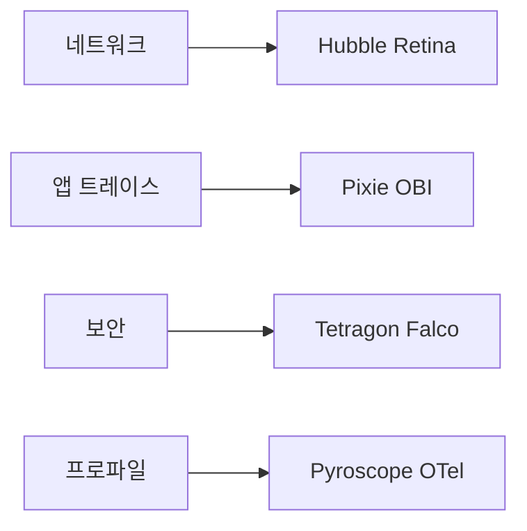
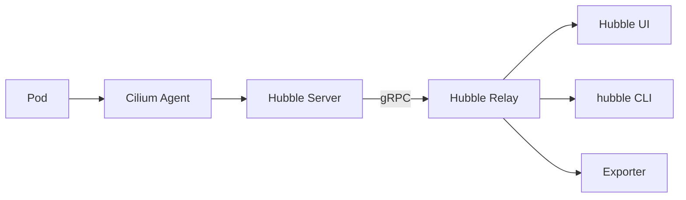
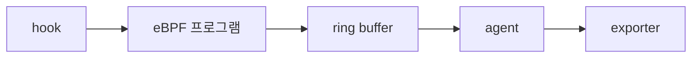
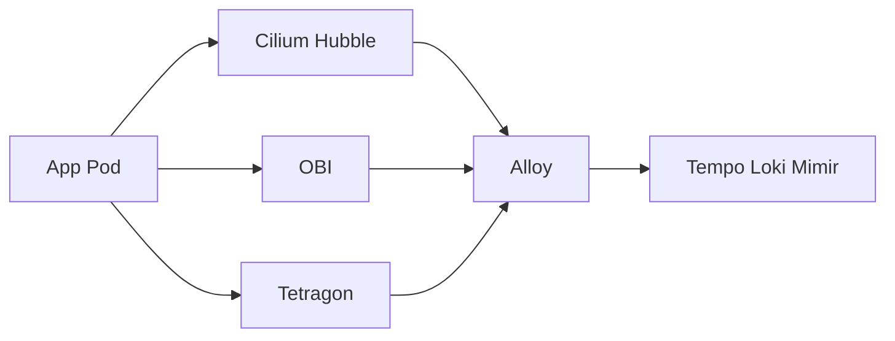

# eBPF 관측

> **재컴파일·재배포 없이 커널에서 신호를 추출.** SDK·사이드카·로그 파싱
> 으로 잡지 못하던 L3~L7 네트워크 흐름, 시스템 콜, 보안 이벤트를 **kernel
> hook**으로 직접 본다. 2026 시점 표준은 **Cilium + Hubble (네트워크)
> + Tetragon (보안) + OBI/Pixie (앱 트레이스)**이며, 모든 데이터를 OTel
> Collector로 통합하는 패턴이 주류다.

- **주제 경계**: 이 글은 **관측성 응용으로서의 eBPF**를 다룬다. eBPF
  커널 측면(verifier·맵·프로그램 종류)은 [linux/eBPF](../../linux/ebpf.md),
  네트워크 데이터 플레인 자체는 [Cilium·Calico](../../network/cni-cilium.md),
  Service Mesh 비교는 [Service Mesh](../../network/service-mesh.md), eBPF
  기반 프로파일링은 [연속 프로파일링](../profiling/continuous-profiling.md),
  자동 계측은 [OTel Operator](../cloud-native/otel-operator.md), 보안
  활용은 [security/runtime-security](../../security/runtime-security.md).
- **선행**: [관측성 개념](../concepts/observability-concepts.md), Linux
  network 기본.

---

## 1. 왜 eBPF로 관측하는가

| 기존 방법 | 한계 | eBPF의 답 |
|---|---|---|
| **사이드카** | 메모리·CPU·latency 5~15%, 운영 부담 | proxy-less |
| **SDK 자동 계측** | 언어별 적용·재배포 필요 | 모든 프로세스 자동 |
| **kube-proxy iptables** | 1000+ 서비스에서 cpu·룰 폭발 | bpf map O(1) |
| **NetFlow·sFlow** | 샘플링·집계 정보 | **모든 패킷의 정확 메타** |
| **로그 grep으로 보안** | 사후 분석 | 커널 hook로 실시간 + 차단 |

> **eBPF의 본질**: kernel에 **검증된 sandbox 코드**를 삽입해 hook 발생
> 시 사용자 영역으로 이벤트를 보낸다. verifier가 통과시킨 코드만 실행 →
> kernel 안전성 보장 (이론상). 자세한 내부는 [linux/eBPF](../../linux/ebpf.md).

> **언제 안 쓰는가**: 커널 4.18+ 미지원 환경, 멀티테넌트 host에서 권한
> 분리 어려움, 디버깅 시 기존 도구(`tcpdump`)가 답이 더 빠를 때.

---

## 2. 4대 활용 — 카테고리별 도구 매트릭스



| 영역 | 신호 | 대표 도구 |
|---|---|---|
| **네트워크 가시성** | flow 메타·DNS·L7 | **Cilium Hubble**, **Microsoft Retina** |
| **앱 자동 트레이스** | HTTP/gRPC/DB 메서드 추적 | **Pixie**, **OBI** (OTel eBPF Instrumentation), **Beyla** (구) |
| **보안 관측·차단** | execve, file open, network connect | **Tetragon**, **Falco** |
| **연속 프로파일링** | CPU·heap·off-CPU | **Pyroscope eBPF**, **Parca**, **OTel eBPF profiler** |

> **표준 조합 (2026)**: Cilium + Hubble + Tetragon + (OBI 또는 Pixie) +
> Pyroscope. 모든 신호를 OTel Collector·Alloy로 받아 백엔드 통일.

---

## 3. Cilium Hubble — 네트워크 관측의 표준

### 3.1 무엇

Cilium은 eBPF 기반 K8s **CNI + service mesh + 네트워크 보안** 플랫폼
(CNCF Graduated, 2023). **Hubble**은 Cilium 위에 얹는 **관측 레이어** —
모든 패킷의 메타데이터(서비스·identity·정책)를 추출해 노출.

### 3.2 아키텍처



| 컴포넌트 | 역할 |
|---|---|
| **Cilium Agent** | 노드별 DaemonSet — eBPF 데이터 플레인 |
| **Hubble Server** | agent에 내장, gRPC API 노출 |
| **Hubble Relay** | 클러스터 전체 stream을 한 endpoint로 aggregate |
| **Hubble UI** | service map·flow viewer (browser) |
| **`hubble` CLI** | flow 쿼리, JSON export |
| **Exporter** | flow을 OTLP·Loki·Kafka로 |

### 3.3 무엇을 보는가

| 신호 | 예 |
|---|---|
| **L3/L4 flow** | src·dst pod·service·node, port, protocol, verdict (forward/drop) |
| **identity** | k8s namespace·label·service account·external CIDR — IP가 아닌 **identity 단위** |
| **DNS** | resolve된 도메인·응답 코드, NXDOMAIN |
| **L7 meta** | HTTP method·path·status, gRPC method·code, Kafka topic, mTLS 정보. **opt-in** — L7 NetworkPolicy 또는 Pod annotation으로 활성화한 트래픽만 디코드 |
| **Network policy verdict** | 어느 룰이 어떤 결정으로 drop했는지 |

### 3.4 Hubble CLI — 주요 명령

```bash
# 실시간 flow stream
hubble observe --follow

# 특정 namespace 트래픽
hubble observe --namespace prod

# DROP만
hubble observe --verdict DROPPED

# DNS 쿼리만
hubble observe --type "trace:dns"

# L7 HTTP 메서드별
hubble observe --protocol http --http-method POST
```

### 3.5 service map · 시각화

| 화면 | 의미 |
|---|---|
| **Service Map** | namespace·service 단위 connectivity graph, 시간축 따라 변화 |
| **Network Policy Editor** | UI에서 정책 작성 + 적용 전 verdict 미리 보기 |
| **Flow log** | timestamp·서비스·verdict 표 |

### 3.6 메트릭 export

Hubble은 자체 Prometheus exporter를 제공 — 카테고리별 메트릭으로
**카디널리티 폭발 방지**가 중요.

```yaml
# Helm
hubble:
  enabled: true
  metrics:
    enabled:
      - dns:query;ignoreAAAA
      - drop
      - tcp
      - flow
      - port-distribution
      - icmp
      - http:exemplars
```

> **카디널리티 함정**: `flow` 메트릭에 `source_pod` label 포함 시 pod 재시작·
> autoscale로 series 폭발. 디폴트는 service·workload 단위, pod 라벨은
> off가 표준.

---

## 4. Microsoft Retina — Hubble을 어디서나

| 측면 | 내용 |
|---|---|
| 정의 | **Cilium 없이도** Hubble 컨트롤 플레인을 사용 가능하게 하는 OSS |
| 거버넌스 | Microsoft, Apache 2.0 |
| 지원 | 모든 CNI (Cilium·Calico·Flannel·AKS), Linux + **Windows 노드** |
| 출처 | Hubble을 Cilium 의존성에서 분리하려는 시도 |
| 강점 | 멀티 OS·멀티 CNI, AKS·EKS·GKE 모두 동일 UX |

> **선택 기준**:
> - Cilium 사용 중 → Hubble을 그대로
> - 다른 CNI 또는 Windows 노드 포함 → **Retina**
> - 표준 Hubble UI·CLI·메트릭은 동일

---

## 5. Pixie — 앱 트레이스 자동화

### 5.1 무엇

| 측면 | 내용 |
|---|---|
| 정의 | eBPF로 HTTP/1.1·HTTP/2·gRPC·MySQL·PostgreSQL·Redis·Kafka 등 **wire format을 자동 디코드** |
| 거버넌스 | New Relic 산하, CNCF Sandbox |
| 캡처 방식 | uprobes·kprobes — **req/resp body까지** 일정 기간 buffer |
| 장점 | 코드 수정 0, 즉시 RED 메트릭 + raw 페이로드 |
| 단점 | 노드당 ~8GB 메모리 buffer, 보존은 짧음 |

### 5.2 PxL 쿼리 언어

```python
# CPU·메모리 상위 pod
df = px.DataFrame(table='process_stats', start_time='-5m')
px.display(df.head(10))

# HTTP latency 분포
df = px.DataFrame(table='http_events', start_time='-5m')
df.latency = df.latency / 1e6  # ms
px.display(df.groupby('service').agg(p99=('latency', px.quantile(0.99))))
```

> **운영 권장**: Pixie는 **on-demand 디버깅 도구**로 사용. 상시 RED는
> Hubble L7 또는 OBI/Pixie 메트릭 수집 + Pixie raw 데이터는 30~60s 보존.

---

## 6. OBI — OpenTelemetry eBPF Instrumentation

OTel SIG가 진행 중인 **재컴파일 없이 OTel SDK 효과**를 주는 도구.

| 측면 | 내용 |
|---|---|
| 출처 | Grafana **Beyla** 기증 → OTel `obi` 프로젝트 (**2025-05** GrafanaCON 발표·기증, 2025-07 First Release Alpha) |
| 동작 | uprobes로 HTTP·gRPC·DB 호출의 진입·종료 추적, OTel span으로 emit |
| 출력 | **OTLP 표준 trace·metric** — 백엔드는 Tempo/Jaeger/SaaS 그대로 |
| 상태 | **2026 KubeCon EU에서 Beta**, 1.0 GA 진행 중 |
| 장점 | SDK 통합 없음. 모든 언어 (Go·Java·Python·Node·.NET·Ruby·Rust) |
| 단점 | 비즈니스 단계 span은 안 만듦 — 인프라 hop만 |

> **OBI vs Pixie 결정**: Pixie는 Pixie 자체 백엔드와 PxL 쿼리. OBI는
> **OTel 표준 그대로** Tempo·Jaeger로. **이미 OTel 백엔드가 있으면 OBI**가
> 자연스러운 통합. Pixie는 깊은 raw payload 분석이 필요한 디버깅에 강함.

> **표준 hybrid 토폴로지**: OBI로 **인프라 hop span 자동**, 핵심 비즈니스
> path만 **SDK manual span**으로 보강. Grafana 공식이 권장하는 패턴 —
> 자동·수동의 합. 중복 계측은 안티패턴 (12장).

---

## 7. Tetragon — 보안 관측·차단

| 측면 | 내용 |
|---|---|
| 정의 | eBPF로 **process·file·network·privilege escalation** 이벤트 추적 + 정책 기반 차단 |
| 거버넌스 | **Cilium의 sub-project** (Cilium은 CNCF Graduated, 2023). Tetragon 자체는 별도 maturity level 부여받지 않음 |
| 정책 | `TracingPolicy` / `TracingPolicyNamespaced` CRD로 hook과 reaction 선언 |
| 차이점 (Falco 비교) | Falco는 탐지·알림 중심 (modern_ebpf driver는 커널측 처리). Tetragon은 **탐지 + enforce** (SIGKILL, override return code) 가능, K8s identity-aware |
| 출력 | flow와 같은 JSON event, OTel·SIEM 연계 |

자세히는 [security/runtime-security](../../security/runtime-security.md).

---

## 8. eBPF 비용·오버헤드



| 영역 | 비용 |
|---|---|
| Cilium Agent | ~200MB RAM, ~0.1 CPU per node (CNCF 통계) |
| Hubble Relay | ~128MB RAM, ~0.05 CPU |
| Pixie | **~2~4Gi RAM** per node (vizier-pem 디폴트 limit 2Gi, ~60%를 데이터 buffer로). `pemMemoryLimit`로 조정 |
| Tetragon | ~50MB RAM, ~0.05 CPU |
| OBI | ~80MB RAM per node |

> **노드 메모리 회계**: Pixie 디폴트 limit 2Gi × 노드 수. 큰 클러스터·
> 깊은 buffer 필요 시 4~8Gi까지 늘려 쓰는 운영 사례도 있음. 작은 노드는
> `pemMemoryLimit` 축소 또는 별도 Pixie 전용 노드풀.

---

## 9. 카디널리티·라벨 정책

eBPF는 **모든 flow를 보기** 때문에 메트릭으로 export 시 카디널리티
폭발이 1순위 함정.

| 라벨 | 권장 |
|---|---|
| `source_namespace`·`destination_namespace` | OK |
| `source_workload`·`destination_workload` | OK |
| `source_app`·`destination_app` (label-based) | OK |
| `verdict` | OK |
| `dns_query` | 도메인이 사용자 콘텐츠 포함 시 카디널리티 폭발 — top-K aggregation |
| `source_pod`·`destination_pod` | autoscale 환경에서 폭발 — workload 단위로 |
| `source_ip`·`destination_ip` | 외부 트래픽 시 인터넷 IP만큼 폭발 — `source_ip` off |
| `http_path` | path가 user_id 포함 시 폭발 — path normalize |

---

## 10. K8s 통합 패턴 — 표준 토폴로지



| 컴포넌트 | 신호 |
|---|---|
| Cilium + Hubble | 네트워크 flow·L7·DNS |
| OBI (또는 Pixie) | 앱 trace·metric (OTel 표준) |
| Tetragon | 보안 event |
| Pyroscope eBPF | 프로파일 |
| Alloy / Collector | 통합·OTLP로 표준화 |
| Tempo·Loki·Mimir | 백엔드 |

---

## 11. 보안·권한

| 항목 | 권장 |
|---|---|
| **CAP_BPF** | 최신 커널은 root 대신 capability 기반 — privileged 회피 |
| **Pod Security** | eBPF agent는 host privileges 필요 — restricted 프로파일 외 |
| **NetworkPolicy** | Hubble Relay·UI 노출은 internal only |
| **kernel 버전** | 실질 하한 **5.4+** (Cilium L7·DNS·exemplar). **5.10+ 권장** (BTF + ring buffer 안정). 4.18은 BTF/CO-RE 비실용적 — Hubble 고급 기능 거의 못 씀 |
| **이미지 무결성** | cosign 검증 |
| **read-only filesystem** | agent도 가능 (data dir만 mount) |
| **multi-tenant 호스트** | eBPF는 host 전역 — tenant isolation 약함, **CSP 베어메탈/단일 테넌트 노드 권장** |

> **eBPF 자체는 호스트 보안에 영향 적음** — verifier가 invariant 보장.
> 하지만 **이벤트 데이터에는 모든 syscall·플로우가 노출** → SIEM·로그
> 백엔드의 access 제어가 강해야 한다.

> **멀티테넌트 격리가 약한 이유**: eBPF 프로그램은 host kernel에 attach
> 된다. 한 tenant의 agent가 host 전체 syscall·flow를 본다 — 다른 tenant의
> 트래픽 메타까지. **노드 단위로 tenant 분리** (single-tenant node pool)
> 가 표준.

> **공급망 보안**: cilium·tetragon·pixie 모두 cosign 서명 제공. admission
> webhook(Kyverno·Connaisseur)으로 unsigned 이미지 차단 강제 — host
> privileges 도구라 침해 시 영향 막대.

---

## 12. 안티패턴

| 안티패턴 | 결과 | 교정 |
|---|---|---|
| Pixie를 모든 노드에 무차별 배포 + memory limit 미조정 | 노드 메모리 잠금 | `pemMemoryLimit` 조정 또는 별도 노드풀 |
| Hubble flow 메트릭에 `source_pod` 활성 | 카디널리티 폭발 | workload 단위 |
| 전체 DNS 쿼리를 Loki로 raw 전송 | 비용·user 도메인 노출 | top-K aggregation |
| Tetragon enforcement를 dev 검증 없이 prod | 의도 외 프로세스 kill | dry-run 충분히 |
| Cilium + 다른 CNI 동시 | 라우팅 충돌 | 단일 CNI |
| Hubble UI 인증 없이 노출 | trace·flow 누구나 조회 | OAuth proxy + IP 제한 |
| eBPF agent 메모리 limit 너무 빠듯 | OOMKill → 관측 단절 | 헤드룸 30%, 알림 |
| Beyla·OBI dual 운용 | 메트릭 중복 | 하나로 통일 |
| Pyroscope eBPF·Parca 동시 | 같은 host CPU 두 번 | 하나로 |
| L7 visibility를 모든 트래픽에 | sidecar 없는 mTLS는 디코드 불가 | mTLS proxy 또는 trusted CA mount |
| identity-aware 정책 없이 IP만 | 클라우드 환경에서 IP 변동 | identity 기반 |
| eBPF 프로그램을 kernel 4.x에 | verifier 비호환 | 5.10+ 강제 |

---

## 13. 운영 체크리스트

- [ ] kernel 5.4+ 실질 하한, 5.10+ 권장 + BTF 제공 (Ubuntu 22.04+, RHEL 9+)
- [ ] Hubble L7 visibility는 NetworkPolicy/annotation으로 명시 활성화
- [ ] Hubble Relay replicaCount + flow buffer 사이즈, OOM 알림
- [ ] Cilium + Hubble 표준 (또는 다른 CNI + Retina)
- [ ] Hubble metric 라벨은 workload 단위, pod·IP 라벨 off
- [ ] DNS 메트릭은 top-K, raw query는 짧은 보존
- [ ] Tetragon enforcement는 staged rollout (alert → dry-run → enforce)
- [ ] Pixie는 별도 노드풀 또는 on-demand
- [ ] OBI 또는 Pyroscope eBPF 중 하나로 통일
- [ ] Hubble UI·Pixie UI 인증·IP 제한
- [ ] OTel Collector/Alloy로 신호 통합
- [ ] 백엔드 access 제어 (eBPF 데이터에 syscall·payload 포함)
- [ ] eBPF agent OOM·crash 알림
- [ ] 멀티 테넌트 host에서 eBPF 사용은 신중

---

## 참고 자료

- [Cilium 공식](https://cilium.io/) (확인 2026-04-25)
- [Hubble GitHub README](https://github.com/cilium/hubble) (확인 2026-04-25)
- [Hubble Cheatsheet (Isovalent)](https://isovalent.com/blog/post/cilium-hubble-cheat-sheet-observability/) (확인 2026-04-25)
- [Microsoft Retina](https://retina.sh/) (확인 2026-04-25)
- [Microsoft Retina GitHub](https://github.com/microsoft/retina) (확인 2026-04-25)
- [Tetragon 공식](https://tetragon.io/) (확인 2026-04-25)
- [Pixie 공식](https://docs.pixielabs.ai/) (확인 2026-04-25)
- [OTel eBPF Instrumentation (OBI)](https://github.com/open-telemetry/opentelemetry-ebpf-instrumentation) (확인 2026-04-25)
- [OBI 2026 Goals](https://opentelemetry.io/blog/2026/obi-goals/) (확인 2026-04-25)
- [Falco 공식](https://falco.org/) (확인 2026-04-25)
- [eBPF Applications Landscape](https://ebpf.io/applications/) (확인 2026-04-25)
- [Cilium TSDB Hubble Metrics](https://docs.cilium.io/en/stable/observability/metrics/) (확인 2026-04-25)
